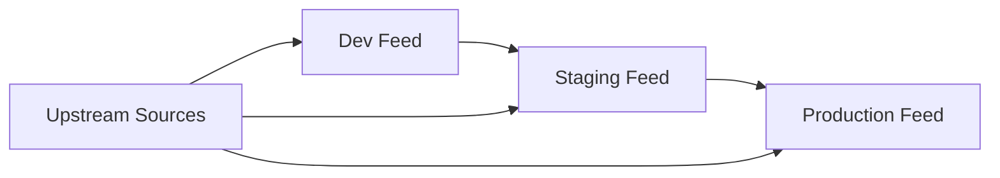

Azure Artifacts provides enterprise-grade package management capabilities integrated with Azure DevOps, supporting multiple package types and seamless CI/CD workflows.

## 🎯 **Overview**

Azure Artifacts serves as a centralized package repository that enables teams to:

- **Share code efficiently** across projects and teams
- **Manage dependencies** with version control and security
- **Integrate seamlessly** with build and release pipelines
- **Control access** with fine-grained permissions
- **Reduce external dependencies** with upstream sources

### Supported Package Types

| Package Type | Description | Use Cases |
|--------------|-------------|-----------|
| **NuGet** | .NET package manager | .NET libraries, tools, and dependencies |
| **npm** | Node.js package manager | JavaScript libraries and tools |
| **Maven** | Java package manager | Java libraries and dependencies |
| **Python** | Python package index | Python packages and wheels |
| **Universal Packages** | Generic package format | Binary files, documentation, build artifacts |

## 🏗️ **Setting Up Feeds**

### Creating Your First Feed

1. **Navigate to Artifacts**

   ```bash
   # Access via Azure DevOps portal
   https://dev.azure.com/{organization}/{project}/_artifacts
   ```

2. **Create New Feed**
   - Click **"Create Feed"**
   - Choose feed name (e.g., `company-packages`)
   - Set visibility (Organization, Project, or Specific users)
   - Configure upstream sources

3. **Feed Configuration Options**

   ```json
   {
     "name": "company-packages",
     "description": "Internal packages for the organization",
     "capabilities": {
       "supportsUpstreams": true,
       "supportedProtocols": ["NuGet", "npm", "Maven", "PyPI", "Universal"]
     },
     "upstreamSources": [
       {
         "name": "npmjs",
         "protocol": "npm",
         "location": "https://registry.npmjs.org/"
       }
     ]
   }
   ```

### Feed Permissions and Security

#### Permission Levels

- **Reader**: Download and restore packages
- **Contributor**: Upload packages and download
- **Owner**: Full control including feed settings

#### Setting Permissions

```bash
# Azure CLI example
az artifacts universal publish \
  --organization https://dev.azure.com/myorg \
  --project myproject \
  --scope project \
  --feed myfeed \
  --name mypackage \
  --version 1.0.0 \
  --description "My package description" \
  --path ./package-folder
```

## 📦 **Package Type Configurations**

### NuGet Packages

#### Publishing NuGet Packages

```xml
<!-- NuGet.Config -->
<?xml version="1.0" encoding="utf-8"?>
<configuration>
  <packageSources>
    <clear />
    <add key="company-packages" value="https://pkgs.dev.azure.com/{organization}/_packaging/{feed}/nuget/v3/index.json" />
    <add key="nuget.org" value="https://api.nuget.org/v3/index.json" protocolVersion="3" />
  </packageSources>
  <packageSourceCredentials>
    <company-packages>
      <add key="Username" value="PAT" />
      <add key="ClearTextPassword" value="{personal_access_token}" />
    </company-packages>
  </packageSourceCredentials>
</configuration>
```

```bash
# Pack and push NuGet package
dotnet pack MyLibrary.csproj --configuration Release
dotnet nuget push *.nupkg --source company-packages --api-key PAT
```

#### Consuming NuGet Packages

```xml
<!-- In your .csproj file -->
<Project Sdk="Microsoft.NET.Sdk">
  <PropertyGroup>
    <TargetFramework>net8.0</TargetFramework>
  </PropertyGroup>
  
  <ItemGroup>
    <PackageReference Include="CompanyLibrary" Version="1.2.3" />
  </ItemGroup>
</Project>
```

### npm Packages

#### Publishing npm Packages

```bash
# Configure npm registry
npm config set registry https://pkgs.dev.azure.com/{organization}/_packaging/{feed}/npm/registry/

# Authenticate with PAT
echo "@{organization}:registry=https://pkgs.dev.azure.com/{organization}/_packaging/{feed}/npm/registry/
//pkgs.dev.azure.com/{organization}/_packaging/{feed}/npm/registry/:username={organization}
//pkgs.dev.azure.com/{organization}/_packaging/{feed}/npm/registry/:_password={base64_pat}
//pkgs.dev.azure.com/{organization}/_packaging/{feed}/npm/registry/:email=npm requires email to be set but doesn't verify the address" > .npmrc

# Publish package
npm publish
```

```json
// package.json example
{
  "name": "@company/shared-utils",
  "version": "1.0.0",
  "description": "Shared utility functions",
  "main": "index.js",
  "publishConfig": {
    "registry": "https://pkgs.dev.azure.com/{organization}/_packaging/{feed}/npm/registry/"
  },
  "dependencies": {
    "lodash": "^4.17.21"
  }
}
```

#### Installing npm Packages

```bash
# Install from Azure Artifacts
npm install @company/shared-utils

# Or using yarn
yarn add @company/shared-utils
```

### Python Packages

#### Publishing Python Packages

```ini
# .pypirc configuration
[distutils]
index-servers = company-packages

[company-packages]
repository = https://pkgs.dev.azure.com/{organization}/_packaging/{feed}/pypi/upload/
username = PAT
password = {personal_access_token}
```

```bash
# Build and publish Python package
python setup.py sdist bdist_wheel
twine upload --repository company-packages dist/*
```

```python
# setup.py example
from setuptools import setup, find_packages

setup(
    name="company-utils",
    version="1.0.0",
    description="Company utility library",
    packages=find_packages(),
    install_requires=[
        "requests>=2.25.0",
        "pydantic>=1.8.0"
    ],
    python_requires=">=3.8"
)
```

#### Installing Python Packages

```bash
# pip configuration
pip config set global.index-url https://pkgs.dev.azure.com/{organization}/_packaging/{feed}/pypi/simple/
pip config set global.extra-index-url https://pypi.org/simple/

# Install package
pip install company-utils
```

### Universal Packages

#### Publishing Universal Packages

```bash
# Install Azure CLI extension
az extension add --name azure-devops

# Upload universal package
az artifacts universal publish \
  --organization https://dev.azure.com/myorg \
  --project myproject \
  --scope project \
  --feed myfeed \
  --name deployment-scripts \
  --version 1.0.0 \
  --description "Deployment automation scripts" \
  --path ./scripts/
```

#### Downloading Universal Packages

```bash
# Download universal package
az artifacts universal download \
  --organization https://dev.azure.com/myorg \
  --project myproject \
  --scope project \
  --feed myfeed \
  --name deployment-scripts \
  --version 1.0.0 \
  --path ./downloaded-scripts/
```

## 🔄 **CI/CD Pipeline Integration**

### Build Pipeline Examples

#### NuGet Build Pipeline

```yaml
# azure-pipelines.yml for NuGet
trigger:
  branches:
    include:
    - main
    - develop

variables:
  buildConfiguration: 'Release'

stages:
- stage: Build
  jobs:
  - job: BuildAndPublish
    pool:
      vmImage: 'ubuntu-latest'
    
    steps:
    - task: UseDotNet@2
      displayName: 'Use .NET 8.0'
      inputs:
        packageType: 'sdk'
        version: '8.0.x'
    
    - task: DotNetCoreCLI@2
      displayName: 'Restore packages'
      inputs:
        command: 'restore'
        feedsToUse: 'config'
        nugetConfigPath: 'NuGet.config'
    
    - task: DotNetCoreCLI@2
      displayName: 'Build solution'
      inputs:
        command: 'build'
        arguments: '--configuration $(buildConfiguration) --no-restore'
    
    - task: DotNetCoreCLI@2
      displayName: 'Run tests'
      inputs:
        command: 'test'
        arguments: '--configuration $(buildConfiguration) --no-build --collect:"XPlat Code Coverage"'
    
    - task: DotNetCoreCLI@2
      displayName: 'Pack NuGet packages'
      inputs:
        command: 'pack'
        packagesToPack: '**/*.csproj'
        configuration: '$(buildConfiguration)'
        versioningScheme: 'byBuildNumber'
    
    - task: NuGetCommand@2
      displayName: 'Push to Azure Artifacts'
      inputs:
        command: 'push'
        packagesToPush: '$(Build.ArtifactStagingDirectory)/**/*.nupkg'
        nuGetFeedType: 'internal'
        publishVstsFeed: '$(System.TeamProject)/company-packages'
```

#### npm Build Pipeline

```yaml
# azure-pipelines.yml for npm
trigger:
  branches:
    include:
    - main

variables:
  npm_config_cache: $(Pipeline.Workspace)/.npm

stages:
- stage: Build
  jobs:
  - job: BuildAndPublish
    pool:
      vmImage: 'ubuntu-latest'
    
    steps:
    - task: NodeTool@0
      displayName: 'Use Node.js 18.x'
      inputs:
        versionSpec: '18.x'
    
    - task: Cache@2
      displayName: 'Cache npm packages'
      inputs:
        key: 'npm | "$(Agent.OS)" | package-lock.json'
        restoreKeys: |
          npm | "$(Agent.OS)"
        path: $(npm_config_cache)
    
    - task: npmAuthenticate@0
      displayName: 'Authenticate with Azure Artifacts'
      inputs:
        workingFile: '.npmrc'
        customEndpoint: 'company-packages'
    
    - script: |
        npm ci
      displayName: 'Install dependencies'
    
    - script: |
        npm run build
      displayName: 'Build package'
    
    - script: |
        npm run test
      displayName: 'Run tests'
    
    - script: |
        npm publish
      displayName: 'Publish to Azure Artifacts'
      condition: and(succeeded(), eq(variables['Build.SourceBranch'], 'refs/heads/main'))
```

### Release Pipeline Integration

```yaml
# Release pipeline for Universal Packages
- task: UniversalPackages@0
  displayName: 'Download deployment scripts'
  inputs:
    command: 'download'
    downloadDirectory: '$(System.DefaultWorkingDirectory)/scripts'
    feedsToUse: 'internal'
    vstsFeed: '$(System.TeamProject)/company-packages'
    vstsFeedPackage: 'deployment-scripts'
    vstsPackageVersion: '$(PackageVersion)'

- script: |
    chmod +x $(System.DefaultWorkingDirectory)/scripts/*.sh
    $(System.DefaultWorkingDirectory)/scripts/deploy.sh
  displayName: 'Execute deployment scripts'
```

## 🔗 **Upstream Sources**

### Configuring Upstream Sources

Upstream sources allow your feed to proxy and cache packages from public registries:

#### Adding npm Upstream

```bash
# Azure CLI command to add upstream source
az artifacts feed upstream add \
  --organization https://dev.azure.com/myorg \
  --project myproject \
  --feed-name company-packages \
  --upstream-name npmjs \
  --upstream-protocol npm \
  --upstream-url https://registry.npmjs.org/
```

#### Benefits of Upstream Sources

1. **Reliability**: Cache packages locally to avoid external registry downtime
2. **Security**: Scan and approve packages before they're available to developers
3. **Performance**: Faster package restoration from local cache
4. **Compliance**: Control which external packages are allowed

### Upstream Source Configuration

```json
{
  "upstreamSources": [
    {
      "name": "nuget.org",
      "protocol": "NuGet",
      "location": "https://api.nuget.org/v3/index.json",
      "displayLocation": "https://api.nuget.org/v3/index.json",
      "upstreamSourceType": "public",
      "status": "ok"
    },
    {
      "name": "npmjs",
      "protocol": "Npm",
      "location": "https://registry.npmjs.org/",
      "displayLocation": "https://registry.npmjs.org/",
      "upstreamSourceType": "public",
      "status": "ok"
    }
  ]
}
```

## 🧹 **Retention Policies**

### Setting Up Retention Policies

```json
{
  "retentionPolicy": {
    "daysToKeepRecentlyDownloadedPackages": 30,
    "countLimit": 5000,
    "ageLimitDays": 365
  }
}
```

### Retention Rules

1. **Count-based**: Keep the latest N versions of each package
2. **Age-based**: Delete packages older than X days
3. **Download-based**: Keep packages downloaded within X days

### PowerShell Script for Cleanup

```powershell
# Bulk package cleanup script
$organization = "myorg"
$project = "myproject"
$feedName = "company-packages"
$pat = $env:AZURE_DEVOPS_PAT

$headers = @{
    Authorization = "Basic $([Convert]::ToBase64String([Text.Encoding]::ASCII.GetBytes(":$pat")))"
    'Content-Type' = 'application/json'
}

# Get packages older than 6 months
$sixMonthsAgo = (Get-Date).AddMonths(-6).ToString("yyyy-MM-ddTHH:mm:ssZ")
$uri = "https://feeds.dev.azure.com/$organization/$project/_apis/packaging/feeds/$feedName/packages?api-version=6.0-preview.1"

$packages = Invoke-RestMethod -Uri $uri -Headers $headers -Method Get

foreach ($package in $packages.value) {
    if ($package.dateCreated -lt $sixMonthsAgo) {
        Write-Host "Deleting old package: $($package.name)" -ForegroundColor Yellow
        # Add deletion logic here
    }
}
```

## 🔐 **Security and Authentication**

### Personal Access Tokens (PATs)

#### Creating PATs for Artifacts

1. **Navigate to User Settings** → **Personal Access Tokens**
2. **Create new token** with these scopes:
   - **Packaging (Read, write & manage)**
   - **Build (Read & execute)** (for CI/CD)
   - **Project and team (Read)** (for project access)

#### Using PATs in Tools

```bash
# Environment variable approach
export AZURE_DEVOPS_PAT="your_pat_here"

# NuGet credential storage
dotnet nuget add source "https://pkgs.dev.azure.com/org/project/_packaging/feed/nuget/v3/index.json" \
  --name "azure-artifacts" \
  --username "PAT" \
  --password "$AZURE_DEVOPS_PAT" \
  --store-password-in-clear-text
```

### Service Connections

For automated CI/CD scenarios, use service connections instead of personal PATs:

```yaml
# Service connection in pipeline
- task: NuGetAuthenticate@1
  displayName: 'Authenticate NuGet'
  inputs:
    nuGetServiceConnections: 'AzureArtifactsConnection'
```

## 📊 **Monitoring and Analytics**

### Package Usage Analytics

#### PowerShell Analytics Script

```powershell
# Get package download statistics
$feedId = "your-feed-id"
$apiVersion = "6.0-preview.1"

$downloadStats = Invoke-RestMethod -Uri "https://feeds.dev.azure.com/$organization/$project/_apis/packaging/feeds/$feedId/packagemetrics?api-version=$apiVersion" -Headers $headers

$downloadStats.value | Sort-Object downloadCount -Descending | Select-Object -First 10 | Format-Table packageName, packageVersion, downloadCount
```

### Feed Health Monitoring

```bash
#!/bin/bash
# Feed health check script

ORGANIZATION="myorg"
PROJECT="myproject"
FEED="company-packages"
PAT="${AZURE_DEVOPS_PAT}"

# Check feed status
response=$(curl -s -u ":$PAT" \
  "https://feeds.dev.azure.com/$ORGANIZATION/$PROJECT/_apis/packaging/feeds/$FEED?api-version=6.0-preview.1")

status=$(echo "$response" | jq -r '.capabilities.supportedProtocols')
echo "Feed Status: $status"

# Check recent packages
recent_packages=$(curl -s -u ":$PAT" \
  "https://feeds.dev.azure.com/$ORGANIZATION/$PROJECT/_apis/packaging/feeds/$FEED/packages?api-version=6.0-preview.1&top=5")

echo "Recent packages:"
echo "$recent_packages" | jq -r '.value[] | "\(.name) - \(.version)"'
```

## 🛠️ **Troubleshooting Common Issues**

### Authentication Problems

```bash
# Clear npm authentication
npm logout
rm -f ~/.npmrc

# Re-authenticate
npm login --registry=https://pkgs.dev.azure.com/org/_packaging/feed/npm/registry/
```

### NuGet Restore Issues

```bash
# Clear NuGet caches
dotnet nuget locals all --clear

# Restore with verbose logging
dotnet restore --verbosity detailed
```

### Package Publishing Failures

```powershell
# Debug package publishing
$env:NUGET_ENABLE_LEGACY_HTTP_BASIC_AUTH = "true"
dotnet nuget push package.nupkg --source "azure-artifacts" --verbosity detailed
```

### Common Error Solutions

| Error | Solution |
|-------|----------|
| `401 Unauthorized` | Check PAT permissions and expiration |
| `403 Forbidden` | Verify feed permissions for your user/service |
| `409 Conflict` | Package version already exists, increment version |
| `502 Bad Gateway` | Azure DevOps service issue, retry later |

## 📚 **Best Practices**

### 1. Feed Organization

- **Separate feeds by purpose**: Development, staging, production
- **Use semantic versioning**: Follow SemVer for all packages
- **Implement package naming conventions**: Clear, consistent naming

### 2. Security Best Practices

- **Rotate PATs regularly**: Set expiration dates and rotate tokens
- **Use service connections**: For automated processes instead of personal PATs
- **Implement package scanning**: Use security tools to scan packages

### 3. Performance Optimization

- **Enable upstream sources**: Cache external packages locally
- **Use retention policies**: Automatically clean up old packages
- **Monitor feed size**: Keep feeds performant with size limits

### 4. CI/CD Integration

- **Version automatically**: Use build numbers for package versions
- **Separate build and publish**: Build once, publish to multiple feeds
- **Use pipeline artifacts**: For intermediate build outputs

## 🔧 **Advanced Configuration**

### Multi-Stage Feed Strategy



### Feed Promotion Script

```powershell
# Promote packages between feeds
param(
    [string]$SourceFeed,
    [string]$TargetFeed,
    [string]$PackageName,
    [string]$Version
)

# Download from source feed
az artifacts universal download --organization $org --project $project --scope project --feed $SourceFeed --name $PackageName --version $Version --path "./temp"

# Upload to target feed
az artifacts universal publish --organization $org --project $project --scope project --feed $TargetFeed --name $PackageName --version $Version --path "./temp" --description "Promoted from $SourceFeed"

# Cleanup
Remove-Item "./temp" -Recurse -Force
```

---

## 📖 **Additional Resources**

- [Azure Artifacts Documentation](https://docs.microsoft.com/en-us/azure/devops/artifacts/)
- [Package Management Best Practices](https://docs.microsoft.com/en-us/azure/devops/artifacts/concepts/best-practices)
- [Azure DevOps REST API Reference](https://docs.microsoft.com/en-us/rest/api/azure/devops/artifacts/)

[Back to Azure DevOps Getting Started](getting-started.md) | [Back to Development Home](../index.md)
