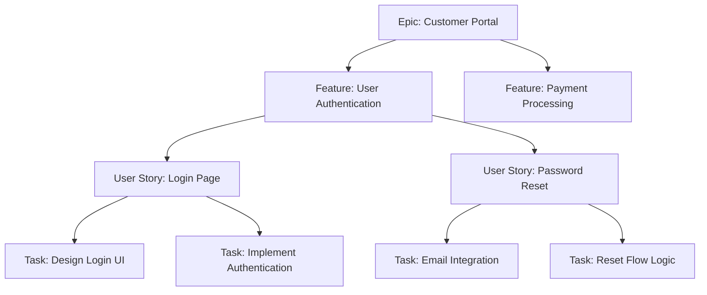
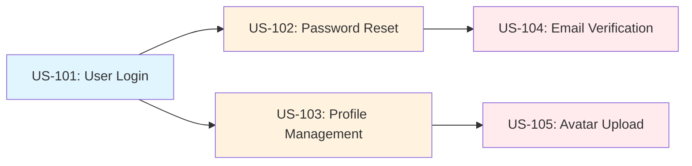

Azure Boards provides comprehensive agile project management tools for planning, tracking, and discussing work across development teams, supporting Scrum, Kanban, and hybrid methodologies.

## 🎯 **Overview**

Azure Boards enables teams to:

- **Plan and track work** with customizable work items and hierarchies
- **Visualize workflows** using Kanban boards and sprint backlogs
- **Collaborate effectively** with built-in discussion and notification features
- **Monitor progress** through dashboards, charts, and analytics
- **Scale agile practices** from small teams to large enterprises
- **Integrate seamlessly** with repositories, pipelines, and testing tools

## 📋 **Work Items and Hierarchies**

### Understanding Work Item Types

Azure Boards supports multiple work item types that form natural hierarchies:

#### Epic → Feature → User Story → Task



### Work Item Types by Process Template

| Process Template | Level 1 | Level 2 | Level 3 | Level 4 |
|------------------|---------|---------|---------|---------|
| **Basic** | Epic | Issue | Task | - |
| **Agile** | Epic | Feature | User Story | Task |
| **Scrum** | Epic | Feature | Product Backlog Item | Task |
| **CMMI** | Epic | Feature | Requirement | Task |

### Creating and Configuring Work Items

#### Essential Work Item Fields

```yaml
# Core fields for all work items
Required Fields:
  - Title: Clear, descriptive summary
  - Work Item Type: Epic, Feature, User Story, Task, Bug
  - Area Path: Team or component ownership
  - Iteration Path: Sprint or release assignment

Planning Fields:
  - Priority: 1 (highest) to 4 (lowest)
  - Story Points: Effort estimation (Fibonacci: 1, 2, 3, 5, 8, 13)
  - Original Estimate: Time-based estimation
  - Activity: Development, Testing, Documentation, etc.

Tracking Fields:
  - State: New, Active, Resolved, Closed
  - Assigned To: Team member responsible
  - Remaining Work: Current effort remaining
  - Completed Work: Time already invested

Custom Fields:
  - Business Value: ROI or impact score
  - Risk: Technical or business risk assessment
  - Dependencies: Related work items or external factors
```

#### Work Item Creation Best Practices

```markdown
## User Story Template
**Title:** As a [type of user], I want [goal] so that [benefit]

**Description:**
### Acceptance Criteria
- [ ] Criterion 1: Specific, testable condition
- [ ] Criterion 2: Measurable outcome
- [ ] Criterion 3: User experience validation

### Definition of Done
- [ ] Code written and reviewed
- [ ] Unit tests created and passing
- [ ] Integration tests passing
- [ ] Documentation updated
- [ ] Accessibility requirements met
- [ ] Security review completed

### Dependencies
- Work Item #123: Authentication service
- External API: Payment processor integration

### Notes
Technical considerations, design decisions, or implementation details.
```

## 📊 **Boards and Kanban Management**

### Kanban Board Configuration

#### Basic Kanban Flow

```text
New → Active → Resolved → Closed
```

#### Advanced Development Flow

```text
New → Approved → Committed → In Progress → In Review → Testing → Done
```

### Board Customization

#### Column Configuration

```json
{
  "boardColumns": [
    {
      "name": "New",
      "description": "Work items ready for planning",
      "wipLimit": null,
      "stateMappings": ["New"]
    },
    {
      "name": "Active",
      "description": "Work in progress",
      "wipLimit": 5,
      "stateMappings": ["Active", "Committed"]
    },
    {
      "name": "Code Review",
      "description": "Pending code review",
      "wipLimit": 3,
      "stateMappings": ["Review"]
    },
    {
      "name": "Testing",
      "description": "Quality assurance validation",
      "wipLimit": 4,
      "stateMappings": ["Testing"]
    },
    {
      "name": "Done",
      "description": "Completed work",
      "wipLimit": null,
      "stateMappings": ["Resolved", "Closed"]
    }
  ]
}
```

#### Work-in-Progress (WIP) Limits

```markdown
### WIP Limit Guidelines

**Benefits:**
- Reduce context switching
- Improve flow and cycle time
- Identify bottlenecks quickly
- Enhance team focus

**Recommended Limits:**
- Development: 1-2 items per developer
- Code Review: 2-3 items total
- Testing: 3-4 items total
- Waiting/Blocked: Monitor but don't limit

**Implementation:**
1. Start with current capacity + 1
2. Monitor flow for 1-2 weeks
3. Adjust based on bottlenecks
4. Gradually reduce to optimal flow
```

### Board Rules and Automation

#### Automated Board Rules

```yaml
Rules:
  - name: "Auto-assign to creator"
    trigger: "Work item created"
    condition: "Assigned To is empty"
    action: "Set Assigned To = Created By"
  
  - name: "Move to In Progress"
    trigger: "State changed to Active"
    condition: "Work Item Type = Task"
    action: "Move to Active column"
  
  - name: "Tag high priority items"
    trigger: "Priority changed to 1"
    condition: "Work Item Type in [User Story, Bug]"
    action: "Add tag: urgent"
  
  - name: "Notify on blocked items"
    trigger: "Tag added: blocked"
    action: "Send email to Assigned To"
```

## 🏃‍♂️ **Sprint Planning and Management**

### Sprint Planning Process

#### Pre-Planning Activities

```markdown
### Sprint Planning Checklist

**1 Week Before Sprint Planning:**
- [ ] Product backlog refined and prioritized
- [ ] User stories have acceptance criteria
- [ ] Story points estimated
- [ ] Dependencies identified and resolved
- [ ] Team capacity calculated

**Sprint Planning Meeting:**
- [ ] Sprint goal defined
- [ ] User stories selected from backlog
- [ ] Tasks created and estimated
- [ ] Team commitment confirmed
- [ ] Sprint capacity vs. commitment validated
```

#### Capacity Planning

```powershell
# Sprint Capacity Calculator
function Calculate-SprintCapacity {
    param(
        [int]$SprintDays = 10,
        [int]$TeamSize = 5,
        [decimal]$FocusFactor = 0.7,  # 70% productive time
        [int]$HoursPerDay = 8
    )
    
    $totalHours = $SprintDays * $TeamSize * $HoursPerDay
    $availableHours = $totalHours * $FocusFactor
    
    [PSCustomObject]@{
        SprintDays = $SprintDays
        TeamSize = $TeamSize
        TotalHours = $totalHours
        AvailableHours = $availableHours
        FocusFactor = $FocusFactor
        RecommendedStoryPoints = [math]::Round($availableHours / 6, 0) # Assume 6 hours per story point
    }
}

# Example usage
Calculate-SprintCapacity -SprintDays 10 -TeamSize 6 -FocusFactor 0.75
```

#### Sprint Backlog Management

```yaml
Sprint Structure:
  Sprint Goal: "Implement user authentication foundation"
  
  Sprint Backlog:
    - Epic: "User Management System"
      Features:
        - User Registration (8 SP)
        - Login/Logout (5 SP)
        - Password Management (3 SP)
      
    - Technical Debt:
        - Code refactoring (5 SP)
        - Unit test coverage (3 SP)
      
    - Bugs:
        - Critical bugs from previous sprint (2 SP)
  
  Total Commitment: 26 Story Points
  Team Capacity: 28 Story Points
  Buffer: 2 Story Points (7.1%)
```

### Sprint Ceremonies and Tracking

#### Daily Standups

```markdown
### Daily Standup Template

**Three Questions:**
1. What did I complete yesterday?
2. What will I work on today?
3. Are there any impediments?

**Focus Areas:**
- Sprint goal progress
- Impediment identification
- Team collaboration opportunities
- Risk mitigation

**Burndown Chart Review:**
- Are we on track for sprint commitment?
- Any scope adjustments needed?
- Resource reallocation requirements?
```

#### Sprint Review and Retrospective

```yaml
Sprint Review Agenda:
  - Demo completed work (30 min)
  - Stakeholder feedback (15 min)
  - Backlog refinement (15 min)

Sprint Retrospective Framework:
  Start: What should we start doing?
  Stop: What should we stop doing?
  Continue: What should we continue doing?
  
Action Items:
  - Maximum 3 actionable items
  - Assign ownership
  - Set completion targets
  - Track in next sprint
```

## 📈 **Queries and Reporting**

### Work Item Queries

#### Essential Query Examples

```sql
-- Active work for current sprint
SELECT [System.Id], [System.Title], [System.State], [System.AssignedTo]
FROM WorkItems
WHERE [System.TeamProject] = @project
  AND [System.IterationPath] = @currentIteration
  AND [System.State] IN ('New', 'Active', 'Committed')
ORDER BY [System.Priority], [System.Id]

-- Bugs by priority
SELECT [System.Id], [System.Title], [System.Priority], [System.Severity]
FROM WorkItems
WHERE [System.TeamProject] = @project
  AND [System.WorkItemType] = 'Bug'
  AND [System.State] NOT IN ('Resolved', 'Closed')
ORDER BY [System.Priority], [System.Severity]

-- User stories without tasks
SELECT [System.Id], [System.Title], [System.State]
FROM WorkItemLinks
WHERE [Source].[System.WorkItemType] = 'User Story'
  AND [System.Links.LinkType] = 'System.LinkTypes.Hierarchy-Forward'
  AND [Target].[System.WorkItemType] = 'Task'
  AND [Source].[System.TeamProject] = @project
GROUP BY [Source].[System.Id], [Source].[System.Title], [Source].[System.State]
HAVING COUNT([Target].[System.Id]) = 0

-- Velocity tracking query
SELECT [System.IterationPath], SUM([Microsoft.VSTS.Scheduling.StoryPoints])
FROM WorkItems
WHERE [System.TeamProject] = @project
  AND [System.WorkItemType] IN ('User Story', 'Product Backlog Item')
  AND [System.State] = 'Closed'
  AND [System.IterationPath] UNDER @project + '\Iteration'
GROUP BY [System.IterationPath]
ORDER BY [System.IterationPath]
```

#### Custom Query Folders

```markdown
### Recommended Query Organization

**My Queries**
├── Active Work
│   ├── My Active Items
│   ├── My Code Reviews
│   └── Items Assigned to Me
├── Team Queries
│   ├── Sprint Backlog
│   ├── Current Bugs
│   └── Blocked Items
└── Reports
    ├── Velocity by Sprint
    ├── Bug Trends
    └── Cycle Time Analysis
```

### Charts and Dashboards

#### Sprint Burndown Configuration

```json
{
  "chartType": "burndown",
  "title": "Sprint Burndown",
  "description": "Remaining work vs. ideal trend",
  "configuration": {
    "dataSource": "Analytics",
    "aggregation": "Sum",
    "field": "Remaining Work",
    "timePeriod": "Current Iteration",
    "groupBy": "Date",
    "includeWeekends": false
  }
}
```

#### Cumulative Flow Diagram

```yaml
Cumulative Flow Configuration:
  Title: "Team Flow Metrics"
  Time Range: "Last 30 days"
  
  Columns Tracked:
    - New: Work items entering the system
    - Active: Work in progress
    - Resolved: Work completed but not deployed
    - Closed: Work fully complete
  
  Metrics Analyzed:
    - Lead Time: New → Closed
    - Cycle Time: Active → Closed
    - Throughput: Items closed per week
    - Work in Progress: Active items count
```

#### Velocity Chart Setup

```markdown
### Velocity Chart Configuration

**Purpose:** Track team delivery consistency over time

**Metrics:**
- **Planned vs. Completed:** Story points committed vs. delivered
- **Running Average:** 3-sprint rolling average
- **Trend Analysis:** Velocity improvement/decline patterns

**Setup Steps:**
1. Navigate to Analytics → Velocity
2. Select team and date range
3. Configure work item types (User Story, PBI)
4. Set story point field mapping
5. Include/exclude incomplete items
```

## 🔧 **Process Customization**

### Work Item Types and States

#### Custom Work Item Type Creation

```xml
<!-- Custom work item type: Technical Debt -->
<WITD application="Work item type editor" version="1.0">
  <WORKITEMTYPE name="Technical Debt">
    <DESCRIPTION>Technical debt items requiring refactoring</DESCRIPTION>
    
    <FIELDS>
      <FIELD name="Title" refname="System.Title" type="String" required="true" />
      <FIELD name="Effort" refname="Microsoft.VSTS.Scheduling.Effort" type="Double" />
      <FIELD name="Business Impact" refname="Custom.BusinessImpact" type="String">
        <ALLOWEDVALUES>
          <LISTITEM value="High" />
          <LISTITEM value="Medium" />
          <LISTITEM value="Low" />
        </ALLOWEDVALUES>
      </FIELD>
      <FIELD name="Technical Risk" refname="Custom.TechnicalRisk" type="String">
        <ALLOWEDVALUES>
          <LISTITEM value="Critical" />
          <LISTITEM value="High" />
          <LISTITEM value="Medium" />
          <LISTITEM value="Low" />
        </ALLOWEDVALUES>
      </FIELD>
    </FIELDS>
    
    <WORKFLOW>
      <STATES>
        <STATE value="New" />
        <STATE value="Approved" />
        <STATE value="In Progress" />
        <STATE value="Done" />
      </STATES>
      
      <TRANSITIONS>
        <TRANSITION from="" to="New" />
        <TRANSITION from="New" to="Approved" />
        <TRANSITION from="Approved" to="In Progress" />
        <TRANSITION from="In Progress" to="Done" />
      </TRANSITIONS>
    </WORKFLOW>
  </WORKITEMTYPE>
</WITD>
```

#### Custom Fields and Rules

```yaml
Custom Fields:
  - name: "Business Value"
    type: Integer
    required: false
    description: "Business impact score (1-100)"
  
  - name: "Technical Complexity"
    type: PickList
    values: ["Simple", "Moderate", "Complex", "Very Complex"]
    default: "Moderate"
  
  - name: "Customer Segment"
    type: String
    description: "Target customer segment"

Process Rules:
  - condition: "Work Item Type = User Story AND State = Active"
    action: "Require Story Points field"
  
  - condition: "Priority = 1"
    action: "Send notification to Product Owner"
  
  - condition: "Remaining Work = 0"
    action: "Transition to Resolved state"
```

### Area and Iteration Paths

#### Area Path Structure

```markdown
### Recommended Area Path Hierarchy

**By Team:**

```text
MyProject
├── Team Alpha
│   ├── Frontend
│   └── Backend
├── Team Beta
│   ├── API
│   └── Database
└── Infrastructure
    ├── DevOps
    └── Security
```

**By Component:**

```text
MyProject
├── Web Application
│   ├── User Interface
│   ├── Authentication
│   └── Shopping Cart
├── Mobile App
│   ├── iOS
│   └── Android
└── Shared Services
    ├── Payment Service
    └── Notification Service
```

#### Iteration Path Planning

```yaml
Release Structure:
  "MyProject\Release 1.0":
    - "Sprint 1" (2 weeks)
    - "Sprint 2" (2 weeks) 
    - "Sprint 3" (2 weeks)
    - "Hardening Sprint" (1 week)
  
  "MyProject\Release 1.1":
    - "Sprint 4" (2 weeks)
    - "Sprint 5" (2 weeks)
    - "Bug Fix Sprint" (1 week)

Planning Considerations:
  - Align with business milestones
  - Include buffer sprints for quality
  - Account for holidays and vacations
  - Plan demo and review cycles
```

## 👥 **Team Collaboration**

### Discussion and Comments

#### Effective Work Item Discussions

```markdown
### Comment Best Practices

**Technical Discussions:**
- Reference specific code files/lines
- Include relevant screenshots or diagrams
- Link to external documentation
- Tag appropriate team members

**Status Updates:**
- Progress percentage and blockers
- Next steps and timeline
- Resource needs or dependencies
- Risk identification and mitigation

**Decision Recording:**
- Context and options considered
- Decision rationale
- Implementation approach
- Success criteria
```

#### @Mention Usage

```yaml
Mention Strategies:
  - @teamname: Notify entire team
  - @username: Direct individual attention
  - @[Area Path]: Notify area owners
  - @product-owner: Escalate decisions

Notification Management:
  - Subscribe to work item changes
  - Filter notifications by priority
  - Set up digest emails for low-priority items
  - Use mobile notifications for urgent items
```

### Work Item Linking

#### Link Types and Usage

| Link Type | Purpose | Example |
|-----------|---------|---------|
| **Child/Parent** | Hierarchical breakdown | Feature → User Stories |
| **Related** | General association | Similar bugs or stories |
| **Duplicate** | Duplicate work items | Multiple reports of same issue |
| **Predecessor/Successor** | Sequential dependencies | Task A must complete before Task B |
| **Tests/Tested By** | Test case relationships | User Story tested by Test Cases |

#### Dependency Management



## 📊 **Analytics and Insights**

### Azure DevOps Analytics

#### Key Metrics and KPIs

```yaml
Delivery Metrics:
  - Velocity: Story points completed per sprint
  - Lead Time: Idea to deployment duration
  - Cycle Time: Development start to completion
  - Throughput: Work items completed per time period

Quality Metrics:
  - Bug Rate: Bugs per story point delivered
  - Defect Escape Rate: Production bugs / total bugs
  - Rework Rate: Work items reopened percentage
  - Test Coverage: Automated test coverage percentage

Predictability Metrics:
  - Sprint Commitment Accuracy: Planned vs. actual completion
  - Estimation Accuracy: Original vs. actual effort
  - Scope Change Rate: Mid-sprint additions/removals
  - Release Predictability: On-time delivery percentage
```

#### Analytics Views Configuration

```json
{
  "analyticsViews": [
    {
      "name": "Team Velocity Trends",
      "description": "Sprint-over-sprint velocity analysis",
      "entity": "WorkItems",
      "timeframe": "Last 6 months",
      "filters": {
        "WorkItemType": ["User Story", "Product Backlog Item"],
        "State": "Closed",
        "AreaPath": "MyProject\\Team Alpha"
      },
      "groupBy": ["IterationPath"],
      "aggregation": {
        "field": "StoryPoints",
        "function": "Sum"
      }
    },
    {
      "name": "Bug Trends",
      "description": "Bug creation and resolution trends",
      "entity": "WorkItems",
      "timeframe": "Last 3 months",
      "filters": {
        "WorkItemType": "Bug"
      },
      "groupBy": ["CreatedDate", "State"],
      "aggregation": {
        "function": "Count"
      }
    }
  ]
}
```

### Power BI Integration

#### Dashboard Creation

```markdown
### Power BI Dashboard Setup

**Data Source Configuration:**
1. Connect to Azure DevOps Analytics
2. Configure authentication (OAuth 2.0)
3. Select relevant projects and teams
4. Set up automatic data refresh

**Key Visualizations:**
- **Sprint Burndown:** Line chart showing remaining work
- **Velocity Trend:** Column chart of story points per sprint
- **Cycle Time Distribution:** Histogram of work item cycle times
- **Bug Aging:** Scatter plot of open bugs by age and priority
- **Team Capacity:** Gauge showing current vs. planned capacity

**Refresh Schedule:**
- Real-time: For active sprint monitoring
- Daily: For general team dashboards
- Weekly: For executive reporting
```

## 🔧 **Advanced Features**

### Work Item Templates

#### Template Creation

```json
{
  "name": "User Story Template",
  "description": "Standard template for user stories",
  "workItemType": "User Story",
  "fields": {
    "System.Title": "As a [user type], I want [goal] so that [benefit]",
    "System.Description": "## Acceptance Criteria\n- [ ] Criterion 1\n- [ ] Criterion 2\n\n## Definition of Done\n- [ ] Code complete\n- [ ] Tests passing\n- [ ] Documentation updated",
    "Microsoft.VSTS.Common.Priority": 2,
    "Microsoft.VSTS.Scheduling.StoryPoints": null,
    "System.Tags": "user-story; ready-for-dev"
  }
}
```

### Delivery Plans

#### Multi-Team Planning

```yaml
Delivery Plan Configuration:
  Name: "Q4 2025 Release Plan"
  Description: "Cross-team coordination for major release"
  
  Teams:
    - name: "Frontend Team"
      iterations: ["Sprint 10", "Sprint 11", "Sprint 12"]
      focus: "User interface and experience"
    
    - name: "Backend Team" 
      iterations: ["Sprint 10", "Sprint 11", "Sprint 12"]
      focus: "API and data services"
    
    - name: "Infrastructure Team"
      iterations: ["Sprint 10", "Sprint 11"]
      focus: "DevOps and deployment"
  
  Milestones:
    - name: "Beta Release"
      date: "2025-11-15"
      teams: ["Frontend", "Backend"]
    
    - name: "Production Deployment"
      date: "2025-12-01"
      teams: ["All Teams"]
  
  Dependencies:
    - from: "Backend Team - API v2"
      to: "Frontend Team - UI Integration"
      type: "finish-to-start"
```

### Test Case Management

#### Test Integration

```markdown
### Test Case Workflow

**Test Case Creation:**
1. Link test cases to user stories
2. Define test steps and expected results
3. Assign to test team or developers
4. Configure automated test integration

**Test Execution:**
- Manual test runs
- Automated test results integration
- Test result tracking and reporting
- Bug creation from failed tests

**Coverage Analysis:**
- Requirements coverage by tests
- Test execution coverage
- Automated vs. manual test ratio
- Risk-based testing prioritization
```

## 🛠️ **Integration and Automation**

### GitHub Integration

#### Repository Linking

```yaml
GitHub Integration Setup:
  Connection Type: GitHub App or OAuth
  Permissions Required:
    - Repository access (read/write)
    - Pull request management
    - Issue tracking
    - Actions (for CI/CD)
  
  Work Item Linking:
    - Commit messages: "Fix #123" or "Closes AB#456"
    - Pull request descriptions: Automatic work item linking
    - Branch naming: "feature/AB#123-user-authentication"
  
  Automation Rules:
    - PR merge → Move work item to "Done"
    - Build failure → Create bug work item
    - Release deployment → Update release notes
```

#### Azure Repos Integration

```bash
# Git commit with work item linking
git commit -m "Implement user authentication - Fixes #123

- Added OAuth 2.0 support
- Implemented JWT token validation
- Added user session management

Work Items: #123, #124"

# Branch naming conventions
git checkout -b feature/123-user-login
git checkout -b bugfix/456-password-validation
git checkout -b release/v1.2.0
```

### Azure Pipelines Integration

#### Build-Work Item Integration

```yaml
# azure-pipelines.yml
trigger:
  branches:
    include:
    - main
    - feature/*

variables:
  buildConfiguration: 'Release'

stages:
- stage: Build
  jobs:
  - job: BuildAndTest
    steps:
    - task: DotNetCoreCLI@2
      displayName: 'Build solution'
      inputs:
        command: 'build'
        arguments: '--configuration $(buildConfiguration)'
    
    - task: DotNetCoreCLI@2
      displayName: 'Run tests'
      inputs:
        command: 'test'
        arguments: '--configuration $(buildConfiguration) --collect:"XPlat Code Coverage"'
    
    - task: PublishTestResults@2
      displayName: 'Publish test results'
      inputs:
        testResultsFormat: 'VSTest'
        testResultsFiles: '**/*.trx'
        mergeTestResults: true
    
    - task: WorkItemUpdater@2
      displayName: 'Update work items'
      inputs:
        workItemsToUpdate: |
          [
            {
              "id": "$(System.PullRequest.WorkItemId)",
              "state": "Resolved",
              "fields": {
                "Microsoft.VSTS.Common.ResolvedReason": "Fixed",
                "System.History": "Build $(Build.BuildNumber) completed successfully"
              }
            }
          ]
      condition: and(succeeded(), eq(variables['Build.Reason'], 'PullRequest'))
```

## 📚 **Best Practices and Guidelines**

### Team Onboarding

#### New Team Member Checklist

```markdown
### Azure Boards Onboarding

**Access Setup:**
- [ ] Azure DevOps organization access granted
- [ ] Project permissions configured
- [ ] Team membership assigned
- [ ] Notification preferences set

**Process Training:**
- [ ] Team's agile methodology overview
- [ ] Work item types and workflows
- [ ] Definition of Done understanding
- [ ] Estimation techniques training

**Tool Familiarity:**
- [ ] Board navigation and customization
- [ ] Query creation and sharing
- [ ] Dashboard usage
- [ ] Integration tools (Git, pipelines)

**First Sprint Activities:**
- [ ] Participate in sprint planning
- [ ] Create first work items
- [ ] Update daily standup board
- [ ] Complete sprint retrospective
```

### Performance Optimization

#### Large Project Management

```yaml
Scaling Strategies:
  Project Size: 
    - Small (1-3 teams): Single project approach
    - Medium (4-10 teams): Multiple projects with delivery plans
    - Large (10+ teams): Portfolio management with SAFe

  Work Item Management:
    - Archive completed iterations older than 6 months
    - Use work item templates for consistency
    - Implement bulk update operations
    - Regular cleanup of unused queries and dashboards

  Performance Tips:
    - Limit query results to essential fields
    - Use Analytics instead of WIQL for complex reports
    - Implement proper area and iteration path structure
    - Regular maintenance of work item links
```

### Governance and Compliance

#### Process Governance

```markdown
### Governance Framework

**Work Item Standards:**
- Mandatory fields configuration
- Approval workflows for high-impact items
- Audit trails for compliance requirements
- Regular process review and improvement

**Quality Gates:**
- Definition of Ready for backlog items
- Definition of Done for completed work
- Code review requirements
- Testing and acceptance criteria

**Reporting Requirements:**
- Executive dashboards for stakeholders
- Compliance reporting for audits
- Performance metrics for continuous improvement
- Risk and dependency tracking
```

## 🔍 **Troubleshooting Common Issues**

### Performance Issues

```powershell
# Query optimization script
function Optimize-WorkItemQueries {
    param(
        [string]$Organization,
        [string]$Project,
        [string]$Pat
    )
    
    $headers = @{
        Authorization = "Basic $([Convert]::ToBase64String([Text.Encoding]::ASCII.GetBytes(":$Pat")))"
    }
    
    # Get all queries
    $uri = "$Organization/$Project/_apis/wit/queries?`$depth=2&api-version=6.0"
    $queries = Invoke-RestMethod -Uri $uri -Headers $headers
    
    # Analyze query performance
    foreach ($query in $queries.value) {
        if ($query.wiql) {
            $queryLength = $query.wiql.Length
            $hasSelectStar = $query.wiql -match "SELECT \*"
            $hasLargeResultSet = $query.wiql -notmatch "TOP \d+"
            
            if ($queryLength -gt 1000 -or $hasSelectStar -or $hasLargeResultSet) {
                Write-Warning "Query '$($query.name)' may have performance issues"
                Write-Host "  - Length: $queryLength characters"
                Write-Host "  - Uses SELECT *: $hasSelectStar"
                Write-Host "  - No TOP clause: $hasLargeResultSet"
            }
        }
    }
}
```

### Common Error Solutions

| Error | Cause | Solution |
|-------|-------|----------|
| **TF401349: Work item does not exist** | Work item deleted or insufficient permissions | Check permissions and verify work item ID |
| **VS402337: The iteration path is not valid** | Incorrect iteration path format | Verify iteration path structure and permissions |
| **TF14044: Access denied connecting to Team Foundation Server** | Authentication or permission issues | Check PAT token and project permissions |
| **TF26204: The work item type does not exist** | Invalid work item type for process template | Use correct work item type for your process |

---

## 📖 **Additional Resources**

- [Azure Boards Documentation](https://docs.microsoft.com/en-us/azure/devops/boards/)
- [Agile Process Guidance](https://docs.microsoft.com/en-us/azure/devops/boards/work-items/guidance/agile-process)
- [Azure DevOps REST API](https://docs.microsoft.com/en-us/rest/api/azure/devops/wit/)
- [Analytics and Reporting](https://docs.microsoft.com/en-us/azure/devops/report/dashboards/)

[Back to Azure DevOps Getting Started](getting-started.md) | [Back to Development Home](../index.md)
