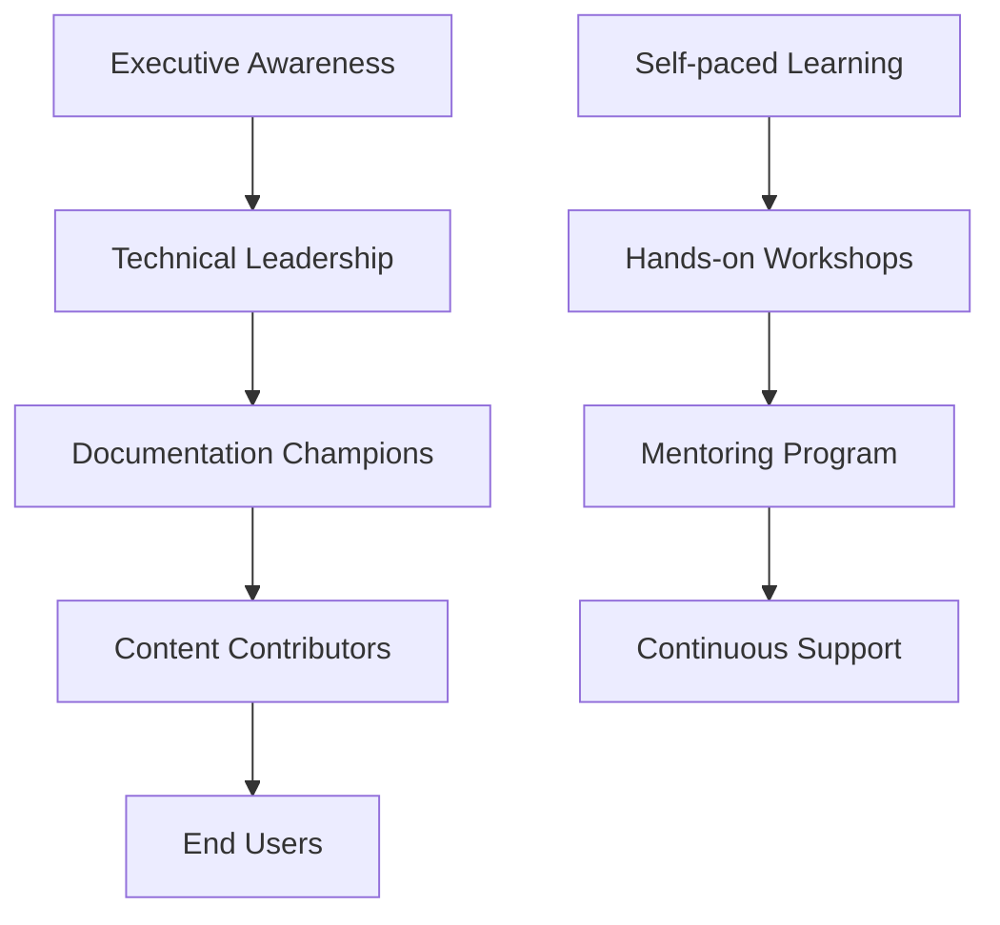
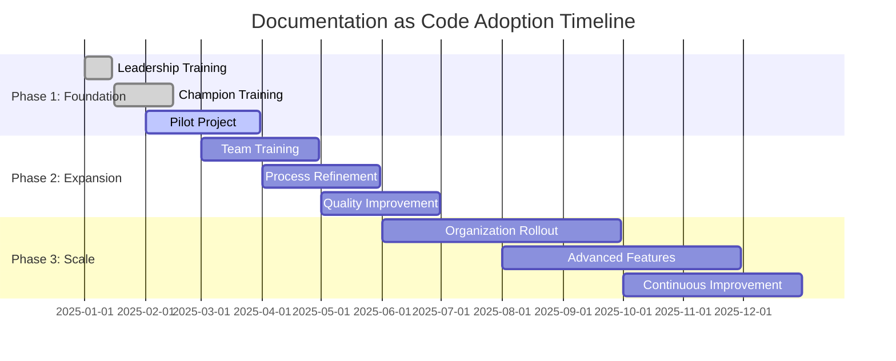

## Team Training and Adoption

Develop comprehensive training programs and adoption strategies to ensure successful Documentation as Code implementation across your organization.

## Training Strategy Overview

### Multi-tiered Training Approach



### Training Objectives

- **Technical Proficiency**: Master tools and workflows
- **Cultural Adoption**: Embrace documentation-first mindset
- **Quality Standards**: Maintain consistency and excellence
- **Continuous Improvement**: Evolve practices over time

## Role-based Training Programs

### Executive and Leadership Training

#### Duration: 2-hour workshop

**Objectives:**

- Understand DaC business value
- Learn ROI measurement
- Discover competitive advantages
- Commit to organizational change

**Curriculum:**

```markdown
## Executive DaC Overview (120 minutes)

### Introduction (20 minutes)
- What is Documentation as Code?
- Industry trends and benchmarks
- Competitive landscape analysis

### Business Case (30 minutes)
- ROI calculations and metrics
- Risk mitigation benefits
- Customer satisfaction impact
- Developer productivity gains

### Implementation Strategy (40 minutes)
- Phased rollout approach
- Resource requirements
- Timeline and milestones
- Success measurement

### Leadership Role (20 minutes)
- Change management responsibilities
- Communication strategies
- Resource allocation decisions
- Performance incentives

### Q&A and Next Steps (10 minutes)
```

**Materials:**

- Executive summary deck
- ROI calculator
- Implementation roadmap
- Success metrics dashboard

### Technical Leadership Training

#### Duration: 1-day intensive workshop

**Objectives:**

- Understand technical architecture
- Plan implementation strategy
- Establish governance model
- Design team structure

**Curriculum:**

```markdown
## Technical Leadership Workshop (8 hours)

### Morning Session (4 hours)

#### Architecture Deep Dive (2 hours)
- DocFX technical overview
- Azure DevOps integration
- CI/CD pipeline design
- Security and compliance

#### Infrastructure Planning (2 hours)
- Environment setup and configuration
- Resource provisioning
- Backup and disaster recovery
- Performance optimization

### Afternoon Session (4 hours)

#### Governance Framework (2 hours)
- Content standards and guidelines
- Review and approval processes
- Quality assurance protocols
- Metrics and KPIs

#### Team Organization (2 hours)
- Role definitions and responsibilities
- Training program design
- Communication strategies
- Change management planning
```

**Hands-on Labs:**

- Environment setup
- Pipeline configuration
- Template creation
- Security implementation

### Documentation Champions Training

#### Duration: 3-day comprehensive program

**Objectives:**

- Become expert practitioners
- Lead by example
- Mentor other team members
- Drive continuous improvement

#### Day 1: Technical Mastery

```markdown
## Day 1: Technical Foundations (8 hours)

### Morning: Core Technologies (4 hours)
- Git fundamentals and workflows
- Markdown advanced techniques
- DocFX configuration and customization
- Azure DevOps mastery

### Afternoon: Advanced Topics (4 hours)
- Template development
- Plugin creation
- API documentation automation
- Performance optimization

### Labs:
- Set up complete development environment
- Create custom templates
- Build automated workflows
- Implement advanced features
```

#### Day 2: Content Strategy

```markdown
## Day 2: Content Excellence (8 hours)

### Morning: Content Architecture (4 hours)
- Information architecture principles
- Content taxonomy design
- User journey mapping
- SEO and discoverability

### Afternoon: Quality Assurance (4 hours)
- Style guide development
- Review processes
- Testing strategies
- Metrics and analytics

### Labs:
- Design content architecture
- Create style guides
- Implement quality checks
- Set up analytics tracking
```

#### Day 3: Leadership and Mentoring

```markdown
## Day 3: Change Leadership (8 hours)

### Morning: Training Design (4 hours)
- Adult learning principles
- Training program development
- Workshop facilitation
- Assessment strategies

### Afternoon: Continuous Improvement (4 hours)
- Feedback collection and analysis
- Process optimization
- Innovation cultivation
- Community building

### Labs:
- Develop training materials
- Practice facilitation skills
- Create improvement plans
- Build community programs
```

### Content Contributor Training

#### Duration: 2-day workshop + ongoing support

**Objectives:**

- Master daily workflows
- Create high-quality content
- Collaborate effectively
- Follow best practices

#### Day 1: Essential Skills

```markdown
## Day 1: Essential Skills (8 hours)

### Morning: Getting Started (4 hours)
- Development environment setup
- Git basics for documentation
- Markdown writing techniques
- DocFX project structure

### Afternoon: Content Creation (4 hours)
- Writing effective documentation
- Using templates and styles
- Adding multimedia content
- Cross-referencing and linking

### Hands-on Exercises:
- Environment setup and configuration
- First documentation commit
- Content creation practice
- Collaboration simulation
```

#### Day 2: Advanced Workflows

```markdown
## Day 2: Advanced Workflows (8 hours)

### Morning: Collaboration (4 hours)
- Branching and merging strategies
- Pull request workflows
- Review and approval processes
- Conflict resolution

### Afternoon: Quality and Publishing (4 hours)
- Quality assurance checklists
- Testing and validation
- Publishing workflows
- Maintenance responsibilities

### Hands-on Exercises:
- Complex collaboration scenarios
- Quality review practice
- Publishing workflow execution
- Troubleshooting common issues
```

### End User Training

#### Duration: 1-hour orientation + self-paced learning

**Objectives:**

- Navigate documentation effectively
- Provide meaningful feedback
- Understand contribution process
- Use search and discovery features

**Training Module:**

```markdown
## End User Orientation (60 minutes)

### Documentation Navigation (20 minutes)
- Site structure and organization
- Search functionality
- Mobile accessibility
- Bookmark and sharing features

### Feedback and Contribution (20 minutes)
- How to report issues
- Suggestion submission process
- Community contribution guidelines
- Recognition and rewards

### Advanced Features (20 minutes)
- Personalization options
- Notification preferences
- Collaboration tools
- Integration with other systems
```

## Learning Management System

### Online Learning Platform

```yaml
# learning-platform-config.yml
platform:
  name: "DaC Learning Hub"
  url: "https://learning.company.com/dac"
  
courses:
  - id: "dac-101"
    title: "Documentation as Code Fundamentals"
    duration: "4 hours"
    format: "self-paced"
    prerequisites: []
    
  - id: "dac-201"
    title: "Advanced DocFX Techniques"
    duration: "6 hours"
    format: "instructor-led"
    prerequisites: ["dac-101"]
    
  - id: "dac-301"
    title: "Documentation Leadership"
    duration: "8 hours"
    format: "workshop"
    prerequisites: ["dac-201"]

assessments:
  - type: "knowledge-check"
    frequency: "per-module"
    passing-score: 80
    
  - type: "hands-on-project"
    frequency: "per-course"
    peer-review: true
    
  - type: "certification-exam"
    frequency: "annual"
    proctored: true

tracking:
  progress: true
  completion-certificates: true
  skill-badges: true
  leaderboards: true
```

### Learning Content Structure

```markdown
# Course Structure Template

## Module Overview
- Learning objectives
- Prerequisites
- Estimated time
- Assessment criteria

## Theoretical Foundation
- Concepts and principles
- Best practices
- Common pitfalls
- Real-world examples

## Hands-on Practice
- Step-by-step exercises
- Guided labs
- Practice scenarios
- Self-assessment quizzes

## Application Projects
- Real-world challenges
- Team collaboration
- Peer review
- Instructor feedback

## Knowledge Check
- Comprehension questions
- Practical assessments
- Competency validation
- Improvement recommendations
```

## Training Materials Development

### Interactive Learning Modules

```html
<!-- interactive-module.html -->
<!DOCTYPE html>
<html>
<head>
    <title>Git Workflow for Documentation</title>
    <link rel="stylesheet" href="styles/learning-module.css">
</head>
<body>
    <div class="learning-module">
        <header class="module-header">
            <h1>Git Workflow for Documentation</h1>
            <div class="progress-bar">
                <div class="progress" style="width: 0%"></div>
            </div>
        </header>
        
        <main class="module-content">
            <section id="step-1" class="learning-step active">
                <h2>Creating a Feature Branch</h2>
                <p>Learn how to create and switch to a new branch for your documentation changes.</p>
                
                <div class="code-simulator">
                    <div class="terminal">
                        <div class="terminal-header">Terminal</div>
                        <div class="terminal-content">
                            <div class="command-line">
                                $ <span class="user-input" data-expected="git checkout -b feature/new-api-docs">Type your command here...</span>
                            </div>
                        </div>
                    </div>
                </div>
                
                <div class="step-validation" style="display: none;">
                    <div class="success-message">
                        ✅ Correct! You've created a new feature branch.
                    </div>
                </div>
                
                <button class="next-step" disabled>Next Step</button>
            </section>
            
            <section id="step-2" class="learning-step">
                <h2>Making Changes</h2>
                <p>Edit documentation files and stage your changes.</p>
                
                <div class="file-editor">
                    <div class="editor-header">docs/api/new-endpoint.md</div>
                    <textarea class="editor-content" placeholder="Write your documentation here..."></textarea>
                </div>
                
                <div class="git-status">
                    <h3>Git Status</h3>
                    <ul class="file-list">
                        <li class="modified">docs/api/new-endpoint.md</li>
                    </ul>
                </div>
                
                <button class="next-step" disabled>Next Step</button>
            </section>
        </main>
        
        <aside class="module-sidebar">
            <div class="learning-objectives">
                <h3>Learning Objectives</h3>
                <ul>
                    <li>✅ Understand Git branching</li>
                    <li>⏳ Create feature branches</li>
                    <li>⏸️ Stage and commit changes</li>
                    <li>⏸️ Push to remote repository</li>
                </ul>
            </div>
            
            <div class="quick-reference">
                <h3>Quick Reference</h3>
                <dl>
                    <dt>Create branch</dt>
                    <dd><code>git checkout -b branch-name</code></dd>
                    
                    <dt>Stage changes</dt>
                    <dd><code>git add file-name</code></dd>
                    
                    <dt>Commit changes</dt>
                    <dd><code>git commit -m "message"</code></dd>
                </dl>
            </div>
        </aside>
    </div>
    
    <script src="scripts/interactive-learning.js"></script>
</body>
</html>
```

### Video Training Series

```yaml
# video-training-series.yml
series:
  - title: "Documentation as Code Fundamentals"
    episodes:
      - name: "Introduction to DaC"
        duration: "15:00"
        topics: ["overview", "benefits", "principles"]
        
      - name: "Setting Up Your Environment"
        duration: "20:00"
        topics: ["git", "vscode", "docfx", "azure-devops"]
        
      - name: "Your First Documentation Commit"
        duration: "25:00"
        topics: ["workflow", "markdown", "pull-requests"]
        
  - title: "Advanced Techniques"
    episodes:
      - name: "Custom Templates and Themes"
        duration: "30:00"
        topics: ["templates", "styling", "branding"]
        
      - name: "Automation and CI/CD"
        duration: "35:00"
        topics: ["pipelines", "testing", "deployment"]
        
      - name: "Analytics and Optimization"
        duration: "25:00"
        topics: ["metrics", "performance", "user-feedback"]

production:
  format: "MP4"
  resolution: "1920x1080"
  frame-rate: "30fps"
  audio: "AAC 128kbps"
  
  chapters: true
  captions: true
  transcripts: true
  interactive-elements: true
  
hosting:
  primary: "company-lms"
  backup: "youtube-private"
  cdn: "azure-media-services"
```

## Adoption Strategies

### Phased Rollout Plan



### Change Management Framework

```python
# adoption-tracker.py
class AdoptionTracker:
    def __init__(self):
        self.metrics = {
            'awareness': {},
            'knowledge': {},
            'adoption': {},
            'advocacy': {}
        }
    
    def track_awareness(self, team, metric_value):
        """Track awareness level across teams"""
        self.metrics['awareness'][team] = {
            'survey_score': metric_value.get('survey_score', 0),
            'training_attendance': metric_value.get('attendance', 0),
            'engagement_level': metric_value.get('engagement', 0)
        }
    
    def track_knowledge(self, individual, assessment_results):
        """Track knowledge acquisition and retention"""
        self.metrics['knowledge'][individual] = {
            'initial_assessment': assessment_results.get('initial', 0),
            'post_training': assessment_results.get('post_training', 0),
            'retention_check': assessment_results.get('retention', 0),
            'practical_application': assessment_results.get('practical', 0)
        }
    
    def track_adoption(self, team, usage_metrics):
        """Track actual adoption and usage"""
        self.metrics['adoption'][team] = {
            'active_contributors': usage_metrics.get('contributors', 0),
            'commit_frequency': usage_metrics.get('commits_per_week', 0),
            'quality_score': usage_metrics.get('quality', 0),
            'process_compliance': usage_metrics.get('compliance', 0)
        }
    
    def track_advocacy(self, individual, advocacy_activities):
        """Track advocacy and leadership behaviors"""
        self.metrics['advocacy'][individual] = {
            'mentoring_sessions': advocacy_activities.get('mentoring', 0),
            'improvement_suggestions': advocacy_activities.get('suggestions', 0),
            'knowledge_sharing': advocacy_activities.get('sharing', 0),
            'champion_activities': advocacy_activities.get('champion', 0)
        }
    
    def generate_adoption_report(self):
        """Generate comprehensive adoption report"""
        report = {
            'overall_health': self.calculate_overall_health(),
            'team_readiness': self.assess_team_readiness(),
            'individual_progress': self.track_individual_progress(),
            'recommendations': self.generate_recommendations()
        }
        return report
    
    def calculate_overall_health(self):
        """Calculate overall adoption health score"""
        awareness_avg = self.average_scores(self.metrics['awareness'])
        knowledge_avg = self.average_scores(self.metrics['knowledge'])
        adoption_avg = self.average_scores(self.metrics['adoption'])
        advocacy_avg = self.average_scores(self.metrics['advocacy'])
        
        return {
            'awareness': awareness_avg,
            'knowledge': knowledge_avg,
            'adoption': adoption_avg,
            'advocacy': advocacy_avg,
            'overall': (awareness_avg + knowledge_avg + adoption_avg + advocacy_avg) / 4
        }
```

### Incentive Programs

```yaml
# incentive-program.yml
recognition_program:
  name: "Documentation Excellence Awards"
  frequency: "quarterly"
  
  categories:
    - name: "Documentation Champion"
      criteria:
        - active_mentoring: true
        - quality_contributions: ">= 10"
        - process_improvements: ">= 3"
      reward:
        type: "recognition + bonus"
        amount: "$1000"
        public_recognition: true
        
    - name: "Quality Contributor"
      criteria:
        - documentation_commits: ">= 20"
        - review_participation: ">= 15"
        - zero_quality_issues: true
      reward:
        type: "recognition + time_off"
        amount: "1 day"
        public_recognition: true
        
    - name: "Innovation Leader"
      criteria:
        - process_innovations: ">= 2"
        - tool_improvements: ">= 1"
        - team_impact: "high"
      reward:
        type: "recognition + development"
        amount: "conference attendance"
        public_recognition: true

gamification:
  points_system:
    documentation_commit: 10
    quality_review: 15
    mentoring_session: 25
    process_improvement: 50
    
  badges:
    - name: "First Commit"
      requirement: "first_documentation_commit"
      
    - name: "Reviewer"
      requirement: "10_quality_reviews"
      
    - name: "Mentor"
      requirement: "5_mentoring_sessions"
      
    - name: "Innovator"
      requirement: "process_improvement_implemented"
  
  leaderboard:
    categories: ["individual", "team", "organization"]
    time_periods: ["weekly", "monthly", "quarterly"]
    metrics: ["points", "quality_score", "collaboration_index"]
```

## Success Measurement

### Training Effectiveness Metrics

```sql
-- Training ROI Analysis
WITH training_metrics AS (
    SELECT 
        participant_id,
        training_program,
        completion_date,
        pre_assessment_score,
        post_assessment_score,
        practical_assessment_score,
        satisfaction_rating
    FROM training_records
    WHERE completion_date >= DATEADD(month, -6, GETDATE())
),
adoption_metrics AS (
    SELECT 
        user_id,
        COUNT(*) as documentation_commits,
        AVG(quality_score) as avg_quality,
        COUNT(DISTINCT review_id) as reviews_completed
    FROM documentation_activity
    WHERE activity_date >= DATEADD(month, -6, GETDATE())
    GROUP BY user_id
)
SELECT 
    tm.training_program,
    COUNT(*) as participants,
    AVG(tm.post_assessment_score - tm.pre_assessment_score) as knowledge_gain,
    AVG(tm.satisfaction_rating) as satisfaction,
    AVG(am.documentation_commits) as avg_contributions,
    AVG(am.avg_quality) as avg_quality,
    AVG(am.reviews_completed) as avg_reviews
FROM training_metrics tm
LEFT JOIN adoption_metrics am ON tm.participant_id = am.user_id
GROUP BY tm.training_program
ORDER BY knowledge_gain DESC
```

### Adoption Dashboard

```javascript
// adoption-dashboard.js
class AdoptionDashboard {
    constructor(containerId) {
        this.container = document.getElementById(containerId);
        this.metrics = {};
        this.charts = {};
        this.init();
    }
    
    async init() {
        await this.loadMetrics();
        this.createLayout();
        this.renderCharts();
        this.setupRealTimeUpdates();
    }
    
    async loadMetrics() {
        const response = await fetch('/api/adoption-metrics');
        this.metrics = await response.json();
    }
    
    createLayout() {
        this.container.innerHTML = `
            <div class="dashboard-header">
                <h1>Documentation as Code Adoption Dashboard</h1>
                <div class="last-updated">Last updated: ${new Date().toLocaleString()}</div>
            </div>
            
            <div class="metrics-grid">
                <div class="metric-card">
                    <h3>Overall Adoption Rate</h3>
                    <div class="metric-value" id="adoption-rate">${this.metrics.adoptionRate}%</div>
                    <div class="metric-trend ${this.metrics.adoptionTrend > 0 ? 'positive' : 'negative'}">
                        ${this.metrics.adoptionTrend > 0 ? '↗' : '↘'} ${Math.abs(this.metrics.adoptionTrend)}%
                    </div>
                </div>
                
                <div class="metric-card">
                    <h3>Active Contributors</h3>
                    <div class="metric-value" id="active-contributors">${this.metrics.activeContributors}</div>
                    <div class="metric-subtitle">out of ${this.metrics.totalUsers} users</div>
                </div>
                
                <div class="metric-card">
                    <h3>Training Completion</h3>
                    <div class="metric-value" id="training-completion">${this.metrics.trainingCompletion}%</div>
                    <div class="metric-subtitle">${this.metrics.completedTrainings} completed</div>
                </div>
                
                <div class="metric-card">
                    <h3>Quality Score</h3>
                    <div class="metric-value" id="quality-score">${this.metrics.qualityScore}</div>
                    <div class="metric-subtitle">average across all content</div>
                </div>
            </div>
            
            <div class="charts-grid">
                <div class="chart-container">
                    <canvas id="adoption-timeline"></canvas>
                </div>
                
                <div class="chart-container">
                    <canvas id="team-progress"></canvas>
                </div>
                
                <div class="chart-container">
                    <canvas id="training-effectiveness"></canvas>
                </div>
                
                <div class="chart-container">
                    <canvas id="contribution-patterns"></canvas>
                </div>
            </div>
        `;
    }
    
    renderCharts() {
        // Adoption timeline chart
        this.charts.adoptionTimeline = new Chart(
            document.getElementById('adoption-timeline'),
            {
                type: 'line',
                data: {
                    labels: this.metrics.timelineLabels,
                    datasets: [{
                        label: 'Adoption Rate',
                        data: this.metrics.adoptionTimeline,
                        borderColor: '#0066cc',
                        backgroundColor: 'rgba(0, 102, 204, 0.1)'
                    }]
                },
                options: {
                    responsive: true,
                    plugins: {
                        title: {
                            display: true,
                            text: 'Adoption Rate Over Time'
                        }
                    }
                }
            }
        );
        
        // Team progress chart
        this.charts.teamProgress = new Chart(
            document.getElementById('team-progress'),
            {
                type: 'bar',
                data: {
                    labels: this.metrics.teamNames,
                    datasets: [{
                        label: 'Progress Score',
                        data: this.metrics.teamProgress,
                        backgroundColor: [
                            '#28a745', '#ffc107', '#dc3545', '#17a2b8', '#6f42c1'
                        ]
                    }]
                },
                options: {
                    responsive: true,
                    plugins: {
                        title: {
                            display: true,
                            text: 'Team Adoption Progress'
                        }
                    },
                    scales: {
                        y: {
                            beginAtZero: true,
                            max: 100
                        }
                    }
                }
            }
        );
    }
    
    setupRealTimeUpdates() {
        setInterval(async () => {
            await this.loadMetrics();
            this.updateMetrics();
            this.updateCharts();
        }, 300000); // Update every 5 minutes
    }
    
    updateMetrics() {
        document.getElementById('adoption-rate').textContent = `${this.metrics.adoptionRate}%`;
        document.getElementById('active-contributors').textContent = this.metrics.activeContributors;
        document.getElementById('training-completion').textContent = `${this.metrics.trainingCompletion}%`;
        document.getElementById('quality-score').textContent = this.metrics.qualityScore;
    }
    
    updateCharts() {
        Object.values(this.charts).forEach(chart => {
            chart.update();
        });
    }
}

// Initialize dashboard
document.addEventListener('DOMContentLoaded', () => {
    new AdoptionDashboard('adoption-dashboard');
});
```

## Continuous Learning and Support

### Support Structure

```yaml
# support-structure.yml
support_tiers:
  tier_1:
    name: "Self-Service"
    resources:
      - documentation_portal
      - video_tutorials
      - faq_database
      - community_forum
    availability: "24/7"
    
  tier_2:
    name: "Peer Support"
    resources:
      - documentation_champions
      - team_mentors
      - slack_channels
      - office_hours
    availability: "business_hours"
    response_time: "4_hours"
    
  tier_3:
    name: "Expert Support"
    resources:
      - documentation_team
      - technical_specialists
      - architecture_consultants
    availability: "business_hours"
    response_time: "1_business_day"
    
  tier_4:
    name: "Escalation"
    resources:
      - technical_leadership
      - vendor_support
      - emergency_response
    availability: "24/7_for_critical"
    response_time: "immediate_for_critical"

communication_channels:
  - name: "Documentation Help"
    platform: "Slack"
    purpose: "Quick questions and peer support"
    
  - name: "DaC Champions"
    platform: "Teams"
    purpose: "Champion coordination and mentoring"
    
  - name: "Monthly Office Hours"
    platform: "Zoom"
    purpose: "Live Q&A and best practice sharing"
    
  - name: "Documentation Forum"
    platform: "Internal Portal"
    purpose: "Searchable knowledge base and discussions"
```

### Feedback and Improvement Loops

```python
# feedback-system.py
class FeedbackSystem:
    def __init__(self):
        self.feedback_channels = [
            'training_evaluations',
            'user_surveys',
            'champion_feedback',
            'usage_analytics',
            'support_tickets'
        ]
        
    def collect_feedback(self, channel, feedback_data):
        """Collect and categorize feedback from various channels"""
        processed_feedback = self.process_feedback(feedback_data)
        self.store_feedback(channel, processed_feedback)
        self.trigger_analysis(channel)
        
    def process_feedback(self, raw_feedback):
        """Process and categorize feedback"""
        return {
            'sentiment': self.analyze_sentiment(raw_feedback.get('comments', '')),
            'category': self.categorize_feedback(raw_feedback),
            'priority': self.assess_priority(raw_feedback),
            'actionable_items': self.extract_action_items(raw_feedback)
        }
    
    def analyze_sentiment(self, text):
        """Basic sentiment analysis"""
        positive_words = ['good', 'great', 'excellent', 'helpful', 'clear']
        negative_words = ['bad', 'poor', 'confusing', 'difficult', 'unclear']
        
        positive_count = sum(1 for word in positive_words if word in text.lower())
        negative_count = sum(1 for word in negative_words if word in text.lower())
        
        if positive_count > negative_count:
            return 'positive'
        elif negative_count > positive_count:
            return 'negative'
        else:
            return 'neutral'
    
    def generate_improvement_recommendations(self):
        """Generate recommendations based on feedback analysis"""
        recommendations = []
        
        # Analyze feedback patterns
        patterns = self.analyze_feedback_patterns()
        
        for pattern in patterns:
            if pattern['frequency'] > 5 and pattern['sentiment'] == 'negative':
                recommendations.append({
                    'area': pattern['category'],
                    'issue': pattern['common_theme'],
                    'recommendation': pattern['suggested_action'],
                    'priority': pattern['priority'],
                    'estimated_effort': pattern['effort_estimate']
                })
        
        return sorted(recommendations, key=lambda x: x['priority'], reverse=True)
```

## Best Practices

### Training Program Success Factors

- **Executive Sponsorship**: Visible leadership commitment and support
- **Clear Value Proposition**: Demonstrate tangible benefits for each role
- **Hands-on Learning**: Practical exercises and real-world applications
- **Progressive Complexity**: Build skills incrementally
- **Peer Learning**: Leverage champions and mentoring
- **Continuous Support**: Ongoing assistance and resources
- **Regular Assessment**: Monitor progress and adjust approach

### Common Training Challenges

- **Time Constraints**: Design flexible, bite-sized learning modules
- **Technical Resistance**: Focus on value and ease of use
- **Cultural Barriers**: Address change management systematically
- **Skill Gaps**: Provide multiple learning paths and support levels
- **Sustainability**: Build internal capability and reduce external dependency

### Measuring Training ROI

- **Knowledge Retention**: Pre/post assessments and follow-up testing
- **Behavior Change**: Actual adoption and usage metrics
- **Quality Improvement**: Documentation quality scores over time
- **Productivity Gains**: Time savings and efficiency improvements
- **Cultural Transformation**: Engagement and advocacy indicators

---

This comprehensive training and adoption guide provides the framework for successfully implementing Documentation as Code across your organization, ensuring both technical proficiency and cultural transformation.
