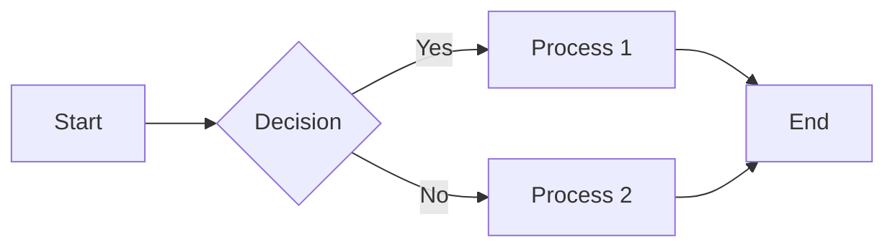
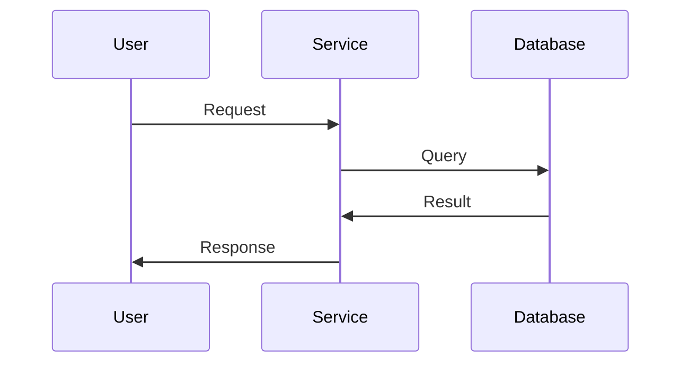

## 5. Markdown Standards & Best Practices

### 5.1 Markdown Syntax Standards

**Use CommonMark standard:** Azure DevOps wikis support CommonMark Markdown with extensions.

#### Headers

```markdown
# H1 - Page Title (use only once per page)
## H2 - Major Section
### H3 - Subsection
#### H4 - Sub-subsection
##### H5 - Rarely needed
###### H6 - Rarely needed
```

**Best practices:**

- Only one H1 per page (the page title)
- Use header hierarchy properly (don't skip levels)
- Keep headers concise and descriptive
- Use sentence case: "Getting started" not "Getting Started"

#### Links

**Internal wiki links (same wiki):**

```markdown
[Link text](/Folder/Page-Name)
[Operations Runbook](/Operations/Runbook)
```

**Internal wiki links (same folder):**

```markdown
[Link text](Page-Name)
[Architecture](Architecture)
```

**External links:**

```markdown
[Link text](https://example.com)
[Microsoft Docs](https://docs.microsoft.com)
```

**Links with titles (tooltips):**

```markdown
[Link text](https://example.com "Title text on hover")
```

**Best practices:**

- Use descriptive link text: `[troubleshooting guide]` not `[click here]`
- Prefer relative links for internal content
- Verify links after moving/renaming pages

#### Images

**Images from .attachments folder:**

```markdown


```

**Images with size:**

```markdown

```

**Images from URLs:**

```markdown

```

**Best practices:**

- Always include meaningful alt text (accessibility)
- Store images in `.attachments/` folder
- Use PNG for diagrams, JPG for photos
- Optimize image sizes (< 1MB per image)
- Use descriptive filenames: `email-flow-diagram.png` not `image1.png`

#### Lists

**Unordered lists:**

```markdown
- Item 1
- Item 2
  - Nested item 2.1
  - Nested item 2.2
- Item 3
```

**Ordered lists:**

```markdown
1. First step
2. Second step
   1. Sub-step
   2. Sub-step
3. Third step
```

**Task lists (checkboxes):**

```markdown
- [ ] Incomplete task
- [x] Completed task
- [ ] Another incomplete task
```

**Best practices:**

- Use unordered lists for related items without sequence
- Use ordered lists for sequential steps
- Use task lists for checklists and tracking
- Keep list items parallel in structure

#### Tables

```markdown
| Header 1 | Header 2 | Header 3 |
|----------|----------|----------|
| Cell 1   | Cell 2   | Cell 3   |
| Cell 4   | Cell 5   | Cell 6   |
```

**With alignment:**

```markdown
| Left Aligned | Center Aligned | Right Aligned |
|:-------------|:--------------:|--------------:|
| Left         | Center         | Right         |
```

**Best practices:**

- Keep tables simple (max 5-6 columns)
- Use alignment for readability
- Consider lists for small datasets
- For large tables, consider CSV or linking to spreadsheet

#### Code Blocks

**Inline code:**

```markdown
Use the `git commit` command.
```

**Code blocks with syntax highlighting:**

````markdown
```bash
git clone https://example.com/repo.git
cd repo
```

```python
def hello_world():
    print("Hello, world!")
```

```json
{
  "name": "example",
  "version": "1.0.0"
}
```
````

**Supported languages:** bash, powershell, python, javascript, csharp, java, yaml, json, sql, xml, and many more

**Best practices:**

- Always specify language for syntax highlighting
- Use code blocks for commands, code snippets, configuration
- Use inline code for short references: `variable_name`

#### Blockquotes

```markdown
> This is a note or important callout.
> It can span multiple lines.
```

```markdown
> **Important:** This is a critical note.
```

**Best practices:**

- Use for notes, warnings, important callouts
- Start with **Note:**, **Warning:**, **Important:** for clarity

#### Horizontal Rules

```markdown
---
```

Use horizontal rules to separate major sections.

#### Emphasis

```markdown
*Italic text* or _italic text_
**Bold text** or __bold text__
***Bold and italic*** or ___bold and italic___
~~Strikethrough text~~
```

**Best practices:**

- Use bold for **important terms** or **emphasis**
- Use italic for *definitions* or *light emphasis*
- Don't overuse - too much emphasis = no emphasis

### 5.2 Azure DevOps Wiki Extensions

Azure DevOps wikis support some extensions beyond standard Markdown:

#### Mermaid Diagrams

**Flowcharts:**

````markdown

````

**Sequence diagrams:**

````markdown

````

**For more complex diagrams, use external tools (Draw.io, Visio) and embed as images.**

#### @mentions

```markdown
@username - Mentions user in commit or pull request
#123 - Links to work item 123
!456 - Links to pull request 456
```

#### Mathematics (LaTeX)

```markdown
$$
E = mc^2
$$
```

**Inline math:**

```markdown
The formula $E = mc^2$ is famous.
```

### 5.3 Documentation Writing Best Practices

#### Writing Style

**Do:**

- ✅ Write in clear, concise language
- ✅ Use active voice: "Deploy the service" not "The service should be deployed"
- ✅ Use present tense: "The service connects to..." not "The service will connect to..."
- ✅ Be specific: "Wait 30 seconds" not "Wait a few seconds"
- ✅ Define acronyms on first use: "Single Sign-On (SSO)"
- ✅ Use examples to illustrate concepts
- ✅ Break up long paragraphs (3-5 sentences max)

**Don't:**

- ❌ Use jargon without explanation
- ❌ Write walls of text
- ❌ Assume knowledge - explain or link to prerequisites
- ❌ Use vague terms: "soon", "later", "basically"
- ❌ Write in first person: "I deployed" → "Deploy"

#### Structure

**Every page should have:**

1. **Clear title** (H1)
2. **Brief overview** (2-3 sentences - what is this page about?)
3. **Table of contents** (for long pages - automatically generated by headers)
4. **Logical sections** (H2, H3 headers)
5. **Examples** where appropriate
6. **Related links** at the bottom
7. **Last updated date** (optional but helpful)

**Example structure:**

```markdown
# Service Deployment Guide

This guide describes how to deploy the Email Gateway service to production.

**Prerequisites:**
- Access to Azure DevOps
- Contributor permissions on the repository
- Azure CLI installed

## Overview

[Brief description of deployment process]

## Preparation

### 1. Verify Prerequisites
[Steps]

### 2. Configure Environment
[Steps]

## Deployment Steps

### 1. Build the Application
[Steps with code examples]

### 2. Run Tests
[Steps]

### 3. Deploy to Staging
[Steps]

### 4. Verify Deployment
[Steps]

### 5. Deploy to Production
[Steps]

## Post-Deployment

### Verification Checklist
- [ ] Service responding to health checks
- [ ] Monitoring alerts configured
- [ ] Logs flowing to central system

### Rollback Procedure
[How to rollback if deployment fails]

## Troubleshooting

### Issue: Deployment Fails
**Symptoms:** [Description]
**Solution:** [Steps]

## Related Documentation
- Monitoring Guide
- Troubleshooting
- Architecture

---
*Last updated: 2025-01-15 by Jane Smith*
```

#### Accessibility

**Make documentation accessible:**

- Use clear, simple language
- Provide alt text for all images
- Use descriptive link text
- Structure content with headers (screen reader navigation)
- Use high contrast (avoid light gray on white)
- Don't rely on color alone to convey meaning

### 5.4 Documentation Linting

Create a linting pipeline to enforce standards (see Section 7.3).

**Common rules:**

- No broken internal links
- All images have alt text
- Headers follow hierarchy (no skipped levels)
- Files follow naming conventions
- Required sections present (e.g., every README has Overview)
- No spelling errors (run spell check)
- Markdown syntax is valid

---

## Related Topics

- [Overview](index.md)
- [Azure DevOps Wiki Types](wiki-types.md)
- [Architecture and Organization](architecture.md)
- [Project Wiki Implementation](project-wiki.md)
- [Code Wiki Implementation](code-wiki.md)
- [Markdown Standards and Best Practices](markdown-standards.md)
- [Version Control Workflow](version-control.md)
- [CI/CD Pipelines for Documentation](cicd-pipelines.md)
- [Documentation Templates](templates.md)
- [Template Repository and Automation](automation.md)
- [Access Control and Permissions](access-control.md)
- [Search and Discoverability](search.md)
- [Migration Strategy](migration.md)
- [Maintenance and Governance](governance.md)
- [Appendices](appendices.md)
