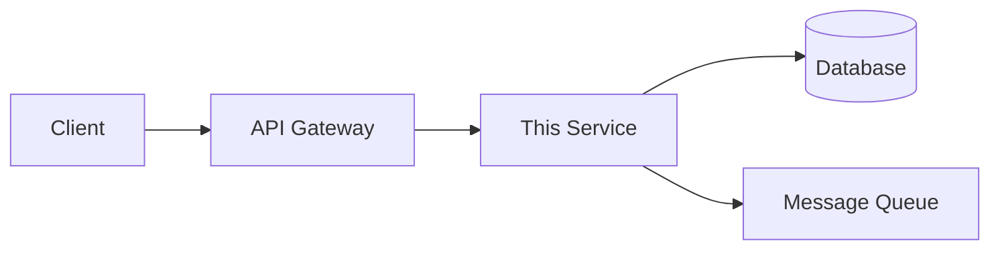
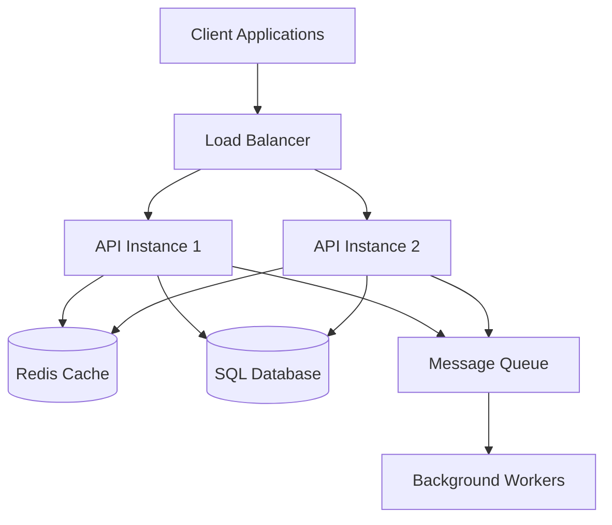
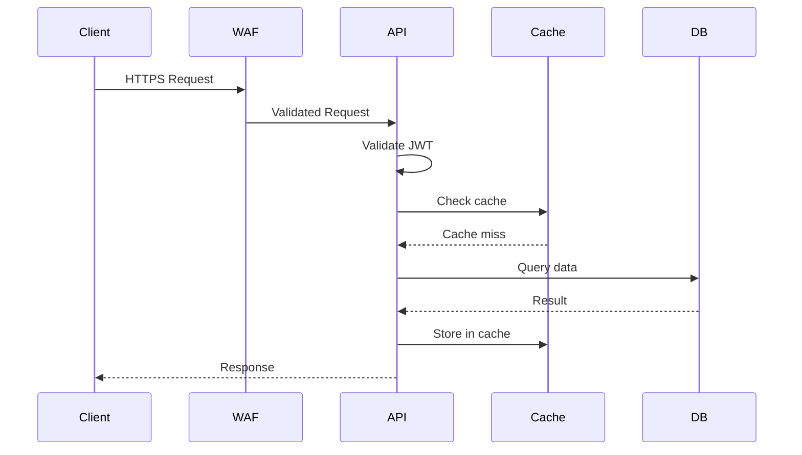

## 8. Templates & Automation

### 8.1 Documentation Templates

**Create reusable templates for common documentation types:**

### 8.1.1 Service README Template

**Location:** `/templates/Service-README-Template.md` in Project Wiki or shared repo

**Content:**

````markdown
# [Service Name]

## Overview

[2-3 sentences describing what this service does and its purpose]

**Status:** [🟢 Production / 🟡 Development / 🔴 Deprecated]  
**Team:** [Team Name]  
**Owner:** [Name] ([email@company.com](mailto:email@company.com))  
**Repository:** [Link to repository]

## Quick Links

- Architecture
- Operations Runbook
- API Documentation
- Troubleshooting
- [Monitoring Dashboard](https://monitoring.company.com/dashboard)

## Service Information

| Attribute | Value |
|-----------|-------|
| **Service Type** | [Web API / Background Service / Database / Infrastructure] |
| **Technology Stack** | [e.g., .NET 6, Python 3.11, PostgreSQL 14] |
| **Hosting Platform** | [e.g., Azure App Service, Kubernetes, Azure VMs] |
| **Primary Language** | [C# / Python / Java / etc.] |
| **Key Dependencies** | [List 3-5 key dependencies] |
| **Data Storage** | [SQL Server / Cosmos DB / None / etc.] |

## Architecture

[Include high-level architecture diagram or link to Architecture.md]



For detailed architecture documentation, see *Architecture.md* (placeholder).

## Getting Started

### For Operators

1. Deploy the service (*Operations/Deployment.md* - placeholder)
2. Configure monitoring (*Operations/Monitoring.md* - placeholder)
3. Review operational runbook (*Operations/Runbook.md* - placeholder)

### For Developers

1. Set up local development environment (*Development/Local-Setup.md* - placeholder)
2. Review contribution guidelines (*Development/Contributing.md* - placeholder)
3. Run tests (*Development/Testing.md* - placeholder)

### For Consumers

1. Review API documentation (*API/Overview.md* - placeholder)
2. See integration examples (*API/Examples.md* - placeholder)
3. Understand authentication (*API/Authentication.md* - placeholder)

## Key Features

- **Feature 1:** [Description]
- **Feature 2:** [Description]
- **Feature 3:** [Description]

## Service Level Objectives (SLOs)

| Metric | Target | Current |
|--------|--------|---------|
| Availability | 99.9% | [Link to dashboard] |
| Latency (p95) | < 200ms | [Link to dashboard] |
| Error Rate | < 1% | [Link to dashboard] |

## Support

- **On-Call:** [Link to PagerDuty/on-call schedule]
- **Team Channel:** [#team-channel on Slack/Teams]
- **Email:** [team@company.com](mailto:team@company.com)
- **Issue Tracking:** *Azure DevOps Board* (*link* - placeholder)

## Related Services

- Service A (*link-to-wiki* - placeholder) - [Brief description of relationship]
- Service B (*link-to-wiki* - placeholder) - [Brief description of relationship]

## Recent Changes

See *CHANGELOG.md* (placeholder) for detailed version history.

## Contributing

This service is maintained by [Team Name]. For contribution guidelines, see *Contributing Guide* (*Development/Contributing.md* - placeholder).

---
*Documentation last reviewed: [YYYY-MM-DD]*

````

### 8.1.2 Operations Runbook Template

**Location:** `/templates/Runbook-Template.md`

````markdown
# [Service Name] Operations Runbook

## Service Overview

**Service Name:** [Name]  
**Purpose:** [Brief description]  
**Owner:** [Team/Person]  
**On-Call:** [Link to schedule]

## Service Health

**Health Check Endpoint:** `https://service.company.com/health`  
**Expected Response:** `200 OK` with `{"status": "healthy"}`

**Monitoring Dashboard:** [Link to Grafana/Azure Monitor]  
**Alerting:** [Link to alert configuration]

## Service Management

### Start/Stop Procedures

**Start Service:**
```bash
# Azure App Service
az webapp start --name service-name --resource-group rg-name

# Kubernetes
kubectl scale deployment service-name --replicas=3 -n namespace
```

**Stop Service:**

```bash
# Azure App Service
az webapp stop --name service-name --resource-group rg-name

# Kubernetes
kubectl scale deployment service-name --replicas=0 -n namespace
```

**Restart Service:**

```bash
# Azure App Service
az webapp restart --name service-name --resource-group rg-name

# Kubernetes
kubectl rollout restart deployment service-name -n namespace
```

### Configuration

**Configuration Location:** [Azure App Configuration / Environment Variables / Config file]  
**Key Configuration Items:**

- `DATABASE_CONNECTION_STRING`: [Description, how to update]
- `API_KEY`: [Description, how to rotate]
- `LOG_LEVEL`: [Description, valid values]

**Updating Configuration:**

1. [Step-by-step process]
2. [Include rollback procedure]

## Monitoring & Alerting

### Key Metrics

| Metric | Threshold | Alert Severity | Dashboard Link |
|--------|-----------|----------------|----------------|
| CPU Usage | >80% for 10 min | Warning | [Link] |
| Memory Usage | >85% | Warning | [Link] |
| Error Rate | >1% | Critical | [Link] |
| Latency (p95) | >500ms | Warning | [Link] |
| Availability | <99% | Critical | [Link] |

### Logs

**Log Location:** [Azure Log Analytics / CloudWatch / File path]  
**Query Examples:**

Find errors in last hour:

```kusto
traces
| where timestamp > ago(1h)
| where severityLevel >= 3
| project timestamp, message, severityLevel
```

Track specific request:

```kusto
requests
| where operation_Id == "request-id"
| project timestamp, name, duration, resultCode
```

## Common Operations

### Deploy New Version

1. Review *Deployment Guide* (*Deployment.md* - placeholder)
2. Check for breaking changes
3. Deploy to staging first
4. Run smoke tests
5. Deploy to production
6. Monitor for issues
7. **Rollback procedure if needed:** *[link to section]* (placeholder)

### Scale Service

**Horizontal Scaling (add/remove instances):**

```bash
# Azure App Service
az appservice plan update --name plan-name --resource-group rg-name --number-of-workers 5

# Kubernetes
kubectl scale deployment service-name --replicas=5 -n namespace
```

**Vertical Scaling (change instance size):**

```bash
# Azure App Service
az appservice plan update --name plan-name --resource-group rg-name --sku P2V2
```

**Auto-scaling:** [Link to auto-scale configuration]

### Database Maintenance

**Backup:** [Automatic, manual trigger, location]  
**Restore:** See *Backup and Recovery Guide* (*Backup-Recovery.md* - placeholder)  
**Index Maintenance:** [Schedule, procedure]

## Troubleshooting

### High CPU Usage

**Symptoms:**

- CPU consistently above 80%
- Slow response times
- Queue buildup

**Diagnosis:**

1. Check monitoring dashboard for spike timing
2. Review logs for exceptions or long-running operations
3. Check for unusual traffic patterns

**Resolution:**

1. Scale horizontally (add instances)
2. Investigate and optimize slow queries/operations
3. Consider scaling vertically if pattern persists

**Prevention:** Review performance metrics weekly, optimize as needed

---

### Service Unavailable

**Symptoms:**

- Health check endpoint returns 503
- Alerts triggered
- Users unable to access service

**Diagnosis:**

1. Check service status: `az webapp show --name service-name --resource-group rg-name`
2. Review recent deployments
3. Check dependent services
4. Review logs for startup errors

**Resolution:**

1. Attempt restart
2. If restart fails, rollback to previous version
3. Check configuration for changes
4. Verify database connectivity

**Escalation:** If unresolved in 15 minutes, escalate to [senior engineer]

---

### [Add more troubleshooting scenarios as discovered]

**Template for new scenarios:**
**Symptoms:** [What users/monitors observe]  
**Diagnosis:** [How to investigate]  
**Resolution:** [Step-by-step fix]  
**Prevention:** [How to avoid recurrence]  
**Escalation:** [When/who to escalate to]

## Disaster Recovery

**RTO (Recovery Time Objective):** [X hours]  
**RPO (Recovery Point Objective):** [X hours of data loss acceptable]

**DR Site:** [Location]  
**Failover Procedure:** See *Disaster Recovery Plan* (*Disaster-Recovery.md* - placeholder)  
**Failback Procedure:** See *Disaster Recovery Plan* (*Disaster-Recovery.md* - placeholder)

**Last DR Test:** [Date]  
**Next DR Test:** [Date]

## Maintenance Windows

**Standard Window:** [Day/Time, e.g., "Sunday 02:00-06:00 UTC"]  
**Blackout Periods:** [Times when maintenance not allowed]  
**Notification:** [How users are notified]

**Maintenance Checklist:**

- [ ] Schedule approved
- [ ] Stakeholders notified
- [ ] Backup verified
- [ ] Rollback plan ready
- [ ] Monitoring active
- [ ] On-call engineer available

## Contacts

### Primary Team

- **Team Lead:** [Name] ([email](mailto:email)) - [Phone]
- **Engineer 1:** [Name] ([email](mailto:email)) - [Phone]
- **Engineer 2:** [Name] ([email](mailto:email)) - [Phone]

### Escalation

1. On-call engineer (via PagerDuty)
2. Team lead: [Name/Phone]
3. Engineering manager: [Name/Phone]
4. Director: [Name/Phone]

### Team Dependencies

- **Database Team:** [Contact]
- **Network Team:** [Contact]
- **Security Team:** [Contact]

## Related Documentation

- *Architecture Documentation* (*../Architecture.md* - placeholder)
- *Deployment Guide* (*Deployment.md* - placeholder)
- *Monitoring Guide* (*Monitoring.md* - placeholder)
- *Disaster Recovery Plan* (*Disaster-Recovery.md* - placeholder)
- *API Documentation* (*../API/Overview.md* - placeholder)

## Document History

| Version | Date | Author | Changes |
|---------|------|--------|---------|
| 1.0 | YYYY-MM-DD | [Name] | Initial version |

---
*This runbook is maintained by [Team Name]. Last reviewed: [YYYY-MM-DD]*

````

### 8.1.3 Architecture Document Template

**Location:** `/templates/Architecture-Template.md`

````markdown
# [Service Name] Architecture

## Overview

[High-level description of the service and its purpose in 3-4 sentences]

**Status:** [Current / Under Development / Deprecated]  
**Last Updated:** [YYYY-MM-DD]  
**Authors:** [Names]

## Context & Background

### Business Requirements

[Why does this service exist? What business problem does it solve?]

### Key Stakeholders

- **Business Owner:** [Name/Role]
- **Technical Owner:** [Team/Person]
- **Primary Users:** [Who uses this service]

### Design Goals

1. [Goal 1 - e.g., "High availability (99.9% uptime)"]
2. [Goal 2 - e.g., "Low latency (<200ms p95)"]
3. [Goal 3 - e.g., "Scalable to 10,000 requests/second)"]

## High-Level Architecture

[Include architecture diagram here]



### Key Components

| Component | Technology | Purpose | Scaling Strategy |
|-----------|------------|---------|------------------|
| [API Layer] | [ASP.NET Core] | [REST API endpoints] | [Horizontal - auto-scale 2-10 instances] |
| [Database] | [SQL Server] | [Persistent storage] | [Vertical + read replicas] |
| [Cache] | [Redis] | [Session + response caching] | [Cluster mode] |
| [Message Queue] | [Azure Service Bus] | [Async processing] | [Auto-scale] |

## Detailed Design

### Component: API Layer

**Technology:** [ASP.NET Core 6, hosted on Azure App Service]  
**Instances:** [2 minimum, 10 maximum]  
**Resources:** [2 CPU cores, 4GB RAM per instance]

**Responsibilities:**

- Handle incoming HTTP requests
- Authentication and authorization
- Request validation
- Response formatting
- Caching coordination

**Key Design Decisions:**

- **Stateless design:** No session state on API servers (stored in Redis)
- **Circuit breaker pattern:** Fail fast when dependencies unavailable
- **Rate limiting:** 1000 requests/min per API key

**API Endpoints:**

- `GET /api/v1/resources` - List resources
- `GET /api/v1/resources/{id}` - Get resource
- `POST /api/v1/resources` - Create resource
- *See full API documentation* (*API/Overview.md* - placeholder)

---

### Component: Database

**Technology:** [Azure SQL Database, Standard tier S3]  
**Size:** [250 GB]  
**Read Replicas:** [1 replica for reporting queries]

**Schema Design:**

- **Tables:** [List key tables and their relationships]
- **Indexes:** [Key indexes for performance]
- **Partitioning:** [Strategy if applicable]

**Backup Strategy:**

- **Automated backups:** Daily full, hourly transaction logs
- **Retention:** 30 days
- **Point-in-time restore:** Within last 30 days

---

### [Repeat for each major component]

## Data Flow

### Request Flow

1. Client sends HTTPS request to `api.company.com`
2. Azure Traffic Manager routes to nearest region
3. Azure Application Gateway (WAF) validates request
4. Load balancer distributes to API instance
5. API instance:
   - Checks authentication (JWT validation)
   - Checks cache (Redis) for response
   - If cache miss, queries database
   - Caches result
   - Returns response

**Sequence Diagram:**



### Write Flow

1. Client sends POST/PUT request
2. API validates and authenticates
3. API writes to database (transactional)
4. API publishes event to message queue
5. Background worker processes event
6. API invalidates relevant cache entries
7. API returns success response

## Security Architecture

### Authentication & Authorization

**Authentication Method:** [OAuth 2.0 / JWT / SAML]  
**Identity Provider:** [Azure AD / Okta / Custom]

**Authorization Model:** [RBAC / ABAC]  
**Roles:**

- `admin`: Full access
- `user`: Read and limited write
- `readonly`: Read-only access

### Data Security

**Encryption at Rest:** [AES-256, managed by Azure]  
**Encryption in Transit:** [TLS 1.2+]  
**Secrets Management:** [Azure Key Vault]

**Sensitive Data:**

- PII is encrypted at application level
- Credit card data is tokenized (not stored)
- Passwords are hashed (bcrypt)

### Network Security

**Network Segmentation:** [VNet with subnets]  
**Firewall Rules:** [Only ports 443 and 3306 exposed]  
**DDoS Protection:** [Azure DDoS Protection Standard]

## Scalability & Performance

### Scaling Strategy

**Horizontal Scaling:**

- API layer: Auto-scale based on CPU (>70%) and request count
- Worker layer: Auto-scale based on queue depth

**Vertical Scaling:**

- Database: Manual upgrade to higher tier when approaching limits

**Current Capacity:** [1000 requests/second]  
**Growth Plan:** [5x capacity within 12 months]

### Performance Optimizations

- **Caching:** Redis for sessions and frequently accessed data (TTL: 5 minutes)
- **CDN:** Static assets served from Azure CDN
- **Database:** Indexed on common query patterns
- **Async Processing:** Long-running tasks processed in background

### Load Testing Results

| Test Scenario | Throughput | Latency (p95) | Error Rate |
|---------------|------------|---------------|------------|
| Normal load | 1000 req/s | 150ms | <0.1% |
| Peak load | 2000 req/s | 300ms | <1% |
| Stress test | 5000 req/s | 1200ms | 5% |

## Reliability & Availability

### High Availability Design

**Target SLA:** 99.9% (8.76 hours downtime/year)

**HA Mechanisms:**

- **API Layer:** Multi-instance deployment across availability zones
- **Database:** Automatic failover to secondary replica
- **Cache:** Redis cluster with replication
- **Load Balancer:** Azure Load Balancer with health probes

**Single Points of Failure:** [None / List if any]

### Disaster Recovery Plan

**RTO:** [4 hours]  
**RPO:** [1 hour]

**DR Strategy:** [Active-Passive / Active-Active / Backup and Restore]  
**DR Site:** [Azure Region 2]

**Failover Procedure:** See *Disaster Recovery Plan* (*Operations/Disaster-Recovery.md* - placeholder)

### Monitoring & Alerting Configuration

**Monitoring Tools:**

- **Application Performance:** Application Insights
- **Infrastructure:** Azure Monitor
- **Logs:** Log Analytics
- **Dashboards:** Grafana

**Key Alerts:**

- Service availability <99.9%
- Error rate >1%
- Latency (p95) >500ms
- Database connection pool exhausted

## Dependencies

### External Dependencies

| Dependency | Type | Criticality | Failure Impact | Mitigation |
|------------|------|-------------|----------------|------------|
| [Azure AD] | [Authentication] | [Critical] | [Users can't log in] | [Cached credentials, 1-hour validity] |
| [Payment API] | [External API] | [High] | [Can't process payments] | [Queue for retry, manual processing] |
| [Email Service] | [External Service] | [Medium] | [Notifications not sent] | [Queue for retry] |

### Internal Dependencies

- [Service A]: [Purpose of dependency]
- [Service B]: [Purpose of dependency]

## Deployment Architecture

**Environments:**

- **Development:** Single instance, shared database
- **Staging:** Production-like, separate database
- **Production:** Multi-instance, HA configuration

**Deployment Method:** [Blue-Green / Rolling / Canary]  
**Deployment Frequency:** [Multiple times per day / Weekly]

**Infrastructure as Code:** [Terraform / ARM Templates / Bicep]  
**CI/CD Pipeline:** [Link to Azure DevOps pipeline]

## Technology Stack

### Application Layer

- **Language:** [C# / Python / Java]
- **Framework:** [ASP.NET Core 6 / Django / Spring Boot]
- **Version:** [Specific version]

### Data Layer

- **Primary Database:** [Azure SQL Database]
- **Cache:** [Redis 6.x]
- **Message Queue:** [Azure Service Bus]

### Infrastructure

- **Hosting:** [Azure App Service]
- **Container Registry:** [Azure Container Registry] (if applicable)
- **Orchestration:** [Kubernetes] (if applicable)

### Third-Party Libraries

- [Library 1] - [Purpose]
- [Library 2] - [Purpose]
- [Full list in repository documentation]

## Known Limitations

1. **[Limitation 1]:** [Description and workaround/plan to address]
2. **[Limitation 2]:** [Description and workaround/plan to address]

## Future Enhancements

1. **[Enhancement 1]:** [Description, target timeline]
2. **[Enhancement 2]:** [Description, target timeline]

## Architecture Decision Records (ADRs)

Major architecture decisions are documented separately:

- *ADR-001: Choice of Database Technology* (*ADRs/ADR-001-Database-Choice.md* - placeholder)
- *ADR-002: API Gateway vs Direct Access* (*ADRs/ADR-002-API-Gateway.md* - placeholder)

## Architecture Documentation References

- *Operations Runbook* (*Operations/Runbook.md* - placeholder)
- *API Documentation* (*API/Overview.md* - placeholder)
- *Deployment Guide* (*Operations/Deployment.md* - placeholder)
- *Monitoring Guide* (*Operations/Monitoring.md* - placeholder)

## Architecture Document History

| Version | Date | Author | Changes |
|---------|------|--------|---------|
| 1.0 | YYYY-MM-DD | [Name] | Initial architecture document |

---
*This document is maintained by [Team Name]. Last reviewed: [YYYY-MM-DD]*

````

## Related Topics

- [Overview](index.md)
- [Azure DevOps Wiki Types](wiki-types.md)
- [Architecture and Organization](architecture.md)
- [Project Wiki Implementation](project-wiki.md)
- [Code Wiki Implementation](code-wiki.md)
- [Markdown Standards and Best Practices](markdown-standards.md)
- [Version Control Workflow](version-control.md)
- [CI/CD Pipelines for Documentation](cicd-pipelines.md)
- [Documentation Templates](templates.md)
- [Template Repository and Automation](automation.md)
- [Access Control and Permissions](access-control.md)
- [Search and Discoverability](search.md)
- [Migration Strategy](migration.md)
- [Maintenance and Governance](governance.md)
- [Appendices](appendices.md)
