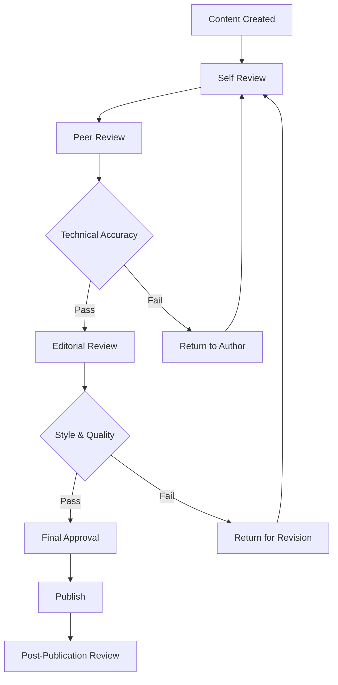

## Content Strategy

A well-defined content strategy is essential for successful Documentation as Code implementation. This guide covers content planning, organization, governance, and lifecycle management to ensure your documentation serves its intended audience effectively and remains maintainable over time.

## Content Planning

### Audience Analysis

**Primary Audiences:**

| Audience | Goals | Content Needs | Preferred Format |
|----------|-------|---------------|------------------|
| **Developers** | Implement and integrate | API references, code examples | Technical docs, tutorials |
| **System Administrators** | Deploy and configure | Installation guides, configuration | Step-by-step guides |
| **End Users** | Use features effectively | User guides, tutorials | How-to articles, videos |
| **Decision Makers** | Understand capabilities | Overviews, comparisons | Executive summaries |
| **Support Teams** | Troubleshoot issues | Troubleshooting guides | Reference materials |

**Audience Personas:**

```yaml
personas:
  - name: "Sarah - Senior Developer"
    background: "5+ years experience, works with APIs daily"
    goals: ["Quick implementation", "Best practices", "Code examples"]
    pain_points: ["Outdated documentation", "Missing examples"]
    content_preferences: ["Code-heavy", "Concise", "Searchable"]
  
  - name: "Mike - DevOps Engineer"
    background: "Infrastructure focus, automation advocate"
    goals: ["Deployment automation", "Configuration management"]
    pain_points: ["Complex setup procedures", "Environment differences"]
    content_preferences: ["Step-by-step", "Validated procedures", "Scripts"]
  
  - name: "Jessica - Product Manager"
    background: "Non-technical, feature-focused"
    goals: ["Feature understanding", "User impact assessment"]
    pain_points: ["Technical jargon", "Lack of business context"]
    content_preferences: ["High-level overviews", "Visual aids", "Business value"]
```

### Content Audit

**Existing Content Assessment:**

```text
Content Audit Framework:
├── Content Inventory
│   ├── What content exists?
│   ├── Where is it located?
│   ├── Who owns it?
│   └── When was it last updated?
├── Quality Assessment
│   ├── Accuracy and currency
│   ├── Completeness and depth
│   ├── Clarity and usability
│   └── Technical accuracy
├── Gap Analysis
│   ├── Missing content areas
│   ├── Audience needs not met
│   ├── Outdated information
│   └── Redundant content
└── Priority Matrix
    ├── High impact, low effort
    ├── High impact, high effort
    ├── Low impact, low effort
    └── Low impact, high effort
```

**Content Audit Checklist:**

```markdown
## Content Audit Checklist

### Content Discovery
- [ ] Identify all existing documentation sources
- [ ] Catalog content by type and audience
- [ ] Map content to user journeys
- [ ] Document content ownership

### Quality Assessment
- [ ] Check for accuracy and currency
- [ ] Evaluate completeness
- [ ] Assess clarity and usability
- [ ] Validate technical information

### Gap Analysis
- [ ] Identify missing content areas
- [ ] Map gaps to audience needs
- [ ] Prioritize gap closure
- [ ] Plan content creation

### Consolidation Planning
- [ ] Identify redundant content
- [ ] Plan content merging
- [ ] Define canonical sources
- [ ] Create migration plan
```

## Information Architecture

### Content Taxonomy

**Hierarchical Structure:**

```text
Documentation Hub
├── Getting Started
│   ├── Quick Start Guide
│   ├── Installation Instructions
│   ├── Basic Configuration
│   └── First Steps Tutorial
├── User Guides
│   ├── Feature Overviews
│   ├── How-to Articles
│   ├── Best Practices
│   └── Use Cases
├── Developer Resources
│   ├── API Reference
│   ├── SDK Documentation
│   ├── Code Examples
│   └── Integration Guides
├── Administrator Guides
│   ├── Installation & Setup
│   ├── Configuration Management
│   ├── Security & Permissions
│   └── Maintenance & Updates
├── Reference Materials
│   ├── Configuration Reference
│   ├── CLI Documentation
│   ├── Error Codes
│   └── Glossary
└── Support Resources
    ├── Troubleshooting
    ├── FAQ
    ├── Community Resources
    └── Contact Information
```

### Content Types and Templates

**Content Type Definitions:**

| Content Type | Purpose | Template | Audience |
|--------------|---------|----------|----------|
| **Quick Start** | Rapid onboarding | Getting started template | New users |
| **Tutorial** | Step-by-step learning | Tutorial template | Learners |
| **How-to Guide** | Task completion | How-to template | Task-oriented users |
| **Reference** | Lookup information | Reference template | Experienced users |
| **Conceptual** | Understanding | Concept template | All users |
| **API Documentation** | Technical reference | API template | Developers |
| **Troubleshooting** | Problem resolution | Troubleshooting template | Support teams |

**Template Structures:**

```markdown
# Quick Start Template

## Overview
Brief description of what users will accomplish.

## Prerequisites
- Required knowledge
- Required tools/access
- System requirements

## Steps
1. First step with clear action
2. Second step with expected outcome
3. Continue numbered steps

## Verification
How to confirm success.

## Next Steps
Links to related content.

## Troubleshooting
Common issues and solutions.
```

```markdown
# API Reference Template

## [Method Name]

Brief description of the method.

### Syntax

```http
METHOD /endpoint
```

### Parameters

| Parameter | Type | Required | Description |
|-----------|------|----------|-------------|
| param1 | string | Yes | Description |

### Request Example

```json
{
  "example": "request"
}
```

### Response Example

```json
{
  "example": "response"
}
```

### Error Codes

| Code | Description |
|------|-------------|
| 400 | Bad Request |

```markdown

### Navigation Design

**Primary Navigation:**

```yaml
navigation:
  main:
    - name: "Home"
      url: "/"
      description: "Documentation hub homepage"
    
    - name: "Getting Started"
      url: "/getting-started/"
      children:
        - name: "Quick Start"
          url: "/getting-started/quick-start/"
        - name: "Installation"
          url: "/getting-started/installation/"
    
    - name: "Guides"
      url: "/guides/"
      children:
        - name: "User Guides"
          url: "/guides/user/"
        - name: "Developer Guides"
          url: "/guides/developer/"
        - name: "Admin Guides"
          url: "/guides/admin/"
    
    - name: "Reference"
      url: "/reference/"
      children:
        - name: "API Reference"
          url: "/reference/api/"
        - name: "CLI Reference"
          url: "/reference/cli/"
    
    - name: "Support"
      url: "/support/"
      children:
        - name: "Troubleshooting"
          url: "/support/troubleshooting/"
        - name: "FAQ"
          url: "/support/faq/"

  secondary:
    - name: "Search"
      type: "search"
    - name: "GitHub"
      url: "https://github.com/organization/repository"
      external: true
    - name: "Feedback"
      url: "/feedback/"
```

## Content Creation Guidelines

### Writing Standards

**Style Guide Principles:**

```yaml
style_guide:
  voice_and_tone:
    voice: "Clear, helpful, professional"
    tone: "Friendly but authoritative"
    personality: "Expert guide, not robotic manual"
  
  writing_principles:
    - "Write for scanners and readers"
    - "Use active voice"
    - "Keep sentences concise"
    - "Lead with user benefits"
    - "Use parallel structure"
  
  formatting:
    headings:
      - "Use sentence case"
      - "Be descriptive and specific"
      - "Include keywords"
    
    lists:
      - "Use parallel structure"
      - "Lead with action words"
      - "Keep items concise"
    
    code:
      - "Include complete examples"
      - "Provide context"
      - "Explain non-obvious parts"
```

**Content Quality Checklist:**

```markdown
## Content Quality Checklist

### Clarity and Readability
- [ ] Uses clear, concise language
- [ ] Avoids unnecessary jargon
- [ ] Explains technical terms
- [ ] Follows consistent style
- [ ] Uses active voice

### Structure and Organization
- [ ] Has clear heading hierarchy
- [ ] Uses logical flow
- [ ] Includes table of contents for long content
- [ ] Uses appropriate content type template
- [ ] Has clear introduction and conclusion

### Accuracy and Completeness
- [ ] Information is current and accurate
- [ ] Includes all necessary steps
- [ ] Provides working code examples
- [ ] Links to relevant resources
- [ ] Addresses common edge cases

### User Experience
- [ ] Serves identified audience needs
- [ ] Includes prerequisites clearly
- [ ] Provides verification steps
- [ ] Offers troubleshooting guidance
- [ ] Links to next steps

### Technical Implementation
- [ ] Code examples are tested
- [ ] Screenshots are current
- [ ] Links are functional
- [ ] Metadata is complete
- [ ] SEO elements are optimized
```

### Multimedia Integration

**Visual Content Strategy:**

```text
Visual Content Types:
├── Screenshots
│   ├── UI demonstrations
│   ├── Step-by-step visuals
│   ├── Before/after comparisons
│   └── Error state examples
├── Diagrams
│   ├── Architecture diagrams
│   ├── Process flow charts
│   ├── Network diagrams
│   └── Concept illustrations
├── Videos
│   ├── Product demos
│   ├── Tutorial walkthroughs
│   ├── Feature highlights
│   └── Troubleshooting guides
└── Interactive Elements
    ├── Code playgrounds
    ├── Interactive tutorials
    ├── Configuration wizards
    └── API explorers
```

**Image Guidelines:**

```yaml
image_standards:
  technical_requirements:
    format: "PNG for UI, JPG for photos, SVG for diagrams"
    resolution: "2x for retina displays"
    compression: "Optimize for web delivery"
    size_limits: "Max 500KB per image"
  
  content_requirements:
    alt_text: "Descriptive and meaningful"
    captions: "Provide context when needed"
    annotations: "Highlight important elements"
    consistency: "Use consistent UI themes"
  
  accessibility:
    contrast: "Maintain sufficient contrast"
    text_size: "Readable at standard zoom"
    color_reliance: "Don't rely solely on color"
    screen_readers: "Provide alt text and descriptions"
```

## Content Governance

### Ownership Model

**Content Responsibility Matrix:**

| Content Type | Owner | Contributors | Reviewers | Approvers |
|--------------|-------|--------------|-----------|-----------|
| **API Documentation** | Engineering | Developers | Tech Writers | Engineering Lead |
| **User Guides** | Product | UX, Support | Tech Writers | Product Manager |
| **Installation Guides** | DevOps | Engineering | Tech Writers | DevOps Lead |
| **Troubleshooting** | Support | Engineering | Tech Writers | Support Manager |
| **Getting Started** | Product | Engineering, UX | Tech Writers | Product Manager |

**Roles and Responsibilities:**

```yaml
roles:
  content_owner:
    responsibilities:
      - "Define content strategy"
      - "Ensure accuracy and completeness"
      - "Coordinate with subject matter experts"
      - "Approve final content"
    
  contributor:
    responsibilities:
      - "Create and update content"
      - "Provide subject matter expertise"
      - "Review related content"
      - "Participate in content planning"
    
  reviewer:
    responsibilities:
      - "Ensure quality standards"
      - "Check for consistency"
      - "Validate technical accuracy"
      - "Provide improvement suggestions"
    
  approver:
    responsibilities:
      - "Final content approval"
      - "Alignment with business goals"
      - "Resource allocation decisions"
      - "Strategic direction setting"
```

### Review and Approval Process

**Content Review Workflow:**



**Review Criteria:**

```yaml
review_criteria:
  technical_accuracy:
    - "Information is correct and current"
    - "Code examples work as documented"
    - "Links are functional and relevant"
    - "Prerequisites are accurate"
  
  editorial_quality:
    - "Follows style guide"
    - "Clear and concise writing"
    - "Appropriate for target audience"
    - "Consistent terminology"
  
  structural_completeness:
    - "Uses appropriate template"
    - "Includes all required sections"
    - "Proper heading hierarchy"
    - "Complete metadata"
  
  user_experience:
    - "Serves user needs effectively"
    - "Logical flow and organization"
    - "Actionable and clear instructions"
    - "Appropriate length and depth"
```

## Content Lifecycle Management

### Publication Workflow

**Content States:**

```text
Content Lifecycle States:
├── Draft
│   ├── Initial creation
│   ├── Work in progress
│   └── Ready for review
├── Review
│   ├── Peer review
│   ├── Technical review
│   └── Editorial review
├── Approved
│   ├── Ready for publication
│   ├── Scheduled publication
│   └── Pending deployment
├── Published
│   ├── Live and accessible
│   ├── Indexed and searchable
│   └── Analytics tracking
├── Maintenance
│   ├── Regular updates
│   ├── Issue resolution
│   └── Accuracy verification
└── Archived
    ├── Outdated content
    ├── Deprecated features
    └── Historical reference
```

### Maintenance Strategy

**Content Maintenance Schedule:**

```yaml
maintenance_schedule:
  daily:
    - "Monitor user feedback"
    - "Check for broken links"
    - "Review analytics data"
  
  weekly:
    - "Update changing information"
    - "Process improvement suggestions"
    - "Review search queries"
  
  monthly:
    - "Content freshness audit"
    - "Performance review"
    - "User survey analysis"
  
  quarterly:
    - "Comprehensive content review"
    - "Architecture assessment"
    - "Strategy adjustment"
  
  annually:
    - "Complete content audit"
    - "Technology stack review"
    - "User research update"
```

**Maintenance Triggers:**

```text
Content Update Triggers:
├── Product Changes
│   ├── New features released
│   ├── UI/UX updates
│   ├── API changes
│   └── Deprecated functionality
├── User Feedback
│   ├── Confusion reports
│   ├── Missing information requests
│   ├── Error reports
│   └── Improvement suggestions
├── Analytics Insights
│   ├── High bounce rates
│   ├── Low engagement
│   ├── Search failures
│   └── Support ticket patterns
└── External Changes
    ├── Third-party tool updates
    ├── Platform changes
    ├── Security updates
    └── Compliance requirements
```

## Measurement and Analytics

### Success Metrics

**Content Performance KPIs:**

| Metric Category | KPI | Target | Measurement Method |
|----------------|-----|--------|-------------------|
| **Usage** | Page views | +10% monthly | Google Analytics |
| **Engagement** | Time on page | >2 minutes | Analytics |
| **Effectiveness** | Task completion | >80% | User testing |
| **Quality** | User satisfaction | >4.0/5.0 | Feedback surveys |
| **Maintenance** | Content freshness | <30 days avg age | CMS tracking |

**Analytics Implementation:**

```javascript
// Documentation analytics tracking
(function() {
    // Track content engagement
    function trackContentEngagement() {
        var startTime = Date.now();
        var engaged = false;
        var engagementThreshold = 30000; // 30 seconds
        
        // Track scroll depth
        var maxScroll = 0;
        window.addEventListener('scroll', function() {
            var scrollPercent = Math.round(
                (window.scrollY / (document.body.scrollHeight - window.innerHeight)) * 100
            );
            maxScroll = Math.max(maxScroll, scrollPercent);
        });
        
        // Track engagement time
        setTimeout(function() {
            engaged = true;
        }, engagementThreshold);
        
        // Send data on page unload
        window.addEventListener('beforeunload', function() {
            var timeSpent = Date.now() - startTime;
            var data = {
                page: window.location.pathname,
                timeSpent: timeSpent,
                engaged: engaged,
                scrollDepth: maxScroll,
                contentType: getContentType(),
                userAgent: navigator.userAgent
            };
            
            // Send to analytics
            if (typeof gtag !== 'undefined') {
                gtag('event', 'content_engagement', data);
            }
        });
    }
    
    function getContentType() {
        var path = window.location.pathname;
        if (path.includes('/api/')) return 'api-reference';
        if (path.includes('/guides/')) return 'guide';
        if (path.includes('/tutorials/')) return 'tutorial';
        if (path.includes('/reference/')) return 'reference';
        return 'other';
    }
    
    // Initialize tracking
    if (document.readyState === 'loading') {
        document.addEventListener('DOMContentLoaded', trackContentEngagement);
    } else {
        trackContentEngagement();
    }
})();
```

### User Feedback Integration

**Feedback Collection Methods:**

```yaml
feedback_methods:
  page_level:
    type: "Thumbs up/down with comments"
    implementation: "Embedded widget"
    triggers: ["Page load", "Scroll to bottom"]
  
  section_level:
    type: "Helpful/Not helpful buttons"
    implementation: "Inline feedback"
    triggers: ["Section completion"]
  
  comprehensive:
    type: "Detailed survey"
    implementation: "Quarterly pop-up"
    triggers: ["Return visits", "High engagement"]
  
  continuous:
    type: "Contact form"
    implementation: "Always available"
    triggers: ["User initiated"]
```

## Content Migration

### Migration Planning

**Migration Strategy:**

```text
Migration Phases:
├── Phase 1: Foundation
│   ├── Set up infrastructure
│   ├── Create templates
│   ├── Define workflows
│   └── Train initial team
├── Phase 2: Core Content
│   ├── Migrate critical documentation
│   ├── Update high-traffic content
│   ├── Implement feedback systems
│   └── Monitor performance
├── Phase 3: Comprehensive Migration
│   ├── Move remaining content
│   ├── Consolidate duplicate content
│   ├── Optimize information architecture
│   └── Retire legacy systems
└── Phase 4: Optimization
    ├── Refine based on analytics
    ├── Enhance user experience
    ├── Automate maintenance
    └── Scale for growth
```

**Migration Checklist:**

```markdown
## Content Migration Checklist

### Pre-Migration
- [ ] Content audit completed
- [ ] Migration plan approved
- [ ] Team training completed
- [ ] Infrastructure ready
- [ ] Templates created

### Content Preparation
- [ ] Content converted to Markdown
- [ ] Metadata added
- [ ] Images optimized
- [ ] Links updated
- [ ] Quality review completed

### Migration Execution
- [ ] Content uploaded
- [ ] Navigation configured
- [ ] Search indexed
- [ ] Analytics implemented
- [ ] Feedback systems active

### Post-Migration
- [ ] User acceptance testing
- [ ] Performance monitoring
- [ ] Issue resolution
- [ ] Legacy system retirement
- [ ] Success metrics tracking
```

## Next Steps

After developing your content strategy:

1. **[Development Workflow](../development/index.md)** - Set up daily content development processes
2. **[Team Training](../advanced/team-training.md)** - Train your content team
3. **[Migration Planning](migration.md)** - Execute your content migration
4. **[Analytics Setup](../deployment/analytics.md)** - Implement comprehensive analytics

## Additional Resources

- [Content Strategy for the Web](https://gathercontent.com/content-strategy-guide)
- [Information Architecture Best Practices](https://www.usability.gov/what-and-why/information-architecture.html)
- [Technical Writing Style Guides](https://developers.google.com/style)
- [Content Governance Framework](https://contentmarketinginstitute.com/2018/04/content-governance-framework/index.md)

---

*This content strategy guide provides a comprehensive framework for planning, organizing, and managing documentation content that serves users effectively while remaining maintainable and scalable.*
