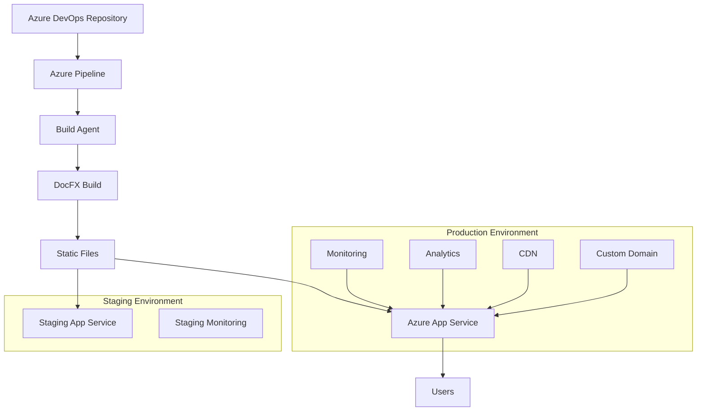

## Deployment and Operations

Effective deployment and operations ensure that your Documentation as Code implementation runs reliably in production. This section covers deployment strategies, monitoring, maintenance, and operational best practices for DocFX sites hosted on Azure App Service.

## Deployment Overview

### Architecture Components



### Deployment Environments

**Development Environment:**

- Purpose: Local development and testing
- Location: Developer workstations
- Characteristics: Fast iteration, debugging enabled
- Access: Development team only

**Staging Environment:**

- Purpose: Pre-production validation and testing
- Location: Azure App Service (staging slot)
- Characteristics: Production-like configuration
- Access: Development team and stakeholders

**Production Environment:**

- Purpose: Live documentation for end users
- Location: Azure App Service (production slot)
- Characteristics: High availability, monitoring, CDN
- Access: Public or authenticated users

## Deployment Strategies

### Blue-Green Deployment

**Implementation with Azure App Service Slots:**

```yaml
# azure-pipelines/deploy-production.yml
trigger:
  branches:
    include:
    - main

variables:
  azureSubscription: 'Production-Subscription'
  resourceGroup: 'docs-production-rg'
  appServiceName: 'company-docs-prod'

stages:
- stage: BuildAndTest
  displayName: 'Build and Test'
  jobs:
  - job: Build
    displayName: 'Build Documentation'
    pool:
      vmImage: 'ubuntu-latest'
    steps:
    - task: DocFxTask@0
      inputs:
        solution: 'docfx.json'
        command: 'build'
      displayName: 'Build DocFX site'
    
    - task: PublishPipelineArtifact@1
      inputs:
        targetPath: '_site'
        artifact: 'documentation-site'
      displayName: 'Publish build artifacts'

- stage: DeployStaging
  displayName: 'Deploy to Staging'
  dependsOn: BuildAndTest
  jobs:
  - deployment: DeployToStaging
    displayName: 'Deploy to Staging Slot'
    environment: 'staging'
    strategy:
      runOnce:
        deploy:
          steps:
          - task: AzureWebApp@1
            inputs:
              azureSubscription: $(azureSubscription)
              appType: 'webApp'
              appName: $(appServiceName)
              slotName: 'staging'
              package: $(Pipeline.Workspace)/documentation-site
            displayName: 'Deploy to staging slot'
          
          - task: AzureAppServiceManage@0
            inputs:
              azureSubscription: $(azureSubscription)
              action: 'Start Azure App Service'
              webAppName: $(appServiceName)
              specifySlotOrASE: true
              slot: 'staging'
            displayName: 'Start staging slot'

- stage: ProductionValidation
  displayName: 'Production Validation'
  dependsOn: DeployStaging
  jobs:
  - job: SmokeTests
    displayName: 'Smoke Tests'
    steps:
    - script: |
        # Run smoke tests against staging
        python scripts/smoke-tests.py https://$(appServiceName)-staging.azurewebsites.net
      displayName: 'Execute smoke tests'
    
    - script: |
        # Performance validation
        python scripts/performance-check.py https://$(appServiceName)-staging.azurewebsites.net
      displayName: 'Performance validation'

- stage: ProductionDeployment
  displayName: 'Production Deployment'
  dependsOn: ProductionValidation
  condition: succeeded()
  jobs:
  - deployment: SwapToProduction
    displayName: 'Swap to Production'
    environment: 'production'
    strategy:
      runOnce:
        deploy:
          steps:
          - task: AzureAppServiceManage@0
            inputs:
              azureSubscription: $(azureSubscription)
              action: 'Swap Slots'
              webAppName: $(appServiceName)
              sourceSlot: 'staging'
              targetSlot: 'production'
            displayName: 'Swap staging to production'
          
          - script: |
            # Post-deployment validation
            python scripts/post-deploy-check.py https://$(appServiceName).azurewebsites.net
          displayName: 'Post-deployment validation'
```

### Rolling Deployment

**For multi-instance deployments:**

```yaml
# Rolling deployment strategy
strategy:
  rolling:
    maxParallel: 50%
    preDeploy:
      steps:
      - script: echo "Pre-deployment health check"
    deploy:
      steps:
      - task: AzureWebApp@1
        inputs:
          azureSubscription: $(azureSubscription)
          appName: $(appServiceName)
          package: $(Pipeline.Workspace)/documentation-site
    postDeploy:
      steps:
      - script: |
          # Health check after each instance
          python scripts/health-check.py $(appServiceName)
```

### Canary Deployment

**Gradual traffic shifting:**

```yaml
# Canary deployment with traffic management
- stage: CanaryDeployment
  jobs:
  - deployment: CanaryRelease
    environment: 'production-canary'
    strategy:
      canary:
        increments: [10, 25, 50, 100]
        preDeploy:
          steps:
          - script: echo "Pre-canary deployment"
        deploy:
          steps:
          - task: AzureWebApp@1
            inputs:
              azureSubscription: $(azureSubscription)
              appName: $(appServiceName)
              package: $(Pipeline.Workspace)/documentation-site
        postDeploy:
          steps:
          - script: |
              # Monitor metrics during canary
              python scripts/canary-metrics.py --percentage $(strategy.increments)
```

## Infrastructure as Code

### Azure Resource Manager Templates

**App Service Infrastructure:**

```json
{
  "$schema": "https://schema.management.azure.com/schemas/2019-04-01/deploymentTemplate.json#",
  "contentVersion": "1.0.0.0",
  "parameters": {
    "siteName": {
      "type": "string",
      "metadata": {
        "description": "Name of the documentation site"
      }
    },
    "environment": {
      "type": "string",
      "allowedValues": ["dev", "staging", "prod"],
      "defaultValue": "dev"
    }
  },
  "variables": {
    "appServicePlanName": "[concat(parameters('siteName'), '-plan-', parameters('environment'))]",
    "appServiceName": "[concat(parameters('siteName'), '-', parameters('environment'))]"
  },
  "resources": [
    {
      "type": "Microsoft.Web/serverfarms",
      "apiVersion": "2021-02-01",
      "name": "[variables('appServicePlanName')]",
      "location": "[resourceGroup().location]",
      "sku": {
        "name": "[if(equals(parameters('environment'), 'prod'), 'S1', 'B1')]",
        "tier": "[if(equals(parameters('environment'), 'prod'), 'Standard', 'Basic')]"
      },
      "properties": {
        "reserved": false
      }
    },
    {
      "type": "Microsoft.Web/sites",
      "apiVersion": "2021-02-01",
      "name": "[variables('appServiceName')]",
      "location": "[resourceGroup().location]",
      "dependsOn": [
        "[resourceId('Microsoft.Web/serverfarms', variables('appServicePlanName'))]"
      ],
      "properties": {
        "serverFarmId": "[resourceId('Microsoft.Web/serverfarms', variables('appServicePlanName'))]",
        "siteConfig": {
          "defaultDocuments": ["index.html"],
          "httpLoggingEnabled": true,
          "requestTracingEnabled": true,
          "detailedErrorLoggingEnabled": true
        }
      }
    }
  ],
  "outputs": {
    "websiteUrl": {
      "type": "string",
      "value": "[concat('https://', reference(variables('appServiceName')).defaultHostName)]"
    }
  }
}
```

### Bicep Templates

**Modern ARM template alternative:**

```bicep
// main.bicep
@description('Name of the documentation site')
param siteName string

@description('Environment name')
@allowed(['dev', 'staging', 'prod'])
param environment string = 'dev'

@description('Location for all resources')
param location string = resourceGroup().location

var appServicePlanName = '${siteName}-plan-${environment}'
var appServiceName = '${siteName}-${environment}'
var sku = environment == 'prod' ? 'S1' : 'B1'
var tier = environment == 'prod' ? 'Standard' : 'Basic'

resource appServicePlan 'Microsoft.Web/serverfarms@2021-02-01' = {
  name: appServicePlanName
  location: location
  sku: {
    name: sku
    tier: tier
  }
  properties: {
    reserved: false
  }
}

resource appService 'Microsoft.Web/sites@2021-02-01' = {
  name: appServiceName
  location: location
  properties: {
    serverFarmId: appServicePlan.id
    siteConfig: {
      defaultDocuments: ['index.html']
      httpLoggingEnabled: true
      requestTracingEnabled: true
      detailedErrorLoggingEnabled: true
      minTlsVersion: '1.2'
      ftpsState: 'Disabled'
    }
  }
}

// Production-specific resources
resource stagingSlot 'Microsoft.Web/sites/slots@2021-02-01' = if (environment == 'prod') {
  name: 'staging'
  parent: appService
  location: location
  properties: {
    serverFarmId: appServicePlan.id
    siteConfig: appService.properties.siteConfig
  }
}

output websiteUrl string = 'https://${appService.properties.defaultHostName}'
output stagingUrl string = environment == 'prod' ? 'https://${stagingSlot.properties.defaultHostName}' : ''
```

## Configuration Management

### Application Settings

**Environment-specific configuration:**

```yaml
# azure-pipelines/configure-app-settings.yml
parameters:
- name: environment
  type: string
- name: appServiceName
  type: string

steps:
- task: AzureAppServiceSettings@1
  inputs:
    azureSubscription: $(azureSubscription)
    appName: ${{ parameters.appServiceName }}
    resourceGroupName: $(resourceGroup)
    appSettings: |
      [
        {
          "name": "WEBSITE_NODE_DEFAULT_VERSION",
          "value": "18.x"
        },
        {
          "name": "DOCS_ENVIRONMENT", 
          "value": "${{ parameters.environment }}"
        },
        {
          "name": "DOCS_VERSION",
          "value": "$(Build.BuildNumber)"
        },
        {
          "name": "ENABLE_ORYX_BUILD",
          "value": "false"
        },
        {
          "name": "SCM_DO_BUILD_DURING_DEPLOYMENT",
          "value": "false"
        }
      ]
```

### Connection Strings

**Secure configuration for external services:**

```yaml
connectionStrings: |
  [
    {
      "name": "ApplicationInsights",
      "connectionString": "$(ApplicationInsights.ConnectionString)",
      "type": "Custom"
    },
    {
      "name": "Storage",
      "connectionString": "$(Storage.ConnectionString)", 
      "type": "Custom"
    }
  ]
```

## Deployment Validation

### Smoke Tests

**Post-deployment validation:**

```python
#!/usr/bin/env python3
# scripts/smoke-tests.py

import requests
import sys
import time
from urllib.parse import urljoin

class SmokeTests:
    def __init__(self, base_url):
        self.base_url = base_url.rstrip('/')
        self.session = requests.Session()
        self.session.timeout = 30
    
    def test_homepage(self):
        """Test homepage loads successfully."""
        response = self.session.get(self.base_url)
        assert response.status_code == 200, f"Homepage failed: {response.status_code}"
        assert 'Documentation' in response.text, "Homepage missing expected content"
        print("✅ Homepage test passed")
    
    def test_search_functionality(self):
        """Test search endpoint."""
        search_url = urljoin(self.base_url, '/search')
        response = self.session.get(search_url)
        assert response.status_code in [200, 404], f"Search test failed: {response.status_code}"
        print("✅ Search functionality test passed")
    
    def test_api_documentation(self):
        """Test API documentation pages."""
        api_url = urljoin(self.base_url, '/api/')
        response = self.session.get(api_url)
        assert response.status_code == 200, f"API docs failed: {response.status_code}"
        print("✅ API documentation test passed")
    
    def test_critical_pages(self):
        """Test critical documentation pages."""
        critical_pages = [
            '/docs/getting-started/',
            '/docs/tutorials/',
            '/docs/reference/'
        ]
        
        for page in critical_pages:
            url = urljoin(self.base_url, page)
            response = self.session.get(url)
            assert response.status_code == 200, f"Critical page {page} failed: {response.status_code}"
        
        print("✅ Critical pages test passed")
    
    def test_performance(self):
        """Basic performance validation."""
        start_time = time.time()
        response = self.session.get(self.base_url)
        load_time = time.time() - start_time
        
        assert response.status_code == 200, "Homepage not accessible"
        assert load_time < 5.0, f"Homepage too slow: {load_time:.2f}s"
        print(f"✅ Performance test passed (load time: {load_time:.2f}s)")
    
    def run_all_tests(self):
        """Run all smoke tests."""
        tests = [
            self.test_homepage,
            self.test_search_functionality,
            self.test_api_documentation,
            self.test_critical_pages,
            self.test_performance
        ]
        
        print(f"🧪 Running smoke tests against {self.base_url}")
        
        for test in tests:
            try:
                test()
            except Exception as e:
                print(f"❌ Test failed: {test.__name__} - {e}")
                sys.exit(1)
        
        print("🎉 All smoke tests passed!")

def main():
    if len(sys.argv) != 2:
        print("Usage: python smoke-tests.py <base_url>")
        sys.exit(1)
    
    base_url = sys.argv[1]
    tester = SmokeTests(base_url)
    tester.run_all_tests()

if __name__ == "__main__":
    main()
```

### Performance Validation

**Load time and performance checks:**

```python
#!/usr/bin/env python3
# scripts/performance-check.py

import requests
import time
import statistics
from concurrent.futures import ThreadPoolExecutor
import sys

def measure_page_load(url, iterations=5):
    """Measure page load time over multiple iterations."""
    times = []
    
    for _ in range(iterations):
        start = time.time()
        response = requests.get(url, timeout=30)
        end = time.time()
        
        if response.status_code == 200:
            times.append(end - start)
        else:
            print(f"❌ Request failed: {response.status_code}")
            return None
    
    return {
        'url': url,
        'mean': statistics.mean(times),
        'median': statistics.median(times),
        'min': min(times),
        'max': max(times),
        'iterations': iterations
    }

def concurrent_load_test(url, concurrent_users=10, duration_seconds=30):
    """Test concurrent load handling."""
    results = []
    start_time = time.time()
    
    def make_request():
        try:
            start = time.time()
            response = requests.get(url, timeout=10)
            end = time.time()
            return {
                'status_code': response.status_code,
                'response_time': end - start,
                'success': response.status_code == 200
            }
        except Exception as e:
            return {
                'status_code': 0,
                'response_time': 0,
                'success': False,
                'error': str(e)
            }
    
    with ThreadPoolExecutor(max_workers=concurrent_users) as executor:
        futures = []
        
        while time.time() - start_time < duration_seconds:
            future = executor.submit(make_request)
            futures.append(future)
            time.sleep(0.1)  # Stagger requests
        
        for future in futures:
            results.append(future.result())
    
    success_count = sum(1 for r in results if r['success'])
    total_requests = len(results)
    success_rate = success_count / total_requests if total_requests > 0 else 0
    
    successful_times = [r['response_time'] for r in results if r['success']]
    avg_response_time = statistics.mean(successful_times) if successful_times else 0
    
    return {
        'total_requests': total_requests,
        'successful_requests': success_count,
        'success_rate': success_rate,
        'average_response_time': avg_response_time,
        'duration': duration_seconds,
        'concurrent_users': concurrent_users
    }

def main():
    if len(sys.argv) != 2:
        print("Usage: python performance-check.py <base_url>")
        sys.exit(1)
    
    base_url = sys.argv[1].rstrip('/')
    
    print(f"🚀 Performance testing {base_url}")
    
    # Single page load test
    print("\n📊 Page Load Performance:")
    load_result = measure_page_load(base_url)
    if load_result:
        print(f"   Mean load time: {load_result['mean']:.2f}s")
        print(f"   Median load time: {load_result['median']:.2f}s")
        print(f"   Min/Max: {load_result['min']:.2f}s / {load_result['max']:.2f}s")
        
        # Performance assertions
        if load_result['mean'] > 3.0:
            print("⚠️  Warning: Average load time exceeds 3 seconds")
        if load_result['max'] > 5.0:
            print("❌ Error: Maximum load time exceeds 5 seconds")
            sys.exit(1)
    
    # Concurrent load test
    print("\n🔄 Concurrent Load Test:")
    concurrent_result = concurrent_load_test(base_url)
    print(f"   Total requests: {concurrent_result['total_requests']}")
    print(f"   Success rate: {concurrent_result['success_rate']:.2%}")
    print(f"   Average response time: {concurrent_result['average_response_time']:.2f}s")
    
    # Load test assertions
    if concurrent_result['success_rate'] < 0.95:
        print("❌ Error: Success rate below 95%")
        sys.exit(1)
    
    if concurrent_result['average_response_time'] > 2.0:
        print("⚠️  Warning: Average response time under load exceeds 2 seconds")
    
    print("✅ Performance tests completed successfully")

if __name__ == "__main__":
    main()
```

## Rollback Procedures

### Automated Rollback

**Pipeline-based rollback:**

```yaml
# azure-pipelines/rollback.yml
parameters:
- name: targetSlot
  displayName: 'Rollback Target'
  type: string
  default: 'previous'
  values:
  - previous
  - staging
  - specific-version

- name: specificVersion
  displayName: 'Specific Version (if selected above)'
  type: string
  default: ''

trigger: none

variables:
  azureSubscription: 'Production-Subscription'
  resourceGroup: 'docs-production-rg'
  appServiceName: 'company-docs-prod'

stages:
- stage: RollbackValidation
  displayName: 'Validate Rollback'
  jobs:
  - job: ValidateRollback
    steps:
    - script: |
        echo "Validating rollback target: ${{ parameters.targetSlot }}"
        # Add validation logic here
      displayName: 'Validate rollback parameters'

- stage: ExecuteRollback
  displayName: 'Execute Rollback'
  dependsOn: RollbackValidation
  jobs:
  - deployment: Rollback
    displayName: 'Rollback Deployment'
    environment: 'production-rollback'
    strategy:
      runOnce:
        deploy:
          steps:
          - ${{ if eq(parameters.targetSlot, 'previous') }}:
            - task: AzureAppServiceManage@0
              inputs:
                azureSubscription: $(azureSubscription)
                action: 'Swap Slots'
                webAppName: $(appServiceName)
                sourceSlot: 'production'
                targetSlot: 'staging'
              displayName: 'Swap back to previous version'
          
          - script: |
              # Post-rollback validation
              python scripts/post-deploy-check.py https://$(appServiceName).azurewebsites.net
            displayName: 'Validate rollback'
          
          - script: |
              # Notify team of rollback
              python scripts/notify-rollback.py --version "${{ parameters.targetSlot }}"
            displayName: 'Notify rollback completion'
```

### Manual Rollback

**Emergency rollback procedures:**

```bash
#!/bin/bash
# scripts/emergency-rollback.sh

set -e

RESOURCE_GROUP="docs-production-rg"
APP_SERVICE_NAME="company-docs-prod"
SUBSCRIPTION_ID="your-subscription-id"

echo "🚨 Emergency Rollback Procedure"
echo "================================"

# Login check
if ! az account show &>/dev/null; then
    echo "Please login to Azure CLI first: az login"
    exit 1
fi

# Set subscription
az account set --subscription "$SUBSCRIPTION_ID"

# Get current slot configuration
echo "📋 Current slot configuration:"
az webapp deployment slot list \
    --resource-group "$RESOURCE_GROUP" \
    --name "$APP_SERVICE_NAME" \
    --output table

# Confirm rollback
read -p "🔄 Proceed with slot swap rollback? (y/N): " confirm
if [[ $confirm != [yY] ]]; then
    echo "Rollback cancelled"
    exit 0
fi

# Execute rollback
echo "⏪ Executing rollback..."
az webapp deployment slot swap \
    --resource-group "$RESOURCE_GROUP" \
    --name "$APP_SERVICE_NAME" \
    --slot "staging" \
    --target-slot "production"

# Validate rollback
echo "✅ Rollback completed. Validating..."
sleep 30  # Allow time for the swap

# Basic health check
SITE_URL="https://${APP_SERVICE_NAME}.azurewebsites.net"
if curl -f -s "$SITE_URL" > /dev/null; then
    echo "✅ Site is responding at $SITE_URL"
else
    echo "❌ Site health check failed"
    exit 1
fi

echo "🎉 Emergency rollback completed successfully"
echo "📋 Next steps:"
echo "   1. Investigate the root cause"
echo "   2. Fix the issue in the development branch"
echo "   3. Test thoroughly before next deployment"
echo "   4. Update incident documentation"
```

---

*This deployment and operations guide provides the foundation for reliable, scalable documentation deployment. Customize these practices based on your organization's specific requirements and constraints.*
