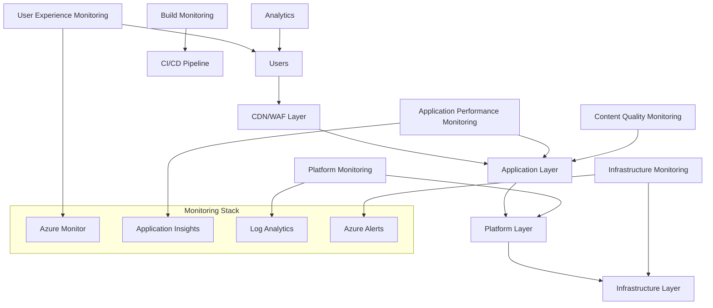

## Monitoring and Observability

Effective monitoring ensures your Documentation as Code system operates reliably and provides insights for continuous improvement. This comprehensive monitoring strategy covers application health, user experience, content quality, and operational metrics.

## Monitoring Strategy

### Multi-Layer Monitoring



### Key Monitoring Domains

**Infrastructure Monitoring:**

- Server health and resource utilization
- Network connectivity and latency
- Storage capacity and performance
- Security and compliance status

**Application Monitoring:**

- Site availability and response times
- Error rates and exception tracking
- User journey and conversion funnels
- Search functionality and success rates

**Content Monitoring:**

- Content freshness and accuracy
- Link validation and integrity
- User engagement and satisfaction
- Documentation coverage and gaps

**Operational Monitoring:**

- Build and deployment success rates
- Team productivity and velocity
- Process efficiency and bottlenecks
- Cost optimization and usage patterns

## Azure Monitor Integration

### Application Insights Setup

**Configure Application Insights for DocFX:**

```html
<!-- Add to DocFX template: templates/conceptual.html.primary.tmpl -->
<script type="text/javascript">
    var appInsights = window.appInsights || function(a) {
        function b(a) { c[a] = function() { var b = arguments; c.queue.push(function() { c[a].apply(c, b) }) } }
        var c = { config: a }, d = document, e = window;
        setTimeout(function() {
            var b = d.createElement("script");
            b.src = a.url || "https://az416426.vo.msecnd.net/scripts/b/ai.2.min.js",
            d.getElementsByTagName("script")[0].parentNode.appendChild(b)
        });
        try { c.cookie = d.cookie } catch (a) { }
        c.queue = [], c.version = 2;
        for (var f = ["Event", "PageView", "Exception", "Trace", "DependencyData", "Metric", "PageViewPerformance"]; f.length;)
            b("track" + f.pop());
        b("startTrackPage"), b("stopTrackPage");
        var g = "Track" + f[0];
        if (b(g), c[g] = function(a, b) {
            var d = {};
            d[f[0]] = a, d.name = a, d.URI = b, c.queue.push(function() { c[g](d) })
        }, !(!0 === a.disableExceptionTracking || a.extensionConfig && a.extensionConfig.ApplicationInsightsAnalytics && !0 === a.extensionConfig.ApplicationInsightsAnalytics.disableExceptionTracking)) {
            b("_" + (f = "onerror"));
            var h = e[f];
            e[f] = function(a, b, d, e, g) { var i = h && h(a, b, d, e, g); return !0 !== i && c["_" + f]({ message: a, url: b, lineNumber: d, columnNumber: e, error: g }), i }, a.autoExceptionInstrumented = !0
        }
        return c
    }({
        instrumentationKey: "{{APPINSIGHTS_INSTRUMENTATIONKEY}}"
    });

    window.appInsights = appInsights, appInsights.queue && 0 === appInsights.queue.length && appInsights.trackPageView({});
</script>
```

**Environment-specific configuration:**

```json
{
  "ApplicationInsights": {
    "ConnectionString": "InstrumentationKey=your-key;IngestionEndpoint=https://your-region.in.applicationinsights.azure.com/",
    "EnableAdaptiveSampling": true,
    "EnablePerformanceCounterCollectionModule": true,
    "EnableQuickPulseMetricStream": true,
    "EnableEventCounterCollectionModule": true
  }
}
```

### Custom Telemetry

**Track documentation-specific events:**

```javascript
// Custom event tracking for documentation
function trackDocumentationEvent(eventName, properties = {}, metrics = {}) {
    if (window.appInsights) {
        appInsights.trackEvent({
            name: eventName,
            properties: {
                page: document.title,
                url: window.location.href,
                userAgent: navigator.userAgent,
                timestamp: new Date().toISOString(),
                ...properties
            },
            measurements: metrics
        });
    }
}

// Track search usage
function trackSearch(query, resultsCount, clickPosition = null) {
    trackDocumentationEvent('DocumentationSearch', {
        searchQuery: query,
        hasResults: resultsCount > 0,
        clickPosition: clickPosition
    }, {
        resultsCount: resultsCount
    });
}

// Track tutorial completion
function trackTutorialProgress(tutorialName, step, completed = false) {
    trackDocumentationEvent('TutorialProgress', {
        tutorialName: tutorialName,
        currentStep: step,
        completed: completed
    }, {
        stepNumber: parseInt(step)
    });
}

// Track user feedback
function trackFeedback(rating, comments, pageId) {
    trackDocumentationEvent('UserFeedback', {
        pageId: pageId,
        comments: comments,
        userAgent: navigator.userAgent
    }, {
        rating: rating
    });
}

// Track download events
function trackDownload(fileName, fileType, category) {
    trackDocumentationEvent('FileDownload', {
        fileName: fileName,
        fileType: fileType,
        category: category
    });
}

// Track external link clicks
document.addEventListener('click', function(event) {
    const link = event.target.closest('a');
    if (link && link.hostname !== window.location.hostname) {
        trackDocumentationEvent('ExternalLinkClick', {
            targetUrl: link.href,
            linkText: link.textContent.trim(),
            sourceSection: getPageSection(link)
        });
    }
});

function getPageSection(element) {
    // Find the nearest heading to determine page section
    let current = element;
    while (current && current !== document.body) {
        if (current.tagName && current.tagName.match(/^H[1-6]$/)) {
            return current.textContent.trim();
        }
        current = current.previousElementSibling || current.parentElement;
    }
    return 'Unknown Section';
}
```

## Performance Monitoring

### Real User Monitoring (RUM)

**Web Vitals tracking:**

```javascript
// Core Web Vitals monitoring
import {getCLS, getFID, getFCP, getLCP, getTTFB} from 'web-vitals';

function sendToAnalytics(metric) {
    // Send to Application Insights
    if (window.appInsights) {
        appInsights.trackMetric({
            name: metric.name,
            average: metric.value,
            properties: {
                id: metric.id,
                navigationType: metric.navigationType
            }
        });
    }
}

// Track all Core Web Vitals
getCLS(sendToAnalytics);
getFID(sendToAnalytics);
getFCP(sendToAnalytics);
getLCP(sendToAnalytics);
getTTFB(sendToAnalytics);

// Custom documentation-specific metrics
function trackDocumentationMetrics() {
    // Time to content ready
    const contentElement = document.querySelector('article, main, .content');
    if (contentElement) {
        const observer = new PerformanceObserver((list) => {
            for (const entry of list.getEntries()) {
                if (entry.target === contentElement) {
                    sendToAnalytics({
                        name: 'documentation-content-ready',
                        value: entry.loadTime,
                        id: 'doc-content'
                    });
                }
            }
        });
        observer.observe({entryTypes: ['element']});
    }
    
    // Search response time
    const searchInput = document.querySelector('#search-query, .search-input');
    if (searchInput) {
        let searchStartTime;
        searchInput.addEventListener('input', () => {
            searchStartTime = performance.now();
        });
        
        // Monitor search results appearance
        const resultsObserver = new MutationObserver(() => {
            if (searchStartTime) {
                const searchTime = performance.now() - searchStartTime;
                sendToAnalytics({
                    name: 'search-response-time',
                    value: searchTime,
                    id: 'search-perf'
                });
                searchStartTime = null;
            }
        });
        
        const resultsContainer = document.querySelector('#search-results, .search-results');
        if (resultsContainer) {
            resultsObserver.observe(resultsContainer, {childList: true, subtree: true});
        }
    }
}

// Initialize monitoring
document.addEventListener('DOMContentLoaded', trackDocumentationMetrics);
```

### Synthetic Monitoring

**Automated availability tests:**

```yaml
# azure-monitoring/availability-tests.yml
apiVersion: v1
kind: ConfigMap
metadata:
  name: availability-tests
data:
  tests.json: |
    {
      "tests": [
        {
          "name": "Homepage Availability",
          "url": "https://docs.company.com",
          "frequency": 300,
          "locations": ["us-east-1", "eu-west-1", "asia-southeast-1"],
          "assertions": [
            {"type": "status_code", "value": 200},
            {"type": "response_time", "value": 3000, "operator": "lt"},
            {"type": "body_contains", "value": "Documentation"}
          ]
        },
        {
          "name": "Search Functionality",
          "url": "https://docs.company.com/search?q=test",
          "frequency": 600,
          "locations": ["us-east-1", "eu-west-1"],
          "assertions": [
            {"type": "status_code", "value": 200},
            {"type": "response_time", "value": 5000, "operator": "lt"}
          ]
        },
        {
          "name": "API Documentation",
          "url": "https://docs.company.com/api/",
          "frequency": 900,
          "locations": ["us-east-1"],
          "assertions": [
            {"type": "status_code", "value": 200},
            {"type": "body_contains", "value": "API Reference"}
          ]
        }
      ]
    }
```

**PowerShell synthetic test runner:**

```powershell
# scripts/synthetic-tests.ps1
param(
    [Parameter(Mandatory=$true)]
    [string]$BaseUrl,
    
    [Parameter(Mandatory=$false)]
    [int]$TimeoutSeconds = 30,
    
    [Parameter(Mandatory=$false)]
    [string]$OutputFormat = "json"
)

function Test-PageAvailability {
    param($Url, $ExpectedStatus = 200, $MaxResponseTime = 5000)
    
    $stopwatch = [System.Diagnostics.Stopwatch]::StartNew()
    
    try {
        $response = Invoke-WebRequest -Uri $Url -TimeoutSec $TimeoutSeconds -UseBasicParsing
        $stopwatch.Stop()
        
        $result = @{
            Url = $Url
            StatusCode = $response.StatusCode
            ResponseTime = $stopwatch.ElapsedMilliseconds
            Success = $response.StatusCode -eq $ExpectedStatus -and $stopwatch.ElapsedMilliseconds -lt $MaxResponseTime
            ContentLength = $response.Content.Length
            Timestamp = Get-Date -Format "yyyy-MM-ddTHH:mm:ssZ"
        }
        
        if ($response.StatusCode -ne $ExpectedStatus) {
            $result.Error = "Unexpected status code: $($response.StatusCode)"
        }
        
        if ($stopwatch.ElapsedMilliseconds -ge $MaxResponseTime) {
            $result.Error = "Response time exceeded threshold: $($stopwatch.ElapsedMilliseconds)ms"
        }
        
        return $result
    }
    catch {
        $stopwatch.Stop()
        return @{
            Url = $Url
            StatusCode = 0
            ResponseTime = $stopwatch.ElapsedMilliseconds
            Success = $false
            Error = $_.Exception.Message
            Timestamp = Get-Date -Format "yyyy-MM-ddTHH:mm:ssZ"
        }
    }
}

function Test-SearchFunctionality {
    param($BaseUrl)
    
    $searchUrl = "$BaseUrl/search?q=test"
    $result = Test-PageAvailability -Url $searchUrl
    
    if ($result.Success) {
        try {
            $response = Invoke-WebRequest -Uri $searchUrl -TimeoutSec $TimeoutSeconds
            $hasSearchResults = $response.Content -match "search-results|results-container"
            $result.SearchFunctional = $hasSearchResults
            if (-not $hasSearchResults) {
                $result.Error = "Search results container not found"
                $result.Success = $false
            }
        }
        catch {
            $result.SearchFunctional = $false
            $result.Error = "Search test failed: $($_.Exception.Message)"
            $result.Success = $false
        }
    }
    
    return $result
}

# Define test suite
$testSuite = @(
    @{ Name = "Homepage"; Url = $BaseUrl; MaxResponseTime = 3000 },
    @{ Name = "API Docs"; Url = "$BaseUrl/api/"; MaxResponseTime = 5000 },
    @{ Name = "Getting Started"; Url = "$BaseUrl/docs/getting-started/"; MaxResponseTime = 4000 },
    @{ Name = "Search"; Type = "Search"; MaxResponseTime = 5000 }
)

$results = @()

foreach ($test in $testSuite) {
    Write-Host "Running test: $($test.Name)" -ForegroundColor Cyan
    
    if ($test.Type -eq "Search") {
        $result = Test-SearchFunctionality -BaseUrl $BaseUrl
    } else {
        $result = Test-PageAvailability -Url $test.Url -MaxResponseTime $test.MaxResponseTime
    }
    
    $result.TestName = $test.Name
    $results += $result
    
    if ($result.Success) {
        Write-Host "✅ $($test.Name): PASSED ($($result.ResponseTime)ms)" -ForegroundColor Green
    } else {
        Write-Host "❌ $($test.Name): FAILED - $($result.Error)" -ForegroundColor Red
    }
}

# Output results
if ($OutputFormat -eq "json") {
    $results | ConvertTo-Json -Depth 3 | Out-File "synthetic-test-results.json"
    Write-Host "Results saved to synthetic-test-results.json"
} else {
    $results | Format-Table -AutoSize
}

# Summary
$passedTests = ($results | Where-Object { $_.Success }).Count
$totalTests = $results.Count
$successRate = [math]::Round(($passedTests / $totalTests) * 100, 1)

Write-Host "`nTest Summary:" -ForegroundColor Yellow
Write-Host "Passed: $passedTests/$totalTests ($successRate%)"

if ($passedTests -lt $totalTests) {
    Write-Host "Some tests failed. Check the results for details." -ForegroundColor Red
    exit 1
} else {
    Write-Host "All tests passed!" -ForegroundColor Green
}
```

## Content Quality Monitoring

### Automated Content Validation

**Content freshness monitoring:**

```python
#!/usr/bin/env python3
# scripts/content-monitoring.py

import os
import re
import yaml
import requests
from datetime import datetime, timedelta
from pathlib import Path
import json

class ContentMonitor:
    def __init__(self, docs_directory, base_url=None):
        self.docs_directory = Path(docs_directory)
        self.base_url = base_url.rstrip('/') if base_url else None
        self.issues = []
        
    def check_content_freshness(self, max_age_days=90):
        """Check for outdated content."""
        cutoff_date = datetime.now() - timedelta(days=max_age_days)
        
        for md_file in self.docs_directory.rglob('*.md'):
            try:
                with open(md_file, 'r', encoding='utf-8') as f:
                    content = f.read()
                
                # Extract front matter
                fm_match = re.match(r'^---\s*\n(.*?)\n---\s*\n', content, re.DOTALL)
                if fm_match:
                    frontmatter = yaml.safe_load(fm_match.group(1))
                    
                    if 'last_updated' in frontmatter:
                        last_updated = datetime.fromisoformat(frontmatter['last_updated'])
                        if last_updated < cutoff_date:
                            self.issues.append({
                                'type': 'outdated_content',
                                'file': str(md_file.relative_to(self.docs_directory)),
                                'last_updated': frontmatter['last_updated'],
                                'age_days': (datetime.now() - last_updated).days,
                                'severity': 'warning'
                            })
                    else:
                        self.issues.append({
                            'type': 'missing_last_updated',
                            'file': str(md_file.relative_to(self.docs_directory)),
                            'severity': 'info'
                        })
                        
            except Exception as e:
                self.issues.append({
                    'type': 'processing_error',
                    'file': str(md_file.relative_to(self.docs_directory)),
                    'error': str(e),
                    'severity': 'error'
                })
    
    def check_broken_links(self):
        """Check for broken internal and external links."""
        session = requests.Session()
        session.timeout = 10
        
        for md_file in self.docs_directory.rglob('*.md'):
            try:
                with open(md_file, 'r', encoding='utf-8') as f:
                    content = f.read()
                
                # Find all markdown links
                links = re.findall(r'\[([^\]]+)\]\(([^)]+)\)', content)
                
                for link_text, link_url in links:
                    if link_url.startswith('#'):
                        # Skip anchor links for now
                        continue
                    elif link_url.startswith('http'):
                        # External link
                        try:
                            response = session.head(link_url, allow_redirects=True)
                            if response.status_code >= 400:
                                self.issues.append({
                                    'type': 'broken_external_link',
                                    'file': str(md_file.relative_to(self.docs_directory)),
                                    'link_url': link_url,
                                    'link_text': link_text,
                                    'status_code': response.status_code,
                                    'severity': 'warning'
                                })
                        except Exception as e:
                            self.issues.append({
                                'type': 'unreachable_external_link',
                                'file': str(md_file.relative_to(self.docs_directory)),
                                'link_url': link_url,
                                'error': str(e),
                                'severity': 'warning'
                            })
                    else:
                        # Internal link
                        if link_url.endswith('.md'):
                            target_file = md_file.parent / link_url
                            if not target_file.exists():
                                self.issues.append({
                                    'type': 'broken_internal_link',
                                    'file': str(md_file.relative_to(self.docs_directory)),
                                    'link_url': link_url,
                                    'link_text': link_text,
                                    'severity': 'error'
                                })
                        
            except Exception as e:
                self.issues.append({
                    'type': 'link_check_error',
                    'file': str(md_file.relative_to(self.docs_directory)),
                    'error': str(e),
                    'severity': 'error'
                })
    
    def check_missing_metadata(self):
        """Check for missing or incomplete metadata."""
        required_fields = ['title', 'description', 'tags', 'category']
        
        for md_file in self.docs_directory.rglob('*.md'):
            try:
                with open(md_file, 'r', encoding='utf-8') as f:
                    content = f.read()
                
                # Extract front matter
                fm_match = re.match(r'^---\s*\n(.*?)\n---\s*\n', content, re.DOTALL)
                if not fm_match:
                    self.issues.append({
                        'type': 'missing_frontmatter',
                        'file': str(md_file.relative_to(self.docs_directory)),
                        'severity': 'error'
                    })
                    continue
                
                try:
                    frontmatter = yaml.safe_load(fm_match.group(1))
                    
                    for field in required_fields:
                        if field not in frontmatter or not frontmatter[field]:
                            self.issues.append({
                                'type': 'missing_metadata',
                                'file': str(md_file.relative_to(self.docs_directory)),
                                'missing_field': field,
                                'severity': 'warning'
                            })
                            
                except yaml.YAMLError as e:
                    self.issues.append({
                        'type': 'invalid_frontmatter',
                        'file': str(md_file.relative_to(self.docs_directory)),
                        'error': str(e),
                        'severity': 'error'
                    })
                    
            except Exception as e:
                self.issues.append({
                    'type': 'metadata_check_error',
                    'file': str(md_file.relative_to(self.docs_directory)),
                    'error': str(e),
                    'severity': 'error'
                })
    
    def generate_report(self):
        """Generate monitoring report."""
        report = {
            'timestamp': datetime.now().isoformat(),
            'total_issues': len(self.issues),
            'issues_by_severity': {
                'error': len([i for i in self.issues if i['severity'] == 'error']),
                'warning': len([i for i in self.issues if i['severity'] == 'warning']),
                'info': len([i for i in self.issues if i['severity'] == 'info'])
            },
            'issues_by_type': {},
            'issues': self.issues
        }
        
        # Count issues by type
        for issue in self.issues:
            issue_type = issue['type']
            if issue_type not in report['issues_by_type']:
                report['issues_by_type'][issue_type] = 0
            report['issues_by_type'][issue_type] += 1
        
        return report
    
    def run_all_checks(self):
        """Run all content monitoring checks."""
        print("🔍 Running content quality checks...")
        
        print("  📅 Checking content freshness...")
        self.check_content_freshness()
        
        print("  🔗 Checking links...")
        self.check_broken_links()
        
        print("  📋 Checking metadata...")
        self.check_missing_metadata()
        
        print("✅ Content monitoring complete")
        return self.generate_report()

def main():
    import sys
    
    if len(sys.argv) < 2:
        print("Usage: python content-monitoring.py <docs_directory> [base_url]")
        sys.exit(1)
    
    docs_dir = sys.argv[1]
    base_url = sys.argv[2] if len(sys.argv) > 2 else None
    
    monitor = ContentMonitor(docs_dir, base_url)
    report = monitor.run_all_checks()
    
    # Save report
    with open('content-monitoring-report.json', 'w') as f:
        json.dump(report, f, indent=2, default=str)
    
    # Print summary
    print(f"\n📊 Content Monitoring Summary:")
    print(f"   Total issues found: {report['total_issues']}")
    print(f"   Errors: {report['issues_by_severity']['error']}")
    print(f"   Warnings: {report['issues_by_severity']['warning']}")
    print(f"   Info: {report['issues_by_severity']['info']}")
    
    if report['total_issues'] > 0:
        print(f"\n🔍 Issues by type:")
        for issue_type, count in report['issues_by_type'].items():
            print(f"   {issue_type}: {count}")
    
    print(f"\n📄 Full report saved to: content-monitoring-report.json")
    
    # Exit with error code if critical issues found
    if report['issues_by_severity']['error'] > 0:
        sys.exit(1)

if __name__ == "__main__":
    main()
```

## Alerting and Notifications

### Azure Monitor Alerts

**KQL queries for documentation-specific alerts:**

```kusto
// High error rate alert
requests
| where timestamp >= ago(5m)
| summarize 
    total_requests = count(),
    failed_requests = countif(resultCode >= 400)
| extend error_rate = (failed_requests * 100.0) / total_requests
| where error_rate > 5

// Slow page load alert  
pageViews
| where timestamp >= ago(10m)
| summarize avg_duration = avg(duration)
| where avg_duration > 3000

// Search functionality issues
customEvents
| where timestamp >= ago(15m)
| where name == "DocumentationSearch"
| summarize 
    total_searches = count(),
    successful_searches = countif(toreal(customMeasurements.resultsCount) > 0)
| extend success_rate = (successful_searches * 100.0) / total_searches
| where success_rate < 80

// Content feedback alerts
customEvents
| where timestamp >= ago(1h)
| where name == "UserFeedback"
| summarize avg_rating = avg(toreal(customMeasurements.rating))
| where avg_rating < 3.0
```

**Alert configuration template:**

```json
{
  "location": "East US",
  "tags": {},
  "properties": {
    "description": "Documentation site error rate too high",
    "severity": 2,
    "enabled": true,
    "scopes": [
      "/subscriptions/{subscription-id}/resourceGroups/{resource-group}/providers/Microsoft.Insights/components/{app-insights-name}"
    ],
    "evaluationFrequency": "PT5M",
    "windowSize": "PT5M",
    "criteria": {
      "allOf": [
        {
          "query": "requests | where timestamp >= ago(5m) | summarize total_requests = count(), failed_requests = countif(resultCode >= 400) | extend error_rate = (failed_requests * 100.0) / total_requests | where error_rate > 5",
          "timeAggregation": "Count",
          "operator": "GreaterThan",
          "threshold": 0
        }
      ]
    },
    "actions": [
      {
        "actionGroupId": "/subscriptions/{subscription-id}/resourceGroups/{resource-group}/providers/microsoft.insights/actionGroups/{action-group-name}"
      }
    ]
  }
}
```

### Notification Channels

**Teams notification webhook:**

```python
# scripts/teams-notification.py
import requests
import json
import sys

def send_teams_notification(webhook_url, title, message, severity="info", details=None):
    """Send notification to Microsoft Teams channel."""
    
    color_map = {
        "info": "0078D4",
        "warning": "FF8C00", 
        "error": "FF0000",
        "success": "00FF00"
    }
    
    payload = {
        "@type": "MessageCard",
        "@context": "http://schema.org/extensions",
        "themeColor": color_map.get(severity, "0078D4"),
        "summary": title,
        "sections": [
            {
                "activityTitle": title,
                "activitySubtitle": message,
                "facts": []
            }
        ]
    }
    
    if details:
        for key, value in details.items():
            payload["sections"][0]["facts"].append({
                "name": key,
                "value": str(value)
            })
    
    # Add action buttons
    payload["potentialAction"] = [
        {
            "@type": "OpenUri",
            "name": "View Monitoring Dashboard",
            "targets": [
                {
                    "os": "default",
                    "uri": "https://portal.azure.com/#@tenant/resource/subscriptions/{subscription}/resourceGroups/{rg}/providers/Microsoft.Insights/components/{appinsights}/overview"
                }
            ]
        }
    ]
    
    try:
        response = requests.post(webhook_url, json=payload, timeout=10)
        response.raise_for_status()
        return True
    except Exception as e:
        print(f"Failed to send Teams notification: {e}")
        return False

if __name__ == "__main__":
    if len(sys.argv) < 4:
        print("Usage: python teams-notification.py <webhook_url> <title> <message> [severity]")
        sys.exit(1)
    
    webhook_url = sys.argv[1]
    title = sys.argv[2]
    message = sys.argv[3]
    severity = sys.argv[4] if len(sys.argv) > 4 else "info"
    
    success = send_teams_notification(webhook_url, title, message, severity)
    sys.exit(0 if success else 1)
```

## Dashboards and Reporting

### Power BI Documentation Dashboard

**Data model for documentation metrics:**

```json
{
  "version": "1.0",
  "queries": [
    {
      "name": "PageViews",
      "query": "pageViews | where timestamp >= ago(30d) | summarize views = count() by bin(timestamp, 1d), name | order by timestamp asc"
    },
    {
      "name": "SearchMetrics", 
      "query": "customEvents | where name == 'DocumentationSearch' | where timestamp >= ago(30d) | summarize searches = count(), avg_results = avg(toreal(customMeasurements.resultsCount)) by bin(timestamp, 1d)"
    },
    {
      "name": "UserFeedback",
      "query": "customEvents | where name == 'UserFeedback' | where timestamp >= ago(30d) | summarize avg_rating = avg(toreal(customMeasurements.rating)), feedback_count = count() by bin(timestamp, 1d)"
    },
    {
      "name": "ContentHealth",
      "query": "requests | where timestamp >= ago(7d) | summarize availability = (count() - countif(resultCode >= 400)) * 100.0 / count() by bin(timestamp, 1h)"
    }
  ]
}
```

### Grafana Dashboard

**Dashboard configuration for operational metrics:**

```json
{
  "dashboard": {
    "title": "Documentation as Code Monitoring",
    "panels": [
      {
        "title": "Site Availability",
        "type": "stat",
        "targets": [
          {
            "query": "requests | where timestamp >= ago(24h) | summarize availability = (count() - countif(resultCode >= 400)) * 100.0 / count()"
          }
        ],
        "fieldConfig": {
          "defaults": {
            "unit": "percent",
            "thresholds": {
              "steps": [
                {"color": "red", "value": 0},
                {"color": "yellow", "value": 95},
                {"color": "green", "value": 99}
              ]
            }
          }
        }
      },
      {
        "title": "Response Time Trend",
        "type": "timeseries",
        "targets": [
          {
            "query": "requests | where timestamp >= ago(24h) | summarize avg_duration = avg(duration) by bin(timestamp, 5m)"
          }
        ]
      },
      {
        "title": "User Satisfaction",
        "type": "gauge",
        "targets": [
          {
            "query": "customEvents | where name == 'UserFeedback' | where timestamp >= ago(7d) | summarize avg_rating = avg(toreal(customMeasurements.rating))"
          }
        ]
      }
    ]
  }
}
```

---

*This comprehensive monitoring strategy ensures reliable operation and continuous improvement of your Documentation as Code system through proactive monitoring, alerting, and data-driven insights.*
