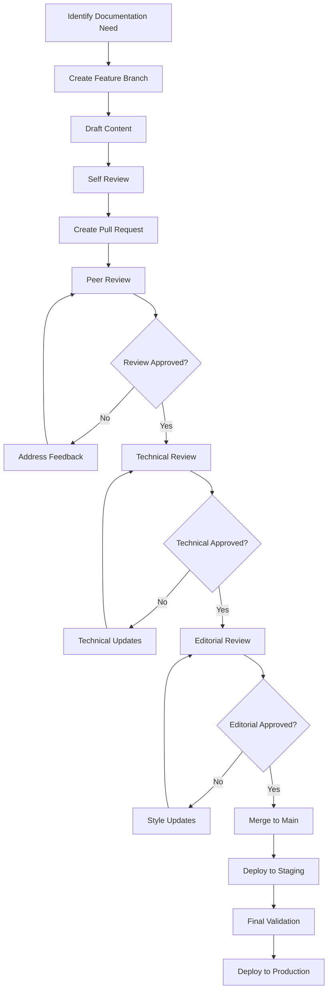

## Collaboration Process

Effective collaboration is essential for successful Documentation as Code implementation. This guide establishes workflows, processes, and best practices that enable teams to work together efficiently while maintaining high documentation quality.

## Team Roles and Responsibilities

### Documentation Authors

**Primary responsibilities:**

- Create and update content following style guidelines
- Collaborate with subject matter experts
- Participate in content review processes
- Maintain assigned documentation sections

**Required skills:**

- Markdown proficiency
- Git fundamentals
- Domain knowledge in assigned areas
- Writing and communication skills

### Technical Reviewers

**Primary responsibilities:**

- Review technical accuracy of content
- Validate code examples and procedures
- Ensure completeness of technical information
- Provide constructive feedback

**Required skills:**

- Deep technical expertise
- Testing and validation experience
- Understanding of user needs
- Attention to detail

### Content Editors

**Primary responsibilities:**

- Review grammar, style, and consistency
- Ensure adherence to style guide
- Improve readability and flow
- Coordinate review processes

**Required skills:**

- Strong writing and editing skills
- Knowledge of style guides
- Project management experience
- Communication skills

### Documentation Maintainers

**Primary responsibilities:**

- Manage repository structure and organization
- Maintain build and deployment processes
- Coordinate releases and updates
- Provide technical support to contributors

**Required skills:**

- Git expertise
- DocFX and build system knowledge
- Azure DevOps administration
- Automation and scripting

## Collaboration Workflows

### Content Creation Workflow



### Pull Request Process

#### Preparation

Before creating a pull request:

- [ ] Review your changes locally
- [ ] Run spell check and grammar validation
- [ ] Test any code examples or procedures
- [ ] Ensure compliance with style guide
- [ ] Update table of contents if needed

#### Pull Request Creation

Use the standard pull request template:

```markdown
## Description
Brief description of the changes made.

## Type of Change
- [ ] New content
- [ ] Content update
- [ ] Bug fix
- [ ] Style/formatting improvement
- [ ] Structure reorganization

## Content Areas
- [ ] Tutorials
- [ ] API documentation
- [ ] Configuration guides
- [ ] Troubleshooting
- [ ] Reference materials

## Review Checklist
- [ ] Content follows style guide
- [ ] Links are functional
- [ ] Code examples are tested
- [ ] Images are optimized
- [ ] Metadata is complete

## Testing
Describe how the changes were tested:
- [ ] Local build successful
- [ ] Links validated
- [ ] Code examples verified
- [ ] Cross-references checked

## Related Issues
Closes #issue-number
References #related-issue
```

#### Review Assignment

Assign appropriate reviewers based on content type:

- **Technical content:** Subject matter expert + technical reviewer
- **User guides:** Technical reviewer + content editor
- **API documentation:** Developer + technical writer
- **Troubleshooting:** Support team + technical reviewer

### Review Guidelines

**For Reviewers:**

**Technical Review:**

- Verify accuracy of technical information
- Test code examples and procedures
- Check for completeness and clarity
- Validate configuration examples
- Ensure security best practices

**Content Review:**

- Check grammar, spelling, and style
- Ensure consistency with style guide
- Verify proper heading structure
- Review link functionality
- Assess overall readability

**Feedback Best Practices:**

- Be specific and constructive
- Provide clear reasoning for suggested changes
- Offer alternative solutions when possible
- Focus on user needs and experience
- Balance detail with practicality

**Review Checklist:**

```yaml
technical_review:
  accuracy:
    - information_current: true
    - examples_tested: true
    - links_functional: true
    - procedures_complete: true
  
  completeness:
    - prerequisites_listed: true
    - assumptions_documented: true
    - edge_cases_covered: true
    - troubleshooting_included: true

content_review:
  style:
    - grammar_correct: true
    - style_guide_followed: true
    - tone_appropriate: true
    - terminology_consistent: true
  
  structure:
    - headings_logical: true
    - flow_smooth: true
    - sections_balanced: true
    - toc_updated: true
```

## Communication Channels

### Primary Channels

**Azure DevOps:**

- Pull request discussions
- Work item tracking
- Build and deployment notifications
- Project planning and coordination

**Microsoft Teams/Slack:**

- Real-time discussions
- Quick questions and clarifications
- Announcement of updates
- Coordination of reviews

**Email:**

- Formal communications
- External stakeholder updates
- Escalation of issues
- Meeting notifications

### Communication Guidelines

**Pull Request Discussions:**

- Keep discussions focused on the specific changes
- Use @mentions to notify relevant team members
- Provide clear action items and decisions
- Document resolution of complex discussions

**Team Meetings:**

- Weekly documentation standup (15 minutes)
- Monthly content planning session (1 hour)
- Quarterly retrospective and improvement planning
- Ad-hoc sessions for urgent issues

**Documentation Updates:**

- Notify stakeholders of significant changes
- Provide migration guides for breaking changes
- Announce new features and capabilities
- Share metrics and usage statistics

## Quality Assurance

### Automated Quality Checks

**Pre-commit Hooks:**

```bash
#!/bin/bash
# .githooks/pre-commit

# Run spell check
echo "Running spell check..."
npx cspell "**/*.md"

# Validate markdown
echo "Validating markdown..."
npx markdownlint "**/*.md"

# Check links
echo "Checking links..."
npx markdown-link-check "**/*.md" --config .mlc-config.json

# Validate frontmatter
echo "Validating frontmatter..."
python scripts/validate-frontmatter.py

if [ $? -ne 0 ]; then
    echo "Pre-commit checks failed. Please fix issues before committing."
    exit 1
fi

echo "All pre-commit checks passed!"
```

**Pull Request Validation:**

```yaml
# .azure-pipelines/pr-validation.yml
trigger: none
pr:
  branches:
    include:
    - main
    - develop

pool:
  vmImage: 'ubuntu-latest'

steps:
- task: NodeTool@0
  inputs:
    versionSpec: '18.x'
  displayName: 'Install Node.js'

- script: |
    npm install -g markdownlint-cli
    npm install -g cspell
    npm install -g markdown-link-check
  displayName: 'Install validation tools'

- script: |
    markdownlint docs/**/*.md
  displayName: 'Validate markdown'

- script: |
    cspell "docs/**/*.md"
  displayName: 'Check spelling'

- script: |
    find docs -name "*.md" -exec markdown-link-check {} \;
  displayName: 'Validate links'

- task: DocFxTask@0
  inputs:
    solution: 'docfx.json'
    command: 'build'
  displayName: 'Build documentation'
```

### Manual Quality Reviews

**Content Quality Metrics:**

- Readability score (target: grade 8-10 reading level)
- Completeness score (all required sections present)
- Accuracy validation (technical review completion)
- User feedback score (ratings and comments)

**Review Schedule:**

- **Daily:** Automated checks on all commits
- **Weekly:** Link validation and build verification
- **Monthly:** Content accuracy spot checks
- **Quarterly:** Comprehensive style guide compliance audit

## Conflict Resolution

### Common Conflicts

**Content Disagreements:**

1. **Technical Approach Differences**
   - Escalate to technical lead or architect
   - Document pros and cons of each approach
   - Consider user perspective and use cases
   - Make decision based on best practices

2. **Style and Formatting Disputes**
   - Refer to established style guide
   - Consult with content editor
   - Prioritize consistency over personal preference
   - Update style guide if necessary

3. **Scope and Prioritization Issues**
   - Align with product roadmap and user needs
   - Consider maintenance burden and resources
   - Evaluate impact on overall documentation quality
   - Make decisions based on data when possible

### Escalation Process

#### Level 1: Team Discussion

- Attempt to resolve through direct communication
- Use pull request comments for documentation
- Involve relevant subject matter experts
- Set reasonable timeline for resolution

#### Level 2: Lead Review

- Escalate to documentation lead or manager
- Provide context and attempted solutions
- Request guidance on decision criteria
- Document final decision and rationale

#### Level 3: Stakeholder Input

- Involve product managers or senior stakeholders
- Present business impact and user considerations
- Request strategic direction and priorities
- Communicate final decision to all parties

## Continuous Improvement

### Feedback Collection

**Team Retrospectives:**

```yaml
# Monthly retrospective agenda
retrospective_topics:
  what_went_well:
    - Process improvements
    - Successful collaborations
    - Quality achievements
    
  areas_for_improvement:
    - Process friction points
    - Quality issues
    - Communication gaps
    
  action_items:
    - Specific improvements to implement
    - Owners and timelines
    - Success criteria
```

**User Feedback Integration:**

- Regular review of user comments and suggestions
- Analysis of support ticket trends
- User experience surveys and interviews
- Documentation analytics and usage patterns

### Process Evolution

**Monthly Process Review:**

- Evaluate workflow efficiency
- Identify bottlenecks and pain points
- Assess tool effectiveness
- Review team capacity and workload

**Quarterly Process Updates:**

- Implement approved improvements
- Update team training materials
- Revise collaboration guidelines
- Communicate changes to stakeholders

### Team Development

**Skills Development:**

- Regular training on new tools and techniques
- Cross-training between team members
- Conference attendance and knowledge sharing
- Internal workshops and lunch-and-learns

**Knowledge Sharing:**

- Document lessons learned from projects
- Create internal best practices guides
- Share successful patterns and templates
- Establish mentoring relationships

## Success Metrics

### Collaboration Effectiveness

**Process Metrics:**

- Average pull request review time
- Number of review iterations per change
- Time from creation to publication
- Team member participation rates

**Quality Metrics:**

- Defect rate in published content
- User satisfaction scores
- Content freshness and accuracy
- Style guide compliance rate

**Team Health Metrics:**

- Team member satisfaction surveys
- Knowledge distribution across team
- Workload balance and sustainability
- Professional development progress

---

*This collaboration framework ensures effective teamwork while maintaining high-quality documentation. Regular review and adaptation keep the process aligned with team needs and organizational goals.*
