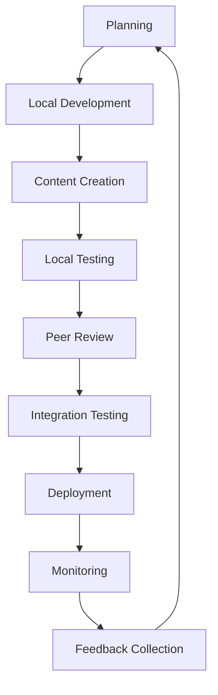
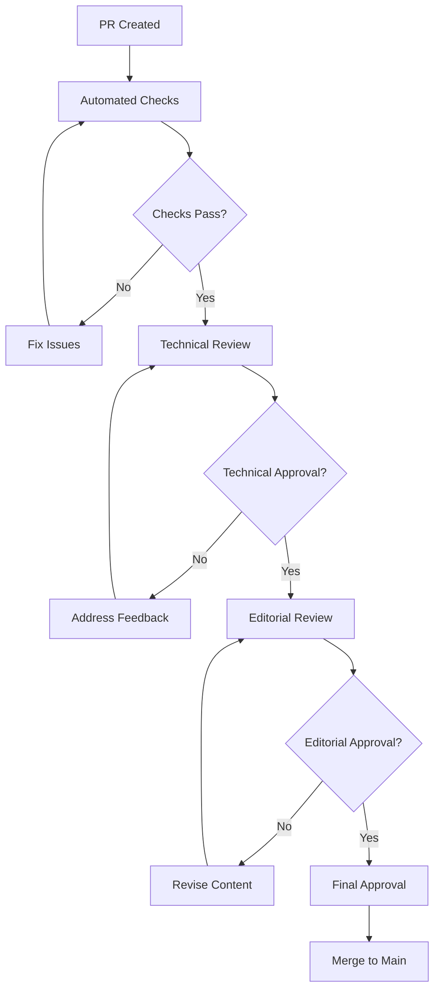
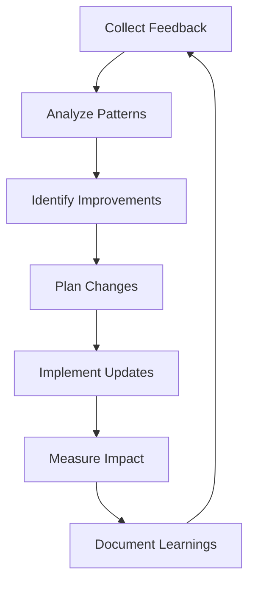

## Development Workflow

Effective development workflows are essential for successful Documentation as Code implementation. This section covers daily development practices, collaboration processes, and quality assurance procedures that ensure high-quality documentation while maintaining team productivity.

## Overview

Documentation as Code development follows software development best practices adapted for content creation. The workflow emphasizes:

- **Version Control**: All changes tracked and reviewable
- **Collaboration**: Multiple contributors working efficiently
- **Quality Assurance**: Automated and manual quality checks
- **Continuous Integration**: Automated testing and deployment
- **Iterative Improvement**: Regular feedback and refinement

## Workflow Components

### Development Phases



### Team Roles and Responsibilities

| Role | Primary Responsibilities | Workflow Involvement |
|------|-------------------------|---------------------|
| **Content Authors** | Write and update documentation | Planning, Content Creation, Review Response |
| **Technical Reviewers** | Verify technical accuracy | Peer Review, Quality Assurance |
| **Editors** | Ensure style and clarity | Editorial Review, Style Compliance |
| **DevOps Engineers** | Maintain infrastructure and pipelines | CI/CD Management, Deployment |
| **Product Managers** | Define content strategy and priorities | Planning, Requirements Definition |

## Daily Development Process

### Morning Routine

**Team Synchronization:**

```bash
# 1. Start development session
cd documentation-repository

# 2. Sync with remote repository
git fetch origin
git status

# 3. Update main branch
git checkout main
git pull origin main

# 4. Check for updates in assigned issues
# Review Azure DevOps work items and pull requests

# 5. Plan daily work
# Review content roadmap and priorities
```

### Content Development Cycle

**Feature Branch Workflow:**

```bash
# 1. Create feature branch for new content
git checkout -b feature/user-authentication-guide

# 2. Set up development environment
npm install
npm run build-serve

# 3. Create content outline
# - Define scope and audience
# - Create table of contents
# - Identify required assets

# 4. Develop content iteratively
# - Write content sections
# - Add code examples and images
# - Test locally after each section

# 5. Validate content quality
npm run validate

# 6. Commit incremental changes
git add .
git commit -m "Add: user authentication overview section"
```

### Quality Checkpoints

**Self-Review Checklist:**

```markdown
## Content Self-Review Checklist

### Content Quality
- [ ] Clearly defines target audience
- [ ] Follows logical structure and flow
- [ ] Uses consistent terminology
- [ ] Includes working code examples
- [ ] Provides troubleshooting guidance

### Technical Accuracy
- [ ] All instructions tested and verified
- [ ] Code examples execute successfully
- [ ] Links are functional and appropriate
- [ ] Screenshots are current and clear
- [ ] API references are up-to-date

### Style and Formatting
- [ ] Follows established style guide
- [ ] Uses proper markdown formatting
- [ ] Includes appropriate metadata
- [ ] Images have alt text and captions
- [ ] Tables are well-formatted

### User Experience
- [ ] Content serves user needs effectively
- [ ] Prerequisites are clearly stated
- [ ] Next steps are provided
- [ ] Contact information available
- [ ] Feedback mechanism present
```

## Collaboration Framework

### Branch Strategy

**GitFlow for Documentation:**

```text
Branch Hierarchy:
├── main                    # Production-ready content
├── develop                 # Integration branch
├── feature/topic-name      # Feature development
├── hotfix/critical-fix     # Critical fixes
└── release/version-number  # Release preparation
```

**Branch Naming Conventions:**

```text
Branch Types:
├── feature/[author]-[topic]     # New content or major updates
├── fix/[issue-description]      # Bug fixes and corrections
├── update/[content-area]        # Content updates and refreshes
├── docs/[infrastructure]        # Documentation infrastructure
└── experiment/[concept]         # Experimental content
```

### Pull Request Process

**PR Creation Guidelines:**

```yaml
pull_request_template:
  title_format: "[Type]: Brief description of changes"
  
  required_sections:
    - summary: "What changes were made and why"
    - audience: "Who this content serves"
    - testing: "How changes were validated"
    - related_work: "Links to related PRs or issues"
  
  review_requirements:
    minimum_reviewers: 2
    required_approvals: ["technical-reviewer", "editor"]
    dismiss_stale_reviews: true
    require_conversation_resolution: true
```

**Review Process Flow:**



### Code Review Standards

**Technical Review Focus:**

```yaml
technical_review_criteria:
  accuracy:
    - "All technical information is correct"
    - "Code examples compile and execute"
    - "API references match current versions"
    - "Configuration examples are valid"
  
  completeness:
    - "All necessary information included"
    - "Prerequisites clearly stated"
    - "Error handling covered"
    - "Security considerations addressed"
  
  maintainability:
    - "Content structure supports updates"
    - "Images and assets are optimized"
    - "Links use relative paths where appropriate"
    - "Metadata is complete and accurate"
```

**Editorial Review Focus:**

```yaml
editorial_review_criteria:
  clarity:
    - "Writing is clear and concise"
    - "Technical concepts explained appropriately"
    - "Audience needs addressed effectively"
    - "Flow and organization logical"
  
  consistency:
    - "Follows established style guide"
    - "Terminology used consistently"
    - "Formatting applied correctly"
    - "Voice and tone appropriate"
  
  usability:
    - "Content scannable and accessible"
    - "Headings descriptive and hierarchical"
    - "Lists and tables well-formatted"
    - "Call-to-action elements clear"
```

## Quality Assurance

### Automated Quality Checks

**CI/CD Pipeline Integration:**

```yaml
# Quality gates in Azure Pipelines
quality_gates:
  build_validation:
    - markdown_linting
    - link_checking
    - spell_checking
    - docfx_build_test
  
  content_analysis:
    - readability_scoring
    - content_freshness_check
    - image_optimization_check
    - accessibility_validation
  
  security_scanning:
    - sensitive_data_detection
    - malicious_link_scanning
    - image_metadata_stripping
    - dependency_vulnerability_check
```

**Quality Metrics Tracking:**

```javascript
// Documentation quality metrics
const qualityMetrics = {
  contentHealth: {
    linkValidation: {
      total: 1250,
      passing: 1238,
      failing: 12,
      score: 99.04
    },
    readabilityScore: {
      average: 72.5,
      target: 70,
      status: "passing"
    },
    contentFreshness: {
      averageAge: 45,
      staleThreshold: 90,
      staleCount: 8
    }
  },
  
  userExperience: {
    pageLoadTime: {
      average: 1.2,
      target: 2.0,
      status: "passing"
    },
    searchSuccessRate: {
      current: 87.3,
      target: 85,
      status: "passing"
    },
    feedbackScore: {
      average: 4.2,
      target: 4.0,
      status: "passing"
    }
  }
};
```

### Manual Quality Assurance

**Content Review Schedule:**

| Review Type | Frequency | Scope | Owner |
|-------------|-----------|-------|-------|
| **Daily** | Every day | New content and changes | Authors |
| **Weekly** | Every week | High-traffic content | Editors |
| **Monthly** | Every month | Content accuracy and links | Technical team |
| **Quarterly** | Every quarter | Complete content audit | Content team |
| **Annually** | Every year | Information architecture | Product team |

**Quality Assurance Checklist:**

```markdown
## Monthly QA Review Checklist

### Content Accuracy Review
- [ ] Verify all code examples still work
- [ ] Check API documentation against current versions
- [ ] Validate configuration examples
- [ ] Test all download links and external references

### User Experience Review
- [ ] Test navigation and search functionality
- [ ] Review page load times and performance
- [ ] Check mobile responsiveness
- [ ] Validate accessibility compliance

### Content Health Review
- [ ] Identify and fix broken links
- [ ] Update outdated screenshots
- [ ] Review and update stale content
- [ ] Consolidate duplicate information

### Analytics Review
- [ ] Analyze high-exit pages
- [ ] Review search query failures
- [ ] Identify content gaps from user feedback
- [ ] Track content performance metrics
```

## Performance Optimization

### Development Efficiency

**Time-Saving Practices:**

```yaml
efficiency_practices:
  template_usage:
    - "Use content templates for consistency"
    - "Maintain snippet libraries for common patterns"
    - "Automate repetitive formatting tasks"
    - "Create reusable component library"
  
  tool_integration:
    - "Configure editor shortcuts and snippets"
    - "Use automated quality checking tools"
    - "Implement live preview workflows"
    - "Integrate with project management tools"
  
  workflow_optimization:
    - "Batch similar content creation tasks"
    - "Use standardized review processes"
    - "Automate build and deployment"
    - "Implement feedback loops for improvement"
```

### Content Performance

**Optimization Strategies:**

```markdown
## Content Performance Optimization

### Asset Optimization
- Compress images to appropriate sizes
- Use WebP format for modern browsers
- Implement lazy loading for images
- Optimize font loading and usage

### Content Structure
- Use semantic HTML structure
- Implement proper heading hierarchy
- Create scannable content layout
- Optimize table of contents navigation

### Search Optimization
- Include relevant keywords naturally
- Use descriptive headings and metadata
- Implement structured data markup
- Create comprehensive internal linking

### Load Time Optimization
- Minimize external dependencies
- Implement efficient caching strategies
- Optimize CSS and JavaScript delivery
- Use content delivery networks (CDN)
```

## Continuous Improvement

### Feedback Integration

**Feedback Collection Methods:**

```yaml
feedback_channels:
  user_feedback:
    - page_ratings: "thumbs up/down with comments"
    - detailed_surveys: "quarterly user experience surveys"
    - support_tickets: "content-related support requests"
    - community_forums: "discussion and Q&A platforms"
  
  analytics_insights:
    - usage_patterns: "page views, time on page, bounce rates"
    - search_behavior: "query analysis and success rates"
    - navigation_flow: "user journey and drop-off points"
    - device_preferences: "mobile vs desktop usage patterns"
  
  team_feedback:
    - retrospectives: "regular team retrospective meetings"
    - peer_reviews: "colleague feedback on content quality"
    - expert_reviews: "subject matter expert validation"
    - stakeholder_input: "business stakeholder requirements"
```

### Workflow Refinement

**Continuous Improvement Process:**



**Improvement Tracking:**

```yaml
improvement_metrics:
  process_efficiency:
    - content_creation_time: "time from start to publication"
    - review_cycle_duration: "time for complete review process"
    - defect_rate: "issues found post-publication"
    - team_satisfaction: "developer experience scores"
  
  content_quality:
    - user_satisfaction: "feedback scores and comments"
    - technical_accuracy: "post-publication issue rate"
    - content_freshness: "average content age"
    - search_effectiveness: "findability and usability"
```

## Next Steps

After establishing your development workflow:

1. **[Local Development Setup](local-development.md)** - Configure your development environment
2. **[Collaboration Process](collaboration.md)** - Master team collaboration techniques  
3. **[Quality Assurance](quality-assurance.md)** - Implement comprehensive quality checks
4. **[VS Code and Copilot](../vscode/index.md)** - Enhance productivity with modern tooling and AI assistance
5. **[Deployment Operations](../deployment/index.md)** - Learn deployment and operations management

## Additional Resources

- [Git Workflow Documentation](https://git-scm.com/docs/gitworkflows)
- [Code Review Best Practices](https://github.com/google/eng-practices/blob/master/review/README.md)
- [Documentation Style Guides](https://developers.google.com/style)
- [Agile Documentation Practices](https://agilemanifesto.org/index.md)

---

*This development workflow guide provides a comprehensive framework for efficient, collaborative, and high-quality documentation development using Documentation as Code principles.*
