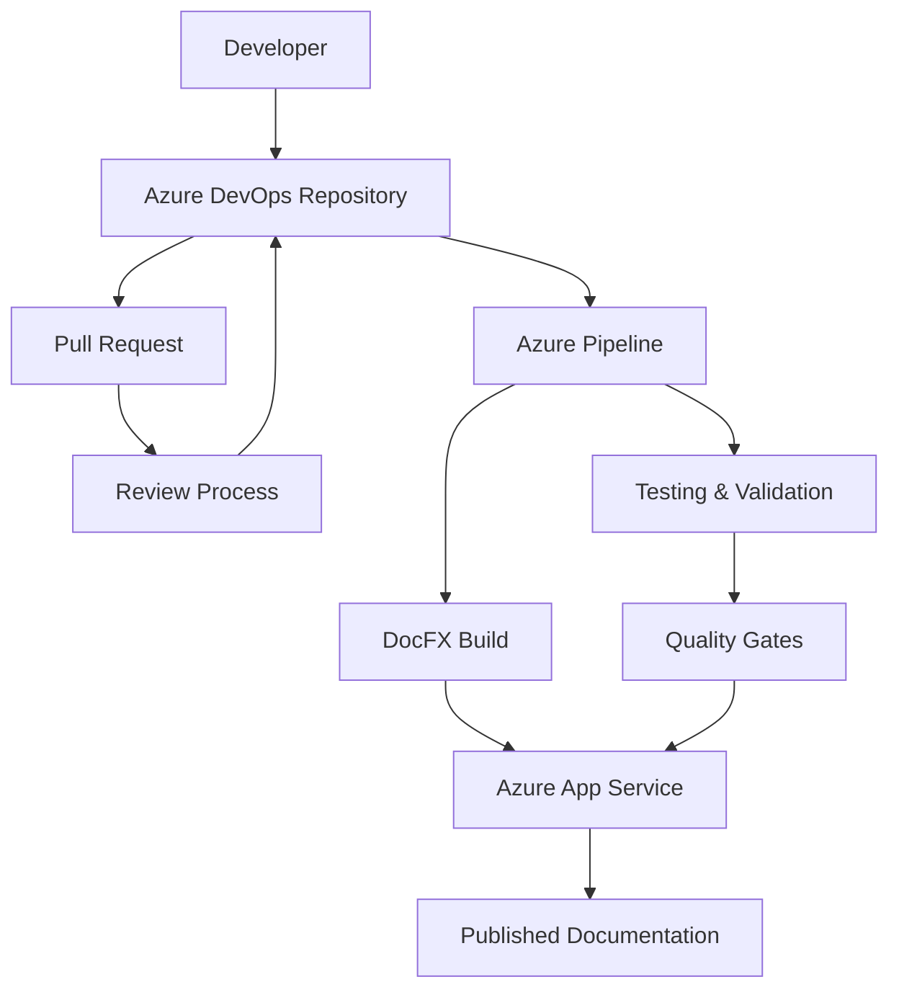

## Documentation as Code

Documentation as Code (DaC) is a methodology that treats documentation with the same principles and practices used for software development. By storing documentation alongside code in version control systems, applying automated testing, and using CI/CD pipelines for deployment, organizations can ensure their documentation remains accurate, up-to-date, and synchronized with their software releases.

## Overview

This comprehensive guide covers implementing Documentation as Code using:

- **DocFX** for static site generation
- **Azure DevOps Repositories** for version control and collaboration
- **Azure App Service** for hosting and deployment
- **Azure Pipelines** for continuous integration and deployment

## Why Documentation as Code?

### Traditional Documentation Challenges

Traditional documentation approaches often suffer from:

- **Outdated Information**: Documentation quickly becomes stale without regular updates
- **Version Inconsistencies**: Difficulty maintaining documentation versions aligned with software releases
- **Accessibility Issues**: Documentation stored in proprietary formats or isolated systems
- **Poor Collaboration**: Limited ability for multiple contributors to work efficiently
- **Manual Processes**: Time-consuming manual updates and deployments

### Benefits of Documentation as Code

#### Version Control Integration

- Track all changes with detailed commit history
- Branch and merge documentation changes alongside code
- Rollback to previous versions when needed
- Maintain consistency across environments

#### Automated Workflows

- Continuous integration testing for documentation builds
- Automated deployment to staging and production environments
- Pull request reviews ensure quality and accuracy
- Integration with existing development workflows

#### Enhanced Collaboration

- Multiple contributors can work simultaneously
- Peer review process through pull requests
- Issue tracking and discussion threads
- Integration with development team workflows

#### Quality Assurance

- Automated link checking and validation
- Consistent formatting through templates
- Spell checking and grammar validation
- Visual regression testing for layout changes

## Architecture Overview



### Component Responsibilities

| Component | Purpose | Key Features |
|-----------|---------|--------------|
| **Azure DevOps Repositories** | Source control and collaboration | Git repositories, branch policies, pull requests |
| **DocFX** | Static site generation | Markdown processing, API documentation, themes |
| **Azure Pipelines** | CI/CD automation | Build validation, testing, deployment |
| **Azure App Service** | Web hosting | Scalable hosting, custom domains, SSL certificates |

## Getting Started

### Prerequisites

Before implementing Documentation as Code, ensure you have:

- **Azure Subscription** with appropriate permissions
- **Azure DevOps Organization** and project access
- **DocFX** installed locally for development
- **Git** knowledge and tooling
- **Markdown** writing proficiency

### Quick Start Checklist

1. ☐ [Set up Azure DevOps Repository](setup/azure-devops.md)
2. ☐ [Configure DocFX Project](setup/docfx-configuration.md)
3. ☐ [Create Azure App Service](setup/azure-app-service.md)
4. ☐ [Configure CI/CD Pipeline](setup/cicd-pipeline.md)
5. ☐ [Implement Content Strategy](content/content-strategy.md)
6. ☐ [Set up Local Development](development/local-development.md)

## Key Concepts

### Content Structure

Documentation as Code follows a structured approach to content organization:

```text
docs/
├── articles/          # Long-form content
├── api/              # API documentation
├── tutorials/        # Step-by-step guides
├── reference/        # Reference materials
├── images/           # Media assets
├── templates/        # DocFX templates
├── toc.yml          # Table of contents
└── docfx.json       # DocFX configuration
```

### Workflow Integration

The Documentation as Code workflow integrates seamlessly with software development:

1. **Feature Development**: Documentation changes accompany code changes
2. **Pull Request Review**: Both code and documentation are reviewed together
3. **Automated Testing**: Documentation builds and validates automatically
4. **Deployment**: Documentation deploys alongside application releases
5. **Monitoring**: Track documentation health and usage metrics

### Quality Standards

Maintaining high-quality documentation requires:

- **Consistent Style**: Standardized writing style and formatting guidelines
- **Accuracy Validation**: Regular review and update processes
- **Accessibility**: Compliance with web accessibility standards
- **Performance**: Optimized loading times and responsive design
- **SEO Optimization**: Search engine friendly structure and metadata

## Implementation Phases

### Phase 1: Foundation Setup

- Repository creation and configuration
- Initial DocFX project setup
- Basic CI/CD pipeline implementation
- Azure App Service provisioning

### Phase 2: Content Migration

- Existing documentation assessment
- Content conversion to Markdown
- Structure reorganization
- Quality assurance testing

### Phase 3: Advanced Features

- Custom themes and branding
- API documentation integration
- Advanced search capabilities
- Analytics and monitoring

### Phase 4: Optimization

- Performance tuning
- Advanced workflow automation
- Team training and adoption
- Continuous improvement processes

## Best Practices Summary

### Repository Management

- Use clear branch naming conventions
- Implement branch protection policies
- Regular dependency updates
- Security scanning integration

### Content Creation

- Follow established style guides
- Use consistent formatting
- Include relevant metadata
- Optimize images and media

### Deployment Strategy

- Separate staging and production environments
- Blue-green deployment patterns
- Rollback procedures
- Health monitoring

### Team Collaboration

- Clear contribution guidelines
- Regular review processes
- Documentation standards training
- Feedback collection mechanisms

## Success Metrics

Track the success of your Documentation as Code implementation:

### Quality Metrics

- Documentation coverage percentage
- Link validation success rate
- Build failure frequency
- Time to publication

### Usage Metrics

- Page views and user engagement
- Search success rates
- User feedback scores
- Support ticket reduction

### Process Metrics

- Pull request review time
- Deployment frequency
- Time to update documentation
- Team adoption rate

## Next Steps

Ready to implement Documentation as Code? Start with these detailed guides:

1. **[Quick Reference](quick-reference.md)** - Essential commands, templates, and troubleshooting
2. **[FAQ](faq.md)** - Answers to frequently asked questions
3. **[Glossary](glossary.md)** - Definitions of key terms and concepts
4. **[Setup and Configuration](setup/index.md)** - Step-by-step implementation guide
5. **[VS Code and Copilot](vscode/index.md)** - Modern tooling and AI-assisted documentation
6. **[Content Strategy](content/index.md)** - Planning and organizing your documentation
7. **[Development Workflow](development/index.md)** - Day-to-day documentation development
8. **[Deployment and Operations](deployment/index.md)** - Managing production documentation
9. **[Advanced Topics](advanced/index.md)** - Customization and optimization

## Additional Resources

- [DocFX Official Documentation](https://dotnet.github.io/docfx/)
- [Azure DevOps Documentation](https://docs.microsoft.com/en-us/azure/devops/)
- [Azure App Service Documentation](https://docs.microsoft.com/en-us/azure/app-service/)
- [Markdown Guide](https://www.markdownguide.org/)
- [Documentation Style Guides](https://github.com/Microsoft/vscode-docs-authoring)

---

*This guide provides a comprehensive foundation for implementing Documentation as Code. Each section includes detailed instructions, best practices, and real-world examples to ensure successful adoption.*
