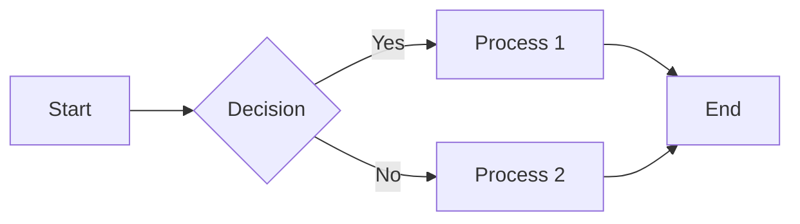
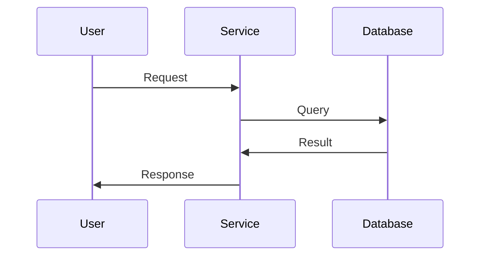
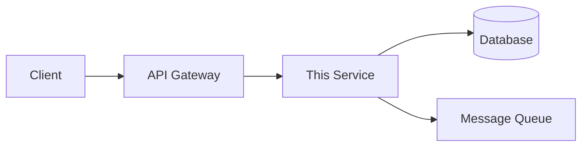
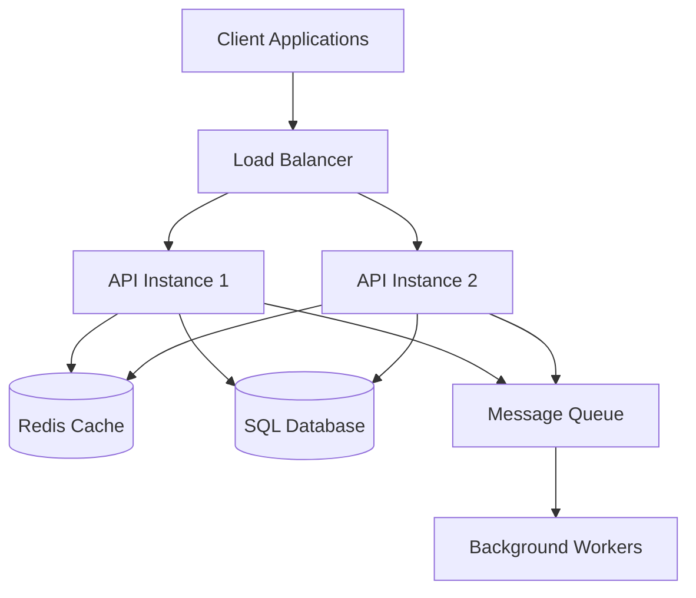
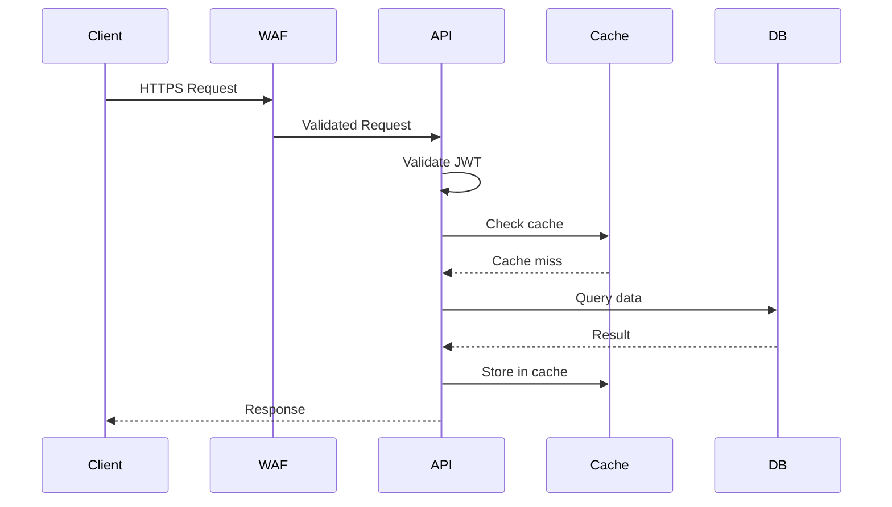

# Azure DevOps Documentation-as-Code Implementation Guide

**Organization:** [Organization Name]  
**Document Version:** 1.0  
**Date:** [Date]  
**Document Owner:** [Documentation Team / DevOps Team]

---

## Executive Summary

### Purpose

This document provides comprehensive guidance for implementing a Documentation-as-Code approach using Azure DevOps. This strategy treats documentation with the same rigor as source code: version controlled, peer-reviewed, tested, and automatically published.

### Approach

- **Project Wikis:** Centralized documentation repository for cross-cutting, organizational, and operational documentation
- **Code Wikis:** Service-specific technical documentation published from code repositories
- **Markdown-based:** All documentation written in Markdown for portability and version control
- **Git-backed:** Full version control with branching, pull requests, and history
- **Automated:** CI/CD pipelines for validation, publishing, and notifications

### Benefits

- **Version Control:** Full history of all documentation changes
- **Peer Review:** Pull request workflow ensures documentation quality
- **Discoverability:** Centralized location with search capability
- **Consistency:** Templates and automated validation enforce standards
- **Integration:** Links directly to code, work items, pipelines
- **Automation:** Reduce manual effort through CI/CD
- **Collaboration:** Multiple contributors with approval workflows

### Key Concepts

**Documentation-as-Code means:**

- Documentation stored as Markdown files in Git repositories
- Changes go through same workflow as code (branch → pull request → review → merge)
- Automated testing for broken links, formatting, standards compliance
- Automated publishing to wiki when changes are approved
- Documentation versioned alongside the code it describes

---

## Table of Contents

1. [Azure DevOps Wiki Types](#1-azure-devops-wiki-types)
2. [Architecture & Organization](#2-architecture--organization)
3. [Project Wiki Implementation](#3-project-wiki-implementation)
4. [Code Wiki Implementation](#4-code-wiki-implementation)
5. [Markdown Standards & Best Practices](#5-markdown-standards--best-practices)
6. [Version Control Workflow](#6-version-control-workflow)
7. [CI/CD Pipelines for Documentation](#7-cicd-pipelines-for-documentation)
8. [Templates & Automation](#8-templates--automation)
9. [Access Control & Permissions](#9-access-control--permissions)
10. [Search & Discoverability](#10-search--discoverability)
11. [Migration Strategy](#11-migration-strategy)
12. [Maintenance & Governance](#12-maintenance--governance)
13. [Appendices](#13-appendices)

---

## 1. Azure DevOps Wiki Types

Azure DevOps provides two types of wikis, each serving different purposes.

### 1.1 Project Wiki

**What it is:**

- A wiki provisioned for an entire Azure DevOps project
- Backed by a hidden Git repository (you can clone and work locally)
- One per project (but can have multiple projects)
- Managed through the Azure DevOps web interface OR via Git

**Best used for:**

- ✅ Cross-cutting documentation (affects multiple services/repos)
- ✅ Operational procedures and runbooks
- ✅ Organizational standards and policies
- ✅ Architecture decision records (ADRs)
- ✅ Project management documentation
- ✅ Team onboarding and training materials
- ✅ Index/catalog of all services and their documentation

**Characteristics:**

- Central location for project-wide documentation
- Not tied to specific code repositories
- Survives even if code repositories are deleted
- Easier to manage permissions at project level
- Good for non-technical stakeholders (can edit via web UI)

**Example structure:**

```text
Project Wiki: "Enterprise IT Documentation"
├── Getting Started
│   ├── Welcome
│   ├── Team Directory
│   └── How to Contribute
├── Standards
│   ├── Coding Standards
│   ├── Documentation Standards
│   └── Security Standards
├── Architecture
│   ├── Enterprise Architecture Overview
│   ├── Network Architecture
│   └── Security Architecture
├── Operations
│   ├── On-Call Procedures
│   ├── Incident Response
│   └── Change Management
├── Services Catalog
│   ├── Service A (link to code wiki)
│   ├── Service B (link to code wiki)
│   └── Service C (link to code wiki)
└── Policies
    ├── Access Control
    └── Data Classification
```

### 1.2 Code Wiki

**What it is:**

- A wiki published from a specific folder in a Git repository
- Lives alongside the code it documents
- Can have multiple code wikis (one per repo or even multiple per repo)
- Automatically updated when repository changes are merged

**Best used for:**

- ✅ Service-specific technical documentation
- ✅ API documentation
- ✅ Architecture for specific applications
- ✅ Setup and configuration guides
- ✅ Developer guides for specific codebases
- ✅ Runbooks specific to one service
- ✅ Documentation that should version with code

**Characteristics:**

- Tightly coupled to code repository
- Documentation versions match code versions (branches, tags)
- Can have different documentation per branch
- Deleted when repository is deleted (unless backed up)
- Perfect for technical documentation by developers
- Changes go through same pull request process as code

**Example structure:**

```text
Code Repository: "email-gateway-service"
└── /docs (published as code wiki)
    ├── README.md (Overview)
    ├── Architecture.md
    ├── API
    │   ├── Authentication.md
    │   ├── Endpoints.md
    │   └── Examples.md
    ├── Operations
    │   ├── Deployment.md
    │   ├── Monitoring.md
    │   ├── Troubleshooting.md
    │   └── Runbook.md
    ├── Development
    │   ├── Getting-Started.md
    │   ├── Local-Development.md
    │   └── Testing.md
    └── Integration
        ├── Exchange-Online.md
        └── Active-Directory.md
```

### 1.3 When to Use Which

| Use Case | Project Wiki | Code Wiki |
|----------|--------------|-----------|
| Service-specific technical documentation | | ✅ |
| Cross-service operational procedures | ✅ | |
| API documentation for one service | | ✅ |
| Enterprise architecture | ✅ | |
| Onboarding documentation | ✅ | |
| Service catalog/index | ✅ | |
| Code setup and development guide | | ✅ |
| Incident response procedures | ✅ | |
| Standards and policies | ✅ | |
| Documentation that versions with code | | ✅ |
| Documentation accessed by non-technical users | ✅ | |

#### Recommendation: Use both together

- **Project Wiki:** "Table of contents" and operational documentation
- **Code Wikis:** Deep technical documentation per service
- **Link between them:** Project Wiki contains service catalog with links to each code wiki

---

## 2. Architecture & Organization

### 2.1 Recommended Structure

**High-Level Strategy:**

```text
Azure DevOps Organization: "Contoso"
│
├── Project: "Enterprise IT"
│   │
│   ├── Project Wiki: "Enterprise IT Documentation"
│   │   ├── (Cross-cutting documentation)
│   │   └── Services Catalog (links to code wikis)
│   │
│   ├── Repository: "fortimail-service"
│   │   └── Code Wiki from /docs folder
│   │
│   ├── Repository: "database-platform"
│   │   └── Code Wiki from /docs folder
│   │
│   └── Repository: "monitoring-infrastructure"
│       └── Code Wiki from /docs folder
│
└── Project: "Product Development"
    │
    ├── Project Wiki: "Product Documentation"
    │   └── (Product-wide documentation)
    │
    ├── Repository: "api-backend"
    │   └── Code Wiki from /docs folder
    │
    └── Repository: "web-frontend"
        └── Code Wiki from /docs folder
```

### 2.2 Folder Structure for Code Wikis

**Standard /docs folder structure in every repository:**

```text
/docs
├── .order                          # Controls page ordering in wiki
├── README.md                       # Wiki home page (overview of service)
├── Architecture.md                 # Architecture documentation
├── .attachments/                   # Images, diagrams, files
│   ├── architecture-diagram.png
│   └── network-diagram.png
├── API/                            # API documentation folder
│   ├── .order
│   ├── Overview.md
│   ├── Authentication.md
│   ├── Endpoints.md
│   └── Examples.md
├── Operations/                     # Operational documentation
│   ├── .order
│   ├── Deployment.md
│   ├── Configuration.md
│   ├── Monitoring.md
│   ├── Troubleshooting.md
│   └── Runbook.md
├── Development/                    # Developer documentation
│   ├── .order
│   ├── Getting-Started.md
│   ├── Local-Setup.md
│   ├── Testing.md
│   └── Contributing.md
└── Integration/                    # Integration documentation
    ├── .order
    ├── Overview.md
    ├── System-A-Integration.md
    └── System-B-Integration.md
```

**Key files:**

**`.order` file:**
Controls the order of pages in the wiki navigation. One filename per line.

Example `.order` file in `/docs`:

```text
README
Architecture
API
Operations
Development
Integration
```

**`.attachments/` folder:**

- Store all images, diagrams, PDFs here
- Reference in Markdown: ``
- Azure DevOps automatically serves these files

### 2.3 Naming Conventions

**File naming standards:**

✅ **Good:**

- `README.md` (always the entry point)
- `Getting-Started.md` (capitalize words, use hyphens)
- `API-Authentication.md`
- `Troubleshooting-Guide.md`

❌ **Avoid:**

- `getting started.md` (spaces break links)
- `api_authentication.md` (underscores are harder to read)
- `TroubleshootingGuide.md` (no separation between words)
- `readme.txt` (not Markdown)

**Folder naming standards:**

✅ **Good:**

- `API/`
- `Operations/`
- `Development/`

❌ **Avoid:**

- `api docs/` (spaces)
- `Ops_Docs/` (underscores)

**Branch naming for documentation changes:**

✅ **Good:**

- `docs/update-runbook`
- `docs/add-api-examples`
- `docs/fix-broken-links`

### 2.4 Project Organization Strategies

#### Option 1: Single Project (Recommended for Most)

- One Azure DevOps project for all IT services
- One Project Wiki for operational/cross-cutting docs
- Many Code Wikis (one per service repository)
- **Pros:** Centralized, easier to search across, simpler permissions
- **Cons:** Can become large, may need good organization

#### Option 2: Multiple Projects by Domain

- Separate projects for: Infrastructure, Applications, Security, etc.
- Each project has its own Project Wiki
- Each repository has Code Wiki
- **Pros:** Clear separation, better for large organizations
- **Cons:** Documentation fragmented, harder to search across

#### Option 3: Hybrid

- One "Central IT" project with Project Wiki for org-wide docs
- Domain-specific projects (Infrastructure, Security) with their own wikis
- All have Code Wikis per repository
- **Pros:** Balance of centralization and separation
- **Cons:** Most complex to manage

**Recommendation:** Start with Option 1 (single project). Move to Option 3 only when you have >100 services or clear organizational boundaries.

---

## 3. Project Wiki Implementation

### 3.1 Creating a Project Wiki

**Via Azure DevOps Web UI:**

1. Navigate to your Azure DevOps project
2. Click **Overview** → **Wiki**
3. Click **Create Project Wiki**
4. Choose wiki name (e.g., "Enterprise IT Documentation")
5. Wiki is created with a default home page

**The wiki is now backed by a hidden Git repository.**

### 3.2 Working with Project Wiki

**Two methods to edit:**

#### Method A: Web-Based Editing (Simple)

**Best for:**

- Quick edits
- Non-technical users
- Single-page changes

**Process:**

1. Navigate to wiki page
2. Click **Edit**
3. Make changes in web editor
4. Click **Save** (commits directly to main branch)
5. Optionally add commit message

**Limitations:**

- No pull request workflow
- No local editing
- No branching
- Limited to one page at a time

#### Method B: Git-Based Editing (Recommended)

**Best for:**

- Large changes
- Multiple pages
- Technical users
- Pull request workflow
- Offline editing

**Process:**

#### Step 1: Clone the wiki repository

```bash
# Get the wiki clone URL from Azure DevOps
# Wiki → More options (...) → Clone wiki

git clone https://dev.azure.com/organization/project/_git/project.wiki
cd project.wiki
```

#### Step 2: Create a branch for your changes

```bash
git checkout -b docs/update-incident-response
```

#### Step 3: Make changes locally

```bash
# Edit files in your favorite editor
code Operations/Incident-Response.md

# Add images to .attachments folder if needed
cp ~/diagram.png .attachments/incident-flow.png
```

#### Step 4: Commit and push

```bash
git add .
git commit -m "docs: update incident response procedures with new escalation path"
git push origin docs/update-incident-response
```

#### Step 5: Create pull request

1. Go to Azure DevOps → Repos → Pull Requests
2. Create new pull request from your branch to `wikiMain`
3. Add reviewers
4. Link to work item if applicable
5. Reviewers approve
6. Complete pull request (squash or merge)
7. Wiki automatically updates

### 3.3 Project Wiki Best Practices

#### 3.3.1 Home Page Structure

**Recommended home page (`Home.md`):**

```markdown
# Enterprise IT Documentation

Welcome to the Enterprise IT documentation repository. This wiki contains operational procedures, standards, and guidelines for IT services.

## Quick Links

- [On-Call Procedures](/Operations/On-Call)
- [Incident Response](/Operations/Incident-Response)
- [Service Catalog](/Services/Catalog)
- [Team Directory](/About/Team-Directory)

## Documentation Sections

### [Getting Started](/Getting-Started)
New to the team? Start here for onboarding information.

### [Standards](/Standards)
Coding standards, security policies, and best practices.

### [Architecture](/Architecture)
Enterprise architecture documentation and diagrams.

### [Operations](/Operations)
Operational runbooks, procedures, and on-call guides.

### [Services](/Services)
Catalog of all IT services with links to detailed documentation.

## How to Contribute

See [Contributing Guide](/About/Contributing) for information on how to update this documentation.

## Support

For questions or issues with this documentation:
- Create an issue in the [documentation backlog](link-to-board)
- Contact: [documentation-team@company.com](mailto:documentation-team@company.com)

---
*Last updated: 2025-01-15*
```

#### 3.3.2 Table of Contents

##### Option 1: Use wiki navigation (automatic)

- Azure DevOps automatically generates left navigation from folder structure
- Use `.order` files to control ordering
- Good for most use cases

##### Option 2: Create explicit TOC page

- Create `Table-of-Contents.md` with links to major sections
- Good for large wikis with complex structure
- Provides "map" for readers

**Example TOC page:**

```markdown
# Documentation Table of Contents

## Operational Documentation
1. [Incident Response](/Operations/Incident-Response)
2. [Change Management](/Operations/Change-Management)
3. [On-Call Procedures](/Operations/On-Call)
4. [Monitoring and Alerting](/Operations/Monitoring)

## Service Documentation
- [Email Gateway (FortiMail)](/Services/Email-Gateway) → [Detailed Docs](link-to-code-wiki)
- [Database Platform](/Services/Database-Platform) → [Detailed Docs](link-to-code-wiki)
- [Monitoring Infrastructure](/Services/Monitoring) → [Detailed Docs](link-to-code-wiki)

## Architecture
- [Enterprise Architecture](/Architecture/Overview)
- [Network Architecture](/Architecture/Network)
- [Security Architecture](/Architecture/Security)
- [Cloud Architecture](/Architecture/Cloud)

## Standards & Policies
- [Coding Standards](/Standards/Coding)
- [Documentation Standards](/Standards/Documentation)
- [Security Standards](/Standards/Security)
- [Access Control Policy](/Policies/Access-Control)
```

#### 3.3.3 Cross-Linking Strategy

**Link types:**

**1. Internal wiki links (within same wiki):**

```markdown
See [Incident Response](/Operations/Incident-Response) for procedures.
```

**2. Links to code wikis:**

```markdown
For detailed technical documentation, see the [Email Gateway Code Wiki](https://dev.azure.com/org/project/_git/email-gateway.wiki).
```

**3. Links to Azure DevOps work items:**

```markdown
This addresses work item #12345.
```

**4. Links to repositories:**

```markdown
View the [source code](https://dev.azure.com/org/project/_git/email-gateway).
```

**5. Links to pipelines:**

```markdown
Deployment pipeline: [Email Gateway Deploy](https://dev.azure.com/org/project/_build?definitionId=42).
```

**Best practices for linking:**

- Use relative links within same wiki: `/Operations/Runbook` not full URL
- Always use descriptive link text: `[incident response procedures]` not `[click here]`
- Verify links don't break when pages are renamed
- Include links to related documentation at bottom of pages

### 3.4 Service Catalog Page

**Create a central service catalog in Project Wiki:**

**`/Services/Catalog.md`:**

```markdown
# IT Services Catalog

This page catalogs all IT services, their owners, and links to detailed documentation.

## Production Services

| Service Name | Description | Status | Owner | Documentation | Repository |
|--------------|-------------|--------|-------|---------------|------------|
| Email Gateway | FortiMail secure email relay | 🟢 Production | IAM Team | [Code Wiki](link) | [Repo](link) |
| Database Platform | SQL Server platform | 🟢 Production | Data Team | [Code Wiki](link) | [Repo](link) |
| Monitoring | Prometheus + Grafana | 🟢 Production | Ops Team | [Code Wiki](link) | [Repo](link) |
| Identity Platform | Active Directory | 🟢 Production | IAM Team | [Code Wiki](link) | [Repo](link) |

## In Development

| Service Name | Description | Status | Owner | Documentation | Repository |
|--------------|-------------|--------|-------|---------------|------------|
| API Gateway | Kong API gateway | 🟡 Development | Platform Team | [Code Wiki](link) | [Repo](link) |

## Legend
- 🟢 Production: Live and supported
- 🟡 Development: Under development
- 🔴 Deprecated: Being phased out
- ⚫ Decommissioned: No longer in use

## Adding a New Service

When creating a new service:
1. Create repository
2. Add `/docs` folder with documentation
3. Publish as code wiki
4. Add entry to this catalog
5. Notify [documentation-team@company.com](mailto:documentation-team@company.com)

See [Documentation Standards](/Standards/Documentation) for requirements.
```

---

## 4. Code Wiki Implementation

### 4.1 Creating a Code Wiki

**Prerequisites:**

- Git repository exists in Azure DevOps
- Repository contains a `/docs` folder with Markdown files
- At minimum, a `README.md` file in `/docs`

**Steps:**

1. **Navigate to repository**
   - Azure DevOps → Repos → Files
   - Select your repository

2. **Create /docs folder** (if it doesn't exist)

   ```bash
   # In your local clone
   mkdir docs
   cd docs
   
   # Create initial README
   cat > README.md << 'EOF'
   # Service Name
   
   ## Overview
   Brief description of this service.
   
   ## Documentation Sections
   - [Architecture](Architecture.md)
   - [Operations](Operations/README.md)
   - [Development](Development/README.md)
   EOF
   
   git add docs/
   git commit -m "docs: initialize documentation structure"
   git push
   ```

3. **Publish as code wiki**
   - Azure DevOps → Overview → Wiki
   - Click dropdown next to wiki name → **Publish code as wiki**
   - Select repository: [your-repo]
   - Select branch: `main` (or `master`)
   - Select folder: `/docs`
   - Wiki name: [Service Name Documentation]
   - Click **Publish**

4. **Wiki is now live**
   - Accessible via Wiki menu
   - Updates automatically when `/docs` changes are merged
   - Can publish multiple code wikis from different repos or folders

### 4.2 Standard Code Wiki Structure

**Template structure for every service:**

```text
/docs
├── .order                          # Page order configuration
├── README.md                       # Home page (service overview)
├── Architecture.md                 # Architecture documentation
├── .attachments/                   # Images and files
│   ├── architecture-diagram.png
│   ├── api-flow.png
│   └── monitoring-dashboard.png
│
├── Getting-Started.md              # Quick start guide
├── API/
│   ├── .order
│   ├── Overview.md
│   ├── Authentication.md
│   ├── Endpoints.md
│   ├── Rate-Limits.md
│   └── Examples.md
│
├── Operations/
│   ├── .order
│   ├── Deployment.md               # Deployment procedures
│   ├── Configuration.md            # Configuration guide
│   ├── Monitoring.md               # Monitoring and alerting
│   ├── Troubleshooting.md          # Common issues
│   ├── Runbook.md                  # Operational runbook
│   ├── Backup-Recovery.md          # Backup and recovery
│   └── Disaster-Recovery.md        # DR procedures
│
├── Development/
│   ├── .order
│   ├── Local-Setup.md              # Local dev environment
│   ├── Testing.md                  # Testing guide
│   ├── Contributing.md             # Contribution guidelines
│   ├── Code-Standards.md           # Coding standards
│   └── Release-Process.md          # Release procedures
│
└── Integration/
    ├── .order
    ├── Overview.md
    ├── Exchange-Online.md          # Specific integrations
    ├── Active-Directory.md
    └── Monitoring-System.md
```

### 4.3 README.md Template for Code Wiki

**Every service's `/docs/README.md` should follow this template:**

```markdown
# [Service Name]

## Overview

[2-3 sentence description of what this service does and why it exists]

**Status:** 🟢 Production  
**Team:** [Team Name]  
**Owner:** [Name/Email]

## Quick Links

- [Architecture](Architecture.md)
- [Operations Runbook](Operations/Runbook.md)
- [API Documentation](API/Overview.md)
- [Deployment Guide](Operations/Deployment.md)
- [Troubleshooting](Operations/Troubleshooting.md)

## Service Information

| Attribute | Value |
|-----------|-------|
| **Service Type** | [Web Service / Background Service / Database / Other] |
| **Technology Stack** | [.NET 6 / Python 3.9 / Java / etc.] |
| **Hosting** | [Azure App Service / Kubernetes / VMs / etc.] |
| **Dependencies** | [List key dependencies] |
| **Repository** | [Link to repo] |
| **CI/CD Pipeline** | [Link to pipeline] |
| **Monitoring Dashboard** | [Link to dashboard] |

## Architecture

[High-level architecture diagram or link to Architecture.md]

For detailed architecture documentation, see [Architecture](Architecture.md).

## Getting Started

### For Operators
- [Deployment Guide](Operations/Deployment.md)
- [Configuration Guide](Operations/Configuration.md)
- [Monitoring Guide](Operations/Monitoring.md)

### For Developers
- [Local Development Setup](Development/Local-Setup.md)
- [Contributing Guidelines](Development/Contributing.md)
- [Testing Guide](Development/Testing.md)

### For Consumers/Integrators
- [API Documentation](API/Overview.md)
- [Integration Examples](API/Examples.md)
- [Integration Guides](Integration/Overview.md)

## Support

- **On-Call:** [Link to PagerDuty/on-call schedule]
- **Team Email:** [team@company.com](mailto:team@company.com)
- **Slack Channel:** [#team-channel](https://slack.com/link)
- **Create Issue:** [Azure DevOps Backlog](link-to-board)

## Recent Changes

[Link to CHANGELOG.md or recent commits]

## Related Documentation

- [Enterprise Architecture](/Architecture) (Project Wiki)
- [Operational Procedures](/Operations) (Project Wiki)
- [Related Service A](link-to-code-wiki)
- [Related Service B](link-to-code-wiki)

---
*This documentation is maintained by [Team Name]. Last reviewed: [Date]*
```

### 4.4 Creating .order Files

**Purpose:** Controls the order of pages in wiki navigation

**Location:** Place `.order` file in each folder containing Markdown files

**Format:** One filename per line (without .md extension), one per line

**Example `/docs/.order`:**

```text
README
Getting-Started
Architecture
API
Operations
Development
Integration
```

**Example `/docs/Operations/.order`:**

```text
Deployment
Configuration
Monitoring
Troubleshooting
Runbook
Backup-Recovery
Disaster-Recovery
```

**Best practices:**

- Order from most commonly accessed to least
- Group related topics together
- Keep README/Overview first
- List "Getting Started" early
- Operational docs before development docs (for most audiences)

### 4.5 Multi-Version Documentation

**Challenge:** Code wikis can only show one branch at a time in the UI

**Solution options:**

#### Option 1: Document Multiple Versions in Same Wiki (Simple)

Create version-specific pages:

```text
/docs
├── README.md                    # Latest version
├── Versions/
│   ├── Version-2.0.md           # Version 2.0 documentation
│   ├── Version-1.5.md           # Version 1.5 documentation
│   └── Version-1.0.md           # Version 1.0 documentation (deprecated)
```

**Home page links to versions:**

```markdown
## Documentation Versions

- [Version 2.0 (Latest)](Versions/Version-2.0.md) - Current production
- [Version 1.5](Versions/Version-1.5.md) - Legacy production (supported until 2026)
- [Version 1.0](Versions/Version-1.0.md) - Deprecated (unsupported)
```

#### Option 2: Use Git Tags and Branches (Advanced)

**For major version branches:**

```bash
# Create long-lived branch for v1.x
git checkout -b release/v1.x

# Documentation in /docs reflects v1.x
# Continue maintaining v1.x docs on this branch

# Meanwhile, main branch has v2.x documentation
```

**Publish multiple code wikis:**

1. Publish wiki from `main` branch → "Service Name v2.x"
2. Publish wiki from `release/v1.x` branch → "Service Name v1.x"

**Pros:** True version separation, can maintain in parallel  
**Cons:** Multiple wikis to manage, users must know which to access

#### Option 3: Use Release Tags

**Tag releases in Git:**

```bash
git tag -a v2.0.0 -m "Version 2.0.0 release"
git push --tags
```

**In documentation, reference tags:**

```markdown
## Version History

- [v2.0.0](https://dev.azure.com/org/project/_git/repo?version=GTv2.0.0&path=/docs/README.md) - Latest
- [v1.5.0](https://dev.azure.com/org/project/_git/repo?version=GTv1.5.0&path=/docs/README.md) - Legacy
```

Users can browse Git repository at specific tags to see documentation for that version.

**Recommendation:** Start with Option 1 (version pages in same wiki). Move to Option 2 only if you need to actively maintain documentation for multiple major versions.

### 4.6 Connecting Code Wiki to Project Wiki

**In Project Wiki service catalog, link to code wikis:**

```markdown
## Email Gateway Service

**Description:** FortiMail-based secure email gateway for application SMTP relay

**Owner:** IAM Team  
**Status:** 🟢 Production

**Documentation:**
- [Code Wiki (Detailed Technical Docs)](https://dev.azure.com/org/project/_wiki/wikis/email-gateway-docs)
- [Repository](https://dev.azure.com/org/project/_git/email-gateway)
- [CI/CD Pipeline](https://dev.azure.com/org/project/_build?definitionId=42)
- [Monitoring Dashboard](https://grafana.company.com/email-gateway)

**Quick Links:**
- [Operations Runbook](https://dev.azure.com/org/project/_wiki/wikis/email-gateway-docs?pagePath=/Operations/Runbook)
- [API Documentation](https://dev.azure.com/org/project/_wiki/wikis/email-gateway-docs?pagePath=/API/Overview)
- [Troubleshooting](https://dev.azure.com/org/project/_wiki/wikis/email-gateway-docs?pagePath=/Operations/Troubleshooting)
```

**In code wiki home page, link back to Project Wiki:**

```markdown
# Email Gateway Documentation

For enterprise-wide operational procedures, see the [Enterprise IT Documentation](https://dev.azure.com/org/project/_wiki/wikis/enterprise-it-docs) project wiki:
- [Incident Response Procedures](/Operations/Incident-Response)
- [Change Management](/Operations/Change-Management)
- [On-Call Procedures](/Operations/On-Call)
```

---

## 5. Markdown Standards & Best Practices

### 5.1 Markdown Syntax Standards

**Use CommonMark standard:** Azure DevOps wikis support CommonMark Markdown with extensions.

#### Headers

```markdown
# H1 - Page Title (use only once per page)
## H2 - Major Section
### H3 - Subsection
#### H4 - Sub-subsection
##### H5 - Rarely needed
###### H6 - Rarely needed
```

**Best practices:**

- Only one H1 per page (the page title)
- Use header hierarchy properly (don't skip levels)
- Keep headers concise and descriptive
- Use sentence case: "Getting started" not "Getting Started"

#### Links

**Internal wiki links (same wiki):**

```markdown
[Link text](/Folder/Page-Name)
[Operations Runbook](/Operations/Runbook)
```

**Internal wiki links (same folder):**

```markdown
[Link text](Page-Name)
[Architecture](Architecture)
```

**External links:**

```markdown
[Link text](https://example.com)
[Microsoft Docs](https://docs.microsoft.com)
```

**Links with titles (tooltips):**

```markdown
[Link text](https://example.com "Title text on hover")
```

**Best practices:**

- Use descriptive link text: `[troubleshooting guide]` not `[click here]`
- Prefer relative links for internal content
- Verify links after moving/renaming pages

#### Images

**Images from .attachments folder:**

```markdown


```

**Images with size:**

```markdown

```

**Images from URLs:**

```markdown

```

**Best practices:**

- Always include meaningful alt text (accessibility)
- Store images in `.attachments/` folder
- Use PNG for diagrams, JPG for photos
- Optimize image sizes (< 1MB per image)
- Use descriptive filenames: `email-flow-diagram.png` not `image1.png`

#### Lists

**Unordered lists:**

```markdown
- Item 1
- Item 2
  - Nested item 2.1
  - Nested item 2.2
- Item 3
```

**Ordered lists:**

```markdown
1. First step
2. Second step
   1. Sub-step
   2. Sub-step
3. Third step
```

**Task lists (checkboxes):**

```markdown
- [ ] Incomplete task
- [x] Completed task
- [ ] Another incomplete task
```

**Best practices:**

- Use unordered lists for related items without sequence
- Use ordered lists for sequential steps
- Use task lists for checklists and tracking
- Keep list items parallel in structure

#### Tables

```markdown
| Header 1 | Header 2 | Header 3 |
|----------|----------|----------|
| Cell 1   | Cell 2   | Cell 3   |
| Cell 4   | Cell 5   | Cell 6   |
```

**With alignment:**

```markdown
| Left Aligned | Center Aligned | Right Aligned |
|:-------------|:--------------:|--------------:|
| Left         | Center         | Right         |
```

**Best practices:**

- Keep tables simple (max 5-6 columns)
- Use alignment for readability
- Consider lists for small datasets
- For large tables, consider CSV or linking to spreadsheet

#### Code Blocks

**Inline code:**

```markdown
Use the `git commit` command.
```

**Code blocks with syntax highlighting:**

````markdown
```bash
git clone https://example.com/repo.git
cd repo
```

```python
def hello_world():
    print("Hello, world!")
```

```json
{
  "name": "example",
  "version": "1.0.0"
}
```
````

**Supported languages:** bash, powershell, python, javascript, csharp, java, yaml, json, sql, xml, and many more

**Best practices:**

- Always specify language for syntax highlighting
- Use code blocks for commands, code snippets, configuration
- Use inline code for short references: `variable_name`

#### Blockquotes

```markdown
> This is a note or important callout.
> It can span multiple lines.
```

```markdown
> **Important:** This is a critical note.
```

**Best practices:**

- Use for notes, warnings, important callouts
- Start with **Note:**, **Warning:**, **Important:** for clarity

#### Horizontal Rules

```markdown
---
```

Use horizontal rules to separate major sections.

#### Emphasis

```markdown
*Italic text* or _italic text_
**Bold text** or __bold text__
***Bold and italic*** or ___bold and italic___
~~Strikethrough text~~
```

**Best practices:**

- Use bold for **important terms** or **emphasis**
- Use italic for *definitions* or *light emphasis*
- Don't overuse - too much emphasis = no emphasis

### 5.2 Azure DevOps Wiki Extensions

Azure DevOps wikis support some extensions beyond standard Markdown:

#### Mermaid Diagrams

**Flowcharts:**

````markdown

````

**Sequence diagrams:**

````markdown

````

**For more complex diagrams, use external tools (Draw.io, Visio) and embed as images.**

#### @mentions

```markdown
@username - Mentions user in commit or pull request
#123 - Links to work item 123
!456 - Links to pull request 456
```

#### Mathematics (LaTeX)

```markdown
$$
E = mc^2
$$
```

**Inline math:**

```markdown
The formula $E = mc^2$ is famous.
```

### 5.3 Documentation Writing Best Practices

#### Writing Style

**Do:**

- ✅ Write in clear, concise language
- ✅ Use active voice: "Deploy the service" not "The service should be deployed"
- ✅ Use present tense: "The service connects to..." not "The service will connect to..."
- ✅ Be specific: "Wait 30 seconds" not "Wait a few seconds"
- ✅ Define acronyms on first use: "Single Sign-On (SSO)"
- ✅ Use examples to illustrate concepts
- ✅ Break up long paragraphs (3-5 sentences max)

**Don't:**

- ❌ Use jargon without explanation
- ❌ Write walls of text
- ❌ Assume knowledge - explain or link to prerequisites
- ❌ Use vague terms: "soon", "later", "basically"
- ❌ Write in first person: "I deployed" → "Deploy"

#### Structure

**Every page should have:**

1. **Clear title** (H1)
2. **Brief overview** (2-3 sentences - what is this page about?)
3. **Table of contents** (for long pages - automatically generated by headers)
4. **Logical sections** (H2, H3 headers)
5. **Examples** where appropriate
6. **Related links** at the bottom
7. **Last updated date** (optional but helpful)

**Example structure:**

```markdown
# Service Deployment Guide

This guide describes how to deploy the Email Gateway service to production.

**Prerequisites:**
- Access to Azure DevOps
- Contributor permissions on the repository
- Azure CLI installed

## Overview

[Brief description of deployment process]

## Preparation

### 1. Verify Prerequisites
[Steps]

### 2. Configure Environment
[Steps]

## Deployment Steps

### 1. Build the Application
[Steps with code examples]

### 2. Run Tests
[Steps]

### 3. Deploy to Staging
[Steps]

### 4. Verify Deployment
[Steps]

### 5. Deploy to Production
[Steps]

## Post-Deployment

### Verification Checklist
- [ ] Service responding to health checks
- [ ] Monitoring alerts configured
- [ ] Logs flowing to central system

### Rollback Procedure
[How to rollback if deployment fails]

## Troubleshooting

### Issue: Deployment Fails
**Symptoms:** [Description]
**Solution:** [Steps]

## Related Documentation
- [Monitoring Guide](Monitoring.md)
- [Troubleshooting](Troubleshooting.md)
- [Architecture](../Architecture.md)

---
*Last updated: 2025-01-15 by Jane Smith*
```

#### Accessibility

**Make documentation accessible:**

- Use clear, simple language
- Provide alt text for all images
- Use descriptive link text
- Structure content with headers (screen reader navigation)
- Use high contrast (avoid light gray on white)
- Don't rely on color alone to convey meaning

### 5.4 Documentation Linting

Create a linting pipeline to enforce standards (see Section 7.3).

**Common rules:**

- No broken internal links
- All images have alt text
- Headers follow hierarchy (no skipped levels)
- Files follow naming conventions
- Required sections present (e.g., every README has Overview)
- No spelling errors (run spell check)
- Markdown syntax is valid

---

## 6. Version Control Workflow

### 6.1 Branching Strategy

#### Recommended approach: Feature branch workflow

```text
main (or master)
  ├── docs/update-api-docs          # Feature branch
  ├── docs/fix-broken-links          # Feature branch
  └── docs/add-troubleshooting       # Feature branch
```

**Branch naming convention:**

```text
docs/<short-description>
```

Examples:

- `docs/update-runbook`
- `docs/add-api-examples`
- `docs/fix-architecture-diagram`

**Workflow:**

1. **Create branch from main**

   ```bash
   git checkout main
   git pull
   git checkout -b docs/update-runbook
   ```

2. **Make changes**

   ```bash
   # Edit files
   code docs/Operations/Runbook.md
   
   # Add new images
   cp ~/new-diagram.png docs/.attachments/
   ```

3. **Commit changes**

   ```bash
   git add docs/
   git commit -m "docs: update runbook with new escalation procedure"
   ```

4. **Push to remote**

   ```bash
   git push origin docs/update-runbook
   ```

5. **Create pull request** (via Azure DevOps web UI)

6. **Review and merge**
   - Reviewers approve
   - Complete pull request
   - Delete source branch

7. **Wiki updates automatically** (for code wikis)

### 6.2 Commit Message Standards

**Format:**

```text
docs: <short description>

[Optional longer description]

[Optional footer with references]
```

**Examples:**

```text
docs: add troubleshooting section for timeout errors
```

```text
docs: update API authentication examples

Added examples for OAuth 2.0 flow and API key usage.
Updated outdated endpoint URLs.

Closes #1234
```

**Prefix:**

- Use `docs:` prefix for documentation changes
- Keeps documentation commits separate from code commits
- Helps with automated changelog generation

**Best practices:**

- Use imperative mood: "add" not "added" or "adds"
- Keep first line under 50 characters
- Capitalize first word
- No period at the end of first line
- Provide context in body if needed
- Reference work items: `Closes #1234` or `Related to #5678`

### 6.3 Pull Request Process

**Pull request template (configure in repository):**

`.azuredevops/pull_request_template.md`:

```markdown
## Description

[Describe what documentation changes are included and why]

## Type of Change

- [ ] New documentation
- [ ] Update existing documentation
- [ ] Fix broken links or typos
- [ ] Reorganization/restructuring
- [ ] Add diagrams or images

## Checklist

- [ ] Markdown syntax is valid
- [ ] Links work (internal and external)
- [ ] Images load correctly and have alt text
- [ ] Spelling and grammar checked
- [ ] Follows documentation standards
- [ ] Related documentation updated
- [ ] Tested locally (if applicable)

## Related Work Items

Closes #[work-item-number]

## Screenshots (if applicable)

[Add screenshots of new/updated content]

## Reviewer Notes

[Any special instructions for reviewers]
```

**Pull request process:**

1. **Author creates PR**
   - Uses template above
   - Adds reviewers (at least 1)
   - Links to work item
   - Provides context

2. **Reviewers review**
   - Check for accuracy
   - Verify completeness
   - Test links
   - Check formatting
   - Provide constructive feedback

3. **Author addresses feedback**
   - Make requested changes
   - Push updates to same branch
   - Respond to comments

4. **Approval and merge**
   - Reviewer(s) approve
   - Author or reviewer completes PR
   - Choose merge strategy (see below)
   - Delete source branch

### 6.4 Merge Strategies

**Azure DevOps offers several merge strategies:**

#### Option 1: Squash Commit (Recommended for Documentation)

**What it does:**

- Combines all commits in branch into single commit on main
- Keeps history clean

**When to use:**

- Documentation updates (most cases)
- Feature branches with many small commits

**Example:**

```text
Before:
  main: A -- B -- C
  docs/update: -- D -- E -- F -- G

After:
  main: A -- B -- C -- H (squashed D-G)
```

**Configure in Azure DevOps:**

- Repos → Repositories → [repo] → Policies → Branch Policies (main)
- Under "Limit merge types" → Check "Squash merge"

#### Option 2: Merge Commit

**What it does:**

- Creates merge commit preserving all individual commits

**When to use:**

- When commit history in branch is important

**Example:**

```text
Before:
  main: A -- B -- C
  docs/update: -- D -- E -- F

After:
  main: A -- B -- C -- M (merge commit)
                    \  /
                     D -- E -- F
```

#### Option 3: Rebase and Fast-Forward

**What it does:**

- Replays commits from branch onto main
- No merge commit created

**When to use:**

- Small, clean changes
- Want linear history

**Example:**

```text
Before:
  main: A -- B -- C
  docs/update: -- D -- E

After:
  main: A -- B -- C -- D -- E
```

**Recommendation:** Use **Squash Commit** for documentation. Keeps main branch history clean and easy to understand.

### 6.5 Code Owners for Documentation

**Create a `CODEOWNERS` file to automatically assign reviewers:**

`.azuredevops/CODEOWNERS`:

```markdown
# Documentation code owners
# These people will automatically be requested for review on PRs

# All documentation
/docs/ @documentation-team

# Operations documentation requires ops team review
/docs/Operations/ @operations-team

# API documentation requires API team review
/docs/API/ @api-team

# Specific files
/docs/Architecture.md @architecture-team
/docs/Operations/Runbook.md @operations-lead
```

**Benefits:**

- Automatic reviewer assignment
- Ensures right people review relevant changes
- Distributes review load

**Configure in Azure DevOps:**

- Repos → Repositories → [repo] → Policies → Branch Policies (main)
- Enable "Automatically include code reviewers"

### 6.6 Protected Branches

**Protect main branch to enforce quality:**

**Azure DevOps Branch Policies for `main`:**

1. **Require pull requests**
   - Minimum number of reviewers: 1 (or 2 for critical documentation)
   - Allow requestor to approve their own changes: No

2. **Check for linked work items**
   - Required (ensures traceability)

3. **Check for comment resolution**
   - Required (all discussions must be resolved)

4. **Limit merge types**
   - Allow only: Squash merge

5. **Build validation** (optional)
   - Run documentation linting pipeline on PR
   - Required to pass before merge

**Configure:**

- Repos → Branches → main → Branch Policies → Configure policies above

---

## 7. CI/CD Pipelines for Documentation

### 7.1 Why CI/CD for Documentation?

**Benefits:**

- **Quality assurance:** Automated checks catch issues before merge
- **Consistency:** Enforce standards automatically
- **Efficiency:** Reduce manual review burden
- **Notifications:** Alert stakeholders of documentation changes
- **Publishing:** Automatically publish to multiple formats (HTML, PDF)

### 7.2 Documentation Validation Pipeline

**Purpose:** Run automated checks on pull requests to ensure documentation quality

**Create: `azure-pipelines-docs-validation.yml`**

```yaml
# Documentation Validation Pipeline
# Runs on PR to validate documentation quality

name: Documentation Validation

# Trigger on PR to main branch, only when /docs changes
trigger: none  # Manual or PR only

pr:
  branches:
    include:
      - main
  paths:
    include:
      - docs/**
      - .azuredevops/azure-pipelines-docs-validation.yml

pool:
  vmImage: 'ubuntu-latest'

steps:
  # Step 1: Checkout repository
  - checkout: self
    fetchDepth: 1

  # Step 2: Install Node.js (for markdown linting)
  - task: NodeTool@0
    inputs:
      versionSpec: '18.x'
    displayName: 'Install Node.js'

  # Step 3: Install markdown linting tool
  - script: |
      npm install -g markdownlint-cli
    displayName: 'Install markdownlint'

  # Step 4: Run markdown linting
  - script: |
      markdownlint 'docs/**/*.md' --config .markdownlint.json
    displayName: 'Lint Markdown files'
    continueOnError: true  # Don't fail build, but report issues

  # Step 5: Check for broken links
  - script: |
      npm install -g markdown-link-check
      find docs -name \*.md -exec markdown-link-check --config .markdown-link-check.json {} \;
    displayName: 'Check for broken links'
    continueOnError: true

  # Step 6: Spell check
  - script: |
      npm install -g cspell
      cspell "docs/**/*.md" --config .cspell.json
    displayName: 'Spell check'
    continueOnError: true

  # Step 7: Validate file naming conventions
  - script: |
      # Check for spaces in filenames (should use hyphens)
      if find docs -name "* *.md" | grep -q .; then
        echo "Error: Found files with spaces in names. Use hyphens instead."
        find docs -name "* *.md"
        exit 1
      fi
      echo "File naming conventions check passed."
    displayName: 'Check file naming conventions'

  # Step 8: Check for required sections in README files
  - script: |
      python3 .azuredevops/scripts/check-readme-structure.py
    displayName: 'Validate README structure'

  # Step 9: Publish validation results
  - task: PublishTestResults@2
    inputs:
      testResultsFormat: 'JUnit'
      testResultsFiles: '**/test-results.xml'
      failTaskOnFailedTests: false
    displayName: 'Publish validation results'
    condition: always()
```

**Supporting files:**

**`.markdownlint.json` (markdown linting rules):**

```json
{
  "default": true,
  "MD003": { "style": "atx" },
  "MD007": { "indent": 2 },
  "MD013": false,
  "MD024": { "allow_different_nesting": true },
  "MD033": false,
  "MD041": false
}
```

**`.markdown-link-check.json` (link checking configuration):**

```json
{
  "ignorePatterns": [
    {
      "pattern": "^https://dev.azure.com"
    }
  ],
  "httpHeaders": [
    {
      "urls": ["https://example.com"],
      "headers": {
        "Authorization": "Bearer token"
      }
    }
  ],
  "timeout": "20s",
  "retryOn429": true,
  "retryCount": 3,
  "fallbackRetryDelay": "30s"
}
```

**`.cspell.json` (spell check configuration):**

```json
{
  "version": "0.2",
  "language": "en",
  "words": [
    "Azure",
    "DevOps",
    "FortiMail",
    "repo",
    "repos",
    "SMTP",
    "DNS",
    "DKIM",
    "SPF"
  ],
  "ignorePaths": [
    "node_modules/**",
    ".git/**",
    "*.png",
    "*.jpg"
  ]
}
```

**`.azuredevops/scripts/check-readme-structure.py`:**

```python
#!/usr/bin/env python3
"""
Validate that README.md files contain required sections
"""

import os
import sys
import re

REQUIRED_SECTIONS = [
    "## Overview",
    "## Quick Links",
    "## Service Information"
]

def check_readme(filepath):
    """Check if README has required sections"""
    with open(filepath, 'r', encoding='utf-8') as f:
        content = f.read()
    
    missing = []
    for section in REQUIRED_SECTIONS:
        if section not in content:
            missing.append(section)
    
    if missing:
        print(f"❌ {filepath} missing required sections:")
        for section in missing:
            print(f"   - {section}")
        return False
    else:
        print(f"✅ {filepath} has all required sections")
        return True

def main():
    """Check all README.md files in docs folder"""
    docs_root = "docs"
    all_valid = True
    
    for root, dirs, files in os.walk(docs_root):
        if "README.md" in files:
            readme_path = os.path.join(root, "README.md")
            if not check_readme(readme_path):
                all_valid = False
    
    if not all_valid:
        sys.exit(1)
    
    print("\n✅ All README files are valid")

if __name__ == "__main__":
    main()
```

### 7.3 Status Checks in Pull Requests

**Configure pipeline as branch policy:**

1. Azure DevOps → Repos → Branches
2. Main branch → Branch Policies
3. Build Validation → Add build policy
4. Select: `Documentation Validation` pipeline
5. Trigger: Automatic
6. Policy requirement: Required
7. Build expiration: Immediately
8. Display name: "Documentation Quality Checks"

**Result:** PR cannot be completed until validation pipeline passes

### 7.4 Documentation Publishing Pipeline

**Purpose:** Generate additional formats (HTML, PDF) from Markdown

**Create: `azure-pipelines-docs-publish.yml`**

```yaml
# Documentation Publishing Pipeline
# Generates HTML and PDF from Markdown

name: Documentation Publishing

trigger:
  branches:
    include:
      - main
  paths:
    include:
      - docs/**

pool:
  vmImage: 'ubuntu-latest'

variables:
  docsVersion: '$(Build.BuildNumber)'

steps:
  # Step 1: Checkout
  - checkout: self
    fetchDepth: 1

  # Step 2: Install Pandoc (for PDF generation)
  - script: |
      sudo apt-get update
      sudo apt-get install -y pandoc texlive-xetex
    displayName: 'Install Pandoc and LaTeX'

  # Step 3: Generate HTML
  - script: |
      mkdir -p $(Build.ArtifactStagingDirectory)/html
      
      # Convert all markdown to HTML
      find docs -name "*.md" | while read file; do
        output="${file%.md}.html"
        output="$(Build.ArtifactStagingDirectory)/html/${output#docs/}"
        mkdir -p "$(dirname "$output")"
        pandoc "$file" -o "$output" --standalone --toc
      done
    displayName: 'Generate HTML documentation'

  # Step 4: Generate PDF
  - script: |
      mkdir -p $(Build.ArtifactStagingDirectory)/pdf
      
      # Combine all markdown into single PDF
      pandoc docs/**/*.md \
        -o $(Build.ArtifactStagingDirectory)/pdf/documentation-$(docsVersion).pdf \
        --toc \
        --pdf-engine=xelatex
    displayName: 'Generate PDF documentation'

  # Step 5: Publish artifacts
  - task: PublishBuildArtifacts@1
    inputs:
      pathToPublish: '$(Build.ArtifactStagingDirectory)/html'
      artifactName: 'documentation-html'
    displayName: 'Publish HTML artifacts'

  - task: PublishBuildArtifacts@1
    inputs:
      pathToPublish: '$(Build.ArtifactStagingDirectory)/pdf'
      artifactName: 'documentation-pdf'
    displayName: 'Publish PDF artifacts'

  # Step 6: (Optional) Upload to blob storage or file share
  - task: AzureFileCopy@4
    inputs:
      SourcePath: '$(Build.ArtifactStagingDirectory)/html'
      azureSubscription: 'Azure-Subscription'
      Destination: 'AzureBlob'
      storage: 'documentationstorage'
      ContainerName: 'documentation'
    displayName: 'Upload to Azure Storage'
    condition: and(succeeded(), eq(variables['Build.SourceBranch'], 'refs/heads/main'))
```

### 7.5 Notification Pipeline

**Purpose:** Notify stakeholders when documentation changes

**Create: `azure-pipelines-docs-notify.yml`**

```yaml
# Documentation Notification Pipeline
# Sends notifications when documentation is updated

name: Documentation Notifications

trigger:
  branches:
    include:
      - main
  paths:
    include:
      - docs/**

pool:
  vmImage: 'ubuntu-latest'

steps:
  - checkout: self
    fetchDepth: 2  # Need 2 commits to see what changed

  # Step 1: Determine what changed
  - script: |
      # Get list of changed files
      git diff --name-only HEAD~1 HEAD -- docs/ > changed-files.txt
      
      # Categorize changes
      if grep -q "docs/Operations" changed-files.txt; then
        echo "##vso[task.setvariable variable=OperationsChanged]true"
      fi
      
      if grep -q "docs/API" changed-files.txt; then
        echo "##vso[task.setvariable variable=APIChanged]true"
      fi
      
      if grep -q "docs/Development" changed-files.txt; then
        echo "##vso[task.setvariable variable=DevelopmentChanged]true"
      fi
      
      # Output for logging
      echo "Changed files:"
      cat changed-files.txt
    displayName: 'Detect documentation changes'

  # Step 2: Send email to operations team
  - task: SendEmail@1
    inputs:
      to: 'operations-team@company.com'
      subject: '📚 Operations Documentation Updated'
      body: |
        Operations documentation has been updated in the $(Build.Repository.Name) repository.
        
        View changes: $(Build.Repository.Uri)/commit/$(Build.SourceVersion)
        View documentation: [Wiki Link]
        
        Build: $(Build.BuildNumber)
    displayName: 'Notify operations team'
    condition: and(succeeded(), eq(variables['OperationsChanged'], 'true'))

  # Step 3: Send Teams notification
  - task: PowerShell@2
    inputs:
      targetType: 'inline'
      script: |
        $body = @{
          text = "📚 Documentation updated in $(Build.Repository.Name)`n`nChanges: $(Build.Repository.Uri)/commit/$(Build.SourceVersion)"
        } | ConvertTo-Json
        
        Invoke-RestMethod -Uri "$(TeamsWebhookURL)" -Method Post -Body $body -ContentType 'application/json'
    displayName: 'Send Teams notification'
    condition: succeeded()
```

### 7.6 Automated Documentation Generation

**For API documentation (if you have REST APIs):**

**Create: `azure-pipelines-api-docs.yml`**

```yaml
# API Documentation Generation
# Generates API docs from OpenAPI/Swagger specs

name: API Documentation

trigger:
  branches:
    include:
      - main
  paths:
    include:
      - src/api/**
      - openapi.yaml

pool:
  vmImage: 'ubuntu-latest'

steps:
  - checkout: self

  # Step 1: Install Swagger/OpenAPI tools
  - script: |
      npm install -g @redocly/cli
    displayName: 'Install Redocly CLI'

  # Step 2: Generate API documentation
  - script: |
      # Bundle OpenAPI spec
      redocly bundle openapi.yaml -o docs/API/openapi-bundled.yaml
      
      # Generate HTML documentation
      redocly build-docs openapi.yaml -o docs/API/api-reference.html
    displayName: 'Generate API documentation'

  # Step 3: Commit generated docs back to repo
  - script: |
      git config user.email "azure-pipelines@company.com"
      git config user.name "Azure Pipelines"
      git add docs/API/
      git commit -m "docs: auto-generate API documentation" || echo "No changes to commit"
      git push origin HEAD:$(Build.SourceBranchName)
    displayName: 'Commit generated documentation'
```

---

## 8. Templates & Automation

### 8.1 Documentation Templates

**Create reusable templates for common documentation types:**

### 8.1.1 Service README Template

**Location:** `/templates/Service-README-Template.md` in Project Wiki or shared repo

**Content:**

```markdown
# [Service Name]

## Overview

[2-3 sentences describing what this service does and its purpose]

**Status:** [🟢 Production / 🟡 Development / 🔴 Deprecated]  
**Team:** [Team Name]  
**Owner:** [Name] ([email@company.com](mailto:email@company.com))  
**Repository:** [Link to repository]

## Quick Links

- [Architecture](Architecture.md)
- [Operations Runbook](Operations/Runbook.md)
- [API Documentation](API/Overview.md)
- [Troubleshooting](Operations/Troubleshooting.md)
- [Monitoring Dashboard](https://monitoring.company.com/dashboard)

## Service Information

| Attribute | Value |
|-----------|-------|
| **Service Type** | [Web API / Background Service / Database / Infrastructure] |
| **Technology Stack** | [e.g., .NET 6, Python 3.11, PostgreSQL 14] |
| **Hosting Platform** | [e.g., Azure App Service, Kubernetes, Azure VMs] |
| **Primary Language** | [C# / Python / Java / etc.] |
| **Key Dependencies** | [List 3-5 key dependencies] |
| **Data Storage** | [SQL Server / Cosmos DB / None / etc.] |

## Architecture

[Include high-level architecture diagram or link to Architecture.md]



For detailed architecture documentation, see [Architecture](Architecture.md).

## Getting Started

### For Operators

1. [Deploy the service](Operations/Deployment.md)
2. [Configure monitoring](Operations/Monitoring.md)
3. [Review operational runbook](Operations/Runbook.md)

### For Developers

1. [Set up local development environment](Development/Local-Setup.md)
2. [Review contribution guidelines](Development/Contributing.md)
3. [Run tests](Development/Testing.md)

### For Consumers

1. [Review API documentation](API/Overview.md)
2. [See integration examples](API/Examples.md)
3. [Understand authentication](API/Authentication.md)

## Key Features

- **Feature 1:** [Description]
- **Feature 2:** [Description]
- **Feature 3:** [Description]

## Service Level Objectives (SLOs)

| Metric | Target | Current |
|--------|--------|---------|
| Availability | 99.9% | [Link to dashboard] |
| Latency (p95) | < 200ms | [Link to dashboard] |
| Error Rate | < 1% | [Link to dashboard] |

## Support

- **On-Call:** [Link to PagerDuty/on-call schedule]
- **Team Channel:** [#team-channel on Slack/Teams]
- **Email:** [team@company.com](mailto:team@company.com)
- **Issue Tracking:** [Azure DevOps Board](link)

## Related Services

- [Service A](link-to-wiki) - [Brief description of relationship]
- [Service B](link-to-wiki) - [Brief description of relationship]

## Recent Changes

See [CHANGELOG.md](CHANGELOG.md) for detailed version history.

## Contributing

This service is maintained by [Team Name]. For contribution guidelines, see [Contributing Guide](Development/Contributing.md).

---
*Documentation last reviewed: [YYYY-MM-DD]*

```markdown

### 8.1.2 Operations Runbook Template

**Location:** `/templates/Runbook-Template.md`

```markdown
# [Service Name] Operations Runbook

## Service Overview

**Service Name:** [Name]  
**Purpose:** [Brief description]  
**Owner:** [Team/Person]  
**On-Call:** [Link to schedule]

## Service Health

**Health Check Endpoint:** `https://service.company.com/health`  
**Expected Response:** `200 OK` with `{"status": "healthy"}`

**Monitoring Dashboard:** [Link to Grafana/Azure Monitor]  
**Alerting:** [Link to alert configuration]

## Service Management

### Start/Stop Procedures

**Start Service:**
```bash
# Azure App Service
az webapp start --name service-name --resource-group rg-name

# Kubernetes
kubectl scale deployment service-name --replicas=3 -n namespace
```

**Stop Service:**

```bash
# Azure App Service
az webapp stop --name service-name --resource-group rg-name

# Kubernetes
kubectl scale deployment service-name --replicas=0 -n namespace
```

**Restart Service:**

```bash
# Azure App Service
az webapp restart --name service-name --resource-group rg-name

# Kubernetes
kubectl rollout restart deployment service-name -n namespace
```

### Configuration

**Configuration Location:** [Azure App Configuration / Environment Variables / Config file]  
**Key Configuration Items:**

- `DATABASE_CONNECTION_STRING`: [Description, how to update]
- `API_KEY`: [Description, how to rotate]
- `LOG_LEVEL`: [Description, valid values]

**Updating Configuration:**

1. [Step-by-step process]
2. [Include rollback procedure]

## Monitoring & Alerting

### Key Metrics

| Metric | Threshold | Alert Severity | Dashboard Link |
|--------|-----------|----------------|----------------|
| CPU Usage | >80% for 10 min | Warning | [Link] |
| Memory Usage | >85% | Warning | [Link] |
| Error Rate | >1% | Critical | [Link] |
| Latency (p95) | >500ms | Warning | [Link] |
| Availability | <99% | Critical | [Link] |

### Logs

**Log Location:** [Azure Log Analytics / CloudWatch / File path]  
**Query Examples:**

Find errors in last hour:

```kusto
traces
| where timestamp > ago(1h)
| where severityLevel >= 3
| project timestamp, message, severityLevel
```

Track specific request:

```kusto
requests
| where operation_Id == "request-id"
| project timestamp, name, duration, resultCode
```

## Common Operations

### Deploy New Version

1. Review [Deployment Guide](Deployment.md)
2. Check for breaking changes
3. Deploy to staging first
4. Run smoke tests
5. Deploy to production
6. Monitor for issues
7. **Rollback procedure if needed:** [link to section]

### Scale Service

**Horizontal Scaling (add/remove instances):**

```bash
# Azure App Service
az appservice plan update --name plan-name --resource-group rg-name --number-of-workers 5

# Kubernetes
kubectl scale deployment service-name --replicas=5 -n namespace
```

**Vertical Scaling (change instance size):**

```bash
# Azure App Service
az appservice plan update --name plan-name --resource-group rg-name --sku P2V2
```

**Auto-scaling:** [Link to auto-scale configuration]

### Database Maintenance

**Backup:** [Automatic, manual trigger, location]  
**Restore:** See [Backup and Recovery Guide](Backup-Recovery.md)  
**Index Maintenance:** [Schedule, procedure]

## Troubleshooting

### High CPU Usage

**Symptoms:**

- CPU consistently above 80%
- Slow response times
- Queue buildup

**Diagnosis:**

1. Check monitoring dashboard for spike timing
2. Review logs for exceptions or long-running operations
3. Check for unusual traffic patterns

**Resolution:**

1. Scale horizontally (add instances)
2. Investigate and optimize slow queries/operations
3. Consider scaling vertically if pattern persists

**Prevention:** Review performance metrics weekly, optimize as needed

---

### Service Unavailable

**Symptoms:**

- Health check endpoint returns 503
- Alerts triggered
- Users unable to access service

**Diagnosis:**

1. Check service status: `az webapp show --name service-name --resource-group rg-name`
2. Review recent deployments
3. Check dependent services
4. Review logs for startup errors

**Resolution:**

1. Attempt restart
2. If restart fails, rollback to previous version
3. Check configuration for changes
4. Verify database connectivity

**Escalation:** If unresolved in 15 minutes, escalate to [senior engineer]

---

### [Add more troubleshooting scenarios as discovered]

**Template for new scenarios:**
**Symptoms:** [What users/monitors observe]  
**Diagnosis:** [How to investigate]  
**Resolution:** [Step-by-step fix]  
**Prevention:** [How to avoid recurrence]  
**Escalation:** [When/who to escalate to]

## Disaster Recovery

**RTO (Recovery Time Objective):** [X hours]  
**RPO (Recovery Point Objective):** [X hours of data loss acceptable]

**DR Site:** [Location]  
**Failover Procedure:** See [Disaster Recovery Plan](Disaster-Recovery.md)  
**Failback Procedure:** See [Disaster Recovery Plan](Disaster-Recovery.md)

**Last DR Test:** [Date]  
**Next DR Test:** [Date]

## Maintenance Windows

**Standard Window:** [Day/Time, e.g., "Sunday 02:00-06:00 UTC"]  
**Blackout Periods:** [Times when maintenance not allowed]  
**Notification:** [How users are notified]

**Maintenance Checklist:**

- [ ] Schedule approved
- [ ] Stakeholders notified
- [ ] Backup verified
- [ ] Rollback plan ready
- [ ] Monitoring active
- [ ] On-call engineer available

## Contacts

### Primary Team

- **Team Lead:** [Name] ([email](mailto:email)) - [Phone]
- **Engineer 1:** [Name] ([email](mailto:email)) - [Phone]
- **Engineer 2:** [Name] ([email](mailto:email)) - [Phone]

### Escalation

1. On-call engineer (via PagerDuty)
2. Team lead: [Name/Phone]
3. Engineering manager: [Name/Phone]
4. Director: [Name/Phone]

### Team Dependencies

- **Database Team:** [Contact]
- **Network Team:** [Contact]
- **Security Team:** [Contact]

## Related Documentation

- [Architecture Documentation](../Architecture.md)
- [Deployment Guide](Deployment.md)
- [Monitoring Guide](Monitoring.md)
- [Disaster Recovery Plan](Disaster-Recovery.md)
- [API Documentation](../API/Overview.md)

## Document History

| Version | Date | Author | Changes |
|---------|------|--------|---------|
| 1.0 | YYYY-MM-DD | [Name] | Initial version |

---
*This runbook is maintained by [Team Name]. Last reviewed: [YYYY-MM-DD]*

```markdown

### 8.1.3 Architecture Document Template

**Location:** `/templates/Architecture-Template.md`

```markdown
# [Service Name] Architecture

## Overview

[High-level description of the service and its purpose in 3-4 sentences]

**Status:** [Current / Under Development / Deprecated]  
**Last Updated:** [YYYY-MM-DD]  
**Authors:** [Names]

## Context & Background

### Business Requirements

[Why does this service exist? What business problem does it solve?]

### Key Stakeholders

- **Business Owner:** [Name/Role]
- **Technical Owner:** [Team/Person]
- **Primary Users:** [Who uses this service]

### Design Goals

1. [Goal 1 - e.g., "High availability (99.9% uptime)"]
2. [Goal 2 - e.g., "Low latency (<200ms p95)"]
3. [Goal 3 - e.g., "Scalable to 10,000 requests/second)"]

## High-Level Architecture

[Include architecture diagram here]



### Key Components

| Component | Technology | Purpose | Scaling Strategy |
|-----------|------------|---------|------------------|
| [API Layer] | [ASP.NET Core] | [REST API endpoints] | [Horizontal - auto-scale 2-10 instances] |
| [Database] | [SQL Server] | [Persistent storage] | [Vertical + read replicas] |
| [Cache] | [Redis] | [Session + response caching] | [Cluster mode] |
| [Message Queue] | [Azure Service Bus] | [Async processing] | [Auto-scale] |

## Detailed Design

### Component: API Layer

**Technology:** [ASP.NET Core 6, hosted on Azure App Service]  
**Instances:** [2 minimum, 10 maximum]  
**Resources:** [2 CPU cores, 4GB RAM per instance]

**Responsibilities:**

- Handle incoming HTTP requests
- Authentication and authorization
- Request validation
- Response formatting
- Caching coordination

**Key Design Decisions:**

- **Stateless design:** No session state on API servers (stored in Redis)
- **Circuit breaker pattern:** Fail fast when dependencies unavailable
- **Rate limiting:** 1000 requests/min per API key

**API Endpoints:**

- `GET /api/v1/resources` - List resources
- `GET /api/v1/resources/{id}` - Get resource
- `POST /api/v1/resources` - Create resource
- [See full API documentation](API/Overview.md)

---

### Component: Database

**Technology:** [Azure SQL Database, Standard tier S3]  
**Size:** [250 GB]  
**Read Replicas:** [1 replica for reporting queries]

**Schema Design:**

- **Tables:** [List key tables and their relationships]
- **Indexes:** [Key indexes for performance]
- **Partitioning:** [Strategy if applicable]

**Backup Strategy:**

- **Automated backups:** Daily full, hourly transaction logs
- **Retention:** 30 days
- **Point-in-time restore:** Within last 30 days

---

### [Repeat for each major component]

## Data Flow

### Request Flow

1. Client sends HTTPS request to `api.company.com`
2. Azure Traffic Manager routes to nearest region
3. Azure Application Gateway (WAF) validates request
4. Load balancer distributes to API instance
5. API instance:
   - Checks authentication (JWT validation)
   - Checks cache (Redis) for response
   - If cache miss, queries database
   - Caches result
   - Returns response

**Sequence Diagram:**



### Write Flow

1. Client sends POST/PUT request
2. API validates and authenticates
3. API writes to database (transactional)
4. API publishes event to message queue
5. Background worker processes event
6. API invalidates relevant cache entries
7. API returns success response

## Security Architecture

### Authentication & Authorization

**Authentication Method:** [OAuth 2.0 / JWT / SAML]  
**Identity Provider:** [Azure AD / Okta / Custom]

**Authorization Model:** [RBAC / ABAC]  
**Roles:**

- `admin`: Full access
- `user`: Read and limited write
- `readonly`: Read-only access

### Data Security

**Encryption at Rest:** [AES-256, managed by Azure]  
**Encryption in Transit:** [TLS 1.2+]  
**Secrets Management:** [Azure Key Vault]

**Sensitive Data:**

- PII is encrypted at application level
- Credit card data is tokenized (not stored)
- Passwords are hashed (bcrypt)

### Network Security

**Network Segmentation:** [VNet with subnets]  
**Firewall Rules:** [Only ports 443 and 3306 exposed]  
**DDoS Protection:** [Azure DDoS Protection Standard]

## Scalability & Performance

### Scaling Strategy

**Horizontal Scaling:**

- API layer: Auto-scale based on CPU (>70%) and request count
- Worker layer: Auto-scale based on queue depth

**Vertical Scaling:**

- Database: Manual upgrade to higher tier when approaching limits

**Current Capacity:** [1000 requests/second]  
**Growth Plan:** [5x capacity within 12 months]

### Performance Optimizations

- **Caching:** Redis for sessions and frequently accessed data (TTL: 5 minutes)
- **CDN:** Static assets served from Azure CDN
- **Database:** Indexed on common query patterns
- **Async Processing:** Long-running tasks processed in background

### Load Testing Results

| Test Scenario | Throughput | Latency (p95) | Error Rate |
|---------------|------------|---------------|------------|
| Normal load | 1000 req/s | 150ms | <0.1% |
| Peak load | 2000 req/s | 300ms | <1% |
| Stress test | 5000 req/s | 1200ms | 5% |

## Reliability & Availability

### High Availability Design

**Target SLA:** 99.9% (8.76 hours downtime/year)

**HA Mechanisms:**

- **API Layer:** Multi-instance deployment across availability zones
- **Database:** Automatic failover to secondary replica
- **Cache:** Redis cluster with replication
- **Load Balancer:** Azure Load Balancer with health probes

**Single Points of Failure:** [None / List if any]

### Disaster Recovery Plan

**RTO:** [4 hours]  
**RPO:** [1 hour]

**DR Strategy:** [Active-Passive / Active-Active / Backup and Restore]  
**DR Site:** [Azure Region 2]

**Failover Procedure:** See [Disaster Recovery Plan](Operations/Disaster-Recovery.md)

### Monitoring & Alerting Configuration

**Monitoring Tools:**

- **Application Performance:** Application Insights
- **Infrastructure:** Azure Monitor
- **Logs:** Log Analytics
- **Dashboards:** Grafana

**Key Alerts:**

- Service availability <99.9%
- Error rate >1%
- Latency (p95) >500ms
- Database connection pool exhausted

## Dependencies

### External Dependencies

| Dependency | Type | Criticality | Failure Impact | Mitigation |
|------------|------|-------------|----------------|------------|
| [Azure AD] | [Authentication] | [Critical] | [Users can't log in] | [Cached credentials, 1-hour validity] |
| [Payment API] | [External API] | [High] | [Can't process payments] | [Queue for retry, manual processing] |
| [Email Service] | [External Service] | [Medium] | [Notifications not sent] | [Queue for retry] |

### Internal Dependencies

- [Service A]: [Purpose of dependency]
- [Service B]: [Purpose of dependency]

## Deployment Architecture

**Environments:**

- **Development:** Single instance, shared database
- **Staging:** Production-like, separate database
- **Production:** Multi-instance, HA configuration

**Deployment Method:** [Blue-Green / Rolling / Canary]  
**Deployment Frequency:** [Multiple times per day / Weekly]

**Infrastructure as Code:** [Terraform / ARM Templates / Bicep]  
**CI/CD Pipeline:** [Link to Azure DevOps pipeline]

## Technology Stack

### Application Layer

- **Language:** [C# / Python / Java]
- **Framework:** [ASP.NET Core 6 / Django / Spring Boot]
- **Version:** [Specific version]

### Data Layer

- **Primary Database:** [Azure SQL Database]
- **Cache:** [Redis 6.x]
- **Message Queue:** [Azure Service Bus]

### Infrastructure

- **Hosting:** [Azure App Service]
- **Container Registry:** [Azure Container Registry] (if applicable)
- **Orchestration:** [Kubernetes] (if applicable)

### Third-Party Libraries

- [Library 1] - [Purpose]
- [Library 2] - [Purpose]
- [Full list in repository documentation]

## Known Limitations

1. **[Limitation 1]:** [Description and workaround/plan to address]
2. **[Limitation 2]:** [Description and workaround/plan to address]

## Future Enhancements

1. **[Enhancement 1]:** [Description, target timeline]
2. **[Enhancement 2]:** [Description, target timeline]

## Architecture Decision Records (ADRs)

Major architecture decisions are documented separately:

- [ADR-001: Choice of Database Technology](ADRs/ADR-001-Database-Choice.md)
- [ADR-002: API Gateway vs Direct Access](ADRs/ADR-002-API-Gateway.md)

## Architecture Documentation References

- [Operations Runbook](Operations/Runbook.md)
- [API Documentation](API/Overview.md)
- [Deployment Guide](Operations/Deployment.md)
- [Monitoring Guide](Operations/Monitoring.md)

## Architecture Document History

| Version | Date | Author | Changes |
|---------|------|--------|---------|
| 1.0 | YYYY-MM-DD | [Name] | Initial architecture document |

---
*This document is maintained by [Team Name]. Last reviewed: [YYYY-MM-DD]*

```markdown

### 8.2 Template Repository

**Create a "Documentation Templates" repository:**

**Repository structure:**

```text

documentation-templates/
├── README.md                              # How to use templates
├── Service-Documentation/
│   ├── README-Template.md
│   ├── Architecture-Template.md
│   ├── Runbook-Template.md
│   ├── API-Documentation-Template.md
│   ├── Troubleshooting-Template.md
│   └── .order
├── Project-Wiki/
│   ├── Home-Page-Template.md
│   ├── Service-Catalog-Template.md
│   ├── Team-Directory-Template.md
│   └── Standards-Template.md
├── ADR-Template/
│   └── ADR-Template.md                   # Architecture Decision Record
├── Scripts/
│   ├── scaffold-service-docs.ps1         # Script to create docs from template
│   └── validate-documentation.py
└── .azuredevops/
    └── azure-pipelines-template-publish.yml

```

**Scaffold script example:**

**`Scripts/scaffold-service-docs.ps1`:**

```powershell
<#
.SYNOPSIS
    Scaffolds documentation for a new service using templates
.DESCRIPTION
    Creates a /docs folder in the specified repository with all
    required documentation files from templates
.PARAMETER RepositoryPath
    Path to the repository where docs should be created
.PARAMETER ServiceName
    Name of the service (used to populate templates)
.PARAMETER TeamName
    Name of the team owning this service
.EXAMPLE
    .\scaffold-service-docs.ps1 -RepositoryPath "C:\repos\email-gateway" -ServiceName "Email Gateway" -TeamName "IAM Team"
#>

param(
    [Parameter(Mandatory=$true)]
    [string]$RepositoryPath,
    
    [Parameter(Mandatory=$true)]
    [string]$ServiceName,
    
    [Parameter(Mandatory=$true)]
    [string]$TeamName
)

# Validate repository path
if (-not (Test-Path $RepositoryPath)) {
    Write-Error "Repository path does not exist: $RepositoryPath"
    exit 1
}

# Create docs folder structure
$docsPath = Join-Path $RepositoryPath "docs"
New-Item -Path $docsPath -ItemType Directory -Force | Out-Null
New-Item -Path (Join-Path $docsPath ".attachments") -ItemType Directory -Force | Out-Null
New-Item -Path (Join-Path $docsPath "API") -ItemType Directory -Force | Out-Null
New-Item -Path (Join-Path $docsPath "Operations") -ItemType Directory -Force | Out-Null
New-Item -Path (Join-Path $docsPath "Development") -ItemType Directory -Force | Out-Null
New-Item -Path (Join-Path $docsPath "Integration") -ItemType Directory -Force | Out-Null

Write-Host "✅ Created folder structure in $docsPath"

# Get template path
$templatePath = Split-Path -Parent $PSScriptRoot
$serviceTemplatesPath = Join-Path $templatePath "Service-Documentation"

# Copy and customize templates
$templates = @{
    "README-Template.md" = "README.md"
    "Architecture-Template.md" = "Architecture.md"
    "Runbook-Template.md" = "Operations\Runbook.md"
    "API-Documentation-Template.md" = "API\Overview.md"
    "Troubleshooting-Template.md" = "Operations\Troubleshooting.md"
}

foreach ($template in $templates.Keys) {
    $sourcePath = Join-Path $serviceTemplatesPath $template
    $destPath = Join-Path $docsPath $templates[$template]
    
    # Read template
    $content = Get-Content $sourcePath -Raw
    
    # Replace placeholders
    $content = $content -replace '\[Service Name\]', $ServiceName
    $content = $content -replace '\[Team Name\]', $TeamName
    $content = $content -replace '\[YYYY-MM-DD\]', (Get-Date -Format "yyyy-MM-dd")
    
    # Write file
    Set-Content -Path $destPath -Value $content
    
    Write-Host "✅ Created $($templates[$template])"
}

# Create .order files
$orderFiles = @{
    "" = @("README", "Getting-Started", "Architecture", "API", "Operations", "Development", "Integration")
    "API" = @("Overview", "Authentication", "Endpoints", "Examples")
    "Operations" = @("Deployment", "Configuration", "Monitoring", "Troubleshooting", "Runbook")
    "Development" = @("Local-Setup", "Testing", "Contributing")
    "Integration" = @("Overview")
}

foreach ($folder in $orderFiles.Keys) {
    $orderPath = if ($folder -eq "") { 
        Join-Path $docsPath ".order"
    } else {
        Join-Path (Join-Path $docsPath $folder) ".order"
    }
    
    $orderContent = $orderFiles[$folder] -join "`n"
    Set-Content -Path $orderPath -Value $orderContent
    
    Write-Host "✅ Created .order file in $folder"
}

Write-Host "`n✅ Documentation scaffolding complete!"
Write-Host "Next steps:"
Write-Host "  1. Review and customize the generated documentation"
Write-Host "  2. Add diagrams to .attachments folder"
Write-Host "  3. Publish as code wiki in Azure DevOps"
Write-Host "  4. Add service to service catalog in Project Wiki"
```

**Usage:**

```powershell
# Clone templates repository
git clone https://dev.azure.com/org/project/_git/documentation-templates

# Run scaffold script
cd documentation-templates/Scripts
.\scaffold-service-docs.ps1 `
    -RepositoryPath "C:\repos\my-new-service" `
    -ServiceName "My New Service" `
    -TeamName "Platform Team"
```

### 8.3 Auto-Generated Content

**Some documentation can be generated automatically:**

#### 8.3.1 API Documentation from Code

**For .NET APIs (using Swashbuckle/Swagger):**

```csharp
// In Program.cs or Startup.cs
services.AddSwaggerGen(c =>
{
    c.SwaggerDoc("v1", new OpenApiInfo 
    { 
        Title = "Email Gateway API", 
        Version = "v1",
        Description = "API for sending email via FortiMail gateway"
    });
    
    // Include XML comments
    var xmlFile = $"{Assembly.GetExecutingAssembly().GetName().Name}.xml";
    var xmlPath = Path.Combine(AppContext.BaseDirectory, xmlFile);
    c.IncludeXmlComments(xmlPath);
});

// Enable Swagger UI
app.UseSwagger();
app.UseSwaggerUI(c =>
{
    c.SwaggerEndpoint("/swagger/v1/swagger.json", "Email Gateway API V1");
});
```

**Generate Markdown from Swagger:**

```bash
# Install swagger-markdown
npm install -g swagger-markdown

# Generate Markdown
swagger-markdown -i swagger.json -o docs/API/Reference.md
```

Or use pipeline to auto-generate (see Section 7.6).

#### 8.3.2 Database Schema Documentation

**Using SchemaSpy or similar tools:**

```yaml
# In CI/CD pipeline
- script: |
    # Generate database documentation
    java -jar schemaspy.jar \
      -t mssql \
      -host db-server \
      -db database-name \
      -u username \
      -p password \
      -o docs/Database
  displayName: 'Generate database schema documentation'
```

#### 8.3.3 Dependency Documentation

**Auto-generate list of dependencies:**

**For .NET:**

```bash
# Generate package list
dotnet list package --include-transitive > docs/Dependencies.txt
```

**For Python:**

```bash
# Generate requirements with versions
pip freeze > docs/requirements.txt
```

**For Node.js:**

```bash
# Generate dependency tree
npm list --depth=0 > docs/dependencies.txt
```

### 8.4 Documentation Snippets

**Use Azure DevOps snippets for common content blocks:**

**Example snippet for "Prerequisites" section:**

```markdown
## Prerequisites

Before proceeding, ensure you have:

- [ ] **Azure Access**: Contributor role on subscription `[subscription-name]`
- [ ] **Repository Access**: Read access to repository `[repo-name]`
- [ ] **Tools Installed**:
  - Azure CLI v2.40+
  - Git v2.30+
  - [Additional tool]
- [ ] **Credentials**: Service principal or user credentials
- [ ] **Network Access**: Connectivity to [environment]

If you don't have the required prerequisites, see [Getting Access](Getting-Access.md).
```

**Create snippets in VS Code:**

1. File → Preferences → User Snippets
2. Select Markdown
3. Add snippet:

```json
{
  "Prerequisites Section": {
    "prefix": "prereq",
    "body": [
      "## Prerequisites",
      "",
      "Before proceeding, ensure you have:",
      "",
      "- [ ] **Azure Access**: Contributor role on subscription `${1:subscription-name}`",
      "- [ ] **Repository Access**: Read access to repository `${2:repo-name}`",
      "- [ ] **Tools Installed**:",
      "  - Azure CLI v2.40+",
      "  - Git v2.30+",
      "  - ${3:Additional tool}",
      "- [ ] **Credentials**: Service principal or user credentials",
      "- [ ] **Network Access**: Connectivity to ${4:environment}",
      "",
      "If you don't have the required prerequisites, see [Getting Access](Getting-Access.md)."
    ],
    "description": "Insert prerequisites section"
  }
}
```

**Usage:** Type `prereq` and press Tab

---

## 9. Access Control & Permissions

### 9.1 Permission Levels

Azure DevOps wikis support granular permissions:

### 9.1.1 Permission Levels

| Permission Level | Can Read | Can Edit (Web) | Can Edit (Git) | Can Admin |
|------------------|----------|----------------|----------------|-----------|
| **Readers** | ✅ | ❌ | ❌ | ❌ |
| **Contributors** | ✅ | ✅ | ✅ | ❌ |
| **Project Administrators** | ✅ | ✅ | ✅ | ✅ |

**Additional permissions:**

- **Read:** View wiki pages
- **Contribute:** Edit via web UI
- **Create Repository:** Edit via Git (for Project Wiki)
- **Manage Permissions:** Change who can access wiki

### 9.2 Recommended Permission Structure

**Project Wiki:**

| Group | Permission Level | Rationale |
|-------|------------------|-----------|
| [All authenticated users] | Read | Everyone can view operational documentation |
| [Documentation Team] | Contribute | Can edit via web UI and Git |
| [Project Administrators] | Admin | Full control |

**Code Wiki (per repository):**

Inherits from repository permissions:

| Group | Repository Permission | Wiki Access |
|-------|----------------------|-------------|
| [Team Members] | Contribute | Can edit documentation via PRs |
| [Readers] | Read | Can view documentation only |
| [Project Administrators] | Admin | Full control |

### 9.3 Configuring Permissions

**For Project Wiki:**

1. Azure DevOps → Overview → Wiki
2. Click wiki dropdown → Security
3. Add groups/users and assign permissions

**For Code Wiki:**

Code wikis inherit repository permissions. To restrict access:

1. Azure DevOps → Repos → [repository] → Settings → Security
2. Adjust permissions for groups
3. Specifically, can restrict `/docs` folder:
   - Repos → [repository] → branch security
   - Set permissions on `/docs` path

### 9.4 Branch Policies for Protection

**Protect documentation via branch policies (already covered in Section 6.6):**

- Require pull requests
- Require reviewers
- Require linked work items
- Run validation pipeline

**This ensures:**

- No direct commits to main
- All changes peer-reviewed
- Quality checks pass before merge

### 9.5 Sensitive Documentation

**For sensitive content (security procedures, credentials, disaster recovery plans):**

#### Option 1: Private Repository

- Create separate repository for sensitive docs
- Restrict access to security team only
- Publish as code wiki (visible only to those with repo access)

#### Option 2: Azure DevOps Project Security

- Create separate Azure DevOps project for sensitive documentation
- Restrict project access to authorized users only
- Use Project Wiki in that restricted project

#### Option 3: External Secure Platform

- For highly sensitive content (DR plans with credentials, security runbooks), consider:
  - Password manager (1Password, LastPass) with secure notes
  - Encrypted file storage (Azure Key Vault, encrypted SharePoint)
  - Physical copies in secure location

**Best practice:** Keep operational runbooks in wiki (without secrets), store secrets separately with references.

Example:

```markdown
## Database Connection

**Connection String:** Stored in Azure Key Vault as secret `db-connection-string`

To retrieve:
```bash
az keyvault secret show --vault-name mykeyvault --name db-connection-string
```

---

## 10. Search & Discoverability

### 10.1 Azure DevOps Wiki Search

**Built-in search capabilities:**

- **Full-text search:** Searches all wiki content
- **Filter by wiki:** Can search across all wikis or specific wiki
- **Relevance ranking:** Results sorted by relevance
- **Highlighting:** Search terms highlighted in results

**Location:** Top-right search bar in Azure DevOps (when on Wiki page)

**Search tips:**

- Use quotes for exact phrases: `"disaster recovery"`
- Use keywords, not full sentences
- Search is case-insensitive
- Results include page title, content, and file name

### 10.2 Improving Discoverability

#### 10.2.1 Clear Page Titles

**Best practices:**

- Use descriptive, specific titles
- Include keywords users might search for
- Avoid generic titles like "Overview" or "Documentation"

**Examples:**

❌ Poor:

```markdown
# Overview
```

✅ Good:

```markdown
# Email Gateway Service Overview
```

✅ Better:

```markdown
# Email Gateway (FortiMail) - SMTP Relay Service
```

#### 10.2.2 Rich Metadata

**Add metadata to top of pages:**

```markdown
# Service Name

**Keywords:** SMTP, email, relay, FortiMail, authentication, TLS  
**Owner:** IAM Team  
**Last Updated:** 2025-01-15

[Rest of content]
```

Keywords improve search relevance.

#### 10.2.3 Cross-Linking

**Link related pages extensively:**

At bottom of each page:

```markdown
## Related Documentation

- [Operations Runbook](Operations/Runbook.md) - Day-to-day operational procedures
- [Troubleshooting Guide](Operations/Troubleshooting.md) - Common issues and solutions
- [API Documentation](API/Overview.md) - API reference and examples
- [Incident Response](/Operations/Incident-Response) - (Project Wiki)
```

**Benefits:**

- Helps users discover related content
- Improves navigation
- Search engines follow links to understand relationships

#### 10.2.4 Table of Contents

**For long pages, include ToC:**

```markdown
# Long Documentation Page

## Table of Contents
- [Section 1](#section-1)
- [Section 2](#section-2)
  - [Subsection 2.1](#subsection-21)
  - [Subsection 2.2](#subsection-22)
- [Section 3](#section-3)

## Section 1
[Content]

## Section 2
[Content]

### Subsection 2.1
[Content]
```

Azure DevOps automatically generates anchor links from headers.

#### 10.2.5 Service Catalog as Discovery Hub

**Central catalog page lists all services with:**

- Service name (searchable)
- Description with keywords
- Links to documentation
- Owner information
- Status

**Example:**

```markdown
| Service | Description | Keywords | Documentation |
|---------|-------------|----------|---------------|
| Email Gateway | FortiMail-based SMTP relay for applications | SMTP, email, relay, FortiMail, authentication, TLS, port 25, port 587 | [Docs](link) |
```

When user searches for "SMTP" or "email relay", this page will appear in results

### 10.3 External Search Indexing

**To make documentation searchable outside Azure DevOps:**

#### Option 1: Export and Publish

**Export wiki to static site:**

```bash
# Clone wiki
git clone https://dev.azure.com/org/project/_git/project.wiki

# Use static site generator
# Option A: MkDocs
mkdocs build

# Option B: Jekyll
jekyll build

# Option C: Hugo
hugo

# Deploy to web server or Azure Static Web Apps
```

**Benefits:**

- Public access (if desired)
- Custom domain
- Additional search tools (Google Custom Search, Algolia)

#### Option 2: Integrate with Enterprise Search

**If your organization has enterprise search (SharePoint, Elastic, Solr):**

- Export documentation periodically
- Index in enterprise search platform
- Provide links back to Azure DevOps wikis

### 10.4 AI-Powered Search (Future)

**Azure DevOps may integrate AI-powered search in future:**

- Semantic search (understand intent, not just keywords)
- Question answering (directly answer questions from docs)
- Related content recommendations

**Prepare for this:**

- Write clear, comprehensive documentation
- Use natural language (not just terse technical notes)
- Include FAQ sections
- Link related content

---

## 11. Migration Strategy

### 11.1 Migrating from Existing Documentation

**Common migration scenarios:**

#### Scenario 1: From Confluence/SharePoint to Azure DevOps Wiki

**Challenges:**

- Different markup languages (Confluence uses its own, SharePoint uses varied formats)
- Attachments and embedded media
- Permissions mapping
- Maintaining links

**Migration approach:**

#### Step 1: Export from source system

- Confluence: Use built-in export to Markdown (via plugins like "Markdown Exporter")
- SharePoint: Manual copy or use migration tools

#### Step 2: Convert to Markdown

```bash
# If exporting HTML, convert to Markdown with Pandoc
pandoc input.html -f html -t markdown -o output.md
```

#### Step 3: Clean up Markdown

- Fix heading levels
- Convert links to relative paths
- Move images to `.attachments/` folder
- Update internal links

#### Step 4: Organize in Git repository

- Create folder structure (`/docs`, subfolders)
- Create `.order` files
- Commit to Git repository

#### Step 5: Publish as wiki

- Create Project Wiki or publish Code Wiki
- Verify all pages render correctly
- Fix broken links

#### Step 6: Update references

- Update external links to point to new wiki
- Notify users of new location
- Keep old documentation for 30-90 days with redirect notice

#### Scenario 2: From File Shares / Word Docs to Azure DevOps Wiki

**Migration approach:**

#### Step 1: Inventory existing documentation

- List all Word docs, PDFs, Excel files
- Categorize by type (architecture, runbooks, procedures)
- Identify owners

#### Step 2: Prioritize migration

- Start with most frequently accessed documents
- Start with operational documentation (highest impact)
- Defer rarely-accessed or obsolete content

#### Step 3: Convert to Markdown

```bash
# Convert Word to Markdown
pandoc document.docx -f docx -t markdown -o document.md --extract-media=.attachments
```

**Manual conversion may be needed for:**

- Complex tables
- Embedded objects
- Custom formatting

#### Step 4: Enhance during migration

- Update outdated information
- Add missing sections (using templates)
- Improve structure and formatting
- Add cross-links

#### Step 5: Validate and publish

- Review converted content
- Commit to Git
- Publish as wiki
- Test links and attachments

#### Scenario 3: From README files to Comprehensive Docs

**Current state:** Single README.md in repository root

**Goal:** Comprehensive `/docs` folder with code wiki

**Migration approach:**

#### Step 1: Create `/docs` structure

```bash
mkdir docs
mkdir docs/.attachments
mkdir docs/API
mkdir docs/Operations
mkdir docs/Development
```

#### Step 2: Split README into multiple files

- Extract architecture section → `docs/Architecture.md`
- Extract API section → `docs/API/Overview.md`
- Extract deployment section → `docs/Operations/Deployment.md`
- Keep brief overview in `docs/README.md`

#### Step 3: Expand with templates

- Use templates (Section 8.1) to create complete documentation
- Fill in gaps (troubleshooting, runbooks, etc.)

#### Step 4: Publish as code wiki

#### Step 5: Update root README

Keep root `README.md` brief, link to wiki:

```markdown
# Service Name

Brief 2-3 sentence description.

## Documentation

Comprehensive documentation is available in the [Service Wiki](https://dev.azure.com/org/project/_wiki/wikis/service-docs).

Quick links:
- [Getting Started](https://dev.azure.com/org/project/_wiki/wikis/service-docs?pagePath=/Getting-Started)
- [API Documentation](https://dev.azure.com/org/project/_wiki/wikis/service-docs?pagePath=/API/Overview)
- [Operations Runbook](https://dev.azure.com/org/project/_wiki/wikis/service-docs?pagePath=/Operations/Runbook)
```

### 11.2 Phased Migration Approach

**For large organizations with extensive existing documentation:**

#### Phase 1: Foundation (Month 1-2)

- Set up Azure DevOps project and repositories
- Create documentation standards and templates
- Train documentation owners
- Set up CI/CD pipelines for validation
- Migrate 1-2 pilot services (end-to-end)
- Gather feedback and refine approach

#### Phase 2: Critical Documentation (Month 3-4)

- Migrate operational runbooks (highest impact)
- Migrate incident response procedures
- Migrate architecture documentation for core services
- Set up Project Wiki with operational procedures
- Ensure old and new documentation clearly marked

#### Phase 3: Service Documentation (Month 5-8)

- Migrate service-specific documentation (10-20 services per month)
- Prioritize by: usage frequency, team size, complexity
- Use scaffolding scripts to accelerate
- Train teams on maintaining documentation

#### Phase 4: Remaining Content (Month 9-12)

- Migrate remaining documentation
- Archive obsolete content
- Decommission old documentation systems
- Conduct retrospective and continuous improvement

#### Phase 5: Optimization (Ongoing)

- Improve based on feedback
- Add automation (auto-generation, etc.)
- Enhance search and discoverability
- Measure and improve documentation quality

### 11.3 Communication During Migration

**Announce migration plan:**

```markdown
# Documentation Migration Announcement

We are migrating our documentation to Azure DevOps wikis for:
- Better version control
- Improved search
- Closer integration with our code

**Timeline:**
- Jan 2025: Pilot migration (2 services)
- Feb 2025: Operational procedures migration
- Mar-Jun 2025: All service documentation

**Old Documentation:**
- Will remain available (read-only) until July 2025
- Will have banner linking to new location

**New Documentation:**
- Azure DevOps Project Wiki: [link]
- Service-specific Code Wikis: [links]

**Training:**
- Documentation-as-code workshop: Jan 15
- Office hours: Every Friday 2-3 PM

**Questions:** Contact documentation-team@company.com
```

**During migration:**

- Add banner to old documentation pages:

  ```markdown
  > **⚠️ This documentation has moved to [Azure DevOps Wiki](link). Please update your bookmarks. This page will be removed on July 1, 2025.**
  ```

**After migration:**

- Keep old documentation read-only for 30-90 days
- Redirect or replace with link to new location
- Archive old system

### 11.4 Rollback Plan

**If migration encounters major issues:**

**Rollback triggers:**

- Users unable to find critical documentation
- Performance issues with Azure DevOps
- Major gaps in migrated content
- Stakeholder resistance

**Rollback procedure:**

1. Pause migration
2. Keep old system operational
3. Assess issues
4. Remediate problems
5. Resume migration when ready

**Mitigation:**

- Pilot migration first (test with 1-2 services)
- Keep old system running in parallel during migration
- Don't decommission old system until migration validated
- Gather user feedback continuously

---

## 12. Maintenance & Governance

### 12.1 Documentation Governance

**Establish governance structure:**

#### 12.1.1 Roles and Responsibilities

| Role | Responsibilities | Who |
|------|------------------|-----|
| **Documentation Owner** | Overall documentation strategy, standards, tooling | [Documentation Lead] |
| **Service Owners** | Maintain documentation for their services | [Each service team] |
| **Subject Matter Experts** | Review technical accuracy | [Technical leads] |
| **Documentation Contributors** | Write and update documentation | [All team members] |
| **Documentation Reviewers** | Review PRs for quality and accuracy | [Designated reviewers per team] |

#### 12.1.2 Documentation Standards Board

**For large organizations:**

**Charter:** Establish and maintain documentation standards

**Members:**

- Documentation lead (chair)
- Representatives from major teams
- Technical writer (if available)
- User experience representative

**Meetings:** Quarterly

**Responsibilities:**

- Review and update documentation standards
- Approve new templates
- Review metrics and identify improvements
- Prioritize documentation initiatives

### 12.2 Documentation Quality Metrics

**Track metrics to ensure documentation remains valuable:**

#### 12.2.1 Coverage Metrics

| Metric | Target | Measurement |
|--------|--------|-------------|
| Services with documentation | 100% | Count services with `/docs` folder |
| Services with published wiki | 100% | Count published code wikis |
| Required sections present | 100% | Automated check in CI/CD |
| Documentation up-to-date (< 6 months) | >90% | Check "last updated" dates |

#### 12.2.2 Quality Metrics

| Metric | Target | Measurement |
|--------|--------|-------------|
| Broken links | 0 | Automated link checker |
| Spelling errors | <5 per page | Automated spell check |
| Pull request review time | <2 days | Azure DevOps metrics |
| Documentation used in incidents | >80% | Post-incident surveys |

#### 12.2.3 Usage Metrics

| Metric | Target | Measurement |
|--------|--------|-------------|
| Wiki page views | Trending up | Azure DevOps analytics |
| Search success rate | >70% | User feedback surveys |
| Time to find information | <5 minutes | User feedback surveys |
| User satisfaction | >4/5 | Quarterly survey |

#### 12.2.4 Maintenance Metrics

| Metric | Target | Measurement |
|--------|--------|-------------|
| Documentation updates per month | >10 | Git commit count |
| Pull requests merged per month | >5 | Azure DevOps metrics |
| Average time docs are out-of-date | <3 months | Last update date tracking |
| Stale documentation flagged | 100% | Automated stale check |

**Dashboard example:**

Create Power BI or Azure DevOps dashboard with:

- Total pages count
- Pages updated this month
- Broken links count
- Page views (top 10)
- Recent updates
- Pull requests pending review

### 12.3 Regular Review Process

#### 12.3.1 Quarterly Documentation Review

**Process:**

#### Week 1-2: Team Reviews

- Each team reviews their service documentation
- Updates outdated information
- Fixes broken links
- Adds missing sections

#### Week 3: Documentation Board Review

- Review metrics
- Identify systemic issues
- Plan improvements
- Update standards if needed

#### Week 4: Action Items

- Teams implement improvements
- Documentation lead updates shared resources

**Checklist per service:**

- [ ] README.md reviewed and updated
- [ ] Architecture.md reflects current state
- [ ] Operations runbook tested (can someone follow it?)
- [ ] API documentation matches current API
- [ ] All links working
- [ ] Images/diagrams up-to-date
- [ ] No outdated information
- [ ] "Last reviewed" date updated

#### 12.3.2 Post-Incident Documentation Updates

**After every significant incident:**

1. **During post-incident review:**
   - Identify documentation gaps
   - Identify inaccurate documentation
   - Identify missing troubleshooting steps

2. **Within 1 week:**
   - Create work items for documentation updates
   - Assign to appropriate owners
   - Prioritize by impact

3. **Within 2 weeks:**
   - Complete documentation updates
   - Get reviews and merge
   - Close work items

**Example:**

- **Incident:** Service outage due to misconfigured firewall rule
- **Documentation gap:** Runbook didn't mention this firewall rule
- **Action:** Update runbook with firewall rule verification step
- **Result:** Next person can prevent/diagnose this issue faster

#### 12.3.3 New Team Member Feedback

**Use onboarding as documentation quality check:**

**Week 1-2 of onboarding:**

- New team member reads all documentation
- Notes confusing sections, gaps, outdated info
- Provides feedback

**Week 3-4:**

- New team member submits documentation improvements
- Gets guidance from senior team members
- First contribution to team is improving docs

**Benefits:**

- Fresh eyes spot issues veterans miss
- New team member contributes immediately
- Documentation continuously improves

### 12.4 Stale Documentation Detection

**Automated stale documentation flagging:**

**Create: `.azuredevops/scripts/check-stale-docs.py`**

```python
#!/usr/bin/env python3
"""
Check for stale documentation (not updated in 6+ months)
"""

import os
import sys
import re
from datetime import datetime, timedelta
import subprocess

STALE_THRESHOLD_DAYS = 180  # 6 months

def get_last_modified_date(filepath):
    """Get last git commit date for file"""
    try:
        result = subprocess.run(
            ['git', 'log', '-1', '--format=%cd', '--date=iso', filepath],
            capture_output=True,
            text=True,
            check=True
        )
        date_str = result.stdout.strip()
        if date_str:
            # Parse ISO date
            return datetime.fromisoformat(date_str.split()[0])
        return None
    except:
        return None

def check_stale_documentation():
    """Check all markdown files for staleness"""
    stale_files = []
    threshold_date = datetime.now() - timedelta(days=STALE_THRESHOLD_DAYS)
    
    for root, dirs, files in os.walk('docs'):
        for file in files:
            if file.endswith('.md'):
                filepath = os.path.join(root, file)
                last_modified = get_last_modified_date(filepath)
                
                if last_modified and last_modified < threshold_date:
                    days_old = (datetime.now() - last_modified).days
                    stale_files.append((filepath, days_old))
    
    if stale_files:
        print("⚠️  The following documentation files are stale (not updated in 6+ months):\n")
        for filepath, days_old in sorted(stale_files, key=lambda x: x[1], reverse=True):
            months_old = days_old // 30
            print(f"  - {filepath}: {months_old} months old ({days_old} days)")
        
        print(f"\nTotal stale files: {len(stale_files)}")
        print("\n📋 Action: Please review and update these files, or mark as reviewed if still accurate.")
        
        # Don't fail build, just warn
        return 0
    else:
        print("✅ All documentation is up-to-date (updated within last 6 months)")
        return 0

if __name__ == "__main__":
    sys.exit(check_stale_documentation())
```

**Add to validation pipeline:**

```yaml
# In azure-pipelines-docs-validation.yml
- script: |
    python3 .azuredevops/scripts/check-stale-docs.py
  displayName: 'Check for stale documentation'
  continueOnError: true  # Don't fail build, just warn
```

**Alternatively, add "Last Reviewed" metadata to pages:**

```markdown
---
last_reviewed: 2025-01-15
review_frequency: quarterly
---

# Page Title

[Content]
```

Script can check this metadata instead of git history.

### 12.5 Documentation Deprecation Process

**When services are deprecated:**

#### Step 1: Mark as deprecated

Add prominent notice at top of documentation:

```markdown
> **⚠️ DEPRECATED**
> 
> This service is deprecated and will be decommissioned on June 30, 2025.
> 
> **Migration:** Please migrate to [New Service](link-to-new-service).  
> **Migration Guide:** [Migration guide](link).  
> **Support:** Limited support until decommission date.
```

#### Step 2: Update service catalog

```markdown
| Service | Status | Notes |
|---------|--------|-------|
| Old Service | 🔴 Deprecated | Migrate to New Service by June 30 |
```

#### Step 3: Archive after decommission

After service is fully decommissioned:

1. Move documentation to `/Archive` folder in wiki
2. Add "DECOMMISSIONED" to title
3. Include decommission date and reason
4. Keep for compliance/historical reference (typically 1-3 years)
5. Eventually delete

**Example archived page:**

```markdown
# [DECOMMISSIONED] Old Email Service

> **ℹ️ This service was decommissioned on June 30, 2025.**
> 
> **Reason:** Replaced by FortiMail Email Gateway  
> **Migration:** All users migrated to new service  
> **Archive Date:** This documentation will be deleted on June 30, 2026
>
> This documentation is retained for historical reference only.

[Original documentation content preserved below]
```

---

## 13. Appendices

### Appendix A: Quick Reference

**Common Tasks:**

| Task | Command/Action |
|------|----------------|
| Clone Project Wiki | `git clone https://dev.azure.com/org/project/_git/project.wiki` |
| Clone Code Wiki | `git clone https://dev.azure.com/org/project/_git/repo.wiki` |
| Create branch | `git checkout -b docs/my-changes` |
| Commit changes | `git commit -m "docs: description"` |
| Push branch | `git push origin docs/my-changes` |
| Create pull request | Azure DevOps web UI → Repos → Pull Requests → New |
| Publish code wiki | Wiki → Publish code as wiki → Select repo and /docs folder |
| Check for broken links | `markdown-link-check docs/**/*.md` |
| Lint Markdown | `markdownlint docs/**/*.md` |
| Spell check | `cspell "docs/**/*.md"` |

### Appendix B: Troubleshooting

#### Issue: Wiki not updating after merge

**Symptoms:** Merged PR but wiki still shows old content

**Causes:**

- Caching (wait 1-2 minutes)
- Published from wrong branch
- `/docs` folder not in published path

**Solutions:**

1. Wait 2-3 minutes, refresh browser
2. Clear browser cache
3. Verify wiki published from correct branch and folder
4. Republish wiki (Wiki → settings → re-publish)

---

#### Issue: Images not loading in wiki

**Symptoms:** `` shows broken image

**Causes:**

- Image not in `.attachments` folder
- Wrong path
- Image file not committed

**Solutions:**

1. Verify image is in correct `.attachments` folder
2. Check path: `` (relative path)
3. Verify image committed and pushed to Git
4. Check file extension matches (case-sensitive on Linux)

---

#### Issue: Links broken after renaming page

**Symptoms:** Links show 404 after renaming markdown file

**Causes:**

- Other pages still link to old filename
- `.order` file not updated

**Solutions:**

1. Search wiki for old filename: `grep -r "Old-Name" docs/`
2. Update all references to new filename
3. Update `.order` file if present
4. Use validation pipeline to catch broken links

---

#### Issue: Page order not reflecting `.order` file

**Symptoms:** Pages appear in wrong order in navigation

**Causes:**

- `.order` file syntax incorrect
- `.order` file not committed
- Filenames in `.order` don't match actual files

**Solutions:**

1. Verify `.order` file format: one filename per line, no `.md` extension
2. Verify all filenames in `.order` exactly match files (case-sensitive)
3. Commit and push `.order` file
4. Wait 1-2 minutes for wiki to update

---

#### Issue: Pull request validation pipeline failing

**Symptoms:** PR blocked due to failing pipeline

**Common Causes:**

- Broken links
- Markdown linting errors
- Spelling errors
- Missing required sections

**Solutions:**

1. Review pipeline logs for specific errors
2. Run checks locally before pushing:

   ```bash
   markdownlint docs/**/*.md
   markdown-link-check docs/**/*.md
   cspell "docs/**/*.md"
   ```

3. Fix issues and push again

### Appendix C: Glossary

| Term | Definition |
|------|------------|
| **Project Wiki** | Wiki provisioned for an entire Azure DevOps project, backed by hidden Git repository |
| **Code Wiki** | Wiki published from `/docs` folder in a code repository |
| **Markdown** | Lightweight markup language used for wiki content |
| **CommonMark** | Standard specification for Markdown that Azure DevOps follows |
| **Documentation-as-Code** | Treating documentation like source code (version controlled, reviewed, tested) |
| **Pull Request (PR)** | Proposed changes to be reviewed before merging |
| **Branch Policy** | Rules enforced on branches (e.g., require PR, require reviewers) |
| **CI/CD** | Continuous Integration / Continuous Deployment - automated pipelines |
| **.order file** | File controlling page order in wiki navigation |
| **.attachments folder** | Folder containing images and files referenced in wiki |
| **Squash merge** | Combining all commits in a branch into single commit when merging |

### Appendix D: Additional Resources

**Microsoft Documentation:**

- [Azure DevOps Wiki Documentation](https://learn.microsoft.com/en-us/azure/devops/project/wiki/)
- [Markdown Syntax](https://learn.microsoft.com/en-us/azure/devops/project/wiki/markdown-guidance)
- [Azure Pipelines Documentation](https://learn.microsoft.com/en-us/azure/devops/pipelines/)

**Markdown Tools:**

- [Markdownlint](https://github.com/DavidAnson/markdownlint) - Linting tool
- [markdown-link-check](https://github.com/tcort/markdown-link-check) - Link checker
- [Pandoc](https://pandoc.org/) - Document converter
- [CSpell](https://github.com/streetsidesoftware/cspell) - Spell checker

**Diagram Tools:**

- [Mermaid](https://mermaid.js.org/) - Diagram syntax in Markdown
- [Draw.io](https://www.drawio.com/) - Diagram editor (export to PNG)
- [PlantUML](https://plantuml.com/) - Text-based diagrams

**Static Site Generators (for export):**

- [MkDocs](https://www.mkdocs.org/) - Documentation site generator
- [Jekyll](https://jekyllrb.com/) - Static site generator
- [Hugo](https://gohugo.io/) - Fast static site generator
- [Docusaurus](https://docusaurus.io/) - React-based documentation sites

### Appendix E: Sample Project Structure

**Complete example of well-structured Azure DevOps project:**

```text
Azure DevOps Organization: "Contoso"
│
└── Project: "Enterprise IT"
    │
    ├── Project Wiki: "Enterprise IT Documentation"
    │   ├── Home.md
    │   ├── Getting-Started/
    │   │   ├── Welcome.md
    │   │   ├── Team-Directory.md
    │   │   └── Contributing.md
    │   ├── Standards/
    │   │   ├── Documentation-Standards.md
    │   │   ├── Coding-Standards.md
    │   │   └── Security-Standards.md
    │   ├── Architecture/
    │   │   ├── Overview.md
    │   │   ├── Network.md
    │   │   ├── Security.md
    │   │   └── Cloud.md
    │   ├── Operations/
    │   │   ├── Incident-Response.md
    │   │   ├── Change-Management.md
    │   │   ├── On-Call.md
    │   │   └── Monitoring.md
    │   ├── Services/
    │   │   ├── Catalog.md (links to code wikis)
    │   │   └── [Service pages with links]
    │   └── Policies/
    │       ├── Access-Control.md
    │       └── Data-Classification.md
    │
    ├── Repository: "email-gateway"
    │   ├── src/ (application code)
    │   ├── tests/
    │   ├── docs/ (Published as Code Wiki: "Email Gateway Docs")
    │   │   ├── .order
    │   │   ├── README.md
    │   │   ├── Architecture.md
    │   │   ├── .attachments/
    │   │   ├── API/
    │   │   ├── Operations/
    │   │   ├── Development/
    │   │   └── Integration/
    │   ├── .azuredevops/
    │   │   └── azure-pipelines.yml
    │   └── README.md (brief, links to /docs wiki)
    │
    ├── Repository: "database-platform"
    │   ├── (similar structure)
    │   └── docs/ (Code Wiki: "Database Platform Docs")
    │
    ├── Repository: "documentation-templates"
    │   ├── README.md
    │   ├── Service-Documentation/
    │   ├── Project-Wiki/
    │   ├── ADR-Template/
    │   ├── Scripts/
    │   └── .azuredevops/
    │
    └── Pipelines
        ├── Documentation Validation (runs on PRs)
        ├── Documentation Publishing (generates HTML/PDF)
        └── Documentation Notifications (sends alerts)
```

---

## Document Revision History

| Version | Date | Author | Changes |
|---------|------|--------|---------|
| 1.0 | 2025-01-15 | [Author Name] | Initial comprehensive guide |

---

This guide provides everything needed to implement Documentation-as-Code in Azure DevOps. Start with the basics (creating wikis, using Markdown), then progressively adopt advanced features (CI/CD pipelines, templates, automation) as your organization matures.
