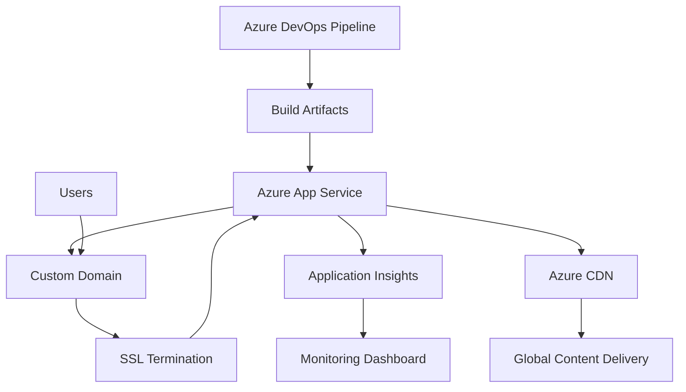

## Azure App Service Setup

Azure App Service provides a fully managed platform for hosting web applications, including static documentation sites generated by DocFX. This guide covers comprehensive setup for production-ready documentation hosting with scalability, security, and monitoring capabilities.

## Prerequisites

Before setting up Azure App Service, ensure you have:

- Azure subscription with appropriate permissions
- Resource group created or planned
- Azure CLI installed and authenticated
- Domain name registered (for custom domains)
- SSL certificate or plan for managed certificates

## Planning and Architecture

### Resource Planning

**Naming Conventions:**

```text
Resource Naming Pattern: {project}-{environment}-{service}-{region}
├── docs-dev-app-eastus          # Development App Service
├── docs-prod-app-eastus         # Production App Service
├── docs-dev-plan-eastus         # Development App Service Plan
├── docs-prod-plan-eastus        # Production App Service Plan
├── docs-insights-eastus         # Application Insights
└── docs-shared-rg-eastus        # Shared Resource Group
```

**Environment Strategy:**

| Environment | Purpose | Configuration | Scaling |
|-------------|---------|---------------|---------|
| **Development** | Testing and staging | Basic tier, manual scaling | 1 instance |
| **Production** | Live documentation | Standard/Premium tier, auto-scaling | 2-10 instances |
| **Preview** | Pull request previews | Shared with development | On-demand |

### Architecture Overview



## Resource Group Setup

### Creating Resource Groups

**Development Environment:**

```bash
# Create development resource group
az group create \
  --name "docs-dev-rg-eastus" \
  --location "eastus" \
  --tags "Environment=Development" "Project=Documentation" "Owner=DevOps"
```

**Production Environment:**

```bash
# Create production resource group
az group create \
  --name "docs-prod-rg-eastus" \
  --location "eastus" \
  --tags "Environment=Production" "Project=Documentation" "Owner=DevOps"
```

### Resource Group Configuration

**Governance Settings:**

```json
{
  "properties": {
    "tags": {
      "Environment": "Production",
      "Project": "Documentation",
      "Owner": "DevOps Team",
      "CostCenter": "IT-Documentation",
      "CreatedDate": "2025-07-06"
    }
  },
  "location": "eastus"
}
```

## App Service Plan Configuration

### Plan Creation

**Development Plan:**

```bash
# Create development App Service Plan
az appservice plan create \
  --name "docs-dev-plan-eastus" \
  --resource-group "docs-dev-rg-eastus" \
  --location "eastus" \
  --sku "B1" \
  --is-linux false \
  --tags "Environment=Development"
```

**Production Plan:**

```bash
# Create production App Service Plan
az appservice plan create \
  --name "docs-prod-plan-eastus" \
  --resource-group "docs-prod-rg-eastus" \
  --location "eastus" \
  --sku "S1" \
  --is-linux false \
  --tags "Environment=Production"
```

### Scaling Configuration

**Auto-scaling Rules:**

```json
{
  "profiles": [
    {
      "name": "Default",
      "capacity": {
        "minimum": "2",
        "maximum": "10",
        "default": "2"
      },
      "rules": [
        {
          "metricTrigger": {
            "metricName": "CpuPercentage",
            "metricResourceUri": "/subscriptions/{subscription-id}/resourceGroups/{resource-group}/providers/Microsoft.Web/serverfarms/{plan-name}",
            "timeGrain": "PT1M",
            "statistic": "Average",
            "timeWindow": "PT5M",
            "timeAggregation": "Average",
            "operator": "GreaterThan",
            "threshold": 70
          },
          "scaleAction": {
            "direction": "Increase",
            "type": "ChangeCount",
            "value": "1",
            "cooldown": "PT5M"
          }
        },
        {
          "metricTrigger": {
            "metricName": "CpuPercentage",
            "metricResourceUri": "/subscriptions/{subscription-id}/resourceGroups/{resource-group}/providers/Microsoft.Web/serverfarms/{plan-name}",
            "timeGrain": "PT1M",
            "statistic": "Average",
            "timeWindow": "PT10M",
            "timeAggregation": "Average",
            "operator": "LessThan",
            "threshold": 30
          },
          "scaleAction": {
            "direction": "Decrease",
            "type": "ChangeCount",
            "value": "1",
            "cooldown": "PT10M"
          }
        }
      ]
    }
  ]
}
```

## App Service Creation

### Web App Setup

**Development Web App:**

```bash
# Create development web app
az webapp create \
  --name "docs-dev-app-eastus" \
  --resource-group "docs-dev-rg-eastus" \
  --plan "docs-dev-plan-eastus" \
  --runtime "node|18-lts" \
  --tags "Environment=Development"
```

**Production Web App:**

```bash
# Create production web app
az webapp create \
  --name "docs-prod-app-eastus" \
  --resource-group "docs-prod-rg-eastus" \
  --plan "docs-prod-plan-eastus" \
  --runtime "node|18-lts" \
  --tags "Environment=Production"
```

### Application Configuration

**Application Settings:**

```bash
# Configure app settings for production
az webapp config appsettings set \
  --name "docs-prod-app-eastus" \
  --resource-group "docs-prod-rg-eastus" \
  --settings \
    "ENVIRONMENT=Production" \
    "NODE_ENV=production" \
    "WEBSITE_NODE_DEFAULT_VERSION=18" \
    "WEBSITE_RUN_FROM_PACKAGE=1" \
    "SCM_DO_BUILD_DURING_DEPLOYMENT=false"
```

**Connection Strings (if needed):**

```bash
# Add connection strings if required
az webapp config connection-string set \
  --name "docs-prod-app-eastus" \
  --resource-group "docs-prod-rg-eastus" \
  --connection-string-type "Custom" \
  --settings "ApplicationInsights=InstrumentationKey={key}"
```

### Deployment Configuration

**Deployment Source Setup:**

```bash
# Configure deployment from Azure DevOps
az webapp deployment source config \
  --name "docs-prod-app-eastus" \
  --resource-group "docs-prod-rg-eastus" \
  --repo-url "https://dev.azure.com/organization/project/_git/docs" \
  --branch "main" \
  --manual-integration
```

**Deployment Slots (Production Only):**

```bash
# Create staging slot for production
az webapp deployment slot create \
  --name "docs-prod-app-eastus" \
  --resource-group "docs-prod-rg-eastus" \
  --slot "staging"

# Configure slot-specific settings
az webapp config appsettings set \
  --name "docs-prod-app-eastus" \
  --resource-group "docs-prod-rg-eastus" \
  --slot "staging" \
  --settings "ENVIRONMENT=Staging"
```

## Custom Domain Configuration

### Domain Setup

**Add Custom Domain:**

```bash
# Add custom domain to web app
az webapp config hostname add \
  --webapp-name "docs-prod-app-eastus" \
  --resource-group "docs-prod-rg-eastus" \
  --hostname "docs.yourdomain.com"
```

**DNS Configuration:**

```text
# DNS Records Required
docs.yourdomain.com    CNAME    docs-prod-app-eastus.azurewebsites.net
asuid.docs.yourdomain.com    TXT    {verification-id}
```

### SSL Certificate Management

**Managed SSL Certificate:**

```bash
# Create managed SSL certificate
az webapp config ssl create \
  --name "docs-prod-app-eastus" \
  --resource-group "docs-prod-rg-eastus" \
  --hostname "docs.yourdomain.com"

# Bind SSL certificate
az webapp config ssl bind \
  --name "docs-prod-app-eastus" \
  --resource-group "docs-prod-rg-eastus" \
  --certificate-thumbprint "{thumbprint}" \
  --ssl-type "Managed"
```

**Custom SSL Certificate:**

```bash
# Upload custom certificate
az webapp config ssl upload \
  --name "docs-prod-app-eastus" \
  --resource-group "docs-prod-rg-eastus" \
  --certificate-file "certificate.pfx" \
  --certificate-password "{password}"
```

## Security Configuration

### Network Security

**IP Restrictions:**

```json
{
  "ipSecurityRestrictions": [
    {
      "ipAddress": "192.168.1.0/24",
      "action": "Allow",
      "priority": 100,
      "name": "Corporate Network",
      "description": "Allow corporate IP range"
    },
    {
      "ipAddress": "0.0.0.0/0",
      "action": "Deny",
      "priority": 2147483647,
      "name": "Deny All",
      "description": "Deny all other traffic"
    }
  ]
}
```

**Authentication Configuration:**

```bash
# Configure Azure AD authentication (optional)
az webapp auth update \
  --name "docs-prod-app-eastus" \
  --resource-group "docs-prod-rg-eastus" \
  --enabled true \
  --action "LoginWithAzureActiveDirectory" \
  --aad-client-id "{client-id}" \
  --aad-client-secret "{client-secret}" \
  --aad-tenant-id "{tenant-id}"
```

### Security Headers

**Web.config for Security Headers:**

```xml
<?xml version="1.0" encoding="utf-8"?>
<configuration>
  <system.webServer>
    <httpProtocol>
      <customHeaders>
        <add name="X-Content-Type-Options" value="nosniff" />
        <add name="X-Frame-Options" value="DENY" />
        <add name="X-XSS-Protection" value="1; mode=block" />
        <add name="Strict-Transport-Security" value="max-age=31536000; includeSubDomains" />
        <add name="Content-Security-Policy" value="default-src 'self'; script-src 'self' 'unsafe-inline'; style-src 'self' 'unsafe-inline'; img-src 'self' data: https:; font-src 'self' data:" />
        <add name="Referrer-Policy" value="strict-origin-when-cross-origin" />
      </customHeaders>
    </httpProtocol>
    
    <staticContent>
      <mimeMap fileExtension=".json" mimeType="application/json" />
      <mimeMap fileExtension=".woff" mimeType="application/font-woff" />
      <mimeMap fileExtension=".woff2" mimeType="application/font-woff2" />
    </staticContent>
    
    <defaultDocument>
      <files>
        <clear />
        <add value="index.html" />
      </files>
    </defaultDocument>
    
    <rewrite>
      <rules>
        <rule name="HTTPS Redirect" stopProcessing="true">
          <match url="(.*)" />
          <conditions>
            <add input="{HTTPS}" pattern="off" ignoreCase="true" />
          </conditions>
          <action type="Redirect" url="https://{HTTP_HOST}/{R:1}" redirectType="Permanent" />
        </rule>
        
        <rule name="SPA Routes" stopProcessing="true">
          <match url=".*" />
          <conditions logicalGrouping="MatchAll">
            <add input="{REQUEST_FILENAME}" matchType="IsFile" negate="true" />
            <add input="{REQUEST_FILENAME}" matchType="IsDirectory" negate="true" />
            <add input="{REQUEST_URI}" pattern="^/(api)" negate="true" />
          </conditions>
          <action type="Rewrite" url="/index.html" />
        </rule>
      </rules>
    </rewrite>
  </system.webServer>
</configuration>
```

## Monitoring and Diagnostics

### Application Insights Setup

**Create Application Insights:**

```bash
# Create Application Insights instance
az monitor app-insights component create \
  --app "docs-insights-eastus" \
  --location "eastus" \
  --resource-group "docs-prod-rg-eastus" \
  --application-type "web"

# Configure App Service to use Application Insights
az webapp config appsettings set \
  --name "docs-prod-app-eastus" \
  --resource-group "docs-prod-rg-eastus" \
  --settings "APPINSIGHTS_INSTRUMENTATIONKEY={instrumentation-key}"
```

**Custom Telemetry Configuration:**

```javascript
// Custom telemetry for documentation analytics
(function() {
    var appInsights = window.appInsights || function(a) {
        function b(a) { c[a] = function() { var b = arguments; c.queue.push(function() { c[a].apply(c, b) }) } }
        var c = { config: a }, d = document, e = window;
        setTimeout(function() {
            var b = d.createElement("script");
            b.src = a.url || "https://az416426.vo.msecnd.net/scripts/b/ai.2.min.js";
            d.getElementsByTagName("script")[0].parentNode.appendChild(b)
        });
        try { c.cookie = d.cookie } catch (a) { }
        c.queue = [];
        for (var f = ["Event", "PageView", "Exception", "Trace", "DependencyData", "Metric", "PageViewPerformance"]; f.length;)
            b("track" + f.pop());
        if (b("startTrackPage"), b("stopTrackPage"), b("startTrackEvent"), b("stopTrackEvent"), b("addTelemetryInitializer"), b("setAuthenticatedUserContext"), b("clearAuthenticatedUserContext"), b("flush"), c.SeverityLevel = { Verbose: 0, Information: 1, Warning: 2, Error: 3, Critical: 4 }, !(!0 === a.disableExceptionTracking || a.extensionConfig && a.extensionConfig.ApplicationInsightsAnalytics && !0 === a.extensionConfig.ApplicationInsightsAnalytics.disableExceptionTracking)) {
            b("_" + (f = "onerror"));
            var g = e[f];
            e[f] = function(a, b, d, e, h) { var i = g && g(a, b, d, e, h); return !0 !== i && c["_" + f]({ message: a, url: b, lineNumber: d, columnNumber: e, error: h }), i }
        }
        return c
    }({
        instrumentationKey: "{your-instrumentation-key}"
    });

    window.appInsights = appInsights, appInsights.queue && 0 === appInsights.queue.length && appInsights.trackPageView({});

    // Custom documentation analytics
    appInsights.addTelemetryInitializer(function(envelope) {
        envelope.tags["ai.cloud.role"] = "Documentation Site";
        envelope.data.baseData.properties = envelope.data.baseData.properties || {};
        envelope.data.baseData.properties.documentationSection = getDocumentationSection();
        envelope.data.baseData.properties.userAgent = navigator.userAgent;
    });

    function getDocumentationSection() {
        var path = window.location.pathname;
        if (path.includes('/api/')) return 'API Reference';
        if (path.includes('/tutorials/')) return 'Tutorials';
        if (path.includes('/articles/')) return 'Articles';
        if (path.includes('/reference/')) return 'Reference';
        return 'Other';
    }

    // Track search queries
    document.addEventListener('DOMContentLoaded', function() {
        var searchInput = document.querySelector('#search-input');
        if (searchInput) {
            searchInput.addEventListener('input', function(e) {
                if (e.target.value.length > 3) {
                    appInsights.trackEvent('SearchQuery', {
                        query: e.target.value,
                        section: getDocumentationSection()
                    });
                }
            });
        }
    });
})();
```

### Diagnostic Settings

**Enable Diagnostic Logs:**

```bash
# Enable application logs
az webapp log config \
  --name "docs-prod-app-eastus" \
  --resource-group "docs-prod-rg-eastus" \
  --application-logging filesystem \
  --level information \
  --web-server-logging filesystem

# Configure log retention
az webapp log config \
  --name "docs-prod-app-eastus" \
  --resource-group "docs-prod-rg-eastus" \
  --detailed-error-messages true \
  --failed-request-tracing true
```

## Performance Optimization

### CDN Integration

**Azure CDN Setup:**

```bash
# Create CDN profile
az cdn profile create \
  --name "docs-cdn-profile" \
  --resource-group "docs-prod-rg-eastus" \
  --sku "Standard_Microsoft"

# Create CDN endpoint
az cdn endpoint create \
  --name "docs-cdn-endpoint" \
  --profile-name "docs-cdn-profile" \
  --resource-group "docs-prod-rg-eastus" \
  --origin "docs-prod-app-eastus.azurewebsites.net" \
  --origin-host-header "docs-prod-app-eastus.azurewebsites.net"
```

**CDN Rules Configuration:**

```json
{
  "deliveryRules": [
    {
      "name": "CacheStaticAssets",
      "order": 1,
      "conditions": [
        {
          "name": "UrlFileExtension",
          "parameters": {
            "extensions": ["css", "js", "png", "jpg", "jpeg", "gif", "svg", "ico", "woff", "woff2"],
            "operator": "Equal",
            "negateCondition": false,
            "matchValues": []
          }
        }
      ],
      "actions": [
        {
          "name": "CacheExpiration",
          "parameters": {
            "cacheBehavior": "Override",
            "cacheType": "All",
            "cacheDuration": "30.00:00:00"
          }
        }
      ]
    },
    {
      "name": "CacheHTMLFiles",
      "order": 2,
      "conditions": [
        {
          "name": "UrlFileExtension",
          "parameters": {
            "extensions": ["html"],
            "operator": "Equal",
            "negateCondition": false,
            "matchValues": []
          }
        }
      ],
      "actions": [
        {
          "name": "CacheExpiration",
          "parameters": {
            "cacheBehavior": "Override",
            "cacheType": "All",
            "cacheDuration": "01:00:00"
          }
        }
      ]
    }
  ]
}
```

### Compression Configuration

**Enable Compression:**

```bash
# Enable dynamic compression
az webapp config set \
  --name "docs-prod-app-eastus" \
  --resource-group "docs-prod-rg-eastus" \
  --use-32bit-worker-process false \
  --web-sockets-enabled false \
  --always-on true \
  --http20-enabled true
```

## Backup and Recovery

### Backup Configuration

**Automated Backups:**

```bash
# Configure automated backups (Standard tier and above)
az webapp config backup create \
  --resource-group "docs-prod-rg-eastus" \
  --webapp-name "docs-prod-app-eastus" \
  --backup-name "daily-backup" \
  --storage-account-url "https://docsbackup.blob.core.windows.net/backups" \
  --frequency 24 \
  --retain-for-days 30
```

### Disaster Recovery

**Multi-Region Setup:**

```bash
# Create secondary region deployment
az group create \
  --name "docs-prod-rg-westus" \
  --location "westus"

az appservice plan create \
  --name "docs-prod-plan-westus" \
  --resource-group "docs-prod-rg-westus" \
  --location "westus" \
  --sku "S1"

az webapp create \
  --name "docs-prod-app-westus" \
  --resource-group "docs-prod-rg-westus" \
  --plan "docs-prod-plan-westus"
```

## Validation and Testing

### Health Checks

**Application Health Monitoring:**

```bash
# Configure health check endpoint
az webapp config set \
  --name "docs-prod-app-eastus" \
  --resource-group "docs-prod-rg-eastus" \
  --health-check-path "/health"
```

**Health Check Implementation:**

```html
<!-- health.html -->
<!DOCTYPE html>
<html>
<head>
    <title>Health Check</title>
</head>
<body>
    <h1>Service Health: OK</h1>
    <script>
        // Perform health checks
        var healthData = {
            status: "healthy",
            timestamp: new Date().toISOString(),
            checks: {
                "site-load": window.location.href ? "pass" : "fail",
                "search-available": document.querySelector("#search-input") ? "pass" : "fail"
            }
        };
        
        console.log("Health check:", healthData);
    </script>
</body>
</html>
```

### Load Testing

**Azure Load Testing:**

```bash
# Create load test resource
az load create \
  --name "docs-load-test" \
  --resource-group "docs-prod-rg-eastus" \
  --location "eastus"
```

## Troubleshooting

### Common Issues

**Deployment Failures:**

```bash
# Check deployment logs
az webapp log download \
  --name "docs-prod-app-eastus" \
  --resource-group "docs-prod-rg-eastus"

# Check application logs
az webapp log tail \
  --name "docs-prod-app-eastus" \
  --resource-group "docs-prod-rg-eastus"
```

**Performance Issues:**

```bash
# Check app service metrics
az monitor metrics list \
  --resource "/subscriptions/{sub-id}/resourceGroups/docs-prod-rg-eastus/providers/Microsoft.Web/sites/docs-prod-app-eastus" \
  --metric "CpuPercentage,MemoryPercentage,HttpResponseTime"
```

### Diagnostic Commands

```bash
# App Service diagnostics
az webapp show \
  --name "docs-prod-app-eastus" \
  --resource-group "docs-prod-rg-eastus"

# Check SSL certificate status
az webapp config ssl list \
  --resource-group "docs-prod-rg-eastus"

# Validate custom domain
az webapp config hostname list \
  --webapp-name "docs-prod-app-eastus" \
  --resource-group "docs-prod-rg-eastus"
```

## Next Steps

After setting up Azure App Service:

1. **[Configure CI/CD Pipeline](cicd-pipeline.md)** - Automate deployment from Azure DevOps
2. **[Monitoring and Analytics](../deployment/monitoring.md)** - Set up comprehensive monitoring
3. **[Performance Optimization](../advanced/performance.md)** - Optimize for speed and scale
4. **[Security Hardening](../advanced/security.md)** - Implement advanced security measures

## Additional Resources

- [Azure App Service Documentation](https://docs.microsoft.com/en-us/azure/app-service/index.md)
- [App Service Security](https://docs.microsoft.com/en-us/azure/app-service/security-recommendations)
- [Application Insights](https://docs.microsoft.com/en-us/azure/azure-monitor/app/app-insights-overview)
- [Azure CDN Documentation](https://docs.microsoft.com/en-us/azure/cdn/index.md)

---

*This Azure App Service setup provides enterprise-grade hosting for documentation sites with comprehensive security, monitoring, and performance optimization capabilities.*
