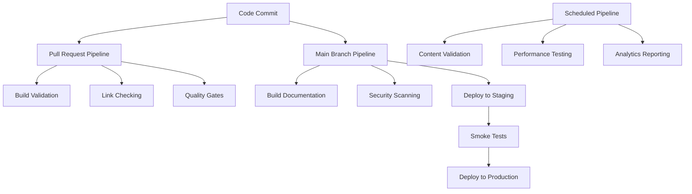

## CI/CD Pipeline Setup

Azure Pipelines provide powerful automation capabilities for Documentation as Code workflows. This guide covers comprehensive pipeline configuration for building, testing, and deploying documentation sites with quality gates, security scanning, and multi-environment deployment strategies.

## Prerequisites

Before setting up CI/CD pipelines, ensure you have:

- Azure DevOps project with appropriate permissions
- Azure App Service environments configured
- Service connections established
- DocFX project properly configured
- Understanding of YAML pipeline syntax

## Pipeline Strategy

### Pipeline Architecture



### Pipeline Types

| Pipeline Type | Trigger | Purpose | Environments |
|---------------|---------|---------|--------------|
| **Pull Request** | PR creation/update | Validation and quality checks | None (build only) |
| **Main Branch** | Push to main | Full deployment cycle | Staging → Production |
| **Release** | Manual/scheduled | Production deployment | Production only |
| **Maintenance** | Scheduled | Health checks and updates | All environments |

## Service Connections

### Azure Service Connection

**Create Service Principal:**

```bash
# Create service principal for Azure connection
az ad sp create-for-rbac \
  --name "docs-pipeline-sp" \
  --role "Contributor" \
  --scopes "/subscriptions/{subscription-id}/resourceGroups/docs-prod-rg-eastus"
```

**Configure Service Connection in Azure DevOps:**

1. Navigate to **Project Settings** → **Service connections**
2. Click **New service connection** → **Azure Resource Manager**
3. Choose **Service principal (automatic)**
4. Configure connection details:

```yaml
# Service connection configuration
connection_name: "Azure-Documentation-Production"
subscription_id: "{subscription-id}"
subscription_name: "Production Subscription"
resource_group: "docs-prod-rg-eastus"
service_principal:
  application_id: "{app-id}"
  tenant_id: "{tenant-id}"
  service_principal_key: "{secret}"
```

### Repository Service Connection

**Git Repository Access:**

```yaml
# Repository service connection
name: "DocumentationRepository"
type: "Git"
properties:
  url: "https://dev.azure.com/organization/project/_git/docs"
  authentication:
    type: "PersonalAccessToken"
    token: "{pat-token}"
```

## Pull Request Pipeline

### PR Validation Pipeline

**azure-pipelines-pr.yml:**

```yaml
# Pull Request validation pipeline
name: 'Documentation-PR-$(Date:yyyyMMdd)$(Rev:.r)'

trigger: none

pr:
  branches:
    include:
    - main
    - develop
  paths:
    exclude:
    - README.md
    - .gitignore

pool:
  vmImage: 'ubuntu-latest'

variables:
  buildConfiguration: 'Release'
  docfxVersion: '2.75.3'

stages:
- stage: Validation
  displayName: 'Pull Request Validation'
  jobs:
  - job: BuildValidation
    displayName: 'Build and Validate Documentation'
    steps:
    
    - task: UseNode@1
      displayName: 'Setup Node.js'
      inputs:
        version: '18.x'
    
    - task: NuGetCommand@2
      displayName: 'Install DocFX'
      inputs:
        command: 'custom'
        arguments: 'install docfx.console -Version $(docfxVersion) -OutputDirectory packages'
    
    - script: |
        echo "##[section]Validating Markdown files"
        npm install -g markdownlint-cli
        markdownlint content/**/*.md --config .markdownlint.json
      displayName: 'Markdown Validation'
      continueOnError: false
    
    - script: |
        echo "##[section]Checking for broken links"
        npm install -g markdown-link-check
        find content -name "*.md" -exec markdown-link-check {} \;
      displayName: 'Link Validation'
      continueOnError: true
    
    - script: |
        echo "##[section]Building documentation"
        ./packages/docfx.console.$(docfxVersion)/tools/docfx.exe docfx.json
      displayName: 'DocFX Build'
      continueOnError: false
    
    - script: |
        echo "##[section]Validating build output"
        if [ ! -f "_site/index.html" ]; then
          echo "##vso[task.logissue type=error]Build output missing index.html"
          exit 1
        fi
        if [ ! -f "_site/toc.html" ]; then
          echo "##vso[task.logissue type=warning]Build output missing toc.html"
        fi
        echo "Build validation passed"
      displayName: 'Output Validation'
    
    - task: PublishTestResults@2
      displayName: 'Publish Validation Results'
      inputs:
        testResultsFormat: 'JUnit'
        testResultsFiles: '**/validation-results.xml'
        mergeTestResults: true
        failTaskOnFailedTests: true
      condition: always()
    
    - task: PublishBuildArtifacts@1
      displayName: 'Publish Build Artifacts'
      inputs:
        pathToPublish: '_site'
        artifactName: 'documentation-site-pr'
      condition: succeededOrFailed()

  - job: SecurityScan
    displayName: 'Security Scanning'
    dependsOn: BuildValidation
    steps:
    
    - task: CredScan@3
      displayName: 'Credential Scanner'
      inputs:
        toolMajorVersion: 'V2'
        scanFolder: '$(Build.SourcesDirectory)'
        debugMode: false
    
    - script: |
        echo "##[section]Scanning for sensitive information"
        # Custom security scanning
        grep -r -i "password\|secret\|key\|token" content/ --exclude-dir=_site || echo "No sensitive information found"
      displayName: 'Sensitive Information Scan'
    
    - task: PublishSecurityAnalysisLogs@3
      displayName: 'Publish Security Analysis Logs'
      inputs:
        artifactName: 'CodeAnalysisLogs'
        toolLogsNotFoundAction: 'Standard'

  - job: QualityGates
    displayName: 'Quality Gates'
    dependsOn: [BuildValidation, SecurityScan]
    steps:
    
    - script: |
        echo "##[section]Checking documentation coverage"
        # Calculate documentation coverage
        total_files=$(find content -name "*.md" | wc -l)
        documented_files=$(grep -l "^# \|^## " content/**/*.md | wc -l)
        coverage=$((documented_files * 100 / total_files))
        echo "Documentation coverage: $coverage%"
        
        if [ $coverage -lt 80 ]; then
          echo "##vso[task.logissue type=warning]Documentation coverage below 80%"
        fi
      displayName: 'Documentation Coverage Check'
    
    - script: |
        echo "##[section]Validating content freshness"
        # Check for outdated content
        find content -name "*.md" -mtime +90 -exec echo "Warning: {} not updated in 90+ days" \;
      displayName: 'Content Freshness Check'
```

### PR Comment Integration

**PR Comments Script:**

```yaml
- task: PowerShell@2
  displayName: 'Update PR with Build Status'
  inputs:
    targetType: 'inline'
    script: |
      $headers = @{
        'Authorization' = "Bearer $(System.AccessToken)"
        'Content-Type' = 'application/json'
      }
      
      $comment = @{
        status = "completed"
        state = "succeeded"
        description = "Documentation build and validation completed successfully"
        targetUrl = "$(System.CollectionUri)$(System.TeamProject)/_build/results?buildId=$(Build.BuildId)"
      } | ConvertTo-Json
      
      $uri = "$(System.CollectionUri)$(System.TeamProject)/_apis/git/repositories/$(Build.Repository.ID)/pullRequests/$(System.PullRequest.PullRequestId)/statuses?api-version=6.0"
      
      try {
        Invoke-RestMethod -Uri $uri -Method Post -Body $comment -Headers $headers
        Write-Host "##[section]PR status updated successfully"
      }
      catch {
        Write-Warning "##[warning]Failed to update PR status: $($_.Exception.Message)"
      }
  condition: always()
  env:
    SYSTEM_ACCESSTOKEN: $(System.AccessToken)
```

## Main Branch Pipeline

### Production Deployment Pipeline

**azure-pipelines-main.yml:**

```yaml
# Main branch deployment pipeline
name: 'Documentation-Main-$(Date:yyyyMMdd)$(Rev:.r)'

trigger:
  branches:
    include:
    - main
  paths:
    exclude:
    - README.md
    - .gitignore
    - docs/**.md

pool:
  vmImage: 'ubuntu-latest'

variables:
  buildConfiguration: 'Release'
  docfxVersion: '2.75.3'
  azureSubscription: 'Azure-Documentation-Production'
  stagingAppName: 'docs-prod-app-eastus'
  productionAppName: 'docs-prod-app-eastus'
  resourceGroupName: 'docs-prod-rg-eastus'

stages:
- stage: Build
  displayName: 'Build Documentation'
  jobs:
  - job: BuildDocs
    displayName: 'Build Documentation Site'
    steps:
    
    - task: UseNode@1
      displayName: 'Setup Node.js'
      inputs:
        version: '18.x'
    
    - task: Cache@2
      displayName: 'Cache DocFX'
      inputs:
        key: 'docfx | $(docfxVersion)'
        path: 'packages'
        cacheHitVar: 'CACHE_RESTORED'
    
    - task: NuGetCommand@2
      displayName: 'Install DocFX'
      inputs:
        command: 'custom'
        arguments: 'install docfx.console -Version $(docfxVersion) -OutputDirectory packages'
      condition: ne(variables.CACHE_RESTORED, 'true')
    
    - script: |
        echo "##[section]Building documentation with DocFX"
        ./packages/docfx.console.$(docfxVersion)/tools/docfx.exe docfx.json --logLevel Verbose
      displayName: 'Build Documentation'
    
    - script: |
        echo "##[section]Optimizing assets"
        # Minify CSS and JavaScript
        npm install -g clean-css-cli uglify-js
        find _site -name "*.css" -exec cleancss -o {} {} \;
        find _site -name "*.js" -not -path "*/node_modules/*" -exec uglifyjs {} -c -m -o {} \;
        
        # Optimize images
        npm install -g imagemin-cli imagemin-mozjpeg imagemin-pngquant
        imagemin "_site/images/*.{jpg,png}" --out-dir="_site/images" --plugin=mozjpeg --plugin=pngquant
      displayName: 'Asset Optimization'
    
    - script: |
        echo "##[section]Generating sitemap"
        npm install -g sitemap-generator-cli
        sitemap-generator https://docs.yourdomain.com --save _site/sitemap.xml --priority-map "1.0,0.8,0.6"
      displayName: 'Generate Sitemap'
    
    - task: PublishBuildArtifacts@1
      displayName: 'Publish Documentation Artifacts'
      inputs:
        pathToPublish: '_site'
        artifactName: 'documentation-site'

- stage: SecurityScan
  displayName: 'Security Scanning'
  dependsOn: Build
  jobs:
  - job: SecurityAnalysis
    displayName: 'Security Analysis'
    steps:
    
    - download: current
      artifact: 'documentation-site'
    
    - task: WhiteSource@21
      displayName: 'WhiteSource Security Scan'
      inputs:
        cwd: '$(Pipeline.Workspace)/documentation-site'
        productName: 'Documentation'
        projectName: 'Documentation-Main'
    
    - script: |
        echo "##[section]Scanning for security vulnerabilities"
        # Check for mixed content
        grep -r "http://" $(Pipeline.Workspace)/documentation-site/ && echo "##vso[task.logissue type=warning]Mixed content detected" || echo "No mixed content found"
        
        # Check for exposed sensitive data
        grep -r -E "(api[_-]?key|password|secret|token)" $(Pipeline.Workspace)/documentation-site/ && echo "##vso[task.logissue type=error]Potential sensitive data exposed" || echo "No sensitive data found"
      displayName: 'Custom Security Checks'

- stage: Deploy_Staging
  displayName: 'Deploy to Staging'
  dependsOn: [Build, SecurityScan]
  condition: succeeded()
  jobs:
  - deployment: DeployStaging
    displayName: 'Deploy to Staging Environment'
    environment: 'Documentation-Staging'
    strategy:
      runOnce:
        deploy:
          steps:
          
          - download: current
            artifact: 'documentation-site'
          
          - task: AzureWebApp@1
            displayName: 'Deploy to Staging Slot'
            inputs:
              azureSubscription: '$(azureSubscription)'
              appType: 'webApp'
              appName: '$(stagingAppName)'
              slotName: 'staging'
              package: '$(Pipeline.Workspace)/documentation-site'
              deploymentMethod: 'zipDeploy'
          
          - task: AzureAppServiceManage@0
            displayName: 'Start Staging Slot'
            inputs:
              azureSubscription: '$(azureSubscription)'
              action: 'Start Azure App Service'
              webAppName: '$(stagingAppName)'
              specifySlotOrASE: true
              slot: 'staging'

- stage: Testing
  displayName: 'Staging Tests'
  dependsOn: Deploy_Staging
  jobs:
  - job: SmokeTests
    displayName: 'Smoke Tests'
    steps:
    
    - script: |
        echo "##[section]Running smoke tests against staging"
        staging_url="https://$(stagingAppName)-staging.azurewebsites.net"
        
        # Test homepage
        response=$(curl -s -o /dev/null -w "%{http_code}" "$staging_url")
        if [ "$response" != "200" ]; then
          echo "##vso[task.logissue type=error]Homepage test failed: HTTP $response"
          exit 1
        fi
        
        # Test search functionality
        search_response=$(curl -s -o /dev/null -w "%{http_code}" "$staging_url/search.html")
        if [ "$search_response" != "200" ]; then
          echo "##vso[task.logissue type=warning]Search page test failed: HTTP $search_response"
        fi
        
        # Test API documentation
        api_response=$(curl -s -o /dev/null -w "%{http_code}" "$staging_url/api/")
        if [ "$api_response" != "200" ]; then
          echo "##vso[task.logissue type=warning]API documentation test failed: HTTP $api_response"
        fi
        
        echo "Smoke tests completed successfully"
      displayName: 'Smoke Tests'
  
  - job: PerformanceTests
    displayName: 'Performance Tests'
    steps:
    
    - script: |
        echo "##[section]Running performance tests"
        npm install -g lighthouse-ci
        
        staging_url="https://$(stagingAppName)-staging.azurewebsites.net"
        
        # Run Lighthouse audit
        lhci autorun --upload.target=temporary-public-storage --collect.url="$staging_url"
      displayName: 'Lighthouse Performance Audit'

- stage: Deploy_Production
  displayName: 'Deploy to Production'
  dependsOn: Testing
  condition: succeeded()
  jobs:
  - deployment: DeployProduction
    displayName: 'Deploy to Production Environment'
    environment: 'Documentation-Production'
    strategy:
      runOnce:
        deploy:
          steps:
          
          - download: current
            artifact: 'documentation-site'
          
          - task: AzureWebApp@1
            displayName: 'Deploy to Production'
            inputs:
              azureSubscription: '$(azureSubscription)'
              appType: 'webApp'
              appName: '$(productionAppName)'
              package: '$(Pipeline.Workspace)/documentation-site'
              deploymentMethod: 'zipDeploy'
          
          - task: AzureAppServiceManage@0
            displayName: 'Restart Production App'
            inputs:
              azureSubscription: '$(azureSubscription)'
              action: 'Restart Azure App Service'
              webAppName: '$(productionAppName)'
          
          - script: |
            echo "##[section]Post-deployment validation"
            production_url="https://docs.yourdomain.com"
            
            # Wait for deployment to be ready
            sleep 30
            
            # Validate deployment
            response=$(curl -s -o /dev/null -w "%{http_code}" "$production_url")
            if [ "$response" != "200" ]; then
              echo "##vso[task.logissue type=error]Production deployment validation failed: HTTP $response"
              exit 1
            fi
            
            echo "Production deployment validated successfully"
          displayName: 'Validate Production Deployment'

- stage: PostDeployment
  displayName: 'Post-Deployment Tasks'
  dependsOn: Deploy_Production
  jobs:
  - job: CacheWarming
    displayName: 'Cache Warming'
    steps:
    
    - script: |
        echo "##[section]Warming up caches"
        production_url="https://docs.yourdomain.com"
        
        # Warm up key pages
        curl -s "$production_url" > /dev/null
        curl -s "$production_url/api/" > /dev/null
        curl -s "$production_url/articles/" > /dev/null
        curl -s "$production_url/tutorials/" > /dev/null
        
        echo "Cache warming completed"
      displayName: 'Warm Up Caches'
  
  - job: Notifications
    displayName: 'Send Notifications'
    steps:
    
    - task: PowerShell@2
      displayName: 'Send Teams Notification'
      inputs:
        targetType: 'inline'
        script: |
          $webhook = "$(TeamsWebhookUrl)"
          $message = @{
            "@type" = "MessageCard"
            "@context" = "https://schema.org/extensions"
            summary = "Documentation Deployment Completed"
            themeColor = "00FF00"
            sections = @(
              @{
                activityTitle = "Documentation Site Updated"
                activitySubtitle = "Build $(Build.BuildNumber) deployed successfully"
                facts = @(
                  @{ name = "Environment"; value = "Production" }
                  @{ name = "Build"; value = "$(Build.BuildNumber)" }
                  @{ name = "Commit"; value = "$(Build.SourceVersion)" }
                  @{ name = "Triggered by"; value = "$(Build.RequestedFor)" }
                )
              }
            )
            potentialAction = @(
              @{
                "@type" = "OpenUri"
                name = "View Documentation"
                targets = @(
                  @{ os = "default"; uri = "https://docs.yourdomain.com" }
                )
              }
            )
          } | ConvertTo-Json -Depth 10
          
          try {
            Invoke-RestMethod -Uri $webhook -Method Post -Body $message -ContentType 'application/json'
            Write-Host "##[section]Notification sent successfully"
          }
          catch {
            Write-Warning "##[warning]Failed to send notification: $($_.Exception.Message)"
          }
      condition: always()
```

## Maintenance Pipeline

### Scheduled Maintenance

**azure-pipelines-maintenance.yml:**

```yaml
# Scheduled maintenance pipeline
name: 'Documentation-Maintenance-$(Date:yyyyMMdd)'

trigger: none

schedules:
- cron: "0 2 * * 0"
  displayName: Weekly maintenance
  branches:
    include:
    - main
  always: true

pool:
  vmImage: 'ubuntu-latest'

jobs:
- job: HealthCheck
  displayName: 'Documentation Health Check'
  steps:
  
  - script: |
      echo "##[section]Comprehensive link checking"
      npm install -g markdown-link-check
      
      # Check all markdown files
      find content -name "*.md" -exec markdown-link-check --config .mlc-config.json {} \; > link-check-results.txt
      
      # Report broken links
      broken_links=$(grep -c "ERROR" link-check-results.txt || echo "0")
      if [ "$broken_links" -gt "0" ]; then
        echo "##vso[task.logissue type=warning]Found $broken_links broken links"
        grep "ERROR" link-check-results.txt
      fi
    displayName: 'Link Health Check'
  
  - script: |
      echo "##[section]Content freshness analysis"
      
      # Find stale content
      find content -name "*.md" -mtime +180 -exec echo "Stale content: {}" \;
      
      # Find missing metadata
      grep -L "^---" content/**/*.md | head -10
    displayName: 'Content Analysis'

- job: SecurityScan
  displayName: 'Security Scan'
  steps:
  
  - script: |
      echo "##[section]Dependency vulnerability scan"
      npm audit --audit-level high
      
      # Check for outdated packages
      npm outdated
    displayName: 'Dependency Security Scan'

- job: PerformanceAudit
  displayName: 'Performance Audit'
  steps:
  
  - script: |
      echo "##[section]Performance audit"
      npm install -g lighthouse-ci
      
      # Run performance audit
      lhci autorun --collect.url="https://docs.yourdomain.com"
    displayName: 'Lighthouse Audit'

- job: Analytics
  displayName: 'Analytics Report'
  steps:
  
  - task: PowerShell@2
    displayName: 'Generate Analytics Report'
    inputs:
      targetType: 'inline'
      script: |
        # Generate weekly analytics report
        $report = @{
          date = Get-Date -Format "yyyy-MM-dd"
          metrics = @{
            # Add Application Insights queries here
          }
        }
        
        Write-Host "##[section]Weekly analytics report generated"
```

## Advanced Pipeline Features

### Matrix Builds

**Multi-environment Testing:**

```yaml
strategy:
  matrix:
    Windows:
      imageName: 'windows-latest'
      docfxCommand: 'packages\docfx.console.$(docfxVersion)\tools\docfx.exe'
    Linux:
      imageName: 'ubuntu-latest'
      docfxCommand: './packages/docfx.console.$(docfxVersion)/tools/docfx'
    macOS:
      imageName: 'macOS-latest'
      docfxCommand: './packages/docfx.console.$(docfxVersion)/tools/docfx'

pool:
  vmImage: $(imageName)
```

### Conditional Deployments

**Environment-based Conditions:**

```yaml
- stage: Deploy_Development
  condition: and(succeeded(), eq(variables['Build.SourceBranch'], 'refs/heads/develop'))
  
- stage: Deploy_Production
  condition: and(succeeded(), eq(variables['Build.SourceBranch'], 'refs/heads/main'))
```

### Variable Groups

**Shared Configuration:**

```yaml
variables:
- group: 'Documentation-Shared'
- group: 'Documentation-Production'
- name: 'buildConfiguration'
  value: 'Release'
```

## Pipeline Templates

### Reusable Build Template

**templates/build-docs.yml:**

```yaml
parameters:
- name: environment
  type: string
- name: docfxVersion
  type: string
  default: '2.75.3'

steps:
- task: UseNode@1
  displayName: 'Setup Node.js'
  inputs:
    version: '18.x'

- task: NuGetCommand@2
  displayName: 'Install DocFX'
  inputs:
    command: 'custom'
    arguments: 'install docfx.console -Version ${{ parameters.docfxVersion }} -OutputDirectory packages'

- script: |
    echo "##[section]Building for ${{ parameters.environment }}"
    ./packages/docfx.console.${{ parameters.docfxVersion }}/tools/docfx.exe docfx.json
  displayName: 'Build Documentation'

- task: PublishBuildArtifacts@1
  displayName: 'Publish Artifacts'
  inputs:
    pathToPublish: '_site'
    artifactName: 'documentation-${{ parameters.environment }}'
```

**Using the Template:**

```yaml
steps:
- template: templates/build-docs.yml
  parameters:
    environment: 'production'
    docfxVersion: '2.75.3'
```

## Monitoring and Alerts

### Pipeline Health Monitoring

**Pipeline Health Dashboard:**

```yaml
# Add to pipeline variables
variables:
  - name: 'dashboardId'
    value: 'docs-pipeline-health'
```

**Alert Configuration:**

```json
{
  "alertRules": [
    {
      "name": "Pipeline Failure Alert",
      "condition": "Build.Result eq 'Failed'",
      "actions": [
        {
          "type": "email",
          "recipients": ["devops-team@organization.com"]
        },
        {
          "type": "teams",
          "webhook": "$(TeamsWebhookUrl)"
        }
      ]
    }
  ]
}
```

## Troubleshooting

### Common Pipeline Issues

**Build Failures:**

```yaml
- script: |
    echo "##[section]Diagnostic information"
    echo "DocFX version: $(docfxVersion)"
    echo "Build configuration: $(buildConfiguration)"
    echo "Source branch: $(Build.SourceBranch)"
    ls -la packages/
    cat docfx.json
  displayName: 'Diagnostic Information'
  condition: failed()
```

**Deployment Issues:**

```yaml
- script: |
    echo "##[section]Deployment diagnostics"
    az webapp log tail --name $(appName) --resource-group $(resourceGroupName)
  displayName: 'Check Deployment Logs'
  condition: failed()
```

## Next Steps

After setting up CI/CD pipelines:

1. **[Content Strategy](../content/content-strategy.md)** - Plan your documentation content approach
2. **[Team Training](../advanced/team-training.md)** - Train team members on the new workflow
3. **[Monitoring Setup](../deployment/monitoring.md)** - Implement comprehensive monitoring
4. **[Performance Optimization](../advanced/performance.md)** - Optimize build and deployment performance

## Additional Resources

- [Azure Pipelines Documentation](https://docs.microsoft.com/en-us/azure/devops/pipelines/)
- [YAML Schema Reference](https://docs.microsoft.com/en-us/azure/devops/pipelines/yaml-schema)
- [Pipeline Templates](https://docs.microsoft.com/en-us/azure/devops/pipelines/process/templates)
- [Deployment Strategies](https://docs.microsoft.com/en-us/azure/devops/pipelines/process/deployment-jobs)

---

*This CI/CD pipeline setup provides comprehensive automation for Documentation as Code with quality gates, security scanning, and production-ready deployment strategies.*
