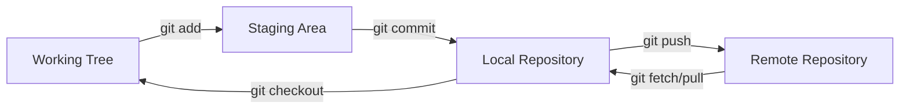
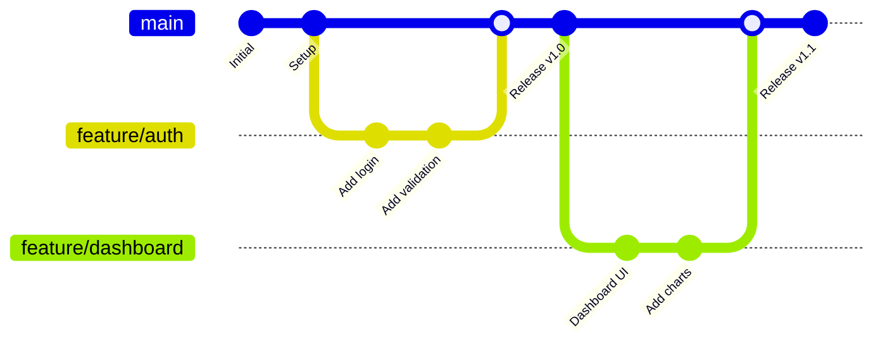

# Git Version Control: Complete Getting Started Guide

Git is the world's most widely used distributed version control system, enabling efficient collaboration, code tracking, and project management across software development teams. This comprehensive guide provides essential knowledge for understanding Git fundamentals, implementing effective workflows, and mastering core operations.

## Git Fundamentals

### Core Concepts

Git operates on a distributed model where every working directory contains a complete repository with full history and version tracking capabilities¹. Understanding the three-tree architecture is fundamental to effective Git usage:

- **Working Tree**: Your current project files where you make changes
- **Staging Area (Index)**: Intermediate area for preparing commits  
- **Repository**: Complete version history with all commits, branches, and metadata

### The Git Workflow Model



This workflow ensures controlled, trackable changes through distinct stages:

1. **Modify**: Edit files in your working tree
2. **Stage**: Add changes to the staging area with `git add`
3. **Commit**: Snapshot staged changes to the repository with `git commit`
4. **Synchronize**: Share changes with remote repositories using `git push/pull`

## Essential Git Operations

### Repository Initialization and Cloning

#### Creating New Repositories

```bash
# Initialize new repository in current directory
git init

# Initialize with specific branch name
git init --initial-branch=main

# Initialize bare repository (server-side)
git init --bare project.git
```

#### Cloning Existing Repositories

```bash
# Clone repository with full history
git clone https://github.com/user/repository.git

# Clone specific branch
git clone -b feature-branch https://github.com/user/repository.git

# Shallow clone (limited history for faster downloads)
git clone --depth 1 https://github.com/user/repository.git
```

### Core Workflow Commands

#### Checking Repository Status

```bash
# Show working tree status
git status

# Concise status output
git status --short

# Show status with branch tracking information
git status --branch
```

#### Staging Changes

```bash
# Stage specific file
git add filename.txt

# Stage all changes in current directory
git add .

# Stage all tracked files
git add -u

# Interactive staging (selective change staging)
git add -p
```

#### Creating Commits

```bash
# Commit staged changes with message
git commit -m "Add user authentication feature"

# Commit all tracked changes (skip staging)
git commit -a -m "Update documentation"

# Amend last commit (add changes or update message)
git commit --amend

# Create signed commit
git commit -S -m "Secure feature implementation"
```

## Professional Git Workflows

### Feature Branch Workflow

The feature branch workflow isolates development work and enables parallel development without affecting the main codebase²:

```bash
# 1. Update main branch
git switch main
git pull origin main

# 2. Create feature branch
git switch -c feature/user-dashboard

# 3. Develop feature with multiple commits
git add src/dashboard.js
git commit -m "Add dashboard component structure"

git add tests/dashboard.test.js  
git commit -m "Add dashboard component tests"

# 4. Push feature branch
git push -u origin feature/user-dashboard

# 5. Create pull request (via GitHub/GitLab interface)
# 6. After review, merge to main
```

### Git Flow Visualization



## Advanced Git Operations

### Branch Management

#### Branch Operations

```bash
# List all branches
git branch -a

# Create new branch
git branch feature/new-feature

# Switch branches (modern syntax)
git switch main
git switch -c hotfix/security-fix

# Delete merged branch
git branch -d feature/completed-feature

# Delete remote branch
git push origin --delete feature/old-feature
```

#### Remote Branch Management

```bash
# Fetch remote changes without merging
git fetch origin

# List remote branches
git branch -r

# Track remote branch
git switch -c local-branch origin/remote-branch

# Push local branch to remote
git push -u origin feature/new-feature
```

### History and Inspection

#### Viewing Commit History

```bash
# View commit history
git log --oneline --graph --all

# Search commits by content
git log -S "function_name" -p

# View commits by specific author
git log --author="John Doe" --since="2 weeks ago"

# Show file change history
git log --follow filename.txt
```

#### Examining Changes

```bash
# Show unstaged changes
git diff

# Show staged changes
git diff --cached

# Compare branches
git diff main..feature-branch

# Word-level diff for better readability
git diff --word-diff
```

### Repository Maintenance

#### Cleanup Operations

```bash
# Start automated maintenance
git maintenance start

# Manual garbage collection
git gc

# Clean untracked files (preview)
git clean -n

# Clean untracked files (execute)
git clean -f
```

#### Recovery Operations

```bash
# View reference log (recent HEAD movements)
git reflog

# Recover lost commit
git reflog  # Find commit hash
git switch -c recovery-branch abc1234

# Recover deleted branch
git reflog  # Find branch tip commit
git switch -c recovered-branch def5678
```

## Git Configuration and Optimization

### Essential Configuration

#### User Identity Setup

```bash
# Set global user information
git config --global user.name "Your Name"
git config --global user.email "your.email@example.com"

# Configure for specific repository
git config user.email "work.email@company.com"
```

#### Helpful Aliases

```bash
# Command shortcuts
git config --global alias.st status
git config --global alias.co checkout
git config --global alias.br branch
git config --global alias.sw switch

# Complex operations
git config --global alias.unstage 'reset HEAD --'
git config --global alias.tree 'log --graph --oneline --all'
git config --global alias.cleanup 'branch --merged | grep -v "\*\|main" | xargs -n 1 git branch -d'
```

#### Performance Optimizations

```bash
# Enable file system monitoring (Windows/macOS)
git config --global core.fsmonitor true

# Optimize for large repositories
git config --global pack.threads 0
git config --global pack.windowMemory 256m
```

### Security Configuration

#### Commit Signing Setup

```bash
# Configure GPG signing
git config --global commit.gpgsign true
git config --global user.signingkey [KEY-ID]

# SSH signing (Git 2.34+)
git config --global gpg.format ssh
git config --global user.signingkey ~/.ssh/id_ed25519.pub
```

## Troubleshooting Common Issues

### Workflow Problem Resolution

#### Merge Conflicts

When Git cannot automatically merge changes, manual resolution is required:

```bash
# After encountering merge conflict
git status  # Shows conflicted files

# Edit files to resolve conflicts (look for <<<<<<< markers)
# Stage resolved files
git add resolved-file.txt

# Complete merge
git commit -m "Resolve merge conflict in user authentication"
```

#### Divergent Branch Resolution

```bash
# When local and remote branches have diverged
git fetch origin
git rebase origin/main  # Replay local commits on top of remote

# Alternative: merge approach
git merge origin/main

# Push after resolution
git push origin feature-branch
```

#### Accidental Commits

```bash
# Undo last commit (keep changes)
git reset --soft HEAD~1

# Undo last commit (discard changes)
git reset --hard HEAD~1

# Move commits to new branch
git switch -c correct-branch
git switch main
git reset --hard HEAD~3  # Remove last 3 commits
```

### Authentication Issues

#### Credential Management

```bash
# Clear stored credentials
git config --global --unset credential.helper

# Configure credential helper (Windows)
git config --global credential.helper manager-core

# Configure credential helper (macOS)
git config --global credential.helper osxkeychain

# Test authentication
git ls-remote origin
```

## Integration with Development Platforms

### GitHub Integration

```bash
# Set up GitHub CLI for enhanced workflow
gh auth login
gh repo create new-project --public
gh pr create --title "Feature: User Dashboard"
```

### Platform-Specific Commands

```bash
# Clone with GitHub CLI
gh repo clone owner/repository

# Azure DevOps integration
git remote add origin https://dev.azure.com/org/project/_git/repository

# GitLab specific operations  
git push -o merge_request.create origin feature-branch
```

## Best Practices and Guidelines

### Commit Best Practices

1. **Atomic commits**: Each commit should represent a single logical change
2. **Descriptive messages**: Use clear, imperative mood commit messages
3. **Conventional commits**: Follow structured commit message format³
4. **Regular commits**: Commit frequently with small, focused changes

#### Commit Message Format

```text
type(scope): brief description

Longer explanation of the change, including motivation
and contrast with previous behavior.

- Bullet points for multiple changes
- Reference issue numbers: Fixes #123
```

### Branch Management Guidelines

1. **Descriptive names**: Use clear, purpose-driven branch names
2. **Short-lived branches**: Merge feature branches promptly
3. **Clean history**: Remove merged branches regularly
4. **Protection rules**: Implement branch protection for critical branches

### Repository Organization

1. **Meaningful .gitignore**: Exclude build artifacts, dependencies, and sensitive files
2. **Documentation**: Maintain clear README and contributing guidelines
3. **Consistent structure**: Follow established project organization patterns
4. **Regular maintenance**: Perform cleanup operations periodically

## Performance Optimization

### Large Repository Strategies

```bash
# Partial clone (Git 2.19+)
git clone --filter=blob:none <url>

# Shallow clone for CI/CD
git clone --depth 1 <url>

# Enable file system monitoring
git config core.fsmonitor true
git config core.untrackedCache true
```

### Network Optimization

```bash
# Configure transfer optimizations
git config --global pack.compression 9
git config --global pack.threads 0

# Enable delta compression
git config --global pack.deltaCacheSize 256m
```

---

## Footnotes and References

¹ **Distributed Version Control**: Chacon, S., & Straub, B. (2014). *Pro Git - Getting Started - About Version Control*. Available at: [Pro Git Version Control](https://git-scm.com/book/en/v2/Getting-Started-About-Version-Control)

² **Feature Branch Workflow**: Atlassian. (2024). *Git Feature Branch Workflow*. Available at: [Feature Branch Workflow](https://www.atlassian.com/git/tutorials/comparing-workflows/feature-branch-workflow)

³ **Conventional Commits**: Conventional Commits Contributors. (2024). *Conventional Commits Specification*. Available at: [Conventional Commits](https://www.conventionalcommits.org/)

⁴ **Git Performance**: Git Development Community. (2024). *Git Performance Tips*. Available at: [Git Performance](https://git-scm.com/docs/git-config#_performance)

⁵ **Git Security**: GitHub, Inc. (2024). *Git Security Best Practices*. Available at: [Git Security](https://docs.github.com/en/authentication/keeping-your-account-and-data-secure)

## Additional Resources

### Official Documentation

- [Git Reference Manual](https://git-scm.com/docs) - Complete command reference
- [Pro Git Book](https://git-scm.com/book) - Comprehensive Git guide  
- [Git Tutorial](https://git-scm.com/docs/gittutorial) - Official beginner tutorial
- [Git Workflow Guide](https://git-scm.com/docs/gitworkflows) - Workflow recommendations

### Interactive Learning

- [Learn Git Branching](https://learngitbranching.js.org/) - Visual Git learning tool
- [GitHub Learning Lab](https://lab.github.com/) - Hands-on Git courses
- [Atlassian Git Tutorials](https://www.atlassian.com/git/tutorials) - Comprehensive tutorials
- [Git Immersion](https://gitimmersion.com/) - Step-by-step Git workshop

### Advanced Topics

- [Git Internals](https://git-scm.com/book/en/v2/Git-Internals-Plumbing-and-Porcelain) - Internal Git mechanics
- [Git Hooks](https://git-scm.com/book/en/v2/Customizing-Git-Git-Hooks) - Automation and validation
- [Git Large File Storage](https://git-lfs.github.io/) - Managing large files
- [Git Security](https://git-scm.com/book/en/v2/Git-Tools-Signing-Your-Work) - Signing and verification

### Platform Integration

- [GitHub Documentation](https://docs.github.com/) - GitHub-specific features
- [GitLab CI/CD](https://docs.gitlab.com/ee/ci/) - GitLab integration
- [Azure DevOps Git](https://docs.microsoft.com/en-us/azure/devops/repos/git/) - Azure DevOps workflows
- [Bitbucket Pipelines](https://support.atlassian.com/bitbucket-cloud/docs/get-started-with-bitbucket-pipelines/) - Bitbucket CI/CD

### Community Resources

- [Stack Overflow Git Tag](https://stackoverflow.com/questions/tagged/git) - Community Q&A
- [Git Users Mailing List](https://git-scm.com/community) - Official community support
- [r/git Subreddit](https://www.reddit.com/r/git/) - Reddit community discussions
- [Git Tips and Tricks](https://github.blog/) - GitHub engineering blog
