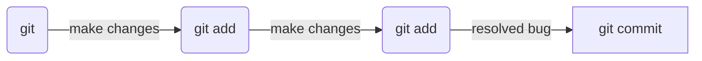
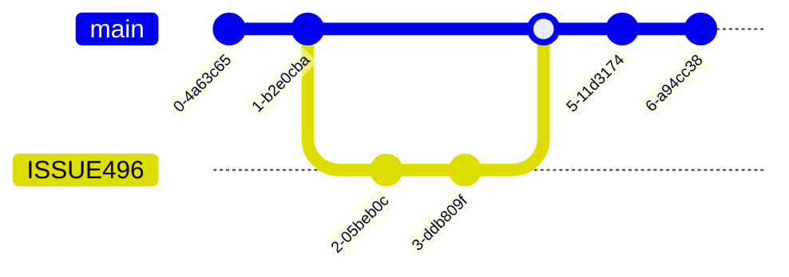

# Git

## Concept

Below is a simplified example of a workflow.

A working tree is created by initializing a directory (`git init`) or by cloning an existing repository (`git clone "path/to/repository"`). Work is then done with the files in the working tree to create a feature or resolve a bug.

At a significant point in the work, add your changes to the **index** (`git add <file name>`). Once all of the changes to create the feature or resolve the bug are added to the **index**, the changes are committed to the repository (`git commit -m "commit message"`).



## Workflow

Generally, the workflow follows these steps:

1. **Get the latest copy of main/master:**

    ```bash
    git pull
    ```

2. **Create and switch to a feature branch:**

    ```bash
    git branch <branch-name>
    git switch <branch-name>
    ```

3. **Make changes, stage, and commit:**

    ```bash
    git add .
    git commit -m "<message describing change>"
    ```

4. **Push changes to the remote branch (create it if needed):**

    ```bash
    git push
    # or
    git push --set-upstream origin <branch-name>
    ```

5. **Create a Pull Request in GitHub or Azure DevOps. Approval will merge the changes into main/master.**



## Snippets

### Alias

```bash
git config --global alias.stash 'stash --all'
git config --global alias.bb '!script.sh'
```

### Logs

```bash
git log --oneline
git log -S files -p
```

### Diff

```bash
git diff
git diff --word-diff
```

### Commits

```bash
git commit -m "Commit message"
git commit -a -m "Commit message"
git commit --amend
```

Creating commits signed by GPG:

```bash
git config gpg.format ssh
git config user.signingkey ~/.ssh/key.pub
```

### Maintenance

```bash
git maintenance start
```

### Recover lost commit

```bash
git reflog  # copy the commit hash before the action that deleted it
git branch <new-branch-name> <commit-hash>
```

### Recover lost branch

```bash
git reflog  # copy the commit hash before the action that deleted it
git branch <branch-name> <commit-hash>
```

### Workflow Summary

```bash
git clone <repo>
git branch <branch-name>
git switch <branch-name>
# make changes
git add .
git commit -m "<commit message>"
git push --set-upstream origin <branch-name>
git switch main
git merge <branch-name>
```

## References

- [The gitflow workflow - in less than 5 mins](https://www.youtube.com/watch?v=1SXpE08hvGs)
- [Learn Git Rebase in 6 minutes // explained with live animations!](https://youtu.be/f1wnYdLEpgI?si=SXW3BsP7Yqn_AIEd)
- [Git MERGE vs REBASE: The Definitive Guide](https://youtu.be/zOnwgxiC0OA?si=lgOj1H4bT9dzbK5j)
- [Resolve Git MERGE CONFLICTS: The Definitive Guide](https://youtu.be/Sqsz1-o7nXk?si=acwzXMaLEvkYE-do)

## Notes

### Workflow path and getting out of trouble

**Typical feature branch workflow:**

```text
git branch feature > git switch feature > (make changes) > git add . > git commit -m 'commit message' > git push > git switch main > git merge feature
```

**If you have a merge conflict:**

```text
# Edit the conflicted file(s)
git add .
git commit -m 'resolve merge conflict'
```

**If you get a divergent branch error:**

```text
git switch feature
git rebase main
git switch main
git merge feature
```
