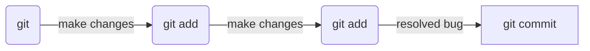
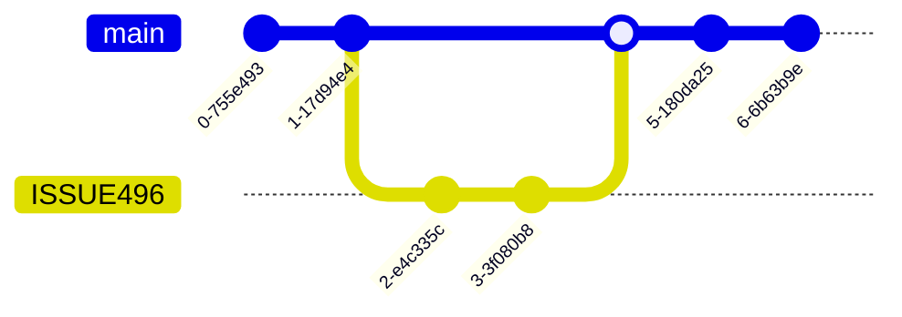

# Git

---

## Concept

Below is simplified example of a workflow.

A working tree is created by initializing a directory (git init) or by cloing an exiting repository (git clone "path/to/repository"). Work is then done with the files in the working tree to create a feature or resolve a bug.

At a signigicant point in the work, add your changes to the ***index*** (git add "file name"). Once all of the changes to create the feature or resolve the bug added to the ***index***, the changes are commited to the repository (git commit -m "commit message").



## Workflow

Generally, the workflow follows the following steps:

- Get the latest copy of main/master

```bash
git pull 
```

- Create an issue/feature branch and switch to that branch

```bash
git branch <name>
git switch <name>
```

- Make whatever changes you intend to make. Stage changes an make commits as needed.

```bash
git add *
git commit -m "<message describing change>"
```

- Push changes to the origin branch. You must create the origin branch if it doesn't already exist.

```bash
git push

# or

git push --set-upstream origin
```

- Create a Pull Request in GitHub or ADO. Approval of this PR will merge the changes with main/master.



## Snippets

### Alias

```bash
git config –global alias.stash ‘stash --all’
git config –global alias.bb !script.sh
```

### Logs

```bash
git log --oneline
git log -S files -p
```

### Diff

```bash
git diff
git diff --word-diff
```

### Commits

```bash
git commit -m "Commit message"
git commit -a -m "Commit message"
git --amend 
```

Createing commits signed by GPG

```bash
git config gpg.format ssh
git config user.signingkey ~/.ssh/key.pub
```

### Maintenance

```bash
git maintenance start
```

### Recover lost commit

```bash
git reflog * copy the commit hash before the action that deleted
git branch <branch name> <commit hash>  * branch name = new branch name, commit hash = past commit hash from previous step
```

### Recover lost branch

```bash
git reflog * copy the commit hash before the action that deleted
git branch <branch name> <commit hash>  * branch name = branch name that was deleted, commit hash = past commit hash from previous step
```

### Workflow Summary

```bash
git clone <repo>
git branch <branch name>
git switch <branch name>
<do stuff>
git add *
git commit -m “<commit message>”
git push --set-upsteam origin <branch name>
git switch main
git merge <branch name>
```

## References

[The gitflow workflow - in less than 5 mins](https://www.youtube.com/watch?v=1SXpE08hvGs)
[Learn Git Rebase in 6 minutes // explained with live animations!](https://youtu.be/f1wnYdLEpgI?si=SXW3BsP7Yqn_AIEd)
[Git MERGE vs REBASE: The Definitive Guide](https://youtu.be/zOnwgxiC0OA?si=lgOj1H4bT9dzbK5j)
[Resolve Git MERGE CONFLICTS: The Definitive Guide](https://youtu.be/Sqsz1-o7nXk?si=acwzXMaLEvkYE-do)

## Notes

### Workflow path and getting out of trouble

```text
git branch feature > git switch feature > (make changes) > git add * > git commit -m 'commit message' > git push > git switch main > git merge feature
```

```text
# if merge confict 
-> (edit confict file) -> git add * -> git commit -m 'commit message'
```

```text
if divergent branch error
-> git switch feature -> git rebase main -> git switch main -> git merge feature
```
