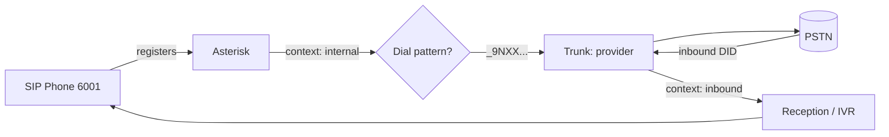

## Endpoints and Trunks

An Asterisk PBX has two kinds of PJSIP peers: **endpoints** (the phones your users register) and **trunks** (connections to a telephony provider that carry calls to and from the public network). This page shows how to configure both and route calls between them.

### SIP Phones (User Endpoints)

Each phone registers to Asterisk with credentials. See [Configuration](configuration.md) for the `endpoint` + `auth` + `aor` pattern; a phone entry looks like:

```ini
; pjsip.conf
[6001](endpoint-internal)
auth = 6001
aors = 6001

[6001]
type = auth
auth_type = userpass
username = 6001
password = a-long-random-secret

[6001](aor-internal)
```

On the phone/softphone, configure:

| Setting | Value |
| ------- | ----- |
| SIP server / domain | Asterisk host or IP |
| Port | 5060 (UDP/TCP) or 5061 (TLS) |
| Username / Auth name | `6001` |
| Password | the `auth` secret |
| Transport | UDP, TCP, or TLS (match a `transport` in `pjsip.conf`) |

Verify registration:

```text
asterisk*CLI> pjsip show endpoint 6001
asterisk*CLI> pjsip show aor 6001        ; shows the registered Contact (IP:port)
asterisk*CLI> pjsip show contacts
```

### Provider Trunks (ITSP)

A trunk connects Asterisk to an Internet Telephony Service Provider so you can call the PSTN. There are two common authentication models:

- **Registration-based** — Asterisk registers to the provider with a username/password (typical for small deployments and dynamic IPs).
- **IP-authenticated** — the provider recognizes your static IP; no registration (common for larger/static setups).

#### Registration-Based Trunk

```ini
; pjsip.conf

[provider]
type = endpoint
context = inbound                 ; calls FROM the provider enter this context
transport = transport-udp
disallow = all
allow = ulaw
allow = alaw
outbound_auth = provider-auth
aors = provider
from_user = 15555551234
from_domain = sip.provider.example
direct_media = no
rtp_symmetric = yes
force_rport = yes
rewrite_contact = yes

[provider-auth]
type = auth
auth_type = userpass
username = your-sip-username
password = your-sip-password

[provider]
type = aor
contact = sip:sip.provider.example:5060

[provider-reg]
type = registration
transport = transport-udp
outbound_auth = provider-auth
server_uri = sip:sip.provider.example
client_uri = sip:15555551234@sip.provider.example
retry_interval = 60

; Match inbound calls from the provider to the "provider" endpoint by IP/host
[provider]
type = identify
endpoint = provider
match = sip.provider.example
```

> [!NOTE]
> The multiple `[provider]` blocks are different **types** (`endpoint`, `aor`, `identify`) that Asterisk merges by name — this is normal PJSIP style. The `identify` section is important: it maps incoming calls from the provider's IP to the `provider` endpoint so they land in the right context.

Check the trunk registered:

```text
asterisk*CLI> pjsip show registrations
asterisk*CLI> pjsip show endpoint provider
```

### Outbound Routing (Internal → PSTN)

In the dialplan, send matching numbers out the trunk. Keep outbound logic in the **internal** context only — never in an inbound/untrusted context:

```ini
; extensions.conf
[internal]
; 9 + 10-digit North American number
exten => _9NXXNXXXXXX,1,NoOp(Outbound to ${EXTEN:1})
 same => n,Set(CALLERID(num)=15555551234)          ; DID the provider expects
 same => n,Dial(PJSIP/${EXTEN:1}@provider,60)
 same => n,Hangup()

; 911 / emergency — route explicitly and test it
exten => 911,1,Dial(PJSIP/911@provider)
 same => n,Hangup()
```

`PJSIP/<number>@<endpoint>` dials `<number>` through the named trunk endpoint. `${EXTEN:1}` strips the leading `9`.

### Inbound Routing (PSTN → Extension)

Calls arriving on the trunk enter the trunk's `context` (`inbound`). Route the provider's DID (the number they deliver) to an extension, an IVR, or a queue:

```ini
; extensions.conf
[inbound]
; The provider delivers calls to DID 15555551234
exten => 15555551234,1,NoOp(Inbound call for main line)
 same => n,Answer()
 same => n,Goto(reception,s,1)

; Fallback for any other delivered number
exten => _X.,1,Goto(reception,s,1)

[reception]
exten => s,1,Background(main-greeting)
 same => n,WaitExten(8)
exten => 0,1,Dial(PJSIP/6001,20)        ; press 0 for reception
exten => t,1,Dial(PJSIP/6001,20)        ; timeout -> reception
 same => n,Voicemail(6001@default,u)
 same => n,Hangup()
```

> [!IMPORTANT]
> The inbound context must **never** be able to reach outbound-dialing extensions, or an attacker who calls in could dial out at your expense. Keep `[inbound]` limited to internal destinations (extensions, IVR, voicemail) and put all trunk-dialing patterns in trusted internal contexts. This context isolation is a core [toll-fraud](security.md) defense.

### Call Flow Summary



## Navigation

[◄ Dialplan](dialplan.md) · [Asterisk Overview](index.md) · [Queues and IVR ►](queues-ivr.md)
