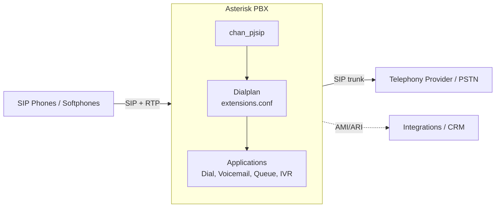

## Asterisk PBX

[Asterisk](https://www.asterisk.org/) is a free, open-source framework for building communications applications — most commonly a **PBX** (Private Branch Exchange) for Voice over IP (VoIP) telephony. Maintained by Sangoma, it turns a server into a phone system that can register SIP phones, connect to telephone-service providers, route calls, run voicemail and IVR menus, bridge conferences, and much more.

This guide focuses on running Asterisk in **containers** with Docker, covering deployment, PJSIP configuration, the dialplan, SIP endpoints and provider trunks, security (toll-fraud prevention, TLS/SRTP), monitoring, and production best practices.

> [!IMPORTANT]
> Telephony is a prime target for **toll fraud** — attackers who compromise a PBX can place expensive calls at your expense. Never expose Asterisk to the internet without the hardening in [Security](security.md). Treat a public-facing PBX as a high-value asset.

### Versions and Editions

| Track | Notes |
| ----- | ----- |
| **Asterisk 20 (LTS)** | Long-Term Support release — the recommended default for new production systems; security fixes through ~2027. |
| **Asterisk 22 (Standard)** | Newest standard release with the latest features; shorter support window. |
| **Certified Asterisk** | Commercially supported, extra-stability builds from Sangoma. |
| **FreePBX / distros** | Web GUI (FreePBX) layered on top of Asterisk for admins who prefer not to edit config files by hand. |

> [!NOTE]
> Use the modern **PJSIP** channel driver (`chan_pjsip`) throughout this guide. The legacy `chan_sip` driver is deprecated and was **removed in Asterisk 21**, so any current configuration should be PJSIP-based.

### Core Concepts

| Concept | Meaning |
| ------- | ------- |
| **Channel** | A single call leg — a connection between Asterisk and an endpoint (a phone, a trunk). Identified like `PJSIP/6001-00000001`. |
| **Endpoint** | A configured SIP entity (a desk phone, softphone, or trunk) defined in `pjsip.conf`. |
| **Dialplan** | The call-routing logic in `extensions.conf` — what Asterisk does when a call enters a *context*. |
| **Context** | A named grouping of dialplan rules that provides isolation between, for example, internal users and inbound provider calls. |
| **Trunk** | A connection to a telephone-service provider (ITSP) that carries calls to/from the PSTN. |
| **AOR** | "Address of Record" — where a PJSIP endpoint can be reached (its registered contacts). |
| **AMI / ARI** | The Asterisk Manager Interface (TCP control/events) and Asterisk REST Interface (HTTP/WebSocket API) for integrations. |

### Architecture

Signaling uses **SIP** (default UDP/TCP 5060, TLS 5061); the actual audio flows separately as **RTP** over a UDP port range (default 10000–20000). Both must be reachable, which makes networking — especially NAT — the trickiest part of a container deployment (see [Installation](installation.md) and [Best Practices](best-practices.md)).

### In This Section

- [Installation and Deployment](installation.md) — running Asterisk with Docker, config volumes, and the SIP/RTP networking model
- [Configuration](configuration.md) — core config files and PJSIP transports, endpoints, auth, and AORs
- [Dialplan](dialplan.md) — call routing in `extensions.conf` — contexts, extensions, applications, and patterns
- [Endpoints and Trunks](endpoints-trunks.md) — registering SIP phones and connecting provider trunks with inbound/outbound routing
- [Queues and IVR](queues-ivr.md) — building auto-attendant menus and ACD call queues with agent management
- [Security](security.md) — toll-fraud prevention, TLS/SRTP, ACLs, fail2ban, and securing AMI/ARI
- [Monitoring and Troubleshooting](monitoring.md) — the Asterisk CLI, logging, CDR/CEL, and diagnosing SIP/RTP issues
- [Best Practices](best-practices.md) — NAT and RTP handling, codecs, high availability, and backups

### Resources

- [Asterisk Documentation](https://docs.asterisk.org/)
- [Asterisk PJSIP Configuration Reference](https://docs.asterisk.org/Configuration/Channel-Drivers/SIP/Configuring-res_pjsip/)
- [Asterisk Dialplan Applications](https://docs.asterisk.org/Latest_API/API_Documentation/Dialplan_Applications/)
- [Asterisk Community](https://community.asterisk.org/)
- [Asterisk GitHub](https://github.com/asterisk/asterisk)

### Related Topics

- [Docker](../docker/index.md)
- [TLS / Let's Encrypt (for SIP-TLS certificates)](../../../security/certificates/acme/index.md)
- [Networking and Firewalls](../../networking/firewalls.md)
