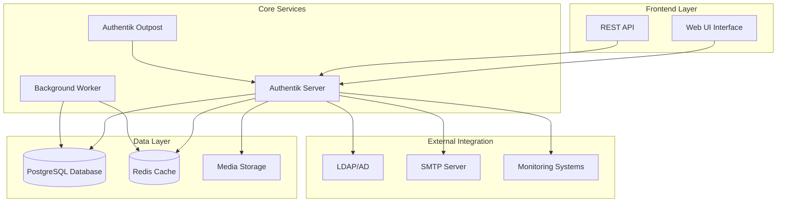

## Architecture and Components

### Core Components Overview

Authentik follows a microservices architecture designed for scalability and maintainability in containerized environments.

#### Component Architecture



#### Component Details

| Component | Purpose | Scaling Considerations |
| --------- | ------- | ---------------------- |
| **Authentik Server** | Main application logic and API | Stateless - horizontal scaling |
| **Worker** | Background tasks and jobs | Multiple workers for performance |
| **Outpost** | Proxy and LDAP services | Deploy near applications |
| **PostgreSQL** | Primary data storage | High availability cluster |
| **Redis** | Session and cache storage | Cluster mode for redundancy |
| **Web UI** | Administrative interface | Served by main server |

### Deployment Patterns

#### Single Instance Deployment

```yaml
# Basic single-instance deployment
version: '3.8'
services:
  authentik-server:
    image: ghcr.io/goauthentik/server:latest
    ports:
      - "9000:9000"
      - "9443:9443"
    environment:
      AUTHENTIK_SECRET_KEY: "your-secret-key-here"
      AUTHENTIK_ERROR_REPORTING__ENABLED: "false"
      AUTHENTIK_POSTGRESQL__HOST: postgres
      AUTHENTIK_POSTGRESQL__USER: authentik
      AUTHENTIK_POSTGRESQL__NAME: authentik
      AUTHENTIK_POSTGRESQL__PASSWORD: your-password
      AUTHENTIK_REDIS__HOST: redis
    depends_on:
      - postgres
      - redis
    
  authentik-worker:
    image: ghcr.io/goauthentik/server:latest
    command: worker
    environment:
      AUTHENTIK_SECRET_KEY: "your-secret-key-here"
      AUTHENTIK_ERROR_REPORTING__ENABLED: "false"
      AUTHENTIK_POSTGRESQL__HOST: postgres
      AUTHENTIK_POSTGRESQL__USER: authentik
      AUTHENTIK_POSTGRESQL__NAME: authentik
      AUTHENTIK_POSTGRESQL__PASSWORD: your-password
      AUTHENTIK_REDIS__HOST: redis
    depends_on:
      - postgres
      - redis
    
  postgres:
    image: postgres:15-alpine
    environment:
      POSTGRES_PASSWORD: your-password
      POSTGRES_USER: authentik
      POSTGRES_DB: authentik
    volumes:
      - database:/var/lib/postgresql/data
    
  redis:
    image: redis:alpine
    command: --save 60 1 --loglevel warning
    volumes:
      - redis:/data

volumes:
  database:
  redis:
```

#### High Availability Deployment

```yaml
# High availability deployment with multiple instances
version: '3.8'
services:
  authentik-server:
    image: ghcr.io/goauthentik/server:latest
    deploy:
      replicas: 3
      update_config:
        parallelism: 1
        delay: 10s
      restart_policy:
        condition: on-failure
    ports:
      - "9000:9000"
      - "9443:9443"
    environment:
      AUTHENTIK_SECRET_KEY: "your-secret-key-here"
      AUTHENTIK_ERROR_REPORTING__ENABLED: "false"
      AUTHENTIK_POSTGRESQL__HOST: postgres-cluster
      AUTHENTIK_POSTGRESQL__USER: authentik
      AUTHENTIK_POSTGRESQL__NAME: authentik
      AUTHENTIK_POSTGRESQL__PASSWORD: your-password
      AUTHENTIK_REDIS__HOST: redis-cluster
      AUTHENTIK_LOG_LEVEL: info
    healthcheck:
      test: ["CMD", "ak", "healthcheck"]
      interval: 30s
      timeout: 10s
      retries: 3
    
  authentik-worker:
    image: ghcr.io/goauthentik/server:latest
    command: worker
    deploy:
      replicas: 2
    environment:
      AUTHENTIK_SECRET_KEY: "your-secret-key-here"
      AUTHENTIK_ERROR_REPORTING__ENABLED: "false"
      AUTHENTIK_POSTGRESQL__HOST: postgres-cluster
      AUTHENTIK_POSTGRESQL__USER: authentik
      AUTHENTIK_POSTGRESQL__NAME: authentik
      AUTHENTIK_POSTGRESQL__PASSWORD: your-password
      AUTHENTIK_REDIS__HOST: redis-cluster
    
  nginx:
    image: nginx:alpine
    ports:
      - "80:80"
      - "443:443"
    volumes:
      - ./nginx.conf:/etc/nginx/nginx.conf:ro
      - ./ssl:/etc/ssl/certs:ro
    depends_on:
      - authentik-server
```

---

## Navigation

[◄ Overview](index.md) · [Authentik Overview](index.md) · [Installation and Deployment ►](installation.md)
