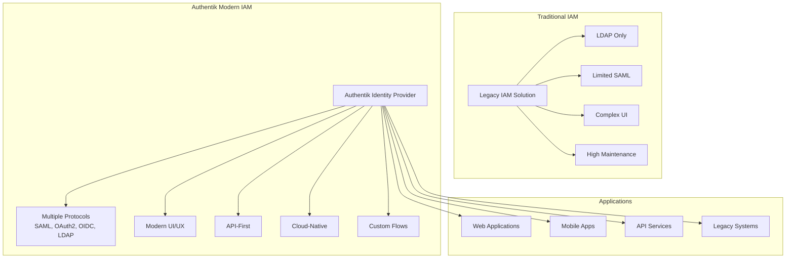
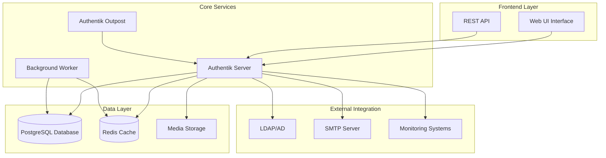

## Table of Contents

- [Overview](#overview)
- [Architecture and Components](#architecture-and-components)
- [Installation and Deployment](#installation-and-deployment)
- [Configuration and Setup](#configuration-and-setup)
- [Authentication Flows](#authentication-flows)
- [Application Integration](#application-integration)
- [User and Group Management](#user-and-group-management)
- [Security and Compliance](#security-and-compliance)
- [Monitoring and Logging](#monitoring-and-logging)
- [Backup and Recovery](#backup-and-recovery)
- [Troubleshooting](#troubleshooting)
- [Enterprise Best Practices](#enterprise-best-practices)
- [Automation and Scripting](#automation-and-scripting)

---

## Overview

**Authentik** is a modern, open-source identity provider (IdP) that provides comprehensive authentication and authorization services for enterprise environments. Built with a cloud-native architecture, Authentik offers advanced features including Single Sign-On (SSO), multi-factor authentication (MFA), user lifecycle management, and extensive protocol support.

### Key Features and Benefits

#### Core Identity Services

| Feature | Description | Enterprise Benefit |
|---------|-------------|-------------------|
| **Single Sign-On (SSO)** | Unified authentication across applications | Improved user experience and security |
| **Multi-Factor Authentication** | TOTP, WebAuthn, SMS, Email | Enhanced security posture |
| **Protocol Support** | SAML 2.0, OAuth2, OIDC, LDAP | Universal application compatibility |
| **User Lifecycle Management** | Automated provisioning and deprovisioning | Reduced administrative overhead |
| **Policy Engine** | Flexible access control policies | Granular security enforcement |
| **Directory Integration** | LDAP, Active Directory sync | Seamless enterprise integration |

#### Modern Architecture Benefits

- ✅ **Cloud-Native Design** - Container-first with Kubernetes support
- ✅ **API-First Architecture** - Comprehensive REST API for automation
- ✅ **Modern UI/UX** - Intuitive administrative interface
- ✅ **High Availability** - Distributed deployment support
- ✅ **Audit and Compliance** - Comprehensive logging and reporting
- ✅ **Extensible Flows** - Custom authentication workflows

### Authentik vs. Traditional Solutions



---

## Architecture and Components

### Core Components Overview

Authentik follows a microservices architecture designed for scalability and maintainability in containerized environments.

#### Component Architecture



#### Component Details

| Component | Purpose | Scaling Considerations |
|-----------|---------|----------------------|
| **Authentik Server** | Main application logic and API | Stateless - horizontal scaling |
| **Worker** | Background tasks and jobs | Multiple workers for performance |
| **Outpost** | Proxy and LDAP services | Deploy near applications |
| **PostgreSQL** | Primary data storage | High availability cluster |
| **Redis** | Session and cache storage | Cluster mode for redundancy |
| **Web UI** | Administrative interface | Served by main server |

### Deployment Patterns

#### Single Instance Deployment

```yaml
# Basic single-instance deployment
version: '3.8'
services:
  authentik-server:
    image: ghcr.io/goauthentik/server:latest
    ports:
      - "9000:9000"
      - "9443:9443"
    environment:
      AUTHENTIK_SECRET_KEY: "your-secret-key-here"
      AUTHENTIK_ERROR_REPORTING__ENABLED: "false"
      AUTHENTIK_POSTGRESQL__HOST: postgres
      AUTHENTIK_POSTGRESQL__USER: authentik
      AUTHENTIK_POSTGRESQL__NAME: authentik
      AUTHENTIK_POSTGRESQL__PASSWORD: your-password
      AUTHENTIK_REDIS__HOST: redis
    depends_on:
      - postgres
      - redis
    
  authentik-worker:
    image: ghcr.io/goauthentik/server:latest
    command: worker
    environment:
      AUTHENTIK_SECRET_KEY: "your-secret-key-here"
      AUTHENTIK_ERROR_REPORTING__ENABLED: "false"
      AUTHENTIK_POSTGRESQL__HOST: postgres
      AUTHENTIK_POSTGRESQL__USER: authentik
      AUTHENTIK_POSTGRESQL__NAME: authentik
      AUTHENTIK_POSTGRESQL__PASSWORD: your-password
      AUTHENTIK_REDIS__HOST: redis
    depends_on:
      - postgres
      - redis
    
  postgres:
    image: postgres:15-alpine
    environment:
      POSTGRES_PASSWORD: your-password
      POSTGRES_USER: authentik
      POSTGRES_DB: authentik
    volumes:
      - database:/var/lib/postgresql/data
    
  redis:
    image: redis:alpine
    command: --save 60 1 --loglevel warning
    volumes:
      - redis:/data

volumes:
  database:
  redis:
```

#### High Availability Deployment

```yaml
# High availability deployment with multiple instances
version: '3.8'
services:
  authentik-server:
    image: ghcr.io/goauthentik/server:latest
    deploy:
      replicas: 3
      update_config:
        parallelism: 1
        delay: 10s
      restart_policy:
        condition: on-failure
    ports:
      - "9000:9000"
      - "9443:9443"
    environment:
      AUTHENTIK_SECRET_KEY: "your-secret-key-here"
      AUTHENTIK_ERROR_REPORTING__ENABLED: "false"
      AUTHENTIK_POSTGRESQL__HOST: postgres-cluster
      AUTHENTIK_POSTGRESQL__USER: authentik
      AUTHENTIK_POSTGRESQL__NAME: authentik
      AUTHENTIK_POSTGRESQL__PASSWORD: your-password
      AUTHENTIK_REDIS__HOST: redis-cluster
      AUTHENTIK_LOG_LEVEL: info
    healthcheck:
      test: ["CMD", "ak", "healthcheck"]
      interval: 30s
      timeout: 10s
      retries: 3
    
  authentik-worker:
    image: ghcr.io/goauthentik/server:latest
    command: worker
    deploy:
      replicas: 2
    environment:
      AUTHENTIK_SECRET_KEY: "your-secret-key-here"
      AUTHENTIK_ERROR_REPORTING__ENABLED: "false"
      AUTHENTIK_POSTGRESQL__HOST: postgres-cluster
      AUTHENTIK_POSTGRESQL__USER: authentik
      AUTHENTIK_POSTGRESQL__NAME: authentik
      AUTHENTIK_POSTGRESQL__PASSWORD: your-password
      AUTHENTIK_REDIS__HOST: redis-cluster
    
  nginx:
    image: nginx:alpine
    ports:
      - "80:80"
      - "443:443"
    volumes:
      - ./nginx.conf:/etc/nginx/nginx.conf:ro
      - ./ssl:/etc/ssl/certs:ro
    depends_on:
      - authentik-server
```

---

## Installation and Deployment

### Prerequisites and Requirements

#### System Requirements

| Component | Minimum | Recommended | Production |
|-----------|---------|-------------|------------|
| **CPU** | 2 cores | 4 cores | 8+ cores |
| **Memory** | 4GB RAM | 8GB RAM | 16+ GB RAM |
| **Storage** | 20GB | 100GB | 500+ GB SSD |
| **Network** | 1 Gbps | 1 Gbps | 10 Gbps |

#### Software Dependencies

- **Container Runtime**: Docker 20.10+ or Podman 3.0+
- **Orchestration**: Docker Compose 2.0+ or Kubernetes 1.21+
- **Database**: PostgreSQL 12+ (13+ recommended)
- **Cache**: Redis 6.0+
- **Reverse Proxy**: Nginx, Traefik, or HAProxy
- **TLS Certificates**: Let's Encrypt or corporate CA

### Docker Compose Deployment

#### Production-Ready Configuration

```yaml
# docker-compose.yml - Production configuration
version: '3.8'

services:
  authentik-server:
    image: ghcr.io/goauthentik/server:2024.2.2
    restart: unless-stopped
    command: server
    ports:
      - "127.0.0.1:9000:9000"
      - "127.0.0.1:9443:9443"
    environment:
      AUTHENTIK_SECRET_KEY: "${AUTHENTIK_SECRET_KEY}"
      AUTHENTIK_ERROR_REPORTING__ENABLED: "false"
      AUTHENTIK_POSTGRESQL__HOST: postgres
      AUTHENTIK_POSTGRESQL__USER: "${POSTGRES_USER:-authentik}"
      AUTHENTIK_POSTGRESQL__NAME: "${POSTGRES_DB:-authentik}"
      AUTHENTIK_POSTGRESQL__PASSWORD: "${POSTGRES_PASSWORD}"
      AUTHENTIK_REDIS__HOST: redis
      AUTHENTIK_LOG_LEVEL: "${AUTHENTIK_LOG_LEVEL:-info}"
      AUTHENTIK_EMAIL__HOST: "${SMTP_HOST}"
      AUTHENTIK_EMAIL__PORT: "${SMTP_PORT:-587}"
      AUTHENTIK_EMAIL__USERNAME: "${SMTP_USERNAME}"
      AUTHENTIK_EMAIL__PASSWORD: "${SMTP_PASSWORD}"
      AUTHENTIK_EMAIL__USE_TLS: "${SMTP_USE_TLS:-true}"
      AUTHENTIK_EMAIL__FROM: "${SMTP_FROM}"
    volumes:
      - ./media:/media
      - ./custom-templates:/templates
    depends_on:
      postgres:
        condition: service_healthy
      redis:
        condition: service_healthy
    networks:
      - authentik
    labels:
      - "traefik.enable=true"
      - "traefik.http.routers.authentik.rule=Host(`auth.example.com`)"
      - "traefik.http.routers.authentik.tls=true"
      - "traefik.http.routers.authentik.tls.certresolver=letsencrypt"
    healthcheck:
      test: ["CMD", "ak", "healthcheck"]
      interval: 30s
      timeout: 10s
      retries: 3
      start_period: 60s

  authentik-worker:
    image: ghcr.io/goauthentik/server:2024.2.2
    restart: unless-stopped
    command: worker
    environment:
      AUTHENTIK_SECRET_KEY: "${AUTHENTIK_SECRET_KEY}"
      AUTHENTIK_ERROR_REPORTING__ENABLED: "false"
      AUTHENTIK_POSTGRESQL__HOST: postgres
      AUTHENTIK_POSTGRESQL__USER: "${POSTGRES_USER:-authentik}"
      AUTHENTIK_POSTGRESQL__NAME: "${POSTGRES_DB:-authentik}"
      AUTHENTIK_POSTGRESQL__PASSWORD: "${POSTGRES_PASSWORD}"
      AUTHENTIK_REDIS__HOST: redis
      AUTHENTIK_LOG_LEVEL: "${AUTHENTIK_LOG_LEVEL:-info}"
      AUTHENTIK_EMAIL__HOST: "${SMTP_HOST}"
      AUTHENTIK_EMAIL__PORT: "${SMTP_PORT:-587}"
      AUTHENTIK_EMAIL__USERNAME: "${SMTP_USERNAME}"
      AUTHENTIK_EMAIL__PASSWORD: "${SMTP_PASSWORD}"
      AUTHENTIK_EMAIL__USE_TLS: "${SMTP_USE_TLS:-true}"
      AUTHENTIK_EMAIL__FROM: "${SMTP_FROM}"
    volumes:
      - ./media:/media
      - ./custom-templates:/templates
    depends_on:
      postgres:
        condition: service_healthy
      redis:
        condition: service_healthy
    networks:
      - authentik

  postgres:
    image: postgres:15-alpine
    restart: unless-stopped
    environment:
      POSTGRES_PASSWORD: "${POSTGRES_PASSWORD}"
      POSTGRES_USER: "${POSTGRES_USER:-authentik}"
      POSTGRES_DB: "${POSTGRES_DB:-authentik}"
      POSTGRES_INITDB_ARGS: "--encoding=UTF-8 --lc-collate=C --lc-ctype=C"
    volumes:
      - postgres_data:/var/lib/postgresql/data
      - ./postgres-init:/docker-entrypoint-initdb.d:ro
    networks:
      - authentik
    healthcheck:
      test: ["CMD-SHELL", "pg_isready -d $${POSTGRES_DB} -U $${POSTGRES_USER}"]
      interval: 10s
      timeout: 5s
      retries: 5
      start_period: 10s
    command: >
      postgres
        -c max_connections=200
        -c shared_buffers=256MB
        -c effective_cache_size=1GB
        -c maintenance_work_mem=64MB
        -c checkpoint_completion_target=0.9
        -c wal_buffers=16MB
        -c default_statistics_target=100
        -c random_page_cost=1.1
        -c effective_io_concurrency=200
        -c work_mem=4MB
        -c min_wal_size=1GB
        -c max_wal_size=4GB

  redis:
    image: redis:7-alpine
    restart: unless-stopped
    command: >
      redis-server
        --appendonly yes
        --maxmemory 256mb
        --maxmemory-policy allkeys-lru
        --save 900 1
        --save 300 10
        --save 60 10000
    volumes:
      - redis_data:/data
    networks:
      - authentik
    healthcheck:
      test: ["CMD", "redis-cli", "ping"]
      interval: 10s
      timeout: 3s
      retries: 5

volumes:
  postgres_data:
    driver: local
  redis_data:
    driver: local

networks:
  authentik:
    driver: bridge
```

#### Environment Configuration

```bash
# .env file for production deployment
# Generate secret key: openssl rand -base64 32
AUTHENTIK_SECRET_KEY=your-generated-secret-key-here

# Database configuration
POSTGRES_USER=authentik
POSTGRES_DB=authentik
POSTGRES_PASSWORD=your-secure-database-password

# Logging
AUTHENTIK_LOG_LEVEL=info

# Email configuration
SMTP_HOST=smtp.example.com
SMTP_PORT=587
SMTP_USERNAME=authentik@example.com
SMTP_PASSWORD=your-smtp-password
SMTP_USE_TLS=true
SMTP_FROM=Authentik <authentik@example.com>

# Domain configuration
AUTHENTIK_DOMAIN=auth.example.com
```

### Kubernetes Deployment

#### Helm Chart Configuration

```yaml
# values.yaml for Helm deployment
authentik:
  secret_key: "your-secret-key"
  log_level: info
  error_reporting:
    enabled: false

server:
  replicas: 3
  image:
    repository: ghcr.io/goauthentik/server
    tag: "2024.2.2"
  
  ingress:
    enabled: true
    hosts:
      - host: auth.example.com
        paths:
          - path: /
            pathType: Prefix
    tls:
      - secretName: authentik-tls
        hosts:
          - auth.example.com

worker:
  replicas: 2
  image:
    repository: ghcr.io/goauthentik/server
    tag: "2024.2.2"

postgresql:
  enabled: true
  auth:
    username: authentik
    database: authentik
    password: "your-database-password"
  primary:
    persistence:
      size: 100Gi
    resources:
      requests:
        memory: "512Mi"
        cpu: "500m"
      limits:
        memory: "1Gi"
        cpu: "1000m"

redis:
  enabled: true
  auth:
    enabled: false
  master:
    persistence:
      size: 10Gi
    resources:
      requests:
        memory: "256Mi"
        cpu: "250m"
      limits:
        memory: "512Mi"
        cpu: "500m"
```

### Installation Scripts

#### Automated Deployment Script

```powershell
function Deploy-Authentik
{
    param(
        [Parameter(Mandatory)]
        [string]$Domain,
        [Parameter(Mandatory)]
        [string]$Email,
        [string]$Environment = "production",
        [string]$DatabasePassword,
        [string]$SecretKey,
        [switch]$UseSSL = $true,
        [switch]$EnableBackups = $true
    )
    
    Write-Host "Deploying Authentik Identity Provider" -ForegroundColor Cyan
    Write-Host "Domain: $Domain" -ForegroundColor Yellow
    Write-Host "Environment: $Environment" -ForegroundColor Yellow
    
    try
    {
        # Generate secure passwords if not provided
        if (-not $DatabasePassword)
        {
            $DatabasePassword = -join ((1..32) | ForEach-Object { [char]((65..90) + (97..122) + (48..57) | Get-Random) })
            Write-Host "Generated database password" -ForegroundColor Green
        }
        
        if (-not $SecretKey)
        {
            $SecretKey = [Convert]::ToBase64String([System.Security.Cryptography.RandomNumberGenerator]::GetBytes(32))
            Write-Host "Generated secret key" -ForegroundColor Green
        }
        
        # Create deployment directory
        $deployPath = "./authentik-deployment"
        if (-not (Test-Path $deployPath))
        {
            New-Item -ItemType Directory -Path $deployPath -Force | Out-Null
            Write-Host "Created deployment directory: $deployPath" -ForegroundColor Green
        }
        
        # Create environment file
        $envContent = @"
# Authentik Environment Configuration
AUTHENTIK_SECRET_KEY=$SecretKey
POSTGRES_USER=authentik
POSTGRES_DB=authentik
POSTGRES_PASSWORD=$DatabasePassword
AUTHENTIK_LOG_LEVEL=info
SMTP_HOST=
SMTP_PORT=587
SMTP_USERNAME=
SMTP_PASSWORD=
SMTP_USE_TLS=true
SMTP_FROM=Authentik <$Email>
AUTHENTIK_DOMAIN=$Domain
"@
        
        $envContent | Out-File -FilePath "$deployPath/.env" -Encoding UTF8
        Write-Host "Created environment configuration" -ForegroundColor Green
        
        # Download docker-compose.yml
        $composeUrl = "https://raw.githubusercontent.com/goauthentik/authentik/main/docker-compose.yml"
        try
        {
            Invoke-WebRequest -Uri $composeUrl -OutFile "$deployPath/docker-compose.yml"
            Write-Host "Downloaded docker-compose.yml" -ForegroundColor Green
        }
        catch
        {
            Write-Warning "Failed to download compose file. Creating basic configuration."
            
            # Create basic compose file
            $composeContent = @"
version: '3.8'
services:
  authentik-server:
    image: ghcr.io/goauthentik/server:latest
    restart: unless-stopped
    command: server
    ports:
      - "9000:9000"
      - "9443:9443"
    environment:
      AUTHENTIK_SECRET_KEY: `${AUTHENTIK_SECRET_KEY}
      AUTHENTIK_POSTGRESQL__HOST: postgres
      AUTHENTIK_POSTGRESQL__USER: `${POSTGRES_USER}
      AUTHENTIK_POSTGRESQL__NAME: `${POSTGRES_DB}
      AUTHENTIK_POSTGRESQL__PASSWORD: `${POSTGRES_PASSWORD}
      AUTHENTIK_REDIS__HOST: redis
    volumes:
      - ./media:/media
    depends_on:
      - postgres
      - redis

  authentik-worker:
    image: ghcr.io/goauthentik/server:latest
    restart: unless-stopped
    command: worker
    environment:
      AUTHENTIK_SECRET_KEY: `${AUTHENTIK_SECRET_KEY}
      AUTHENTIK_POSTGRESQL__HOST: postgres
      AUTHENTIK_POSTGRESQL__USER: `${POSTGRES_USER}
      AUTHENTIK_POSTGRESQL__NAME: `${POSTGRES_DB}
      AUTHENTIK_POSTGRESQL__PASSWORD: `${POSTGRES_PASSWORD}
      AUTHENTIK_REDIS__HOST: redis
    volumes:
      - ./media:/media
    depends_on:
      - postgres
      - redis

  postgres:
    image: postgres:15-alpine
    restart: unless-stopped
    environment:
      POSTGRES_PASSWORD: `${POSTGRES_PASSWORD}
      POSTGRES_USER: `${POSTGRES_USER}
      POSTGRES_DB: `${POSTGRES_DB}
    volumes:
      - postgres_data:/var/lib/postgresql/data

  redis:
    image: redis:alpine
    restart: unless-stopped
    command: --save 60 1 --loglevel warning
    volumes:
      - redis_data:/data

volumes:
  postgres_data:
  redis_data:
"@
            
            $composeContent | Out-File -FilePath "$deployPath/docker-compose.yml" -Encoding UTF8
            Write-Host "Created basic docker-compose.yml" -ForegroundColor Yellow
        }
        
        # Create media directory
        New-Item -ItemType Directory -Path "$deployPath/media" -Force | Out-Null
        
        # Set directory to deployment path
        Push-Location $deployPath
        
        try
        {
            # Pull images
            Write-Host "Pulling Docker images..." -ForegroundColor Yellow
            & docker-compose pull
            
            # Start services
            Write-Host "Starting Authentik services..." -ForegroundColor Yellow
            & docker-compose up -d
            
            # Wait for services to be ready
            Write-Host "Waiting for services to start..." -ForegroundColor Yellow
            Start-Sleep -Seconds 30
            
            # Check service status
            $services = & docker-compose ps --services
            $runningServices = & docker-compose ps --services --filter "status=running"
            
            Write-Host "`nDeployment Status:" -ForegroundColor Green
            Write-Host "  Total services: $($services.Count)" -ForegroundColor White
            Write-Host "  Running services: $($runningServices.Count)" -ForegroundColor White
            
            if ($services.Count -eq $runningServices.Count)
            {
                Write-Host "✓ All services started successfully" -ForegroundColor Green
                
                # Display access information
                Write-Host "`nAuthentik Access Information:" -ForegroundColor Cyan
                Write-Host "  Web Interface: http://localhost:9000" -ForegroundColor White
                Write-Host "  HTTPS Interface: https://localhost:9443" -ForegroundColor White
                
                if ($UseSSL)
                {
                    Write-Host "  Production URL: https://$Domain" -ForegroundColor White
                }
                else
                {
                    Write-Host "  Production URL: http://$Domain" -ForegroundColor White
                }
                
                Write-Host "`nNext Steps:" -ForegroundColor Yellow
                Write-Host "  1. Configure reverse proxy for $Domain" -ForegroundColor White
                Write-Host "  2. Set up SSL certificates" -ForegroundColor White
                Write-Host "  3. Access the web interface and complete initial setup" -ForegroundColor White
                Write-Host "  4. Configure SMTP settings for email" -ForegroundColor White
                Write-Host "  5. Set up your first authentication flow" -ForegroundColor White
                
                if ($EnableBackups)
                {
                    Write-Host "`nBackup Configuration:" -ForegroundColor Cyan
                    Write-Host "  Database backup recommended - configure PostgreSQL backups" -ForegroundColor White
                    Write-Host "  Media folder backup: $deployPath/media" -ForegroundColor White
                }
            }
            else
            {
                Write-Warning "Some services failed to start. Check logs with: docker-compose logs"
                return $false
            }
        }
        finally
        {
            Pop-Location
        }
        
        # Store deployment info
        $deploymentInfo = @{
            Domain = $Domain
            DeploymentPath = $deployPath
            Environment = $Environment
            DatabasePassword = $DatabasePassword
            SecretKey = $SecretKey
            DeploymentTime = Get-Date
        }
        
        return $deploymentInfo
    }
    catch
    {
        Write-Error "Authentik deployment failed: $($_.Exception.Message)"
        return $null
    }
}
```

---

## Configuration and Setup

### Initial Configuration

#### First-Time Setup Process

1. **Access the Web Interface**

   ```bash
   # After deployment, access Authentik
   http://localhost:9000
   # or
   https://your-domain.com
   ```

2. **Initial Admin Account**

   ```bash
   # Get default admin credentials
   docker-compose exec authentik-server ak create_admin_group
   docker-compose exec authentik-server ak create_admin_user
   ```

#### Core Configuration Steps

##### 1. Basic System Settings

```yaml
# System settings configuration
authentik:
  default_user_change_email: true
  default_user_change_name: true
  default_user_change_username: true
  avatars: "gravatar"
  footer_links:
    - name: "Documentation"
      href: "https://docs.goauthentik.io"
  
  # Branding configuration
  ui:
    theme: "automatic"
    locale: "en"
  
  # Security settings
  security:
    secret_key: "your-secret-key"
    csrf:
      trusted_origins:
        - "https://auth.example.com"
```

##### 2. Email Configuration

```yaml
# Email settings for notifications
email:
  host: "smtp.example.com"
  port: 587
  username: "authentik@example.com"
  password: "your-smtp-password"
  use_tls: true
  use_ssl: false
  timeout: 30
  from: "Authentik <authentik@example.com>"
  
  # Email templates
  templates:
    account_confirmation: "email/account_confirmation.html"
    password_reset: "email/password_reset.html"
    invitation: "email/invitation.html"
```

### Advanced Configuration

#### Environment Variables Reference

```bash
# Core Configuration
AUTHENTIK_SECRET_KEY=your-secret-key                    # Required: Encryption key
AUTHENTIK_LOG_LEVEL=info                               # Options: debug, info, warning, error
AUTHENTIK_ERROR_REPORTING__ENABLED=false              # Disable error reporting to Authentik

# Database Configuration
AUTHENTIK_POSTGRESQL__HOST=postgres                    # Database host
AUTHENTIK_POSTGRESQL__PORT=5432                       # Database port
AUTHENTIK_POSTGRESQL__NAME=authentik                  # Database name
AUTHENTIK_POSTGRESQL__USER=authentik                  # Database user
AUTHENTIK_POSTGRESQL__PASSWORD=your-password          # Database password
AUTHENTIK_POSTGRESQL__USE_PGBOUNCER=false            # Enable connection pooling

# Redis Configuration
AUTHENTIK_REDIS__HOST=redis                           # Redis host
AUTHENTIK_REDIS__PORT=6379                           # Redis port
AUTHENTIK_REDIS__DB=0                               # Redis database number
AUTHENTIK_REDIS__PASSWORD=                          # Redis password (if required)

# Email Configuration
AUTHENTIK_EMAIL__HOST=smtp.example.com               # SMTP server
AUTHENTIK_EMAIL__PORT=587                           # SMTP port
AUTHENTIK_EMAIL__USERNAME=authentik@example.com     # SMTP username
AUTHENTIK_EMAIL__PASSWORD=your-smtp-password        # SMTP password
AUTHENTIK_EMAIL__USE_TLS=true                       # Enable TLS
AUTHENTIK_EMAIL__USE_SSL=false                      # Enable SSL
AUTHENTIK_EMAIL__TIMEOUT=10                         # Connection timeout
AUTHENTIK_EMAIL__FROM=Authentik <authentik@example.com>  # From address

# Web Configuration
AUTHENTIK_LISTEN__HTTP=0.0.0.0:9000                # HTTP bind address
AUTHENTIK_LISTEN__HTTPS=0.0.0.0:9443               # HTTPS bind address
AUTHENTIK_LISTEN__METRICS=0.0.0.0:9300             # Metrics bind address
AUTHENTIK_WEB__WORKERS=2                           # Number of web workers

# Security Configuration
AUTHENTIK_COOKIE__DOMAIN=.example.com               # Cookie domain
AUTHENTIK_DISABLE_UPDATE_CHECK=true                # Disable update notifications
AUTHENTIK_AVATARS=gravatar                         # Avatar provider
```

---

## Authentication Flows

Authentik uses a flexible flow system that allows you to customize the authentication experience for different scenarios and applications.

### Flow Types and Configuration

#### Core Flow Types

| Flow Type | Purpose | Use Cases |
|-----------|---------|-----------|
| **Authentication** | User login process | SSO, multi-step authentication |
| **Authorization** | Access control decisions | Policy enforcement, consent |
| **Invalidation** | Session termination | Logout, account suspension |
| **Enrollment** | User registration | Self-service registration |
| **Recovery** | Password reset | Forgotten password recovery |
| **Unenrollment** | Account deletion | GDPR compliance, self-service |

#### Default Authentication Flow

```yaml
# Example authentication flow configuration
name: "default-authentication-flow"
title: "Welcome to Example Corp"
designation: "authentication"
policy_engine_mode: "any"

stages:
  - identification:
      user_fields: ["username", "email"]
      password_fields: ["password"]
      sources: ["internal"]
      
  - password:
      backends: ["internal", "ldap"]
      failed_attempts_before_cancel: 5
      
  - mfa:
      device_classes: ["totp", "webauthn", "sms"]
      configuration_stages: ["mfa-setup"]
      
  - user_login:
      session_duration: "hours=8"
      remember_me_offset: "days=30"
```

### Multi-Factor Authentication Setup

#### TOTP Configuration

```python
# TOTP authenticator configuration
from authentik.stages.authenticator_totp.models import TOTPDevice

# Configure TOTP settings
totp_config = {
    'issuer': 'Example Corp',
    'period': 30,
    'algorithm': 'SHA1',
    'digits': 6,
    'drift': 1
}
```

#### WebAuthn/FIDO2 Setup

```yaml
# WebAuthn stage configuration
webauthn_stage:
  user_verification: "preferred"
  authenticator_attachment: "cross-platform"
  resident_key_requirement: "discouraged"
  allowed_devices:
    - "usb"
    - "nfc"
    - "ble"
    - "internal"
```

### Custom Authentication Flows

#### Enterprise SSO Flow

```yaml
# Enterprise SSO with step-up authentication
enterprise_sso_flow:
  name: "Enterprise SSO"
  stages:
    - ldap_identification:
        sources: ["corporate-ldap"]
        password_backends: ["ldap"]
        
    - password_validation:
        backend: "ldap"
        
    - risk_assessment:
        policies: ["location-based", "device-trust"]
        
    - conditional_mfa:
        conditions:
          - high_risk_score: "required"
          - admin_group: "required"
          - external_network: "required"
          
    - authorization:
        policies: ["group-membership", "time-based"]
        
    - user_login:
        session_duration: "hours=4"
```

---

## Application Integration

### Protocol Support and Implementation

#### SAML 2.0 Integration

```xml
<!-- SAML Service Provider configuration -->
<saml:Provider
    entityID="https://app.example.com"
    protocolSupportEnumeration="urn:oasis:names:tc:SAML:2.0:protocol">
    
    <saml:SPSSODescriptor>
        <saml:AssertionConsumerService
            Binding="urn:oasis:names:tc:SAML:2.0:bindings:HTTP-POST"
            Location="https://app.example.com/saml/acs/"
            index="0" />
            
        <saml:SingleLogoutService
            Binding="urn:oasis:names:tc:SAML:2.0:bindings:HTTP-Redirect"
            Location="https://app.example.com/saml/sls/" />
    </saml:SPSSODescriptor>
</saml:Provider>
```

#### OAuth2/OIDC Configuration

```json
{
  "client_id": "example-app",
  "client_secret": "your-client-secret",
  "authorization_endpoint": "https://auth.example.com/application/o/authorize/",
  "token_endpoint": "https://auth.example.com/application/o/token/",
  "userinfo_endpoint": "https://auth.example.com/application/o/userinfo/",
  "jwks_uri": "https://auth.example.com/application/o/example-app/jwks/",
  "scopes": ["openid", "email", "profile"],
  "response_types": ["code"],
  "grant_types": ["authorization_code", "refresh_token"],
  "redirect_uris": ["https://app.example.com/callback"]
}
```

### Application Templates

#### Grafana Integration

```powershell
function Configure-GrafanaAuthentik
{
    param(
        [Parameter(Mandatory)]
        [string]$GrafanaUrl,
        [Parameter(Mandatory)]
        [string]$AuthentikUrl,
        [string]$ClientId = "grafana",
        [string[]]$AdminGroups = @("grafana-admins")
    )
    
    Write-Host "Configuring Grafana with Authentik OIDC" -ForegroundColor Cyan
    
    # Grafana configuration
    $grafanaConfig = @"
[auth.generic_oauth]
enabled = true
name = Authentik
client_id = $ClientId
client_secret = \$__file{/etc/grafana/oauth_secret}
scopes = openid profile email
auth_url = $AuthentikUrl/application/o/authorize/
token_url = $AuthentikUrl/application/o/token/
api_url = $AuthentikUrl/application/o/userinfo/
allow_sign_up = true
auto_login = false
role_attribute_path = contains(groups[*], 'grafana-admins') && 'Admin' || contains(groups[*], 'grafana-editors') && 'Editor' || 'Viewer'
role_attribute_strict = false
"@
    
    Write-Host "Grafana OAuth configuration:" -ForegroundColor Yellow
    Write-Host $grafanaConfig -ForegroundColor White
    
    return @{
        Config = $grafanaConfig
        ClientId = $ClientId
        RedirectUri = "$GrafanaUrl/login/generic_oauth"
    }
}
```

#### Proxmox Integration

```yaml
# Proxmox OIDC configuration
proxmox_oidc:
  realm: "authentik"
  client_id: "proxmox"
  client_key: "your-client-secret"
  issuer_url: "https://auth.example.com/application/o/proxmox/"
  scopes: "openid profile email"
  username_claim: "preferred_username"
  prompt: "login"
```

---

## User and Group Management

### User Lifecycle Management

#### Automated User Provisioning

```powershell
function New-AuthentikUser
{
    param(
        [Parameter(Mandatory)]
        [string]$Username,
        [Parameter(Mandatory)]
        [string]$Email,
        [string]$FirstName,
        [string]$LastName,
        [string[]]$Groups = @(),
        [string]$AuthentikUrl,
        [string]$ApiToken,
        [switch]$SendWelcomeEmail
    )
    
    $headers = @{
        'Authorization' = "Bearer $ApiToken"
        'Content-Type' = 'application/json'
    }
    
    $userData = @{
        username = $Username
        email = $Email
        first_name = $FirstName
        last_name = $LastName
        is_active = $true
        groups = $Groups
    } | ConvertTo-Json
    
    try
    {
        $response = Invoke-RestMethod -Uri "$AuthentikUrl/api/v3/core/users/" -Method POST -Headers $headers -Body $userData
        
        Write-Host "User created successfully: $Username" -ForegroundColor Green
        
        if ($SendWelcomeEmail)
        {
            # Trigger welcome email
            $emailData = @{
                user = $response.pk
                template = "welcome"
            } | ConvertTo-Json
            
            Invoke-RestMethod -Uri "$AuthentikUrl/api/v3/stages/email/send/" -Method POST -Headers $headers -Body $emailData
            Write-Host "Welcome email sent to $Email" -ForegroundColor Green
        }
        
        return $response
    }
    catch
    {
        Write-Error "Failed to create user: $($_.Exception.Message)"
        return $null
    }
}
```

### Group Management and Policies

#### Dynamic Group Assignment

```python
# Dynamic group assignment based on attributes
group_policies = {
    "developers": {
        "conditions": [
            {"attribute": "department", "value": "Engineering"},
            {"attribute": "job_title", "contains": "Developer"}
        ],
        "permissions": [
            "access_development_apps",
            "code_repository_access"
        ]
    },
    "admins": {
        "conditions": [
            {"attribute": "is_superuser", "value": True}
        ],
        "permissions": [
            "admin_panel_access",
            "user_management",
            "system_configuration"
        ]
    }
}
```

---

## Security and Compliance

### Security Hardening

#### Password Policies

```yaml
# Password policy configuration
password_policy:
  minimum_length: 12
  require_uppercase: true
  require_lowercase: true
  require_numbers: true
  require_symbols: true
  check_common_passwords: true
  check_breach_databases: true
  zxcvbn_score_threshold: 3
  expiration_days: 90
  history_count: 12
```

#### Session Security

```yaml
# Session security configuration
session_security:
  timeout_idle: "hours=2"
  timeout_absolute: "hours=8"
  remember_me_duration: "days=30"
  concurrent_sessions: 3
  ip_binding: true
  secure_cookies: true
  same_site: "Strict"
```

### Audit and Compliance

#### Event Logging Configuration

```powershell
function Enable-AuthentikAuditing
{
    param(
        [string]$LogLevel = "INFO",
        [string[]]$EventTypes = @("login", "logout", "permission_denied", "configuration_change"),
        [string]$SyslogEndpoint,
        [switch]$EnableForensics
    )
    
    $auditConfig = @{
        enabled = $true
        level = $LogLevel
        events = $EventTypes
        retention_days = 365
        export_format = "json"
    }
    
    if ($SyslogEndpoint)
    {
        $auditConfig.syslog = @{
            enabled = $true
            endpoint = $SyslogEndpoint
            facility = "auth"
            format = "rfc5424"
        }
    }
    
    if ($EnableForensics)
    {
        $auditConfig.forensics = @{
            enabled = $true
            integrity_check = $true
            digital_signature = $true
        }
    }
    
    Write-Host "Audit configuration:" -ForegroundColor Yellow
    $auditConfig | ConvertTo-Json -Depth 3
    
    return $auditConfig
}
```

---

## Monitoring and Logging

### Metrics and Monitoring

#### Prometheus Integration

```yaml
# Prometheus metrics configuration
prometheus:
  enabled: true
  endpoint: "/metrics"
  port: 9300
  metrics:
    - authentik_logins_total
    - authentik_failed_logins_total
    - authentik_active_sessions
    - authentik_policy_executions_total
    - authentik_flow_executions_total
```

#### Health Check Monitoring

```powershell
function Test-AuthentikHealth
{
    param(
        [Parameter(Mandatory)]
        [string]$AuthentikUrl,
        [int]$TimeoutSeconds = 30
    )
    
    $healthChecks = @(
        @{ Name = "Web Interface"; Url = "$AuthentikUrl/-/health/live/" }
        @{ Name = "Database"; Url = "$AuthentikUrl/-/health/ready/" }
        @{ Name = "Outpost Connectivity"; Url = "$AuthentikUrl/api/v3/outposts/" }
    )
    
    $results = @()
    
    foreach ($check in $healthChecks)
    {
        try
        {
            $response = Invoke-WebRequest -Uri $check.Url -TimeoutSec $TimeoutSeconds -UseBasicParsing
            $status = if ($response.StatusCode -eq 200) { "Healthy" } else { "Unhealthy" }
            $color = if ($status -eq "Healthy") { "Green" } else { "Red" }
            
            Write-Host "$($check.Name): $status" -ForegroundColor $color
            
            $results += @{
                Component = $check.Name
                Status = $status
                ResponseTime = $response.Headers['X-Response-Time']
                StatusCode = $response.StatusCode
            }
        }
        catch
        {
            Write-Host "$($check.Name): Failed - $($_.Exception.Message)" -ForegroundColor Red
            $results += @{
                Component = $check.Name
                Status = "Failed"
                Error = $_.Exception.Message
            }
        }
    }
    
    return $results
}
```

---

## Backup and Recovery

### Database Backup Strategy

```powershell
function Backup-AuthentikDatabase
{
    param(
        [Parameter(Mandatory)]
        [string]$BackupPath,
        [string]$DatabaseHost = "localhost",
        [string]$DatabaseName = "authentik",
        [string]$DatabaseUser = "authentik",
        [switch]$Compress,
        [int]$RetentionDays = 30
    )
    
    $timestamp = Get-Date -Format "yyyyMMdd_HHmmss"
    $backupFile = "$BackupPath/authentik_backup_$timestamp.sql"
    
    try
    {
        Write-Host "Starting Authentik database backup..." -ForegroundColor Cyan
        
        # Create PostgreSQL dump
        $pgDumpCmd = "pg_dump -h $DatabaseHost -U $DatabaseUser -d $DatabaseName -f $backupFile --verbose"
        
        if ($Compress)
        {
            $backupFile = "$backupFile.gz"
            $pgDumpCmd += " | gzip"
        }
        
        Invoke-Expression $pgDumpCmd
        
        if (Test-Path $backupFile)
        {
            $fileSize = (Get-Item $backupFile).Length / 1MB
            Write-Host "Backup completed: $backupFile ($([math]::Round($fileSize, 2)) MB)" -ForegroundColor Green
            
            # Cleanup old backups
            Get-ChildItem -Path $BackupPath -Filter "authentik_backup_*.sql*" | 
                Where-Object { $_.CreationTime -lt (Get-Date).AddDays(-$RetentionDays) } |
                Remove-Item -Force
            
            Write-Host "Old backups cleaned up (retention: $RetentionDays days)" -ForegroundColor Yellow
            
            return @{
                BackupFile = $backupFile
                Size = $fileSize
                Success = $true
            }
        }
        else
        {
            throw "Backup file not created"
        }
    }
    catch
    {
        Write-Error "Backup failed: $($_.Exception.Message)"
        return @{ Success = $false; Error = $_.Exception.Message }
    }
}
```

### Configuration Backup

```powershell
function Export-AuthentikConfiguration
{
    param(
        [Parameter(Mandatory)]
        [string]$AuthentikUrl,
        [Parameter(Mandatory)]
        [string]$ApiToken,
        [Parameter(Mandatory)]
        [string]$ExportPath
    )
    
    $headers = @{
        'Authorization' = "Bearer $ApiToken"
        'Accept' = 'application/json'
    }
    
    $timestamp = Get-Date -Format "yyyyMMdd_HHmmss"
    $configBackup = @{
        exported_at = Get-Date
        version = "2024.2.2"
        components = @{}
    }
    
    try
    {
        Write-Host "Exporting Authentik configuration..." -ForegroundColor Cyan
        
        # Export core configuration
        $endpoints = @{
            "applications" = "/api/v3/core/applications/"
            "groups" = "/api/v3/core/groups/"
            "users" = "/api/v3/core/users/"
            "flows" = "/api/v3/flows/instances/"
            "stages" = "/api/v3/stages/all/"
            "policies" = "/api/v3/policies/all/"
            "sources" = "/api/v3/sources/all/"
            "providers" = "/api/v3/providers/all/"
        }
        
        foreach ($component in $endpoints.Keys)
        {
            Write-Host "Exporting $component..." -ForegroundColor Yellow
            
            $response = Invoke-RestMethod -Uri "$AuthentikUrl$($endpoints[$component])" -Headers $headers
            $configBackup.components[$component] = $response.results
            
            Write-Host "  Exported $($response.results.Count) $component" -ForegroundColor Green
        }
        
        # Save configuration backup
        $backupFile = "$ExportPath/authentik_config_$timestamp.json"
        $configBackup | ConvertTo-Json -Depth 10 | Out-File -FilePath $backupFile -Encoding UTF8
        
        Write-Host "Configuration exported to: $backupFile" -ForegroundColor Green
        
        return @{
            BackupFile = $backupFile
            ComponentCount = $configBackup.components.Keys.Count
            Success = $true
        }
    }
    catch
    {
        Write-Error "Configuration export failed: $($_.Exception.Message)"
        return @{ Success = $false; Error = $_.Exception.Message }
    }
}
```

---

## Troubleshooting

### Common Issues and Solutions

#### Login and Authentication Issues

```powershell
function Test-AuthentikAuthentication
{
    param(
        [Parameter(Mandatory)]
        [string]$AuthentikUrl,
        [Parameter(Mandatory)]
        [string]$Username,
        [Parameter(Mandatory)]
        [SecureString]$Password,
        [string]$FlowSlug = "default-authentication-flow"
    )
    
    Write-Host "Testing authentication for user: $Username" -ForegroundColor Cyan
    
    try
    {
        # Get authentication flow
        $flowResponse = Invoke-RestMethod -Uri "$AuthentikUrl/api/v3/flows/executor/$FlowSlug/"
        
        Write-Host "Flow retrieved successfully" -ForegroundColor Green
        Write-Host "Available stages: $($flowResponse.component)" -ForegroundColor Yellow
        
        # Test identification stage
        $identificationData = @{
            uid_field = $Username
        } | ConvertTo-Json
        
        $identificationResponse = Invoke-RestMethod -Uri "$AuthentikUrl/api/v3/flows/executor/$FlowSlug/" -Method POST -Body $identificationData -ContentType "application/json"
        
        if ($identificationResponse.type -eq "redirect")
        {
            Write-Host "✓ User identification successful" -ForegroundColor Green
        }
        else
        {
            Write-Warning "User identification stage returned: $($identificationResponse.type)"
        }
        
        return @{
            Success = $true
            Flow = $flowResponse
            Stage = $identificationResponse.type
        }
    }
    catch
    {
        Write-Error "Authentication test failed: $($_.Exception.Message)"
        
        # Provide troubleshooting suggestions
        Write-Host "`nTroubleshooting suggestions:" -ForegroundColor Yellow
        Write-Host "1. Verify user exists and is active" -ForegroundColor White
        Write-Host "2. Check authentication flow configuration" -ForegroundColor White
        Write-Host "3. Review authentication logs" -ForegroundColor White
        Write-Host "4. Verify source configuration (LDAP/Internal)" -ForegroundColor White
        
        return @{ Success = $false; Error = $_.Exception.Message }
    }
}
```

### Diagnostic Tools

```powershell
function Get-AuthentikDiagnostics
{
    param(
        [Parameter(Mandatory)]
        [string]$AuthentikUrl,
        [string]$ApiToken,
        [switch]$IncludeLogs,
        [int]$LogHours = 24
    )
    
    $diagnostics = @{
        timestamp = Get-Date
        system_info = @{}
        health_checks = @{}
        configuration = @{}
        logs = @()
    }
    
    try
    {
        # System information
        Write-Host "Gathering system information..." -ForegroundColor Yellow
        
        $headers = @{ 'Authorization' = "Bearer $ApiToken" }
        
        # Version information
        $versionInfo = Invoke-RestMethod -Uri "$AuthentikUrl/api/v3/admin/version/" -Headers $headers
        $diagnostics.system_info.version = $versionInfo
        
        # System metrics
        $metricsResponse = Invoke-WebRequest -Uri "$AuthentikUrl/-/metrics/" -UseBasicParsing
        $diagnostics.system_info.metrics = $metricsResponse.Content
        
        # Health checks
        Write-Host "Performing health checks..." -ForegroundColor Yellow
        
        $healthChecks = @{
            "live" = "$AuthentikUrl/-/health/live/"
            "ready" = "$AuthentikUrl/-/health/ready/"
        }
        
        foreach ($check in $healthChecks.Keys)
        {
            try
            {
                $response = Invoke-WebRequest -Uri $healthChecks[$check] -UseBasicParsing
                $diagnostics.health_checks[$check] = @{
                    status = $response.StatusCode
                    content = $response.Content
                }
            }
            catch
            {
                $diagnostics.health_checks[$check] = @{
                    status = "error"
                    error = $_.Exception.Message
                }
            }
        }
        
        # Configuration summary
        Write-Host "Gathering configuration summary..." -ForegroundColor Yellow
        
        $configEndpoints = @{
            "applications" = "/api/v3/core/applications/"
            "flows" = "/api/v3/flows/instances/"
            "stages" = "/api/v3/stages/all/"
            "policies" = "/api/v3/policies/all/"
        }
        
        foreach ($endpoint in $configEndpoints.Keys)
        {
            try
            {
                $response = Invoke-RestMethod -Uri "$AuthentikUrl$($configEndpoints[$endpoint])" -Headers $headers
                $diagnostics.configuration[$endpoint] = @{
                    count = $response.pagination.count
                    items = $response.results | Select-Object -First 5 name, pk
                }
            }
            catch
            {
                $diagnostics.configuration[$endpoint] = @{ error = $_.Exception.Message }
            }
        }
        
        # Recent logs (if requested)
        if ($IncludeLogs -and $ApiToken)
        {
            Write-Host "Gathering recent logs..." -ForegroundColor Yellow
            
            $logsResponse = Invoke-RestMethod -Uri "$AuthentikUrl/api/v3/events/events/?ordering=-created&page_size=100" -Headers $headers
            $diagnostics.logs = $logsResponse.results | Where-Object { 
                $_.created -gt (Get-Date).AddHours(-$LogHours) 
            }
        }
        
        Write-Host "Diagnostics completed successfully" -ForegroundColor Green
        return $diagnostics
    }
    catch
    {
        Write-Error "Diagnostics collection failed: $($_.Exception.Message)"
        return $null
    }
}
```

---

## Enterprise Best Practices

### Production High Availability

```yaml
# Kubernetes high availability deployment
apiVersion: apps/v1
kind: Deployment
metadata:
  name: authentik-server
spec:
  replicas: 3
  strategy:
    type: RollingUpdate
    rollingUpdate:
      maxSurge: 1
      maxUnavailable: 0
  selector:
    matchLabels:
      app: authentik-server
  template:
    metadata:
      labels:
        app: authentik-server
    spec:
      containers:
      - name: authentik
        image: ghcr.io/goauthentik/server:2024.2.2
        command: ["ak"]
        args: ["server"]
        env:
        - name: AUTHENTIK_SECRET_KEY
          valueFrom:
            secretKeyRef:
              name: authentik-secret
              key: secret-key
        - name: AUTHENTIK_POSTGRESQL__HOST
          value: "postgres-cluster"
        - name: AUTHENTIK_REDIS__HOST
          value: "redis-cluster"
        ports:
        - containerPort: 9000
        - containerPort: 9443
        resources:
          requests:
            memory: "512Mi"
            cpu: "500m"
          limits:
            memory: "1Gi"
            cpu: "1000m"
        livenessProbe:
          httpGet:
            path: /-/health/live/
            port: 9000
          initialDelaySeconds: 30
          periodSeconds: 30
        readinessProbe:
          httpGet:
            path: /-/health/ready/
            port: 9000
          initialDelaySeconds: 10
          periodSeconds: 10
```

### Performance Optimization

```powershell
function Optimize-AuthentikPerformance
{
    param(
        [int]$WebWorkers = 4,
        [int]$BackgroundWorkers = 2,
        [string]$RedisMaxMemory = "256mb",
        [string]$PostgresSharedBuffers = "256MB"
    )
    
    $optimizations = @{
        web_server = @{
            workers = $WebWorkers
            worker_connections = 1000
            keepalive_timeout = 65
            client_max_body_size = "25M"
        }
        
        background_workers = @{
            count = $BackgroundWorkers
            max_tasks_per_child = 1000
            pool_pre_ping = $true
        }
        
        redis = @{
            maxmemory = $RedisMaxMemory
            maxmemory_policy = "allkeys-lru"
            save_intervals = @("900 1", "300 10", "60 10000")
        }
        
        postgresql = @{
            shared_buffers = $PostgresSharedBuffers
            effective_cache_size = "1GB"
            maintenance_work_mem = "64MB"
            max_connections = 200
        }
    }
    
    Write-Host "Performance optimization recommendations:" -ForegroundColor Cyan
    $optimizations | ConvertTo-Json -Depth 3
    
    return $optimizations
}
```

---

## Automation and Scripting

### PowerShell Module for Authentik Management

```powershell
# AuthentikManagement.psm1
class AuthentikClient
{
    [string]$BaseUrl
    [string]$ApiToken
    [hashtable]$Headers
    
    AuthentikClient([string]$url, [string]$token)
    {
        $this.BaseUrl = $url.TrimEnd('/')
        $this.ApiToken = $token
        $this.Headers = @{
            'Authorization' = "Bearer $token"
            'Content-Type' = 'application/json'
        }
    }
    
    [object] InvokeApi([string]$endpoint, [string]$method = 'GET', [object]$body = $null)
    {
        $uri = "$($this.BaseUrl)$endpoint"
        $params = @{
            Uri = $uri
            Method = $method
            Headers = $this.Headers
        }
        
        if ($body)
        {
            $params.Body = $body | ConvertTo-Json -Depth 10
        }
        
        try
        {
            return Invoke-RestMethod @params
        }
        catch
        {
            Write-Error "API call failed: $($_.Exception.Message)"
            return $null
        }
    }
    
    [array] GetUsers([string]$search = "")
    {
        $endpoint = "/api/v3/core/users/"
        if ($search) { $endpoint += "?search=$search" }
        
        $response = $this.InvokeApi($endpoint)
        return $response.results
    }
    
    [object] CreateUser([hashtable]$userData)
    {
        return $this.InvokeApi("/api/v3/core/users/", "POST", $userData)
    }
    
    [array] GetApplications()
    {
        $response = $this.InvokeApi("/api/v3/core/applications/")
        return $response.results
    }
    
    [object] CreateApplication([hashtable]$appData)
    {
        return $this.InvokeApi("/api/v3/core/applications/", "POST", $appData)
    }
}

function Connect-Authentik
{
    param(
        [Parameter(Mandatory)]
        [string]$Url,
        [Parameter(Mandatory)]
        [string]$ApiToken
    )
    
    return [AuthentikClient]::new($Url, $ApiToken)
}

function New-AuthentikApplication
{
    param(
        [Parameter(Mandatory)]
        [AuthentikClient]$Client,
        [Parameter(Mandatory)]
        [string]$Name,
        [Parameter(Mandatory)]
        [string]$Slug,
        [string]$Provider,
        [string]$Group = "",
        [hashtable]$PolicyBindings = @{}
    )
    
    $appData = @{
        name = $Name
        slug = $Slug
        provider = $Provider
        group = $Group
        policy_engine_mode = "any"
        meta_description = "Created via PowerShell automation"
    }
    
    if ($PolicyBindings.Count -gt 0)
    {
        $appData.policy_bindings = $PolicyBindings
    }
    
    return $Client.CreateApplication($appData)
}

Export-ModuleMember -Function Connect-Authentik, New-AuthentikApplication
```

### Bulk Operations Script

```powershell
function Import-UsersFromCsv
{
    param(
        [Parameter(Mandatory)]
        [string]$CsvPath,
        [Parameter(Mandatory)]
        [AuthentikClient]$AuthentikClient,
        [string[]]$DefaultGroups = @(),
        [switch]$SendWelcomeEmail
    )
    
    if (-not (Test-Path $CsvPath))
    {
        throw "CSV file not found: $CsvPath"
    }
    
    $users = Import-Csv -Path $CsvPath
    $results = @()
    
    Write-Host "Importing $($users.Count) users from CSV..." -ForegroundColor Cyan
    
    foreach ($user in $users)
    {
        try
        {
            $userData = @{
                username = $user.Username
                email = $user.Email
                first_name = $user.FirstName
                last_name = $user.LastName
                is_active = $true
                groups = $DefaultGroups + ($user.Groups -split ',')
            }
            
            $result = $AuthentikClient.CreateUser($userData)
            
            if ($result)
            {
                Write-Host "✓ Created user: $($user.Username)" -ForegroundColor Green
                $results += @{
                    Username = $user.Username
                    Status = "Success"
                    UserId = $result.pk
                }
                
                if ($SendWelcomeEmail)
                {
                    # Send welcome email logic here
                }
            }
            else
            {
                Write-Warning "Failed to create user: $($user.Username)"
                $results += @{
                    Username = $user.Username
                    Status = "Failed"
                    Error = "API call failed"
                }
            }
        }
        catch
        {
            Write-Error "Error creating user $($user.Username): $($_.Exception.Message)"
            $results += @{
                Username = $user.Username
                Status = "Error"
                Error = $_.Exception.Message
            }
        }
    }
    
    # Summary
    $successful = ($results | Where-Object { $_.Status -eq "Success" }).Count
    $failed = $results.Count - $successful
    
    Write-Host "`nImport Summary:" -ForegroundColor Cyan
    Write-Host "  Total users processed: $($results.Count)" -ForegroundColor White
    Write-Host "  Successful: $successful" -ForegroundColor Green
    Write-Host "  Failed: $failed" -ForegroundColor Red
    
    return $results
}
```

---

## References and Resources

### Official Documentation

- [Authentik Documentation](https://docs.goauthentik.io/)
- [API Reference](https://docs.goauthentik.io/docs/api/)
- [Integration Guides](https://docs.goauthentik.io/integrations/)

### Community Resources

- [Authentik GitHub Repository](https://github.com/goauthentik/authentik)
- [Community Discord](https://discord.gg/jg33eMhnj6)
- [Reddit Community](https://reddit.com/r/authentik)

### Security Standards

- [SAML 2.0 Specification](https://docs.oasis-open.org/security/saml/v2.0/)
- [OAuth 2.0 RFC](https://tools.ietf.org/html/rfc6749)
- [OpenID Connect Specification](https://openid.net/connect/)
- [NIST Cybersecurity Framework](https://www.nist.gov/cyberframework)

### Enterprise Integration

- [LDAP/Active Directory Integration](https://docs.goauthentik.io/docs/sources/ldap/)
- [SCIM Provisioning](https://docs.goauthentik.io/docs/providers/scim/)
- [Kubernetes Deployment](https://docs.goauthentik.io/docs/installation/kubernetes/)
