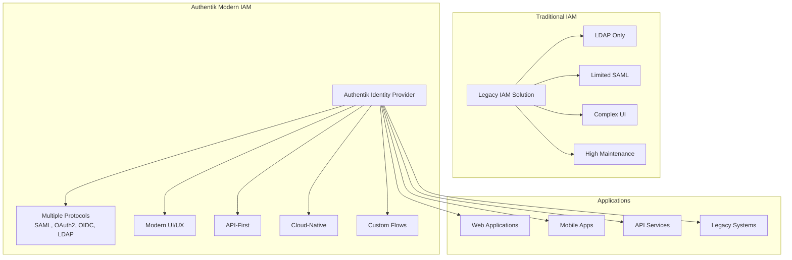

## Overview

**Authentik** is a modern, open-source identity provider (IdP) that provides comprehensive authentication and authorization services for enterprise environments. Built with a cloud-native architecture, Authentik offers advanced features including Single Sign-On (SSO), multi-factor authentication (MFA), user lifecycle management, and extensive protocol support.

### Key Features and Benefits

#### Core Identity Services

| Feature | Description | Enterprise Benefit |
| ------- | ----------- | ------------------ |
| **Single Sign-On (SSO)** | Unified authentication across applications | Improved user experience and security |
| **Multi-Factor Authentication** | TOTP, WebAuthn, SMS, Email | Enhanced security posture |
| **Protocol Support** | SAML 2.0, OAuth2, OIDC, LDAP | Universal application compatibility |
| **User Lifecycle Management** | Automated provisioning and deprovisioning | Reduced administrative overhead |
| **Policy Engine** | Flexible access control policies | Granular security enforcement |
| **Directory Integration** | LDAP, Active Directory sync | Seamless enterprise integration |

#### Modern Architecture Benefits

- ✅ **Cloud-Native Design** - Container-first with Kubernetes support
- ✅ **API-First Architecture** - Comprehensive REST API for automation
- ✅ **Modern UI/UX** - Intuitive administrative interface
- ✅ **High Availability** - Distributed deployment support
- ✅ **Audit and Compliance** - Comprehensive logging and reporting
- ✅ **Extensible Flows** - Custom authentication workflows

### Authentik vs. Traditional Solutions

```mermaid
graph TB
    subgraph "Traditional IAM"
        oldiam[Legacy IAM Solution]
        oldiam --> oldldap[LDAP Only]
        oldiam --> oldsaml[Limited SAML]
        oldiam --> oldui[Complex UI]
        oldiam --> oldmaint[High Maintenance]
    end
    
    subgraph "Authentik Modern IAM"
        authentik[Authentik Identity Provider]
        authentik --> protocols[Multiple Protocols<br/>SAML, OAuth2, OIDC, LDAP]
        authentik --> modern[Modern UI/UX]
        authentik --> api[API-First]
        authentik --> cloud[Cloud-Native]
        authentik --> flows[Custom Flows]
    end
    
    subgraph "Applications"
        webapp[Web Applications]
        mobile[Mobile Apps]
        api_apps[API Services]
        legacy[Legacy Systems]
    end
    
    authentik --> webapp
    authentik --> mobile
    authentik --> api_apps
    authentik --> legacy
```

---

## In This Section

- [Architecture and Components](architecture.md) — Authentik architecture, core components, and deployment topologies
- [Installation and Deployment](installation.md) — Deploying Authentik with Docker Compose — single-instance and high-availability
- [Configuration and Flows](configuration.md) — Configuring Authentik and building authentication and authorization flows
- [Integration and Users](integration.md) — Integrating applications (SAML, OAuth2, OIDC, LDAP) and managing users and groups
- [Security and Monitoring](security.md) — Security hardening, compliance, monitoring, and logging for Authentik
- [Backup and Recovery](backup-recovery.md) — Backup and disaster-recovery procedures for Authentik
- [Troubleshooting](troubleshooting.md) — Diagnosing and resolving common Authentik issues
- [Best Practices and Automation](best-practices.md) — Enterprise best practices and automation/scripting for Authentik

## References and Resources

### Official Documentation

- [Authentik Documentation](https://docs.goauthentik.io/)
- [API Reference](https://docs.goauthentik.io/docs/api/)
- [Integration Guides](https://docs.goauthentik.io/integrations/)

### Community Resources

- [Authentik GitHub Repository](https://github.com/goauthentik/authentik)
- [Community Discord](https://discord.gg/jg33eMhnj6)
- [Reddit Community](https://reddit.com/r/authentik)

### Security Standards

- [SAML 2.0 Specification](https://docs.oasis-open.org/security/saml/v2.0/)
- [OAuth 2.0 RFC](https://tools.ietf.org/html/rfc6749)
- [OpenID Connect Specification](https://openid.net/connect/)
- [NIST Cybersecurity Framework](https://www.nist.gov/cyberframework)

### Enterprise Integration

- [LDAP/Active Directory Integration](https://docs.goauthentik.io/docs/sources/ldap/)
- [SCIM Provisioning](https://docs.goauthentik.io/docs/providers/scim/)
- [Kubernetes Deployment](https://docs.goauthentik.io/docs/installation/kubernetes/)
