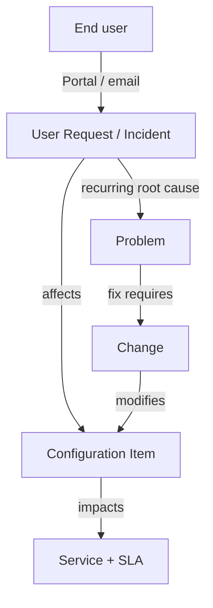

## CMDB and ITSM

iTop's value is the combination of a **CMDB** (a structured inventory of your IT and its relationships) with **ITIL processes** that reference it. This page introduces the data model and the core processes so you can plan a deployment; the [official documentation](https://www.itophub.io/wiki/page) covers each in depth.

## The CMDB

### Configuration Items and Classes

Everything iTop manages is an object of a **class** in its data model. Classes form an inheritance tree — for example, `FunctionalCI` is the base for most managed items:

| Class (examples) | Represents |
| ---------------- | ---------- |
| `Server`, `VirtualMachine`, `PC`, `NetworkDevice` | Hardware / infrastructure CIs |
| `ApplicationSolution`, `WebApplication`, `DBServer` | Software and application CIs |
| `Person`, `Team`, `Organization` | Contacts and the organizations they belong to |
| `Service`, `ServiceSubcategory`, `SLA`/`SLT` | Service catalog and service levels |
| `Ticket` → `UserRequest`, `Incident`, `Change`, `Problem` | ITIL process objects |

Every object belongs to an **Organization** (iTop is multi-tenant), which scopes visibility and ownership.

### Relationships and Impact Analysis

CIs are linked by **relationships** — principally "impacts" / "depends on". These power iTop's signature feature: **impact analysis**. When you look at a server, iTop can show (and draw, via graphviz) everything that depends on it — applications, services, and ultimately the users affected if it fails.

```text
[Storage Array] --impacts--> [DB Server] --impacts--> [CRM Application] --impacts--> [Sales Service]
```

Because tickets reference CIs, an incident on the storage array can surface every downstream service at risk — the reason a well-maintained CMDB makes incident and change management far more effective.

### Populating the CMDB

- **Manually** in the UI for small inventories or one-offs.
- **CSV import** (Data administration → CSV Import) for bulk loads.
- **Synchro Data Sources / collectors** for automated, repeatable feeds from discovery tools, spreadsheets, or other systems — see [Integration](integration.md). This is the recommended way to keep the CMDB current.

> [!TIP]
> Start the CMDB small and useful rather than modeling everything at once. Load organizations, contacts, core services, and the CIs that support them; add depth (network ports, software patches) only where a process actually consumes it. An unmaintained, over-modeled CMDB quickly becomes inaccurate and ignored.

## ITSM Processes

iTop ships ITIL-aligned processes as modules chosen at setup. Each ticket class is a state machine with its own lifecycle, notifications, and SLA behavior.

### Service Desk — User Requests and Incidents

- **User Request** (`UserRequest`) — service requests from end users (access, information, standard changes), typically raised via the Service Portal or email.
- **Incident** (`Incident`) — an unplanned interruption or degradation of a service.

Both move through states such as `new → assigned → pending → resolved → closed`, can be linked to the affected CIs and service, and are governed by **SLAs/SLTs** (response and resolution targets) that the cron scheduler tracks and escalates.

### Problem Management

- **Problem** (`Problem`) — the underlying root cause behind one or more incidents. Incidents link to a problem so that fixing the root cause resolves them together, and known errors/workarounds are recorded.

### Change Management

- **Change** (`Change`) — a controlled modification to the environment, with types such as **Routine**, **Normal** (approval workflow), and **Emergency**. Changes reference the CIs they affect, enabling risk/impact assessment against the CMDB before approval.

### Service Management

- **Service catalog** — `Service` and `ServiceSubcategory` define what IT offers; **`SLA`/`SLT`** define the targets. Tickets are tied to a service, so reporting can show performance per service and per customer organization.

### How the Pieces Connect



This linkage — tickets to CIs to services — is what distinguishes an ITSM/CMDB platform from a plain ticketing tool: every request, incident, and change is anchored to the actual infrastructure and the services users depend on.

### Notifications and Workflows

iTop sends **notifications** (email) on ticket events, driven by configurable triggers and the cron scheduler. Lifecycle **stimuli** move tickets between states and can require fields, assignments, or approvals — customizable via the [Toolkit](configuration.md#the-toolkit-designer).

## Navigation

[◄ Configuration](configuration.md) · [iTop Overview](index.md) · [Integration ►](integration.md)
