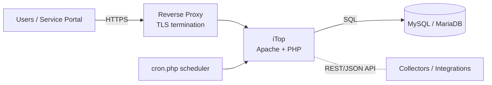

## iTop ITSM / CMDB

[iTop](https://www.combodo.com/itop) (IT Operational Portal), by Combodo, is an open-source, web-based **ITSM** (IT Service Management) and **CMDB** (Configuration Management Database) platform. It combines a configuration database of your IT assets and their relationships with ITIL-aligned processes — incident, problem, change, and service management — plus a service portal, ticketing, notifications, a REST API, and data synchronization.

This section focuses on running iTop in **containers** with Docker: deployment, configuration, using the CMDB/ITSM features, integrations, security, backups, and monitoring.

### Architecture

iTop is a classic **LAMP-style PHP web application** backed by a relational database. A containerized deployment therefore has two core services plus a scheduler:

| Component | Role |
| --------- | ---- |
| **iTop application** | Apache (or Nginx) + PHP serving the web UI, portal, and REST API |
| **Database** | MySQL 8.0 / MariaDB — stores the entire data model, tickets, and CMDB |
| **Cron (`cron.php`)** | Runs background tasks: async notifications, escalation/SLA, data synchronization |
| **Reverse proxy** (recommended) | TLS termination and access control in front of iTop |

### Editions and Versions

| | Notes |
| - | ----- |
| **Community Edition** | Free, open-source (AGPL). The full CMDB and core ITIL processes. |
| **Essential / Professional** | Paid Combodo subscription adding extra features, extensions, and support. |
| **iTop 3.x** | The current line (3.2 is recent). iTop 3.2 requires **PHP 8.1+** and **MySQL 5.7+/8.0** or **MariaDB 10.x**. Always match the PHP/DB versions to your iTop release. |

### Core Concepts

| Concept | Meaning |
| ------- | ------- |
| **CI (Configuration Item)** | Any managed object — server, PC, application, network device, contact, service |
| **Class / data model** | iTop's object schema (`Server`, `Person`, `Organization`, `Service`, ticket classes). Extensible via the Toolkit/Designer |
| **Relationship** | "Impacts" / "depends on" links between CIs that power impact analysis |
| **Ticket** | A request/incident/change/problem object with a workflow (state machine) |
| **Organization** | The tenant/company a CI or ticket belongs to (iTop is multi-organization) |
| **Synchro Data Source** | A definition for importing/synchronizing objects from an external source |

### In This Section

- [Deployment](deployment.md) — Docker Compose (iTop + MariaDB), volumes, and the first-run setup wizard
- [Configuration](configuration.md) — `config-itop.php`, the cron scheduler, modules/extensions, and the Toolkit
- [CMDB and ITSM](cmdb-itsm.md) — the data model, configuration management, and the incident/problem/change/service processes
- [Integration](integration.md) — the REST/JSON API, data synchronization and collectors, and LDAP authentication
- [Security](security.md) — reverse proxy and TLS, authentication, and hardening
- [Backup and Recovery](backup-recovery.md) — backing up the database and configuration, restoring, and upgrading iTop
- [Monitoring and Troubleshooting](monitoring.md) — logs, cron monitoring, and common issues

### Resources

- [iTop Documentation](https://www.itophub.io/wiki/page)
- [iTop on GitHub](https://github.com/Combodo/iTop)
- [iTop Hub (extensions marketplace)](https://store.itophub.io/)
- [iTop REST/JSON API reference](https://www.itophub.io/wiki/page?id=latest:advancedtopics:rest_json)

### Related Topics

- [MySQL](../mysql/index.md) — the database backend (MariaDB is a drop-in alternative)
- [Apache](../apache/index.md) / [Nginx](../nginx/index.md) — reverse proxy and TLS in front of iTop
- [ACME / Let's Encrypt](../../../security/certificates/acme/index.md) — certificates for the portal
- [Docker](../docker/index.md)
