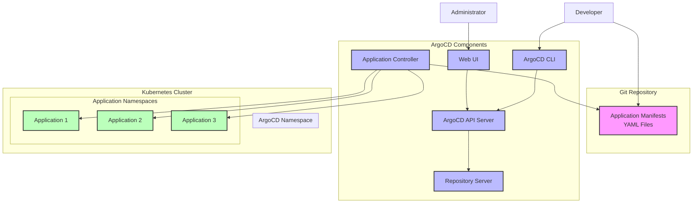

## Overview

**ArgoCD** is a declarative, GitOps continuous delivery tool for Kubernetes. It follows the GitOps pattern of using Git repositories as the source of truth for defining the desired application state and automatically synchronizing the live environment with the declared state.

## What is ArgoCD?

ArgoCD is a Kubernetes-native continuous delivery tool that:

- **Monitors Git repositories** for changes to application configurations
- **Automatically synchronizes** Kubernetes clusters with the desired state defined in Git
- **Provides a web UI** for visualizing and managing deployments
- **Supports multiple Git repositories** and Kubernetes clusters
- **Implements GitOps principles** for secure, auditable deployments

### Key Features

- **Declarative GitOps**: Uses Git as the single source of truth
- **Multi-cluster Support**: Manage applications across multiple Kubernetes clusters
- **Application Health Monitoring**: Real-time health status and synchronization state
- **Rollback Capabilities**: Easy rollback to previous application versions
- **RBAC Integration**: Role-based access control with Kubernetes RBAC
- **SSO Support**: Integration with OIDC, LDAP, SAML providers
- **Helm Support**: Native support for Helm charts and Kustomize
- **Application Sets**: Manage multiple applications with templates

## GitOps Principles

ArgoCD implements the four core GitOps principles:

### 1. Declarative

The entire system is described declaratively in Git repositories.

### 2. Versioned and Immutable

The desired state is stored in a version control system (Git) that enforces immutability and versioning.

### 3. Pulled Automatically

Software agents automatically pull the desired state declarations from Git.

### 4. Continuously Reconciled

Software agents continuously observe actual system state and attempt to apply the desired state.

## Architecture Overview



### Core Components

#### ArgoCD API Server

- Exposes the API consumed by the Web UI, CLI, and CI/CD systems
- Handles authentication and authorization
- Manages application lifecycle operations

#### Repository Server

- Internal service that maintains a local cache of Git repositories
- Generates and returns Kubernetes manifests
- Supports multiple configuration management tools

#### Application Controller

- Kubernetes controller that continuously monitors running applications
- Compares live state against desired target state (Git repository)
- Performs synchronization operations

#### Web UI

- Browser-based interface for managing applications
- Provides real-time view of application status
- Enables manual sync operations and rollbacks

## Installation and Setup

### Prerequisites

- Kubernetes cluster (v1.19+)
- `kubectl` configured to communicate with your cluster
- Git repository containing application manifests

### Install ArgoCD

```bash
# Create namespace
kubectl create namespace argocd

# Install ArgoCD
kubectl apply -n argocd -f https://raw.githubusercontent.com/argoproj/argo-cd/stable/manifests/install.yaml

# Wait for all pods to be ready
kubectl wait --for=condition=ready pod --all -n argocd --timeout=300s

# Verify installation
kubectl get pods -n argocd
```

### Access ArgoCD UI

#### Method 1: Port Forward (Development)

```bash
# Port forward to access UI locally
kubectl port-forward svc/argocd-server -n argocd 8080:443

# Access UI at https://localhost:8080
# Username: admin
# Get initial password:
kubectl -n argocd get secret argocd-initial-admin-secret -o jsonpath="{.data.password}" | base64 -d
```

#### Method 2: LoadBalancer Service (Production)

```yaml
# argocd-service-lb.yaml
apiVersion: v1
kind: Service
metadata:
  name: argocd-server-lb
  namespace: argocd
spec:
  type: LoadBalancer
  selector:
    app.kubernetes.io/component: server
    app.kubernetes.io/name: argocd-server
  ports:
  - port: 80
    targetPort: 8080
    protocol: TCP
    name: http
  - port: 443
    targetPort: 8080
    protocol: TCP
    name: https
```

#### Method 3: Ingress (Production)

```yaml
# argocd-ingress.yaml
apiVersion: networking.k8s.io/v1
kind: Ingress
metadata:
  name: argocd-server-ingress
  namespace: argocd
  annotations:
    nginx.ingress.kubernetes.io/ssl-redirect: "false"
    nginx.ingress.kubernetes.io/force-ssl-redirect: "false"
    nginx.ingress.kubernetes.io/backend-protocol: "GRPC"
spec:
  ingressClassName: nginx
  rules:
  - host: argocd.yourdomain.com
    http:
      paths:
      - path: /
        pathType: Prefix
        backend:
          service:
            name: argocd-server
            port:
              number: 80
```

### Install ArgoCD CLI

```bash
# Linux
curl -sSL -o argocd-linux-amd64 https://github.com/argoproj/argo-cd/releases/latest/download/argocd-linux-amd64
sudo install -m 555 argocd-linux-amd64 /usr/local/bin/argocd
rm argocd-linux-amd64

# macOS
brew install argocd

# Windows (PowerShell)
$version = (Invoke-RestMethod https://api.github.com/repos/argoproj/argo-cd/releases/latest).tag_name
$url = "https://github.com/argoproj/argo-cd/releases/download/" + $version + "/argocd-windows-amd64.exe"
$output = "argocd.exe"
Invoke-WebRequest -Uri $url -OutFile $output
```

## Creating Your First Application

### 1. Prepare Git Repository

Create a Git repository with Kubernetes manifests:

```bash
# Example repository structure
my-app-configs/
├── environments/
│   ├── dev/
│   │   ├── deployment.yaml
│   │   ├── service.yaml
│   │   └── kustomization.yaml
│   ├── staging/
│   │   ├── deployment.yaml
│   │   ├── service.yaml
│   │   └── kustomization.yaml
│   └── prod/
│       ├── deployment.yaml
│       ├── service.yaml
│       └── kustomization.yaml
└── README.md
```

**Example application manifest** (`environments/dev/deployment.yaml`):

```yaml
apiVersion: apps/v1
kind: Deployment
metadata:
  name: sample-app
  namespace: sample-app
spec:
  replicas: 2
  selector:
    matchLabels:
      app: sample-app
  template:
    metadata:
      labels:
        app: sample-app
    spec:
      containers:
      - name: sample-app
        image: nginx:1.21
        ports:
        - containerPort: 80
        resources:
          requests:
            memory: "64Mi"
            cpu: "50m"
          limits:
            memory: "128Mi"
            cpu: "100m"

---
apiVersion: v1
kind: Service
metadata:
  name: sample-app-service
  namespace: sample-app
spec:
  selector:
    app: sample-app
  ports:
  - port: 80
    targetPort: 80
  type: ClusterIP
```

### 2. Create Application via CLI

```bash
# Login to ArgoCD
argocd login localhost:8080 --username admin --password <initial-password> --insecure

# Create application
argocd app create sample-app \
  --repo https://github.com/yourusername/my-app-configs.git \
  --path environments/dev \
  --dest-server https://kubernetes.default.svc \
  --dest-namespace sample-app \
  --sync-policy automated \
  --auto-prune \
  --self-heal

# Sync application
argocd app sync sample-app

# Get application status
argocd app get sample-app
```

### 3. Create Application via YAML

```yaml
# sample-app-argocd.yaml
apiVersion: argoproj.io/v1alpha1
kind: Application
metadata:
  name: sample-app
  namespace: argocd
  finalizers:
    - resources-finalizer.argocd.argoproj.io
spec:
  project: default
  source:
    repoURL: https://github.com/yourusername/my-app-configs.git
    targetRevision: HEAD
    path: environments/dev
  destination:
    server: https://kubernetes.default.svc
    namespace: sample-app
  syncPolicy:
    automated:
      prune: true
      selfHeal: true
    syncOptions:
    - CreateNamespace=true
```

```bash
# Apply the application
kubectl apply -f sample-app-argocd.yaml
```

## Application Management

### Sync Strategies

#### Manual Sync

Applications require manual intervention to sync changes.

```bash
# Manual sync via CLI
argocd app sync sample-app

# Manual sync with force
argocd app sync sample-app --force
```

#### Automated Sync

ArgoCD automatically applies changes when Git repository is updated.

```yaml
spec:
  syncPolicy:
    automated:
      prune: true      # Remove resources not defined in Git
      selfHeal: true   # Revert manual changes to cluster
    syncOptions:
    - CreateNamespace=true
```

### Sync Options

- **CreateNamespace=true**: Automatically create destination namespace
- **PrunePropagationPolicy=foreground**: Control how resources are deleted
- **Validate=false**: Skip kubectl validation
- **ApplyOutOfSyncOnly=true**: Only apply out-of-sync resources

### Application Health Status

ArgoCD monitors application health through various mechanisms:

- **Healthy**: All resources are present and functioning
- **Progressing**: Application is being deployed or updated
- **Suspended**: Application is suspended and not expected to reconcile
- **Degraded**: Application is not functioning as expected
- **Missing**: Resources are missing from the cluster

### Rollback Operations

```bash
# View application history
argocd app history sample-app

# Rollback to specific revision
argocd app rollback sample-app 5

# Rollback to previous version
argocd app rollback sample-app
```

## Advanced Features

### Application Sets

Application Sets enable managing multiple applications using templates:

```yaml
apiVersion: argoproj.io/v1alpha1
kind: ApplicationSet
metadata:
  name: microservices
  namespace: argocd
spec:
  generators:
  - git:
      repoURL: https://github.com/yourusername/microservices-configs.git
      revision: HEAD
      directories:
      - path: services/*
  template:
    metadata:
      name: '{{path.basename}}'
    spec:
      project: default
      source:
        repoURL: https://github.com/yourusername/microservices-configs.git
        targetRevision: HEAD
        path: '{{path}}'
      destination:
        server: https://kubernetes.default.svc
        namespace: '{{path.basename}}'
      syncPolicy:
        automated:
          prune: true
          selfHeal: true
        syncOptions:
        - CreateNamespace=true
```

### Multi-Cluster Management

Add external clusters to ArgoCD:

```bash
# Add cluster
argocd cluster add my-cluster-context --name production-cluster

# List clusters
argocd cluster list

# Deploy to specific cluster
argocd app create prod-app \
  --repo https://github.com/yourusername/app-configs.git \
  --path environments/prod \
  --dest-server https://prod-cluster-api.example.com \
  --dest-namespace production
```

### Projects and RBAC

Create projects to group applications and implement access control:

```yaml
apiVersion: argoproj.io/v1alpha1
kind: AppProject
metadata:
  name: team-alpha
  namespace: argocd
spec:
  description: Project for Team Alpha applications
  sourceRepos:
  - https://github.com/company/team-alpha-*
  destinations:
  - namespace: team-alpha-*
    server: https://kubernetes.default.svc
  clusterResourceWhitelist:
  - group: ''
    kind: Namespace
  namespaceResourceWhitelist:
  - group: apps
    kind: Deployment
  - group: ''
    kind: Service
  roles:
  - name: team-alpha-admins
    description: Admin role for Team Alpha
    policies:
    - p, proj:team-alpha:team-alpha-admins, applications, *, team-alpha/*, allow
    groups:
    - team-alpha-admins
```

### Custom Health Checks

Define custom health checks for applications:

```yaml
apiVersion: v1
kind: ConfigMap
metadata:
  name: argocd-cm
  namespace: argocd
data:
  resource.customizations.health.example.com_MyCustomResource: |
    hs = {}
    if obj.status ~= nil then
      if obj.status.phase == "Running" then
        hs.status = "Healthy"
        hs.message = "Custom resource is running"
      else
        hs.status = "Progressing"
        hs.message = "Custom resource is starting"
      end
    end
    return hs
```

## Best Practices

### Repository Structure

#### Environment-Based Structure

```text
app-configs/
├── base/
│   ├── deployment.yaml
│   ├── service.yaml
│   └── kustomization.yaml
├── overlays/
│   ├── dev/
│   │   ├── kustomization.yaml
│   │   └── patch.yaml
│   ├── staging/
│   │   ├── kustomization.yaml
│   │   └── patch.yaml
│   └── prod/
│       ├── kustomization.yaml
│       └── patch.yaml
```

#### Application-Based Structure

```text
configs/
├── frontend/
│   ├── dev/
│   ├── staging/
│   └── prod/
├── backend/
│   ├── dev/
│   ├── staging/
│   └── prod/
└── database/
    ├── dev/
    ├── staging/
    └── prod/
```

### Security Best Practices

1. **Use Private Repositories**: Store sensitive configurations in private Git repositories
2. **Implement RBAC**: Use projects and roles to control access
3. **Enable SSO**: Integrate with your organization's identity provider
4. **Network Policies**: Restrict ArgoCD network access
5. **Secret Management**: Use external secret management tools (External Secrets Operator, Sealed Secrets)

### Monitoring and Observability

#### Prometheus Metrics

ArgoCD exposes Prometheus metrics for monitoring:

```yaml
# ServiceMonitor for ArgoCD metrics
apiVersion: monitoring.coreos.com/v1
kind: ServiceMonitor
metadata:
  name: argocd-metrics
  namespace: argocd
spec:
  selector:
    matchLabels:
      app.kubernetes.io/component: metrics
      app.kubernetes.io/name: argocd-server-metrics
  endpoints:
  - port: metrics
```

#### Key Metrics to Monitor

- `argocd_app_health_status`: Application health status
- `argocd_app_sync_total`: Total number of sync operations
- `argocd_cluster_connection_status`: Cluster connectivity status
- `argocd_git_request_total`: Git repository request metrics

### Performance Optimization

1. **Resource Limits**: Set appropriate resource limits for ArgoCD components
2. **Repository Caching**: Configure repository server caching
3. **Parallel Sync**: Enable parallel synchronization for faster deployments
4. **Prune Propagation**: Optimize resource deletion strategies

## Troubleshooting

### Common Issues

#### Application Out of Sync

**Problem**: Application shows as "OutOfSync" but no changes were made.

**Solutions**:

```bash
# Check application details
argocd app get sample-app

# Compare live vs desired state
argocd app diff sample-app

# Force refresh
argocd app get sample-app --refresh

# Hard refresh (clear cache)
argocd app get sample-app --hard-refresh
```

#### Repository Access Issues

**Problem**: ArgoCD cannot access Git repository.

**Solutions**:

```bash
# Check repository connection
argocd repo list

# Test repository access
argocd repo get https://github.com/yourusername/repo.git

# Add repository with credentials
argocd repo add https://github.com/yourusername/private-repo.git \
  --username myuser \
  --password mytoken
```

#### Sync Failures

**Problem**: Application sync fails with errors.

**Solutions**:

```bash
# Check sync status and errors
argocd app get sample-app

# View application events
kubectl describe application sample-app -n argocd

# Check ArgoCD logs
kubectl logs -n argocd deployment/argocd-application-controller
```

### Debugging Commands

```bash
# Get application status
argocd app get <app-name>

# List all applications
argocd app list

# Get application logs
argocd app logs <app-name>

# Get sync history
argocd app history <app-name>

# Compare live vs Git state
argocd app diff <app-name>

# Force sync with replace
argocd app sync <app-name> --replace

# Delete application
argocd app delete <app-name>
```

## Integration with CI/CD

### GitLab CI Integration

```yaml
# .gitlab-ci.yml
stages:
  - build
  - deploy

variables:
  ARGOCD_SERVER: "argocd.yourdomain.com"
  ARGOCD_AUTH_TOKEN: $ARGOCD_TOKEN

deploy:
  stage: deploy
  image: argoproj/argocd:latest
  script:
    - argocd login $ARGOCD_SERVER --auth-token $ARGOCD_AUTH_TOKEN
    - argocd app sync $APPLICATION_NAME
    - argocd app wait $APPLICATION_NAME --timeout 300
  only:
    - main
```

### GitHub Actions Integration

```yaml
# .github/workflows/deploy.yml
name: Deploy with ArgoCD
on:
  push:
    branches: [main]

jobs:
  deploy:
    runs-on: ubuntu-latest
    steps:
    - uses: actions/checkout@v3
    
    - name: Install ArgoCD CLI
      run: |
        curl -sSL -o argocd https://github.com/argoproj/argo-cd/releases/latest/download/argocd-linux-amd64
        chmod +x argocd
        sudo mv argocd /usr/local/bin/
    
    - name: Deploy Application
      env:
        ARGOCD_AUTH_TOKEN: ${{ secrets.ARGOCD_TOKEN }}
        ARGOCD_SERVER: ${{ secrets.ARGOCD_SERVER }}
      run: |
        argocd login $ARGOCD_SERVER --auth-token $ARGOCD_AUTH_TOKEN
        argocd app sync ${{ github.event.repository.name }}
        argocd app wait ${{ github.event.repository.name }} --timeout 300
```

## Migration and Adoption

### Migrating from Traditional CI/CD

1. **Assessment**: Evaluate current deployment processes
2. **Repository Preparation**: Restructure configurations for GitOps
3. **Pilot Project**: Start with a non-critical application
4. **Gradual Migration**: Move applications incrementally
5. **Training**: Educate teams on GitOps principles

### Adoption Strategy

#### Phase 1: Setup and Pilot

- Install ArgoCD in development environment
- Migrate one simple application
- Establish basic GitOps practices

#### Phase 2: Expansion

- Add more applications
- Implement environment promotion workflows
- Establish monitoring and alerting

#### Phase 3: Production

- Deploy to production environments
- Implement advanced features (Application Sets, multi-cluster)
- Establish operational procedures

## Comparison with Other Tools

| Feature | ArgoCD | Flux | Jenkins X | Tekton |
|---------|--------|------|-----------|--------|
| **GitOps Native** | ✅ | ✅ | ✅ | ❌ |
| **Web UI** | ✅ | ❌ | ✅ | ❌ |
| **Multi-cluster** | ✅ | ✅ | ✅ | ❌ |
| **Helm Support** | ✅ | ✅ | ✅ | ✅ |
| **RBAC** | ✅ | ❌ | ✅ | ✅ |
| **Image Updates** | Plugin | ✅ | ✅ | ✅ |
| **Rollback** | ✅ | ✅ | ✅ | ❌ |

## Resources and References

### Official Documentation

- [ArgoCD Documentation](https://argo-cd.readthedocs.io/)
- [ArgoCD GitHub Repository](https://github.com/argoproj/argo-cd)
- [ArgoCD Examples](https://github.com/argoproj/argocd-example-apps)

### Community Resources

- [ArgoCD Community](https://argoproj.github.io/community/)
- [CNCF ArgoCD Project](https://www.cncf.io/projects/argo/)
- [GitOps Working Group](https://github.com/gitops-working-group/gitops-working-group)

### Related Tools

- [Argo Workflows](https://argoproj.github.io/argo-workflows/)
- [Argo Events](https://argoproj.github.io/argo-events/)
- [Argo Rollouts](https://argoproj.github.io/argo-rollouts/)

---

ArgoCD represents a powerful approach to Kubernetes application delivery through GitOps principles. By treating Git as the single source of truth and implementing automated synchronization, organizations can achieve more reliable, auditable, and secure deployment processes. Whether you're starting with a simple application or managing complex multi-cluster environments, ArgoCD provides the tools and flexibility needed for modern Kubernetes operations.
