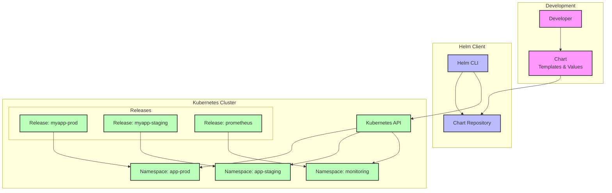

## Overview

**Helm** is the package manager for Kubernetes, often referred to as "the brew/apt/yum for Kubernetes." It simplifies the deployment and management of applications on Kubernetes clusters by packaging complex applications into reusable, versioned, and configurable units called **Charts**.

## What is Helm?

Helm is a tool that streamlines installing and managing Kubernetes applications. It uses a packaging format called **Charts**, which are collections of files that describe a related set of Kubernetes resources. Think of Helm as:

- **Package Manager**: Like npm for Node.js or pip for Python
- **Template Engine**: Generates Kubernetes manifests from templates
- **Release Manager**: Tracks deployments and enables rollbacks
- **Dependency Manager**: Handles application dependencies

### Key Concepts

#### Charts

A Chart is a Helm package containing all resource definitions necessary to run an application on a Kubernetes cluster.

#### Repositories

Chart repositories are locations where packaged charts can be stored and shared.

#### Releases

A Release is an instance of a chart running in a Kubernetes cluster.

#### Values

Configuration parameters that customize chart behavior during installation.

## Helm Architecture



## Installation

### Install Helm CLI

#### Linux

```bash
# Using package manager (recommended)
curl https://baltocdn.com/helm/signing.asc | gpg --dearmor | sudo tee /usr/share/keyrings/helm.gpg > /dev/null
sudo apt-get install apt-transport-https --yes
echo "deb [arch=$(dpkg --print-architecture) signed-by=/usr/share/keyrings/helm.gpg] https://baltocdn.com/helm/stable/debian/ all main" | sudo tee /etc/apt/sources.list.d/helm-stable-debian.list
sudo apt-get update
sudo apt-get install helm

# Using snap
sudo snap install helm --classic

# Using script
curl -fsSL -o get_helm.sh https://raw.githubusercontent.com/helm/helm/main/scripts/get-helm-3
chmod 700 get_helm.sh
./get_helm.sh
```

#### macOS

```bash
# Using Homebrew
brew install helm

# Using MacPorts
sudo port install helm
```

#### Windows

```powershell
# Using Chocolatey
choco install kubernetes-helm

# Using Scoop
scoop install helm

# Using winget
winget install Helm.Helm
```

### Verify Installation

```bash
# Check Helm version
helm version

# Add official stable repository
helm repo add stable https://charts.helm.sh/stable

# Update repository information
helm repo update

# List available repositories
helm repo list
```

## Basic Helm Commands

### Repository Management

```bash
# Add a repository
helm repo add bitnami https://charts.bitnami.com/bitnami
helm repo add prometheus-community https://prometheus-community.github.io/helm-charts

# Update repositories
helm repo update

# List repositories
helm repo list

# Remove a repository
helm repo remove bitnami

# Search for charts
helm search repo nginx
helm search repo database
```

### Chart Management

```bash
# Search for charts in repositories
helm search repo wordpress

# Show chart information
helm show chart bitnami/wordpress
helm show values bitnami/wordpress
helm show readme bitnami/wordpress

# Download a chart
helm pull bitnami/wordpress
helm pull bitnami/wordpress --untar
```

### Release Management

```bash
# Install a chart
helm install my-release bitnami/wordpress

# Install with custom values
helm install my-release bitnami/wordpress \
  --set wordpressUsername=admin \
  --set wordpressPassword=secretpassword

# Install with values file
helm install my-release bitnami/wordpress -f values.yaml

# List releases
helm list
helm list --all-namespaces

# Get release information
helm get all my-release
helm get values my-release
helm get manifest my-release

# Upgrade a release
helm upgrade my-release bitnami/wordpress

# Rollback a release
helm rollback my-release 1

# Uninstall a release
helm uninstall my-release
```

## Creating Your First Chart

### Generate Chart Template

```bash
# Create a new chart
helm create myapp

# Chart structure
myapp/
├── Chart.yaml          # Chart metadata
├── values.yaml         # Default configuration values
├── charts/             # Chart dependencies
├── templates/          # Kubernetes manifest templates
│   ├── deployment.yaml
│   ├── service.yaml
│   ├── ingress.yaml
│   ├── configmap.yaml
│   ├── _helpers.tpl    # Template helpers
│   ├── NOTES.txt       # Installation notes
│   └── tests/
│       └── test-connection.yaml
└── .helmignore         # Files to ignore when packaging
```

### Chart.yaml

```yaml
# Chart.yaml
apiVersion: v2
name: myapp
description: A sample Helm chart for my application
type: application
version: 0.1.0          # Chart version
appVersion: "1.0.0"     # Application version
home: https://github.com/mycompany/myapp
sources:
  - https://github.com/mycompany/myapp
maintainers:
  - name: Your Name
    email: your.email@company.com
keywords:
  - web
  - application
  - microservice
dependencies:
  - name: postgresql
    version: "^11.0.0"
    repository: https://charts.bitnami.com/bitnami
    condition: postgresql.enabled
```

### values.yaml

```yaml
# values.yaml - Default configuration values
replicaCount: 1

image:
  repository: nginx
  pullPolicy: IfNotPresent
  tag: "1.21.0"

imagePullSecrets: []
nameOverride: ""
fullnameOverride: ""

serviceAccount:
  create: true
  annotations: {}
  name: ""

podAnnotations: {}

podSecurityContext:
  fsGroup: 2000

securityContext:
  capabilities:
    drop:
    - ALL
  readOnlyRootFilesystem: true
  runAsNonRoot: true
  runAsUser: 1000

service:
  type: ClusterIP
  port: 80

ingress:
  enabled: false
  className: ""
  annotations: {}
  hosts:
    - host: chart-example.local
      paths:
        - path: /
          pathType: Prefix
  tls: []

resources:
  limits:
    cpu: 100m
    memory: 128Mi
  requests:
    cpu: 100m
    memory: 128Mi

autoscaling:
  enabled: false
  minReplicas: 1
  maxReplicas: 100
  targetCPUUtilizationPercentage: 80

nodeSelector: {}
tolerations: []
affinity: {}

# Application-specific values
app:
  config:
    database:
      host: "localhost"
      port: 5432
      name: "myapp"
    redis:
      enabled: false
      host: "localhost"
      port: 6379
```

### Template Examples

#### Deployment Template

```yaml
# templates/deployment.yaml
apiVersion: apps/v1
kind: Deployment
metadata:
  name: {{ include "myapp.fullname" . }}
  labels:
    {{- include "myapp.labels" . | nindent 4 }}
spec:
  {{- if not .Values.autoscaling.enabled }}
  replicas: {{ .Values.replicaCount }}
  {{- end }}
  selector:
    matchLabels:
      {{- include "myapp.selectorLabels" . | nindent 6 }}
  template:
    metadata:
      {{- with .Values.podAnnotations }}
      annotations:
        {{- toYaml . | nindent 8 }}
      {{- end }}
      labels:
        {{- include "myapp.selectorLabels" . | nindent 8 }}
    spec:
      {{- with .Values.imagePullSecrets }}
      imagePullSecrets:
        {{- toYaml . | nindent 8 }}
      {{- end }}
      serviceAccountName: {{ include "myapp.serviceAccountName" . }}
      securityContext:
        {{- toYaml .Values.podSecurityContext | nindent 8 }}
      containers:
        - name: {{ .Chart.Name }}
          securityContext:
            {{- toYaml .Values.securityContext | nindent 12 }}
          image: "{{ .Values.image.repository }}:{{ .Values.image.tag | default .Chart.AppVersion }}"
          imagePullPolicy: {{ .Values.image.pullPolicy }}
          ports:
            - name: http
              containerPort: 80
              protocol: TCP
          livenessProbe:
            httpGet:
              path: /
              port: http
          readinessProbe:
            httpGet:
              path: /
              port: http
          resources:
            {{- toYaml .Values.resources | nindent 12 }}
          env:
            - name: DATABASE_HOST
              value: {{ .Values.app.config.database.host | quote }}
            - name: DATABASE_PORT
              value: {{ .Values.app.config.database.port | quote }}
            - name: DATABASE_NAME
              value: {{ .Values.app.config.database.name | quote }}
            {{- if .Values.app.config.redis.enabled }}
            - name: REDIS_HOST
              value: {{ .Values.app.config.redis.host | quote }}
            - name: REDIS_PORT
              value: {{ .Values.app.config.redis.port | quote }}
            {{- end }}
      {{- with .Values.nodeSelector }}
      nodeSelector:
        {{- toYaml . | nindent 8 }}
      {{- end }}
      {{- with .Values.affinity }}
      affinity:
        {{- toYaml . | nindent 8 }}
      {{- end }}
      {{- with .Values.tolerations }}
      tolerations:
        {{- toYaml . | nindent 8 }}
      {{- end }}
```

#### Service Template

```yaml
# templates/service.yaml
apiVersion: v1
kind: Service
metadata:
  name: {{ include "myapp.fullname" . }}
  labels:
    {{- include "myapp.labels" . | nindent 4 }}
spec:
  type: {{ .Values.service.type }}
  ports:
    - port: {{ .Values.service.port }}
      targetPort: http
      protocol: TCP
      name: http
  selector:
    {{- include "myapp.selectorLabels" . | nindent 4 }}
```

#### ConfigMap Template

```yaml
# templates/configmap.yaml
apiVersion: v1
kind: ConfigMap
metadata:
  name: {{ include "myapp.fullname" . }}-config
  labels:
    {{- include "myapp.labels" . | nindent 4 }}
data:
  database.conf: |
    host={{ .Values.app.config.database.host }}
    port={{ .Values.app.config.database.port }}
    database={{ .Values.app.config.database.name }}
  
  {{- if .Values.app.config.redis.enabled }}
  redis.conf: |
    host={{ .Values.app.config.redis.host }}
    port={{ .Values.app.config.redis.port }}
  {{- end }}
  
  app.properties: |
    app.name={{ include "myapp.fullname" . }}
    app.version={{ .Chart.AppVersion }}
    app.environment={{ .Values.global.environment | default "development" }}
```

### Template Helpers

```yaml
# templates/_helpers.tpl
{{/*
Expand the name of the chart.
*/}}
{{- define "myapp.name" -}}
{{- default .Chart.Name .Values.nameOverride | trunc 63 | trimSuffix "-" }}
{{- end }}

{{/*
Create a default fully qualified app name.
*/}}
{{- define "myapp.fullname" -}}
{{- if .Values.fullnameOverride }}
{{- .Values.fullnameOverride | trunc 63 | trimSuffix "-" }}
{{- else }}
{{- $name := default .Chart.Name .Values.nameOverride }}
{{- if contains $name .Release.Name }}
{{- .Release.Name | trunc 63 | trimSuffix "-" }}
{{- else }}
{{- printf "%s-%s" .Release.Name $name | trunc 63 | trimSuffix "-" }}
{{- end }}
{{- end }}
{{- end }}

{{/*
Create chart name and version as used by the chart label.
*/}}
{{- define "myapp.chart" -}}
{{- printf "%s-%s" .Chart.Name .Chart.Version | replace "+" "_" | trunc 63 | trimSuffix "-" }}
{{- end }}

{{/*
Common labels
*/}}
{{- define "myapp.labels" -}}
helm.sh/chart: {{ include "myapp.chart" . }}
{{ include "myapp.selectorLabels" . }}
{{- if .Chart.AppVersion }}
app.kubernetes.io/version: {{ .Chart.AppVersion | quote }}
{{- end }}
app.kubernetes.io/managed-by: {{ .Release.Service }}
{{- end }}

{{/*
Selector labels
*/}}
{{- define "myapp.selectorLabels" -}}
app.kubernetes.io/name: {{ include "myapp.name" . }}
app.kubernetes.io/instance: {{ .Release.Name }}
{{- end }}

{{/*
Create the name of the service account to use
*/}}
{{- define "myapp.serviceAccountName" -}}
{{- if .Values.serviceAccount.create }}
{{- default (include "myapp.fullname" .) .Values.serviceAccount.name }}
{{- else }}
{{- default "default" .Values.serviceAccount.name }}
{{- end }}
{{- end }}
```

## Working with Charts

### Testing and Validation

```bash
# Validate chart syntax
helm lint myapp/

# Dry run to see generated manifests
helm install my-release myapp/ --dry-run --debug

# Template rendering
helm template my-release myapp/

# Template with specific values
helm template my-release myapp/ \
  --set replicaCount=3 \
  --set image.tag="2.0.0"

# Test chart installation
helm test my-release
```

### Installing and Managing

```bash
# Install chart from local directory
helm install my-release ./myapp

# Install with custom values
helm install my-release ./myapp \
  --set image.tag="1.2.0" \
  --set replicaCount=3

# Install with values file
helm install my-release ./myapp -f production-values.yaml

# Upgrade release
helm upgrade my-release ./myapp \
  --set image.tag="1.3.0"

# Get release status
helm status my-release

# Get release history
helm history my-release

# Rollback to previous version
helm rollback my-release 1
```

### Packaging and Distribution

```bash
# Package chart
helm package myapp/

# Package with version
helm package myapp/ --version 1.0.0

# Sign package (requires GPG)
helm package myapp/ --sign --key 'keyname'

# Verify package
helm verify myapp-1.0.0.tgz

# Create repository index
helm repo index .

# Upload to repository (example with chartmuseum)
curl --data-binary "@myapp-1.0.0.tgz" http://chartmuseum:8080/api/charts
```

## Advanced Features

### Dependencies

Define chart dependencies in `Chart.yaml`:

```yaml
# Chart.yaml
dependencies:
  - name: postgresql
    version: "^11.0.0"
    repository: https://charts.bitnami.com/bitnami
    condition: postgresql.enabled
  - name: redis
    version: "^17.0.0"
    repository: https://charts.bitnami.com/bitnami
    condition: redis.enabled
    tags:
      - cache
```

Manage dependencies:

```bash
# Download dependencies
helm dependency update

# List dependencies
helm dependency list

# Build dependency charts
helm dependency build
```

### Hooks

Helm hooks allow you to intervene at certain points in a release lifecycle:

```yaml
# templates/job-migration.yaml
apiVersion: batch/v1
kind: Job
metadata:
  name: {{ include "myapp.fullname" . }}-migration
  annotations:
    "helm.sh/hook": pre-install,pre-upgrade
    "helm.sh/hook-weight": "-5"
    "helm.sh/hook-delete-policy": before-hook-creation,hook-succeeded
spec:
  template:
    spec:
      restartPolicy: Never
      containers:
      - name: migration
        image: "{{ .Values.image.repository }}:{{ .Values.image.tag }}"
        command: ["./migrate.sh"]
        env:
        - name: DATABASE_URL
          value: {{ .Values.database.url }}
```

### Conditional Templates

Use conditional logic in templates:

```yaml
# templates/ingress.yaml
{{- if .Values.ingress.enabled -}}
apiVersion: networking.k8s.io/v1
kind: Ingress
metadata:
  name: {{ include "myapp.fullname" . }}
  {{- with .Values.ingress.annotations }}
  annotations:
    {{- toYaml . | nindent 4 }}
  {{- end }}
spec:
  {{- if .Values.ingress.className }}
  ingressClassName: {{ .Values.ingress.className }}
  {{- end }}
  rules:
  {{- range .Values.ingress.hosts }}
    - host: {{ .host | quote }}
      http:
        paths:
        {{- range .paths }}
        - path: {{ .path }}
          pathType: {{ .pathType }}
          backend:
            service:
              name: {{ include "myapp.fullname" $ }}
              port:
                number: {{ $.Values.service.port }}
        {{- end }}
  {{- end }}
{{- end }}
```

### Global Values

Share values across charts using global values:

```yaml
# values.yaml
global:
  imageRegistry: myregistry.com
  storageClass: fast-ssd
  environment: production

# In templates
image: "{{ .Values.global.imageRegistry }}/{{ .Values.image.repository }}:{{ .Values.image.tag }}"
```

## Common Use Cases

### Web Application Stack

```yaml
# values-webapp.yaml
replicaCount: 3

image:
  repository: mycompany/webapp
  tag: "2.1.0"

service:
  type: LoadBalancer
  port: 80

ingress:
  enabled: true
  className: nginx
  annotations:
    cert-manager.io/cluster-issuer: letsencrypt-prod
  hosts:
    - host: webapp.example.com
      paths:
        - path: /
          pathType: Prefix
  tls:
    - secretName: webapp-tls
      hosts:
        - webapp.example.com

resources:
  limits:
    cpu: 500m
    memory: 512Mi
  requests:
    cpu: 250m
    memory: 256Mi

autoscaling:
  enabled: true
  minReplicas: 3
  maxReplicas: 10
  targetCPUUtilizationPercentage: 70
```

### Microservices Deployment

```bash
# Install multiple microservices
helm install user-service ./microservice-chart \
  --set image.repository=mycompany/user-service \
  --set image.tag=1.0.0 \
  --set service.port=8080

helm install order-service ./microservice-chart \
  --set image.repository=mycompany/order-service \
  --set image.tag=1.2.0 \
  --set service.port=8081

helm install payment-service ./microservice-chart \
  --set image.repository=mycompany/payment-service \
  --set image.tag=0.9.0 \
  --set service.port=8082
```

### Database Deployment

```bash
# Install PostgreSQL with persistent storage
helm install postgres bitnami/postgresql \
  --set auth.postgresPassword=secretpassword \
  --set auth.database=myapp \
  --set primary.persistence.enabled=true \
  --set primary.persistence.size=20Gi \
  --set primary.persistence.storageClass=fast-ssd
```

## Best Practices

### Chart Development

1. **Use Semantic Versioning**: Follow semver for chart versions
2. **Provide Sensible Defaults**: Make charts work out-of-the-box
3. **Document Values**: Comment your values.yaml file
4. **Use Labels Consistently**: Apply standard Kubernetes labels
5. **Implement Health Checks**: Include liveness and readiness probes
6. **Handle Secrets Properly**: Don't hardcode secrets in charts

### Template Best Practices

```yaml
# Good: Use helpers for repeated values
name: {{ include "myapp.fullname" . }}

# Good: Quote string values
env:
  - name: DATABASE_HOST
    value: {{ .Values.database.host | quote }}

# Good: Use default values
replicas: {{ .Values.replicaCount | default 1 }}

# Good: Conditional resource creation
{{- if .Values.serviceAccount.create }}
apiVersion: v1
kind: ServiceAccount
metadata:
  name: {{ include "myapp.serviceAccountName" . }}
{{- end }}
```

### Security Best Practices

1. **Use Non-Root Containers**: Set security contexts
2. **Implement RBAC**: Create service accounts with minimal permissions
3. **Network Policies**: Restrict network access
4. **Resource Limits**: Set CPU and memory limits
5. **Pod Security Standards**: Use pod security contexts

```yaml
# Security context example
securityContext:
  runAsNonRoot: true
  runAsUser: 1000
  runAsGroup: 1000
  fsGroup: 1000
  capabilities:
    drop:
      - ALL
  readOnlyRootFilesystem: true
```

### Values File Organization

```yaml
# values.yaml - Organize by component
# Global settings
global:
  imageRegistry: ""
  imagePullSecrets: []

# Application image
image:
  repository: nginx
  pullPolicy: IfNotPresent
  tag: ""

# Service configuration
service:
  type: ClusterIP
  port: 80

# Ingress configuration
ingress:
  enabled: false
  className: ""
  annotations: {}

# Resource configuration
resources: {}

# Autoscaling
autoscaling:
  enabled: false

# Application-specific configuration
app:
  config: {}
  secrets: {}
```

## Troubleshooting

### Common Issues

#### Chart Installation Fails

```bash
# Check chart syntax
helm lint ./mychart

# Dry run to see what would be installed
helm install myrelease ./mychart --dry-run --debug

# Check generated manifests
helm template myrelease ./mychart

# Check Kubernetes events
kubectl get events --sort-by=.metadata.creationTimestamp
```

#### Release Management Issues

```bash
# List all releases
helm list --all-namespaces

# Get release status
helm status myrelease

# Check release history
helm history myrelease

# Get release manifest
helm get manifest myrelease

# Debug release
helm get all myrelease
```

#### Template Rendering Issues

```bash
# Render templates locally
helm template myrelease ./mychart \
  --set image.tag=1.0.0 \
  --debug

# Validate rendered manifests
helm template myrelease ./mychart | kubectl apply --dry-run=client -f -
```

### Debugging Commands

```bash
# Show chart values
helm show values bitnami/wordpress

# Get computed values for release
helm get values myrelease

# Show chart templates
helm show chart bitnami/wordpress

# Test release
helm test myrelease

# Rollback failed upgrade
helm rollback myrelease

# Force delete stuck release
helm uninstall myrelease --no-hooks
```

## Helm in CI/CD

### GitLab CI Integration

```yaml
# .gitlab-ci.yml
stages:
  - build
  - deploy

variables:
  HELM_VERSION: "3.12.0"

before_script:
  - curl -fsSL -o get_helm.sh https://raw.githubusercontent.com/helm/helm/main/scripts/get-helm-3
  - chmod 700 get_helm.sh
  - ./get_helm.sh --version v${HELM_VERSION}

deploy:
  stage: deploy
  script:
    - helm repo add bitnami https://charts.bitnami.com/bitnami
    - helm repo update
    - |
      helm upgrade --install myapp ./chart \
        --set image.tag=${CI_COMMIT_SHA} \
        --set ingress.hosts[0].host=${CI_ENVIRONMENT_SLUG}.example.com \
        --namespace ${CI_ENVIRONMENT_SLUG} \
        --create-namespace
  environment:
    name: ${CI_COMMIT_REF_SLUG}
    url: https://${CI_ENVIRONMENT_SLUG}.example.com
  only:
    - main
    - develop
```

### GitHub Actions Integration

```yaml
# .github/workflows/deploy.yml
name: Deploy with Helm
on:
  push:
    branches: [main]

jobs:
  deploy:
    runs-on: ubuntu-latest
    steps:
    - uses: actions/checkout@v3
    
    - name: Install Helm
      uses: azure/setup-helm@v3
      with:
        version: '3.12.0'
    
    - name: Configure kubectl
      uses: azure/k8s-set-context@v3
      with:
        method: kubeconfig
        kubeconfig: ${{ secrets.KUBE_CONFIG }}
    
    - name: Deploy application
      run: |
        helm upgrade --install myapp ./chart \
          --set image.tag=${{ github.sha }} \
          --namespace production \
          --create-namespace \
          --wait \
          --timeout=300s
```

### ArgoCD Integration

```yaml
# argocd-application.yaml
apiVersion: argoproj.io/v1alpha1
kind: Application
metadata:
  name: myapp
  namespace: argocd
spec:
  project: default
  source:
    repoURL: https://github.com/mycompany/myapp-helm
    targetRevision: HEAD
    path: chart
    helm:
      valueFiles:
        - values-production.yaml
      parameters:
        - name: image.tag
          value: "1.0.0"
        - name: replicaCount
          value: "3"
  destination:
    server: https://kubernetes.default.svc
    namespace: myapp
  syncPolicy:
    automated:
      prune: true
      selfHeal: true
    syncOptions:
    - CreateNamespace=true
```

## Popular Helm Charts

### Infrastructure Charts

```bash
# NGINX Ingress Controller
helm repo add ingress-nginx https://kubernetes.github.io/ingress-nginx
helm install nginx-ingress ingress-nginx/ingress-nginx

# Cert-Manager
helm repo add jetstack https://charts.jetstack.io
helm install cert-manager jetstack/cert-manager \
  --namespace cert-manager \
  --create-namespace \
  --set installCRDs=true

# Prometheus Stack
helm repo add prometheus-community https://prometheus-community.github.io/helm-charts
helm install prometheus prometheus-community/kube-prometheus-stack
```

### Database Charts

```bash
# PostgreSQL
helm repo add bitnami https://charts.bitnami.com/bitnami
helm install postgres bitnami/postgresql

# MySQL
helm install mysql bitnami/mysql

# Redis
helm install redis bitnami/redis

# MongoDB
helm install mongodb bitnami/mongodb
```

### Application Charts

```bash
# WordPress
helm install wordpress bitnami/wordpress

# Grafana
helm repo add grafana https://grafana.github.io/helm-charts
helm install grafana grafana/grafana

# Jenkins
helm repo add jenkins https://charts.jenkins.io
helm install jenkins jenkins/jenkins
```

## Comparison with Other Tools

| Feature | Helm | Kustomize | Raw YAML | Operators |
|---------|------|-----------|----------|-----------|
| **Templating** | ✅ | ❌ | ❌ | ✅ |
| **Package Management** | ✅ | ❌ | ❌ | ❌ |
| **Versioning** | ✅ | ❌ | ❌ | ✅ |
| **Rollbacks** | ✅ | ❌ | ❌ | ✅ |
| **Dependencies** | ✅ | ❌ | ❌ | ✅ |
| **Learning Curve** | Medium | Low | Low | High |
| **Kubernetes Native** | ❌ | ✅ | ✅ | ✅ |
| **Complex Logic** | ✅ | ❌ | ❌ | ✅ |

## Resources and References

### Official Documentation

- [Helm Documentation](https://helm.sh/docs/)
- [Helm GitHub Repository](https://github.com/helm/helm)
- [Helm Charts Repository](https://github.com/helm/charts)

### Chart Repositories

- [Artifact Hub](https://artifacthub.io/) - Central hub for Helm charts
- [Bitnami Charts](https://github.com/bitnami/charts)
- [Prometheus Community Charts](https://github.com/prometheus-community/helm-charts)
- [Jetstack Charts](https://github.com/jetstack/jetstack-charts)

### Community Resources

- [Helm Community](https://helm.sh/community/)
- [CNCF Helm Project](https://www.cncf.io/projects/helm/)
- [Helm Best Practices](https://helm.sh/docs/chart_best_practices/)

### Related Tools

- [Helmfile](https://github.com/roboll/helmfile) - Deploy multiple Helm charts
- [Helm Diff](https://github.com/databus23/helm-diff) - Preview Helm upgrades
- [Chart Testing](https://github.com/helm/chart-testing) - Test Helm charts

---

Helm significantly simplifies Kubernetes application deployment and management by providing a powerful templating system, package management capabilities, and release management features. Whether you're deploying simple applications or complex distributed systems, Helm provides the tools needed to manage Kubernetes applications effectively at scale.
