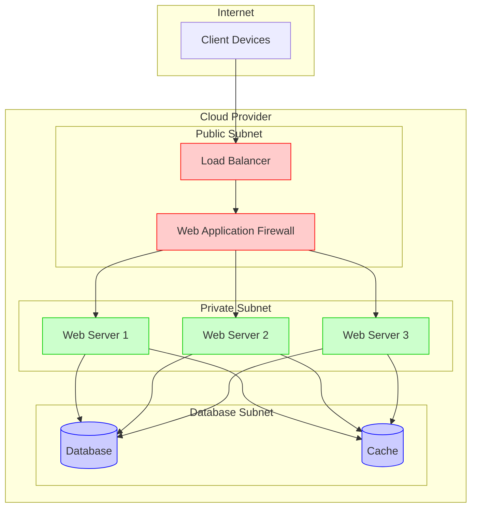

# Basic Cloud Infrastructure Diagram

```mermaid
flowchart TB
    subgraph Internet
        client[Client Devices]
    end

    subgraph Cloud Provider
        subgraph "Public Subnet"
            lb[Load Balancer]
            waf[Web Application Firewall]
        end
        
        subgraph "Private Subnet"
            web1[Web Server 1]
            web2[Web Server 2]
            web3[Web Server 3]
        end
        
        subgraph "Database Subnet"
            db[(Database)]
            cache[(Cache)]
        end
    end
    
    client --> lb
    lb --> waf
    waf --> web1
    waf --> web2
    waf --> web3
    web1 --> db
    web2 --> db
    web3 --> db
    web1 --> cache
    web2 --> cache
    web3 --> cache
    
    classDef public fill:#ffcccc,stroke:#ff0000
    classDef private fill:#ccffcc,stroke:#00cc00
    classDef database fill:#ccccff,stroke:#0000ff
    
    class lb,waf public
    class web1,web2,web3 private
    class db,cache database
```
