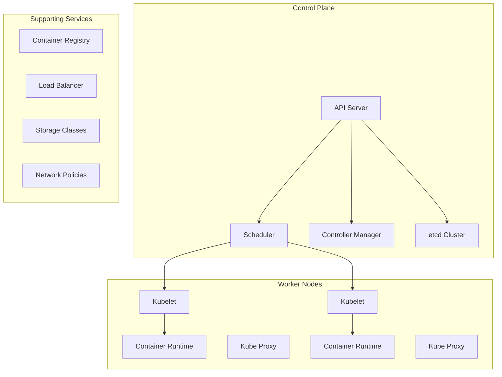
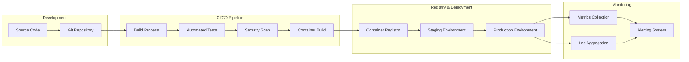
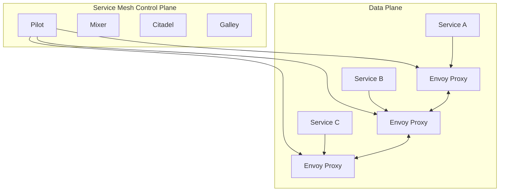
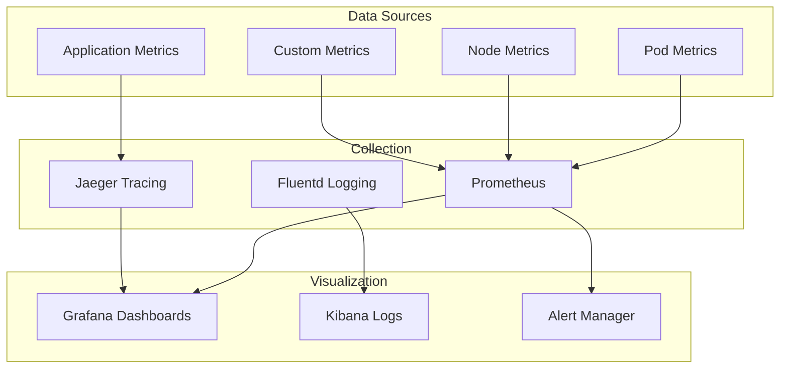

# Container Platform Design

## Overview

Enterprise container platform architecture for scalable, secure, and manageable containerized applications.

## Platform Architecture

### Container Orchestration

### Application Deployment Pipeline

## Platform Components

### Container Registry

- **Features**
  - Image vulnerability scanning
  - Role-based access control
  - Image signing and verification
  - Geo-replication for global access

- **Implementation**
  - Harbor for on-premises
  - Azure Container Registry for cloud
  - Integration with CI/CD pipelines
  - Automated cleanup policies

### Service Mesh

### Storage Solutions

- **Persistent Storage**
  - Container Storage Interface (CSI)
  - Storage classes for different workloads
  - Backup and disaster recovery
  - Performance optimization

- **Configuration Management**
  - ConfigMaps and Secrets
  - External secret management
  - Configuration validation
  - Version control integration

## Security Framework

### Runtime Security

- Container image scanning
- Runtime threat detection
- Network policy enforcement
- Resource quota management

### Access Control

- Role-based access control (RBAC)
- Service account management
- Pod security policies
- Network segmentation

## Monitoring and Observability

### Metrics and Monitoring

### Log Management

- Centralized logging with ELK stack
- Log correlation and analysis
- Security event monitoring
- Audit trail maintenance

## Best Practices

### Development Guidelines

1. **Container Image Standards**
   - Use minimal base images
   - Implement multi-stage builds
   - Regular security updates
   - Proper labeling and tagging

2. **Application Design**
   - Twelve-factor app principles
   - Stateless application design
   - Health check implementation
   - Graceful shutdown handling

### Operational Excellence

1. **Deployment Strategies**
   - Blue-green deployments
   - Canary releases
   - Rolling updates
   - Rollback procedures

2. **Resource Management**
   - Resource requests and limits
   - Horizontal pod autoscaling
   - Cluster autoscaling
   - Cost optimization

## Disaster Recovery

### Backup Strategies

- Persistent volume snapshots
- Configuration backup
- Application data backup
- Cross-region replication

### Recovery Procedures

- Automated failover mechanisms
- Recovery time objectives (RTO)
- Recovery point objectives (RPO)
- Regular disaster recovery testing

## Related Topics

- [Container Security](../containers/security/index.md)
- [Monitoring Architecture](monitoring-architecture.md)
- [DevOps Pipeline](devops-pipeline.md)
