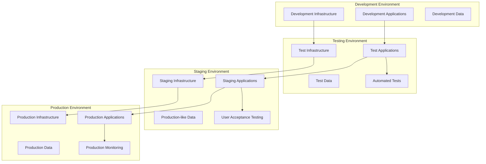
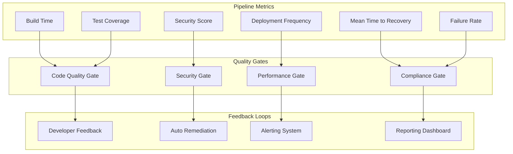

# DevOps Pipeline Architecture

## Overview

Comprehensive DevOps pipeline architecture for automated software delivery, infrastructure as code, and continuous integration/continuous deployment (CI/CD).

## Pipeline Architecture

### CI/CD Pipeline Flow

```mermaid
graph LR
    subgraph "Source Control"
        DevCode[Developer Code]
        FeatureBranch[Feature Branch]
        MainBranch[Main Branch]
        Release[Release Branch]
    end
    
    subgraph "Continuous Integration"
        BuildTrigger[Build Trigger]
        CodeAnalysis[Code Analysis]
        UnitTests[Unit Tests]
        Integration[Integration Tests]
        SecurityScan[Security Scanning]
        Artifacts[Build Artifacts]
    end
    
    subgraph "Continuous Deployment"
        StagingDeploy[Staging Deployment]
        AcceptanceTest[Acceptance Testing]
        ProductionDeploy[Production Deployment]
        Monitoring[Post-Deploy Monitoring]
    end
    
    subgraph "Infrastructure as Code"
        IaCValidation[IaC Validation]
        InfraProvisioning[Infrastructure Provisioning]
        ConfigManagement[Configuration Management]
        ComplianceCheck[Compliance Checking]
    end
    
    DevCode --> FeatureBranch
    FeatureBranch --> BuildTrigger
    BuildTrigger --> CodeAnalysis
    CodeAnalysis --> UnitTests
    UnitTests --> Integration
    Integration --> SecurityScan
    SecurityScan --> Artifacts
    
    Artifacts --> IaCValidation
    IaCValidation --> InfraProvisioning
    InfraProvisioning --> ConfigManagement
    ConfigManagement --> ComplianceCheck
    
    Artifacts --> StagingDeploy
    StagingDeploy --> AcceptanceTest
    AcceptanceTest --> ProductionDeploy
    ProductionDeploy --> Monitoring
    
    FeatureBranch --> MainBranch
    MainBranch --> Release
```



### Multi-Environment Strategy



## Infrastructure as Code

### Terraform Implementation

```hcl
# Infrastructure as Code Example
terraform {
  required_version = ">= 1.0"
  required_providers {
    azurerm = {
      source  = "hashicorp/azurerm"
      version = "~> 3.0"
    }
  }
  
  backend "azurerm" {
    resource_group_name  = "terraform-state-rg"
    storage_account_name = "terraformstate"
    container_name      = "tfstate"
    key                 = "infrastructure.tfstate"
  }
}

provider "azurerm" {
  features {}
}

# Resource Group
resource "azurerm_resource_group" "main" {
  name     = var.resource_group_name
  location = var.location
  
  tags = {
    Environment = var.environment
    Project     = var.project_name
    Owner       = var.owner
  }
}

# Virtual Network
resource "azurerm_virtual_network" "main" {
  name                = "${var.project_name}-vnet"
  address_space       = ["10.0.0.0/16"]
  location            = azurerm_resource_group.main.location
  resource_group_name = azurerm_resource_group.main.name
  
  tags = azurerm_resource_group.main.tags
}

# Subnet
resource "azurerm_subnet" "internal" {
  name                 = "internal"
  resource_group_name  = azurerm_resource_group.main.name
  virtual_network_name = azurerm_virtual_network.main.name
  address_prefixes     = ["10.0.2.0/24"]
}

# Network Security Group
resource "azurerm_network_security_group" "main" {
  name                = "${var.project_name}-nsg"
  location            = azurerm_resource_group.main.location
  resource_group_name = azurerm_resource_group.main.name
  
  security_rule {
    name                       = "HTTP"
    priority                   = 1001
    direction                  = "Inbound"
    access                     = "Allow"
    protocol                   = "Tcp"
    source_port_range          = "*"
    destination_port_range     = "80"
    source_address_prefix      = "*"
    destination_address_prefix = "*"
  }
  
  security_rule {
    name                       = "HTTPS"
    priority                   = 1002
    direction                  = "Inbound"
    access                     = "Allow"
    protocol                   = "Tcp"
    source_port_range          = "*"
    destination_port_range     = "443"
    source_address_prefix      = "*"
    destination_address_prefix = "*"
  }
  
  tags = azurerm_resource_group.main.tags
}

# Application Gateway
resource "azurerm_application_gateway" "main" {
  name                = "${var.project_name}-appgw"
  resource_group_name = azurerm_resource_group.main.name
  location            = azurerm_resource_group.main.location
  
  sku {
    name     = "Standard_v2"
    tier     = "Standard_v2"
    capacity = 2
  }
  
  gateway_ip_configuration {
    name      = "appGatewayIpConfig"
    subnet_id = azurerm_subnet.frontend.id
  }
  
  frontend_port {
    name = "http-port"
    port = 80
  }
  
  frontend_port {
    name = "https-port"
    port = 443
  }
  
  frontend_ip_configuration {
    name                 = "appGatewayFrontendIP"
    public_ip_address_id = azurerm_public_ip.main.id
  }
  
  backend_address_pool {
    name = "appGatewayBackendPool"
  }
  
  backend_http_settings {
    name                  = "appGatewayBackendHttpSettings"
    cookie_based_affinity = "Disabled"
    port                  = 80
    protocol              = "Http"
    request_timeout       = 60
  }
  
  http_listener {
    name                           = "appGatewayHttpListener"
    frontend_ip_configuration_name = "appGatewayFrontendIP"
    frontend_port_name             = "http-port"
    protocol                       = "Http"
  }
  
  request_routing_rule {
    name                       = "rule1"
    rule_type                  = "Basic"
    http_listener_name         = "appGatewayHttpListener"
    backend_address_pool_name  = "appGatewayBackendPool"
    backend_http_settings_name = "appGatewayBackendHttpSettings"
  }
  
  tags = azurerm_resource_group.main.tags
}
```

### Ansible Configuration Management

```yaml
# Ansible Playbook Example
---
- name: Configure Web Servers
  hosts: webservers
  become: yes
  vars:
    app_name: "my-web-app"
    app_version: "{{ lookup('env', 'BUILD_NUMBER') }}"
    app_port: 8080
    
  tasks:
    - name: Update system packages
      apt:
        update_cache: yes
        upgrade: dist
        autoremove: yes
      when: ansible_os_family == "Debian"
      
    - name: Install required packages
      apt:
        name:
          - nginx
          - nodejs
          - npm
          - supervisor
        state: present
      when: ansible_os_family == "Debian"
      
    - name: Create application user
      user:
        name: "{{ app_name }}"
        system: yes
        shell: /bin/false
        home: "/opt/{{ app_name }}"
        createhome: yes
        
    - name: Create application directories
      file:
        path: "{{ item }}"
        state: directory
        owner: "{{ app_name }}"
        group: "{{ app_name }}"
        mode: '0755'
      loop:
        - "/opt/{{ app_name }}/releases"
        - "/opt/{{ app_name }}/shared"
        - "/opt/{{ app_name }}/shared/logs"
        - "/opt/{{ app_name }}/shared/config"
        
    - name: Download application artifact
      get_url:
        url: "{{ artifact_url }}/{{ app_name }}-{{ app_version }}.tar.gz"
        dest: "/tmp/{{ app_name }}-{{ app_version }}.tar.gz"
        mode: '0644'
        
    - name: Extract application
      unarchive:
        src: "/tmp/{{ app_name }}-{{ app_version }}.tar.gz"
        dest: "/opt/{{ app_name }}/releases/"
        owner: "{{ app_name }}"
        group: "{{ app_name }}"
        remote_src: yes
        
    - name: Install application dependencies
      npm:
        path: "/opt/{{ app_name }}/releases/{{ app_name }}-{{ app_version }}"
        production: yes
      become_user: "{{ app_name }}"
      
    - name: Create symlink to current release
      file:
        src: "/opt/{{ app_name }}/releases/{{ app_name }}-{{ app_version }}"
        dest: "/opt/{{ app_name }}/current"
        state: link
        owner: "{{ app_name }}"
        group: "{{ app_name }}"
        
    - name: Configure nginx virtual host
      template:
        src: nginx-vhost.j2
        dest: "/etc/nginx/sites-available/{{ app_name }}"
        backup: yes
      notify: restart nginx
      
    - name: Enable nginx virtual host
      file:
        src: "/etc/nginx/sites-available/{{ app_name }}"
        dest: "/etc/nginx/sites-enabled/{{ app_name }}"
        state: link
      notify: restart nginx
      
    - name: Configure supervisor for application
      template:
        src: supervisor-app.j2
        dest: "/etc/supervisor/conf.d/{{ app_name }}.conf"
        backup: yes
      notify: restart supervisor
      
    - name: Start and enable services
      systemd:
        name: "{{ item }}"
        state: started
        enabled: yes
      loop:
        - nginx
        - supervisor
        
  handlers:
    - name: restart nginx
      systemd:
        name: nginx
        state: restarted
        
    - name: restart supervisor
      systemd:
        name: supervisor
        state: restarted
```

## Pipeline Implementation

### GitHub Actions Workflow

```yaml
# .github/workflows/ci-cd.yml
name: CI/CD Pipeline

on:
  push:
    branches: [ main, develop ]
  pull_request:
    branches: [ main ]

env:
  AZURE_SUBSCRIPTION_ID: ${{ secrets.AZURE_SUBSCRIPTION_ID }}
  AZURE_CLIENT_ID: ${{ secrets.AZURE_CLIENT_ID }}
  AZURE_CLIENT_SECRET: ${{ secrets.AZURE_CLIENT_SECRET }}
  AZURE_TENANT_ID: ${{ secrets.AZURE_TENANT_ID }}

jobs:
  build:
    runs-on: ubuntu-latest
    
    steps:
    - uses: actions/checkout@v3
      with:
        fetch-depth: 0
        
    - name: Setup Node.js
      uses: actions/setup-node@v3
      with:
        node-version: '18'
        cache: 'npm'
        
    - name: Install dependencies
      run: npm ci
      
    - name: Run linting
      run: npm run lint
      
    - name: Run unit tests
      run: npm run test:unit
      
    - name: Run integration tests
      run: npm run test:integration
      
    - name: SonarCloud Scan
      uses: SonarSource/sonarcloud-github-action@master
      env:
        GITHUB_TOKEN: ${{ secrets.GITHUB_TOKEN }}
        SONAR_TOKEN: ${{ secrets.SONAR_TOKEN }}
        
    - name: Security vulnerability scan
      run: npm audit --audit-level high
      
    - name: Build application
      run: npm run build
      
    - name: Build Docker image
      run: |
        docker build -t ${{ github.repository }}:${{ github.sha }} .
        docker tag ${{ github.repository }}:${{ github.sha }} ${{ github.repository }}:latest
        
    - name: Container security scan
      uses: anchore/scan-action@v3
      with:
        image: ${{ github.repository }}:${{ github.sha }}
        fail-build: true
        severity-cutoff: high
        
    - name: Login to Azure Container Registry
      uses: azure/docker-login@v1
      with:
        login-server: myregistry.azurecr.io
        username: ${{ secrets.ACR_USERNAME }}
        password: ${{ secrets.ACR_PASSWORD }}
        
    - name: Push Docker image
      run: |
        docker tag ${{ github.repository }}:${{ github.sha }} myregistry.azurecr.io/${{ github.repository }}:${{ github.sha }}
        docker push myregistry.azurecr.io/${{ github.repository }}:${{ github.sha }}
        
    - name: Upload build artifacts
      uses: actions/upload-artifact@v3
      with:
        name: build-artifacts
        path: |
          dist/
          Dockerfile
          package.json

  infrastructure:
    runs-on: ubuntu-latest
    needs: build
    if: github.ref == 'refs/heads/main'
    
    steps:
    - uses: actions/checkout@v3
    
    - name: Setup Terraform
      uses: hashicorp/setup-terraform@v2
      with:
        terraform_version: 1.5.0
        
    - name: Azure Login
      uses: azure/login@v1
      with:
        creds: ${{ secrets.AZURE_CREDENTIALS }}
        
    - name: Terraform Init
      run: terraform init
      working-directory: ./infrastructure
      
    - name: Terraform Plan
      run: terraform plan -out=tfplan
      working-directory: ./infrastructure
      
    - name: Terraform Apply
      run: terraform apply tfplan
      working-directory: ./infrastructure

  deploy-staging:
    runs-on: ubuntu-latest
    needs: [build, infrastructure]
    if: github.ref == 'refs/heads/develop'
    environment: staging
    
    steps:
    - uses: actions/checkout@v3
    
    - name: Download build artifacts
      uses: actions/download-artifact@v3
      with:
        name: build-artifacts
        
    - name: Deploy to staging
      uses: azure/webapps-deploy@v2
      with:
        app-name: myapp-staging
        slot-name: production
        images: myregistry.azurecr.io/${{ github.repository }}:${{ github.sha }}
        
    - name: Run smoke tests
      run: |
        sleep 30
        curl -f https://myapp-staging.azurewebsites.net/health || exit 1
        
    - name: Run performance tests
      run: |
        npm install -g artillery
        artillery run performance-tests/staging.yml

  deploy-production:
    runs-on: ubuntu-latest
    needs: [build, infrastructure, deploy-staging]
    if: github.ref == 'refs/heads/main'
    environment: production
    
    steps:
    - uses: actions/checkout@v3
    
    - name: Download build artifacts
      uses: actions/download-artifact@v3
      with:
        name: build-artifacts
        
    - name: Deploy to production (blue slot)
      uses: azure/webapps-deploy@v2
      with:
        app-name: myapp-production
        slot-name: blue
        images: myregistry.azurecr.io/${{ github.repository }}:${{ github.sha }}
        
    - name: Warm up blue slot
      run: |
        sleep 60
        curl -f https://myapp-production-blue.azurewebsites.net/health || exit 1
        
    - name: Run production smoke tests
      run: |
        npm run test:smoke -- --url=https://myapp-production-blue.azurewebsites.net
        
    - name: Swap blue to production
      uses: azure/CLI@v1
      with:
        inlineScript: |
          az webapp deployment slot swap \
            --resource-group myapp-rg \
            --name myapp-production \
            --slot blue \
            --target-slot production
            
    - name: Post-deployment monitoring
      run: |
        sleep 120
        npm run test:monitor -- --url=https://myapp-production.azurewebsites.net
```

### Jenkins Pipeline (Groovy)

```groovy
// Jenkinsfile
pipeline {
    agent any
    
    environment {
        DOCKER_REGISTRY = 'myregistry.azurecr.io'
        IMAGE_NAME = 'myapp'
        KUBECONFIG = credentials('kubeconfig')
    }
    
    stages {
        stage('Checkout') {
            steps {
                checkout scm
                script {
                    env.BUILD_VERSION = sh(
                        script: "echo ${env.BUILD_NUMBER}-${env.GIT_COMMIT.take(7)}",
                        returnStdout: true
                    ).trim()
                }
            }
        }
        
        stage('Build & Test') {
            parallel {
                stage('Unit Tests') {
                    steps {
                        sh 'npm ci'
                        sh 'npm run test:unit'
                        publishTestResults testResultsPattern: 'test-results.xml'
                    }
                }
                
                stage('Integration Tests') {
                    steps {
                        sh 'npm run test:integration'
                    }
                }
                
                stage('Security Scan') {
                    steps {
                        sh 'npm audit --audit-level high'
                        script {
                            def scanResult = sh(
                                script: 'npm audit --json',
                                returnStdout: true
                            )
                            writeFile file: 'security-audit.json', text: scanResult
                        }
                        archiveArtifacts artifacts: 'security-audit.json'
                    }
                }
            }
        }
        
        stage('Code Quality') {
            steps {
                withSonarQubeEnv('SonarQube') {
                    sh 'npm run sonar-scanner'
                }
                timeout(time: 10, unit: 'MINUTES') {
                    waitForQualityGate abortPipeline: true
                }
            }
        }
        
        stage('Build Docker Image') {
            steps {
                script {
                    def image = docker.build("${IMAGE_NAME}:${BUILD_VERSION}")
                    docker.withRegistry("https://${DOCKER_REGISTRY}", 'acr-credentials') {
                        image.push()
                        image.push('latest')
                    }
                }
            }
        }
        
        stage('Deploy to Staging') {
            when {
                branch 'develop'
            }
            steps {
                script {
                    sh """
                        helm upgrade --install myapp-staging ./helm-chart \
                            --namespace staging \
                            --set image.tag=${BUILD_VERSION} \
                            --set environment=staging \
                            --wait --timeout=600s
                    """
                }
                
                // Smoke tests
                sh 'npm run test:smoke -- --env=staging'
            }
        }
        
        stage('Deploy to Production') {
            when {
                branch 'main'
            }
            steps {
                input message: 'Deploy to production?', ok: 'Deploy'
                
                script {
                    // Blue-green deployment
                    sh """
                        helm upgrade --install myapp-blue ./helm-chart \
                            --namespace production \
                            --set image.tag=${BUILD_VERSION} \
                            --set environment=production \
                            --set service.name=myapp-blue \
                            --wait --timeout=600s
                    """
                    
                    // Health check
                    sh 'npm run test:health -- --env=production-blue'
                    
                    // Switch traffic
                    sh """
                        kubectl patch service myapp-production \
                            --namespace production \
                            --patch '{"spec":{"selector":{"app":"myapp-blue"}}}'
                    """
                    
                    // Final verification
                    sh 'npm run test:smoke -- --env=production'
                }
            }
        }
    }
    
    post {
        always {
            publishTestResults testResultsPattern: 'test-results/*.xml'
            publishHTML([
                allowMissing: false,
                alwaysLinkToLastBuild: true,
                keepAll: true,
                reportDir: 'coverage',
                reportFiles: 'index.html',
                reportName: 'Coverage Report'
            ])
        }
        
        failure {
            emailext (
                subject: "Pipeline Failed: ${env.JOB_NAME} - ${env.BUILD_NUMBER}",
                body: "Build failed. Check console output at ${env.BUILD_URL}",
                to: "${env.CHANGE_AUTHOR_EMAIL}"
            )
        }
        
        success {
            slackSend(
                color: 'good',
                message: "✅ Deployment successful: ${env.JOB_NAME} - ${env.BUILD_NUMBER}"
            )
        }
    }
}
```

## Monitoring and Observability

### Pipeline Metrics



## Best Practices

### Security Integration

1. **Security as Code**
   - Infrastructure security scanning
   - Container vulnerability assessment
   - Dependency security checks
   - Secret management

2. **Compliance Automation**
   - Automated compliance checks
   - Policy as code implementation
   - Audit trail maintenance
   - Regulatory reporting

### Performance Optimization

1. **Build Optimization**
   - Parallel execution
   - Caching strategies
   - Incremental builds
   - Resource optimization

2. **Deployment Strategies**
   - Blue-green deployments
   - Canary releases
   - Rolling updates
   - Feature flags

## Related Topics

- [Container Platform](container-platform.md)
- [Infrastructure Monitoring](monitoring-architecture.md)
- [Security Architecture](network-security-arch.md)
