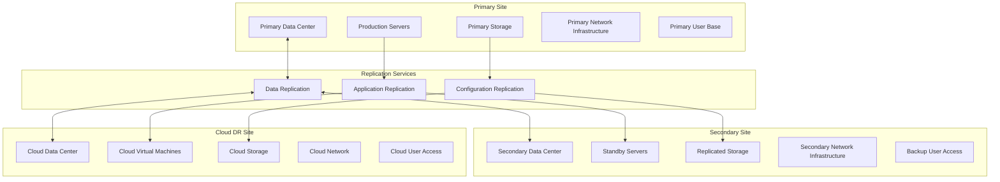
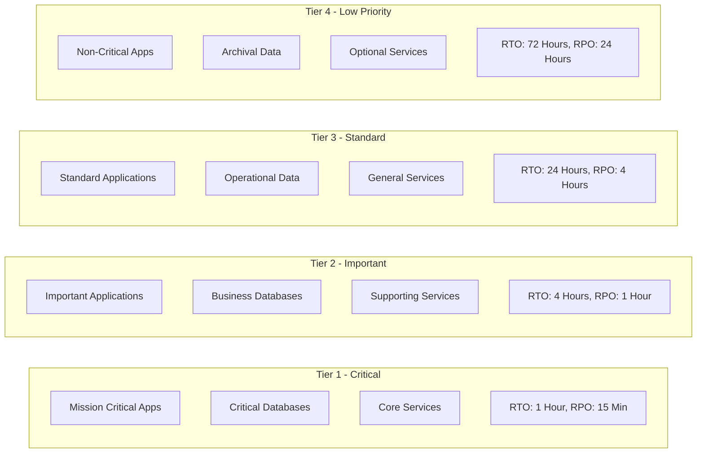
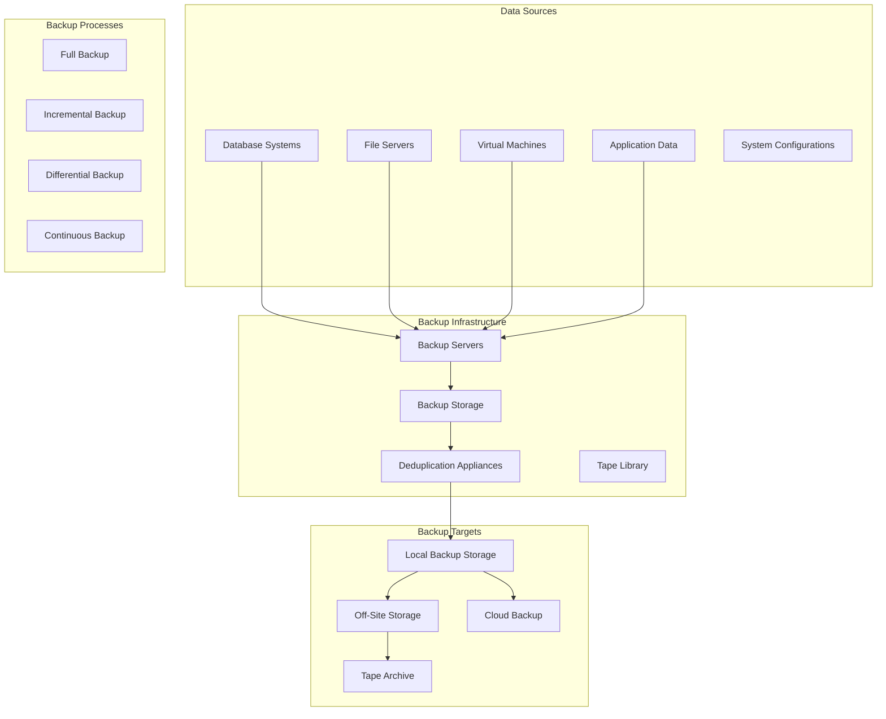
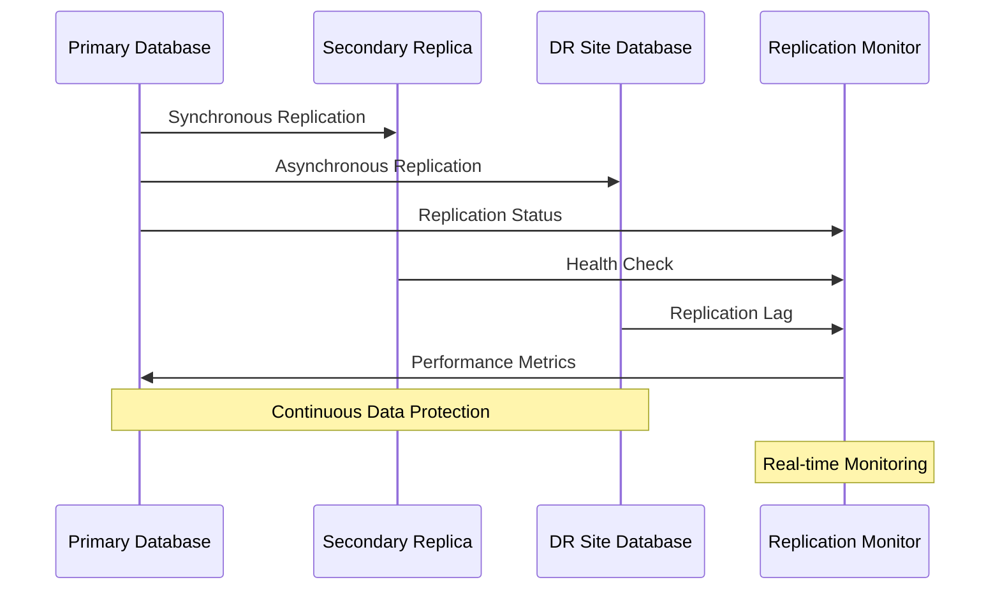
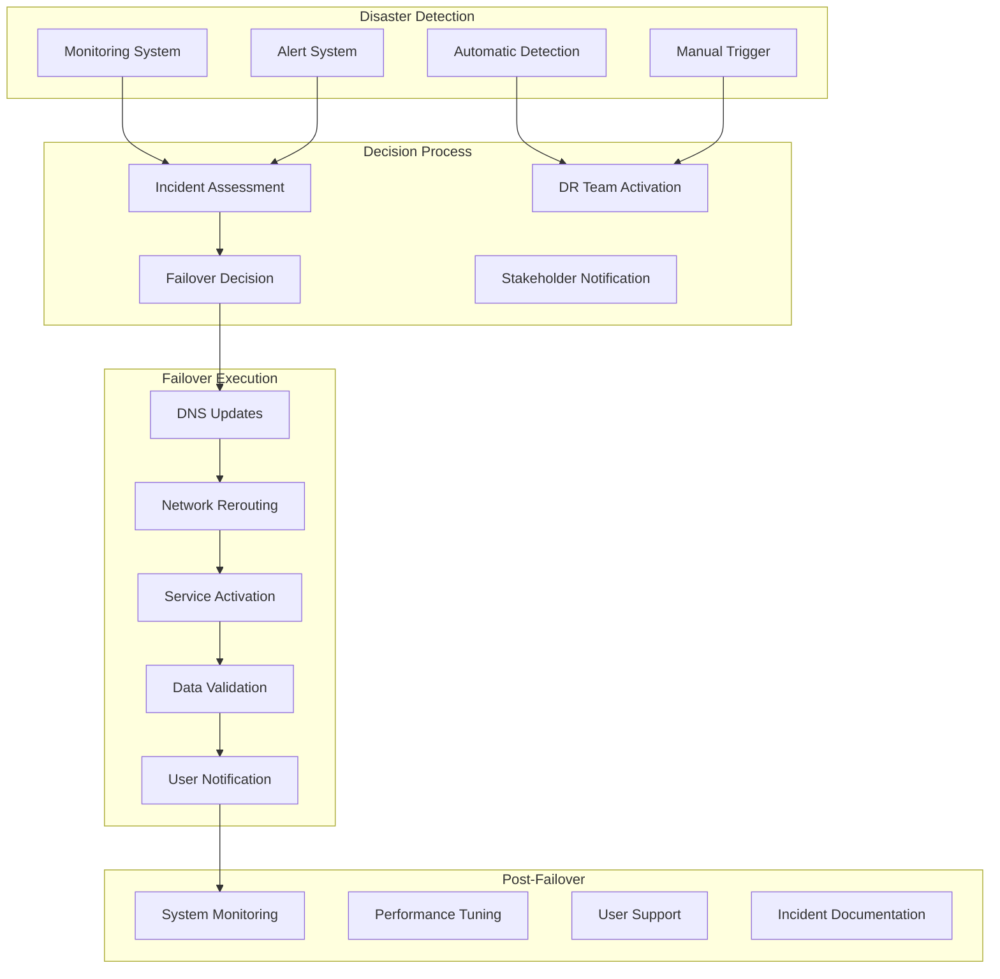
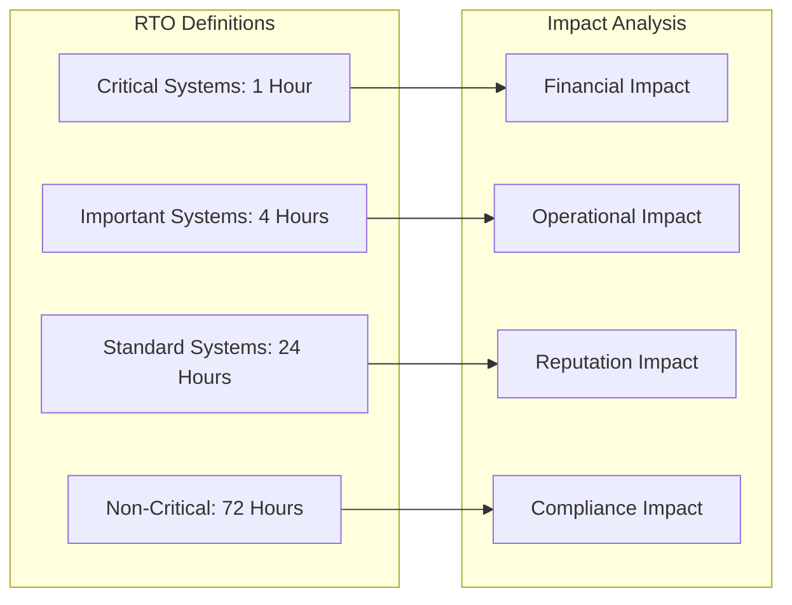
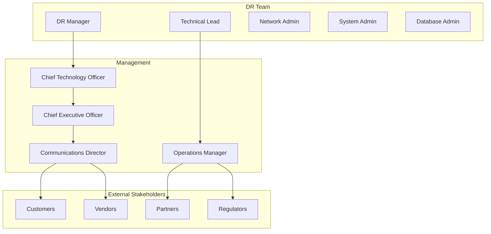

# Disaster Recovery Design

## Overview

Comprehensive disaster recovery architecture and procedures for enterprise infrastructure resilience and business continuity.

## DR Architecture Components

### Multi-Site Design



### Recovery Tiers



## Data Protection Strategy

### Backup Architecture



### Replication Technologies

#### Database Replication



#### Storage Replication

- Block-level replication
- File-level replication
- Application-consistent snapshots
- Cross-site storage mirroring

## Recovery Procedures

### Failover Process



### Recovery Testing

#### Testing Schedule

| Test Type | Frequency | Scope | Duration |
|-----------|-----------|-------|----------|
| Backup Restore Test | Monthly | Individual systems | 2-4 hours |
| Application Failover | Quarterly | Critical applications | 4-8 hours |
| Site Failover Test | Bi-annually | Full DR site | 8-24 hours |
| Disaster Simulation | Annually | Complete infrastructure | 24-72 hours |

#### Test Procedures

1. **Planning Phase**
   - Test scope definition
   - Resource allocation
   - Timeline establishment
   - Risk assessment

2. **Execution Phase**
   - Controlled failover
   - System validation
   - Performance testing
   - User acceptance testing

3. **Validation Phase**
   - Data integrity checks
   - Functionality verification
   - Performance validation
   - Security assessment

4. **Documentation Phase**
   - Test results documentation
   - Issues identification
   - Improvement recommendations
   - Procedure updates

## Business Continuity Planning

### Recovery Objectives

#### Recovery Time Objective (RTO)



#### Recovery Point Objective (RPO)

- Mission Critical: 15 minutes data loss maximum
- Business Critical: 1 hour data loss maximum
- Important: 4 hours data loss maximum
- Standard: 24 hours data loss maximum

### Communication Plan

#### Internal Communication



#### Communication Channels

- Primary: Corporate email and phone systems
- Secondary: Mobile phones and personal email
- Emergency: Satellite phones and radio communication
- Public: Website updates and social media

## Technology Implementation

### Automation Tools

```powershell
# DR Automation Framework
class DisasterRecoveryOrchestrator {
    [string]$PrimarySite
    [string]$DRSite
    [hashtable]$Services
    [string]$ReplicationStatus
    
    DisasterRecoveryOrchestrator([string]$Primary, [string]$DR) {
        $this.PrimarySite = $Primary
        $this.DRSite = $DR
        $this.Services = @{}
        $this.ReplicationStatus = "Active"
    }
    
    [void]InitiateFailover([string]$ServiceTier) {
        Write-Host "Initiating failover for $ServiceTier services" -ForegroundColor Yellow
        
        # Stop services at primary site
        $this.StopPrimaryServices($ServiceTier)
        
        # Start services at DR site
        $this.StartDRServices($ServiceTier)
        
        # Update DNS and routing
        $this.UpdateNetworkRouting()
        
        # Validate services
        $this.ValidateServices($ServiceTier)
    }
    
    [void]StopPrimaryServices([string]$Tier) {
        $TierServices = $this.Services[$Tier]
        foreach ($Service in $TierServices) {
            try {
                Stop-Service $Service -Force
                Write-Host "Stopped service: $Service" -ForegroundColor Green
            }
            catch {
                Write-Error "Failed to stop service $Service : $($_.Exception.Message)"
            }
        }
    }
    
    [void]StartDRServices([string]$Tier) {
        $TierServices = $this.Services[$Tier]
        foreach ($Service in $TierServices) {
            try {
                Invoke-Command -ComputerName $this.DRSite -ScriptBlock {
                    Start-Service $using:Service
                }
                Write-Host "Started DR service: $Service" -ForegroundColor Green
            }
            catch {
                Write-Error "Failed to start DR service $Service : $($_.Exception.Message)"
            }
        }
    }
    
    [void]UpdateNetworkRouting() {
        # Update DNS records
        # Modify load balancer configuration
        # Update firewall rules
        Write-Host "Network routing updated to DR site" -ForegroundColor Green
    }
    
    [bool]ValidateServices([string]$Tier) {
        $ValidationResults = @()
        $TierServices = $this.Services[$Tier]
        
        foreach ($Service in $TierServices) {
            $ServiceCheck = $this.TestServiceHealth($Service)
            $ValidationResults += $ServiceCheck
        }
        
        return ($ValidationResults | Where-Object {$_ -eq $false}).Count -eq 0
    }
    
    [bool]TestServiceHealth([string]$Service) {
        # Implement service-specific health checks
        return $true
    }
}

# DR Testing Framework
function Start-DRTest {
    [CmdletBinding()]
    param(
        [Parameter(Mandatory)]
        [ValidateSet("Backup", "Application", "Site", "Full")]
        [string]$TestType,
        
        [Parameter(Mandatory)]
        [string]$TestScope,
        
        [Parameter()]
        [string]$NotificationList = "dr-team@company.com"
    )
    
    $TestStart = Get-Date
    Write-Host "Starting DR Test: $TestType" -ForegroundColor Cyan
    
    try {
        switch ($TestType) {
            "Backup" {
                $Result = Test-BackupRestore -Scope $TestScope
            }
            "Application" {
                $Result = Test-ApplicationFailover -Scope $TestScope
            }
            "Site" {
                $Result = Test-SiteFailover -Scope $TestScope
            }
            "Full" {
                $Result = Test-FullDR -Scope $TestScope
            }
        }
        
        $TestEnd = Get-Date
        $Duration = $TestEnd - $TestStart
        
        $TestReport = @{
            TestType = $TestType
            Scope = $TestScope
            StartTime = $TestStart
            EndTime = $TestEnd
            Duration = $Duration
            Result = $Result
            Issues = $Result.Issues
            Recommendations = $Result.Recommendations
        }
        
        Send-DRTestReport -Report $TestReport -Recipients $NotificationList
    }
    catch {
        Write-Error "DR Test failed: $($_.Exception.Message)"
    }
}
```

### Monitoring and Alerting

- Replication lag monitoring
- Backup job status tracking
- DR site health checks
- Network connectivity monitoring
- Performance baseline comparison

## Cost Optimization

### DR Cost Management

1. **Tiered Recovery Strategy**
   - Match recovery requirements to business criticality
   - Use appropriate technology for each tier
   - Regular cost-benefit analysis

2. **Cloud DR Solutions**
   - Pay-as-you-go model
   - Reserved capacity for critical systems
   - Automated scaling during disasters

3. **Resource Optimization**
   - Right-sizing DR infrastructure
   - Shared DR sites for multiple applications
   - Regular capacity planning reviews

## Compliance and Governance

### Regulatory Requirements

- Data residency requirements
- Recovery time mandates
- Audit trail maintenance
- Compliance reporting

### Documentation Standards

- DR procedures documentation
- Test result records
- Incident response logs
- Change management records

## Related Topics

- [Business Continuity Planning](../disaster-recovery/index.md)
- [Backup and Recovery](../disaster-recovery/index.md)
- [Infrastructure Monitoring](monitoring-architecture.md)
