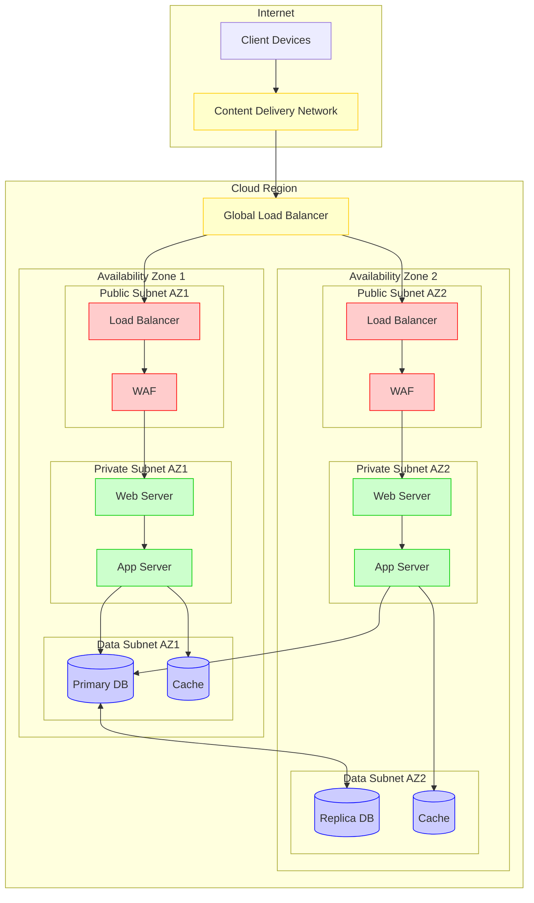

# High Availability Cloud Infrastructure

```mermaid
flowchart TB
    subgraph Internet
        client[Client Devices]
        cdn[Content Delivery Network]
    end

    subgraph "Cloud Region"
        subgraph "Availability Zone 1"
            subgraph "Public Subnet AZ1"
                lb1[Load Balancer]
                waf1[WAF]
            end
            
            subgraph "Private Subnet AZ1"
                web1[Web Server]
                app1[App Server]
            end
            
            subgraph "Data Subnet AZ1"
                db1[(Primary DB)]
                cache1[(Cache)]
            end
        end
        
        subgraph "Availability Zone 2"
            subgraph "Public Subnet AZ2"
                lb2[Load Balancer]
                waf2[WAF]
            end
            
            subgraph "Private Subnet AZ2"
                web2[Web Server]
                app2[App Server]
            end
            
            subgraph "Data Subnet AZ2"
                db2[(Replica DB)]
                cache2[(Cache)]
            end
        end
        
        glb[Global Load Balancer]
    end
    
    client --> cdn
    cdn --> glb
    glb --> lb1
    glb --> lb2
    lb1 --> waf1
    lb2 --> waf2
    waf1 --> web1
    waf2 --> web2
    web1 --> app1
    web2 --> app2
    app1 --> db1
    app2 --> db1
    app1 --> cache1
    app2 --> cache2
    db1 <--> db2
    
    classDef public fill:#ffcccc,stroke:#ff0000
    classDef private fill:#ccffcc,stroke:#00cc00
    classDef database fill:#ccccff,stroke:#0000ff
    classDef global fill:#ffffcc,stroke:#ffcc00
    
    class lb1,lb2,waf1,waf2 public
    class web1,web2,app1,app2 private
    class db1,db2,cache1,cache2 database
    class cdn,glb global
```
