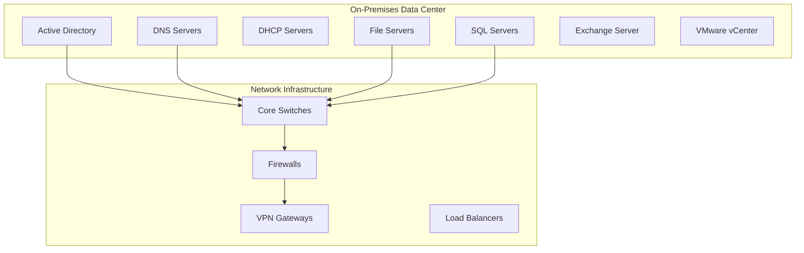
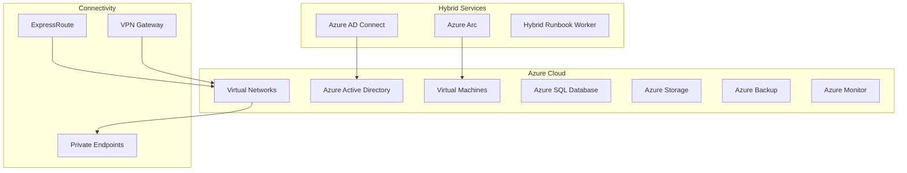

# Hybrid Cloud Integration

## Overview

This document outlines the architecture and implementation patterns for integrating on-premises infrastructure with cloud services, creating a seamless hybrid environment.

## Architecture Components

### On-Premises Infrastructure

### Cloud Integration Points

## Implementation Strategy

### Phase 1: Assessment and Planning

1. **Current State Analysis**
   - Infrastructure inventory
   - Application dependencies
   - Security requirements
   - Compliance needs

2. **Cloud Readiness Assessment**
   - Workload compatibility
   - Network bandwidth requirements
   - Security gap analysis
   - Cost modeling

### Phase 2: Foundation Setup

1. **Network Connectivity**
   - ExpressRoute or VPN setup
   - Routing configuration
   - Firewall rules
   - DNS integration

2. **Identity Integration**
   - Azure AD Connect deployment
   - Single sign-on configuration
   - Multi-factor authentication
   - Conditional access policies

### Phase 3: Workload Migration

1. **Pilot Migration**
   - Non-critical workloads first
   - Testing and validation
   - Performance monitoring
   - User acceptance testing

2. **Production Migration**
   - Phased approach
   - Rollback procedures
   - Monitoring and alerting
   - Documentation updates

## Best Practices

### Security Considerations

- Implement zero trust architecture
- Use private endpoints for Azure services
- Enable Azure Security Center
- Configure Azure Sentinel for SIEM

### Monitoring and Management

- Centralized logging with Azure Monitor
- Hybrid monitoring with System Center
- Performance baseline establishment
- Automated alerting configuration

### Cost Optimization

- Right-sizing cloud resources
- Reserved instance planning
- Azure Cost Management implementation
- Regular cost reviews

## Related Topics

- [Network Security Architecture](network-security-arch.md)
- [Zero Trust Implementation](zero-trust-model.md)
- [Infrastructure Monitoring](../monitoring/index.md)
