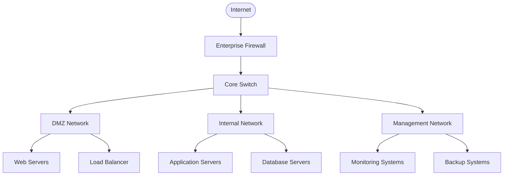
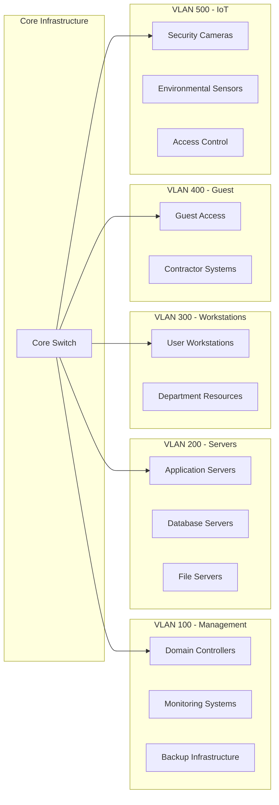
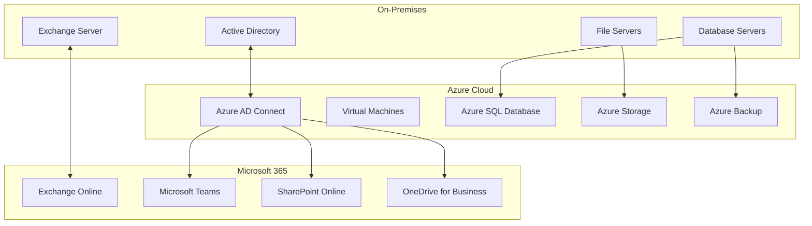
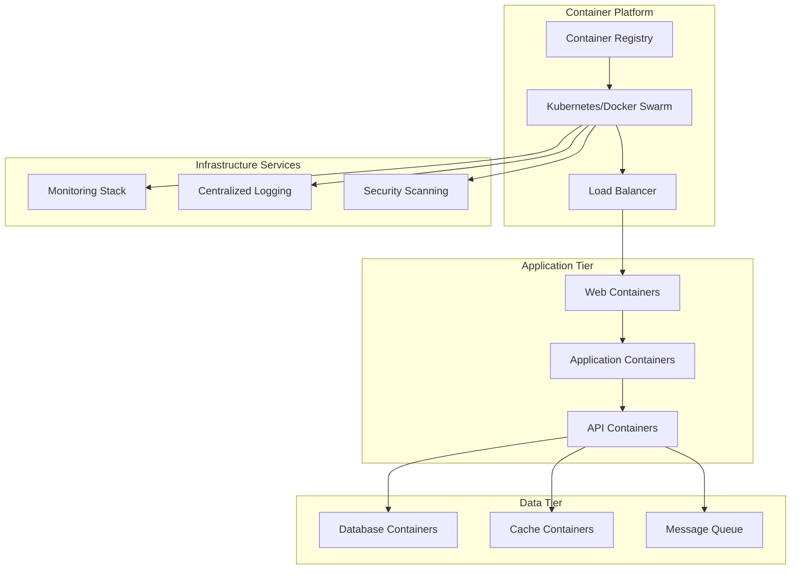
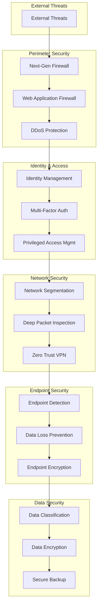
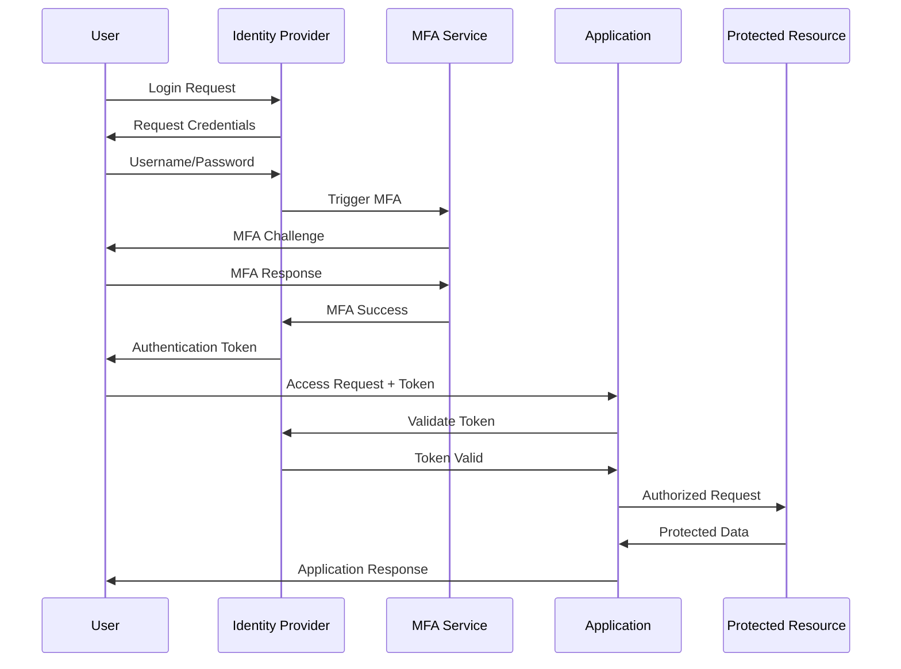
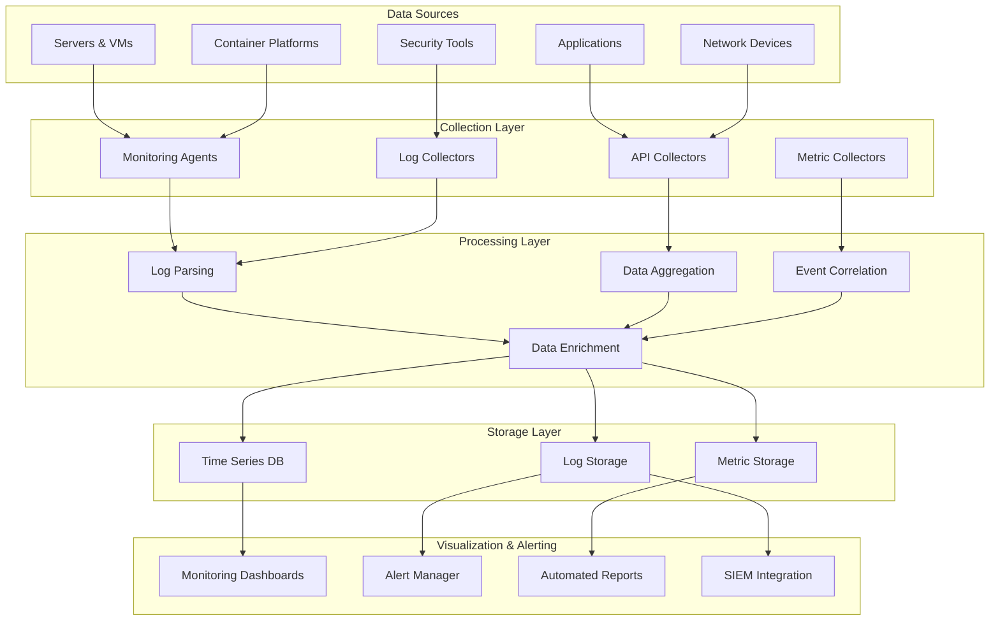
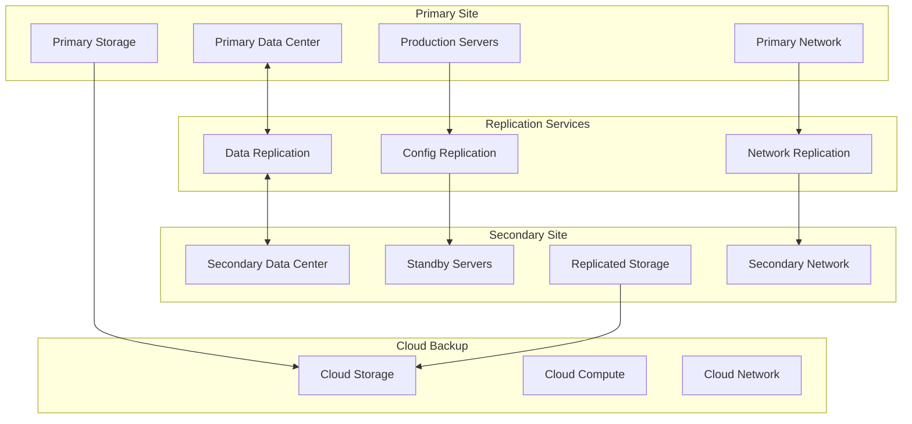
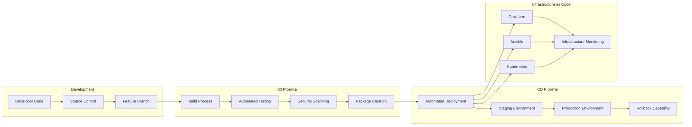

# Infrastructure Diagrams

This section contains comprehensive diagrams, architectures, and visual documentation for enterprise infrastructure components and designs.

## Network Architecture Diagrams

### Enterprise Network Topology

### VLAN Segmentation Design

## Cloud Architecture Diagrams

### Hybrid Cloud Infrastructure

### Container Infrastructure

## Security Architecture Diagrams

### Zero Trust Network Model

### Identity Management Flow

## Monitoring & Observability

### Monitoring Architecture

## Disaster Recovery Architecture

### Multi-Site DR Design

## Infrastructure Automation

### CI/CD Pipeline Architecture

## Available Detailed Diagrams

- [Basic Cloud Infrastructure](basic-cloud-infra.md) - Illustrates a basic three-tier web application in the cloud
- [Network Security Architecture](network-security-arch.md) - Comprehensive network security design  
- [Hybrid Cloud Integration](hybrid-cloud-integration.md) - On-premises to cloud integration patterns
- [Container Platform Design](container-platform.md) - Enterprise container orchestration
- [Monitoring and Observability](monitoring-architecture.md) - Complete monitoring solution design
- [Disaster Recovery Planning](disaster-recovery-design.md) - Multi-site DR architecture
- [Zero Trust Implementation](zero-trust-model.md) - Zero trust security framework
- [DevOps Pipeline Architecture](devops-pipeline.md) - CI/CD and automation workflows

## Diagram Standards

### Mermaid Diagrams

All diagrams in this section use Mermaid.js syntax for consistency and easy maintenance. Mermaid provides:

- Version control friendly text-based diagrams
- Automatic layout and rendering
- Consistent styling across all documentation
- Easy updates and modifications

### Naming Conventions

- Use descriptive names for all diagram elements
- Follow consistent color coding (blue for infrastructure, green for security, orange for monitoring)
- Include legends when diagrams become complex
- Maintain consistent arrow styles and directions

### Documentation Requirements

Each diagram should include:

- Clear title and purpose
- Component descriptions
- Data flow explanations
- Security considerations
- Maintenance procedures
