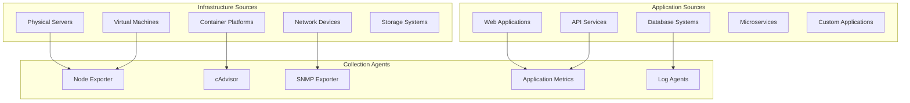
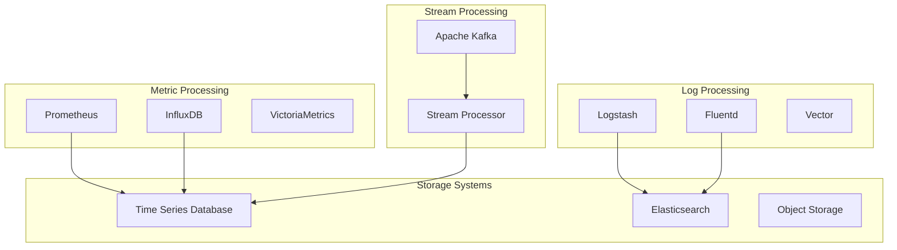
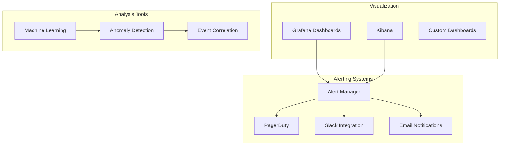
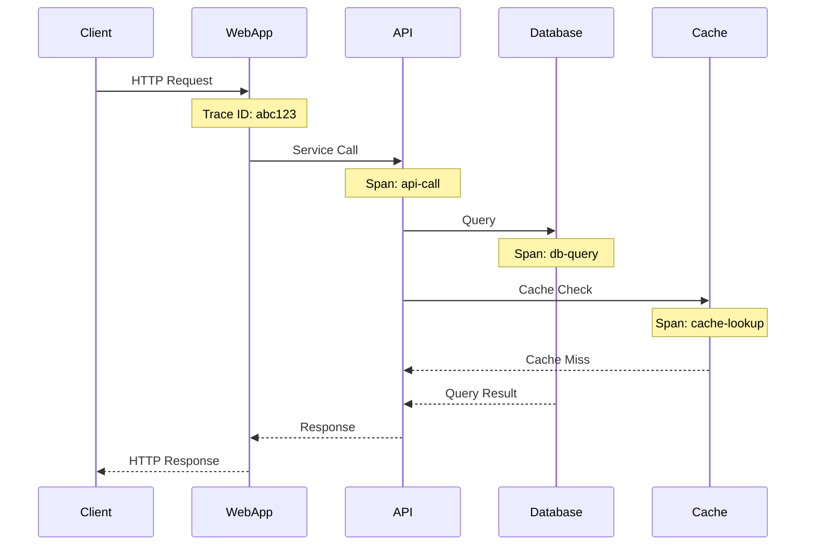
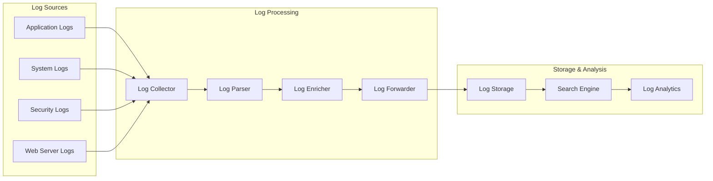
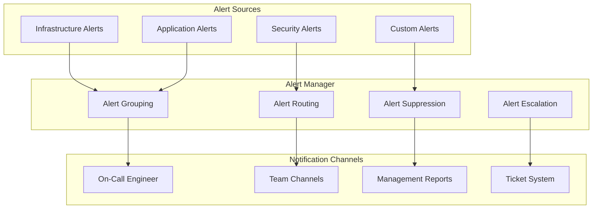

# Monitoring Architecture

## Overview

Comprehensive monitoring and observability architecture for enterprise infrastructure and applications.

## Monitoring Stack Architecture

### Data Collection Layer



### Processing and Storage



### Visualization and Alerting



## Monitoring Components

### Infrastructure Monitoring

#### Server and VM Monitoring

```yaml
# Prometheus Configuration
global:
  scrape_interval: 15s
  evaluation_interval: 15s

rule_files:
  - "infrastructure_rules.yml"
  - "application_rules.yml"

scrape_configs:
  - job_name: 'node-exporter'
    static_configs:
      - targets: ['server1:9100', 'server2:9100']
    
  - job_name: 'windows-exporter'
    static_configs:
      - targets: ['winserver1:9182', 'winserver2:9182']
```

#### Network Monitoring

- SNMP monitoring for switches and routers
- Flow-based monitoring (NetFlow, sFlow)
- Network latency and bandwidth tracking
- Security event correlation

#### Storage Monitoring

- Disk usage and performance metrics
- RAID status monitoring
- Backup job monitoring
- Storage array health checks

### Application Performance Monitoring

#### Distributed Tracing



#### Application Metrics

- Response time monitoring
- Error rate tracking
- Throughput measurements
- Resource utilization

### Log Management

#### Centralized Logging



#### Log Analysis Patterns

- Structured logging implementation
- Log correlation and aggregation
- Security event detection
- Performance issue identification

## Alerting Strategy

### Alert Classification

1. **Critical Alerts**
   - Service outages
   - Security breaches
   - Data loss events
   - Infrastructure failures

2. **Warning Alerts**
   - Performance degradation
   - Resource thresholds
   - Capacity planning
   - Maintenance reminders

3. **Informational Alerts**
   - Deployment notifications
   - Backup completions
   - Scheduled maintenance
   - System updates

### Alert Routing



## Dashboard Design

### Executive Dashboards

- Overall system health
- Service level indicators
- Business impact metrics
- Cost and capacity trends

### Operational Dashboards

- Real-time system status
- Performance metrics
- Error tracking
- Resource utilization

### Troubleshooting Dashboards

- Detailed diagnostic information
- Historical trend analysis
- Correlation views
- Root cause analysis tools

## Best Practices

### Monitoring Strategy

1. **Define Clear Objectives**
   - Service level objectives (SLOs)
   - Key performance indicators (KPIs)
   - Business impact metrics
   - User experience measures

2. **Implement Effective Alerting**
   - Avoid alert fatigue
   - Context-rich notifications
   - Proper escalation procedures
   - Regular alert review

### Data Management

1. **Retention Policies**
   - Hot data (recent, high resolution)
   - Warm data (medium term, reduced resolution)
   - Cold data (long term, archived)
   - Compliance requirements

2. **Performance Optimization**
   - Efficient data collection
   - Proper indexing strategies
   - Query optimization
   - Resource scaling

## Security Considerations

### Monitoring Security

- Secure communication channels
- Authentication and authorization
- Data encryption at rest and in transit
- Access control and audit trails

### Security Monitoring

- Threat detection and response
- Compliance monitoring
- Security event correlation
- Incident response integration

## Related Topics

- [Security Architecture](network-security-arch.md)
- [Container Platform](container-platform.md)
- [Infrastructure Overview](../index.md)
