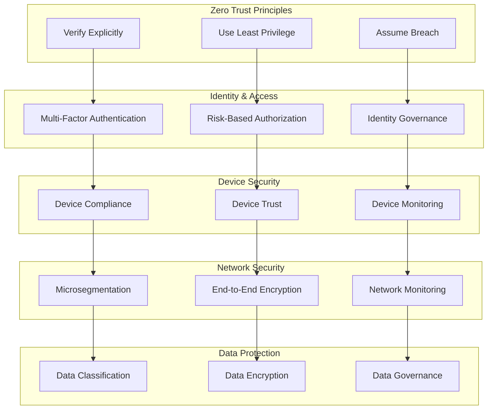
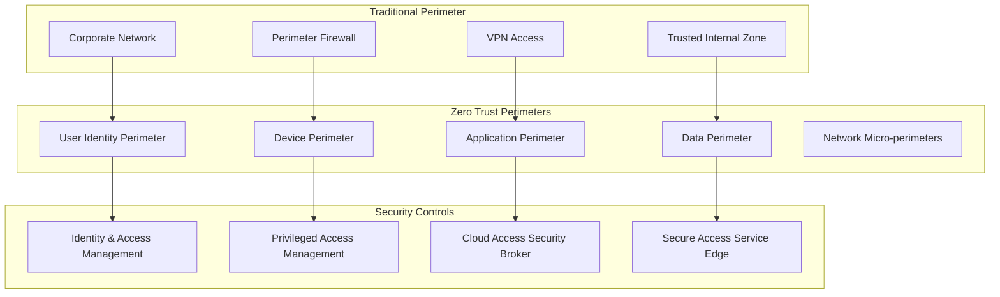
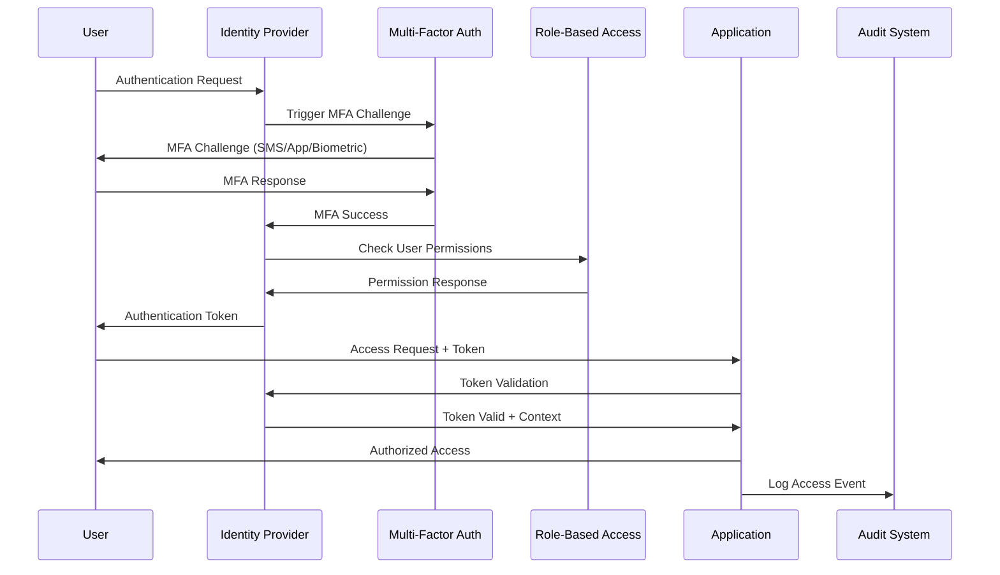
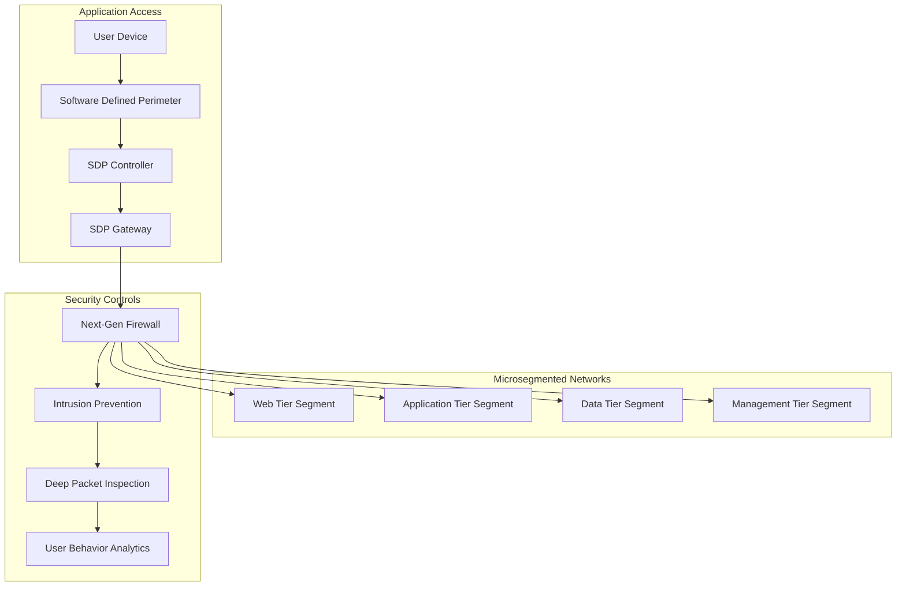
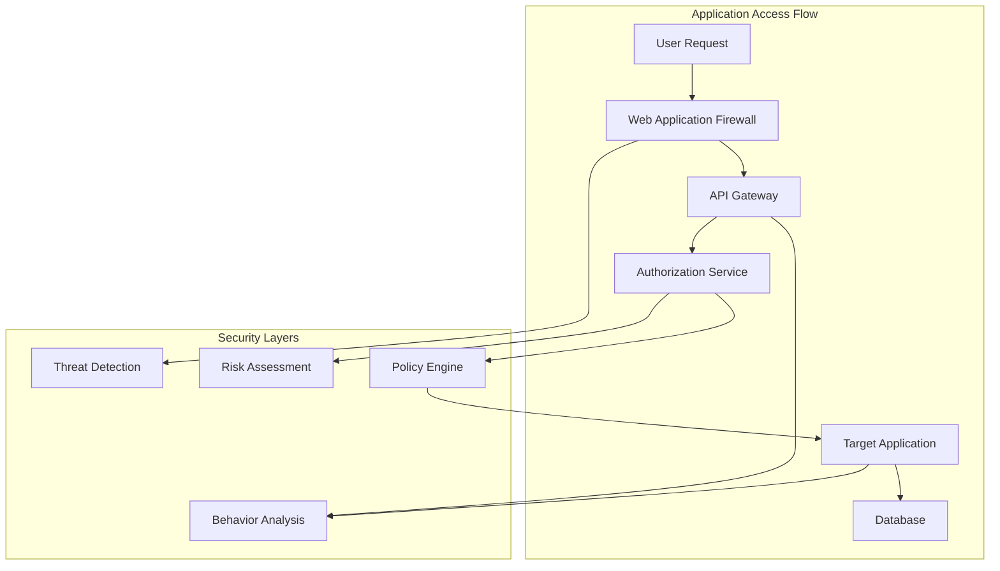
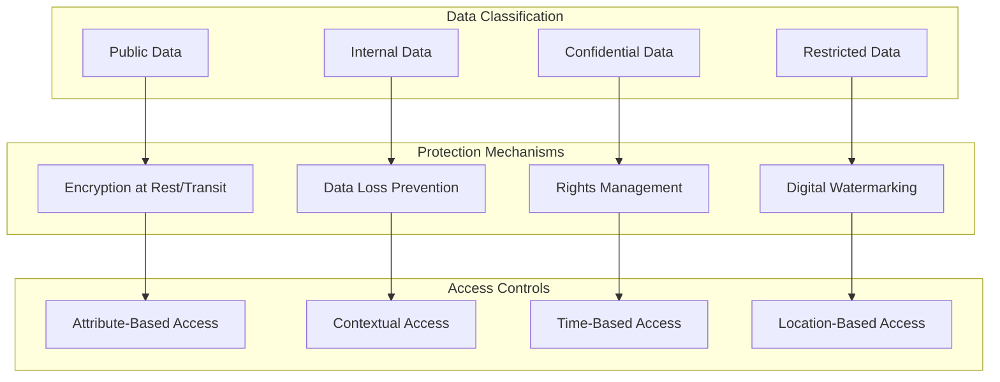
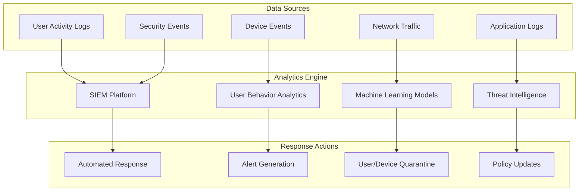

# Zero Trust Implementation

## Overview

Zero Trust security architecture implementation guide for enterprise environments, focusing on "never trust, always verify" principles.

## Zero Trust Architecture

### Core Principles



### Security Perimeters



## Implementation Framework

### Phase 1: Foundation Setup

#### Identity and Access Management



#### Device Trust

```powershell
# Device Compliance Framework
class DeviceComplianceManager {
    [hashtable]$CompliancePolicies
    [hashtable]$DeviceInventory
    [string]$ComplianceEndpoint
    
    DeviceComplianceManager() {
        $this.CompliancePolicies = @{
            'Windows' = @{
                'OSVersion' = '10.0.19041'
                'AntivirusEnabled' = $true
                'EncryptionRequired' = $true
                'FirewallEnabled' = $true
                'AutoUpdatesEnabled' = $true
            }
            'macOS' = @{
                'OSVersion' = '11.0'
                'GatekeeperEnabled' = $true
                'FirewallEnabled' = $true
                'DiskEncryption' = $true
                'SystemIntegrityProtection' = $true
            }
            'iOS' = @{
                'OSVersion' = '14.0'
                'PasscodeRequired' = $true
                'JailbreakDetection' = $true
                'AppStoreOnly' = $true
                'RemoteWipeEnabled' = $true
            }
        }
        $this.DeviceInventory = @{}
        $this.ComplianceEndpoint = "https://compliance.company.com/api"
    }
    
    [bool]EvaluateDeviceCompliance([hashtable]$DeviceInfo) {
        $DeviceType = $DeviceInfo.OS
        $RequiredPolicies = $this.CompliancePolicies[$DeviceType]
        
        foreach ($Policy in $RequiredPolicies.Keys) {
            $RequiredValue = $RequiredPolicies[$Policy]
            $ActualValue = $DeviceInfo[$Policy]
            
            if ($ActualValue -ne $RequiredValue) {
                Write-Warning "Device compliance failure: $Policy expected $RequiredValue, got $ActualValue"
                return $false
            }
        }
        
        return $true
    }
    
    [void]EnforceCompliance([string]$DeviceId, [hashtable]$DeviceInfo) {
        $IsCompliant = $this.EvaluateDeviceCompliance($DeviceInfo)
        
        if (-not $IsCompliant) {
            $this.TriggerComplianceRemediation($DeviceId, $DeviceInfo)
        } else {
            $this.UpdateDeviceStatus($DeviceId, "Compliant")
        }
    }
    
    [void]TriggerComplianceRemediation([string]$DeviceId, [hashtable]$DeviceInfo) {
        # Send remediation instructions to device
        $RemediationActions = $this.GenerateRemediationPlan($DeviceInfo)
        $this.SendRemediationNotification($DeviceId, $RemediationActions)
        $this.UpdateDeviceStatus($DeviceId, "Non-Compliant")
    }
    
    [array]GenerateRemediationPlan([hashtable]$DeviceInfo) {
        $Actions = @()
        
        # Add specific remediation actions based on compliance failures
        if ($DeviceInfo.AntivirusEnabled -eq $false) {
            $Actions += "Enable and update antivirus software"
        }
        
        if ($DeviceInfo.EncryptionRequired -eq $false) {
            $Actions += "Enable disk encryption"
        }
        
        if ($DeviceInfo.FirewallEnabled -eq $false) {
            $Actions += "Enable Windows Firewall"
        }
        
        return $Actions
    }
}
```

### Phase 2: Network Microsegmentation

#### Software-Defined Perimeters



#### Network Access Control

```yaml
# Microsegmentation Policy Example
apiVersion: networking.k8s.io/v1
kind: NetworkPolicy
metadata:
  name: zero-trust-policy
  namespace: production
spec:
  podSelector:
    matchLabels:
      tier: backend
  policyTypes:
  - Ingress
  - Egress
  ingress:
  - from:
    - podSelector:
        matchLabels:
          tier: frontend
    - namespaceSelector:
        matchLabels:
          name: api-gateway
    ports:
    - protocol: TCP
      port: 8080
  egress:
  - to:
    - podSelector:
        matchLabels:
          tier: database
    ports:
    - protocol: TCP
      port: 5432
  - to: []
    ports:
    - protocol: TCP
      port: 443
```

### Phase 3: Application Security

#### Application-Level Controls



#### API Security

```javascript
// Zero Trust API Security Middleware
const zeroTrustMiddleware = {
    // Token validation with context
    validateToken: async (req, res, next) => {
        try {
            const token = req.headers.authorization?.split(' ')[1];
            const decodedToken = jwt.verify(token, process.env.JWT_SECRET);
            
            // Validate token context
            const tokenContext = await validateTokenContext(decodedToken);
            if (!tokenContext.valid) {
                return res.status(401).json({ error: 'Invalid token context' });
            }
            
            req.user = decodedToken;
            req.context = tokenContext;
            next();
        } catch (error) {
            res.status(401).json({ error: 'Token validation failed' });
        }
    },
    
    // Risk-based authorization
    riskBasedAuth: async (req, res, next) => {
        const riskScore = await calculateRiskScore({
            user: req.user,
            device: req.headers['user-agent'],
            location: req.ip,
            time: new Date(),
            resource: req.path
        });
        
        if (riskScore > RISK_THRESHOLD) {
            // Require additional authentication
            return res.status(403).json({ 
                error: 'Additional authentication required',
                mfaChallenge: true
            });
        }
        
        req.riskScore = riskScore;
        next();
    },
    
    // Resource-level permissions
    checkPermissions: (resource, action) => {
        return async (req, res, next) => {
            const hasPermission = await checkUserPermission(
                req.user.id,
                resource,
                action,
                req.context
            );
            
            if (!hasPermission) {
                return res.status(403).json({ error: 'Insufficient permissions' });
            }
            
            next();
        };
    }
};

// Usage example
app.get('/api/sensitive-data',
    zeroTrustMiddleware.validateToken,
    zeroTrustMiddleware.riskBasedAuth,
    zeroTrustMiddleware.checkPermissions('sensitive-data', 'read'),
    (req, res) => {
        // Handle request
    }
);
```

### Phase 4: Data Protection

#### Data Classification and Protection



## Monitoring and Analytics

### Security Monitoring



### Continuous Risk Assessment

```powershell
# Continuous Risk Assessment Engine
class ZeroTrustRiskEngine {
    [hashtable]$RiskFactors
    [hashtable]$BaselineProfiles
    [double]$RiskThreshold
    
    ZeroTrustRiskEngine() {
        $this.RiskFactors = @{
            'Location' = @{
                'Corporate' = 0.1
                'Home' = 0.3
                'Public' = 0.7
                'Unknown' = 0.9
            }
            'Device' = @{
                'Managed' = 0.1
                'BYOD_Compliant' = 0.3
                'BYOD_NonCompliant' = 0.8
                'Unknown' = 0.9
            }
            'Time' = @{
                'BusinessHours' = 0.1
                'AfterHours' = 0.4
                'Weekend' = 0.6
                'Holiday' = 0.7
            }
            'Behavior' = @{
                'Normal' = 0.1
                'Suspicious' = 0.6
                'Anomalous' = 0.8
                'Malicious' = 1.0
            }
        }
        $this.BaselineProfiles = @{}
        $this.RiskThreshold = 0.5
    }
    
    [double]CalculateRiskScore([hashtable]$Context) {
        $LocationRisk = $this.RiskFactors.Location[$Context.Location]
        $DeviceRisk = $this.RiskFactors.Device[$Context.DeviceType]
        $TimeRisk = $this.RiskFactors.Time[$Context.TimeCategory]
        $BehaviorRisk = $this.RiskFactors.Behavior[$Context.BehaviorCategory]
        
        # Weighted risk calculation
        $RiskScore = ($LocationRisk * 0.2) + 
                     ($DeviceRisk * 0.3) + 
                     ($TimeRisk * 0.2) + 
                     ($BehaviorRisk * 0.3)
        
        return [Math]::Round($RiskScore, 2)
    }
    
    [string]DetermineAccessPolicy([double]$RiskScore) {
        if ($RiskScore -le 0.3) {
            return "Allow"
        }
        elseif ($RiskScore -le 0.6) {
            return "Allow_MFA"
        }
        elseif ($RiskScore -le 0.8) {
            return "Challenge"
        }
        else {
            return "Deny"
        }
    }
    
    [void]UpdateUserBaseline([string]$UserId, [hashtable]$Activity) {
        if (-not $this.BaselineProfiles.ContainsKey($UserId)) {
            $this.BaselineProfiles[$UserId] = @{
                'TypicalLocations' = @()
                'TypicalDevices' = @()
                'TypicalHours' = @()
                'TypicalResources' = @()
            }
        }
        
        # Update baseline with new activity
        $Profile = $this.BaselineProfiles[$UserId]
        $Profile.TypicalLocations += $Activity.Location
        $Profile.TypicalDevices += $Activity.Device
        $Profile.TypicalHours += $Activity.AccessTime
        $Profile.TypicalResources += $Activity.Resource
        
        # Keep only recent data (sliding window)
        $this.TrimBaseline($UserId)
    }
    
    [string]EvaluateBehavior([string]$UserId, [hashtable]$CurrentActivity) {
        if (-not $this.BaselineProfiles.ContainsKey($UserId)) {
            return "Unknown"
        }
        
        $Profile = $this.BaselineProfiles[$UserId]
        $AnomalyScore = 0
        
        # Check location anomaly
        if ($CurrentActivity.Location -notin $Profile.TypicalLocations) {
            $AnomalyScore += 0.3
        }
        
        # Check device anomaly
        if ($CurrentActivity.Device -notin $Profile.TypicalDevices) {
            $AnomalyScore += 0.2
        }
        
        # Check time anomaly
        if ($CurrentActivity.AccessTime -notin $Profile.TypicalHours) {
            $AnomalyScore += 0.2
        }
        
        # Check resource anomaly
        if ($CurrentActivity.Resource -notin $Profile.TypicalResources) {
            $AnomalyScore += 0.3
        }
        
        if ($AnomalyScore -ge 0.7) {
            return "Anomalous"
        }
        elseif ($AnomalyScore -ge 0.4) {
            return "Suspicious"
        }
        else {
            return "Normal"
        }
    }
}
```

## Implementation Best Practices

### Migration Strategy

1. **Phased Approach**
   - Start with external-facing applications
   - Gradually extend to internal systems
   - Implement for privileged access first
   - Expand to all users and devices

2. **Pilot Programs**
   - Select low-risk applications for initial deployment
   - Gather feedback and refine policies
   - Validate technical implementation
   - Train support teams

### Change Management

1. **User Education**
   - Zero trust principles training
   - New security procedures
   - Technology adoption support
   - Ongoing awareness programs

2. **Technical Training**
   - Administrator training
   - Security team upskilling
   - Vendor-specific certification
   - Cross-functional collaboration

## Cost Considerations

### Investment Areas

- Identity and access management platforms
- Device management solutions
- Network security tools
- Application security controls
- Monitoring and analytics platforms

### ROI Metrics

- Reduced security incidents
- Faster incident response
- Improved compliance posture
- Reduced operational overhead
- Enhanced user productivity

## Related Topics

- [Identity Management](../security/iam/index.md)
- [Network Security](network-security-arch.md)
- [Infrastructure Security](../security/index.md)
