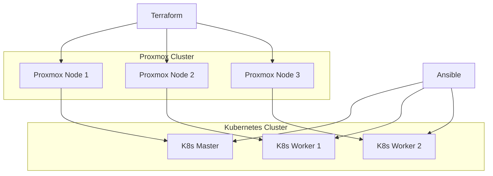

This document outlines the complete setup of a home lab infrastructure designed for learning and development. The lab consists of a Proxmox virtualization cluster, Kubernetes container orchestration, and infrastructure automation using Terraform and Ansible.

## Overview

The home lab architecture includes:

- **Proxmox VE**: Three-node hypervisor cluster for virtualization
- **Kubernetes**: Container orchestration with one master and multiple worker nodes
- **Terraform**: Infrastructure as Code for VM provisioning
- **Ansible**: Configuration management and automation
- **Cloud-init**: Automated VM initialization and configuration

> [!NOTE]
> This setup is designed for learning and development purposes. For production environments, additional security hardening and high availability considerations would be required.

## Architecture



## Proxmox Virtual Environment

Proxmox VE forms the foundation of the lab, providing a robust virtualization platform. The setup consists of three compact PCs with Proxmox VE 8.3 installed and configured as a cluster.

> [!TIP]
> The following helper scripts automate the initial Proxmox setup and configuration. Run these scripts on each node after the initial Proxmox installation.

### Initial Setup Script

The `pve_setup.sh` script configures the Proxmox environment:

- Sets the non-enterprise apt repositories for pve and ceph
- Removes the enterprise repositories for pve and ceph
- Removes the "No Subscription" pop-up
- Upgrades installed packages
- Creates a ```snippets``` directory used for install time scripts in templates
- Creates a script in ```snippets``` that will run on new templates

```bash
# pve_setup.sh

echo "Configure the 'non-subscription' repositories for pve and ceph...."
echo "deb http://download.proxmox.com/debian/pve bookworm pve-no-subscription" | tee -a /etc/apt/sources.list
echo "deb http://download.proxmox.com/debian/ceph-quincy bookworm no-subscription" | tee -a /etc/apt/sources.list

echo "Disable the Enterprise repositories for pve and ceph...."
sed -i '/^deb/s/^/# /' /etc/apt/sources.list.d/pve-enterprise.list
sed -i '/^deb/s/^/# /' /etc/apt/sources.list.d/ceph.list

echo "Disable the subscription pop-up...."
sed -Ezi.bak "s/(Ext.Msg.show\(\{\s+title: gettext\('No valid sub)/void\(\{ \/\/\1/g" /usr/share/javascript/proxmox-widget-toolkit/proxmoxlib.js
systemctl restart pveproxy.service

echo "Upgrade installed sources...."
apt update
apt upgrade -y

echo "Set up 'snippets' for VM configuration...."
mkdir /var/lib/vz/snippets

tee /var/lib/vz/snippets/qemu-guest-agent.yml <<EOF
#cloud-config
runcmd:
  - apt update
  - apt install -y qemu-guest-agent
  - systemctl start qemu-guest-agent
EOF

echo "Install Terraform...."
pushd /tmp
apt install -y lsb-release
wget -O - https://apt.releases.hashicorp.com/gpg | gpg --dearmor -o /usr/share/keyrings/hashicorp-archive-keyring.gpg
echo "deb [arch=$(dpkg --print-architecture) signed-by=/usr/share/keyrings/hashicorp-archive-keyring.gpg] https://apt.releases.hashicorp.com $(lsb_release -cs) main" | tee /etc/apt/sources.list.d/hashicorp.list
apt update && apt install terraform -y
popd
```

### Terraform Setup Script

The `pve_terraform_setup.sh` script creates the necessary Terraform user and permissions:

- Creates a role for Terraform with appropriate permissions
- Creates a user for Terraform authentication
- Assigns the user to the role with root-level access
- Generates an API token for authentication

> [!IMPORTANT]
> Replace `<password>` with a secure password for the Terraform user.

```bash
# pve_terraform_setup.sh

# Create role with necessary permissions for Terraform
pveum role add TerraformProv -privs "Datastore.AllocateSpace Datastore.AllocateTemplate Datastore.Audit Pool.Allocate Sys.Audit Sys.Console Sys.Modify VM.Allocate VM.Audit VM.Clone VM.Config.CDROM VM.Config.Cloudinit VM.Config.CPU VM.Config.Disk VM.Config.HWType VM.Config.Memory VM.Config.Network VM.Config.Options VM.Migrate VM.Monitor VM.PowerMgmt SDN.Use"

# Create user for Terraform
pveum user add terraform-prov@pve --password "<password>"

# Apply role to user at root level
pveum aclmod / -user terraform-prov@pve -role TerraformProv

# Create API token for the user
pveum user token add terraform-prov@pve terraform
```

### Template Creation Script

The `pve_template_create.sh` script downloads a cloud image and creates a VM template:

- Downloads the Debian 12 cloud image if not present
- Creates a VM with the specified configuration
- Configures the VM with cloud-init support
- Converts the VM to a template for cloning

> [!WARNING]
> This script contains a duplicate `qm create` command that should be removed. The corrected version is shown below.

```bash
# pve_template_create.sh

VMID=9000
TEMPLATENAME="debian12-cloudinit"
TEMPLATEURL="https://cloud.debian.org/images/cloud/bookworm/latest/debian-12-genericcloud-amd64.qcow2"
FILE="debian-12-genericcloud-amd64.qcow2"

# Download cloud image if it doesn't exist
pushd /root/
if [ -f "$FILE" ]; then
   echo "Image ($FILE) exists."
else
   echo "Image ($FILE) does not exist. Downloading..."
   wget "$TEMPLATEURL"
fi
popd

# Create VM from cloud image
qm create "$VMID" --name "$TEMPLATENAME" --memory 2048 --cores 2 --net0 virtio,bridge=vmbr0
qm set "$VMID" --scsi0 local-lvm:0,import-from=/root/"$FILE"
qm set "$VMID" --ide2 local-lvm:cloudinit
qm set "$VMID" --boot order=scsi0
qm set "$VMID" --serial0 socket --vga serial0
qm set "$VMID" --agent enabled=1

# Convert to template
qm template "$VMID"
```

## Kubernetes Cluster Deployment

The Kubernetes cluster is deployed using Terraform for infrastructure provisioning and Ansible for configuration management. The cluster consists of one master node and multiple worker nodes.

### Prerequisites

Before deploying the cluster, ensure:

1. Proxmox cluster is configured and running
2. Terraform user and API token are created
3. Cloud-init template is available
4. Ansible is installed on the control machine

### Terraform Configuration

The Terraform configuration consists of several files that define the infrastructure.

> [!TIP]
> The Terraform configuration uses version 3.0.1-rc7 of the Telmate Proxmox provider. Check for newer versions when implementing.

#### Provider Configuration

The `providers.tf` file defines the Proxmox provider:

```hcl
# providers.tf

terraform {
  required_providers {
    proxmox = {
      source  = "telmate/proxmox"
      version = "3.0.1-rc7"
    }
  }
}

provider "proxmox" {
  pm_api_url          = var.proxmox_api_url
  pm_api_token_id     = var.proxmox_api_token_id
  pm_api_token_secret = var.proxmox_api_token_secret
  pm_tls_insecure     = true
}
```

#### Main Resource Configuration

The `main.tf` file defines the VM resources. The `count` parameter controls the number of VMs created.

> [!IMPORTANT]
> The disk size specified in the resource must be equal to or larger than the disk configured in the template. If smaller, a new disk will be created and the cloned disk will be marked as "unused," preventing the VM from booting.

```hcl
# main.tf

resource "proxmox_vm_qemu" "kubernetes_nodes" {
  count       = 3
  name        = "k8s-node-${count.index + 1}"
  target_node = var.proxmox_host
  vmid        = 200 + count.index + 1
  agent       = 1
  cores       = 2
  memory      = 4096
  boot        = "order=scsi0"
  clone       = var.template_name
  scsihw      = "virtio-scsi-single"
  vm_state    = "running"
  automatic_reboot = true

  # Cloud-Init configuration
  cicustom   = "vendor=local:snippets/qemu-guest-agent.yml"
  ciupgrade  = true
  nameserver = "192.168.127.1 8.8.8.8"
  ipconfig0  = "ip=192.168.127.2${count.index + 1}/24,gw=192.168.127.1,ip6=dhcp"
  skip_ipv6  = true
  ciuser     = var.ciuser
  cipassword = var.password
  sshkeys    = var.ssh_key

  # Serial console for cloud-init images
  serial {
    id = 0
  }

  # Disk configuration
  disks {
    scsi {
      scsi0 {
        disk {
          storage = var.storage
          size    = "20G"  # Increased for Kubernetes requirements
        }
      }
    }
    ide {
      ide1 {
        cloudinit {
          storage = var.storage
        }
      }
    }
  }

  # Network configuration
  network {
    id = 0
    bridge = "vmbr0"
    model  = "virtio"
  }
}
```

#### Output Configuration

The `output.tf` file displays the assigned IP addresses:

```hcl
# output.tf

output "kubernetes_node_ips" {
  value = proxmox_vm_qemu.kubernetes_nodes[*].ipconfig0
  description = "IP addresses assigned to the Kubernetes nodes"
}

output "kubernetes_node_names" {
  value = proxmox_vm_qemu.kubernetes_nodes[*].name
  description = "Names of the Kubernetes nodes"
}
```

#### Variable Definitions

The `variables.tf` file defines all variables used in the configuration:

> [!NOTE]
> The template name comment mentions Ubuntu 24.04, but the actual template is Debian 12. This has been corrected in the description.

```hcl
# variables.tf

variable "proxmox_api_url" {
  type        = string
  description = "URL of the Proxmox API"
  default     = "https://192.168.127.113:8006/api2/json"
}

variable "proxmox_api_token_id" {
  type        = string
  description = "Proxmox API token ID"
  sensitive   = true
  default     = "terraform-prov@pve!terraform"
}

variable "proxmox_api_token_secret" {
  type        = string
  description = "Proxmox API token secret"
  sensitive   = true
}

variable "proxmox_host" {
  type        = string
  default     = "FR-VH-01"
  description = "Target Proxmox node for VM deployment"
}

variable "template_name" {
  type        = string
  default     = "debian12-cloudinit"
  description = "Name of the Debian 12 cloud-init template"
}

variable "ssh_key" {
  type        = string
  description = "SSH public key for VM access"
}

variable "ciuser" {
  type        = string
  description = "Cloud-init user for VM configuration"
  default     = "debian"
}

variable "password" {
  type        = string
  description = "Password for the cloud-init user"
  sensitive   = true
}

variable "storage" {
  type        = string
  default     = "local-lvm"
  description = "Proxmox storage pool for VM disks"
}
```

#### Variable Values

The `terraform.tfvars` file provides values for the variables:

> [!WARNING]
> This file contains sensitive information and should never be committed to version control. Add it to your `.gitignore` file.

```hcl
# terraform.tfvars

proxmox_api_url          = "https://<proxmox-host-ip>:8006/api2/json"
proxmox_api_token_id     = "terraform-prov@pve!terraform"
proxmox_api_token_secret = "<your-token-secret>"
proxmox_host             = "<proxmox-node-name>"
template_name            = "debian12-cloudinit"
ciuser                   = "debian"
password                 = "<secure-password>"
ssh_key                  = "<your-ssh-public-key>"
storage                  = "local-lvm"
```

### Deployment Commands

To deploy the infrastructure:

```bash
# Initialize Terraform
terraform init

# Plan the deployment
terraform plan

# Apply the configuration
terraform apply

# Destroy the infrastructure (when needed)
terraform destroy
```

## Ansible Configuration Management

Once the VMs are deployed, Ansible configures them as a Kubernetes cluster. The configuration includes one master node and multiple worker nodes.

### Ansible Prerequisites

- Ansible installed on the control machine
- SSH access to all nodes
- Python 3 installed on target nodes

### Inventory Configuration

The `hosts` file defines the cluster topology:

> [!TIP]
> The `ansible_user` should match the `ciuser` configured in the Terraform variables.

```ini
# hosts

[master]
master1 ansible_host=192.168.127.21

[workers]
worker1 ansible_host=192.168.127.22
worker2 ansible_host=192.168.127.23

[all:vars]
ansible_python_interpreter=/usr/bin/python3
ansible_ssh_extra_args='-o StrictHostKeyChecking=no -o UserKnownHostsFile=/dev/null'
ansible_user=<user>
```

### Node Dependencies

The `kube-depends.yml` playbook installs and configures prerequisites on all nodes:

```yaml
# kube-depends.yml

- hosts: all
  become: yes
  tasks:
    - name: update APT packages
      apt:
        update_cache: yes

    - name: reboot and wait for reboot to complete
      reboot:

    - name: disable SWAP (Kubeadm requirement)
      shell: |
        swapoff -a

    - name: disable SWAP in fstab (Kubeadm requirement)
      replace:
        path: /etc/fstab
        regexp: '^([^#].*?\sswap\s+sw\s+.*)$'
        replace: '# \1'

    - name: create an empty file for the Containerd module
      copy:
        content: ""
        dest: /etc/modules-load.d/containerd.conf
        force: no

    - name: configure modules for Containerd
      blockinfile:
        path: /etc/modules-load.d/containerd.conf
        block: |
             overlay
             br_netfilter

    - name: create an empty file for Kubernetes sysctl params
      copy:
        content: ""
        dest: /etc/sysctl.d/99-kubernetes-cri.conf
        force: no

    - name: configure sysctl params for Kubernetes
      lineinfile:
        path: /etc/sysctl.d/99-kubernetes-cri.conf
        line: "{{ item }}"
      with_items:
        - 'net.bridge.bridge-nf-call-iptables  = 1'
        - 'net.ipv4.ip_forward                 = 1'
        - 'net.bridge.bridge-nf-call-ip6tables = 1'

    - name: apply sysctl params without reboot
      command: sysctl --system

    - name: install APT Transport HTTPS
      apt:
        name: apt-transport-https
        state: present

    - name: add Docker apt-key
      get_url:
        url: https://download.docker.com/linux/ubuntu/gpg
        dest: /etc/apt/keyrings/docker-apt-keyring.asc
        mode: '0644'
        force: true

    - name: add Docker's APT repository
      apt_repository:
        repo: "deb [arch={{ 'amd64' if ansible_architecture == 'x86_64' else 'arm64' }} signed-by=/etc/apt/keyrings/docker-apt-keyring.asc] https://download.docker.com/linux/debian {{ ansible_distribution_release }} stable"
        state: present
        update_cache: yes

    - name: add Kubernetes apt-key
      get_url:
        url: https://pkgs.k8s.io/core:/stable:/v1.29/deb/Release.key
        dest: /etc/apt/keyrings/kubernetes-apt-keyring.asc
        mode: '0644'
        force: true

    - name: add Kubernetes' APT repository
      apt_repository:
        repo: "deb [signed-by=/etc/apt/keyrings/kubernetes-apt-keyring.asc] https://pkgs.k8s.io/core:/stable:/v1.29/deb/ /"
        state: present
        update_cache: yes

    - name: install Containerd
      apt:
        name: containerd.io
        state: present

    - name: create Containerd directory
      file:
        path: /etc/containerd
        state: directory

    - name: add Containerd configuration
      shell: /usr/bin/containerd config default > /etc/containerd/config.toml

    - name: configuring the systemd cgroup driver for Containerd
      lineinfile:
        path: /etc/containerd/config.toml
        regexp: '            SystemdCgroup = false'
        line: '            SystemdCgroup = true'

    - name: enable the Containerd service and start it
      systemd:
        name: containerd
        state: restarted
        enabled: yes
        daemon-reload: yes

    - name: install Kubelet
      apt:
        name: kubelet=1.29.*
        state: present
        update_cache: true

    - name: install Kubeadm
      apt:
        name: kubeadm=1.29.*
        state: present

    - name: enable the Kubelet service, and enable it persistently
      service:
        name: kubelet
        enabled: yes

    - name: load br_netfilter kernel module
      modprobe:
        name: br_netfilter
        state: present

    - name: set bridge-nf-call-iptables
      sysctl:
        name: net.bridge.bridge-nf-call-iptables
        value: 1

    - name: set ip_forward
      sysctl:
        name: net.ipv4.ip_forward
        value: 1

    - name: reboot and wait for reboot to complete
      reboot:

- hosts: master
  become: yes
  tasks:
    - name: install Kubectl
      apt:
        name: kubectl=1.29.*
        state: present
        force: yes # allow downgrades

```

The ```master.yml``` file is used to configure the node identified as the Master and configure the cluster.

```yaml
# master.yml

- hosts: master
  become: yes
  tasks:
    - name: create an empty file for Kubeadm configuring
      copy:
        content: ""
        dest: /etc/kubernetes/kubeadm-config.yaml
        force: no

    - name: configuring the container runtime including its cgroup driver
      blockinfile:
        path: /etc/kubernetes/kubeadm-config.yaml
        block: |
             kind: ClusterConfiguration
             apiVersion: kubeadm.k8s.io/v1beta3
             networking:
               podSubnet: "10.244.0.0/16"
             ---
             kind: KubeletConfiguration
             apiVersion: kubelet.config.k8s.io/v1beta1
             runtimeRequestTimeout: "15m"
             cgroupDriver: "systemd"
             systemReserved:
               cpu: 100m
               memory: 350M
             kubeReserved:
               cpu: 100m
               memory: 50M
             enforceNodeAllocatable:
             - pods

    - name: initialize the cluster (this could take some time)
      shell: kubeadm init --config /etc/kubernetes/kubeadm-config.yaml >> cluster_initialized.log
      args:
        chdir: /home/{{ ansible_user }}
        creates: cluster_initialized.log

    - name: create .kube directory
      become: yes
      become_user: "{{ ansible_user }}"
      file:
        path: $HOME/.kube
        state: directory
        mode: 0755

    - name: copy admin.conf to user's kube config
      copy:
        src: /etc/kubernetes/admin.conf
        dest: /home/{{ ansible_user }}/.kube/config
        remote_src: yes
        owner: "{{ ansible_user }}"

    - name: install Pod network
      become: yes
      become_user: "{{ ansible_user }}"
      shell: kubectl apply -f https://raw.githubusercontent.com/flannel-io/flannel/master/Documentation/kube-flannel.yml >> pod_network_setup.log
      args:
        chdir: $HOME
        creates: pod_network_setup.log
```

### Worker Node Configuration

The `workers.yml` playbook configures worker nodes and joins them to the cluster:

> [!NOTE]
> This playbook first retrieves the join command from the master node, then executes it on all worker nodes.

```yaml
# workers.yml

- hosts: master
  become: yes
  tasks:
    - name: get join command
      shell: kubeadm token create --print-join-command
      register: join_command_raw

    - name: set join command
      set_fact:
        join_command: "{{ join_command_raw.stdout_lines[0] }}"

- hosts: workers
  become: yes
  tasks:
    - name: TCP port 6443 on master is reachable from worker
      wait_for: "host={{ hostvars['master1']['ansible_default_ipv4']['address'] }} port=6443 timeout=1"

    - name: join cluster
      shell: "{{ hostvars['master1'].join_command }} >> node_joined.log"
      args:
        chdir: /home/{{ ansible_user }}
        creates: node_joined.log
```

### Deployment Workflow

Execute the playbooks in the following order:

```bash
# 1. Install dependencies on all nodes
ansible-playbook -i hosts kube-depends.yml

# 2. Configure the master node
ansible-playbook -i hosts master.yml

# 3. Configure worker nodes and join them to the cluster
ansible-playbook -i hosts workers.yml
```

## Cluster Verification

After deployment, verify the cluster is functioning correctly:

```bash
# Check cluster status
kubectl get nodes

# Check system pods
kubectl get pods --all-namespaces

# Check cluster info
kubectl cluster-info
```

## Troubleshooting

### Common Issues

> [!WARNING]
> If you encounter issues during deployment, check the following common problems:

#### Terraform Issues

- **Authentication errors**: Verify API token and permissions
- **Template not found**: Ensure the cloud-init template exists
- **Disk size errors**: Check that disk size matches or exceeds template size

#### Ansible Issues

- **SSH connection failures**: Verify SSH keys and connectivity
- **Permission errors**: Ensure the ansible_user has sudo privileges
- **Kubernetes version compatibility**: Check that all components use compatible versions

#### Kubernetes Issues

- **Nodes not joining**: Check network connectivity and firewall rules
- **Pods not starting**: Verify container runtime and CNI configuration
- **DNS resolution**: Ensure CoreDNS is running properly

### Useful Commands

```bash
# Terraform troubleshooting
terraform plan -detailed-exitcode
terraform state list
terraform state show <resource>

# Ansible troubleshooting
ansible-playbook -i hosts playbook.yml --check
ansible-playbook -i hosts playbook.yml -vvv

# Kubernetes troubleshooting
kubectl describe nodes
kubectl logs -n kube-system <pod-name>
journalctl -u kubelet
```

## Next Steps

Once the cluster is operational, consider these enhancements:

1. **Storage**: Configure persistent storage with Longhorn or Rook
2. **Ingress**: Set up ingress controller (Traefik or NGINX)
3. **Monitoring**: Deploy Prometheus and Grafana
4. **Security**: Implement network policies and RBAC
5. **Backup**: Set up etcd backup and restore procedures

## Resources

- [Proxmox VE Documentation](https://pve.proxmox.com/wiki/Main_Page)
- [Terraform Proxmox Provider](https://registry.terraform.io/providers/Telmate/proxmox/latest/docs)
- [Kubernetes Documentation](https://kubernetes.io/docs/)
- [Ansible Documentation](https://docs.ansible.com/)
- [Cloud-init Documentation](https://cloudinit.readthedocs.io/)
