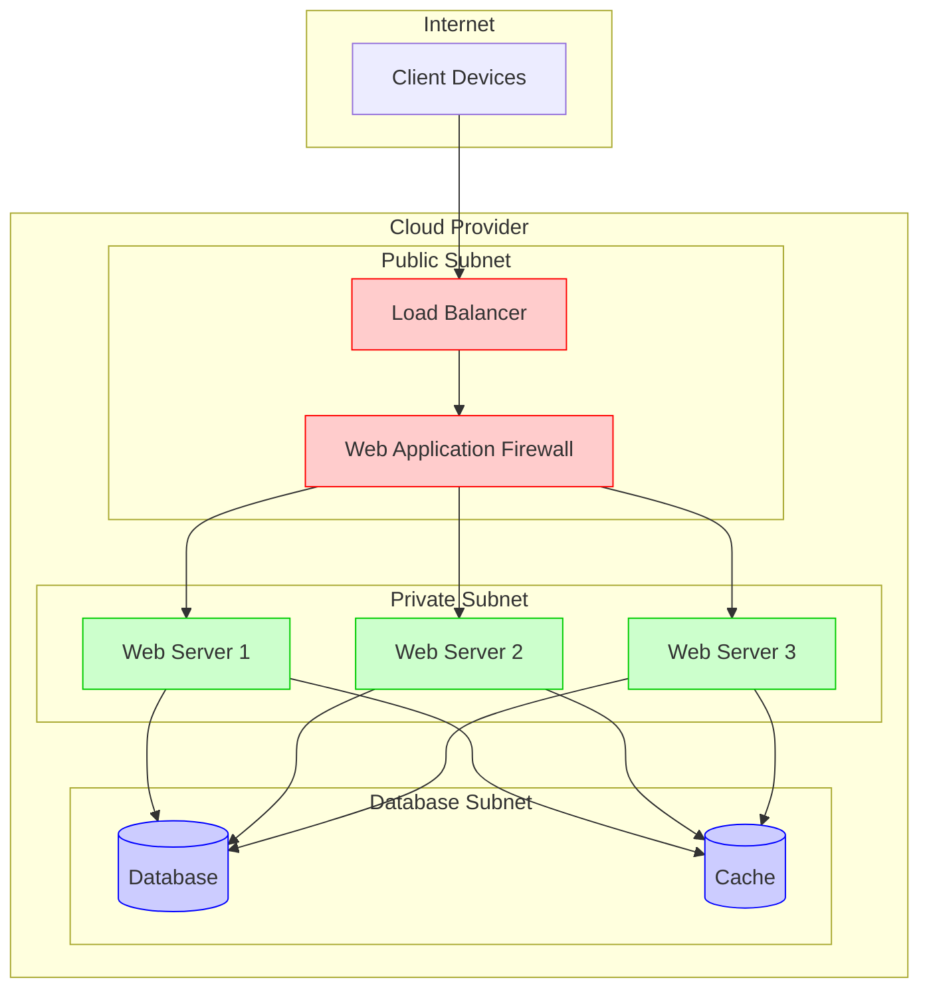
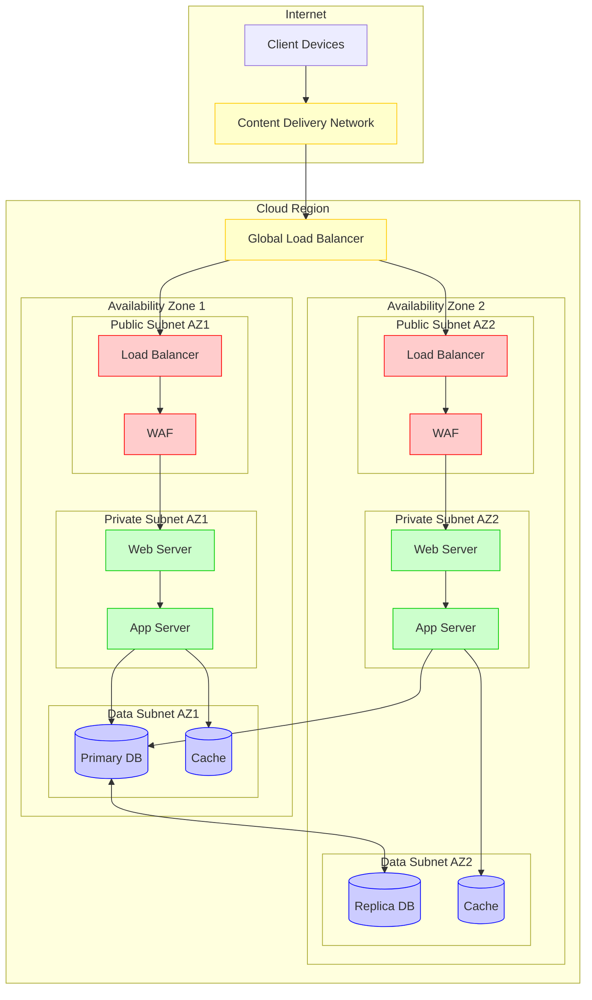

# Infrastructure

This section covers infrastructure topics such as virtualization, containers, and operating systems.

## Cloud Infrastructure Architecture

Modern infrastructure typically follows patterns of high availability, security, and scalability. Below are visualizations of common cloud infrastructure architectures.

### Basic Cloud Infrastructure

The following diagram illustrates a basic three-tier web application hosted in the cloud:



### High Availability Architecture

For critical applications, a multi-availability zone architecture ensures high availability:



## Topics

- [Containers](containers/index.md) - Docker and Kubernetes
- [Home Lab](homelab/index.md) - Home lab notes
- [Proxmox](proxmox/index.md) - Managing Proxmox for a home lab environment

## Getting Started

### Prerequisites

Before diving into infrastructure management, ensure you have the following:

1. **Basic Knowledge Requirements**:
   - Familiarity with command-line interfaces
   - Understanding of networking concepts (IP addressing, subnets, DNS)
   - Basic virtualization concepts

2. **Hardware for Home Lab** (if applicable):
   - Server or high-performance PC (8+ CPU cores recommended)
   - 32GB+ RAM for multiple VMs/containers
   - SSD storage (500GB+ recommended)
   - Stable network connection

3. **Software Tools**:
   - SSH client for remote management
   - Git for version control
   - Terminal emulator

### First Steps

#### 1. Choose Your Infrastructure Path

- **Containers**: Start with [Docker](containers/docker/index.md) for single-host container deployment
- **Virtualization**: Begin with [Proxmox](proxmox/index.md) for a comprehensive virtualization platform
- **Home Lab**: Follow the [Home Lab](homelab/index.md) guide for a complete lab setup

#### 2. Setup Your Environment

For containerization with Docker:

```bash
# Install Docker on Ubuntu/Debian
sudo apt update
sudo apt install -y docker.io
sudo systemctl enable --now docker

# Verify installation
docker --version
```

For Proxmox virtualization:

```bash
# Download Proxmox VE ISO and create bootable USB
# Then follow installation steps in the Proxmox guide
```

### Common Tasks

#### Managing Containers

```bash
# Run a container
docker run -d --name nginx -p 80:80 nginx

# List running containers
docker ps

# Stop a container
docker stop nginx
```

#### Managing Virtual Machines in Proxmox

1. Access the Proxmox web interface (`https://your-proxmox-ip:8006`)
2. Navigate to the Create VM button
3. Follow the wizard to set up resources and install an OS
4. See detailed instructions in the [Proxmox guide](proxmox/index.md)

### Next Steps

- Learn about [container orchestration with Kubernetes](containers/kubernetes/index.md)
- Explore [infrastructure as code](containers/terraform/index.md) with Terraform
- Set up a [complete home lab environment](homelab/index.md) with multiple services
