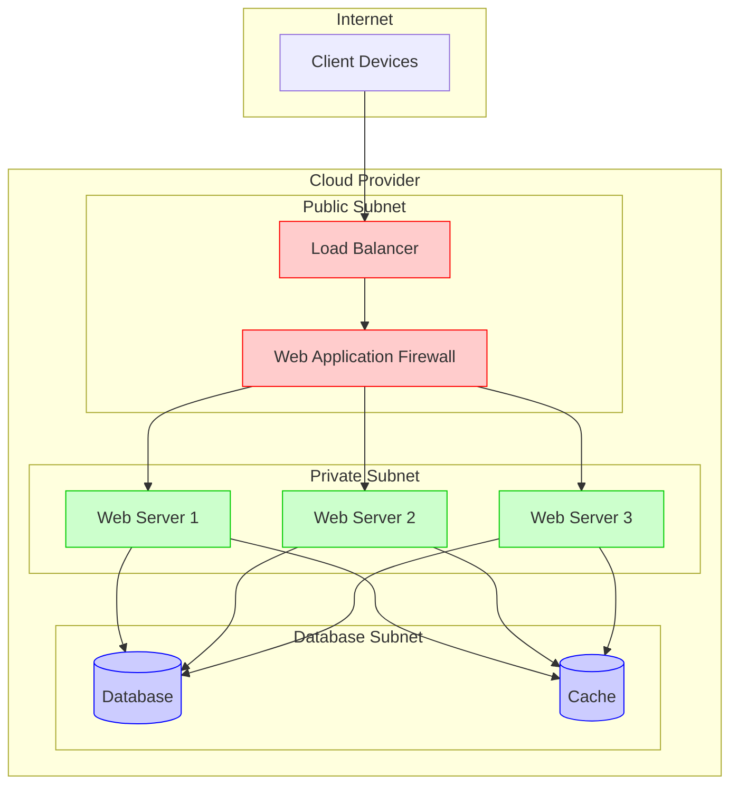
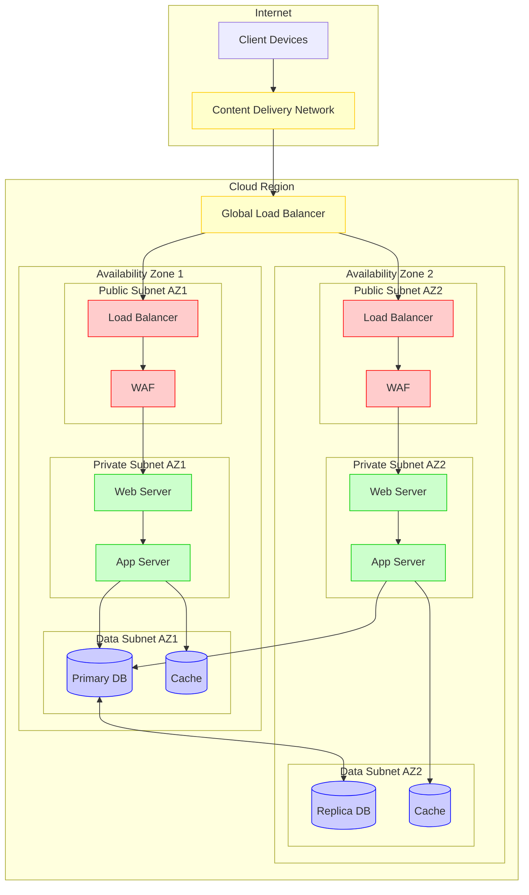

# Infrastructure

This section covers infrastructure topics including virtualization, containers, operating systems, monitoring, automation, and disaster recovery. Whether you're building a home lab, managing enterprise infrastructure, or exploring cloud architectures, you'll find comprehensive guides and best practices here.

## Cloud Infrastructure Architecture

Modern infrastructure typically follows patterns of high availability, security, and scalability. Below are visualizations of common cloud infrastructure architectures.

### Basic Cloud Infrastructure

The following diagram illustrates a basic three-tier web application hosted in the cloud:



### High Availability Architecture

For critical applications, a multi-availability zone architecture ensures high availability:



## Topics

- [Ansible](ansible/index.md) - Configuration management and automation
- [Containers](containers/index.md) - Docker and Kubernetes
- [Diagrams](diagrams/index.md) - Infrastructure diagrams and architecture visualization
- [Disaster Recovery](disaster-recovery/index.md) - Business continuity and disaster recovery planning
- [Grafana](grafana/index.md) - Monitoring and observability dashboards
- [Home Lab](homelab/index.md) - Home lab notes and setup guides
- [KQL](kql/index.md) - Kusto Query Language for log analysis
- [Linux](linux/index.md) - Linux system administration and configuration
- [Prometheus](prometheus/index.md) - Metrics collection and monitoring
- [Proxmox](proxmox/index.md) - Managing Proxmox for a home lab environment
- [SQL](sql/index.md) - Database administration and SQL queries
- [Terraform](terraform/index.md) - Infrastructure as Code with Terraform
- [Windows](windows/index.md) - Windows server administration and configuration

## Getting Started

### Learning Paths

Choose your learning path based on your goals and current experience level:

#### 🏠 **Home Lab Enthusiast**

Perfect for learning and experimentation in a home environment:

1. Start with [Home Lab](homelab/index.md) setup and planning
2. Install [Proxmox](proxmox/index.md) for virtualization
3. Deploy [Containers](containers/index.md) for application hosting
4. Set up monitoring with [Prometheus](prometheus/index.md) and [Grafana](grafana/index.md)
5. Automate deployments with [Ansible](ansible/index.md)

#### 🏢 **Enterprise Infrastructure**

For production environments and enterprise deployments:

1. Plan [Disaster Recovery](disaster-recovery/index.md) strategies
2. Implement [Infrastructure as Code](terraform/index.md) with Terraform
3. Set up comprehensive monitoring with [Prometheus](prometheus/index.md) and [Grafana](grafana/index.md)
4. Master [Linux](linux/index.md) and [Windows](windows/index.md) administration
5. Analyze logs and metrics with [KQL](kql/index.md)

#### ☁️ **Cloud Native Developer**

For modern application deployment and container orchestration:

1. Master [Docker containers](containers/index.md) fundamentals
2. Learn [Kubernetes](containers/index.md) orchestration
3. Implement [Terraform](terraform/index.md) for cloud infrastructure
4. Automate with [Ansible](ansible/index.md) configuration management
5. Visualize systems with [Diagrams](diagrams/index.md)

#### 📊 **DevOps and Monitoring**

Focus on observability, automation, and operations:

1. Deploy [Prometheus](prometheus/index.md) for metrics collection
2. Create dashboards with [Grafana](grafana/index.md)
3. Query logs effectively with [KQL](kql/index.md)
4. Automate operations with [Ansible](ansible/index.md)
5. Plan for [Disaster Recovery](disaster-recovery/index.md)

### Prerequisites

Before diving into infrastructure management, ensure you have the following:

#### Knowledge Requirements

- **Networking Fundamentals**: IP addressing, subnets, DNS, firewalls
- **Command Line Proficiency**: Comfortable with terminal/command prompt
- **Basic Virtualization Concepts**: VMs, hypervisors, resource allocation
- **Version Control**: Git basics for configuration management

#### Hardware Requirements (for Home Lab)

- **CPU**: 8+ cores (Intel i7/i9, AMD Ryzen 7/9, or server-grade)
- **Memory**: 32GB+ RAM (64GB+ recommended for extensive virtualization)
- **Storage**:
  - 500GB+ NVMe SSD for OS and VMs
  - Additional storage for data and backups
- **Network**: Gigabit Ethernet, managed switch recommended

#### Essential Software Tools

- **SSH Client**: PuTTY, OpenSSH, or built-in terminal
- **Code Editor**: VS Code, Vim, or your preferred editor
- **Git**: For version control and configuration management
- **Web Browser**: For accessing web interfaces (Proxmox, Grafana, etc.)

### Quick Start Guides

#### 🚀 **15-Minute Container Setup**

Get your first container running quickly:

```bash
# Install Docker (Ubuntu/Debian)
curl -fsSL https://get.docker.com -o get-docker.sh
sudo sh get-docker.sh
sudo usermod -aG docker $USER

# Run your first container
docker run -d --name web-server -p 8080:80 nginx
docker ps
# Access http://localhost:8080
```

#### ⚡ **Home Lab in 30 Minutes**

Basic Proxmox setup for beginners:

1. **Download Proxmox VE ISO** from [proxmox.com](https://www.proxmox.com/en/downloads)
2. **Create bootable USB** with Rufus or Etcher
3. **Install Proxmox** following the [Proxmox guide](proxmox/index.md)
4. **Access web interface** at `https://your-server-ip:8006`
5. **Create your first VM** using the web interface

#### 📈 **Monitoring Stack Setup**

Deploy Prometheus and Grafana monitoring:

```bash
# Using Docker Compose
git clone https://github.com/prometheus/prometheus
cd prometheus/documentation/examples/prometheus-grafana
docker-compose up -d

# Access Grafana at http://localhost:3000 (admin/admin)
```

### Common Use Cases

#### **Development Environment**

- **Containers**: Isolated development environments
- **Virtual Machines**: Testing different OS configurations
- **Automation**: Consistent environment provisioning

#### **Production Infrastructure**

- **High Availability**: Multi-zone deployments with load balancing
- **Monitoring**: Comprehensive observability stack
- **Disaster Recovery**: Backup and recovery procedures
- **Security**: Proper network segmentation and access controls

#### **Learning Laboratory**

- **Technology Exploration**: Safe environment for testing
- **Certification Prep**: Hands-on practice for cloud certifications
- **Open Source Projects**: Contributing to infrastructure projects

## Additional Resources

### Recommended Learning Sequence

1. **Foundation**: Start with [Linux](linux/index.md) or [Windows](windows/index.md) administration
2. **Virtualization**: Set up [Proxmox](proxmox/index.md) or learn [Containers](containers/index.md)
3. **Automation**: Implement [Ansible](ansible/index.md) for configuration management
4. **Infrastructure as Code**: Master [Terraform](terraform/index.md) for reproducible deployments
5. **Monitoring**: Deploy [Prometheus](prometheus/index.md) and [Grafana](grafana/index.md)
6. **Advanced Topics**: Explore [KQL](kql/index.md) for log analysis and [Disaster Recovery](disaster-recovery/index.md)

### Community and Support

- **Documentation**: Each topic includes comprehensive guides and examples
- **Best Practices**: Industry-standard approaches and configurations
- **Troubleshooting**: Common issues and solutions for each technology
- **Updates**: Regular content updates reflecting current best practices

### Contributing

Found an error or want to improve the documentation? See our contribution guidelines and help make this resource better for everyone.

---

*Ready to build robust, scalable infrastructure? Choose your path above and start your journey today!*

### Next Steps

- Learn about [container orchestration with Kubernetes](containers/kubernetes/index.md)
- Explore [infrastructure as code](containers/terraform/index.md) with Terraform
- Set up a [complete home lab environment](homelab/index.md) with multiple services
