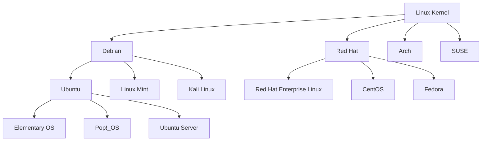

Linux is a free and open-source operating system based on the Unix architecture. It serves as the foundation for numerous distributions (distros) that power everything from smartphones and embedded systems to enterprise servers and supercomputers.

## What is Linux?

Linux is actually a kernel - the core component that manages system resources and provides the interface between hardware and software. What most people refer to as "Linux" is actually a complete operating system distribution that includes the Linux kernel along with system utilities, applications, and a package management system.

> [!NOTE]
> Linux powers over 96% of the world's top supercomputers, more than 70% of smartphones (Android), and is the backbone of most cloud infrastructure.

### Key Characteristics

- **Open Source**: Source code is freely available and can be modified
- **Stability**: Known for exceptional uptime and reliability
- **Security**: Strong permission system and active security community
- **Customization**: Highly configurable to meet specific needs
- **Cost-Effective**: Free to use with no licensing fees
- **Community Support**: Large, active community of developers and users

## Linux Distributions

A Linux distribution (distro) is a complete operating system that includes the Linux kernel, system utilities, applications, and a package manager. Different distributions cater to different use cases and user preferences.

### Major Distribution Families



## Debian: The Universal Operating System

Debian is one of the oldest and most influential Linux distributions, known for its stability, security, and commitment to free software principles.

### Key Features

- **Stability**: Extensively tested packages with long-term support
- **Package Management**: Advanced APT (Advanced Package Tool) system
- **Architecture Support**: Runs on multiple hardware architectures
- **Community-Driven**: Developed entirely by volunteers
- **Free Software**: Strict adherence to free software guidelines

### Debian Releases

Debian follows a unique release cycle with three main branches:

```bash
# Check Debian version
cat /etc/debian_version
lsb_release -a

# Current release information
# Stable: Debian 12 (Bookworm)
# Testing: Debian 13 (Trixie)
# Unstable: Sid (always in development)
```

## Ubuntu: Linux for Everyone

Ubuntu is a Debian-based distribution that focuses on ease of use, regular releases, and enterprise support. It's one of the most popular Linux distributions for both desktop and server environments.

### Ubuntu Editions

#### Desktop Edition

- **User-Friendly**: Intuitive GNOME desktop environment
- **Software Center**: Easy application installation
- **Hardware Support**: Excellent out-of-the-box hardware compatibility
- **Regular Updates**: 6-month release cycle with LTS versions

#### Server Edition

- **Minimal Installation**: Optimized for server workloads
- **Cloud Integration**: First-class support for cloud deployments
- **Enterprise Features**: Professional support and security updates
- **Container Ready**: Built-in Docker and Kubernetes support

### Ubuntu Release Cycle

```bash
# Check Ubuntu version
lsb_release -a
cat /etc/os-release

# LTS (Long Term Support) versions:
# Ubuntu 24.04 LTS (Noble Numbat)
# Ubuntu 22.04 LTS (Jammy Jellyfish)
# Ubuntu 20.04 LTS (Focal Fossa)
```

> [!TIP]
> LTS versions are supported for 5 years and are recommended for production servers and enterprise deployments.

## Package Management

Both Debian and Ubuntu use the APT package management system, which provides easy installation, updates, and removal of software packages.

### APT Commands

```bash
# Update package lists
sudo apt update

# Upgrade installed packages
sudo apt upgrade

# Install a package
sudo apt install package-name

# Remove a package
sudo apt remove package-name

# Search for packages
apt search keyword

# Show package information
apt show package-name

# List installed packages
apt list --installed

# Clean package cache
sudo apt autoclean
sudo apt autoremove
```

### Package Sources

```bash
# View configured repositories
cat /etc/apt/sources.list
ls /etc/apt/sources.list.d/

# Add a PPA (Personal Package Archive) - Ubuntu only
sudo add-apt-repository ppa:repository-name
sudo apt update

# Remove a PPA
sudo add-apt-repository --remove ppa:repository-name
```

## File System Structure

Linux follows the Filesystem Hierarchy Standard (FHS), organizing files in a logical directory structure:

```bash
# Root directory structure
/                    # Root directory
├── bin/            # Essential command binaries
├── boot/           # Boot loader files
├── dev/            # Device files
├── etc/            # Configuration files
├── home/           # User home directories
├── lib/            # Shared libraries
├── media/          # Removable media mount points
├── mnt/            # Temporary mount points
├── opt/            # Optional software packages
├── proc/           # Process information
├── root/           # Root user home directory
├── run/            # Runtime data
├── sbin/           # System administration binaries
├── srv/            # Service data
├── sys/            # System files
├── tmp/            # Temporary files
├── usr/            # User programs and data
└── var/            # Variable data files
```

## Basic Commands

### File and Directory Operations

```bash
# Navigation
pwd                 # Print current directory
ls -la              # List files with details
cd /path/to/dir     # Change directory
cd ~                # Go to home directory
cd ..               # Go up one directory

# File operations
cp source dest      # Copy file
mv source dest      # Move/rename file
rm filename         # Remove file
mkdir dirname       # Create directory
rmdir dirname       # Remove empty directory
rm -rf dirname      # Remove directory and contents

# File permissions
chmod 755 filename  # Change permissions
chown user:group file # Change ownership
```

### Text Processing

```bash
# View file contents
cat filename        # Display entire file
less filename       # Page through file
head -n 10 file     # Show first 10 lines
tail -n 10 file     # Show last 10 lines
tail -f file        # Follow file changes

# Search and filter
grep pattern file   # Search for pattern
find /path -name "*.txt"  # Find files by name
which command       # Find command location
```

### System Information

```bash
# System info
uname -a            # System information
whoami              # Current user
id                  # User and group IDs
uptime              # System uptime
df -h               # Disk space usage
free -h             # Memory usage
top                 # Running processes
ps aux              # Process list
```

## User Management

### User Accounts

```bash
# Add user
sudo adduser username

# Add user to group
sudo usermod -aG groupname username

# Change password
sudo passwd username

# Switch user
su - username
sudo -u username command

# Delete user
sudo deluser username
```

### File Permissions

Linux uses a permission system based on three levels:

```bash
# Permission structure: rwxrwxrwx
# Owner | Group | Others
# r = read (4), w = write (2), x = execute (1)

# Examples:
chmod 755 file      # rwxr-xr-x
chmod 644 file      # rw-r--r--
chmod 600 file      # rw-------

# Symbolic mode
chmod u+x file      # Add execute for owner
chmod g-w file      # Remove write for group
chmod o=r file      # Set others to read only
```

## Network Configuration

### Network Commands

```bash
# Network interfaces
ip addr show        # Show IP addresses
ip route show       # Show routing table
ping hostname       # Test connectivity
netstat -tuln       # Show listening ports
ss -tuln            # Modern alternative to netstat

# DNS
nslookup hostname   # DNS lookup
dig hostname        # Detailed DNS info
```

### Network Configuration Files

```bash
# Network configuration (varies by distribution)
# Ubuntu 18.04+: Netplan
sudo nano /etc/netplan/00-installer-config.yaml

# Debian/older Ubuntu: interfaces
sudo nano /etc/network/interfaces

# DNS configuration
sudo nano /etc/resolv.conf
```

## Service Management

### systemd Services

Most modern Linux distributions use systemd for service management:

```bash
# Service control
sudo systemctl start service-name
sudo systemctl stop service-name
sudo systemctl restart service-name
sudo systemctl reload service-name

# Service status
sudo systemctl status service-name
sudo systemctl is-active service-name
sudo systemctl is-enabled service-name

# Enable/disable services
sudo systemctl enable service-name
sudo systemctl disable service-name

# List services
systemctl list-units --type=service
systemctl list-unit-files --type=service
```

## Security Fundamentals

### Firewall Configuration

```bash
# UFW (Uncomplicated Firewall) - Ubuntu default
sudo ufw status
sudo ufw enable
sudo ufw allow ssh
sudo ufw allow 80/tcp
sudo ufw deny 23

# iptables (traditional)
sudo iptables -L
sudo iptables -A INPUT -p tcp --dport 22 -j ACCEPT
```

### System Updates

```bash
# Update system packages
sudo apt update && sudo apt upgrade

# Security updates only
sudo apt update && sudo apt upgrade -s | grep -i security

# Automatic updates
sudo apt install unattended-upgrades
sudo dpkg-reconfigure unattended-upgrades
```

## Use Cases

### Desktop Environment

Linux desktop distributions provide:

- **Productivity**: Office suites, web browsers, media players
- **Development**: Programming tools and IDEs
- **Gaming**: Steam, native games, and Windows compatibility
- **Privacy**: No telemetry or data collection
- **Customization**: Multiple desktop environments and themes

### Server Environment

Linux servers excel at:

- **Web Hosting**: Apache, Nginx, and application servers
- **Database Hosting**: MySQL, PostgreSQL, MongoDB
- **Cloud Infrastructure**: Docker, Kubernetes, OpenStack
- **Network Services**: DNS, DHCP, VPN, proxy servers
- **Enterprise Applications**: Email, file sharing, backup systems

## Getting Started

### Installation Methods

1. **Dual Boot**: Install alongside Windows
2. **Virtual Machine**: Use VMware or VirtualBox
3. **Live USB**: Try without installing
4. **Cloud Instance**: Deploy on AWS, Azure, or GCP
5. **Windows Subsystem for Linux (WSL)**: Run Linux on Windows

### Recommended Distributions

**For Beginners:**

- Ubuntu Desktop (LTS)
- Linux Mint
- Elementary OS

**For Servers:**

- Ubuntu Server (LTS)
- Debian Stable
- CentOS/Rocky Linux

**For Advanced Users:**

- Arch Linux
- Gentoo
- Fedora

## Learning Resources

### Official Documentation

- [Ubuntu Documentation](https://ubuntu.com/server/docs)
- [Debian Administrator's Handbook](https://debian-handbook.info/index.md)
- [The Linux Documentation Project](https://tldp.org/index.md)

### Community Resources

- [Ask Ubuntu](https://askubuntu.com/index.md)
- [Debian Forums](https://forums.debian.net/index.md)
- [Ubuntu Forums](https://ubuntuforums.org/index.md)
- [Reddit r/linux](https://reddit.com/r/linux)

### Training and Certification

- [Linux Professional Institute (LPI)](https://www.lpi.org/index.md)
- [CompTIA Linux+](https://www.comptia.org/certifications/linux)
- [Red Hat Certified System Administrator (RHCSA)](https://www.redhat.com/en/services/certification/rhcsa)

## Next Steps

1. **Choose a Distribution**: Start with Ubuntu or Debian
2. **Set Up a Test Environment**: Use a virtual machine or live USB
3. **Learn Command Line**: Master basic commands and shell scripting
4. **Explore Package Management**: Install and manage software
5. **Practice System Administration**: Configure services and security
6. **Join the Community**: Participate in forums and contribute to projects

Linux offers powerful, flexible, and cost-effective solutions for both personal and enterprise use. Whether you're running a home server, developing applications, or managing enterprise infrastructure, Linux provides the tools and stability needed for success.
