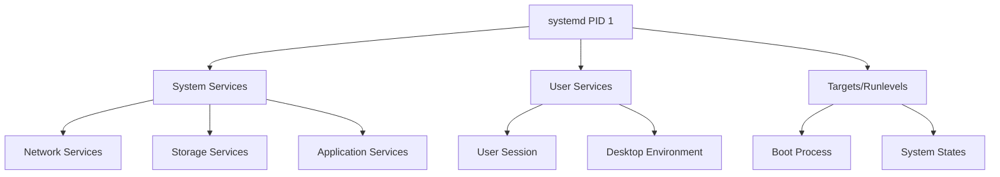

## systemd

systemd is the init system and service manager used by most current Linux distributions. It
starts and supervises services, orders them by dependency, collects their logs, schedules
recurring work, and confines what they are allowed to do.

This guide is split across several pages:

| Page | Covers |
|------|--------|
| [Unit Files and Service Configuration](unit-files.md) | Writing units, directive reference, dependencies |
| [Timer Units and Scheduling](timers.md) | Monotonic and calendar timers, the cron replacement |
| [Logging and Monitoring](logging.md) | `journalctl`, journal configuration, retention |
| [Security and Hardening](security.md) | Sandboxing directives and capability restriction |
| [Performance Optimization](performance.md) | Boot analysis, ordering, resource control |
| [Troubleshooting Guide](troubleshooting.md) | Failed units, dependency loops, boot problems |
| [Enterprise Best Practices](best-practices.md) | Conventions and automation at scale |

## Overview and Architecture

**SystemD** is the modern init system and service manager that has become the standard for most Linux distributions. It provides a unified framework for managing system services, processes, and system state with advanced features like parallel startup, dependency management, and comprehensive logging.

### Key Components

| Component | Purpose | Description |
|-----------|---------|-------------|
| **systemctl** | Service Control | Primary command-line interface for managing services |
| **journalctl** | Log Management | Query and manage systemd logs and journal |
| **systemd-analyze** | Performance Analysis | Analyze boot performance and service dependencies |
| **systemd-run** | Ad-hoc Execution | Run commands as transient services |
| **systemd-escape** | Name Escaping | Escape strings for use in unit names |

### System Architecture



### Advantages Over Traditional Init

- ✅ **Parallel Service Startup** - Faster boot times
- ✅ **Dependency Management** - Intelligent service ordering
- ✅ **Socket-based Activation** - On-demand service startup
- ✅ **Process Supervision** - Automatic restart and monitoring
- ✅ **Unified Logging** - Centralized log management with journald
- ✅ **Resource Management** - Built-in cgroups integration
- ✅ **Security Features** - Advanced sandboxing and isolation
- ✅ **Timer Integration** - Modern replacement for cron

---

## Essential Commands

### Service Lifecycle Management

#### Basic Service Operations

```bash
# Start a service immediately
sudo systemctl start <service-name>

# Stop a running service
sudo systemctl stop <service-name>

# Restart a service (stop then start)
sudo systemctl restart <service-name>

# Reload service configuration without restarting
sudo systemctl reload <service-name>

# Restart only if service is already running
sudo systemctl try-restart <service-name>

# Reload configuration, restart if reload not supported
sudo systemctl reload-or-restart <service-name>
```

#### Boot Configuration

```bash
# Enable service to start automatically at boot
sudo systemctl enable <service-name>

# Disable service from starting at boot
sudo systemctl disable <service-name>

# Enable and start service in one command
sudo systemctl enable --now <service-name>

# Disable and stop service in one command
sudo systemctl disable --now <service-name>

# Mask service (prevent it from being started)
sudo systemctl mask <service-name>

# Unmask a previously masked service
sudo systemctl unmask <service-name>
```

### Service Status and Information

#### Service Status Commands

```bash
# Check detailed service status
systemctl status <service-name>

# Check if service is currently active
systemctl is-active <service-name>

# Check if service is enabled for boot
systemctl is-enabled <service-name>

# Check if service has failed
systemctl is-failed <service-name>

# Show service properties
systemctl show <service-name>

# Show specific property
systemctl show <service-name> -p ActiveState
```

#### System-wide Service Listing

```bash
# List all loaded services
systemctl list-units --type=service

# List all services (including inactive)
systemctl list-units --type=service --all

# List only active services
systemctl list-units --type=service --state=active

# List only failed services
systemctl list-units --type=service --state=failed

# List enabled services
systemctl list-unit-files --type=service --state=enabled

# List disabled services
systemctl list-unit-files --type=service --state=disabled
```

### Advanced Service Operations

#### Service Dependencies

```bash
# List service dependencies
systemctl list-dependencies <service-name>

# Show what services depend on this service
systemctl list-dependencies <service-name> --reverse

# Show dependency tree
systemctl list-dependencies <service-name> --all

# Check what services are required by a target
systemctl list-dependencies graphical.target
```

#### Process Information

```bash
# Show main process ID
systemctl show <service-name> -p MainPID

# Show all processes in service cgroup
systemd-cgls <service-name>

# Show resource usage
systemd-cgtop

# Kill all processes in service
sudo systemctl kill <service-name>

# Send specific signal to service
sudo systemctl kill -s HUP <service-name>
```

---

## References and Additional Resources

- [systemd Documentation](https://systemd.io/)
- [systemd.service Manual](https://www.freedesktop.org/software/systemd/man/systemd.service.html)
- [systemd.unit Manual](https://www.freedesktop.org/software/systemd/man/systemd.unit.html)
- [systemd.timer Manual](https://www.freedesktop.org/software/systemd/man/systemd.timer.html)
- [Red Hat systemd Guide](https://access.redhat.com/documentation/en-us/red_hat_enterprise_linux/7/html/system_administrators_guide/chap-managing_services_with_systemd)
- [Arch Linux systemd Wiki](https://wiki.archlinux.org/title/systemd)
- [SystemD Security Features](https://www.freedesktop.org/software/systemd/man/systemd.exec.html#Sandboxing)
