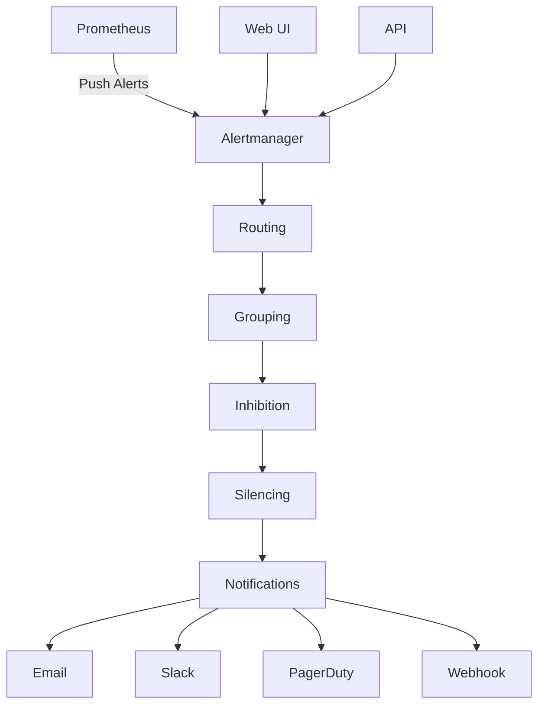

## Alertmanager

Prometheus Alertmanager handles alerts sent by client applications such as the Prometheus server. It takes care of deduplicating, grouping, and routing them to the correct receiver integration such as email, PagerDuty, or OpsGenie. It also takes care of silencing and inhibition of alerts.

> [!NOTE]
> Alertmanager is designed to work with Prometheus but can also receive alerts from other monitoring systems via its webhook API.

## Overview

### Key Features

- **Alert Deduplication**: Prevents duplicate alerts from flooding notification channels
- **Grouping**: Combines related alerts into single notifications
- **Routing**: Directs alerts to appropriate teams or channels based on labels
- **Silencing**: Temporarily suppress alerts during maintenance windows
- **Inhibition**: Suppress certain alerts based on other active alerts
- **High Availability**: Supports clustering for reliability
- **Multiple Integrations**: Email, Slack, PagerDuty, OpsGenie, webhooks, and more

### Architecture



## Installation

### Docker

```bash
# Pull the official Alertmanager image
docker pull prom/alertmanager:latest

# Run with default configuration
docker run -d \
  --name alertmanager \
  -p 9093:9093 \
  prom/alertmanager:latest

# Run with custom configuration
docker run -d \
  --name alertmanager \
  -p 9093:9093 \
  -v /path/to/alertmanager.yml:/etc/alertmanager/alertmanager.yml \
  prom/alertmanager:latest
```

### Docker Compose

```yaml
# docker-compose.yml
version: '3.8'

services:
  alertmanager:
    image: prom/alertmanager:latest
    container_name: alertmanager
    ports:
      - "9093:9093"
    volumes:
      - ./alertmanager.yml:/etc/alertmanager/alertmanager.yml
      - ./data:/alertmanager/data
    command:
      - '--config.file=/etc/alertmanager/alertmanager.yml'
      - '--storage.path=/alertmanager/data'
      - '--web.external-url=http://localhost:9093'
      - '--cluster.listen-address=0.0.0.0:9094'
    restart: unless-stopped
    networks:
      - monitoring

  prometheus:
    image: prom/prometheus:latest
    container_name: prometheus
    ports:
      - "9090:9090"
    volumes:
      - ./prometheus.yml:/etc/prometheus/prometheus.yml
      - ./alerts.yml:/etc/prometheus/alerts.yml
    command:
      - '--config.file=/etc/prometheus/prometheus.yml'
      - '--storage.tsdb.path=/prometheus'
      - '--web.console.libraries=/etc/prometheus/console_libraries'
      - '--web.console.templates=/etc/prometheus/consoles'
      - '--web.enable-lifecycle'
      - '--alertmanager.url=http://alertmanager:9093'
    restart: unless-stopped
    networks:
      - monitoring

networks:
  monitoring:
    driver: bridge
```

### Binary Installation

```bash
# Download latest release
wget https://github.com/prometheus/alertmanager/releases/download/v0.26.0/alertmanager-0.26.0.linux-amd64.tar.gz

# Extract and install
tar xvfz alertmanager-*.tar.gz
sudo mv alertmanager-*/alertmanager /usr/local/bin/
sudo mv alertmanager-*/amtool /usr/local/bin/

# Create directories and user
sudo useradd --no-create-home --shell /bin/false alertmanager
sudo mkdir /etc/alertmanager
sudo mkdir /var/lib/alertmanager
sudo chown alertmanager:alertmanager /var/lib/alertmanager

# Create service file
sudo tee /etc/systemd/system/alertmanager.service << EOF
[Unit]
Description=Alertmanager
Wants=network-online.target
After=network-online.target

[Service]
User=alertmanager
Group=alertmanager
Type=simple
ExecStart=/usr/local/bin/alertmanager \\
    --config.file /etc/alertmanager/alertmanager.yml \\
    --storage.path /var/lib/alertmanager/

[Install]
WantedBy=multi-user.target
EOF

# Start service
sudo systemctl daemon-reload
sudo systemctl enable alertmanager
sudo systemctl start alertmanager
```

## Configuration

### Basic Configuration

Create `/etc/alertmanager/alertmanager.yml`:

```yaml
global:
  smtp_smarthost: 'localhost:587'
  smtp_from: 'alerts@company.com'
  smtp_auth_username: 'alerts@company.com'
  smtp_auth_password: 'password'

route:
  group_by: ['alertname', 'cluster', 'service']
  group_wait: 10s
  group_interval: 10s
  repeat_interval: 1h
  receiver: 'default-receiver'
  routes:
  - match:
      severity: critical
    receiver: 'critical-alerts'
  - match:
      team: database
    receiver: 'database-team'

receivers:
- name: 'default-receiver'
  email_configs:
  - to: 'team@company.com'
    subject: '[{{ .Status | toUpper }}{{ if eq .Status "firing" }}:{{ .Alerts.Firing | len }}{{ end }}] Monitoring Alert'
    body: |
      {{ range .Alerts }}
      **Alert:** {{ .Annotations.summary }}
      **Description:** {{ .Annotations.description }}
      **Details:**
      {{ range .Labels.SortedPairs }} - {{ .Name }}: {{ .Value }}
      {{ end }}
      {{ end }}

- name: 'critical-alerts'
  email_configs:
  - to: 'oncall@company.com'
    subject: '🚨 CRITICAL ALERT 🚨'
    body: |
      CRITICAL ALERT DETECTED
      
      {{ range .Alerts }}
      **Alert:** {{ .Annotations.summary }}
      **Severity:** {{ .Labels.severity }}
      **Instance:** {{ .Labels.instance }}
      **Description:** {{ .Annotations.description }}
      
      {{ end }}

- name: 'database-team'
  email_configs:
  - to: 'db-team@company.com'
    subject: 'Database Alert - {{ .GroupLabels.alertname }}'

inhibit_rules:
- source_match:
    severity: 'critical'
  target_match:
    severity: 'warning'
  equal: ['alertname', 'instance']
```

### Advanced Configuration

```yaml
global:
  # Global SMTP configuration
  smtp_smarthost: 'mail.company.com:587'
  smtp_from: 'alertmanager@company.com'
  smtp_auth_username: 'alertmanager@company.com'
  smtp_auth_password: 'secure_password'
  smtp_require_tls: true
  
  # Global Slack configuration
  slack_api_url: 'https://hooks.slack.com/services/YOUR/SLACK/WEBHOOK'
  
  # Resolve timeout
  resolve_timeout: 5m

templates:
- '/etc/alertmanager/templates/*.tmpl'

route:
  group_by: ['alertname', 'cluster', 'service']
  group_wait: 30s
  group_interval: 5m
  repeat_interval: 12h
  receiver: 'default-receiver'
  
  routes:
  # Critical alerts - immediate notification
  - match:
      severity: critical
    receiver: 'critical-alerts'
    group_wait: 10s
    repeat_interval: 5m
    
  # Infrastructure alerts
  - match:
      team: infrastructure
    receiver: 'infrastructure-team'
    group_by: ['alertname', 'instance']
    
  # Application alerts
  - match_re:
      service: ^(api|web|app).*
    receiver: 'application-team'
    group_by: ['alertname', 'service']
    
  # Database alerts with escalation
  - match:
      team: database
    receiver: 'database-primary'
    continue: true
  - match:
      team: database
      severity: critical
    receiver: 'database-escalation'

receivers:
- name: 'default-receiver'
  slack_configs:
  - channel: '#alerts'
    title: 'Alert - {{ .GroupLabels.alertname }}'
    text: '{{ range .Alerts }}{{ .Annotations.summary }}{{ end }}'
    
- name: 'critical-alerts'
  slack_configs:
  - channel: '#critical'
    color: 'danger'
    title: '🚨 CRITICAL: {{ .GroupLabels.alertname }}'
    text: |
      {{ range .Alerts }}
      **Instance:** {{ .Labels.instance }}
      **Summary:** {{ .Annotations.summary }}
      **Description:** {{ .Annotations.description }}
      {{ end }}
  email_configs:
  - to: 'oncall@company.com'
    subject: '🚨 CRITICAL: {{ .GroupLabels.alertname }}'
    
- name: 'infrastructure-team'
  email_configs:
  - to: 'infra@company.com'
    subject: 'Infrastructure Alert: {{ .GroupLabels.alertname }}'
  slack_configs:
  - channel: '#infrastructure'
    color: 'warning'
    
- name: 'application-team'
  slack_configs:
  - channel: '#applications'
    color: 'warning'
    title: 'App Alert: {{ .GroupLabels.service }}'
    
- name: 'database-primary'
  email_configs:
  - to: 'db-team@company.com'
    
- name: 'database-escalation'
  email_configs:
  - to: 'db-lead@company.com, cto@company.com'
    subject: 'ESCALATED DB ALERT: {{ .GroupLabels.alertname }}'

inhibit_rules:
# Inhibit warning alerts if critical alert is firing
- source_match:
    severity: 'critical'
  target_match:
    severity: 'warning'
  equal: ['alertname', 'instance']

# Inhibit node alerts if entire cluster is down
- source_match:
    alertname: 'ClusterDown'
  target_match_re:
    alertname: '^(NodeDown|NodeDiskFull|NodeMemoryHigh)$'
  equal: ['cluster']
```

### Notification Templates

Create custom templates in `/etc/alertmanager/templates/email.tmpl`:

```go
{{ define "email.subject" }}
[{{ .Status | toUpper }}{{ if eq .Status "firing" }}:{{ .Alerts.Firing | len }}{{ end }}] {{ .GroupLabels.alertname }}
{{ end }}

{{ define "email.body" }}
<html>
<head>
<style>
  .alert { margin: 10px; padding: 10px; border-left: 4px solid; }
  .critical { border-color: #d73027; background-color: #ffe6e6; }
  .warning { border-color: #fc8d59; background-color: #fff2e6; }
  .info { border-color: #74add1; background-color: #e6f2ff; }
  .resolved { border-color: #4daf4a; background-color: #e6ffe6; }
</style>
</head>
<body>

{{ if gt (len .Alerts.Firing) 0 }}
<h2>🔥 Firing Alerts ({{ .Alerts.Firing | len }})</h2>
{{ range .Alerts.Firing }}
<div class="alert {{ .Labels.severity }}">
  <h3>{{ .Annotations.summary }}</h3>
  <p><strong>Description:</strong> {{ .Annotations.description }}</p>
  <p><strong>Started:</strong> {{ .StartsAt.Format "2006-01-02 15:04:05 UTC" }}</p>
  <p><strong>Labels:</strong></p>
  <ul>
  {{ range .Labels.SortedPairs }}
    <li><strong>{{ .Name }}:</strong> {{ .Value }}</li>
  {{ end }}
  </ul>
  {{ if .Annotations.runbook_url }}
  <p><strong>Runbook:</strong> <a href="{{ .Annotations.runbook_url }}">{{ .Annotations.runbook_url }}</a></p>
  {{ end }}
</div>
{{ end }}
{{ end }}

{{ if gt (len .Alerts.Resolved) 0 }}
<h2>✅ Resolved Alerts ({{ .Alerts.Resolved | len }})</h2>
{{ range .Alerts.Resolved }}
<div class="alert resolved">
  <h3>{{ .Annotations.summary }}</h3>
  <p><strong>Resolved:</strong> {{ .EndsAt.Format "2006-01-02 15:04:05 UTC" }}</p>
  <p><strong>Duration:</strong> {{ .EndsAt.Sub .StartsAt }}</p>
</div>
{{ end }}
{{ end }}

<p><small>
This alert was generated by Alertmanager at {{ .CommonAnnotations.alertmanager_url }}
</small></p>

</body>
</html>
{{ end }}
```

## Integration with Prometheus

### Prometheus Configuration

Update `prometheus.yml` to send alerts to Alertmanager:

```yaml
# prometheus.yml
global:
  scrape_interval: 15s
  evaluation_interval: 15s

rule_files:
  - "alerts.yml"

alerting:
  alertmanagers:
  - static_configs:
    - targets:
      - alertmanager:9093
    scheme: http
    timeout: 10s
    api_version: v2

scrape_configs:
  - job_name: 'prometheus'
    static_configs:
      - targets: ['localhost:9090']
      
  - job_name: 'node-exporter'
    static_configs:
      - targets: ['node-exporter:9100']
      
  - job_name: 'alertmanager'
    static_configs:
      - targets: ['alertmanager:9093']
```

### Sample Alert Rules

Create `alerts.yml` with comprehensive alert rules:

```yaml
groups:
- name: infrastructure.rules
  rules:
  - alert: InstanceDown
    expr: up == 0
    for: 5m
    labels:
      severity: critical
      team: infrastructure
    annotations:
      summary: "Instance {{ $labels.instance }} is down"
      description: "{{ $labels.instance }} of job {{ $labels.job }} has been down for more than 5 minutes."
      runbook_url: "https://runbooks.company.com/alerts/InstanceDown"

  - alert: HighCPUUsage
    expr: 100 - (avg by(instance) (rate(node_cpu_seconds_total{mode="idle"}[5m])) * 100) > 80
    for: 10m
    labels:
      severity: warning
      team: infrastructure
    annotations:
      summary: "High CPU usage on {{ $labels.instance }}"
      description: "CPU usage is {{ $value }}% on {{ $labels.instance }}"
      runbook_url: "https://runbooks.company.com/alerts/HighCPU"

  - alert: CriticalCPUUsage
    expr: 100 - (avg by(instance) (rate(node_cpu_seconds_total{mode="idle"}[5m])) * 100) > 95
    for: 5m
    labels:
      severity: critical
      team: infrastructure
    annotations:
      summary: "Critical CPU usage on {{ $labels.instance }}"
      description: "CPU usage is {{ $value }}% on {{ $labels.instance }}"

  - alert: HighMemoryUsage
    expr: (node_memory_MemTotal_bytes - node_memory_MemAvailable_bytes) / node_memory_MemTotal_bytes > 0.85
    for: 10m
    labels:
      severity: warning
      team: infrastructure
    annotations:
      summary: "High memory usage on {{ $labels.instance }}"
      description: "Memory usage is {{ $value | humanizePercentage }} on {{ $labels.instance }}"

  - alert: DiskSpaceLow
    expr: (node_filesystem_avail_bytes{fstype!="tmpfs"} / node_filesystem_size_bytes) < 0.1
    for: 5m
    labels:
      severity: warning
      team: infrastructure
    annotations:
      summary: "Low disk space on {{ $labels.instance }}"
      description: "Disk {{ $labels.mountpoint }} on {{ $labels.instance }} has {{ $value | humanizePercentage }} free space"

  - alert: DiskSpaceCritical
    expr: (node_filesystem_avail_bytes{fstype!="tmpfs"} / node_filesystem_size_bytes) < 0.05
    for: 2m
    labels:
      severity: critical
      team: infrastructure
    annotations:
      summary: "Critical disk space on {{ $labels.instance }}"
      description: "Disk {{ $labels.mountpoint }} on {{ $labels.instance }} has only {{ $value | humanizePercentage }} free space"

- name: application.rules
  rules:
  - alert: HighErrorRate
    expr: rate(http_requests_total{status=~"5.."}[5m]) / rate(http_requests_total[5m]) > 0.05
    for: 5m
    labels:
      severity: warning
      team: application
    annotations:
      summary: "High error rate on {{ $labels.service }}"
      description: "Error rate is {{ $value | humanizePercentage }} on {{ $labels.service }}"

  - alert: HighLatency
    expr: histogram_quantile(0.95, rate(http_request_duration_seconds_bucket[5m])) > 0.5
    for: 10m
    labels:
      severity: warning
      team: application
    annotations:
      summary: "High latency on {{ $labels.service }}"
      description: "95th percentile latency is {{ $value }}s on {{ $labels.service }}"

- name: database.rules
  rules:
  - alert: DatabaseConnectionsHigh
    expr: mysql_global_status_threads_connected / mysql_global_variables_max_connections > 0.8
    for: 5m
    labels:
      severity: warning
      team: database
    annotations:
      summary: "High database connections"
      description: "Database connections are at {{ $value | humanizePercentage }} of maximum"

  - alert: DatabaseReplicationLag
    expr: mysql_slave_lag_seconds > 30
    for: 2m
    labels:
      severity: critical
      team: database
    annotations:
      summary: "Database replication lag"
      description: "Replication lag is {{ $value }}s on {{ $labels.instance }}"
```

## Alert Management

### Using the Web UI

Access Alertmanager's web interface at `http://localhost:9093`:

- **Alerts View**: See all current alerts with their status
- **Silences**: Create and manage alert silences
- **Status**: View configuration and build information

### Using amtool CLI

```bash
# View current alerts
amtool alert query

# View alerts with specific labels
amtool alert query alertname="InstanceDown"
amtool alert query severity="critical"

# Create a silence
amtool silence add alertname="InstanceDown" instance="server1:9100" \
  --duration="2h" \
  --comment="Maintenance window for server1" \
  --author="john.doe@company.com"

# List active silences
amtool silence query

# Expire a silence
amtool silence expire <silence-id>

# Check configuration
amtool config show

# Test routing configuration
amtool config routes test \
  --config.file=alertmanager.yml \
  alertname="InstanceDown" \
  severity="critical" \
  instance="server1:9100"
```

### API Usage

```bash
# Get all alerts
curl http://localhost:9093/api/v2/alerts

# Get alerts with specific matcher
curl "http://localhost:9093/api/v2/alerts?filter=alertname%3DInstanceDown"

# Create a silence
curl -X POST http://localhost:9093/api/v2/silences \
  -H "Content-Type: application/json" \
  -d '{
    "matchers": [
      {
        "name": "alertname",
        "value": "InstanceDown",
        "isRegex": false
      }
    ],
    "startsAt": "2023-10-01T12:00:00Z",
    "endsAt": "2023-10-01T14:00:00Z",
    "comment": "Maintenance window",
    "createdBy": "admin"
  }'

# Get silences
curl http://localhost:9093/api/v2/silences
```

## High Availability Setup

### Clustering Configuration

```yaml
# alertmanager.yml for cluster setup
global:
  smtp_smarthost: 'localhost:587'
  smtp_from: 'alerts@company.com'

route:
  group_by: ['alertname']
  group_wait: 10s
  group_interval: 10s
  repeat_interval: 1h
  receiver: 'web.hook'

receivers:
- name: 'web.hook'
  email_configs:
  - to: 'admin@company.com'

# Clustering configuration
cluster:
  listen-address: '0.0.0.0:9094'
  peer: ['alertmanager-1:9094', 'alertmanager-2:9094', 'alertmanager-3:9094']
```

### Docker Compose HA Setup

```yaml
version: '3.8'

services:
  alertmanager-1:
    image: prom/alertmanager:latest
    container_name: alertmanager-1
    ports:
      - "9093:9093"
      - "9094:9094"
    volumes:
      - ./alertmanager.yml:/etc/alertmanager/alertmanager.yml
    command:
      - '--config.file=/etc/alertmanager/alertmanager.yml'
      - '--cluster.listen-address=0.0.0.0:9094'
      - '--cluster.peer=alertmanager-2:9094'
      - '--cluster.peer=alertmanager-3:9094'
      - '--web.external-url=http://alertmanager-1:9093'
    networks:
      - monitoring

  alertmanager-2:
    image: prom/alertmanager:latest
    container_name: alertmanager-2
    ports:
      - "9095:9093"
      - "9096:9094"
    volumes:
      - ./alertmanager.yml:/etc/alertmanager/alertmanager.yml
    command:
      - '--config.file=/etc/alertmanager/alertmanager.yml'
      - '--cluster.listen-address=0.0.0.0:9094'
      - '--cluster.peer=alertmanager-1:9094'
      - '--cluster.peer=alertmanager-3:9094'
      - '--web.external-url=http://alertmanager-2:9093'
    networks:
      - monitoring

  alertmanager-3:
    image: prom/alertmanager:latest
    container_name: alertmanager-3
    ports:
      - "9097:9093"
      - "9098:9094"
    volumes:
      - ./alertmanager.yml:/etc/alertmanager/alertmanager.yml
    command:
      - '--config.file=/etc/alertmanager/alertmanager.yml'
      - '--cluster.listen-address=0.0.0.0:9094'
      - '--cluster.peer=alertmanager-1:9094'
      - '--cluster.peer=alertmanager-2:9094'
      - '--web.external-url=http://alertmanager-3:9093'
    networks:
      - monitoring

networks:
  monitoring:
    driver: bridge
```

## Best Practices

### Configuration Best Practices

1. **Use Labels Effectively**

   ```yaml
   # Good: Consistent labeling
   labels:
     severity: critical
     team: infrastructure
     service: database
     environment: production
   ```

2. **Implement Proper Grouping**

   ```yaml
   route:
     group_by: ['alertname', 'cluster', 'service']
     group_wait: 30s
     group_interval: 5m
   ```

3. **Set Appropriate Intervals**

   ```yaml
   # Balance between spam and responsiveness
   group_wait: 30s      # Wait for more alerts before sending
   group_interval: 5m   # Wait between grouped notifications
   repeat_interval: 4h  # Repeat notifications for ongoing issues
   ```

### Alert Design Best Practices

1. **Clear, Actionable Alerts**

   ```yaml
   annotations:
     summary: "Database connection pool exhausted on {{ $labels.instance }}"
     description: "Connection pool usage is {{ $value }}% on {{ $labels.instance }}. Consider scaling the database or optimizing queries."
     runbook_url: "https://runbooks.company.com/database/connection-pool-exhausted"
   ```

2. **Use Inhibition Rules**

   ```yaml
   inhibit_rules:
   - source_match:
       severity: 'critical'
     target_match:
       severity: 'warning'
     equal: ['alertname', 'instance']
   ```

3. **Implement Multi-Level Severity**

   ```yaml
   # Warning at 80%, critical at 95%
   - alert: HighCPUWarning
     expr: cpu_usage > 80
     labels:
       severity: warning
       
   - alert: HighCPUCritical
     expr: cpu_usage > 95
     labels:
       severity: critical
   ```

### Operational Best Practices

1. **Regular Testing**

   ```bash
   # Test alert routing
   amtool config routes test --config.file=alertmanager.yml \
     alertname="TestAlert" severity="critical"
   
   # Send test alerts
   curl -X POST http://localhost:9093/api/v1/alerts \
     -H "Content-Type: application/json" \
     -d '[{
       "labels": {"alertname": "TestAlert", "severity": "critical"},
       "annotations": {"summary": "Test alert"},
       "generatorURL": "http://localhost:9090/graph"
     }]'
   ```

2. **Monitor Alertmanager Itself**

   ```yaml
   - alert: AlertmanagerDown
     expr: up{job="alertmanager"} == 0
     for: 5m
     labels:
       severity: critical
     annotations:
       summary: "Alertmanager is down"
       
   - alert: AlertmanagerConfigReloadFailed
     expr: alertmanager_config_last_reload_successful != 1
     for: 5m
     labels:
       severity: warning
     annotations:
       summary: "Alertmanager configuration reload failed"
   ```

3. **Use Silences for Maintenance**

   ```bash
   # Create maintenance silence
   amtool silence add \
     --duration="4h" \
     --comment="Scheduled maintenance for database cluster" \
     --author="ops-team@company.com" \
     cluster="db-cluster"
   ```

## Troubleshooting

### Common Issues

1. **Alerts Not Being Sent**

   ```bash
   # Check Alertmanager status
   curl http://localhost:9093/api/v2/status
   
   # Check if Prometheus is sending alerts
   curl http://localhost:9090/api/v1/rules
   
   # Check Alertmanager logs
   docker logs alertmanager
   ```

2. **Configuration Errors**

   ```bash
   # Validate configuration
   amtool config show --config.file=alertmanager.yml
   
   # Test routing
   amtool config routes test --config.file=alertmanager.yml \
     alertname="TestAlert"
   ```

3. **Missing Notifications**

   - Check receiver configuration
   - Verify SMTP/Slack credentials
   - Check inhibition rules
   - Verify alert labels match routing rules

### Monitoring Alertmanager

```yaml
# Prometheus rules for Alertmanager monitoring
- name: alertmanager.rules
  rules:
  - alert: AlertmanagerDown
    expr: up{job="alertmanager"} == 0
    for: 1m
    labels:
      severity: critical
    annotations:
      summary: "Alertmanager instance is down"
      
  - alert: AlertmanagerFailedReload
    expr: alertmanager_config_last_reload_successful != 1
    for: 5m
    labels:
      severity: warning
    annotations:
      summary: "Alertmanager configuration reload failed"
      
  - alert: AlertmanagerNotificationsFailing
    expr: rate(alertmanager_notifications_failed_total[5m]) > 0
    for: 5m
    labels:
      severity: warning
    annotations:
      summary: "Alertmanager notifications are failing"
```

## Integration Examples

### Slack Integration

```yaml
receivers:
- name: 'slack-alerts'
  slack_configs:
  - api_url: 'https://hooks.slack.com/services/YOUR/SLACK/WEBHOOK'
    channel: '#alerts'
    color: '{{ if eq .Status "firing" }}danger{{ else }}good{{ end }}'
    title: '{{ .Status | title }}: {{ .GroupLabels.alertname }}'
    title_link: '{{ .CommonAnnotations.alertmanager_url }}'
    text: |
      {{ range .Alerts }}
      *Alert:* {{ .Annotations.summary }}
      *Description:* {{ .Annotations.description }}
      *Details:*
      {{ range .Labels.SortedPairs }} • *{{ .Name }}:* `{{ .Value }}`
      {{ end }}
      {{ end }}
    actions:
    - type: button
      text: 'Runbook 📖'
      url: '{{ .CommonAnnotations.runbook_url }}'
    - type: button
      text: 'Query 🔍'
      url: '{{ .CommonAnnotations.query_url }}'
    - type: button
      text: 'Silence 🔇'
      url: '{{ .CommonAnnotations.silence_url }}'
```

### PagerDuty Integration

```yaml
receivers:
- name: 'pagerduty-critical'
  pagerduty_configs:
  - service_key: 'YOUR-PAGERDUTY-SERVICE-KEY'
    description: '{{ .GroupLabels.alertname }}: {{ .CommonAnnotations.summary }}'
    severity: '{{ .GroupLabels.severity }}'
    details:
      firing: '{{ template "pagerduty.default.instances" .Alerts.Firing }}'
      resolved: '{{ template "pagerduty.default.instances" .Alerts.Resolved }}'
      num_firing: '{{ .Alerts.Firing | len }}'
      num_resolved: '{{ .Alerts.Resolved | len }}'
```

### Webhook Integration

```yaml
receivers:
- name: 'webhook'
  webhook_configs:
  - url: 'http://webhook-service:8080/alerts'
    http_config:
      basic_auth:
        username: 'alertmanager'
        password: 'secret'
    send_resolved: true
```

## Related Resources

- [Prometheus Alertmanager Documentation](https://prometheus.io/docs/alerting/latest/alertmanager/)
- [Alertmanager Configuration Reference](https://prometheus.io/docs/alerting/latest/configuration/)
- [Alert Rules Best Practices](https://prometheus.io/docs/practices/alerting/)
- [Notification Template Examples](https://prometheus.io/docs/alerting/latest/notification_examples/)
- [Awesome Prometheus Alerts](https://awesome-prometheus-alerts.grep.to/)
- [Runbook Examples](https://github.com/kubernetes-monitoring/kubernetes-mixin/tree/master/runbook)
