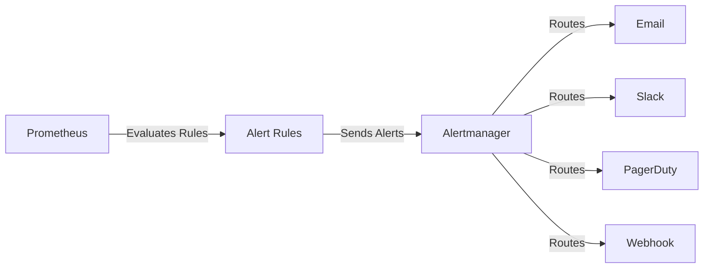

## Overview

Prometheus alerting separates into two components:

1. **Alert Rules** - Defined in Prometheus, evaluate PromQL expressions and trigger alerts
2. **Alertmanager** - Handles alert routing, grouping, silencing, and notifications

**Key Concepts:**

- **Alert States**: Inactive, Pending, Firing
- **For Duration**: Time an alert must be active before firing
- **Labels**: Used for routing and grouping alerts
- **Annotations**: Provide human-readable information
- **Inhibition**: Suppress alerts based on other active alerts
- **Silences**: Temporarily mute alerts

## Prometheus Alerting Architecture



## Alert Rules

### Node Exporter Alerts

```yaml
# node_alerts.yml
groups:
  - name: node_exporter
    interval: 30s
    rules:
      # CPU Alerts
      - alert: HighCPUUsage
        expr: 100 - (avg by (instance) (rate(node_cpu_seconds_total{mode="idle"}[5m])) * 100) > 80
        for: 5m
        labels:
          severity: warning
          component: cpu
        annotations:
          summary: "High CPU usage on {{ $labels.instance }}"
          description: "CPU usage is {{ $value | humanizePercentage }} on {{ $labels.instance }}"
          runbook_url: "https://docs.example.com/runbooks/high-cpu"

      - alert: CriticalCPUUsage
        expr: 100 - (avg by (instance) (rate(node_cpu_seconds_total{mode="idle"}[5m])) * 100) > 95
        for: 2m
        labels:
          severity: critical
          component: cpu
        annotations:
          summary: "Critical CPU usage on {{ $labels.instance }}"
          description: "CPU usage is {{ $value | humanizePercentage }} on {{ $labels.instance }}"
          runbook_url: "https://docs.example.com/runbooks/critical-cpu"

      # Memory Alerts
      - alert: HighMemoryUsage
        expr: (1 - (node_memory_MemAvailable_bytes / node_memory_MemTotal_bytes)) * 100 > 80
        for: 5m
        labels:
          severity: warning
          component: memory
        annotations:
          summary: "High memory usage on {{ $labels.instance }}"
          description: "Memory usage is {{ $value | humanizePercentage }} on {{ $labels.instance }}"
          runbook_url: "https://docs.example.com/runbooks/high-memory"

      - alert: CriticalMemoryUsage
        expr: (1 - (node_memory_MemAvailable_bytes / node_memory_MemTotal_bytes)) * 100 > 95
        for: 2m
        labels:
          severity: critical
          component: memory
        annotations:
          summary: "Critical memory usage on {{ $labels.instance }}"
          description: "Memory usage is {{ $value | humanizePercentage }} on {{ $labels.instance }}"
          runbook_url: "https://docs.example.com/runbooks/critical-memory"

      # Disk Alerts
      - alert: HighDiskUsage
        expr: (1 - (node_filesystem_avail_bytes{fstype!~"tmpfs|fuse.lxcfs|squashfs|vfat"} / node_filesystem_size_bytes)) * 100 > 80
        for: 5m
        labels:
          severity: warning
          component: disk
        annotations:
          summary: "High disk usage on {{ $labels.instance }}"
          description: "Disk usage is {{ $value | humanizePercentage }} on {{ $labels.mountpoint }} ({{ $labels.instance }})"
          runbook_url: "https://docs.example.com/runbooks/high-disk"

      - alert: CriticalDiskUsage
        expr: (1 - (node_filesystem_avail_bytes{fstype!~"tmpfs|fuse.lxcfs|squashfs|vfat"} / node_filesystem_size_bytes)) * 100 > 90
        for: 2m
        labels:
          severity: critical
          component: disk
        annotations:
          summary: "Critical disk usage on {{ $labels.instance }}"
          description: "Disk usage is {{ $value | humanizePercentage }} on {{ $labels.mountpoint }} ({{ $labels.instance }})"
          runbook_url: "https://docs.example.com/runbooks/critical-disk"

      - alert: DiskWillFillIn4Hours
        expr: predict_linear(node_filesystem_avail_bytes{fstype!~"tmpfs|fuse.lxcfs|squashfs|vfat"}[1h], 4 * 3600) < 0
        for: 5m
        labels:
          severity: warning
          component: disk
        annotations:
          summary: "Disk will fill in 4 hours on {{ $labels.instance }}"
          description: "Disk {{ $labels.mountpoint }} on {{ $labels.instance }} will fill in approximately 4 hours based on current trend"
          runbook_url: "https://docs.example.com/runbooks/disk-fill-prediction"

      # Disk I/O Alerts
      - alert: HighDiskIOUtilization
        expr: rate(node_disk_io_time_seconds_total[5m]) * 100 > 80
        for: 10m
        labels:
          severity: warning
          component: disk
        annotations:
          summary: "High disk I/O utilization on {{ $labels.instance }}"
          description: "Disk I/O utilization is {{ $value | humanizePercentage }} on {{ $labels.device }} ({{ $labels.instance }})"
          runbook_url: "https://docs.example.com/runbooks/high-disk-io"

      # Network Alerts
      - alert: HighNetworkTransmitRate
        expr: rate(node_network_transmit_bytes_total{device!~"lo|veth.*"}[5m]) > 100000000
        for: 5m
        labels:
          severity: warning
          component: network
        annotations:
          summary: "High network transmit rate on {{ $labels.instance }}"
          description: "Network transmit rate is {{ $value | humanize }}B/s on {{ $labels.device }} ({{ $labels.instance }})"
          runbook_url: "https://docs.example.com/runbooks/high-network-tx"

      - alert: HighNetworkReceiveRate
        expr: rate(node_network_receive_bytes_total{device!~"lo|veth.*"}[5m]) > 100000000
        for: 5m
        labels:
          severity: warning
          component: network
        annotations:
          summary: "High network receive rate on {{ $labels.instance }}"
          description: "Network receive rate is {{ $value | humanize }}B/s on {{ $labels.device }} ({{ $labels.instance }})"
          runbook_url: "https://docs.example.com/runbooks/high-network-rx"

      # System Health Alerts
      - alert: NodeDown
        expr: up{job="node_exporter"} == 0
        for: 1m
        labels:
          severity: critical
          component: system
        annotations:
          summary: "Node {{ $labels.instance }} is down"
          description: "Node exporter on {{ $labels.instance }} has been down for more than 1 minute"
          runbook_url: "https://docs.example.com/runbooks/node-down"

      - alert: HighSystemLoad
        expr: node_load15 / count without (cpu, mode) (node_cpu_seconds_total{mode="system"}) > 2
        for: 10m
        labels:
          severity: warning
          component: system
        annotations:
          summary: "High system load on {{ $labels.instance }}"
          description: "15-minute load average is {{ $value }} on {{ $labels.instance }}"
          runbook_url: "https://docs.example.com/runbooks/high-load"

      - alert: ClockSkew
        expr: abs(node_time_seconds - timestamp(node_time_seconds)) > 30
        for: 5m
        labels:
          severity: warning
          component: system
        annotations:
          summary: "Clock skew detected on {{ $labels.instance }}"
          description: "Clock on {{ $labels.instance }} is out of sync by {{ $value }} seconds"
          runbook_url: "https://docs.example.com/runbooks/clock-skew"

      - alert: SystemdServiceFailed
        expr: node_systemd_unit_state{state="failed"} == 1
        for: 5m
        labels:
          severity: warning
          component: system
        annotations:
          summary: "Systemd service failed on {{ $labels.instance }}"
          description: "Service {{ $labels.name }} has failed on {{ $labels.instance }}"
          runbook_url: "https://docs.example.com/runbooks/systemd-failure"
```

### Container Alerts

```yaml
# container_alerts.yml
groups:
  - name: container
    interval: 30s
    rules:
      # Container Resource Alerts
      - alert: ContainerHighCPU
        expr: sum by (name, instance) (rate(container_cpu_usage_seconds_total{container!=""}[5m])) * 100 > 80
        for: 5m
        labels:
          severity: warning
          component: container
        annotations:
          summary: "High CPU usage in container {{ $labels.name }}"
          description: "Container {{ $labels.name }} on {{ $labels.instance }} is using {{ $value | humanizePercentage }} CPU"
          runbook_url: "https://docs.example.com/runbooks/container-high-cpu"

      - alert: ContainerHighMemory
        expr: (container_memory_usage_bytes{container!=""} / container_spec_memory_limit_bytes{container!=""}) * 100 > 80
        for: 5m
        labels:
          severity: warning
          component: container
        annotations:
          summary: "High memory usage in container {{ $labels.name }}"
          description: "Container {{ $labels.name }} on {{ $labels.instance }} is using {{ $value | humanizePercentage }} of memory limit"
          runbook_url: "https://docs.example.com/runbooks/container-high-memory"

      - alert: ContainerMemoryNearLimit
        expr: (container_memory_usage_bytes{container!=""} / container_spec_memory_limit_bytes{container!=""}) * 100 > 95
        for: 2m
        labels:
          severity: critical
          component: container
        annotations:
          summary: "Container memory near limit {{ $labels.name }}"
          description: "Container {{ $labels.name }} on {{ $labels.instance }} is using {{ $value | humanizePercentage }} of memory limit"
          runbook_url: "https://docs.example.com/runbooks/container-memory-limit"

      # Container State Alerts
      - alert: ContainerDown
        expr: time() - container_last_seen{container!=""} > 60
        for: 1m
        labels:
          severity: critical
          component: container
        annotations:
          summary: "Container {{ $labels.name }} is down"
          description: "Container {{ $labels.name }} on {{ $labels.instance }} has not been seen for more than 1 minute"
          runbook_url: "https://docs.example.com/runbooks/container-down"

      - alert: ContainerRestarting
        expr: rate(container_restart_count{container!=""}[15m]) > 0
        for: 5m
        labels:
          severity: warning
          component: container
        annotations:
          summary: "Container {{ $labels.name }} is restarting"
          description: "Container {{ $labels.name }} on {{ $labels.instance }} has restarted {{ $value }} times in the last 15 minutes"
          runbook_url: "https://docs.example.com/runbooks/container-restarting"

      - alert: ContainerOOMKilled
        expr: increase(container_oom_events_total{container!=""}[5m]) > 0
        for: 1m
        labels:
          severity: critical
          component: container
        annotations:
          summary: "Container {{ $labels.name }} killed by OOM"
          description: "Container {{ $labels.name }} on {{ $labels.instance }} was killed by OOM killer"
          runbook_url: "https://docs.example.com/runbooks/container-oom"
```

### Application Alerts

```yaml
# application_alerts.yml
groups:
  - name: application
    interval: 30s
    rules:
      # HTTP Response Time
      - alert: HighResponseTime
        expr: histogram_quantile(0.95, sum by (job, le) (rate(http_request_duration_seconds_bucket[5m]))) > 1
        for: 5m
        labels:
          severity: warning
          component: application
        annotations:
          summary: "High response time for {{ $labels.job }}"
          description: "95th percentile response time is {{ $value }}s for {{ $labels.job }}"
          runbook_url: "https://docs.example.com/runbooks/high-response-time"

      # Error Rate
      - alert: HighErrorRate
        expr: (sum by (job) (rate(http_requests_total{status=~"5.."}[5m])) / sum by (job) (rate(http_requests_total[5m]))) * 100 > 5
        for: 5m
        labels:
          severity: warning
          component: application
        annotations:
          summary: "High error rate for {{ $labels.job }}"
          description: "Error rate is {{ $value | humanizePercentage }} for {{ $labels.job }}"
          runbook_url: "https://docs.example.com/runbooks/high-error-rate"

      - alert: CriticalErrorRate
        expr: (sum by (job) (rate(http_requests_total{status=~"5.."}[5m])) / sum by (job) (rate(http_requests_total[5m]))) * 100 > 20
        for: 2m
        labels:
          severity: critical
          component: application
        annotations:
          summary: "Critical error rate for {{ $labels.job }}"
          description: "Error rate is {{ $value | humanizePercentage }} for {{ $labels.job }}"
          runbook_url: "https://docs.example.com/runbooks/critical-error-rate"

      # Request Rate
      - alert: LowRequestRate
        expr: sum by (job) (rate(http_requests_total[5m])) < 10
        for: 10m
        labels:
          severity: warning
          component: application
        annotations:
          summary: "Low request rate for {{ $labels.job }}"
          description: "Request rate is {{ $value }} req/s for {{ $labels.job }}, which is unusually low"
          runbook_url: "https://docs.example.com/runbooks/low-request-rate"

      # Database Connection Pool
      - alert: DatabaseConnectionPoolExhausted
        expr: (database_connections_active / database_connections_max) * 100 > 90
        for: 5m
        labels:
          severity: critical
          component: database
        annotations:
          summary: "Database connection pool exhausted for {{ $labels.job }}"
          description: "Connection pool usage is {{ $value | humanizePercentage }} for {{ $labels.job }}"
          runbook_url: "https://docs.example.com/runbooks/db-connection-pool"

      # Queue Size
      - alert: HighQueueSize
        expr: queue_size > 1000
        for: 10m
        labels:
          severity: warning
          component: application
        annotations:
          summary: "High queue size for {{ $labels.job }}"
          description: "Queue size is {{ $value }} for {{ $labels.job }}"
          runbook_url: "https://docs.example.com/runbooks/high-queue-size"
```

### Severity Levels

| Severity | Description | Response Time | Examples |
| --- | --- | --- | --- |
| **critical** | Service is down or severely degraded | Immediate (< 5 min) | Node down, critical error rate, OOM |
| **warning** | Service degraded but functional | Within 30 minutes | High CPU, high memory, slow responses |
| **info** | Informational, no action required | Best effort | Deployments, config changes |

## Alertmanager Configuration

### Main Configuration

```yaml
# alertmanager.yml
global:
  resolve_timeout: 5m
  smtp_smarthost: 'smtp.example.com:587'
  smtp_from: 'alertmanager@example.com'
  smtp_auth_username: 'alertmanager@example.com'
  smtp_auth_password: '${SMTP_PASSWORD}'
  smtp_require_tls: true
  slack_api_url: '${SLACK_WEBHOOK_URL}'
  pagerduty_url: 'https://events.pagerduty.com/v2/enqueue'

# Templates for notifications
templates:
  - '/etc/alertmanager/templates/*.tmpl'

# Routing tree
route:
  # Default receiver
  receiver: 'default'
  
  # Group alerts by these labels
  group_by: ['alertname', 'cluster', 'service']
  
  # Wait time before sending initial notification
  group_wait: 30s
  
  # Wait time before sending notification about new alerts in group
  group_interval: 5m
  
  # Minimum time between notifications for same group
  repeat_interval: 4h

  # Sub-routes
  routes:
    # Critical alerts go to PagerDuty and Slack
    - match:
        severity: critical
      receiver: 'critical-alerts'
      continue: false
      group_wait: 10s
      group_interval: 1m
      repeat_interval: 1h

    # Database alerts
    - match_re:
        component: database
      receiver: 'database-team'
      continue: true
      group_by: ['alertname', 'instance']

    # Infrastructure alerts
    - match_re:
        component: (cpu|memory|disk|network|system)
      receiver: 'infrastructure-team'
      continue: true

    # Application alerts
    - match:
        component: application
      receiver: 'development-team'
      continue: true

    # Container alerts
    - match:
        component: container
      receiver: 'platform-team'
      continue: true

    # Monitoring system alerts (don't page for these)
    - match:
        job: prometheus
      receiver: 'monitoring-team'
      repeat_interval: 24h

# Inhibition rules
inhibition_rules:
  # Inhibit warning if critical is firing
  - source_match:
      severity: 'critical'
    target_match:
      severity: 'warning'
    equal: ['alertname', 'instance']

  # Inhibit all alerts if node is down
  - source_match:
      alertname: 'NodeDown'
    target_match_re:
      alertname: '.*'
    equal: ['instance']

  # Inhibit disk alerts if node is down
  - source_match:
      alertname: 'NodeDown'
    target_match_re:
      component: 'disk'
    equal: ['instance']

# Receivers
receivers:
  # Default receiver
  - name: 'default'
    email_configs:
      - to: 'monitoring@example.com'
        headers:
          Subject: '[{{ .Status | toUpper }}] {{ .GroupLabels.alertname }}'

  # Critical alerts
  - name: 'critical-alerts'
    pagerduty_configs:
      - service_key: '${PAGERDUTY_SERVICE_KEY}'
        description: '{{ .GroupLabels.alertname }}: {{ .CommonAnnotations.summary }}'
        severity: 'critical'
        client: 'Prometheus'
        client_url: '{{ .ExternalURL }}'
        details:
          firing: '{{ .Alerts.Firing | len }}'
          resolved: '{{ .Alerts.Resolved | len }}'
    slack_configs:
      - channel: '#critical-alerts'
        title: '{{ .GroupLabels.alertname }}'
        text: '{{ range .Alerts }}{{ .Annotations.description }}{{ end }}'
        color: 'danger'
        send_resolved: true
    email_configs:
      - to: 'oncall@example.com'
        headers:
          Subject: '[CRITICAL] {{ .GroupLabels.alertname }}'

  # Database team
  - name: 'database-team'
    slack_configs:
      - channel: '#database-alerts'
        title: '{{ .GroupLabels.alertname }}'
        text: '{{ range .Alerts }}{{ .Annotations.description }}{{ end }}'
        send_resolved: true
    email_configs:
      - to: 'database-team@example.com'

  # Infrastructure team
  - name: 'infrastructure-team'
    slack_configs:
      - channel: '#infrastructure-alerts'
        title: '{{ .GroupLabels.alertname }}'
        text: '{{ range .Alerts }}{{ .Annotations.description }}{{ end }}'
        send_resolved: true
    email_configs:
      - to: 'infrastructure-team@example.com'

  # Development team
  - name: 'development-team'
    slack_configs:
      - channel: '#dev-alerts'
        title: '{{ .GroupLabels.alertname }}'
        text: '{{ range .Alerts }}{{ .Annotations.description }}{{ end }}'
        send_resolved: true
    email_configs:
      - to: 'dev-team@example.com'

  # Platform team
  - name: 'platform-team'
    slack_configs:
      - channel: '#platform-alerts'
        title: '{{ .GroupLabels.alertname }}'
        text: '{{ range .Alerts }}{{ .Annotations.description }}{{ end }}'
        send_resolved: true
    email_configs:
      - to: 'platform-team@example.com'

  # Monitoring team
  - name: 'monitoring-team'
    email_configs:
      - to: 'monitoring-team@example.com'
```

### Notification Templates

```go
{{ define "slack.title" }}
[{{ .Status | toUpper }}{{ if eq .Status "firing" }}:{{ .Alerts.Firing | len }}{{ end }}] {{ .GroupLabels.alertname }}
{{ end }}

{{ define "slack.text" }}
{{ range .Alerts }}
*Alert:* {{ .Labels.alertname }}
*Severity:* {{ .Labels.severity }}
*Summary:* {{ .Annotations.summary }}
*Description:* {{ .Annotations.description }}
{{ if .Annotations.runbook_url }}*Runbook:* {{ .Annotations.runbook_url }}{{ end }}
*Instance:* {{ .Labels.instance }}
*Started:* {{ .StartsAt.Format "2006-01-02 15:04:05 MST" }}
{{ end }}
{{ end }}

{{ define "email.subject" }}
[{{ .Status | toUpper }}] {{ .GroupLabels.alertname }} ({{ .Alerts.Firing | len }} firing)
{{ end }}

{{ define "email.html" }}
<!DOCTYPE html>
<html>
<head>
<style>
  body { font-family: Arial, sans-serif; }
  .alert { border: 1px solid #ddd; margin: 10px 0; padding: 15px; border-radius: 5px; }
  .critical { background-color: #ffebee; border-left: 5px solid #f44336; }
  .warning { background-color: #fff3e0; border-left: 5px solid #ff9800; }
  .resolved { background-color: #e8f5e9; border-left: 5px solid #4caf50; }
  .label { font-weight: bold; }
  .value { color: #555; }
</style>
</head>
<body>
<h2>Prometheus Alert: {{ .GroupLabels.alertname }}</h2>
<p><strong>Status:</strong> {{ .Status | toUpper }}</p>
<p><strong>Firing:</strong> {{ .Alerts.Firing | len }} | <strong>Resolved:</strong> {{ .Alerts.Resolved | len }}</p>

{{ range .Alerts }}
<div class="alert {{ if eq .Labels.severity "critical" }}critical{{ else if eq .Labels.severity "warning" }}warning{{ else }}resolved{{ end }}">
  <p><span class="label">Alert:</span> <span class="value">{{ .Labels.alertname }}</span></p>
  <p><span class="label">Severity:</span> <span class="value">{{ .Labels.severity }}</span></p>
  <p><span class="label">Summary:</span> <span class="value">{{ .Annotations.summary }}</span></p>
  <p><span class="label">Description:</span> <span class="value">{{ .Annotations.description }}</span></p>
  {{ if .Annotations.runbook_url }}<p><span class="label">Runbook:</span> <a href="{{ .Annotations.runbook_url }}">{{ .Annotations.runbook_url }}</a></p>{{ end }}
  <p><span class="label">Instance:</span> <span class="value">{{ .Labels.instance }}</span></p>
  <p><span class="label">Started:</span> <span class="value">{{ .StartsAt.Format "2006-01-02 15:04:05 MST" }}</span></p>
  {{ if .EndsAt }}<p><span class="label">Ended:</span> <span class="value">{{ .EndsAt.Format "2006-01-02 15:04:05 MST" }}</span></p>{{ end }}
</div>
{{ end }}

<p><small>View in <a href="{{ .ExternalURL }}">Prometheus</a></small></p>
</body>
</html>
{{ end }}
```

## Notification Channels

### Email Configuration

```yaml
# alertmanager.yml
receivers:
  - name: 'email'
    email_configs:
      - to: 'team@example.com'
        from: 'alertmanager@example.com'
        smarthost: 'smtp.gmail.com:587'
        auth_username: 'alertmanager@example.com'
        auth_identity: 'alertmanager@example.com'
        auth_password: '${SMTP_PASSWORD}'
        headers:
          Subject: '[{{ .Status }}] {{ .GroupLabels.alertname }}'
        html: '{{ template "email.html" . }}'
        require_tls: true
```

### Slack Integration

```yaml
# alertmanager.yml
receivers:
  - name: 'slack'
    slack_configs:
      - api_url: '${SLACK_WEBHOOK_URL}'
        channel: '#alerts'
        username: 'Alertmanager'
        icon_emoji: ':fire:'
        title: '{{ template "slack.title" . }}'
        text: '{{ template "slack.text" . }}'
        color: '{{ if eq .Status "firing" }}danger{{ else }}good{{ end }}'
        send_resolved: true
        actions:
          - type: button
            text: 'View in Prometheus'
            url: '{{ .ExternalURL }}'
          - type: button
            text: 'Silence'
            url: '{{ .ExternalURL }}/#/silences/new?filter=%7B{{ range .GroupLabels }}{{ .Name }}="{{ .Value }}",{{ end }}%7D'
```

### PagerDuty Integration

```yaml
# alertmanager.yml
receivers:
  - name: 'pagerduty'
    pagerduty_configs:
      - service_key: '${PAGERDUTY_SERVICE_KEY}'
        routing_key: '${PAGERDUTY_ROUTING_KEY}'
        description: '{{ .GroupLabels.alertname }}: {{ .CommonAnnotations.summary }}'
        severity: '{{ if eq .GroupLabels.severity "critical" }}critical{{ else }}warning{{ end }}'
        client: 'Prometheus Alertmanager'
        client_url: '{{ .ExternalURL }}'
        details:
          firing: '{{ .Alerts.Firing | len }}'
          resolved: '{{ .Alerts.Resolved | len }}'
          num_alerts: '{{ .Alerts | len }}'
        images:
          - src: 'https://grafana.example.com/render/d/alerts/{{ .GroupLabels.alertname }}'
            alt: 'Graph'
        links:
          - href: '{{ .ExternalURL }}'
            text: 'View in Prometheus'
```

### Microsoft Teams

```yaml
# alertmanager.yml
receivers:
  - name: 'msteams'
    webhook_configs:
      - url: '${TEAMS_WEBHOOK_URL}'
        send_resolved: true
        http_config:
          bearer_token: '${TEAMS_TOKEN}'
        max_alerts: 0
```

Custom webhook for Teams:

```json
{
  "@type": "MessageCard",
  "@context": "https://schema.org/extensions",
  "summary": "{{ .GroupLabels.alertname }}",
  "themeColor": "{{ if eq .Status \"firing\" }}FF0000{{ else }}00FF00{{ end }}",
  "title": "[{{ .Status | toUpper }}] {{ .GroupLabels.alertname }}",
  "sections": [
    {{ range .Alerts }}
    {
      "activityTitle": "{{ .Labels.alertname }}",
      "activitySubtitle": "{{ .Annotations.summary }}",
      "facts": [
        {
          "name": "Severity",
          "value": "{{ .Labels.severity }}"
        },
        {
          "name": "Instance",
          "value": "{{ .Labels.instance }}"
        },
        {
          "name": "Description",
          "value": "{{ .Annotations.description }}"
        }
      ],
      "markdown": true
    }{{ if not (last $index $.Alerts) }},{{ end }}
    {{ end }}
  ],
  "potentialAction": [
    {
      "@type": "OpenUri",
      "name": "View in Prometheus",
      "targets": [
        {
          "os": "default",
          "uri": "{{ .ExternalURL }}"
        }
      ]
    }
  ]
}
```

### Custom Webhook

```yaml
# alertmanager.yml
receivers:
  - name: 'webhook'
    webhook_configs:
      - url: 'http://webhook-receiver:9090/alerts'
        send_resolved: true
        http_config:
          bearer_token: '${WEBHOOK_TOKEN}'
          tls_config:
            insecure_skip_verify: false
        max_alerts: 0
```

## Alert Runbooks

### Creating Runbooks

Runbooks provide step-by-step instructions for responding to alerts.

**Structure:**

```markdown
# Alert: HighCPUUsage

## Summary
CPU usage has exceeded 80% for more than 5 minutes.

## Impact
- Application response times may increase
- User experience may be degraded
- System may become unresponsive

## Severity
Warning

## Diagnosis

### Check current CPU usage
```bash
# On the affected instance
top -bn1 | head -20
```

### Identify top processes

```bash
ps aux --sort=-%cpu | head -10
```

### Check historical data

```promql
# In Prometheus
rate(node_cpu_seconds_total{instance="$instance"}[5m])
```

## Resolution

### Immediate Actions

1. Check if this is expected (batch job, deployment, etc.)
2. If unexpected, identify runaway process
3. Consider killing non-critical processes

### Short-term Mitigation

```bash
# Kill specific process
sudo kill -15 <PID>

# Restart service if needed
sudo systemctl restart application.service
```

### Long-term Solutions

1. Optimize application code
2. Scale horizontally (add more instances)
3. Scale vertically (increase CPU capacity)
4. Implement rate limiting

## Escalation

If issue persists after 30 minutes, escalate to:

- Primary: On-call Infrastructure Engineer
- Secondary: Platform Team Lead

## Related Alerts

- CriticalCPUUsage
- HighSystemLoad
- ContainerHighCPU

## Additional Resources

- [CPU Optimization Guide](https://wiki.example.com/cpu-optimization)
- [Grafana Dashboard](https://grafana.example.com/d/cpu-analysis)

```markdown

### Example Runbooks

**NodeDown:**

```markdown
# Alert: NodeDown

## Summary
Node exporter is not responding or node is unreachable.

## Diagnosis
```bash
# Check if node is reachable
ping -c 3 <instance>

# Check SSH access
ssh <instance> uptime

# Check node exporter service
ssh <instance> 'sudo systemctl status node_exporter'
```

### NodeDown Resolution

1. Verify network connectivity
2. Restart node_exporter service if needed
3. Check firewall rules
4. Review system logs for crashes

### NodeDown Escalation

Immediate - This is critical infrastructure failure

**HighMemoryUsage:**

```markdown
# Alert: HighMemoryUsage

## Summary
Available memory is less than 20% of total.

## Diagnosis
```bash
# Check memory usage
free -h
vmstat 1 10

# Identify memory-consuming processes
ps aux --sort=-%mem | head -10

# Check for memory leaks
cat /proc/meminfo
```

### HighMemoryUsage Resolution

```bash
# Clear caches (if safe)
sync && echo 3 | sudo tee /proc/sys/vm/drop_caches

# Restart problematic service
sudo systemctl restart application.service
```

```markdown

## Grafana Unified Alerting

### Contact Points

```yaml
# provisioning/alerting/contact-points.yaml
apiVersion: 1

contactPoints:
  - orgId: 1
    name: email
    receivers:
      - uid: email-receiver
        type: email
        settings:
          addresses: team@example.com
          singleEmail: false
        disableResolveMessage: false

  - orgId: 1
    name: slack
    receivers:
      - uid: slack-receiver
        type: slack
        settings:
          url: ${SLACK_WEBHOOK_URL}
          recipient: '#alerts'
          username: Grafana
          icon_emoji: ':grafana:'
        disableResolveMessage: false

  - orgId: 1
    name: pagerduty
    receivers:
      - uid: pagerduty-receiver
        type: pagerduty
        settings:
          integrationKey: ${PAGERDUTY_INTEGRATION_KEY}
          severity: critical
          class: infrastructure
          component: monitoring
        disableResolveMessage: false
```

### Notification Policies

```yaml
# provisioning/alerting/notification-policies.yaml
apiVersion: 1

policies:
  - orgId: 1
    receiver: email
    group_by: ['alertname', 'grafana_folder']
    group_wait: 30s
    group_interval: 5m
    repeat_interval: 4h
    routes:
      - receiver: pagerduty
        matchers:
          - severity = critical
        group_wait: 10s
        repeat_interval: 1h
        continue: true

      - receiver: slack
        matchers:
          - severity =~ "warning|critical"
        continue: true

      - receiver: email
        matchers:
          - severity = info
        repeat_interval: 24h
```

### Alert Rules in Grafana

```yaml
# provisioning/alerting/rules.yaml
apiVersion: 1

groups:
  - orgId: 1
    name: system_alerts
    folder: Infrastructure
    interval: 1m
    rules:
      - uid: high_cpu_usage
        title: High CPU Usage
        condition: A
        data:
          - refId: A
            relativeTimeRange:
              from: 300
              to: 0
            datasourceUid: prometheus
            model:
              expr: 100 - (avg by (instance) (rate(node_cpu_seconds_total{mode="idle"}[5m])) * 100) > 80
              refId: A
        noDataState: NoData
        execErrState: Error
        for: 5m
        annotations:
          description: "CPU usage is above 80% on {{ $labels.instance }}"
          summary: "High CPU usage detected"
          runbook_url: "https://docs.example.com/runbooks/high-cpu"
        labels:
          severity: warning
          component: cpu
        isPaused: false
```

## Dead Man's Switch

Implements a "heartbeat" alert that always fires, ensuring alerting is working.

```yaml
# dead_mans_switch.yml
groups:
  - name: meta
    interval: 30s
    rules:
      - alert: DeadMansSwitch
        expr: vector(1)
        labels:
          severity: none
        annotations:
          summary: "Alerting is working"
          description: "This alert always fires to ensure the alerting pipeline is functional"
```

Configure external monitoring:

```bash
# External monitoring script (cronitor, healthchecks.io, etc.)
#!/bin/bash
WEBHOOK_URL="https://hc-ping.com/your-uuid"

# This should be called by Alertmanager when DeadMansSwitch fires
curl -m 10 --retry 5 "${WEBHOOK_URL}"
```

## Testing Alerts

### Manual Testing

```bash
# Test alert rule syntax
promtool check rules /etc/prometheus/rules/*.yml

# Test alertmanager configuration
amtool check-config /etc/alertmanager/alertmanager.yml

# Send test alert to Alertmanager
amtool alert add alertname=TestAlert severity=critical instance=test --alertmanager.url=http://localhost:9093

# Query active alerts
amtool alert query --alertmanager.url=http://localhost:9093

# Create silence
amtool silence add alertname=TestAlert --duration=1h --comment="Testing" --alertmanager.url=http://localhost:9093
```

### Integration Testing

```python
#!/usr/bin/env python3
"""
Alert integration test script
"""
import requests
import time

PROMETHEUS_URL = "http://prometheus:9090"
ALERTMANAGER_URL = "http://alertmanager:9093"

def trigger_test_alert():
    """Trigger a test metric that should fire an alert"""
    # Push test metric via Pushgateway
    metric_data = """
# TYPE test_metric gauge
test_metric{job="test",instance="test"} 100
"""
    response = requests.post(
        "http://pushgateway:9091/metrics/job/test",
        data=metric_data
    )
    return response.status_code == 200

def check_alert_firing(alert_name):
    """Check if specific alert is firing"""
    response = requests.get(f"{PROMETHEUS_URL}/api/v1/alerts")
    if response.status_code != 200:
        return False
    
    alerts = response.json()['data']['alerts']
    return any(
        alert['labels']['alertname'] == alert_name and alert['state'] == 'firing'
        for alert in alerts
    )

def check_alertmanager_received(alert_name):
    """Check if Alertmanager received the alert"""
    response = requests.get(f"{ALERTMANAGER_URL}/api/v2/alerts")
    if response.status_code != 200:
        return False
    
    alerts = response.json()
    return any(alert['labels']['alertname'] == alert_name for alert in alerts)

if __name__ == "__main__":
    print("Starting alert integration test...")
    
    # Trigger test condition
    if trigger_test_alert():
        print("✓ Test metric pushed")
    else:
        print("✗ Failed to push test metric")
        exit(1)
    
    # Wait for alert to fire (considering evaluation interval + for duration)
    print("Waiting for alert to fire (90 seconds)...")
    time.sleep(90)
    
    # Check if alert is firing in Prometheus
    if check_alert_firing("TestAlert"):
        print("✓ Alert firing in Prometheus")
    else:
        print("✗ Alert not firing in Prometheus")
        exit(1)
    
    # Check if Alertmanager received alert
    if check_alertmanager_received("TestAlert"):
        print("✓ Alert received by Alertmanager")
    else:
        print("✗ Alert not received by Alertmanager")
        exit(1)
    
    print("✓ All tests passed!")
```

## Best Practices

### Alert Design

1. **Alert on symptoms, not causes**: Alert on user-facing issues, not internal metrics
2. **Use appropriate FOR duration**: Avoid flapping alerts by waiting for sustained issues
3. **Write actionable alerts**: Every alert should have clear action items
4. **Include runbook links**: Link to documentation explaining how to respond
5. **Use meaningful names**: `HighAPILatency` is better than `Alert1`

### Alert Fatigue Prevention

```yaml
# Group related alerts
group_by: ['alertname', 'cluster', 'service']

# Use inhibition to suppress redundant alerts
inhibition_rules:
  - source_match:
      alertname: 'ServiceDown'
    target_match_re:
      alertname: 'High.*'
    equal: ['service']

# Set appropriate repeat intervals
repeat_interval: 4h  # Don't spam the same alert
```

### Severity Guidelines

```yaml
# Critical: Requires immediate attention
severity: critical
for: 2m  # Short duration

# Warning: Should be addressed soon
severity: warning
for: 10m  # Longer duration to avoid noise

# Info: For awareness only
severity: info
for: 30m  # Even longer duration
```

### Label Management

```yaml
# Use consistent labels across all alerts
labels:
  severity: warning        # Required
  component: application   # Required
  team: backend           # Optional
  environment: production # Optional
  service: api            # Optional
```

## Troubleshooting

### Alerts Not Firing

```bash
# Check alert rule evaluation
curl http://prometheus:9090/api/v1/rules | jq '.data.groups[].rules[] | select(.name=="AlertName")'

# Check if metric exists
curl -g 'http://prometheus:9090/api/v1/query?query=up{job="node_exporter"}'

# Validate rule syntax
promtool check rules /etc/prometheus/rules/*.yml
```

### Alertmanager Not Receiving Alerts

```bash
# Check Prometheus can reach Alertmanager
curl http://prometheus:9090/api/v1/alertmanagers

# Check Alertmanager status
curl http://alertmanager:9093/api/v2/status

# Check Alertmanager logs
docker logs alertmanager
```

### Notifications Not Sent

```bash
# Check Alertmanager configuration
amtool check-config /etc/alertmanager/alertmanager.yml

# Test notification channel
amtool alert add test severity=critical --alertmanager.url=http://localhost:9093

# Check silences
amtool silence query --alertmanager.url=http://localhost:9093

# Check inhibition rules
curl http://alertmanager:9093/api/v2/alerts | jq '.[] | select(.status.inhibitedBy | length > 0)'
```

## See Also

- [Prometheus Configuration](index.md)
- [Exporters Configuration](exporters.md)
- [Configuration Guide](configuration.md)
- [Grafana Dashboards](dashboards.md)
- [High Availability](high-availability.md)
- [Backup and Recovery](backup-recovery.md)
