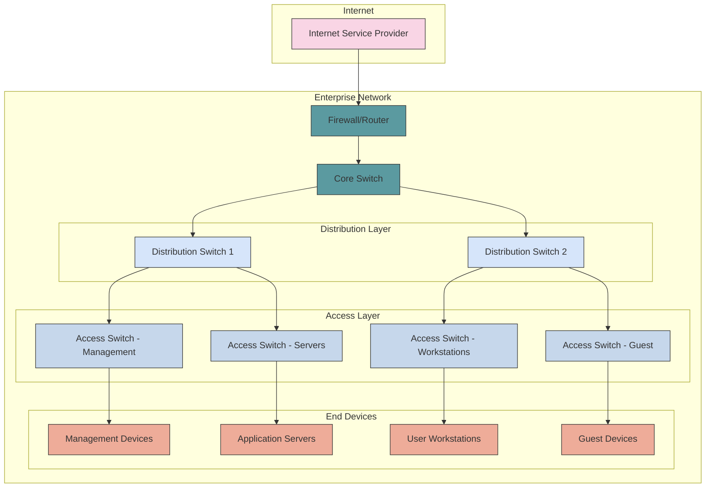

Design scalable, resilient, and secure network architectures for enterprise environments.

## Design Principles

### Hierarchical Network Design

Modern enterprise networks follow a three-tier hierarchical design model:

```text
┌─────────────────────────────────────────────────────────────────┐
│                Enterprise Network Architecture                  │
├─────────────────────────────────────────────────────────────────┤
│  Layer              │ Components                                │
│  ├─ Core            │ High-speed backbone, redundancy           │
│  ├─ Distribution    │ Routing, VLAN termination, security       │
│  ├─ Access          │ End-user connectivity, PoE, security      │
│  ├─ WAN/Internet    │ ISP connections, VPN, SD-WAN              │
│  ├─ DMZ             │ Public services, web servers, email       │
│  └─ Management      │ Out-of-band, monitoring, administration   │
└─────────────────────────────────────────────────────────────────┘
```

### Key Benefits

- **Scalability**: Easy to expand and modify
- **Redundancy**: Multiple paths for fault tolerance
- **Performance**: Optimized traffic flow
- **Manageability**: Simplified troubleshooting and maintenance
- **Security**: Segmentation and access control

## Network Topology

A typical enterprise network structure:



## Network Infrastructure Components

### Core Infrastructure

- High-performance routing and switching
- Redundant pathways for fault tolerance
- Minimal latency and maximum throughput

### Network Security

- Firewalls at network boundaries
- IDS/IPS for threat detection
- Network access control (NAC)

### Wireless Networks

- Enterprise Wi-Fi coverage
- Guest network isolation
- Mobility and roaming support

### WAN Connectivity

- Internet connections
- MPLS for site-to-site connectivity
- SD-WAN for intelligent routing
- VPN technologies for remote access

### Network Management

- Centralized monitoring and alerting
- Configuration management
- Automation and orchestration

## Related Topics

- [VLAN Strategy](vlans.md) - Network segmentation
- [Network Security](security/index.md) - Security architecture
- [Automation](automation.md) - Infrastructure as Code
