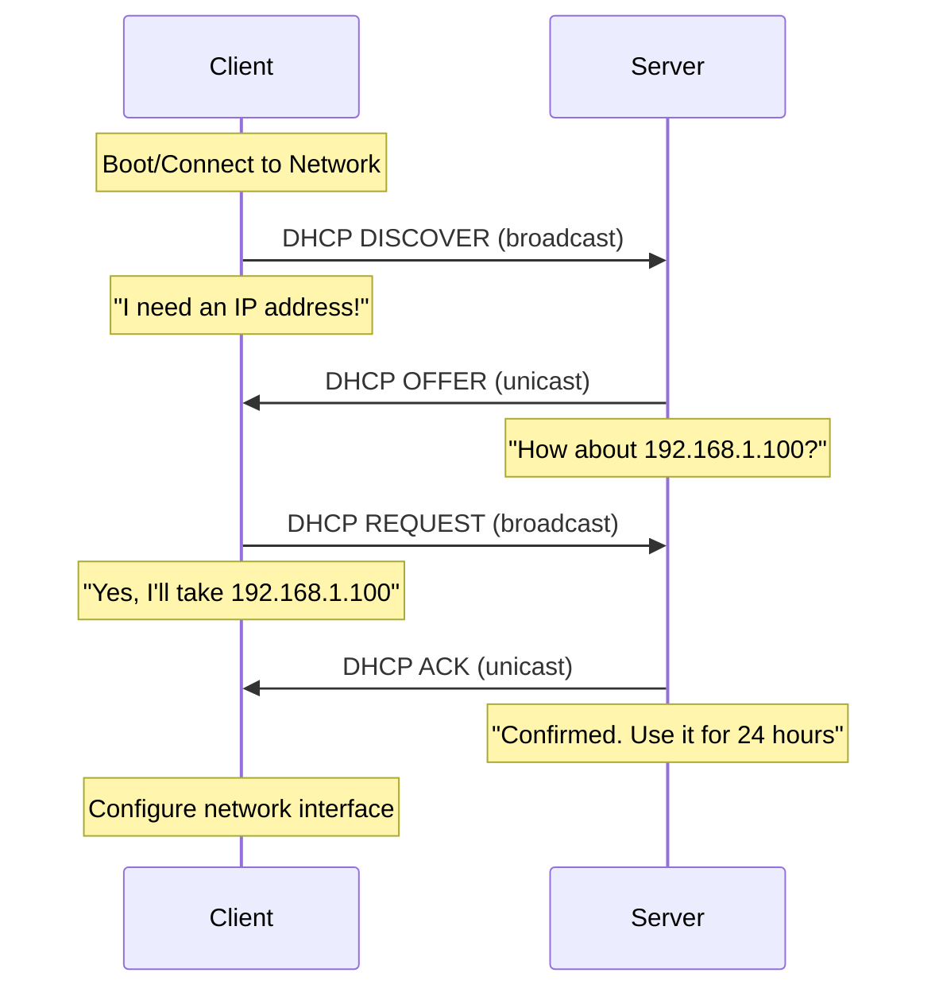

## Overview

Dynamic Host Configuration Protocol (DHCP) automatically assigns IP addresses and network configuration to devices on a network. Without DHCP, every device would need manual IP configuration - impractical for networks with dozens or hundreds of devices.

## Prerequisites

Before diving into DHCP, you should understand:

- [Network Fundamentals](fundamentals.md) - IP addressing, subnetting, and network basics
- [DNS](dns.md) - Name resolution (DHCP often provides DNS server addresses)
- Basic client-server architecture

## Why DHCP Matters

### Without DHCP (Manual/Static Configuration)

Every device requires manual configuration:

```text
IP Address: 192.168.1.100
Subnet Mask: 255.255.255.0
Default Gateway: 192.168.1.1
DNS Servers: 8.8.8.8, 8.8.4.4
```

**Problems**:

- Time-consuming for administrators
- Error-prone (typos, duplicate IPs)
- Difficult to track assignments
- Hard to update network-wide (new DNS server, gateway change)

### With DHCP (Automatic Configuration)

Device connects, DHCP server automatically provides:

- IP address (from available pool)
- Subnet mask
- Default gateway
- DNS servers
- Additional options (time servers, domain name, etc.)

**Benefits**:

- Zero client configuration
- Centralized management
- No IP conflicts
- Easy network-wide updates

## DHCP Process (DORA)

The DHCP assignment process uses four steps: **Discover, Offer, Request, Acknowledge**.



### DORA Breakdown

#### 1. DISCOVER (Client → Server, Broadcast)

Client broadcasts discovery message:

```text
Source: 0.0.0.0:68
Destination: 255.255.255.255:67
Message: "DHCP client requesting IP address"
Client MAC: aa:bb:cc:dd:ee:ff
```

#### 2. OFFER (Server → Client, Unicast/Broadcast)

Server responds with offer:

```text
Source: 192.168.1.1:67
Destination: 192.168.1.100:68 (or broadcast)
Offered IP: 192.168.1.100
Subnet Mask: 255.255.255.0
Gateway: 192.168.1.1
DNS: 8.8.8.8, 8.8.4.4
Lease Time: 86400 seconds (24 hours)
```

#### 3. REQUEST (Client → Server, Broadcast)

Client accepts offer:

```text
Source: 0.0.0.0:68
Destination: 255.255.255.255:67
Message: "I accept 192.168.1.100 from server 192.168.1.1"
```

**Why broadcast?** If multiple servers offered, this tells all servers which offer was accepted.

#### 4. ACKNOWLEDGE (Server → Client, Unicast/Broadcast)

Server confirms:

```text
Source: 192.168.1.1:67
Destination: 192.168.1.100:68
Message: "Confirmed. Configuration is yours."
Lease starts: Now
Lease expires: 24 hours from now
```

## DHCP Components

### DHCP Server

Manages IP address pools and leases. Can be:

- Dedicated appliance/server
- Router with DHCP service
- Windows Server (DHCP Server role)
- Linux server (ISC DHCP, dnsmasq, Kea)
- Virtual appliance

### DHCP Client

Any device requesting network configuration:

- Computers (Windows, Mac, Linux)
- Smartphones and tablets
- Printers
- IoT devices
- Network equipment

### DHCP Relay Agent

Forwards DHCP broadcasts between subnets:

```text
Client (VLAN 10)  →  Relay Agent  →  DHCP Server (VLAN 1)
   broadcast             unicast
```

**Why needed?** DHCP uses broadcasts (don't cross routers). Relay converts broadcasts to unicast.

## DHCP Scopes

A **scope** is a range of IP addresses available for assignment.

### Scope Configuration

```text
Scope Name: Corporate_LAN
Network: 192.168.10.0/24

IP Range: 192.168.10.100 - 192.168.10.200  (101 addresses)
Subnet Mask: 255.255.255.0
Default Gateway: 192.168.10.1
DNS Servers: 192.168.10.5, 192.168.10.6
Domain Name: corp.example.com
Lease Duration: 8 hours

Exclusions:
  192.168.10.150 - 192.168.10.160  (Reserved for servers)

Reservations:
  192.168.10.50  →  aa:bb:cc:dd:ee:ff  (printer.corp.example.com)
  192.168.10.51  →  11:22:33:44:55:66  (scanner.corp.example.com)
```

### Exclusion Ranges

IP addresses within scope that DHCP should **never** assign:

**Use Cases**:

- Static servers (file, print, domain controllers)
- Network infrastructure (switches, routers, APs)
- Printers with static IPs
- Manual testing/troubleshooting

**Example**:

```text
Scope: 192.168.1.100 - 192.168.1.200
Exclusion: 192.168.1.100 - 192.168.1.110

Available for DHCP: 192.168.1.111 - 192.168.1.200 (90 addresses)
```

### Reservations

Guarantees a specific IP to a specific device (by MAC address):

| Device | MAC Address | Reserved IP | Purpose |
|--------|-------------|-------------|---------|
| Network Printer | aa:bb:cc:11:22:33 | 192.168.1.50 | Always same IP for print queues |
| Security Camera | aa:bb:cc:44:55:66 | 192.168.1.51 | Firewall rules reference IP |
| Access Point | aa:bb:cc:77:88:99 | 192.168.1.52 | Management consistency |

**Advantages over Static IP**:

- Centralized management (all IPs in DHCP)
- Device still gets DNS, gateway automatically
- Can move device to different network easily

## DHCP Lease Process

### Lease Lifecycle

```text
Assign (T=0) → Renew (T=50%) → Rebind (T=87.5%) → Expire (T=100%)
```

#### Initial Assignment (T=0)

Client completes DORA process, receives 8-hour lease:

```text
IP: 192.168.1.100
Lease Start: 9:00 AM
Lease Expires: 5:00 PM
Renew at: 1:00 PM (50% = 4 hours)
Rebind at: 4:00 PM (87.5% = 7 hours)
```

#### Renewal (T=50%)

At 50% of lease (1:00 PM), client contacts **original** DHCP server:

```text
Client → Server: "Can I renew 192.168.1.100?"
Server → Client: "Yes, renewed for another 8 hours"
```

New expiration: 9:00 PM (8 hours from 1:00 PM)

#### Rebinding (T=87.5%)

If renewal fails, client broadcasts to **any** DHCP server at 87.5%:

```text
Client → Any Server: "Anyone can renew 192.168.1.100?"
```

#### Expiration (T=100%)

If no server responds by expiration, client loses IP address:

```text
Client: Release 192.168.1.100
Client: Start DISCOVER process again
```

### Lease Duration Considerations

| Duration | Use Case | Pros | Cons |
|----------|----------|------|------|
| **1-4 hours** | Guest WiFi, High-turnover | Efficient IP reuse | More network traffic |
| **8-12 hours** | Office workstations | Balanced | Standard |
| **24 hours** | General network | Less traffic | Slower IP reclamation |
| **7+ days** | Stable devices, servers | Minimal traffic | IP pool exhaustion |
| **Infinite** | Special cases | Effectively static | Defeats DHCP purpose |

**Recommendations**:

- **Workstations**: 8-12 hours
- **Guest WiFi**: 1-4 hours
- **IoT/Cameras**: 24 hours - 7 days
- **Reserved devices**: 24 hours+ (doesn't really matter)

## DHCP Options

DHCP can provide much more than just IP, subnet mask, and gateway.

### Common DHCP Options

| Option | Code | Purpose | Example |
|--------|------|---------|---------|
| **Subnet Mask** | 1 | Network mask | 255.255.255.0 |
| **Router** | 3 | Default gateway | 192.168.1.1 |
| **DNS Server** | 6 | Name servers | 8.8.8.8, 8.8.4.4 |
| **Domain Name** | 15 | DNS suffix | corp.example.com |
| **Broadcast Address** | 28 | Subnet broadcast | 192.168.1.255 |
| **NTP Server** | 42 | Time servers | 192.168.1.10 |
| **WINS Server** | 44 | NetBIOS name server | 192.168.1.20 (legacy) |
| **Requested IP** | 50 | Client requests specific IP | 192.168.1.100 |
| **Lease Time** | 51 | Seconds | 86400 (24 hours) |
| **DHCP Message Type** | 53 | Discover, Offer, Request, Ack | |
| **Server Identifier** | 54 | DHCP server IP | 192.168.1.1 |
| **TFTP Server** | 66 | Boot server | 192.168.1.50 |
| **Bootfile Name** | 67 | PXE boot file | pxelinux.0 |
| **Static Route** | 121 | Custom routes | 10.0.0.0/8 via 192.168.1.254 |

### Specialized Options

#### Option 66 & 67: PXE Boot

Network boot for thin clients, OS deployment:

```text
Option 66 (TFTP Server): 192.168.1.50
Option 67 (Boot File): \boot\pxelinux.0
```

**Use Case**: Deploying Windows/Linux images via network

#### Option 42: NTP Server

Automatically configure time synchronization:

```text
Option 42: 192.168.1.10, 129.6.15.28 (NIST)
```

#### Option 121: Classless Static Routes

Provide routing information to clients:

```text
Option 121: 10.0.0.0/8 via 192.168.1.254
```

**Use Case**: Route corporate traffic through VPN, internet through default gateway

## DHCP Server Implementation

### Windows Server

#### Install DHCP Role

```powershell
# Install DHCP Server role
Install-WindowsFeature -Name DHCP -IncludeManagementTools

# Authorize DHCP in Active Directory
Add-DhcpServerInDC -DnsName "dhcp-server.corp.local" -IPAddress 192.168.10.5
```

#### Create Scope

```powershell
# Create DHCP scope
Add-DhcpServerv4Scope -Name "Corporate LAN" `
    -StartRange 192.168.10.100 `
    -EndRange 192.168.10.200 `
    -SubnetMask 255.255.255.0 `
    -LeaseDuration 8:00:00 `
    -State Active

# Set scope options
Set-DhcpServerv4OptionValue -ScopeId 192.168.10.0 `
    -Router 192.168.10.1 `
    -DnsServer 192.168.10.5, 192.168.10.6 `
    -DnsDomain "corp.example.com"
```

#### Create Reservation

```powershell
Add-DhcpServerv4Reservation -ScopeId 192.168.10.0 `
    -IPAddress 192.168.10.50 `
    -ClientId "aa-bb-cc-dd-ee-ff" `
    -Name "Printer - HP LaserJet" `
    -Description "Accounting Department Printer"
```

### Linux (ISC DHCP Server)

#### Install

```bash
# Ubuntu/Debian
sudo apt install isc-dhcp-server

# RHEL/CentOS
sudo yum install dhcp-server
```

#### Configure: /etc/dhcp/dhcpd.conf

```text
# Global options
option domain-name "corp.example.com";
option domain-name-servers 192.168.10.5, 192.168.10.6;
default-lease-time 28800;  # 8 hours
max-lease-time 86400;       # 24 hours

# Subnet declaration
subnet 192.168.10.0 netmask 255.255.255.0 {
    range 192.168.10.100 192.168.10.200;
    option routers 192.168.10.1;
    option broadcast-address 192.168.10.255;
    
    # Reservation
    host printer {
        hardware ethernet aa:bb:cc:dd:ee:ff;
        fixed-address 192.168.10.50;
    }
}

# Multiple subnets
subnet 192.168.20.0 netmask 255.255.255.0 {
    range 192.168.20.100 192.168.20.200;
    option routers 192.168.20.1;
}
```

#### Start Service

```bash
sudo systemctl enable isc-dhcp-server
sudo systemctl start isc-dhcp-server
sudo systemctl status isc-dhcp-server
```

### Linux (dnsmasq - Lightweight)

Ideal for home networks, small offices:

```bash
# Install
sudo apt install dnsmasq

# Configure: /etc/dnsmasq.conf
interface=eth0
dhcp-range=192.168.1.100,192.168.1.200,12h
dhcp-option=3,192.168.1.1           # Gateway
dhcp-option=6,8.8.8.8,8.8.4.4       # DNS
dhcp-host=aa:bb:cc:dd:ee:ff,192.168.1.50  # Reservation

# Start
sudo systemctl restart dnsmasq
```

## DHCP Relay Agent

Forwards DHCP requests across subnets.

### Why Needed?

```text
VLAN 10 (192.168.10.0/24)  ←→  Router/Switch  ←→  VLAN 1 (192.168.1.0/24)
    Clients                     Relay Agent          DHCP Server
```

Clients in VLAN 10 send broadcast (doesn't cross router). Relay agent converts to unicast to DHCP server.

### Configuration

#### Cisco Router/Switch

```text
interface Vlan10
 ip address 192.168.10.1 255.255.255.0
 ip helper-address 192.168.1.5
```

#### Linux (isc-dhcp-relay)

```bash
# Install
sudo apt install isc-dhcp-relay

# Configure: /etc/default/isc-dhcp-relay
SERVERS="192.168.1.5"        # DHCP server IP
INTERFACES="eth0 eth1"        # Interfaces to relay
```

## Troubleshooting DHCP

### Common Issues

#### Clients Not Getting IP Addresses

**Symptoms**:

- Self-assigned IP (169.254.x.x on Windows)
- "Limited connectivity" or "No internet"

**Checklist**:

1. **Verify DHCP server running**:

   ```powershell
   # Windows Server
   Get-Service DHCPServer
   
   # Linux
   sudo systemctl status isc-dhcp-server
   ```

2. **Check scope has available IPs**:

   ```powershell
   # Windows
   Get-DhcpServerv4ScopeStatistics
   
   # Linux
   sudo less /var/lib/dhcp/dhcpd.leases
   ```

3. **Verify network connectivity** (client → server)

4. **Check firewall rules** (allow UDP 67-68)

5. **DHCP relay configured** (if different subnets)

#### IP Address Conflicts

**Symptoms**:

- "IP address conflict" error
- Intermittent connectivity

**Causes**:

- Device with static IP in DHCP range
- Two DHCP servers on network
- Lease database corruption

**Solutions**:

1. **Add exclusion** for static IPs
2. **Disable rogue DHCP** servers
3. **Reconcile scope** (Windows):

   ```powershell
   Repair-DhcpServerv4IPRecord -ScopeId 192.168.10.0
   ```

#### Wrong Configuration

**Symptoms**:

- Incorrect gateway
- DNS not working
- Wrong domain name

**Solutions**:

1. **Verify scope options**:

   ```powershell
   Get-DhcpServerv4OptionValue -ScopeId 192.168.10.0
   ```

2. **Release and renew** on client:

   ```bash
   # Windows
   ipconfig /release
   ipconfig /renew
   
   # Linux
   sudo dhclient -r
   sudo dhclient
   
   # Mac
   sudo ipconfig set en0 BOOTP
   sudo ipconfig set en0 DHCP
   ```

### DHCP Troubleshooting Commands

#### View Current Lease (Client)

```bash
# Windows
ipconfig /all

# Linux
ip addr show
nmcli device show eth0

# Mac
ipconfig getpacket en0
```

#### Release/Renew Lease

```bash
# Windows
ipconfig /release
ipconfig /renew

# Linux
sudo dhclient -r eth0    # Release
sudo dhclient eth0       # Renew

# Mac
sudo ipconfig set en0 DHCP
```

#### View DHCP Leases (Server)

```powershell
# Windows Server
Get-DhcpServerv4Lease -ScopeId 192.168.10.0

# Linux
sudo less /var/lib/dhcp/dhcpd.leases
sudo dhcp-lease-list
```

#### Packet Capture

```bash
# Capture DHCP traffic (Linux)
sudo tcpdump -i eth0 -n port 67 or port 68

# Filter in Wireshark
bootp
```

### DHCP Server Logs

#### Windows

```powershell
# Event Viewer
Get-WinEvent -LogName "Microsoft-Windows-Dhcp-Server/Operational" -MaxEvents 50
```

#### Linux

```bash
# ISC DHCP
sudo tail -f /var/log/syslog | grep dhcpd

# dnsmasq
sudo tail -f /var/log/syslog | grep dnsmasq
```

## Best Practices

### General DHCP Management

1. **Document scope design** - Keep records of IP ranges, exclusions, reservations
2. **Monitor scope utilization** - Alert when >80% allocated
3. **Use appropriate lease times** - Balance convenience vs. efficiency
4. **Implement redundancy** - Multiple DHCP servers (failover/split-scope)
5. **Regular audits** - Review and clean up old reservations
6. **Centralized logging** - Collect DHCP logs for troubleshooting

### Security

1. **DHCP snooping** - Prevent rogue DHCP servers (switch feature)
2. **Port security** - Limit MAC addresses per switch port
3. **Monitoring** - Alert on unexpected DHCP servers
4. **Segregation** - Use VLANs to separate network segments

### Scope Design

1. **Reserve static IP range** - Exclude first/last portions for infrastructure
2. **Use reservations over static** - Centralize IP management
3. **Standardize gateway** - Always .1 or .254 for consistency
4. **Document** - Maintain spreadsheet of reservations and purpose

## Advanced Topics

### DHCP Failover (Windows Server)

High availability configuration:

```powershell
Add-DhcpServerv4Failover -ComputerName "DHCP1" `
    -PartnerServer "DHCP2" `
    -Name "Corp-Failover" `
    -ScopeId 192.168.10.0 `
    -LoadBalancePercent 50 `
    -MaxClientLeadTime 1:00:00 `
    -AutoStateTransition $True `
    -StateSwitchInterval 1:00:00
```

**Modes**:

- **Load Balance**: Both servers active, 50/50 split
- **Hot Standby**: Primary active, secondary backup

### DHCP Snooping (Switch Configuration)

Protects against rogue DHCP servers:

```text
# Cisco Switch
ip dhcp snooping
ip dhcp snooping vlan 10,20
interface GigabitEthernet0/1
 ip dhcp snooping trust     # Uplink to legit DHCP server
```

**How it works**:

- Block DHCP server responses on untrusted ports
- Only trusted ports can send DHCP offers
- Builds binding table (MAC + IP + Port)

### IPv6 and DHCPv6

IPv6 has two methods:

- **SLAAC** (Stateless Address Autoconfiguration) - Router advertises prefix, device generates IP
- **DHCPv6** - Similar to DHCPv4

```powershell
# Windows Server DHCPv6 scope
Add-DhcpServerv6Scope -Name "IPv6 Scope" `
    -Prefix 2001:db8:1:10:: `
    -PreferredLifetime 8:00:00 `
    -ValidLifetime 12:00:00
```

## Related Topics

- [DNS](dns.md) - DHCP often provides DNS server addresses
- [Network Fundamentals](fundamentals.md) - IP addressing and subnetting
- [VLANs](vlans.md) - DHCP scopes per VLAN
- [Troubleshooting](troubleshooting.md) - Network connectivity issues
- [Automation](automation.md) - PowerShell DHCP management

## Next Steps

After understanding DHCP:

1. Integrate with [DNS for dynamic updates](dns.md)
2. Implement [VLAN-specific scopes](vlans.md)
3. Configure [DHCP relay agents](routing.md) for multi-subnet networks
4. Set up [monitoring and alerting](troubleshooting.md)
5. Automate with [PowerShell scripts](automation.md)

## Additional Resources

- **RFC 2131** - Dynamic Host Configuration Protocol
- **RFC 2132** - DHCP Options and BOOTP Vendor Extensions
- **RFC 3315** - Dynamic Host Configuration Protocol for IPv6 (DHCPv6)
- **Microsoft DHCP Documentation**: <https://docs.microsoft.com/en-us/windows-server/networking/technologies/dhcp/dhcp-top>
- **ISC DHCP**: <https://www.isc.org/dhcp/>

---

*DHCP is essential for scalable network management. Proper DHCP configuration ensures smooth network operations and simplified administration.*
