## Overview

Consistent network diagrams improve communication, troubleshooting, and documentation quality. This guide establishes standardized conventions for creating network diagrams using Mermaid syntax in our documentation.

## Mermaid Diagram Types

### Graph (Network Topology)

**Use for**: Physical and logical network layouts

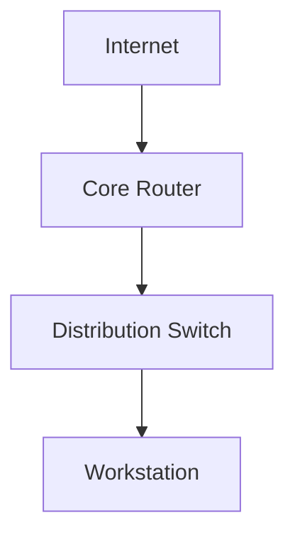

### Sequence (Protocol Flows)

**Use for**: DHCP, DNS, authentication sequences

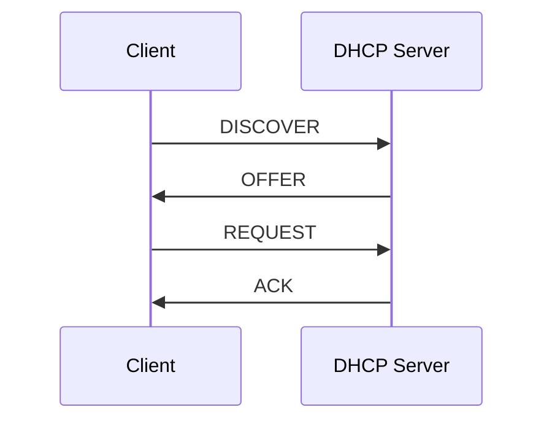

### Flowchart (Troubleshooting)

**Use for**: Decision trees, troubleshooting guides

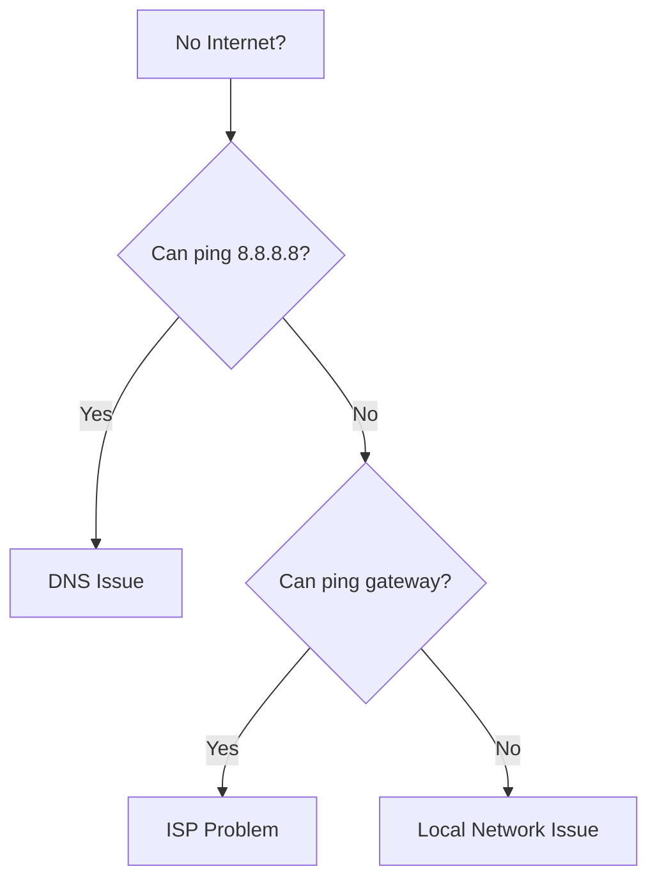

## Color Scheme Standards

### Device Type Colors

Use `classDef` to define consistent colors for device categories:

```mermaid
graph TD
    Internet[Internet]:::internet
    Router[Router]:::infrastructure
    Switch[Switch]:::infrastructure
    Server[Server]:::server
    PC[Workstation]:::device
    Printer[Printer]:::device
    AP[WiFi AP]:::wireless
    
    classDef internet fill:#f9d5e5,stroke:#c83349,stroke-width:2px,color:#000
    classDef infrastructure fill:#5b9aa0,stroke:#2c5f66,stroke-width:2px,color:#fff
    classDef server fill:#c83349,stroke:#8b2332,stroke-width:2px,color:#fff
    classDef device fill:#d6e5fa,stroke:#5b9bd5,stroke-width:2px,color:#000
    classDef wireless fill:#e0aaaa,stroke:#b87777,stroke-width:2px,color:#000
```

**Result**:


### VLAN/Segment Colors

Use subgraphs with consistent colors for network segments:

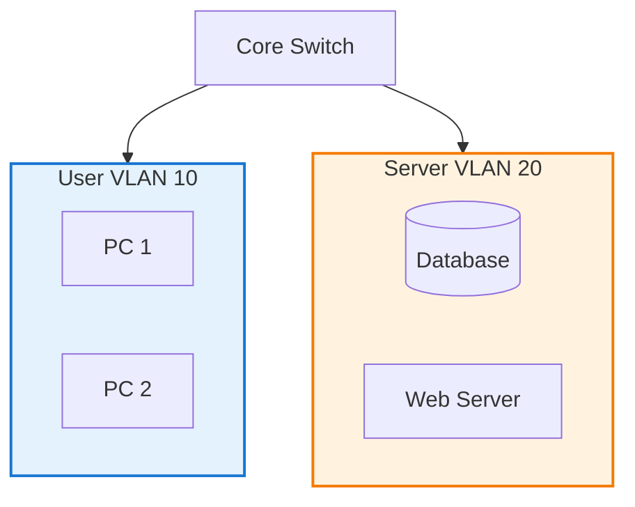

**Result**:


### Standard Color Palette

| Category | Fill Color | Stroke Color | Text Color | Use Case |
| --- | --- | --- | --- | --- |
| **Internet/Cloud** | `#f9d5e5` | `#c83349` | `#000` | External connectivity |
| **Infrastructure** | `#5b9aa0` | `#2c5f66` | `#fff` | Routers, switches, firewalls |
| **Servers** | `#c83349` | `#8b2332` | `#fff` | File, web, database servers |
| **Devices** | `#d6e5fa` | `#5b9bd5` | `#000` | Workstations, laptops |
| **Wireless** | `#e0aaaa` | `#b87777` | `#000` | Access points, wireless controllers |
| **Printers/IoT** | `#d5e8d4` | `#82b366` | `#000` | Network printers, IoT devices |
| **Management** | `#fff2cc` | `#d6b656` | `#000` | Management interfaces, OOB |
| **User VLAN** | `#e3f2fd` | `#1976d2` | `#000` | User network segments |
| **Server VLAN** | `#fff3e0` | `#f57c00` | `#000` | Server network segments |
| **Guest VLAN** | `#f3e5f5` | `#8e24aa` | `#000` | Guest/isolated networks |

## Node Shape Standards

### Device Shapes

Use consistent shapes to represent device types:

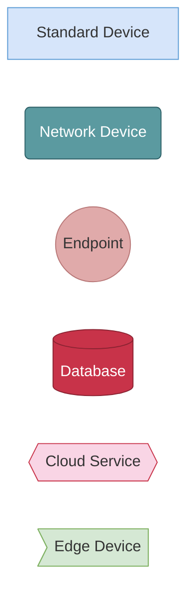

**Shape Guidelines**:

| Shape | Syntax | Device Type | Example |
| --- | --- | --- | --- |
| **Rectangle** | `Node[Label]` | Generic devices, workstations | `PC[Workstation]` |
| **Round** | `Node(Label)` | Network infrastructure | `Router(Core Router)` |
| **Circle** | `Node((Label))` | Wireless, endpoints | `AP((WiFi AP))` |
| **Cylinder** | `Node[(Label)]` | Databases, storage | `DB[(Database)]` |
| **Cloud** | `Node{{Label}}` | Internet, cloud services | `Internet{{Internet}}` |
| **Hexagon** | `Node>Label]` | Firewalls, edge devices | `FW>Firewall]` |
| **Diamond** | `Node{Label}` | Decision points | `Check{Condition?}` |

## Labeling Standards

### Device Labels

**Format**: `DeviceType<br/>Additional Info`

Use `<br/>` for multi-line labels with supplementary information:

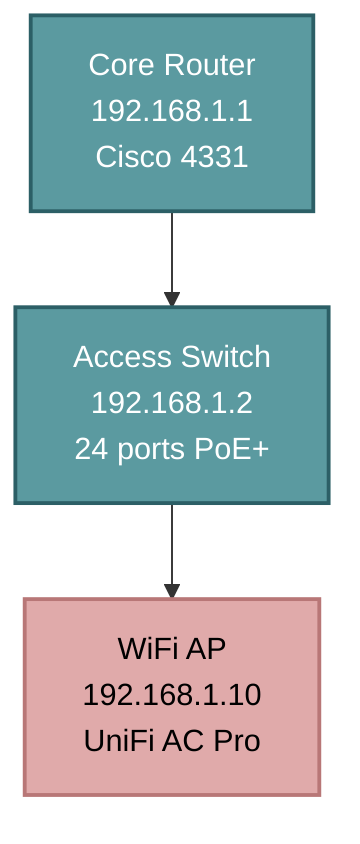

**Include**:
- Device name/type (first line)
- IP address (if relevant)
- Model or key specs

### Link Labels

Use link labels to show bandwidth, VLAN, or connection type:

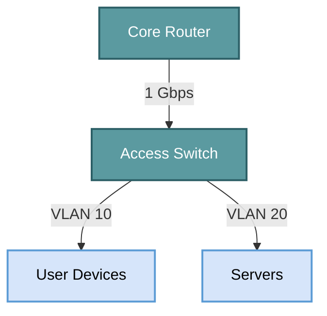

### Arrow Styles

Differentiate connection types:

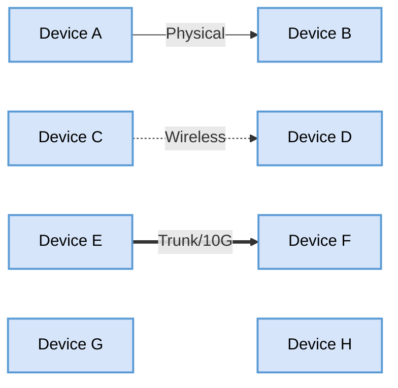

| Arrow Style | Syntax | Meaning |
| --- | --- | --- |
| **Solid** | `-->` | Physical wired connection |
| **Dotted** | `-.->` | Wireless or logical connection |
| **Thick** | `==>` | High-bandwidth link (10G+) or trunk |
| **No arrow** | `~~~` | Proximity/grouping (no connection) |

## Layout Guidelines

### Top-to-Bottom Flow

**Standard**: Internet/WAN at top, devices at bottom

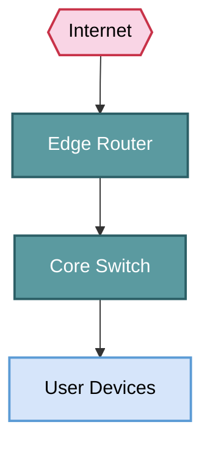

### Left-to-Right Flow (Sequences)

**Standard**: Client on left, server on right

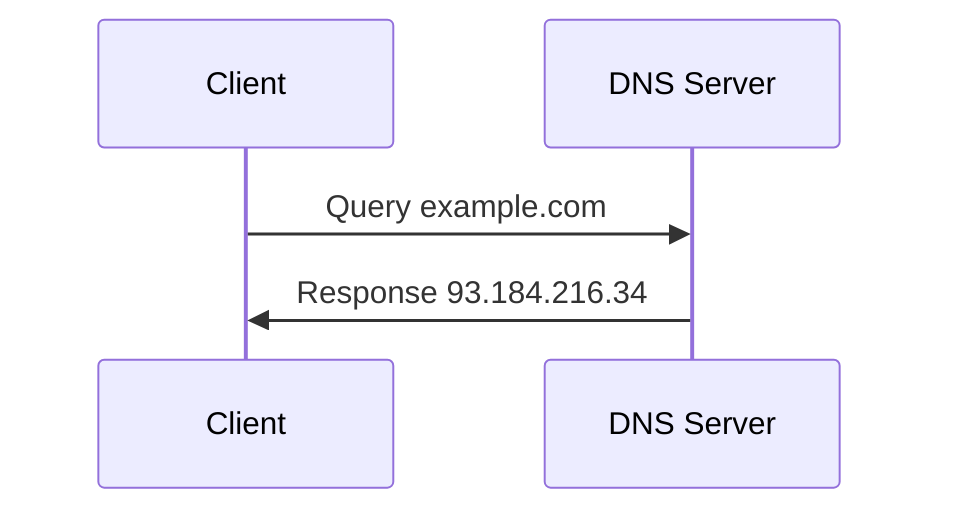

### Hierarchical Layouts

Use subgraphs to group related components:

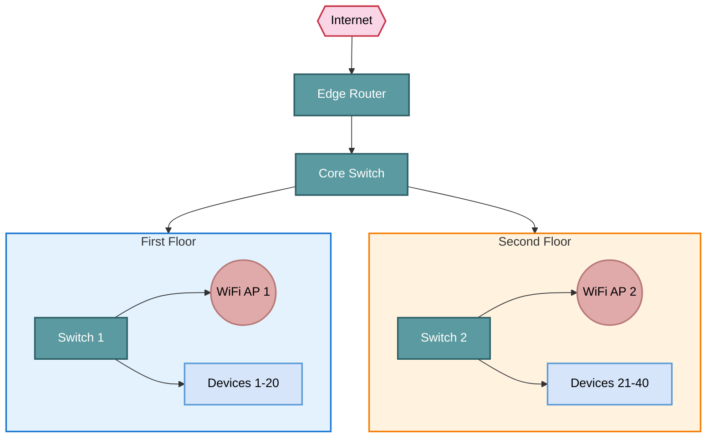

## Reusable Templates

### Basic Network Topology

```markdown
\`\`\`mermaid
graph TD
    Internet{{Internet}}:::internet
    Router[Edge Router<br/>192.168.1.1]:::infrastructure
    Switch[Core Switch<br/>192.168.1.2]:::infrastructure
    AP((WiFi AP<br/>192.168.1.10)):::wireless
    Server[File Server<br/>192.168.1.20]:::server
    PC[Workstations]:::device
    
    Internet --> Router
    Router --> Switch
    Switch --> AP
    Switch --> Server
    Switch --> PC
    
    classDef internet fill:#f9d5e5,stroke:#c83349,stroke-width:2px,color:#000
    classDef infrastructure fill:#5b9aa0,stroke:#2c5f66,stroke-width:2px,color:#fff
    classDef server fill:#c83349,stroke:#8b2332,stroke-width:2px,color:#fff
    classDef device fill:#d6e5fa,stroke:#5b9bd5,stroke-width:2px,color:#000
    classDef wireless fill:#e0aaaa,stroke:#b87777,stroke-width:2px,color:#000
\`\`\`
```

### VLAN Segmentation

```markdown
\`\`\`mermaid
graph TD
    Router[Core Router]:::infrastructure
    
    subgraph VLAN10 [VLAN 10 - Users<br/>192.168.10.0/24]
        PC1[Workstation 1]
        PC2[Workstation 2]
    end
    
    subgraph VLAN20 [VLAN 20 - Servers<br/>192.168.20.0/24]
        Web[Web Server]
        DB[(Database)]
    end
    
    subgraph VLAN30 [VLAN 30 - Guest<br/>192.168.30.0/24]
        Guest[Guest Devices]
    end
    
    Router --> VLAN10
    Router --> VLAN20
    Router --> VLAN30
    
    style VLAN10 fill:#e3f2fd,stroke:#1976d2,stroke-width:2px
    style VLAN20 fill:#fff3e0,stroke:#f57c00,stroke-width:2px
    style VLAN30 fill:#f3e5f5,stroke:#8e24aa,stroke-width:2px
    
    classDef infrastructure fill:#5b9aa0,stroke:#2c5f66,stroke-width:2px,color:#fff
    class Router infrastructure
\`\`\`
```

### DHCP Process Flow

```markdown
\`\`\`mermaid
sequenceDiagram
    participant Client
    participant DHCP Server
    
    Note over Client: No IP Address
    Client->>DHCP Server: DHCPDISCOVER (broadcast)
    DHCP Server->>Client: DHCPOFFER (192.168.1.100)
    Client->>DHCP Server: DHCPREQUEST (192.168.1.100)
    DHCP Server->>Client: DHCPACK
    Note over Client: IP: 192.168.1.100<br/>Gateway: 192.168.1.1<br/>DNS: 8.8.8.8
\`\`\`
```

### Troubleshooting Decision Tree

```markdown
\`\`\`mermaid
flowchart TD
    Start[No Internet Connection?] --> Local{Can access local resources?}
    Local -->|Yes| Gateway{Can ping gateway?}
    Local -->|No| Cable[Check cable/WiFi]
    
    Gateway -->|Yes| DNS{Can ping 8.8.8.8?}
    Gateway -->|No| RouterIssue[Router problem]
    
    DNS -->|Yes| DNSIssue[DNS issue - check settings]
    DNS -->|No| ISPIssue[ISP/WAN problem]
    
    style Start fill:#c83349,stroke:#8b2332,stroke-width:2px,color:#fff
    style DNSIssue fill:#d5e8d4,stroke:#82b366,stroke-width:2px
    style ISPIssue fill:#f9d5e5,stroke:#c83349,stroke-width:2px
    style RouterIssue fill:#fff2cc,stroke:#d6b656,stroke-width:2px
\`\`\`
```

## Best Practices

### Diagram Simplicity

**DO**:
- Group similar devices: `Users[10 Workstations]` instead of 10 individual nodes
- Use subgraphs for logical grouping (floors, VLANs, sites)
- Limit diagrams to one logical concept (physical topology OR VLAN design, not both)

**DON'T**:
- Overload with every device (show representative samples)
- Mix abstraction levels (don't show cables on a logical VLAN diagram)
- Use more than 15-20 nodes per diagram

### Consistency

- **Always** define color classes when using device categories
- **Always** include IP addresses for infrastructure devices
- **Always** label bandwidth on key links (1 Gbps, 10 Gbps)
- **Always** use the same color/shape for the same device type across all diagrams

### Accessibility

- **Use high-contrast colors** (avoid pastels on white backgrounds)
- **Include text labels** (don't rely solely on color)
- **Test diagrams in dark mode** (if documentation supports it)

### Documentation Integration

**In each diagram, include**:
- **Title**: "Network Topology - Branch Office"
- **Legend** (if using custom symbols):
  ```
  Legend:
  - Blue = Infrastructure
  - Red = Servers
  - Light Blue = User Devices
  - Pink = Wireless
  ```
- **Date/Version**: Last updated information in YAML frontmatter

## Common Patterns

### Site-to-Site VPN

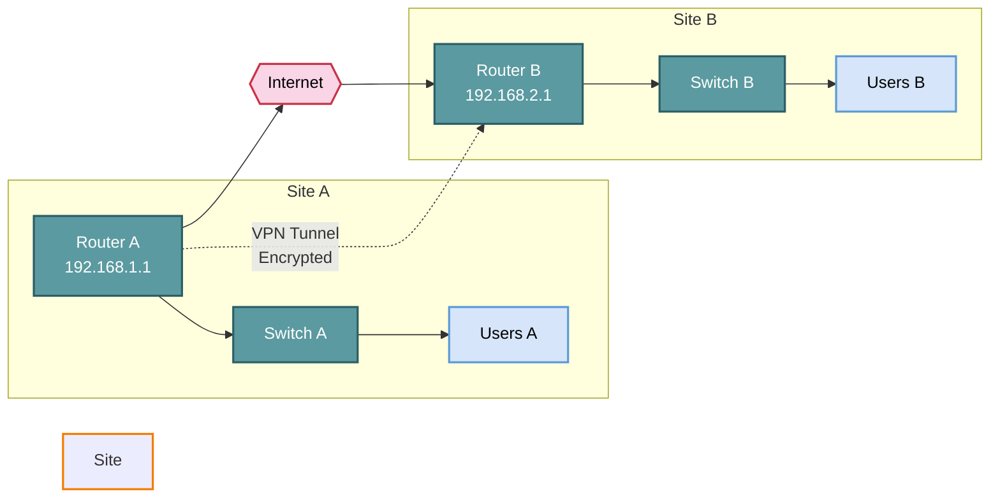

### Redundant Core

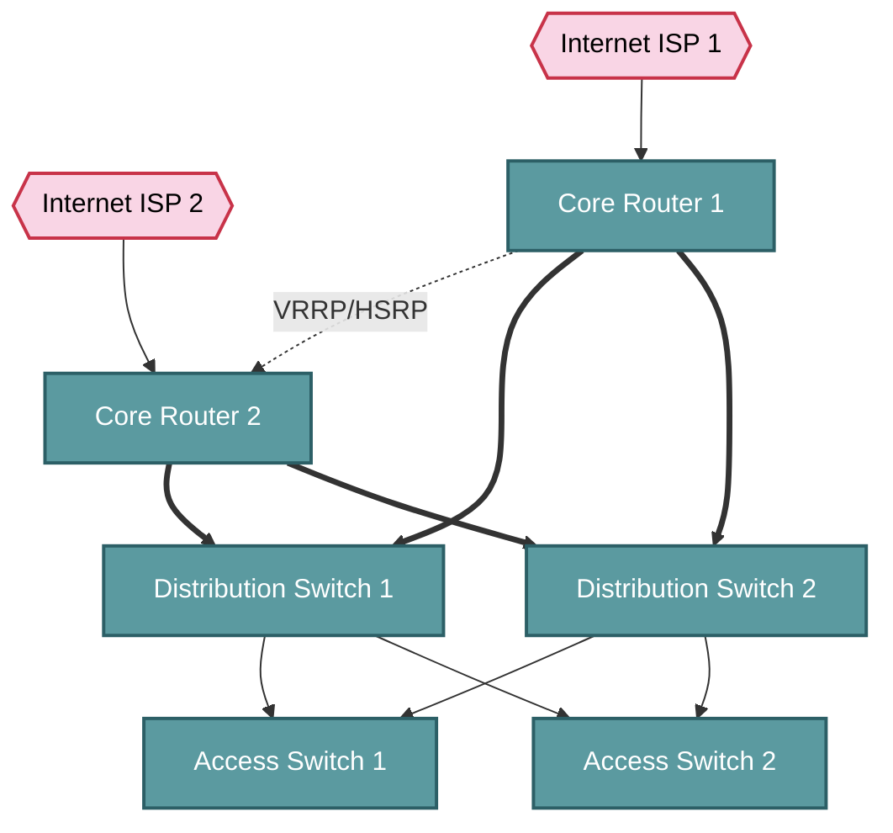

## Review Checklist

Before publishing a diagram:

- ☐ All devices have clear labels
- ☐ IP addresses included for infrastructure
- ☐ Color scheme applied consistently
- ☐ Links labeled with bandwidth/VLAN where relevant
- ☐ Diagram follows left-to-right or top-to-bottom flow
- ☐ No more than 20 nodes (or grouped appropriately)
- ☐ Legend included if using custom symbols/colors
- ☐ Mermaid syntax validated (renders correctly)
- ☐ Alternative text provided for accessibility

## Related Topics

- [Network Fundamentals](fundamentals.md) - Understanding network components
- [Architecture](architecture.md) - Network design principles
- [Scenarios](scenarios/index.md) - Real-world topology examples
- [Troubleshooting](troubleshooting.md) - Using diagrams for diagnosis

## Tools and Resources

- **Mermaid Live Editor**: [mermaid.live](https://mermaid.live) - Test diagrams before adding to docs
- **Mermaid Documentation**: [mermaid.js.org](https://mermaid.js.org) - Full syntax reference
- **Color Picker**: Use ColorBrewer or similar for accessible color schemes

---

*Standardized diagrams reduce confusion, improve collaboration, and make network documentation more professional and maintainable.*
