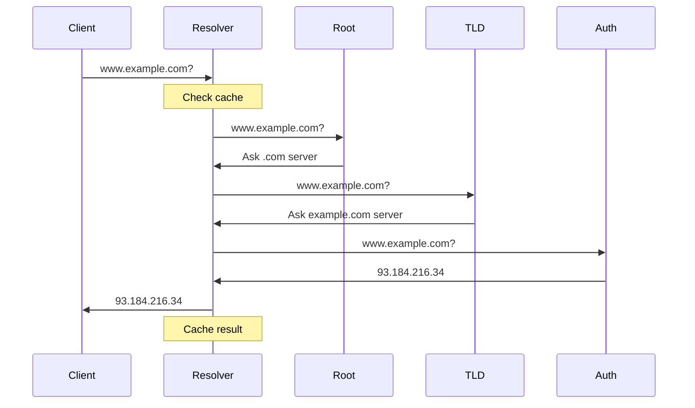

## Overview

The Domain Name System (DNS) is a hierarchical, distributed naming system that translates human-readable domain names (like `google.com`) into IP addresses (like `142.250.80.46`) that computers use to identify each other on the network. DNS is often called the "phonebook of the internet."

## Prerequisites

Before diving into DNS, you should understand:

- [Network Fundamentals](fundamentals.md) - IP addressing and basic protocols
- [OSI Model](osi-model.md) - Application Layer (Layer 7) operations
- Basic understanding of client-server architecture

## Why DNS Matters

Without DNS, you would need to memorize IP addresses:

- Instead of `google.com` → type `142.250.80.46`
- Instead of `github.com` → type `140.82.121.4`
- Instead of `amazon.com` → type `54.239.28.85`

DNS makes the internet usable for humans while maintaining the efficiency of IP-based routing.

## DNS Hierarchy

DNS is organized as an inverted tree structure:

```text
                         . (Root)
                         |
        ┌────────────────┼────────────────┐
        |                |                |
       com              org              net
        |                |                |
    ┌───┴───┐        ┌───┴───┐        ┌───┴───┐
    |       |        |       |        |       |
  google  amazon  wikipedia eff    cloudflare github
    |       |        |       |        |       |
   www     www      www     www      www     www
```

### DNS Levels

1. **Root Level (.)** - Top of hierarchy, 13 root server clusters worldwide
2. **Top-Level Domains (TLDs)** - `.com`, `.org`, `.net`, `.edu`, country codes (`.uk`, `.jp`)
3. **Second-Level Domains** - `google` in `google.com`, `amazon` in `amazon.com`
4. **Subdomains** - `www` in `www.google.com`, `mail` in `mail.google.com`
5. **Hosts** - Specific machines like `server1.internal.company.com`

### Fully Qualified Domain Name (FQDN)

A complete domain name specifying exact location in the DNS hierarchy:

```text
www.shop.amazon.com.
 |   |    |      |  |
 |   |    |      |  └─ Root (usually implicit)
 |   |    |      └──── TLD
 |   |    └─────────── Second-level domain
 |   └──────────────── Subdomain
 └──────────────────── Host
```

## DNS Query Process

When you type `www.example.com` in your browser:



### Query Types

#### Recursive Query

Client expects complete answer from DNS server. Server does all the work.

**Example**: Your computer asks your ISP's DNS server for `google.com`.

```text
Client → Resolver: "What is google.com?"
Resolver: "I'll find out for you..."
Resolver → Root → TLD → Authoritative → Resolver
Resolver → Client: "It's 142.250.80.46"
```

#### Iterative Query

Server responds with best information it has, client does the work.

**Example**: DNS resolver asking root, TLD, and authoritative servers.

```text
Resolver → Root: "What is google.com?"
Root → Resolver: "I don't know, but ask .com server at 192.5.6.30"
Resolver → TLD (.com): "What is google.com?"
TLD → Resolver: "I don't know, but ask google.com's server at 8.8.8.8"
Resolver → Authoritative: "What is google.com?"
Authoritative → Resolver: "It's 142.250.80.46"
```

## DNS Record Types

DNS records are stored in zone files on authoritative DNS servers.

### Common Record Types

| Record Type | Purpose | Example |
|-------------|---------|---------|
| **A** | IPv4 address | `example.com` → `93.184.216.34` |
| **AAAA** | IPv6 address | `example.com` → `2606:2800:220:1:248:1893:25c8:1946` |
| **CNAME** | Canonical name (alias) | `www.example.com` → `example.com` |
| **MX** | Mail exchange | `example.com` → `mail.example.com` (priority 10) |
| **NS** | Name server | `example.com` → `ns1.example.com` |
| **TXT** | Text information | SPF, DKIM, domain verification |
| **PTR** | Reverse lookup | `34.216.184.93.in-addr.arpa` → `example.com` |
| **SOA** | Start of authority | Zone metadata, serial number |
| **SRV** | Service locator | `_ldap._tcp.example.com` → `ldap.example.com:389` |

### Example Zone File

```text
; Zone file for example.com
$ORIGIN example.com.
$TTL 86400

; SOA Record
@   IN  SOA ns1.example.com. admin.example.com. (
            2025123001  ; Serial (YYYYMMDDNN)
            7200        ; Refresh
            3600        ; Retry
            1209600     ; Expire
            86400       ; Minimum TTL
)

; Name Server Records
@       IN  NS      ns1.example.com.
@       IN  NS      ns2.example.com.

; A Records (IPv4)
@       IN  A       93.184.216.34
www     IN  A       93.184.216.34
mail    IN  A       93.184.216.35
ftp     IN  A       93.184.216.36

; AAAA Records (IPv6)
@       IN  AAAA    2606:2800:220:1:248:1893:25c8:1946

; CNAME Records (Aliases)
blog    IN  CNAME   www.example.com.
shop    IN  CNAME   www.example.com.

; MX Records (Mail)
@       IN  MX  10  mail.example.com.
@       IN  MX  20  mail2.example.com.

; TXT Records
@       IN  TXT     "v=spf1 mx a ip4:93.184.216.0/24 -all"
```

### Record Details

#### A Record (Address)

Maps hostname to IPv4 address:

```text
example.com.    300    IN    A    93.184.216.34
```

- **300** = TTL (Time To Live) in seconds
- **IN** = Internet class
- **A** = Record type
- **93.184.216.34** = IPv4 address

#### CNAME Record (Canonical Name)

Creates an alias for another hostname:

```text
www.example.com.    300    IN    CNAME    example.com.
```

**Important**: CNAME cannot coexist with other records for the same name.

**Use Cases**:

- Point multiple hostnames to same server
- Easier to update (change once at target)
- CDN configurations

#### MX Record (Mail Exchange)

Specifies mail servers for domain:

```text
example.com.    300    IN    MX    10    mail.example.com.
example.com.    300    IN    MX    20    backup-mail.example.com.
```

- **10**, **20** = Priority (lower = preferred)
- Mail servers tried in priority order

#### TXT Record (Text)

Arbitrary text information, commonly used for:

**SPF (Sender Policy Framework)** - Authorized email senders:

```text
example.com.    IN    TXT    "v=spf1 mx a include:_spf.google.com ~all"
```

**DKIM (DomainKeys Identified Mail)** - Email authentication:

```text
default._domainkey.example.com.    IN    TXT    "v=DKIM1; k=rsa; p=MIGfMA0GCS..."
```

**DMARC (Domain-based Message Authentication)** - Email policy:

```text
_dmarc.example.com.    IN    TXT    "v=DMARC1; p=quarantine; rua=mailto:dmarc@example.com"
```

**Domain Verification**:

```text
example.com.    IN    TXT    "google-site-verification=abc123def456"
```

#### SRV Record (Service)

Specifies location of services:

```text
_service._proto.name    TTL    IN    SRV    priority    weight    port    target

_ldap._tcp.example.com.    300    IN    SRV    0    5    389    ldap.example.com.
```

**Fields**:

- **Priority**: Lower values preferred (like MX)
- **Weight**: Load distribution among same priority
- **Port**: Service port number
- **Target**: Hostname providing service

**Common Uses**:

- `_ldap._tcp` - LDAP directory services
- `_kerberos._tcp` - Kerberos authentication
- `_sip._tcp` - VoIP/SIP services
- `_xmpp-client._tcp` - XMPP/Jabber messaging

## DNS Caching

### Time To Live (TTL)

TTL specifies how long DNS records can be cached:

| TTL Value | Duration | Use Case |
|-----------|----------|----------|
| 60 | 1 minute | Testing, frequent changes |
| 300 | 5 minutes | Services that may change |
| 3600 | 1 hour | Standard websites |
| 86400 | 24 hours | Stable infrastructure |

**Trade-offs**:

- **Low TTL** (60-300s): Fast updates, but more DNS traffic
- **High TTL** (3600-86400s): Less DNS traffic, but slower updates

### Cache Levels

1. **Browser Cache** - Built into web browsers
2. **OS Cache** - Operating system resolver cache
3. **Recursive Resolver** - ISP or corporate DNS cache
4. **Authoritative Server** - Original source (not cached)

### Clearing DNS Cache

#### Windows

```cmd
ipconfig /flushdns
ipconfig /displaydns  # View cache
```

#### Mac

```bash
sudo dscacheutil -flushcache
sudo killall -HUP mDNSResponder
```

#### Linux

```bash
# systemd-resolved
sudo systemd-resolve --flush-caches

# nscd
sudo /etc/init.d/nscd restart

# dnsmasq
sudo /etc/init.d/dnsmasq restart
```

## DNS Server Types

### Recursive Resolver (Caching Nameserver)

Performs queries on behalf of clients. Examples:

- ISP DNS servers
- Google Public DNS (8.8.8.8, 8.8.4.4)
- Cloudflare DNS (1.1.1.1, 1.0.0.1)
- Quad9 DNS (9.9.9.9, 149.112.112.112)

### Authoritative Nameserver

Holds actual DNS records for domains. Types:

**Primary (Master)**: Contains original zone files, accepts updates

**Secondary (Slave)**: Gets zone data from primary via zone transfers

**Stealth Nameserver**: Not listed in NS records, used for redundancy

### Forwarding Nameserver

Forwards queries to another DNS server instead of performing recursion.

**Use Case**: Corporate networks forwarding to central DNS, filtering DNS

## DNS Security

### Common DNS Threats

#### DNS Spoofing/Poisoning

Attacker inserts false DNS data into cache:

```text
Attacker → Resolver: "google.com is 10.0.0.66 (malicious server)"
```

**Protection**: DNSSEC, encrypted DNS

#### DNS Hijacking

Redirecting queries to malicious DNS server:

- Router compromise
- ISP-level hijacking
- Malware modifying DNS settings

**Protection**: Secure routers, use trusted DNS providers

#### DNS Amplification (DDoS)

Using DNS servers to amplify attack traffic:

```text
Attacker → DNS (spoofed source): Small query
DNS → Victim: Large response (50x amplification)
```

**Protection**: Rate limiting, response rate limiting (RRL)

### DNSSEC (DNS Security Extensions)

Adds cryptographic signatures to DNS records:

**Benefits**:

- Authenticity verification
- Data integrity protection
- Prevents cache poisoning

**Records**:

- **RRSIG**: Cryptographic signature
- **DNSKEY**: Public key
- **DS**: Delegation Signer
- **NSEC/NSEC3**: Authenticated denial of existence

**Limitations**:

- Doesn't encrypt queries (use DNS over HTTPS/TLS)
- Increases response size
- Complex to configure

### Encrypted DNS

#### DNS over HTTPS (DoH)

Encrypts DNS queries using HTTPS (port 443):

**Providers**:

- Cloudflare: `https://1.1.1.1/dns-query`
- Google: `https://dns.google/dns-query`
- Quad9: `https://dns.quad9.net/dns-query`

**Advantages**:

- Privacy from ISP
- Prevents tampering
- Bypasses censorship

**Concerns**:

- Centralizes DNS control
- Bypasses corporate filtering

#### DNS over TLS (DoT)

Encrypts DNS using TLS (port 853):

**Providers**:

- Cloudflare: `1.1.1.1` port 853
- Google: `8.8.8.8` port 853
- Quad9: `9.9.9.9` port 853

## DNS Configuration

### Client Configuration

#### Windows

**GUI**: Control Panel → Network → Adapter Properties → IPv4 → DNS

**Command Line**:

```cmd
REM View current DNS servers
ipconfig /all

REM Set DNS servers (requires elevation)
netsh interface ipv4 set dns "Ethernet" static 1.1.1.1 primary
netsh interface ipv4 add dns "Ethernet" 1.0.0.1 index=2
```

#### Linux

**Method 1:** /etc/resolv.conf

```bash
sudo nano /etc/resolv.conf

nameserver 1.1.1.1
nameserver 1.0.0.1
```

**Method 2:** NetworkManager

```bash
nmcli connection modify "Wired connection 1" ipv4.dns "1.1.1.1 1.0.0.1"
nmcli connection up "Wired connection 1"
```

**Method 3:** systemd-resolved

```bash
sudo nano /etc/systemd/resolved.conf

[Resolve]
DNS=1.1.1.1 1.0.0.1
```

#### Mac

```bash
# View current DNS
scutil --dns

# Set DNS via Network Preferences
# System Preferences → Network → Advanced → DNS
```

### Popular Public DNS Providers

| Provider | IPv4 Primary | IPv4 Secondary | Features |
|----------|--------------|----------------|----------|
| **Google** | 8.8.8.8 | 8.8.4.4 | Fast, reliable, no filtering |
| **Cloudflare** | 1.1.1.1 | 1.0.0.1 | Privacy-focused, fast |
| **Quad9** | 9.9.9.9 | 149.112.112.112 | Security filtering, blocks malicious domains |
| **OpenDNS** | 208.67.222.222 | 208.67.220.220 | Content filtering, customizable |
| **AdGuard** | 94.140.14.14 | 94.140.15.15 | Ad/tracker blocking |

## Troubleshooting DNS

### Common Issues

#### Cannot Resolve Domain Names

**Symptoms**:

- Can ping `8.8.8.8` but not `google.com`
- Browser shows "DNS_PROBE_FINISHED_NXDOMAIN"

**Solutions**:

1. Check DNS server configuration
2. Flush DNS cache
3. Try different DNS servers (1.1.1.1, 8.8.8.8)
4. Check router DNS settings
5. Restart network adapter

#### Slow DNS Resolution

**Causes**:

- Slow DNS server
- Network congestion
- High TTL forcing repeated queries

**Solutions**:

1. Switch to faster DNS provider (1.1.1.1, 8.8.8.8)
2. Reduce TTL values
3. Implement local caching DNS server
4. Check network latency to DNS server

#### Intermittent Resolution Failures

**Causes**:

- DNS server overload
- Firewall blocking DNS (port 53 UDP/TCP)
- Router issues

**Solutions**:

1. Configure secondary DNS servers
2. Check firewall rules
3. Monitor DNS server availability
4. Implement redundant DNS

### DNS Troubleshooting Commands

#### nslookup (Cross-platform)

```bash
# Basic lookup
nslookup google.com

# Query specific server
nslookup google.com 8.8.8.8

# Query specific record type
nslookup -type=MX google.com
nslookup -type=TXT google.com
nslookup -type=NS google.com

# Interactive mode
nslookup
> server 1.1.1.1
> set type=A
> google.com
```

#### dig (Linux/Mac - Recommended)

```bash
# Basic lookup
dig google.com

# Short answer only
dig google.com +short

# Query specific record type
dig google.com MX
dig google.com TXT
dig google.com NS
dig google.com AAAA

# Trace query path
dig google.com +trace

# Query specific server
dig @8.8.8.8 google.com

# Reverse DNS lookup
dig -x 8.8.8.8
```

#### host (Linux/Mac)

```bash
# Basic lookup
host google.com

# Verbose output
host -v google.com

# Query specific type
host -t MX google.com
host -t TXT google.com
```

#### Windows-specific

```cmd
REM View DNS cache
ipconfig /displaydns

REM Flush DNS cache
ipconfig /flushdns

REM Register DNS
ipconfig /registerdns
```

### Testing DNS Performance

```bash
# Measure DNS query time
time dig google.com

# Test multiple DNS servers
for dns in 1.1.1.1 8.8.8.8 9.9.9.9; do
    echo "Testing $dns"
    dig @$dns google.com | grep "Query time"
done
```

## Best Practices

### For End Users

1. **Use multiple DNS servers** - Primary and secondary for redundancy
2. **Choose reputable providers** - Google, Cloudflare, Quad9
3. **Consider privacy** - Use DoH/DoT if privacy concerns
4. **Flush cache after changes** - Speed up DNS updates
5. **Monitor resolution** - Watch for slow or failed queries

### For Administrators

1. **Implement redundancy** - Multiple authoritative nameservers
2. **Use appropriate TTLs** - Balance update speed vs. traffic
3. **Enable DNSSEC** - Protect against cache poisoning
4. **Monitor DNS health** - Track query times, failures, availability
5. **Document zone files** - Maintain records of DNS configuration
6. **Automate zone updates** - Use APIs or infrastructure as code
7. **Implement split-horizon** - Different answers for internal vs. external
8. **Regular audits** - Review and clean up unused records
9. **Test failover** - Verify secondary servers work

## Related Topics

- [DHCP Service](dhcp.md) - Often works with DNS for automatic configuration
- [Network Fundamentals](fundamentals.md) - Understanding IP addressing
- [Troubleshooting](troubleshooting.md) - Application Layer diagnostics
- [Firewalls](firewalls.md) - DNS filtering and security
- [Architecture](architecture.md) - DNS in enterprise design

## Next Steps

After understanding DNS:

1. Learn about [DHCP integration](dhcp.md) for automatic DNS configuration
2. Set up [split-horizon DNS](guides.md) for internal networks
3. Implement [PowerShell DNS automation](automation.md)
4. Configure [DNS filtering](firewalls.md) for security

## Additional Resources

- **RFC 1034** - Domain Names - Concepts and Facilities
- **RFC 1035** - Domain Names - Implementation and Specification
- **RFC 4034-4035** - DNSSEC Standards
- **DNS Tools**: <https://dnschecker.org>, <https://whatsmydns.net>
- **DNSSEC Validation**: <https://dnssec-debugger.verisignlabs.com>

---

*DNS is critical infrastructure for all internet and network operations. Understanding DNS thoroughly enables effective troubleshooting and network design.*
