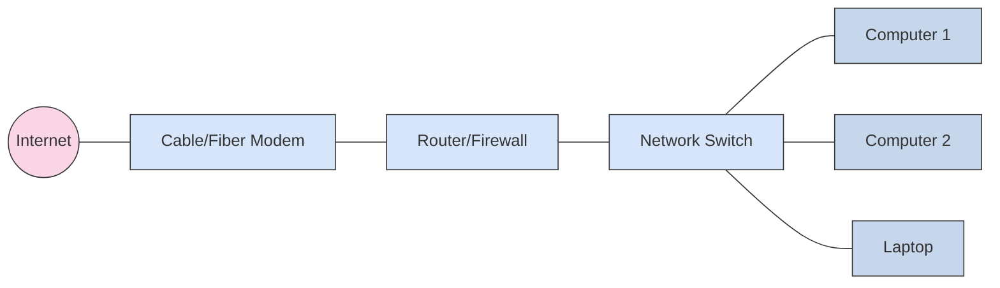

# Getting Started with Networking

## Welcome!

This guide will walk you through setting up your first network from scratch. Whether you're building a home lab, small office network, or learning networking fundamentals, you'll find step-by-step instructions to get up and running.

## What You'll Learn

By the end of this guide, you'll understand:

- Basic networking concepts and terminology
- How to plan a simple network
- How to connect and configure network devices
- How to verify connectivity and troubleshoot issues
- Security fundamentals

## Prerequisites

### Knowledge Requirements

- Basic computer literacy
- Familiarity with IP addresses (we'll cover the basics)
- Willingness to learn!

### Equipment Needed

For a basic home/lab network:

**Minimum Setup**:
- 1 Router (or combined router/modem from ISP)
- 1 Network switch (optional, 5-8 port unmanaged)
- Ethernet cables (Cat5e or Cat6)
- 2-3 computers/devices for testing

**Recommended Setup**:
- 1 Router/Firewall device
- 1 Managed switch (8-24 ports)
- 1 Wireless access point
- Ethernet cables
- Multiple test devices

## Step 1: Understanding Network Basics

### What is a Network?

A network connects multiple devices so they can communicate and share resources (files, printers, internet access).

### Key Components



#### Modem
Connects your network to your Internet Service Provider (ISP). Converts ISP's signal (cable, fiber, DSL) to Ethernet.

#### Router
Directs traffic between your network and the internet. Provides:
- Network Address Translation (NAT)
- Firewall protection
- DHCP (automatic IP addressing)
- Wireless (if combined router/AP)

#### Switch
Connects multiple wired devices within your network. Provides:
- Multiple Ethernet ports (5, 8, 16, 24, 48 ports common)
- Fast local communication between devices
- Managed switches offer VLANs and advanced features

#### Wireless Access Point (AP)
Provides wireless connectivity for laptops, phones, tablets.

### IP Addressing Basics

Every device needs an IP address to communicate. Think of it like a street address.

**Common Home Network Ranges**:
- `192.168.0.0/24` (192.168.0.1 - 192.168.0.254)
- `192.168.1.0/24` (192.168.1.1 - 192.168.1.254)
- `10.0.0.0/24` (10.0.0.1 - 10.0.0.254)

**Example**: If your router is `192.168.1.1`, your computers might be:
- Computer 1: `192.168.1.10`
- Computer 2: `192.168.1.11`
- Laptop: `192.168.1.12`

## Step 2: Planning Your Network

### Determine Your Requirements

Ask yourself:

1. **How many devices?**
   - 1-5 devices: Simple router sufficient
   - 6-15 devices: Add a small switch
   - 16+ devices: Managed switch recommended

2. **Wired or Wireless?**
   - Desktops, servers, printers: Wired (faster, reliable)
   - Laptops, phones, tablets: Wireless (convenient)

3. **Internet Speed?**
   - Under 100 Mbps: Basic gigabit equipment fine
   - 100-500 Mbps: Ensure gigabit equipment throughout
   - 500+ Mbps: Consider 2.5 Gbps or 10 Gbps uplinks

4. **Special Needs?**
   - Gaming: Low latency, QoS support
   - Streaming: High bandwidth, strong WiFi
   - Work from home: VPN support, guest network
   - IoT devices: Separate VLAN for security

### Sample Network Designs

#### Scenario 1: Simple Home Network

**Needs**: 3 computers, 2 phones, internet sharing

```text
Internet → ISP Modem → Wireless Router
                          ├─ Computer 1 (wired)
                          ├─ Computer 2 (wired)
                          ├─ Computer 3 (wired)
                          ├─ Phone 1 (WiFi)
                          └─ Phone 2 (WiFi)
```

**Equipment**: Single wireless router with 4+ LAN ports

#### Scenario 2: Small Office Network

**Needs**: 8 computers, 1 server, 1 printer, WiFi for guests

```text
Internet → Modem → Router/Firewall → Switch
                                      ├─ 8 Computers
                                      ├─ File Server
                                      ├─ Printer
                                      └─ Wireless AP
```

**Equipment**: Router, 8-port switch, separate access point

#### Scenario 3: Home Lab/Advanced

**Needs**: Separate networks for home, lab, IoT, guest WiFi

```text
Internet → Modem → Firewall → Managed Switch
                                 ├─ VLAN 10: Home (computers, phones)
                                 ├─ VLAN 20: Lab (test equipment)
                                 ├─ VLAN 30: IoT (cameras, smart home)
                                 └─ VLAN 40: Guest WiFi
```

**Equipment**: Firewall appliance, managed switch, multiple APs

## Step 3: Physical Setup

### Cable Your Network

1. **Choose appropriate cables**:
   - **Cat5e**: Up to 1 Gbps, adequate for most home use
   - **Cat6**: Up to 10 Gbps (short runs), recommended
   - **Cat6a**: Up to 10 Gbps (long runs), future-proof

2. **Cable runs**:
   - Keep cables under 100 meters (328 feet)
   - Avoid running parallel to electrical for long distances
   - Label both ends of each cable
   - Use appropriate cable colors:
     - Blue: Regular network connections
     - Yellow: PoE, management, or special connections
     - Red: Crossover (rarely needed with modern equipment)

3. **Connect devices**:
   ```text
   Modem [WAN] → Router [WAN port]
   Router [LAN 1] → Switch [Uplink/Port 1]
   Switch [Port 2] → Computer 1
   Switch [Port 3] → Computer 2
   Switch [Port 4] → Printer
   ```

### Power On Equipment

Follow this order to avoid issues:

1. **Modem** - Wait for full sync (2-5 minutes)
   - Check lights: Power, Internet/Online should be solid
2. **Router** - Wait for boot (1-2 minutes)
   - Check lights: Power, WAN, LAN ports
3. **Switch** - Immediate startup
   - Check lights: Power, port link LEDs
4. **Computers/Devices** - Boot normally

## Step 4: Configure Your Router

### Access Router Management

1. **Find router's IP address**:
   - Common defaults: `192.168.1.1`, `192.168.0.1`, `10.0.0.1`
   - Check router label or documentation
   - On Windows: `ipconfig` (look for Default Gateway)
   - On Mac/Linux: `ip route show` or `netstat -rn`

2. **Open web browser**:
   ```text
   http://192.168.1.1
   ```

3. **Login**:
   - Common defaults: admin/admin, admin/password
   - **CRITICAL**: Change default password immediately!

### Essential Router Configuration

#### 1. Change Admin Password

Navigate to **Administration → Password** or **System → Password**

- Use strong password (12+ characters, mixed case, numbers, symbols)
- Store securely (password manager recommended)

#### 2. Configure WAN/Internet

Most routers auto-detect, but verify:

- **Connection Type**: DHCP, PPPoE, Static IP (ask your ISP)
- **DNS Servers**: Use ISP default or:
  - Google: `8.8.8.8`, `8.8.4.4`
  - Cloudflare: `1.1.1.1`, `1.0.0.1`
  - Quad9: `9.9.9.9`, `149.112.112.112`

#### 3. Configure LAN Network

Set your internal network addressing:

```text
LAN IP Address: 192.168.1.1
Subnet Mask: 255.255.255.0
DHCP Enabled: Yes
DHCP Range: 192.168.1.100 - 192.168.1.200
```

**Best Practice**: Reserve `192.168.1.2 - 192.168.1.99` for static IPs (servers, printers, network equipment)

#### 4. Configure Wireless (if applicable)

**2.4 GHz Network**:
- SSID: `YourNetwork-2G`
- Security: WPA3 (or WPA2 if WPA3 unavailable)
- Password: Strong passphrase (15+ characters)
- Channel: 1, 6, or 11 (avoid interference)

**5 GHz Network**:
- SSID: `YourNetwork-5G`
- Security: WPA3 (or WPA2)
- Password: Same as 2.4 GHz (for convenience)
- Channel: Auto or manually select uncongested channel

**Security Checklist**:
- ✅ Disable WPS (WiFi Protected Setup)
- ✅ Disable remote management
- ✅ Enable firewall
- ✅ Disable guest network (unless needed)

## Step 5: Verify Connectivity

### Test Local Network

#### Windows

Open Command Prompt:

```cmd
REM Check your IP configuration
ipconfig /all

REM Ping the router
ping 192.168.1.1

REM Ping another computer (if you know its IP)
ping 192.168.1.10
```

#### Mac/Linux

Open Terminal:

```bash
# Check your IP configuration
ip addr show  # or: ifconfig

# Ping the router
ping -c 4 192.168.1.1

# Ping another computer
ping -c 4 192.168.1.10
```

**Expected Results**:
- `Reply from 192.168.1.1` = Router reachable ✅
- `Request timed out` = Problem (see troubleshooting)

### Test Internet Connectivity

```bash
# Ping reliable internet hosts
ping -c 4 8.8.8.8        # Google DNS (tests routing)
ping -c 4 google.com     # Tests routing + DNS resolution
```

**Expected Results**:
- Both succeed = Full internet connectivity ✅
- IP succeeds, google.com fails = DNS problem
- Both fail = No internet (check modem, router WAN)

### Test Name Resolution

```bash
# Windows
nslookup google.com

# Mac/Linux
dig google.com
host google.com
```

Should return IP addresses like `172.217.x.x`.

## Step 6: Basic Troubleshooting

### Problem: Can't Access Router Web Interface

**Solutions**:
1. Verify router IP: `ipconfig` (Windows) or `ip route` (Linux)
2. Try different browser or incognito mode
3. Disable browser extensions
4. Factory reset router (last resort - check manual)

### Problem: No Internet Access

**Checklist**:
1. Check modem lights (Power, Online/Internet should be solid)
2. Check router WAN light (should be lit)
3. Reboot in order: modem (wait 2 min), router (wait 1 min), computer
4. Check router WAN settings match ISP requirements
5. Bypass router temporarily (connect computer directly to modem)
6. Contact ISP if modem shows no internet

### Problem: Can't Ping Other Computers

**Checklist**:
1. Verify both computers on same network (192.168.1.x)
2. Check Windows Firewall blocking ping
   ```cmd
   REM Allow incoming ICMP (ping) - Windows
   netsh advfirewall firewall add rule name="ICMP Allow incoming V4 echo request" protocol=icmpv4:8,any dir=in action=allow
   ```
3. Check cables and switch port lights
4. Verify computers have correct subnet mask (255.255.255.0)

### Problem: Slow WiFi

**Solutions**:
1. Move closer to access point/router
2. Change WiFi channel (use WiFi analyzer app)
3. Switch to 5 GHz band if available
4. Update router firmware
5. Check for interference (microwaves, cordless phones, baby monitors)
6. Limit connected devices

## Step 7: Secure Your Network

### Essential Security Measures

#### 1. Change All Default Passwords

- ✅ Router admin password
- ✅ WiFi password
- ✅ Switch management password (if managed switch)

#### 2. Update Firmware

Check for router/switch firmware updates monthly:
- Security patches
- Bug fixes
- New features

#### 3. Enable Firewall

Ensure router firewall is enabled (usually default):
- Block incoming unsolicited traffic
- Allow outbound connections
- Create exceptions only when necessary

#### 4. Guest Network

If guests need WiFi, create isolated guest network:
- Separate SSID: `YourNetwork-Guest`
- Isolated from main network (no access to your files/devices)
- Different password
- Optional: Time limits, bandwidth limits

#### 5. Disable Unused Services

In router settings, disable:
- UPnP (unless gaming consoles require it)
- Remote management (unless you specifically need it)
- Telnet (use SSH if available)
- WPS (vulnerable to attacks)

## Next Steps

### Continue Learning

Now that you have a working network, explore:

1. **Network Fundamentals**: Deep dive into [networking concepts](fundamentals.md)
2. **Monitoring**: Set up [network monitoring](troubleshooting.md)
3. **VLANs**: Segment your network for [security and organization](vlans.md)
4. **Advanced Routing**: Understand [routing protocols](routing.md)
5. **Automation**: Explore [PowerShell network automation](automation.md)

### Expand Your Network

Consider adding:
- **NAS (Network Attached Storage)**: Centralized file storage
- **VPN Server**: Secure remote access
- **Network Cameras**: Security monitoring
- **Home Automation**: Smart home integration
- **Separate VLANs**: Isolate IoT devices, guest WiFi, lab equipment

### Platform-Specific Guides

If you're using specific equipment:
- [Cisco Networking](cisco/index.md) - Enterprise switches and routers
- [UniFi Equipment](unifi/index.md) - Ubiquiti Dream Machine and APs

## Common Terms Glossary

- **DHCP**: Dynamic Host Configuration Protocol - Automatically assigns IP addresses
- **DNS**: Domain Name System - Converts names (google.com) to IP addresses
- **Gateway**: Router that connects your network to the internet
- **IP Address**: Unique identifier for each device (e.g., 192.168.1.10)
- **LAN**: Local Area Network - Your local network
- **MAC Address**: Hardware address burned into network card
- **NAT**: Network Address Translation - Shares one public IP among many devices
- **Subnet Mask**: Defines network size (255.255.255.0 = 254 usable addresses)
- **SSID**: Service Set Identifier - WiFi network name
- **WAN**: Wide Area Network - Internet/ISP connection
- **WPA2/WPA3**: WiFi security protocols

For complete terminology, see [Networking Glossary](glossary.md).

## Recommended Resources

### Books for Beginners
- "CompTIA Network+ Certification Guide" - Mike Meyers
- "Networking All-in-One For Dummies" - Doug Lowe

### Online Resources
- **Cisco Networking Academy** - Free courses
- **Professor Messer** - Free Network+ video training
- **YouTube Channels**: NetworkChuck, David Bombal, CBT Nuggets

### Practice
- **Packet Tracer** - Cisco's free network simulator
- **GNS3** - Advanced network simulation
- **Home Lab** - Build your own physical lab

## Getting Help

If you're stuck:

1. **Check this documentation**:
   - [Troubleshooting Guide](troubleshooting.md)
   - [Network Fundamentals](fundamentals.md)

2. **Community Resources**:
   - Reddit: r/HomeNetworking, r/networking
   - Forums: Ubiquiti Community, Cisco Community
   - Stack Exchange: Network Engineering

3. **Manufacturer Support**:
   - Check equipment manufacturer's knowledge base
   - Contact technical support if under warranty

---

**Congratulations!** You've built your first network. Keep learning, experimenting, and building your networking skills.

*For more advanced topics, explore the other guides in this networking documentation section.*
