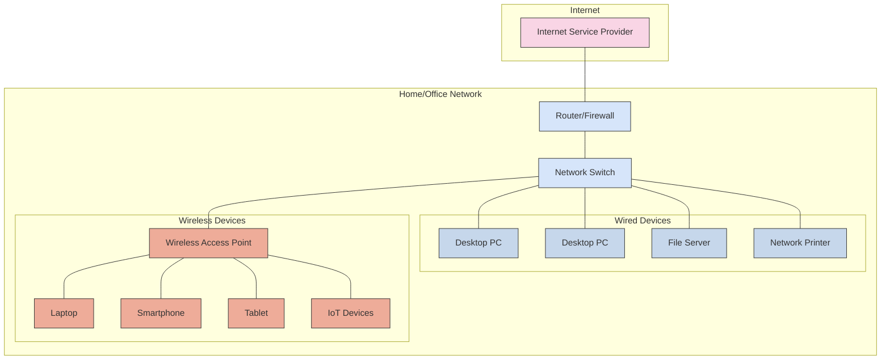

This section covers networking concepts, protocols, configuration guides, and troubleshooting for various networking equipment and software, as well as comprehensive guidance for designing, implementing, securing, and monitoring enterprise network environments.

## Network Fundamentals

### OSI Model

The OSI (Open Systems Interconnection) model is a conceptual framework used to understand network interactions in seven layers. For a detailed guide, see [OSI Model - Comprehensive Guide](osi-model.md).

```mermaid
flowchart TB
    subgraph "OSI Model"
        direction TB
        L7["Layer 7: Application Layer<br>HTTP, SMTP, FTP, DNS"]
        L6["Layer 6: Presentation Layer<br>TLS/SSL, JPEG, MPEG"]
        L5["Layer 5: Session Layer<br>NetBIOS, PPTP, RPC"]
        L4["Layer 4: Transport Layer<br>TCP, UDP"]
        L3["Layer 3: Network Layer<br>IP, ICMP, OSPF"]
        L2["Layer 2: Data Link Layer<br>Ethernet, PPP, HDLC"]
        L1["Layer 1: Physical Layer<br>Cables, Hubs, Repeaters"]
        
        L7 --- L6
        L6 --- L5
        L5 --- L4
        L4 --- L3
        L3 --- L2
        L2 --- L1
    end
    
    subgraph "Data Units"
        D7["Data"]
        D6["Data"]
        D5["Data"]
        D4["Segments/Datagrams"]
        D3["Packets"]
        D2["Frames"]
        D1["Bits"]
        
        D7 --- D6
        D6 --- D5
        D5 --- D4
        D4 --- D3
        D3 --- D2
        D2 --- D1
    end
    
    subgraph "Devices"
        Dev7["Application Gateway<br>Proxy"]
        Dev6[""]
        Dev5[""]
        Dev4["Firewall<br>Load Balancer"]
        Dev3["Router<br>Layer 3 Switch"]
        Dev2["Switch<br>Bridge"]
        Dev1["Hub<br>Repeater<br>Cable"]
        
        Dev7 --- Dev6
        Dev6 --- Dev5
        Dev5 --- Dev4
        Dev4 --- Dev3
        Dev3 --- Dev2
        Dev2 --- Dev1
    end
    
    L7 --- D7
    L6 --- D6
    L5 --- D5
    L4 --- D4
    L3 --- D3
    L2 --- D2
    L1 --- D1
    
    D7 --- Dev7
    D6 --- Dev6
    D5 --- Dev5
    D4 --- Dev4
    D3 --- Dev3
    D2 --- Dev2
    D1 --- Dev1
    
    classDef application fill:#f9d5e5,stroke:#333
    classDef presentation fill:#eeac99,stroke:#333
    classDef session fill:#e06377,stroke:#333
    classDef transport fill:#c83349,stroke:#333
    classDef network fill:#5b9aa0,stroke:#333
    classDef datalink fill:#d6e5fa,stroke:#333
    classDef physical fill:#c6d7eb,stroke:#333
    
    class L7,D7,Dev7 application
    class L6,D6,Dev6 presentation
    class L5,D5,Dev5 session
    class L4,D4,Dev4 transport
    class L3,D3,Dev3 network
    class L2,D2,Dev2 datalink
    class L1,D1,Dev1 physical
```

### Basic Network Topology

A typical home or small office network structure:



## Getting Started

### Prerequisites

Before diving into networking topics, it's helpful to have:

1. **Basic Knowledge**:
   - Understanding of IP addressing and subnetting
   - Familiarity with OSI model and basic networking concepts
   - Knowledge of common protocols (TCP/IP, DNS, DHCP)

2. **Tools for Network Analysis**:
   - Wireshark or tcpdump for packet analysis
   - Ping and traceroute utilities
   - SSH client for device access

3. **Lab Environment** (optional but recommended):
   - Virtual network with GNS3 or Packet Tracer
   - Small physical lab with switches and routers

### First Steps

#### 1. Understanding Network Fundamentals

Start with these fundamental concepts:

- **IP Addressing**: Learn IPv4/IPv6 addressing and subnetting
- **Network Protocols**: Understand TCP, UDP, ICMP, and application protocols
- **Network Devices**: Learn the functions of routers, switches, firewalls

#### 2. Hands-on Practice

For Unifi equipment:

```bash
# Access Unifi Controller
https://unifi.local:8443

# Basic troubleshooting commands
ping 8.8.8.8
traceroute google.com
nslookup example.com
```

For general networking diagnostics:

```bash
# Check interface status
ip addr show

# View routing table
ip route

# Scan open ports on a server
nmap -A 192.168.1.1
```

### Common Tasks

#### Configuring a Network Device

1. Connect to device via SSH or console
2. Enter configuration mode
3. Set IP addresses, VLANs, and routing parameters
4. Save configuration

#### Troubleshooting Connectivity Issues

1. Verify physical connectivity (cables, link lights)
2. Check IP configuration (address, subnet mask, gateway)
3. Test local network connectivity (ping local gateway)
4. Test internet connectivity (ping public DNS)
5. Examine routing tables and firewall rules

### Next Steps

- Learn about [VLANs and network segmentation](https://en.wikipedia.org/wiki/Virtual_LAN)
- Explore [network security best practices](https://www.cisco.com/c/en/us/support/docs/ip/access-lists/13608-21.html)
- Study [routing protocols](https://en.wikipedia.org/wiki/Routing_protocol) (OSPF, BGP, EIGRP)

## Topics

- [Unifi Dream Machine](unifi/index.md) - Configuration and operation of the Unifi networking equipment.

## Enterprise Network Architecture

### Network Architecture Overview

### Enterprise Network Design Principles

```text
┌─────────────────────────────────────────────────────────────────┐
│                Enterprise Network Architecture                  │
├─────────────────────────────────────────────────────────────────┤
│  Layer              │ Components                                │
│  ├─ Core            │ High-speed backbone, redundancy           │
│  ├─ Distribution    │ Routing, VLAN termination, security       │
│  ├─ Access          │ End-user connectivity, PoE, security      │
│  ├─ WAN/Internet    │ ISP connections, VPN, SD-WAN              │
│  ├─ DMZ             │ Public services, web servers, email   v   │
│  └─ Management      │ Out-of-band, monitoring, administration   │
└─────────────────────────────────────────────────────────────────┘
```

### Network Infrastructure Components

- **Core Infrastructure**: High-performance routing and switching
- **Network Security**: Firewalls, IDS/IPS, network access control
- **Wireless Networks**: Enterprise Wi-Fi, mobility, guest access
- **WAN Connectivity**: Internet, MPLS, SD-WAN, VPN technologies
- **Network Management**: Monitoring, configuration, automation

## Network Design and Planning

### Hierarchical Network Design

Modern enterprise networks follow a hierarchical design model that provides:

- **Scalability**: Easy to expand and modify
- **Redundancy**: Multiple paths for fault tolerance
- **Performance**: Optimized traffic flow
- **Manageability**: Simplified troubleshooting and maintenance
- **Security**: Segmentation and access control

### VLAN Strategy and Implementation

```powershell
<#
.SYNOPSIS
    Enterprise VLAN management and automation framework.
.DESCRIPTION
    Provides comprehensive VLAN planning, implementation, and monitoring
    for enterprise network environments.
#>

class NetworkVLAN {
    [int]$VLANId
    [string]$Name
    [string]$Description
    [string]$IPSubnet
    [string]$Gateway
    [string[]]$DHCPScope
    [string]$SecurityZone
    [hashtable]$AccessPolicies
    [bool]$InterVLANRouting
    [string[]]$AllowedVLANs
    [hashtable]$QoSPolicies
    
    NetworkVLAN([int]$Id, [string]$Name, [string]$Subnet) {
        $this.VLANId = $Id
        $this.Name = $Name
        $this.IPSubnet = $Subnet
        $this.Description = ""
        $this.SecurityZone = "Standard"
        $this.AccessPolicies = @{}
        $this.InterVLANRouting = $true
        $this.AllowedVLANs = @()
        $this.QoSPolicies = @{}
        
        # Calculate gateway (first usable IP in subnet)
        $Network = [System.Net.IPAddress]::Parse($Subnet.Split('/')[0])
        $this.Gateway = $Network.ToString()
    }
    
    [string] GenerateSwitchConfig([string]$SwitchType) {
        switch ($SwitchType) {
            "Cisco" {
                return $this.GenerateCiscoConfig()
            }
            "HPE" {
                return $this.GenerateHPEConfig()
            }
            "Juniper" {
                return $this.GenerateJuniperConfig()
            }
            default {
                return $this.GenerateGenericConfig()
            }
        }
    }
    
    [string] GenerateCiscoConfig() {
        $Config = @"
! VLAN $($this.VLANId) Configuration
vlan $($this.VLANId)
 name $($this.Name)
 state active
exit

! SVI Configuration
interface vlan$($this.VLANId)
 description $($this.Description)
 ip address $($this.Gateway) $(($this.IPSubnet -split '/')[1])
 no shutdown
exit

"@
        
        if ($this.QoSPolicies.Count -gt 0) {
            $Config += @"
! QoS Configuration
interface vlan$($this.VLANId)
 service-policy input $($this.QoSPolicies.InputPolicy)
 service-policy output $($this.QoSPolicies.OutputPolicy)
exit

"@
        }
        
        return $Config
    }
    
    [string] GenerateHPEConfig() {
        return @"
# VLAN $($this.VLANId) Configuration
vlan $($this.VLANId)
   name "$($this.Name)"
   untagged 1-24
   ip address $($this.Gateway) $($this.IPSubnet)
   exit

"@
    }
    
    [string] GenerateGenericConfig() {
        return @"
VLAN Configuration:
  VLAN ID: $($this.VLANId)
  Name: $($this.Name)
  Description: $($this.Description)
  IP Subnet: $($this.IPSubnet)
  Gateway: $($this.Gateway)
  Security Zone: $($this.SecurityZone)
  Inter-VLAN Routing: $($this.InterVLANRouting)

"@
    }
}

class NetworkManager {
    [hashtable]$VLANs
    [hashtable]$Subnets
    [hashtable]$Devices
    [string]$ConfigPath
    [string]$BackupPath
    
    NetworkManager([string]$ConfigurationPath) {
        $this.VLANs = @{}
        $this.Subnets = @{}
        $this.Devices = @{}
        $this.ConfigPath = $ConfigurationPath
        $this.BackupPath = Join-Path (Split-Path $ConfigurationPath) "Backups"
        
        # Ensure directories exist
        foreach ($Path in @($this.ConfigPath, $this.BackupPath)) {
            $Dir = if (Test-Path $Path -PathType Leaf) { Split-Path $Path } else { $Path }
            if (!(Test-Path $Dir)) {
                New-Item -ItemType Directory -Path $Dir -Force | Out-Null
            }
        }
        
        $this.LoadConfiguration()
    }
    
    [NetworkVLAN] CreateVLAN([int]$VLANId, [string]$Name, [string]$Subnet) {
        if ($this.VLANs.ContainsKey($VLANId)) {
            throw "VLAN $VLANId already exists"
        }
        
        $VLAN = [NetworkVLAN]::new($VLANId, $Name, $Subnet)
        $this.VLANs[$VLANId] = $VLAN
        
        $this.LogActivity("VLANCreated", "Created VLAN $VLANId : $Name ($Subnet)")
        $this.SaveConfiguration()
        
        return $VLAN
    }
    
    [void] RemoveVLAN([int]$VLANId) {
        if (!$this.VLANs.ContainsKey($VLANId)) {
            throw "VLAN $VLANId not found"
        }
        
        $VLANName = $this.VLANs[$VLANId].Name
        $this.VLANs.Remove($VLANId)
        
        $this.LogActivity("VLANRemoved", "Removed VLAN $VLANId : $VLANName")
        $this.SaveConfiguration()
    }
    
    [string] GenerateNetworkDocumentation() {
        $Documentation = @"
# Network Infrastructure Documentation

Generated on: $(Get-Date)

## VLAN Summary

| VLAN ID | Name | Subnet | Gateway | Security Zone | Inter-VLAN Routing |
|---------|------|--------|---------|---------------|-------------------|
"@
        
        foreach ($VLAN in ($this.VLANs.Values | Sort-Object VLANId)) {
            $Documentation += "| $($VLAN.VLANId) | $($VLAN.Name) | $($VLAN.IPSubnet) | $($VLAN.Gateway) | $($VLAN.SecurityZone) | $($VLAN.InterVLANRouting) |`n"
        }
        
        $Documentation += @"

## Network Topology

    Internet
        │
        ▼
    [Firewall/Router]
        │
        ▼
    [Core Switch]
        │
        ├─── VLAN 100 (Management)
        ├─── VLAN 200 (Servers)
        ├─── VLAN 300 (Workstations)
        ├─── VLAN 400 (Guest)
        └─── VLAN 500 (IoT)

## Security Policies

### Network Segmentation

- Management VLAN isolated with restricted access
- Server VLAN with application-specific rules
- Workstation VLAN with standard user access
- Guest VLAN with internet-only access
- IoT VLAN with minimal required connectivity

### Access Control Lists

- Deny all by default
- Explicit allow rules for required traffic
- Logging enabled for security monitoring
- Regular review and updates

"@

        return $Documentation
    }
    
    [hashtable] PerformNetworkAnalysis() {
        $Analysis = @{
            TotalVLANs = $this.VLANs.Count
            VLANUtilization = @{}
            SecurityIssues = @()
            Recommendations = @()
            SubnetOverlaps = @()
        }
        
        # Check for subnet overlaps
        $Subnets = $this.VLANs.Values | ForEach-Object { $_.IPSubnet }
        for ($i = 0; $i -lt $Subnets.Count; $i++) {
            for ($j = $i + 1; $j -lt $Subnets.Count; $j++) {
                if ($this.CheckSubnetOverlap($Subnets[$i], $Subnets[$j])) {
                    $Analysis.SubnetOverlaps += @{
                        Subnet1 = $Subnets[$i]
                        Subnet2 = $Subnets[$j]
                        Severity = "High"
                    }
                }
            }
        }
        
        # Security analysis
        foreach ($VLAN in $this.VLANs.Values) {
            if ($VLAN.SecurityZone -eq "Standard" -and $VLAN.VLANId -lt 100) {
                $Analysis.SecurityIssues += @{
                    VLAN = $VLAN.VLANId
                    Issue = "Management VLAN should be in secure zone"
                    Severity = "Medium"
                    Recommendation = "Change security zone to 'Management'"
                }
            }
            
            if ($VLAN.InterVLANRouting -eq $true -and $VLAN.SecurityZone -eq "Guest") {
                $Analysis.SecurityIssues += @{
                    VLAN = $VLAN.VLANId
                    Issue = "Guest VLAN allows inter-VLAN routing"
                    Severity = "High"
                    Recommendation = "Disable inter-VLAN routing for guest networks"
                }
            }
        }
        
        # Generate recommendations
        if ($Analysis.SubnetOverlaps.Count -gt 0) {
            $Analysis.Recommendations += "Resolve subnet overlaps to prevent routing issues"
        }
        
        if ($Analysis.SecurityIssues.Count -gt 0) {
            $Analysis.Recommendations += "Address security configuration issues"
        }
        
        if ($Analysis.TotalVLANs -gt 50) {
            $Analysis.Recommendations += "Consider VLAN consolidation for better management"
        }
        
        return $Analysis
    }
    
    [bool] CheckSubnetOverlap([string]$Subnet1, [string]$Subnet2) {
        # Simplified overlap check - would need more sophisticated implementation
        $Network1 = $Subnet1.Split('/')[0]
        $Network2 = $Subnet2.Split('/')[0]
        
        # Basic check for same network
        return $Network1 -eq $Network2
    }
    
    [void] SaveConfiguration() {
        $ConfigData = @{
            VLANs = @{}
            Devices = $this.Devices
            LastModified = Get-Date
            Version = "1.0"
        }
        
        # Convert VLANs to serializable format
        foreach ($VLANId in $this.VLANs.Keys) {
            $VLAN = $this.VLANs[$VLANId]
            $ConfigData.VLANs[$VLANId] = @{
                VLANId = $VLAN.VLANId
                Name = $VLAN.Name
                Description = $VLAN.Description
                IPSubnet = $VLAN.IPSubnet
                Gateway = $VLAN.Gateway
                DHCPScope = $VLAN.DHCPScope
                SecurityZone = $VLAN.SecurityZone
                AccessPolicies = $VLAN.AccessPolicies
                InterVLANRouting = $VLAN.InterVLANRouting
                AllowedVLANs = $VLAN.AllowedVLANs
                QoSPolicies = $VLAN.QoSPolicies
            }
        }
        
        $ConfigData | ConvertTo-Json -Depth 10 | Out-File -FilePath $this.ConfigPath -Encoding UTF8
    }
    
    [void] LoadConfiguration() {
        if (Test-Path $this.ConfigPath) {
            try {
                $ConfigData = Get-Content $this.ConfigPath | ConvertFrom-Json
                
                # Load VLANs
                foreach ($VLANId in $ConfigData.VLANs.PSObject.Properties.Name) {
                    $VLANData = $ConfigData.VLANs.$VLANId
                    $VLAN = [NetworkVLAN]::new($VLANData.VLANId, $VLANData.Name, $VLANData.IPSubnet)
                    
                    # Restore all properties
                    $VLAN.Description = $VLANData.Description
                    $VLAN.Gateway = $VLANData.Gateway
                    $VLAN.DHCPScope = $VLANData.DHCPScope
                    $VLAN.SecurityZone = $VLANData.SecurityZone
                    $VLAN.AccessPolicies = $VLANData.AccessPolicies
                    $VLAN.InterVLANRouting = $VLANData.InterVLANRouting
                    $VLAN.AllowedVLANs = $VLANData.AllowedVLANs
                    $VLAN.QoSPolicies = $VLANData.QoSPolicies
                    
                    $this.VLANs[$VLANId] = $VLAN
                }
                
                # Load devices
                if ($ConfigData.Devices) {
                    $this.Devices = $ConfigData.Devices
                }
            }
            catch {
                Write-Warning "Failed to load network configuration: $($_.Exception.Message)"
            }
        }
    }
    
    [void] LogActivity([string]$Action, [string]$Message) {
        $LogEntry = [PSCustomObject]@{
            Timestamp = Get-Date
            Action = $Action
            Message = $Message
            User = $env:USERNAME
            Computer = $env:COMPUTERNAME
        }
        
        $LogFile = Join-Path (Split-Path $this.ConfigPath) "Network-$(Get-Date -Format 'yyyyMM').log"
        $LogEntry | ConvertTo-Json -Compress | Out-File -FilePath $LogFile -Append -Encoding UTF8
    }
}

# Global functions for network management

function Initialize-NetworkManagement {
    [CmdletBinding()]
    param(
        [Parameter()]
        [string]$ConfigPath = "C:\NetworkInfrastructure\Configuration.json"
    )

    $Global:NetworkManager = [NetworkManager]::new($ConfigPath)
    
    Write-Host "Network Management initialized" -ForegroundColor Green
    Write-Host "Configuration path: $ConfigPath" -ForegroundColor White
}

function New-NetworkVLAN {
    [CmdletBinding()]
    param(
        [Parameter(Mandatory)]
        [int]$VLANId,

        [Parameter(Mandatory)]
        [string]$Name,
        
        [Parameter(Mandatory)]
        [string]$Subnet,
        
        [Parameter()]
        [string]$Description = "",
        
        [Parameter()]
        [string]$SecurityZone = "Standard"
    )
    
    if (!$Global:NetworkManager) {
        Initialize-NetworkManagement
    }
    
    try {
        $VLAN = $Global:NetworkManager.CreateVLAN($VLANId, $Name, $Subnet)
        $VLAN.Description = $Description
        $VLAN.SecurityZone = $SecurityZone
        
        Write-Host "VLAN $VLANId '$Name' created successfully" -ForegroundColor Green
        return $VLAN
    }
    catch {
        Write-Error "Failed to create VLAN: $($_.Exception.Message)"
    }
}

function Get-NetworkAnalysis {
    [CmdletBinding()]
    param(
        [Parameter()]
        [string]$ReportPath = "C:\NetworkInfrastructure\Reports\NetworkAnalysis.html"
    )

    if (!$Global:NetworkManager) {
        Initialize-NetworkManagement
    }
    
    $Analysis = $Global:NetworkManager.PerformNetworkAnalysis()
    
    # Generate HTML report
    $ReportHTML = @"
<!DOCTYPE html>
<html>
<head>
    <title>Network Infrastructure Analysis</title>
    <style>
        body { font-family: Arial, sans-serif; margin: 20px; }
        .header { background-color: #2196F3; color: white; padding: 15px; text-align: center; }
        .summary { background-color: #f8f9fa; padding: 15px; margin: 20px 0; border-left: 4px solid #2196F3; }
        table { border-collapse: collapse; width: 100%; margin: 10px 0; }
        th, td { border: 1px solid #ddd; padding: 8px; text-align: left; }
        th { background-color: #f2f2f2; }
        .critical { background-color: #ffebee; color: #d32f2f; font-weight: bold; }
        .high { background-color: #fff3e0; color: #f57c00; }
        .medium { background-color: #e3f2fd; color: #1976d2; }
        .low { background-color: #e8f5e8; color: #388e3c; }
    </style>
</head>
<body>
    <div class="header">
        <h1>Network Infrastructure Analysis</h1>
        <p>Generated on $(Get-Date)</p>
    </div>

    <div class="summary">
        <h2>Network Summary</h2>
        <ul>
            <li>Total VLANs: $($Analysis.TotalVLANs)</li>
            <li>Security Issues: $($Analysis.SecurityIssues.Count)</li>
            <li>Subnet Overlaps: $($Analysis.SubnetOverlaps.Count)</li>
        </ul>
    </div>
    
    <h2>Security Issues</h2>
    <table>
        <tr>
            <th>VLAN</th>
            <th>Issue</th>
            <th>Severity</th>
            <th>Recommendation</th>
        </tr>
"@

    foreach ($Issue in $Analysis.SecurityIssues) {
        $RowClass = $Issue.Severity.ToLower()
        $ReportHTML += @"
        <tr class="$RowClass">
            <td>$($Issue.VLAN)</td>
            <td>$($Issue.Issue)</td>
            <td>$($Issue.Severity)</td>
            <td>$($Issue.Recommendation)</td>
        </tr>
"@
    }

    $ReportHTML += @"
    </table>
    
    <h2>Recommendations</h2>
    <ul>
"@

    foreach ($Recommendation in $Analysis.Recommendations) {
        $ReportHTML += "        <li>$Recommendation</li>`n"
    }
    
    $ReportHTML += @"
    </ul>
    
    <p><em>Generated by Network Infrastructure Management System</em></p>
</body>
</html>
"@

    # Save report
    $ReportDir = Split-Path $ReportPath
    if (!(Test-Path $ReportDir)) {
        New-Item -ItemType Directory -Path $ReportDir -Force | Out-Null
    }
    
    $ReportHTML | Out-File -FilePath $ReportPath -Encoding UTF8
    
    Write-Host "Network analysis report generated: $ReportPath" -ForegroundColor Green
    
    return $Analysis
}

```

## Related Topics

- [Network Security](security/index.md)
- [Infrastructure Monitoring](../monitoring/index.md)
- [Windows Infrastructure](../windows/index.md)
- [Container Networking](../containers/index.md)
- [Disaster Recovery](../disaster-recovery/index.md)
