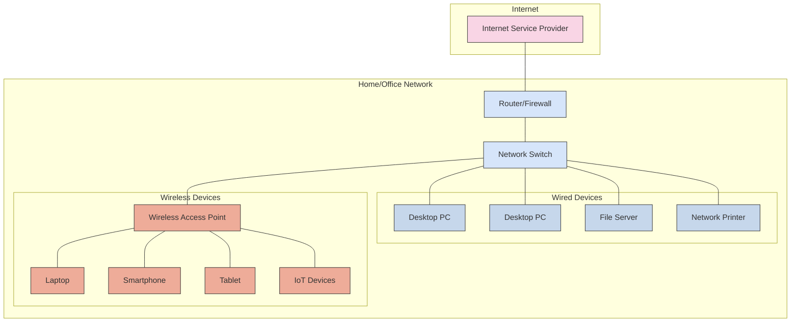

Welcome to the comprehensive networking documentation hub. Whether you're just starting with networking concepts or managing enterprise infrastructure, you'll find guides, tutorials, and reference materials organized by expertise level.

## Quick Navigation

### Learning Path

**New to networking?** Start here with fundamentals

- [Network Fundamentals](fundamentals.md) - Core concepts and protocols
- [OSI Model Guide](osi-model.md) - Deep dive into the seven layers

### Design & Architecture

**Planning network infrastructure?**

- [Enterprise Architecture](architecture.md) - Design principles and best practices
- [VLAN Strategy](vlans.md) - Segmentation and management

### Configuration & Guides

**Setting up equipment?**

- [Unifi Equipment](unifi/index.md) - UniFi Dream Machine, switches, APs
- [Common Tasks](guides.md) - Step-by-step configuration guides

### Automation & Operations

**Automating network tasks?**

- [PowerShell Automation](automation.md) - Network management scripts
- [Monitoring & Troubleshooting](troubleshooting.md) - Operations guide

## Network Fundamentals

### OSI Model

The OSI (Open Systems Interconnection) model is a conceptual framework used to understand network interactions in seven layers. For a detailed guide, see [OSI Model - Comprehensive Guide](osi-model.md).

```mermaid
flowchart TB
    subgraph "OSI Model"
        direction TB
        L7["Layer 7: Application Layer<br>HTTP, SMTP, FTP, DNS"]
        L6["Layer 6: Presentation Layer<br>TLS/SSL, JPEG, MPEG"]
        L5["Layer 5: Session Layer<br>NetBIOS, PPTP, RPC"]
        L4["Layer 4: Transport Layer<br>TCP, UDP"]
        L3["Layer 3: Network Layer<br>IP, ICMP, OSPF"]
        L2["Layer 2: Data Link Layer<br>Ethernet, PPP, HDLC"]
        L1["Layer 1: Physical Layer<br>Cables, Hubs, Repeaters"]
        
        L7 --- L6
        L6 --- L5
        L5 --- L4
        L4 --- L3
        L3 --- L2
        L2 --- L1
    end
    
    subgraph "Data Units"
        D7["Data"]
        D6["Data"]
        D5["Data"]
        D4["Segments/Datagrams"]
        D3["Packets"]
        D2["Frames"]
        D1["Bits"]
        
        D7 --- D6
        D6 --- D5
        D5 --- D4
        D4 --- D3
        D3 --- D2
        D2 --- D1
    end
    
    subgraph "Devices"
        Dev7["Application Gateway<br>Proxy"]
        Dev6[""]
        Dev5[""]
        Dev4["Firewall<br>Load Balancer"]
        Dev3["Router<br>Layer 3 Switch"]
        Dev2["Switch<br>Bridge"]
        Dev1["Hub<br>Repeater<br>Cable"]
        
        Dev7 --- Dev6
        Dev6 --- Dev5
        Dev5 --- Dev4
        Dev4 --- Dev3
        Dev3 --- Dev2
        Dev2 --- Dev1
    end
    
    L7 --- D7
    L6 --- D6
    L5 --- D5
    L4 --- D4
    L3 --- D3
    L2 --- D2
    L1 --- D1
    
    D7 --- Dev7
    D6 --- Dev6
    D5 --- Dev5
    D4 --- Dev4
    D3 --- Dev3
    D2 --- Dev2
    D1 --- Dev1
    
    classDef application fill:#f9d5e5,stroke:#333
    classDef presentation fill:#eeac99,stroke:#333
    classDef session fill:#e06377,stroke:#333
    classDef transport fill:#c83349,stroke:#333
    classDef network fill:#5b9aa0,stroke:#333
    classDef datalink fill:#d6e5fa,stroke:#333
    classDef physical fill:#c6d7eb,stroke:#333
    
    class L7,D7,Dev7 application
    class L6,D6,Dev6 presentation
    class L5,D5,Dev5 session
    class L4,D4,Dev4 transport
    class L3,D3,Dev3 network
    class L2,D2,Dev2 datalink
    class L1,D1,Dev1 physical
```

### TCP/IP Stack

The TCP/IP stack is the conceptual model and set of communication protocols used on the internet and similar networks. It is commonly known as the Internet Protocol Suite and is organized into four layers:

1. **Link Layer**: Handles the physical and logical connection between devices. (e.g., Ethernet)
2. **Internet Layer**: Responsible for addressing, routing, and packaging data. (e.g., IP, ICMP)
3. **Transport Layer**: Provides communication services directly to the application processes running on different hosts. (e.g., TCP, UDP)
4. **Application Layer**: Contains protocols for specific data communications services on a process-to-process level. (e.g., HTTP, FTP, SMTP)

### Addressing and Subnetting

- **IP Addressing**: Learn IPv4/IPv6 addressing and subnetting
- **Subnetting**: Dividing a network into smaller, manageable parts
- **CIDR**: Classless Inter-Domain Routing for IP address allocation

### Common Protocols

- **TCP/IP**: Transmission Control Protocol/Internet Protocol
- **HTTP/HTTPS**: HyperText Transfer Protocol/Secure
- **FTP/SFTP**: File Transfer Protocol/Secure
- **DNS**: Domain Name System
- **DHCP**: Dynamic Host Configuration Protocol
- **NAT/PAT**: Network Address Translation/Port Address Translation
- **VPN**: Virtual Private Network

## Infrastructure Components

### Hardware

- Switches
- Routers
- Firewalls
- Wireless Access Points

### Network Services

- DHCP
- DNS
- NAT/PAT
- VPN

## Enterprise Architecture

### Design Principles

```text
┌─────────────────────────────────────────────────────────────────┐
│                Enterprise Network Architecture                  │
├─────────────────────────────────────────────────────────────────┤
│  Layer              │ Components                                │
│  ├─ Core            │ High-speed backbone, redundancy           │
│  ├─ Distribution    │ Routing, VLAN termination, security       │
│  ├─ Access          │ End-user connectivity, PoE, security      │
│  ├─ WAN/Internet    │ ISP connections, VPN, SD-WAN              │
│  ├─ DMZ             │ Public services, web servers, email   v   │
│  └─ Management      │ Out-of-band, monitoring, administration   │
└─────────────────────────────────────────────────────────────────┘
```

### Network Topology

A typical home or small office network structure:



### VLAN Strategy

## Platform-Specific Guides

### Unifi Equipment

### Cisco Devices

### Arista Switches

## Automation and Scripting

### PowerShell Network Management

### Python Network Automation

### Ansible Playbooks

## Operations

### Monitoring and Alerting

### Troubleshooting

### Performance Tuning

### Disaster Recovery

## Reference

### Commands Cheat Sheet

### RFC Standards

### Best Practices

## Related Topics

- [Network Security](security/index.md)
- [Infrastructure Monitoring](../monitoring/index.md)
- [Windows Infrastructure](../windows/index.md)
- [Container Networking](../containers/index.md)
- [Disaster Recovery](../disaster-recovery/index.md)
