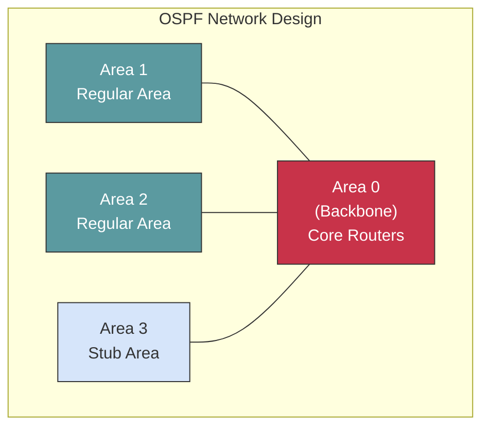

## Overview

Routing is the process of selecting paths in a network along which to send network traffic. Routers examine the destination IP address of a packet, determine the next-hop, and forward the packet accordingly. This guide covers routing fundamentals, static routing, and dynamic routing protocols.

## Prerequisites

Before diving into routing concepts, you should understand:

- [Network Fundamentals](fundamentals.md) - IP addressing and subnetting
- [OSI Model](osi-model.md) - Layer 3 Network Layer operations
- Basic TCP/IP concepts and packet forwarding

## Routing Fundamentals

### What is Routing?

Routing involves two basic activities:

1. **Determining optimal routing paths** - Building and maintaining routing tables
2. **Packet forwarding** - Moving packets from source to destination through intermediary routers

### Routing Table

A routing table contains information about network topology and determines the best path to reach destination networks. Each entry typically includes:

| Field | Description | Example |
|-------|-------------|---------|
| **Destination Network** | Target network address | 192.168.10.0/24 |
| **Subnet Mask** | Network mask | 255.255.255.0 |
| **Next Hop** | IP address of next router | 192.168.1.1 |
| **Interface** | Outgoing interface | eth0, GigabitEthernet0/1 |
| **Metric** | Path cost/preference | 10, 110 |
| **Administrative Distance** | Route source trustworthiness | 1 (static), 110 (OSPF) |

### Administrative Distance (AD)

Administrative Distance determines the trustworthiness of a routing protocol. Lower AD values are preferred:

| Route Source | AD Value | Use Case |
|--------------|----------|----------|
| Directly Connected | 0 | Always preferred |
| Static Route | 1 | Manual configuration |
| EIGRP Summary | 5 | Cisco proprietary |
| External BGP (eBGP) | 20 | Internet routing |
| Internal EIGRP | 90 | Cisco proprietary |
| OSPF | 110 | Enterprise standard |
| IS-IS | 115 | Service provider |
| RIP | 120 | Legacy networks |
| External EIGRP | 170 | Cisco proprietary |
| Internal BGP (iBGP) | 200 | Large enterprises |
| Unknown/Unreliable | 255 | Never used |

### Routing Metrics

Different protocols use different metrics to determine the best path:

- **Hop Count** (RIP) - Number of routers to destination
- **Bandwidth** (OSPF) - Link speed (higher is better)
- **Delay** (EIGRP) - Time to traverse the link
- **Load** (EIGRP) - Link utilization
- **Reliability** (EIGRP) - Error rate
- **Cost** (OSPF) - Calculated from bandwidth: Cost = 100,000,000 / bandwidth (bps)

## Static Routing

### Overview

Static routes are manually configured by network administrators. They provide explicit control over routing decisions and are ideal for small networks or specific routing requirements.

### Advantages of Static Routing

- **Predictable** - Routes never change unless manually modified
- **Secure** - No routing protocol advertisements
- **No overhead** - No routing protocol traffic or processing
- **Simple** - Easy to understand and troubleshoot
- **Precise control** - Administrator determines exact paths

### Disadvantages of Static Routing

- **Not scalable** - Manual configuration required for each route
- **No fault tolerance** - Routes don't adapt to topology changes
- **Administrative burden** - High maintenance in large networks
- **Prone to errors** - Manual configuration mistakes

### Static Route Types

#### Default Static Route

Points to a gateway for all unknown destinations (0.0.0.0/0):

```text
# Conceptual representation
ip route 0.0.0.0 0.0.0.0 192.168.1.1
```

**Use Case**: Small offices with single internet connection

#### Host Route

Specific route to a single host (/32 for IPv4):

```text
ip route 10.1.1.100 255.255.255.255 192.168.1.1
```

**Use Case**: Management access, specific server routing

#### Network Route

Route to a specific network:

```text
ip route 172.16.0.0 255.255.0.0 192.168.1.1
```

**Use Case**: Inter-site connectivity, branch office routing

#### Floating Static Route

Backup route with higher administrative distance:

```text
ip route 0.0.0.0 0.0.0.0 192.168.1.1       # AD = 1 (primary)
ip route 0.0.0.0 0.0.0.0 192.168.2.1 10    # AD = 10 (backup)
```

**Use Case**: Redundant WAN links, failover scenarios

## Dynamic Routing Protocols

### Overview

Dynamic routing protocols automatically discover routes, adapt to topology changes, and select optimal paths. They exchange routing information with neighboring routers to maintain up-to-date routing tables.

### Classification

#### By Scope

- **Interior Gateway Protocols (IGP)** - Within an autonomous system
  - RIP, OSPF, EIGRP, IS-IS
- **Exterior Gateway Protocols (EGP)** - Between autonomous systems
  - BGP

#### By Algorithm

- **Distance Vector** - Routes based on distance (hop count) and direction
  - RIP, IGRP, EIGRP (hybrid)
- **Link-State** - Each router has complete network topology
  - OSPF, IS-IS
- **Path Vector** - Routes based on path attributes and policies
  - BGP

### Routing Protocol Comparison

| Protocol | Type | Metric | Convergence | Scalability | Use Case |
|----------|------|--------|-------------|-------------|----------|
| **RIP** | Distance Vector | Hop Count | Slow | Small (max 15 hops) | Legacy, simple networks |
| **EIGRP** | Advanced Distance Vector | Composite | Fast | Medium-Large | Cisco-only networks |
| **OSPF** | Link-State | Cost (Bandwidth) | Fast | Large | Enterprise standard |
| **IS-IS** | Link-State | Cost | Fast | Very Large | Service providers |
| **BGP** | Path Vector | Path Attributes | Slow | Internet-scale | ISPs, large enterprises |

## RIP (Routing Information Protocol)

### Overview

RIP is one of the oldest distance-vector routing protocols, using hop count as its metric.

### Key Characteristics

- **Maximum hop count**: 15 (16 = unreachable)
- **Updates**: Periodic broadcasts every 30 seconds
- **Metric**: Hop count only
- **Convergence**: Slow (several minutes)
- **Versions**: RIPv1 (classful), RIPv2 (classless, VLSM support)

### Advantages

- Simple configuration
- Low resource requirements
- Well-understood and widely supported

### Disadvantages

- Limited scalability (15 hop maximum)
- Inefficient (broadcasts entire table every 30 seconds)
- Slow convergence
- Hop count doesn't consider bandwidth

### When to Use RIP

- Small networks (under 15 hops)
- Legacy systems requiring compatibility
- Test/lab environments
- Simple routing requirements

## OSPF (Open Shortest Path First)

### Overview

OSPF is a link-state IGP that uses Dijkstra's algorithm to calculate the shortest path. It's the most widely deployed IGP in enterprise networks.

### Key Characteristics

- **Metric**: Cost (based on bandwidth)
- **Updates**: Event-driven (topology changes only)
- **Hierarchical**: Area-based design (Area 0 is backbone)
- **Scalability**: Large networks with proper area design
- **Convergence**: Fast (subsecond to seconds)
- **Standard**: Open standard (RFC 2328)

### OSPF Areas



### OSPF Router Types

- **Internal Router (IR)** - All interfaces in same area
- **Backbone Router (BR)** - Interface in Area 0
- **Area Border Router (ABR)** - Connects multiple areas to Area 0
- **Autonomous System Boundary Router (ASBR)** - Connects OSPF to other routing domains

### OSPF Area Types

| Area Type | LSA Types Allowed | Use Case |
|-----------|-------------------|----------|
| **Standard Area** | All LSAs (1,2,3,4,5) | Default area type |
| **Stub Area** | 1,2,3 (no Type 5) | Reduce routing table size |
| **Totally Stubby Area** | 1,2 (no Type 3,4,5) | Cisco proprietary, minimal routes |
| **Not-So-Stubby Area (NSSA)** | 1,2,3,7 | Allow external routes into stub |

### Advantages of OSPF

- Fast convergence
- Efficient updates (only changes)
- Supports large networks with areas
- Vendor-neutral open standard
- Load balancing across equal-cost paths
- VLSM and CIDR support
- Authentication support

### Disadvantages of OSPF

- Complex configuration
- High CPU and memory requirements
- Requires careful area design
- Challenging to troubleshoot

### When to Use OSPF

- Enterprise networks (10+ routers)
- Requires vendor neutrality
- Hierarchical network design
- Fast convergence needed
- Link state awareness required

## EIGRP (Enhanced Interior Gateway Routing Protocol)

### Overview

EIGRP is Cisco's advanced distance-vector (hybrid) protocol, combining benefits of distance-vector and link-state protocols.

### Key Characteristics

- **Metric**: Composite (bandwidth, delay, load, reliability)
- **Updates**: Partial, bounded updates (only changes)
- **Algorithm**: DUAL (Diffusing Update Algorithm)
- **Convergence**: Very fast (subsecond)
- **Scalability**: Large networks
- **Protocol**: Cisco proprietary (some open implementations exist)

### EIGRP Terminology

- **Successor** - Best route to destination (primary path)
- **Feasible Successor** - Backup route meeting feasibility condition
- **Feasible Distance (FD)** - Best metric to destination
- **Reported Distance (RD)** - Neighbor's metric to destination
- **Feasibility Condition** - RD < FD (guarantees loop-free backup)

### Advantages of EIGRP

- Extremely fast convergence
- Efficient bandwidth usage (bounded updates)
- Loop-free topology (DUAL algorithm)
- Supports VLSM and CIDR
- Flexible metric calculation
- Easy configuration
- Unequal-cost load balancing

### Disadvantages of EIGRP

- Cisco proprietary (limited multi-vendor support)
- Opaque operation (complex troubleshooting)
- Can be memory intensive

### When to Use EIGRP

- Cisco-only network infrastructure
- Requires fast convergence
- Large networks with minimal configuration
- Unequal-cost load balancing needed

## BGP (Border Gateway Protocol)

### Overview

BGP is the path-vector protocol that routes traffic across the internet. It connects autonomous systems and makes routing decisions based on policies, paths, and network rules.

### Key Characteristics

- **Metric**: Path attributes (AS_PATH, LOCAL_PREF, MED, etc.)
- **Updates**: Incremental, triggered
- **Scalability**: Internet-scale (millions of routes)
- **Convergence**: Slow (minutes)
- **Standard**: Open standard (RFC 4271)
- **TCP-based**: Port 179

### BGP Types

- **eBGP (External BGP)** - Between different autonomous systems, AD=20
- **iBGP (Internal BGP)** - Within same autonomous system, AD=200

### Path Selection Criteria

BGP uses this order to select best path:

1. **Weight** (Cisco proprietary, local to router)
2. **Local Preference** (higher is better, within AS)
3. **Locally Originated** (routes from this router)
4. **AS_PATH** (shorter is better)
5. **Origin Type** (IGP > EGP > Incomplete)
6. **MED (Multi-Exit Discriminator)** (lower is better, between ASs)
7. **eBGP over iBGP** (external preferred)
8. **IGP metric** to BGP next-hop
9. **Oldest route** (stability)
10. **Lowest Router ID**

### Advantages of BGP

- Extremely scalable (Internet routing)
- Policy-based routing control
- Loop prevention (AS_PATH)
- Supports complex routing policies
- Standard protocol

### Disadvantages of BGP

- Complex configuration and operation
- Slow convergence
- Requires deep expertise
- High memory requirements

### When to Use BGP

- Multi-homed internet connections
- Enterprise connecting to multiple ISPs
- Service provider networks
- Traffic engineering requirements
- Policy-based routing needed

## Routing Protocol Selection Guide

### Small Networks (1-10 routers)

- **Recommended**: Static routing or OSPF
- **Why**: Simple management, predictable behavior
- **Alternative**: RIP if legacy compatibility required

### Medium Networks (10-50 routers)

- **Recommended**: OSPF (multi-vendor) or EIGRP (Cisco-only)
- **Why**: Scalable, fast convergence, efficient
- **Design**: Single OSPF area or EIGRP domain

### Large Networks (50+ routers)

- **Recommended**: OSPF with multi-area design
- **Why**: Hierarchical design reduces overhead
- **Design**: Multiple OSPF areas with Area 0 backbone
- **Alternative**: IS-IS for very large networks

### Internet Edge

- **Recommended**: BGP
- **Why**: Policy control, multi-homing support
- **Design**: eBGP to ISPs, iBGP internally if needed

### Hybrid Scenarios

Many networks use multiple protocols:

```text
Internet --- [BGP] --- Border Router --- [OSPF/EIGRP] --- Internal Network
```

- BGP for external connectivity and policy
- OSPF/EIGRP for fast internal routing
- Route redistribution at boundary

## Troubleshooting Routing

### Common Issues

#### Routes Not Appearing

**Check**:

- Routing protocol enabled on interface
- Network statement includes interface subnet
- No passive-interface configuration blocking updates
- Adjacent router compatibility (protocol version, authentication)

#### Routing Loops

**Symptoms**: Traffic circulates endlessly, high CPU, duplicate packets

**Causes**:

- Incorrect static routes
- Routing protocol misconfiguration
- Redistribution issues

**Solutions**:

- Use split horizon (distance-vector)
- Implement route filtering
- Check administrative distances

#### Suboptimal Routing

**Symptoms**: Traffic takes longer/expensive path

**Causes**:

- Incorrect metrics
- Asymmetric routing
- Missing routes

**Solutions**:

- Adjust metrics (OSPF cost, EIGRP bandwidth)
- Verify bidirectional reachability
- Check routing table on all hops

### Verification Commands

#### View Routing Table

```bash
# Linux
ip route show
route -n

# Windows
route print
```

#### Trace Route Path

```bash
# Linux/Mac
traceroute 8.8.8.8
mtr 8.8.8.8  # Real-time path monitoring

# Windows
tracert 8.8.8.8
```

## Best Practices

### General Routing

1. **Document everything** - Keep routing diagrams and configuration notes
2. **Use consistent addressing** - Simplifies troubleshooting and operations
3. **Implement redundancy** - Multiple paths for critical routes
4. **Monitor routing health** - Track route changes, flapping, convergence
5. **Plan capacity** - Consider routing table size and protocol overhead

### Dynamic Routing

1. **Use authentication** - Prevent rogue routers from injecting routes
2. **Implement route filtering** - Control route advertisement and acceptance
3. **Tune timers carefully** - Balance convergence speed vs. stability
4. **Design hierarchically** - Use areas (OSPF) or summarization (EIGRP)
5. **Test changes in lab** - Validate protocol changes before production

### Static Routing

1. **Document static routes** - Critical since they're invisible to protocols
2. **Use floating static routes** - Provide backup with higher AD
3. **Avoid routing loops** - Carefully plan bidirectional routing
4. **Consider default routes** - Simplify configuration at edge locations

## Related Topics

- [Network Fundamentals](fundamentals.md) - Core networking concepts
- [Enterprise Architecture](architecture.md) - Network design principles
- [Troubleshooting](troubleshooting.md) - Diagnostic procedures
- [Cisco Routing](cisco/index.md) - Cisco-specific routing configuration
- [Firewalls](firewalls.md) - Security and routing integration

## Next Steps

After understanding routing protocols:

1. Study [VLAN routing](vlans.md) for inter-VLAN communication
2. Explore [firewall rules](firewalls.md) and routing interaction
3. Learn platform-specific configuration:
   - [Cisco routing configuration](cisco/configuration.md)
4. Practice with [troubleshooting scenarios](troubleshooting.md)
5. Implement [automation scripts](automation.md) for route monitoring

## Additional Resources

- **RFC 2328** - OSPF Version 2
- **RFC 4271** - Border Gateway Protocol 4 (BGP-4)
- **RFC 2453** - RIP Version 2
- **Cisco EIGRP** - Enhanced Interior Gateway Routing Protocol
- **IS-IS Protocol** - ISO 10589 Intermediate System to Intermediate System

---

*This guide provides foundational routing knowledge. For platform-specific implementation details, see the vendor-specific guides in this documentation.*
